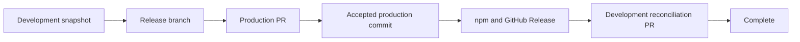

# Release and hotfix orchestration

Copilot treats a deployment as a durable, event-driven operation. The workflow
finishes after it creates a protected pull request; GitHub then wakes a separate
continuation when that PR is merged. A runner does not remain polling while
checks or reviews are pending.

## Recommended default



The same route in text is:

```text
develop@cut-SHA
  -> release/<version>@prepared-SHA
  -> PR to master
  -> accepted master merge-SHA
  -> immutable version tag + npm + GitHub Release
  -> master merge-SHA reconciled into current develop
  -> cleanup and issue completion
```

`master`, `develop`, `release`, and `sync` are defaults. Your configured branch
names and prefixes are snapshotted when the operation starts.

<Info>
  A release comes from the exact `development-branch` commit that existed when
  its release branch was cut. It does not come from production. Commits added
  later to development stay outside that release and are preserved during the
  final reconciliation.
</Info>

## Operator preflight

Complete this once before starting the first production-first operation:

- merge or install `copilot_deployment_orchestration.yml` and every enabled
  publishing workflow (`release_workflow.yml` and/or `hotfix_workflow.yml`) on
  the repository's default branch; this project enables both;
- ensure the workflow PAT belongs to a bot account different from the person
  launching the release and can write Contents, Issues, Pull requests, and
  Actions for this repository;
- allow merge commits, which `production-lineage` requires for an auditable
  ancestry relationship;
- enable repository auto-merge if selecting `auto-merge`, or configure every
  required check for `merge_group` if the target requires a merge queue;
- for this project's npm publication, create the exact `npm` Environment and
  both exact npm Trusted Publisher entries described below; and
- run `copilot doctor` after the new workflows and Variables are on the default
  branch.

GitHub resolves event and dispatch workflows through the default/base branch.
Installing the continuation only on a release branch is not sufficient: it must
already be present when a managed promotion PR closes.

## Release lifecycle

1. Copilot cuts `<release-tree>/<version>` from the exact current
   `development-branch` SHA and stores both the origin branch and origin SHA on
   the launcher issue.
2. Version files, build output, validation, and package smoke tests are committed
   on that frozen release branch.
3. Copilot creates or reuses one marked promotion PR from the release branch to
   `main-branch`, then asks GitHub for auto-merge, merge queue, or maintainer
   merge according to configuration.
4. The preparation run exits successfully. Pending checks are an external wait,
   not a workflow failure.
5. After the marked PR merges, Copilot verifies its repository, marker, stored
   head SHA, base, and accepted production SHA.
6. The publication continuation creates `v<version>` at that exact production
   SHA, publishes the package, waits for registry visibility, creates the
   GitHub Release, and updates the moving major Action tag.
7. Copilot creates or reuses a reconciliation PR into current development. The
   default source is the accepted production commit.
8. After reconciliation merges, Copilot applies cleanup, closes or retains the
   issue as configured, and marks the operation complete.

The immutable facts are visible in one issue control-center comment. Duplicate
events and retries update that comment instead of creating another operation.

## Hotfix lifecycle

A hotfix follows the same production-first route with one important origin
difference:

```text
latest accepted production tag
  -> hotfix/<next-patch-version>
  -> PR to production
  -> publish accepted production commit
  -> active release and/or development reconciliation
```

The hotfix origin SHA is the commit behind the selected production version tag,
not the current development head. If one active release exists, the default
`prefer-release` policy reconciles the hotfix into it so the release does not
lose the production fix. Without an active release it reconciles into
development. More than one active release blocks an ambiguous decision instead
of guessing.

## Configuration reference

Every value below is a bounded Action input, supported by `copilot setup`, and
persisted for the lifetime of an operation.

| Input | Default | Allowed values or limit | Use |
|---|---|---|---|
| `release-reconciliation-strategy` | `production-lineage` | `production-lineage`, `canonical-gitflow`, `manual` | Select the release source carried back after publication. |
| `hotfix-reconciliation-strategy` | `production-lineage` | `production-lineage`, `canonical-gitflow`, `manual` | Select the hotfix source carried back after publication. |
| `reconciliation-pr-mode` | `auto` | `auto`, `auto-merge`, `merge-queue`, `create-only` | Select who merges managed PRs. |
| `reconciliation-backmerge-mode` | `auto` | `auto`, `direct`, `sync-branch` | Select the reconciliation PR head shape. |
| `hotfix-active-release-policy` | `prefer-release` | `prefer-release`, `development`, `both` | Select hotfix reconciliation targets. |
| `reconciliation-tree` | `sync` | Safe Git ref prefix, 1–100 characters | Prefix for deterministic ephemeral branches. |
| `reconciliation-cleanup` | `all` | `all`, `source-only`, `sync-only`, `none` | Select branches removed only after all targets complete. |
| `reconciliation-issue-completion` | `close` | `close`, `keep-open` | Select final launcher-issue behavior. |
| `orchestration-presentation-mode` | `guided` | `guided`, `compact`, `quiet` | Select issue dashboard detail. |
| `orchestration-diagrams` | `true` | `true`, `false` | Show the fixed Mermaid view in guided mode. |
| `orchestration-comment-mode` | `update` | `update`, `milestones` | Update one dashboard or add at most four milestone comments. |

`production-lineage` is recommended because the development branch visibly
inherits the commit accepted in production. `canonical-gitflow` instead carries
the frozen release/hotfix head to development. `manual` publishes but creates no
reconciliation PR and always leaves the issue open.

`auto` PR mode selects a required merge queue first, native auto-merge when
available, and otherwise a maintainer-owned PR. Every mode leaves checks,
reviews, branch protection, and merge timing to GitHub; no release runner polls
an open PR.

`auto` back-merge mode uses a unique sync branch when a strict target has
advanced. The branch starts at the current target and receives the trusted
reconciliation commit server-side, preserving target-only commits and giving
target-dependent checks a unique head SHA.

### Setup file and Repository Variable mapping

Interactive `copilot setup` asks for these values. A non-interactive setup file
places them under `repository`, and setup writes the corresponding Repository
Variable when Variable management is enabled:

| Action input | Setup configuration key | Repository Variable |
|---|---|---|
| `release-reconciliation-strategy` | `repository.releaseReconciliationStrategy` | `RELEASE_RECONCILIATION_STRATEGY` |
| `hotfix-reconciliation-strategy` | `repository.hotfixReconciliationStrategy` | `HOTFIX_RECONCILIATION_STRATEGY` |
| `reconciliation-pr-mode` | `repository.reconciliationPullRequestMode` | `RECONCILIATION_PR_MODE` |
| `reconciliation-backmerge-mode` | `repository.reconciliationBackmergeMode` | `RECONCILIATION_BACKMERGE_MODE` |
| `hotfix-active-release-policy` | `repository.hotfixActiveReleasePolicy` | `HOTFIX_ACTIVE_RELEASE_POLICY` |
| `reconciliation-tree` | `repository.reconciliationTree` | `RECONCILIATION_TREE` |
| `reconciliation-cleanup` | `repository.reconciliationCleanup` | `RECONCILIATION_CLEANUP` |
| `reconciliation-issue-completion` | `repository.reconciliationIssueCompletion` | `RECONCILIATION_ISSUE_COMPLETION` |
| `orchestration-presentation-mode` | `repository.orchestrationPresentationMode` | `ORCHESTRATION_PRESENTATION_MODE` |
| `orchestration-diagrams` | `repository.orchestrationDiagrams` | `ORCHESTRATION_DIAGRAMS` |
| `orchestration-comment-mode` | `repository.orchestrationCommentMode` | `ORCHESTRATION_COMMENT_MODE` |

Action inputs are the runtime contract. Generated workflows read Repository
Variables and fall back to the same defaults. Once an operation starts, its
branch roles and orchestration choices are snapshotted; changing a Variable does
not rewrite an in-flight deployment.

A recommended non-interactive fragment is:

```yaml
repository:
  releaseReconciliationStrategy: production-lineage
  hotfixReconciliationStrategy: production-lineage
  reconciliationPullRequestMode: auto
  reconciliationBackmergeMode: auto
  hotfixActiveReleasePolicy: prefer-release
  reconciliationTree: sync
  reconciliationCleanup: all
  reconciliationIssueCompletion: close
  orchestrationPresentationMode: guided
  orchestrationDiagrams: true
  orchestrationCommentMode: update
```

### Invalid combinations

Copilot rejects configuration before mutation when:

- production and development are the same branch;
- a release, hotfix, or reconciliation prefix is empty, unsafe, or equals a
  long-lived branch;
- `merge-queue` is selected without required `merge_group` workflow support; or
- either reconciliation strategy is `manual` while issue completion is `close`.

Branch prefixes cannot contain whitespace, `..`, `@{`, Git ref control
characters, or a leading/trailing slash. Arbitrary refs, shell fragments, and
custom merge graphs are not accepted.

## Repository setup

Run `copilot setup` or copy the generated continuation and every enabled
publishing contract to the default branch before launching an operation:

- `release_workflow.yml` and/or `hotfix_workflow.yml`, according to the enabled
  features, each with internal `prepare` and `publish` modes;
- `copilot_deployment_orchestration.yml`, listening only to
  `pull_request: closed` and checking out the trusted PR base; and
- `merge_group: checks_requested` on every workflow that provides a required
  check for merge-queue targets.

This project enables both release and hotfix, so its installation contains all
three files. A consumer that enables only one deployment kind still requires
the shared continuation but does not need the other publishing workflow.

Promotion and reconciliation PRs are created with the PAT so their events can
wake GitHub Actions. Most events caused by the repository `GITHUB_TOKEN` do not
start another workflow run. Grant only the repository permissions needed by
enabled features: Contents read/write, Issues read/write, Pull requests
read/write, and Actions read/write for continuation dispatch. The supplied PR
workflow publishes its Check Run through a short-lived `GITHUB_TOKEN` with
job-local `checks: write`; the PAT does not need Checks permission for that
recommended path. Never use `pull_request_target` to execute a managed PR head.

### npm trusted publishing for this repository

The project workflows publish `@vypdev/copilot` from `ubuntu-latest` through
npm OIDC. No npm key is stored in GitHub.

1. In GitHub, create an Environment named exactly `npm` before the first run.
   Creating it implicitly from a workflow would leave it without protection
   rules. Add required reviewers only if you intentionally want a human
   publication gate; availability depends on repository visibility and the
   GitHub plan. No Environment secret is required for OIDC.
2. On npm, add GitHub Actions trusted publishers for organization `vypdev`,
   repository `copilot`, environment `npm`, and each workflow that publishes:
   `release_workflow.yml` and `hotfix_workflow.yml`. Enter only each filename,
   including its extension; every field is case-sensitive and must match
   exactly.
3. For both npm connections, set **Allowed actions** to permit direct
   **`npm publish`**. New publisher configurations may otherwise allow only
   staged publishing, while these project workflows deliberately run
   `npm publish --access public`.
4. Use npm CLI 11.5.1 or newer and Node 22.14.0 or newer. The project uses Node
   24 on `ubuntu-latest`, which satisfies that minimum. Self-hosted runners are
   not supported by npm Trusted Publishing.
5. Keep `package.json.repository.url` equal to
   `https://github.com/vypdev/copilot.git`; npm requires the package repository
   to match the publishing repository.
6. Keep `id-token: write` scoped only to the `publish-npm` job.
7. Do not define `NPM_TOKEN` or `NODE_AUTH_TOKEN` for this path. `npm whoami`
   is not an OIDC preflight because npm obtains the short-lived credential only
   during publication.

The job checks out the immutable tag, installs the frozen lockfile, validates
package name/version and tarball contents, smoke-tests the package, skips an
already-visible exact version, and polls `npm view` every 20 seconds for a
bounded 120 seconds by default. Before finalization it also verifies that npm's
registry `gitHead` matches the accepted production SHA.

The project-specific polling controls are Repository Variables, not Action
inputs:

| Variable | Default | Allowed range |
|---|---:|---:|
| `NPM_VISIBILITY_POLL_INTERVAL_SECONDS` | `20` seconds | `10`–`60` seconds |
| `NPM_VISIBILITY_TIMEOUT_SECONDS` | `120` seconds | `60`–`900` seconds |

An existing exact version is not blindly accepted: its version and `gitHead`
must match the checked-out immutable tag.

The project workflows above are specific to `@vypdev/copilot`: they compile,
validate, smoke-test, and publish npm. Reusable files under `setup/workflows`
are intentionally generic. They prepare the version, promote it, create the
tag and GitHub Release, and expose a publication extension point; they do not
build or publish `@vypdev/copilot` for consumer repositories. Consumers must
implement their own registry or deployment step and invoke
`published_deployment_action` with the same `operation-id` only after that
publication succeeds.

## Protected branches and merge queues

- Enable merge commits for managed production-lineage PRs; squash/rebase do not
  provide the ancestry guarantee required by this strategy.
- Enable repository auto-merge before explicitly selecting `auto-merge`.
- When a branch requires a merge queue, every required GitHub Actions check
  must run for `merge_group`. Confirm equivalent support for third-party checks
  such as code-health services before selecting queue mode.
- GitHub merge queues are available for organization-owned public repositories
  and organization-owned private repositories on Enterprise Cloud; they cannot
  be enabled by a branch-protection pattern containing `*`.
- Third-party CI must report on the temporary
  `gh-readonly-queue/<base>` branches generated by the queue. Confirm this for
  RepoWise or any equivalent required integration before making queue mode a
  release dependency.
- Strict development branches normally cause `auto` back-merge to use a sync
  branch when development advanced after the release cut.
- Closing a managed PR without merge blocks the operation; it never bypasses
  protection and never publishes from an unaccepted commit.

## What maintainers see

The launcher issue is the control center. `guided` shows status, a checklist,
diagram, current branch transition, next action, links, and collapsed technical
facts. `compact` removes the diagram and expanded context. `quiet` retains the
durable status, actionable failures, human requests, and completion without
routine detail.

Promotion PRs state that publication occurs only after merge. Reconciliation
PRs state prominently that the package is already public and that merging or
closing the PR cannot publish it again. Issue text follows `issues-locale`; PR
text follows `pull-requests-locale`; Spanish and English are built in, with a
safe English fallback.

A pending control center leads with meaning rather than internal identifiers:

```markdown
# Release 3.4.0

> **Current status:** Waiting for production acceptance
>
> **Action required:** Review or merge the production PR when its required
> checks pass.

## Progress
- [x] Release cut from `develop`
- [x] Version prepared and validated
- [ ] Promotion PR merged into `master`
- [ ] Package published
- [ ] Production reconciled into `develop`

[Open production PR](https://github.com/example/project/pull/42) ·
[Inspect prepared commit](https://github.com/example/project/commit/abc123)
```

After npm succeeds but reconciliation is pending, the primary message instead
states that the package is already public and that merging or closing the
reconciliation PR cannot publish it again. A completed view says that no action
is required. Real links, names, and hashes are sanitized and placed after these
user-facing facts.

## Recovery by visible phase

Start with the phase shown at the top of the issue control center:

```text
promotion_pr_pending
  open PR -> let GitHub finish checks/reviews
  closed unmerged -> reopen/correct the PR, then rerun prepare

publishing
  tag exists at stored production SHA -> rerun publish mode; tag is reused
  npm version exists -> rerun; package publish is skipped and verified
  tag points elsewhere -> stop and resolve the immutable-tag conflict

reconciliation_pending
  PR open -> merge through normal protection
  PR closed unmerged -> correct/reopen it, then replay the continuation
  package is already public -> never change version or republish

blocked
  retryable -> correct the stated cause and rerun the phase
  not retryable -> inspect stored SHAs/branches and choose an explicit recovery

completed
  no publication action is needed; replayed events are safe no-ops
```

If a workflow is canceled between tag creation and npm publication, rerun its
`publish` mode with the launcher issue and persisted operation ID. If npm or the
GitHub Release already exists, the continuation verifies and reuses it. An
immutable version tag at another SHA is never moved.

An issue without a current schema-v3 orchestration block is not resumable. Start
a fresh deployment operation after confirming that no version tag, npm package,
or GitHub Release was published manually. Copilot never guesses state from
labels or branches and never delegates to a second deployment implementation.

## External platform references

- [npm Trusted Publishing](https://docs.npmjs.com/trusted-publishers/)
- [GitHub Actions events](https://docs.github.com/en/actions/reference/workflows-and-actions/events-that-trigger-workflows)
- [Triggering workflows with a PAT or GitHub App](https://docs.github.com/en/actions/how-tos/write-workflows/choose-when-workflows-run/trigger-a-workflow)
- [GitHub merge queues](https://docs.github.com/en/repositories/configuring-branches-and-merges-in-your-repository/configuring-pull-request-merges/managing-a-merge-queue)
- [GitHub deployment environments](https://docs.github.com/en/actions/reference/workflows-and-actions/deployments-and-environments)

## Security and durable facts

The issue stores the operation ID, kind, version, exact release/hotfix source
SHA, release development-origin SHA or hotfix tag-origin SHA, branch roles,
strategy, publication workflow, production merge SHA, PR identities, and
reconciliation state. Secrets and OIDC claims are never persisted.

Continuation inputs are wake-up hints. Before mutation, Copilot reloads issue
state and requires the submitted `operation-id`, expected phase, same-repository
managed marker, exact branch pair, stored source SHA, and production
reachability to agree. A fork event, forged marker, stale dispatch, or reordered
delivery cannot authorize publication.
