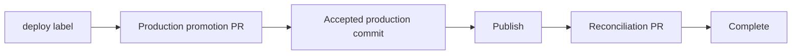

# Deploy lifecycle and compatibility

The `deploy` label starts a durable, production-first release or hotfix
operation. The recommended path does not publish first and does not keep a
runner polling pull-request checks.

Text equivalent: `deploy` label → protected production PR → accepted production
commit → publication → protected reconciliation PR → cleanup and completion.

See [Release and hotfix orchestration](/issues/deployment-orchestration) for the
complete branch, configuration, state, and recovery contract.

## Current behavior

1. Adding `deploy` to a configured release or hotfix issue dispatches the
   corresponding workflow in `prepare` mode.
2. The workflow prepares the frozen source branch and invokes the internal
   `prepare_deployment_action`.
3. Copilot creates or reuses one marked promotion PR to `main-branch` and exits
   successfully while GitHub owns checks, reviews, auto-merge, or merge queue.
4. `copilot_deployment_orchestration.yml` receives the marked PR's `closed`
   event. A verified merge dispatches the same release or hotfix workflow in
   `publish` mode.
5. The accepted production SHA is tagged and published. Only after publication
   is verified does Copilot replace `deploy` with `deployed`.
6. Copilot creates or reuses the configured reconciliation PR. Its merge wakes
   the continuation again, after which cleanup and issue completion run.

Pending PR checks are therefore an external wait, not a pending release runner.
Closing a managed PR without merging blocks the operation and never causes a
direct-merge bypass.

## What `deployed` means

- `deploy` means the launcher issue requested deployment and the operation is
  still preparing, promoting, or publishing.
- `deployed` means publication of the accepted production commit was verified.
  Reconciliation or cleanup may still be pending, so the issue control center
  remains the authoritative status.
- The issue closes, when configured, only after every reconciliation target and
  cleanup step completes.

## Internal orchestration actions

The supplied workflows coordinate four internal single actions:

| Action | Owner | Purpose |
|---|---|---|
| `prepare_deployment_action` | Release/hotfix workflow, `prepare` mode | Create or resume durable state and the production promotion PR. |
| `continue_deployment_action` | `copilot_deployment_orchestration.yml` | Verify a managed closed PR and dispatch the next phase. |
| `published_deployment_action` | Release/hotfix workflow, `publish` mode | Record verified publication and create reconciliation PRs. |
| `failed_deployment_action` | Release/hotfix failure job | Persist a retryable publication failure without losing completed facts. |

Do not invoke these manually. They require the exact issue and durable
`single-action-operation-id`; preparation additionally requires the version,
title, and changelog. Continuations reject missing, stale, forged, or mismatched
operation identities.

## `deployed_action` compatibility

`deployed_action` remains accepted for one migration period:

- when schema-v3 deployment state exists, it delegates to the state-aware
  orchestration path;
- when an older in-flight issue has no orchestration state, it retains the
  bounded legacy post-deploy behavior so that the issue can be completed; and
- new release and hotfix workflows must not use it as their normal publication
  entry point.

The legacy compatibility path may poll checks and may use `merge-timeout`.
`merge-timeout` has no effect on `auto`, `auto-merge`, `merge-queue`, or
`create-only`; those modes delegate waiting and merge enforcement to GitHub.

## Rollout prerequisite

Before starting the first operation with this design, merge or install the
shared continuation and every publishing workflow you enable on the
repository's default branch:

- `release_workflow.yml` when release is enabled;
- `hotfix_workflow.yml` when hotfix is enabled; and
- `copilot_deployment_orchestration.yml`.

This project enables both deployment kinds and therefore installs all three.
The continuation workflow must exist on the production/base branch before the
promotion PR closes, otherwise that close event cannot resume the operation.
Bot-created PRs use the workflow PAT because most events created with the
repository `GITHUB_TOKEN` do not start another workflow run.

## Recovery

Do not restart the whole release or change its version after a partial success.
Open the launcher issue control center and resume the displayed phase:

| Visible phase | Safe action |
|---|---|
| `promotion_pr_pending` | Complete or correct the marked production PR, then rerun `prepare` only if instructed. |
| `publishing` | Rerun `publish` with the same issue and operation ID; matching tags, npm versions, and releases are verified and reused. |
| `reconciliation_pending` | Complete or correct the reconciliation PR; the package is already public and is never republished. |
| `blocked` | Correct the reported cause and replay only the failed phase. |
| `completed` | No action is required; duplicate events are safe no-ops. |

An immutable version tag pointing to a different SHA is a hard conflict and is
never moved automatically.
