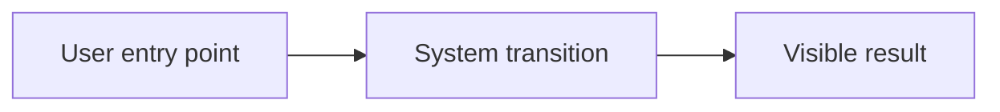
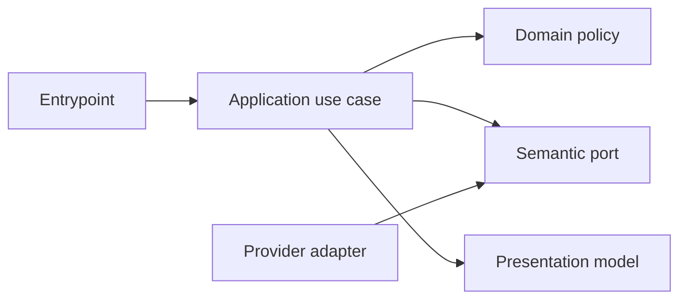

# <Product/Feature Specification Title>

- Status: Draft
- Date: YYYY-MM-DD
- Owners: <product/engineering owners>
- Scope: <one sentence>
- Related issues/PRs: <links>
- Required review gates: product UX, architecture, testing, documentation,
  security/operations
- Open decisions blocking readiness: <none or list>

> Start with the repository standard in [`README.md`](./README.md). Remove this
> note when the spec is ready. Mark a non-applicable section explicitly and give
> a reason instead of silently deleting the concern.

## 1. Executive summary

Describe the user-visible outcome, the recommended default, and the principal
safety/correctness rule in plain language.

```text
<One compact end-to-end flow in product terminology>
```

## 2. Problem, current behavior, and evidence

### 2.1 Problem

Who is affected, what they cannot understand/do safely, and why it matters.

### 2.2 Current behavior

Number the actual current sequence. Separate verified facts from assumptions.

### 2.3 Evidence

- Code/workflow/documentation references:
- Incidents or concrete examples:
- External primary sources:
- Unknowns:

## 3. Actors, surfaces, and terminology

| Actor | Goal | Entry point | Visible surfaces |
|---|---|---|---|
| <actor> | <goal> | <event/action> | <issue/PR/CLI/docs/etc.> |

Define product terms, branch/data roles, ownership of facts, and language that
must remain consistent across UI, code, tests, and documentation.

## 4. Goals, non-goals, and fixed invariants

### 4.1 Goals

1. <Measurable outcome>

### 4.2 Non-goals

1. <Explicitly excluded behavior>

### 4.3 Fixed product/safety invariants

1. <Rule that configuration cannot weaken>

## 5. Current versus proposed product journey

| Stage | Current | Proposed | User/operator effect |
|---|---|---|---|
| <stage> | <behavior> | <behavior> | <observable change> |

For three or more dependent transitions, add a visual and a textual equivalent:



Text equivalent: `<entry point> -> <transition> -> <visible result>`.

## 6. Functional behavior and state model

### 6.1 Happy path

1. <Observable step and owner>

### 6.2 Alternative paths

- <Supported alternative and consequence>

### 6.3 State machine

| State | Entered when | User-visible meaning | Allowed next states | Recovery/owner |
|---|---|---|---|---|
| <state> | <verified fact> | <plain language> | <states> | <action> |

Define duplicate, stale, out-of-order, canceled, and partially completed event
behavior where applicable.

## 7. User-facing configuration

| Input | Type | Recommended default | Allowed values/range | Scope/persistence |
|---|---|---|---|---|
| `<name>` | <type> | `<default>` — <reason> | <bounded values> | <scope/snapshot> |

Document:

- validation and invalid cross-field combinations;
- precedence and operation-time snapshot/reread behavior;
- migration, retired, unknown, and deprecated values;
- one recommended example and one meaningful alternative; and
- behavior intentionally not configurable.

## 8. Clean Architecture design

### 8.1 Responsibilities and dependency direction

| Layer/boundary | Owns | Must not own/import |
|---|---|---|
| Domain/pure policy | <decisions/invariants> | <provider/framework concerns> |
| Application | <use cases/semantic ports> | <concrete SDK/process concerns> |
| Adapters/data | <mapping/provider operations> | <product policy> |
| Infrastructure/composition | <implementations/wiring> | <business decisions> |
| Entrypoints | <input/event adaptation> | <duplicated orchestration> |
| Presentation | <view models/rendering> | <mutations/state transitions> |



### 8.2 Contracts, state, and trust boundaries

- Pure decisions:
- Application contracts:
- Semantic ports:
- Durable state/schema ownership:
- Concurrency/idempotency strategy:
- Trusted and untrusted inputs:
- Provider error mapping:

### 8.3 Executable architecture constraints

- <Dependency/cycle/contract/schema rule and its automated check>

## 9. UI/UX and content contract

Treat issues, PRs, comments, labels, checks, summaries, CLI output, and docs as UI
when applicable.

### 9.1 Information hierarchy

1. Current status
2. Completed facts
3. Next transition
4. Human action, or explicit statement that none is needed
5. Impact and inspectable links
6. Collapsed technical evidence

### 9.2 Representative primary view

```markdown
<!-- stable machine marker -->

# <Icon plus textual operation title>

> **Current status:** <plain-language state>
>
> **Action required:** <one instruction/link or "No action required">

## Progress

- [x] <completed fact>
- [ ] <current/pending fact>

## What happens next

<One concise consequence>

## Links

[Descriptive destination](...) · [Descriptive destination](...)

<details>
<summary>Technical details</summary>
<IDs, full hashes, provider facts, sanitized diagnostics>
</details>
```

Add concrete variants for:

- pending/no action;
- action required;
- blocked or failed before irreversible effects;
- partially successful after an irreversible effect; and
- completed.

### 9.3 Issue, PR, and comment behavior

- Deterministic titles and purpose:
- What merge/close/retry will do:
- Durable marker and idempotent update policy:
- Comment/notification budget:
- Labels and checks as supplemental state:
- Direct links and navigation:

### 9.4 Accessibility, localization, and responsive behavior

- Supported locales and fallback:
- Textual equivalent for visuals:
- Narrow/mobile and light/dark expectations:
- Heading/table/link rules:
- Sanitization of untrusted Markdown, mentions, commands, markers, and URLs:

## 10. Failure, recovery, and cleanup

| Failure/partial state | User impact | Retained facts | Automatic retry | Required action | Cleanup |
|---|---|---|---|---|---|
| <condition> | <impact> | <durable facts> | <yes/no/bounded> | <action/link> | <rule> |

User-facing errors follow `impact -> cause -> action -> retained state` and must
not imply that an already successful irreversible action failed.

## 11. Security, permissions, and privacy

1. <Least privilege and authorization>
2. <Untrusted input and execution boundary>
3. <Secret/PII/logging/storage rule>
4. <Abuse/replay/forgery protection>

## 12. Observability and operational UX

- User-facing state:
- Job Summary/operator evidence:
- Logs, metrics, and correlation:
- Pending external dependency versus workflow failure:
- Rate-limit/retry behavior:
- Noise/comment budget:

## 13. Compatibility, migration, rollout, and rollback

- Existing in-flight operations/data:
- Schema/configuration migration:
- Deprecated behavior and compatibility window:
- Rollout stages/feature flag if needed:
- Rollback and irreversible effects:

## 14. Testing strategy and numeric budget

The count is derived from the behavior/risk inventory and is a minimum, not a
substitute for requirement coverage.

| Area | Minimum distinct cases | Behaviors/risks covered |
|---|---:|---|
| Domain/configuration/pure planning | <n> | <list> |
| State/application/idempotency/races | <n> | <list> |
| Adapters/provider contracts | <n> | <list> |
| Workflows/setup/schema | <n> | <list> |
| UI/UX/localization/sanitization | <n> | <list> |
| Integration/security/migration | <n> | <list> |
| **Total** | **<n>** | No double counting |

Define:

- repository and changed-module coverage thresholds;
- pure-policy branch coverage;
- table-driven, replay, race, adapter, workflow-contract, and security tests;
- deterministic clocks/IDs/fakes with no real waits or live services;
- golden UI fixtures plus semantic assertions; and
- manual UX evidence for readability that automation cannot establish.

## 15. Documentation and discoverability

| Audience | Artifact/page | Required content | Validation/navigation |
|---|---|---|---|
| User | <page> | <journey/default/examples> | <route/link check> |
| Setup owner | <page> | <permissions/configuration> | <contract fixture> |
| Operator | <page> | <states/recovery/cleanup> | <decision tree> |
| Contributor | <page> | <architecture/contracts> | <architecture check> |

Include migration and troubleshooting documentation where applicable. Keep
examples synchronized with implementation fixtures or contract tests.

## 16. Acceptance scenarios

1. Given `<state>`, when `<event>`, then `<observable product result>`.
2. <Alternative/boundary/invalid case>
3. <Duplicate/out-of-order/cancellation/recovery case>
4. <Failure before irreversible effect>
5. <Partial success after irreversible effect>
6. <Security/permission/forged-input case>
7. <UI/accessibility/localization case>
8. <Documentation/configuration/architecture-contract case>

## 17. Requirements traceability

| Requirement | Policy/use case/adapter/presentation | Test or evidence | Documentation |
|---|---|---|---|
| `<section/item>` | <owner> | <test/evidence> | <page> |

## 18. Implementation sequence

1. Contracts, decisions, configuration, and architecture checks.
2. Pure policies and tests.
3. State/application orchestration and tests.
4. Adapters/workflows and contract tests.
5. Presentation, fixtures, accessibility, and localization.
6. Migration, recovery, security, documentation, and generated artifacts.
7. Integration, coverage, human UX evidence, and final validation.

Adjust ordering to risk and dependencies; do not postpone documentation or UX
until after behavior is considered complete.

## 19. Definition of Done

- [ ] Every normative requirement has acceptance and traceability.
- [ ] Architecture boundaries are implemented and automatically enforced.
- [ ] Numeric test budget, distribution, and coverage requirements pass.
- [ ] Configuration defaults, limits, validation, persistence, and migration agree.
- [ ] Primary UI states and content examples are implemented and reviewed.
- [ ] Accessibility, localization, responsive behavior, sanitization, and noise
      budgets pass.
- [ ] User/setup/operator/contributor documentation is complete and discoverable.
- [ ] Failure, partial success, retry, idempotency, security, and cleanup pass.
- [ ] Required generated artifacts and repository validation commands pass.
- [ ] No readiness-blocking decision remains unresolved.

## 20. References and decisions

- Primary sources:
- Related specs/ADRs/issues/PRs:
- Decisions and rejected alternatives:
- Follow-up work explicitly outside this spec:
