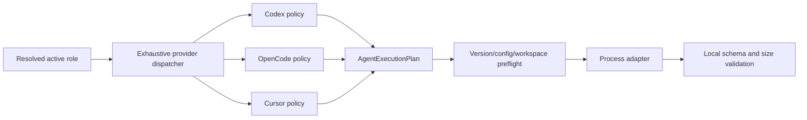

# Agent Execution Policy Hardening

- Status: Implemented — automated gates complete; controlled provider smoke remains external
- Date: 2026-09-11
- Last updated: 2026-09-12
- Catalog capability ID: `agent-runtime`
- Last verified: 2026-09-12 in the P1-C implementation worktree
- Owners: Copilot maintainers and security reviewers
- Scope: replace the shared permissive CLI policy with exhaustive provider
  plans, isolated runtime configuration, versioned runtime evidence, and
  fail-closed process execution
- Related issues/PRs: none recorded
- Required review gates: product UX, architecture, testing, documentation,
  security/operations, provider runtime smoke
- Open decisions blocking readiness: none

## 1. Executive summary

Every active agent role MUST resolve one complete `AgentExecutionPlan` before a
process starts. A compile-time exhaustive dispatcher delegates to separate
Codex, OpenCode, and Cursor policies. Each policy reconstructs argv and isolated
configuration from structured facts; repository/user command text cannot weaken
sandbox, network, approval, plugins, subagents, environment, persistence, or
output limits.

All roles keep Git/provider mutations in trusted Copilot code. `planner`,
`findings`, `reviewer`, and `tester` are workspace read-only. `fixer` may edit
the current workspace only; it still has no Git credentials, external write
authority, web/MCP/plugin/subagent access, or unsandboxed shell. Unsupported
provider/version/config combinations fail before spawn with a semantic action.

There are no installed users to preserve. The first implementation removes
`agent-command` and ships only structured configuration plus validated
executable selection; it contains no deprecation or compatibility path.

```text
role + provider + model + executable -> provider policy -> verified plan
                                        -> isolated files/env -> spawn -> schema validation
```

## 2. Problem, pre-implementation behavior, and evidence

### 2.1 Problem

One policy currently branches over all providers and returns unchanged arguments
when capability or provider is absent/unknown. Custom commands are validated and
then augmented, leaving a broad grammar and provider-specific bypass risk. The
policy is security-sensitive, but version/config behavior and effective
sandbox behavior are not a versioned executable contract.

### 2.2 Pre-implementation behavior

1. `enforceAgentExecutionPolicy` is fail-open for undefined capability and
   unknown provider.
2. Codex receives managed flags/config additions, but provider config ownership
   and effective-capability verification are incomplete.
3. OpenCode receives `--pure` and a named agent; Cursor receives sandbox/mode and
   fixer `--force`, but the controlled agent/config contents are not the plan's
   typed contract.
4. `AgentCliRequest` accepts optional provider/capability/environment and a full
   command string.
5. Process limits currently default to 15 minutes, 512 KiB prompt, and 4 MiB
   combined output.

### 2.3 Evidence

- Code: agent command parser/validation/defaults, execution policy, CLI client,
  provider-specific adapters, capability adapters, workflows, and setup policy.
- OpenAI Codex documentation confirms non-interactive sandbox, approval,
  strict/ignored user config, ignored rules, ephemeral sessions, output schema,
  network, history, environment, and multi-agent controls.
- OpenCode documentation confirms `--pure`, named agents, inline/isolated config,
  and allow/ask/deny permissions including edit, bash, web, task, skill, and
  external-directory authority.
- Cursor documentation confirms Ask mode, sandbox enablement, isolated config
  directory, file/command permissions, and `sandbox.json` controls for read-only/
  read-write paths and default-deny network.
- Verified local baseline versions on 2026-09-11: Codex CLI `0.153.4`, OpenCode
  `1.18.3`, and Cursor Agent `2026.09.10-fd3934a`.

### 2.4 Retrospective classification

Not applicable. This prospective SDD refines the catalogued as-built agent
runtime SDD.

## 3. Actors, surfaces, and terminology

| Actor | Goal | Entry point | Visible surfaces |
|---|---|---|---|
| Contributor | get useful agent output without hidden authority | GitHub workflow/command | comment, check, changed files |
| Repository owner | select provider/model while retaining safety | Variables/setup/CLI flags | config, doctor, provisioning |
| Maintainer | add/upgrade one provider without shared-policy regressions | code/runtime manifest | CI and docs |
| Security reviewer | prove effective authority before spawn | plan/config/smoke evidence | Job Summary and fixtures |

`Provider control plane` is the CLI's required connection to its model service.
`Agent tool egress` is network initiated by model-selected tools/commands and is
denied. A `managed artifact` is an ephemeral config/schema/sandbox file created
from trusted code and verified by hash. `Runtime manifest` is the exact
provider version and smoke evidence accepted by the runtime.

## 4. Goals, non-goals, and fixed invariants

### 4.1 Goals

1. Make provider/capability omission and every unknown value terminal before spawn.
2. Express full authority as a typed semantic plan, not mutated argv.
3. Keep provider policies independent and exhaustively dispatched.
4. Prove exact CLI version and managed-config behavior.
5. Preserve structured output, cancellation, timeout, and bounded process behavior.

### 4.2 Non-goals

1. This work does not add dynamic provider plugins or runtime registration.
2. It does not give agents GitHub tokens, Git credentials, publishing authority,
   or direct commit/push ownership.
3. It does not make sandbox/network/approval/environment limits configurable.
4. It does not support arbitrary custom CLI flags or wrapper scripts.
5. It does not guarantee provider model availability. Target-runner provisioning
   and execution preflight report CLI support; doctor reports setup/configuration
   and credential readiness rather than inspecting a different local runtime.

### 4.3 Fixed product and safety invariants

1. No process starts until plan, exact version, artifact hashes, workspace path,
   model tuple, and role are valid.
2. Read roles cannot write workspace; fixer cannot write outside workspace.
3. Agent-selected tools have default-deny network, no web/MCP/plugin/subagent,
   and no approval/escalation path.
4. Provider model credentials are available only to the provider control plane;
   agent child tools receive no secrets.
5. Git credential/prompt/SSH environment and mutation commands are absent.
6. Repository instructions, custom commands, provider/user config, and model
   output cannot broaden the plan.
7. Prompt 512 KiB, output 4 MiB, and timeout 15 minutes remain hard maxima.
8. `agent-command` and arbitrary argv are removed outright. No deprecated input,
   parser, adapter, alias, or compatibility window remains.

## 5. Current versus proposed product journey

| Stage | Current | Proposed | User/operator effect |
|---|---|---|---|
| Resolve | optional provider/capability fields | complete typed request | early precise failure |
| Command | validate and append to string | no command input; policy builds argv | no flag bypass |
| Config | mixed user/project/provider state | ephemeral managed artifacts | reproducible authority |
| Spawn | optional environment | provider-specific allowlist | no credential leakage |
| Upgrade | latest/ambient CLI may run | exact manifest + smoke | reviewed runtime support |
| Output | process string then local parse | bounded events/final output + schema | stable contract |



Text equivalent: a complete role request goes through exactly one provider
policy; the resulting plan passes version/config/workspace preflight; only then
does the process adapter spawn and validate bounded output.

## 6. Functional behavior and state model

### 6.1 Semantic execution plan

```text
AgentExecutionPlan {
  provider: codex | opencode | cursor
  capability: planner | findings | reviewer | fixer | tester
  executable: validated absolute path
  argv: readonly reconstructed tokens
  promptMode: stdin | final-argv
  outputProtocol: plain-text | json-lines-text-events
  workspace: canonical real path
  workspaceMode: read-only | workspace-write
  childNetwork: deny
  approval: never
  sessionPersistence: false
  output: text | local-json-schema | native-and-local-json-schema
  timeoutMs: <= 900000
  maxPromptBytes: <= 524288
  maxOutputBytes: <= 4194304
  environment: readonly allowlisted key/value map
  artifacts: readonly path/hash/purpose records
  runtimeContract: provider/version/manifest revision
}
```

The dispatcher switch has no default and uses a `never` exhaustiveness check.
All fields are required. `fixer` alone receives `workspace-write`; all other
roles receive `read-only`. `cwd` must realpath to the repository root; symlink
escape and extra writable roots reject the plan.

### 6.2 Structured configuration and executable selection

`agent-command` is deleted from configuration, CLI/action inputs, workflows,
setup, schemas, tests, and docs. No caller-provided argv or command string is
accepted. The only caller-selectable execution facts are provider, model,
supported effort/variant, and optional `agent-executable`.

If `agent-executable` is omitted, the runtime manifest supplies the provider's
expected basename and resolves it through the trusted PATH. If supplied, it is
either that exact bare basename or an absolute regular file whose real basename,
owner, and permissions pass preflight. Relative paths, alternative basenames,
wrappers/interpreters, arguments, shell operators, environment prefixes, and
response files reject.

| Provider | Required executable basename | Structured selections |
|---|---|---|
| Codex | `codex` | model, model provider, supported reasoning effort |
| OpenCode | `opencode` | provider/model and supported variant |
| Cursor | `agent` | model |

Provider policies construct every subcommand, flag, config assignment, format,
schema, sandbox, permission, isolation, and prompt token. An unknown input,
including `agent-command`, is a configuration error rather than ignored data.

### 6.3 Shared environment and process contract

The process adapter starts with an empty environment and adds only trusted
`PATH`, locale, controlled temp/config path, provider's one required credential,
and explicitly provisioned CA variables. Proxy variables are denied by default
and require an organization-managed runner policy outside repository input.
It strips `GITHUB_TOKEN`, `GH_TOKEN`, `GIT_ASKPASS`, `SSH_AUTH_SOCK`, Git author/
committer variables, cloud credentials, and every unrelated `*KEY|*SECRET|*TOKEN`.
It sets `GIT_TERMINAL_PROMPT=0`, `GIT_CONFIG_GLOBAL` to a managed empty file, and
disables provider auto-update/session sharing.

The child process uses `shell: false`, a new process group, bounded stdout/stderr,
abort/timeout TERM then bounded KILL, and exact cleanup of only its ephemeral
directory. Agent-selected verification is not trusted: Copilot runs configured
verification commands later through its existing validated trusted runner.

### 6.4 Codex policy

Managed argv includes `exec`, `--strict-config`, `--ignore-user-config`,
`--ignore-rules`, `--ephemeral`, `--sandbox read-only|workspace-write`,
explicit model/provider/effort, and terminal `-`. Managed configuration sets
`approval_policy="never"`; the accepted CLI version does not expose an
equivalent `exec` flag.
Structured roles also receive a managed `--output-schema` file and always undergo
local validation. Before Codex can start, the provider policy validates that the
schema uses the strict native subset: the root is an object, every object lists
all properties as required, every object denies additional properties, and every
array defines its item schema. Optional values are represented by a required
nullable field, never by omitting the property. An incompatible schema is a
local planning error and cannot reach the provider.

Controlled configuration sets web search disabled, multi-agent disabled,
skill dependency installation disabled, history persistence none, workspace
network false, no extra/temp writable roots, no login shell, no inherited secret
environment for spawned commands, zero project instruction bytes, and no
configured MCP/app/plugin/hook authority. A provider-version smoke MUST prove the
effective configuration rejects network, extra writes, escalation, user/project
MCP/plugins, and subagents before the version enters the manifest.

### 6.5 OpenCode policy

Managed argv is `opencode run --pure --agent <managed-name> --format json` plus
structured model/variant and one final prompt argument. `OPENCODE_CONFIG_DIR`
points to an empty ephemeral directory; `OPENCODE_CONFIG_CONTENT` contains the
complete managed configuration; default plugins, update checks, LSP downloads,
sharing, session continuation, attach/server, files, and remote commands are off.

Both managed agents allow read/glob/grep/list only. They deny LSP, bash,
webfetch, websearch, task, skill, external_directory, question,
session sharing, and wildcard/MCP tools. The readonly agent denies edit; the
fixer agent allows edit only under the workspace. All unspecified permissions
are deny. The config bytes and schema version are hashed into the plan. The
generic process adapter decodes bounded JSON-line text events according to the
plan's output protocol; malformed or textless event streams fail closed before
semantic response validation.

### 6.6 Cursor policy

Managed argv is `agent -p --output-format text --sandbox enabled --model <model>`;
read roles add `--mode ask` and never `--force`. Fixer uses the ordinary agent
mode plus `--force` only after managed permissions/sandbox preflight passes.

`CURSOR_CONFIG_DIR` points to an ephemeral schema-version-1 config and the
ephemeral home contains the documented `.cursor/sandbox.json`. Managed
permissions deny `Shell(*)`, `WebFetch(*)`, `Mcp(*:*)`, sensitive/external reads,
Git mutation, and every unspecified action; readonly explicitly denies all
writes, while fixer allows workspace write. A managed `sandbox.json` uses
`workspace_readonly|workspace_readwrite`, no additional paths, temp writes off,
and `networkPolicy: {default: "deny", allow: [], deny: []}`. Authority-bearing
project Cursor files (`cli.json`, `sandbox.json`, `mcp.json`, and `hooks.json`)
are rejected rather than merged. Repository rules may guide the task but cannot
widen the managed permission/sandbox boundary; exact-version smoke proves that
ambient/user files cannot broaden it.

If Cursor cannot prove isolated config, child-network denial, read/write mode,
and approval behavior on the current platform/version, the provider or fixer
role is `configuration.unsupported`; it never degrades to a less safe mode.

### 6.7 Runtime manifest and preflight

`src/infrastructure/agents/agent-runtime-manifest.json` starts with exact
verified versions:

| Provider | Accepted version | Required smoke |
|---|---|---|
| Codex | `codex-cli 0.153.4` | read/write boundary, network deny, approval deny, no MCP/plugin/subagent, schema |
| OpenCode | `1.18.3` | readonly/fixer permissions, no bash/web/task/plugin, config isolation, JSON |
| Cursor | `2026.09.10-fd3934a` | readonly/fixer path boundary, network deny, no shell/MCP/plugin/subagent, noninteractive completion |

No different or unparseable version is ever admitted to execution. In the
recommended `auto` mode, a mismatched default Codex or OpenCode executable is
replaced with the exact manifest package and revalidated before use. A mismatch
remains terminal when provisioning is `disabled`, the executable is an explicit
path, the provider is Cursor, installation fails, or post-install validation is
still not exact. Upgrades require one PR that updates the exact version,
provider fixture snapshots, official-source links, all automated contract/smoke
tests, target-runner provisioning, and a reviewed human smoke. Provisioning
never selects a floating or unreviewed version.

### 6.8 State machine

| State | Entered when | User-visible meaning | Allowed next states | Recovery/owner |
|---|---|---|---|---|
| unresolved | role/config collected | validating agent | planned/rejected | configuration policy |
| planned | provider policy succeeded | checking runtime | admitted/rejected | preflight |
| admitted | version/artifacts/workspace verified | agent running | completed/failed/cancelled | process adapter |
| completed | bounded output valid | result available | terminal | caller |
| rejected | plan/preflight invalid | process not started | unresolved after config change | setup/operator |
| failed | admitted process/schema failed | no trusted output | admitted on bounded retry | caller |
| cancelled | signal received | process group stopped | terminal/new invocation | caller |

## 7. User-facing configuration

Existing provider/model/effort and per-role override precedence remains.
`agent-command` is invalid and has no replacement that accepts arguments;
`agent-executable` may select only the validated binary described above. The
recommended default remains Codex. OpenCode and Cursor are explicit alternatives
and require exact manifest support in target-runner provisioning and preflight.

Sandbox, write role, network, approvals, environment, config directory,
permissions, plugins/MCP/subagents, session persistence, process limits, output
validation, versions, and upgrade policy are intentionally not configurable by
repository Variables/action inputs.

## 8. Clean Architecture design

### 8.1 Responsibilities and dependency direction

| Layer/boundary | Owns | Must not own/import |
|---|---|---|
| Domain/pure policy | role authority, semantic plan, executable selection | process/fs/provider CLI |
| Application | complete request, exhaustive dispatch, semantic errors | raw spawn/config files |
| Provider adapters | Codex/OpenCode/Cursor pure plan builders | other provider branches |
| Infrastructure | executable/version/artifact preflight, isolated files, spawn | role/product decisions |
| Entrypoints/setup | structured config resolution, setup doctor, target-runner provisioning | argv mutation |
| Presentation | rejected/failed/completed view | raw stderr/prompt/secret |

Each provider policy lives in a separate file with no import of another provider
policy. Structured configuration reaches the exhaustive dispatcher directly;
there is no command parser. Process adapters consume `AgentExecutionPlan`; they
cannot accept raw command/provider/capability fields.

### 8.2 Executable architecture constraints

1. Type tests require all plan fields and make provider/capability non-optional.
2. Exhaustiveness test fails when `AgentProvider` or `AgentCapability` grows
   without policy and role matrix changes.
3. AST rules prohibit raw command spawn, `shell:true`, ambient `process.env`
   forwarding, and cross-provider policy imports.
4. Golden argv/config/environment/artifact fixtures exist per 3 providers x 6 roles.
5. Adversarial configuration tests reject the removed command field, executable
   arguments/wrappers, and every unknown or duplicate structured selection.
6. Integration smokes execute safe read/write/network/shell/plugin/subagent
   probes against exact versions with no live repository/provider mutation.

## 9. UI/UX and content contract

```text
Agent did not start

Impact: No model request or repository change was made.
Cause: Cursor Agent 2026.09.12 is not in Copilot's verified runtime manifest.
Action: install 2026.09.10-fd3934a or upgrade Copilot with reviewed support for the newer version.
Retained state: Existing files and finding state were preserved.
Reference: 6f173f89-96a3-4fc8-b90e-4f8f48e0e319
```

Pending names provider/role and “validating runtime”; action-required names one
invalid field/version; blocked states say process did not start; partial states
distinguish agent completion from later trusted verification/publication;
completed names output type and subsequent trusted action. Raw argv, config,
paths, prompt, stdout/stderr, and credentials remain in neither terminal nor
GitHub UI. Existing locale/fallback and narrow Markdown rules apply.

## 10. Failure, recovery, and cleanup

| Failure/partial state | User impact | Retained facts | Automatic retry | Required action | Cleanup |
|---|---|---|---|---|---|
| invalid tuple/command | no spawn | prior workflow state | no | correct config | remove temp plan if any |
| unsupported version/platform | no spawn | prior state | no | install manifest version/update Copilot | none |
| artifact/hash/preflight failure | no spawn | prior state | no | repair runner/config | remove ephemeral dir |
| timeout/cancel | process group stops | no trusted output | owning bounded policy/new event | retry if relevant | TERM/KILL + exact temp cleanup |
| output limit/schema failure | output rejected | prior state | no blind parse | fix provider/prompt/schema | discard output |
| agent completes, trusted verify fails | no commit/publish | agent workspace changes are partial | existing fixer recovery | inspect/fix/revert scoped changes | trusted coordinator owns cleanup |

## 11. Security, permissions, and privacy

1. Model API credentials are the only provider-specific secrets passed and are
   never available to agent-selected child tools.
2. GitHub/Git/SSH/cloud/proxy credentials and ambient secret-pattern variables
   are stripped.
3. Managed artifacts are mode 0600 in a unique temp directory, hashed before
   spawn, and deleted after the process exits.
4. Workspace and executable use canonical real paths with symlink/ownership/
   permission checks; no writable executable or wrapper is accepted.
5. A structured-output contract is untrusted until its native schema passes the
   strict preflight and returned bytes pass size, encoding, JSON/schema, and
   domain validation.
6. No approval prompt is possible in CI; a requested escalation is rejection,
   not timeout/fallback.

## 12. Observability and operational UX

The typed observer emits a plan-start event, an admitted preflight event, and one
terminal run event. The bounded records contain provider, role, manifest
revision/version, workspace mode, output contract, artifact hashes, phase,
duration, output byte count, failure category, retryability, and semantic code.
They never contain model/prompt/output content, argv, environment values, raw
stderr, executable/workspace/artifact paths, or user identity. Setup doctor
reports structured configuration and credential readiness. The target-runner
provisioning check reports supported, missing, or version-mismatched CLIs with
one action; execution preflight repeats the exact-version check before spawn.

## 13. Compatibility, migration, rollout, and rollback

1. Product compatibility/migration is not applicable because there are no
   installed users. The prior command-text shape was removed in the initial implementation;
   no parser, warning period, deprecated field, alias, or dual adapter is built.
2. Land the final plan, provider policies, exact runtime manifest, provisioning,
   setup-doctor parity, managed artifacts, workflows, setup assets, schema, and
   docs atomically.
3. After merge, process adapters accept only `AgentExecutionPlan`; every removed
   input is unknown/invalid and cannot reach spawn.
4. Intermediate branch commits MAY stage the replacement, but the merge and
   package artifact contain only the final contract.
5. Before first real use, rollback is a complete revert. Afterwards, fix forward;
   never restore raw spawn, fail-open behavior, or a removed command parser.

## 14. Testing strategy and numeric budget

This SDD owns at least **20 distinct cases**; parameterized provider/role rows
count separately only when authority/argv differs.

| Area | Minimum cases | Required risks |
|---|---:|---|
| Plan/executable pure policy | 4 | exhaustive roles/providers, removed/unknown inputs |
| State/process lifecycle | 2 | timeout/cancel/cleanup and no-spawn rejection |
| Application dispatch | 3 | complete plan, semantic failure, structured output |
| Provider adapters | 6 | Codex/OpenCode/Cursor config, strict native schema acceptance/rejection, exact manifest, auto mismatch repair, and fail-closed alternatives |
| Workflow/setup contracts | 2 | provisioning pin and doctor configuration parity |
| UX/sanitization | 1 | rejection/partial view without sensitive fields |
| Integration/security | 2 | effective sandbox matrix and env/credential isolation |
| **Total** | **20** | no double counting |

All provider plan, role authority, executable, and runtime-manifest policies require
100% enumerated branch coverage. Changed process/provider modules require 95%
lines/statements and 90% branches/functions; repository thresholds remain
90/90/88/82. Tests use fake executables/processes, temp workspaces, controlled
network endpoints, fixed version output, and schema fixtures; no production
provider/account/repository mutation.

Human smoke: all three exact versions x one readonly role x fixer on a disposable
fixture, verifying denied outside read/write, denied tool egress, no prompt, no
session persistence, structured output, cancellation, and trusted post-agent
verification. Attach sanitized evidence to the upgrade/implementation PR.

## 15. Documentation and discoverability

Update all `docs/agents/*` runtime, command, input, model, execution, failure, and
provider pages; setup/provisioning/doctor docs; security operations; architecture;
and the release change notice. Provider pages link current official CLI/security
references, state exact supported version, managed authority, unsupported
recovery, and upgrade process. Examples are generated/tested from golden plans.

## 16. Acceptance scenarios

1. Missing/unknown provider, role, model tuple, or plan field prevents spawn.
2. Every 3-provider x 6-role plan has expected workspace authority and fixed limits.
3. Removed command-text fields, caller argv, arguments in `agent-executable`, and unknown
   execution inputs are rejected; managed argv is deterministic and uses `shell:false`.
4. A non-manifest default Codex/OpenCode runtime in `auto` is replaced with the
   exact manifest package and revalidated; disabled, explicit-executable,
   Cursor, install, post-install mismatch, or artifact-hash failures prevent spawn.
5. Read roles cannot write; fixer writes only workspace; all roles lack Git mutation.
6. Agent child tools cannot reach the network, use MCP/plugins/subagents, escalate,
   or read a model/GitHub/cloud credential.
7. A Codex schema that omits a property from `required`, permits additional
   properties, or leaves an array item undefined is rejected locally before
   spawn; a strict schema reaches native enforcement, and every provider's local
   schema rejects invalid returned output.
8. Timeout/cancel terminates the process group, discards output, and cleans only
   its owned temp directory.
9. Ambient/project/user config cannot broaden effective authority in smoke fixtures.
10. Target-runner provisioning and execution preflight agree on exact versions;
    doctor agrees with the structured provider/model/credential configuration.
11. Negative fixtures prove removed command shapes are invalid and no parser,
    alias, deprecated field, or compatibility adapter ships.

## 17. Requirements traceability

| Requirement | Owner | Evidence | Documentation |
|---|---|---|---|
| complete fail-closed plan | role policy/dispatcher | exhaustive/type/no-spawn tests | execution contract |
| provider isolation | three plan policies/artifacts | golden and effective smoke matrix | provider pages |
| executable selection | configuration policy/preflight | invalid-path and removed-input fixtures | CLI/configuration reference |
| runtime support | manifest/preflight/provisioning | exact-version/hash tests | setup/runtime pages |
| process/output safety | process adapter/strict-schema policy/output validator | env, timeout, native-schema preflight, size, returned-schema tests | failure/security docs |
| safe UX/observability | semantic mapper/presenter | redaction/view tests | troubleshooting |

## 18. Implementation sequence

1. Define plan, role authority, executable selection, and exhaustive dispatcher tests.
2. Implement three independent policies and golden managed artifacts.
3. Add exact runtime manifest, version/hash preflight, target-runner provisioning,
   and setup-doctor configuration parity.
4. Change the process adapter to consume only plans; add effective sandbox/env/
   lifecycle smokes.
5. Remove `agent-command` and its parser; update setup/workflows/schema/docs/SDD/
   catalog so only the final executable-selection contract remains.

## 19. Definition of Done

- [x] Every active request produces one complete plan or semantic pre-spawn rejection.
- [x] Provider/role dispatch is exhaustive and three policies are independent.
- [x] Managed argv, artifacts, environments, versions, and limits match golden evidence.
- [ ] Effective sandbox tests prove role writes, child network, config, approval,
      secrets, Git, MCP/plugins/subagents, and persistence boundaries.
- [x] Provisioning, preflight, setup doctor, workflow inputs, docs, and manifest
      agree within their explicit runtime versus configuration responsibilities.
- [x] At least 18 distinct automated cases and all repository coverage/architecture/security gates pass.
- [x] Removed command inputs fail negative fixtures and no legacy code ships.
- [x] No fail-open path, raw spawn, unknown flag, ambient environment, temporary
      waiver, or unresolved provider decision remains.

## 20. References and decisions

- Parent: `architecture-quality-and-scalability-hardening.md`.
- Baseline: `agent-runtime-provider-and-model-routing.md`.
- [OpenAI Codex developer commands](https://developers.openai.com/codex/cli/reference)
  and [configuration reference](https://developers.openai.com/codex/config-reference).
- [OpenCode CLI](https://opencode.ai/docs/cli/),
  [permissions](https://opencode.ai/docs/permissions/), and
  [agents](https://opencode.ai/docs/agents/).
- [Cursor CLI](https://cursor.com/docs/cli/overview),
  [configuration](https://cursor.com/docs/cli/reference/configuration), and
  [sandbox reference](https://cursor.com/docs/reference/sandbox).
- Decision: exact versions are safer than optimistic ranges; each upgrade carries
  its own official-source and executable smoke evidence.
- Decision: agents edit/analyze; trusted Copilot code verifies, commits, pushes,
  publishes, and calls GitHub.
