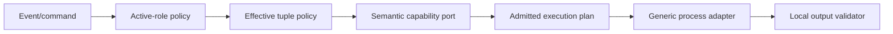

# Agent Runtime, Provider, Model, and Role Routing

- Status: In progress for official standalone agent installation
- Date: 2026-09-11
- Last updated: 2026-10-05
- Catalog capability ID: `agent-runtime`
- Last verified: 2026-09-24
- Owners: Copilot maintainers
- Scope: resolve, validate, provision, authenticate, authorize, and execute provider-neutral agent roles
- Related issues/PRs: comment automation, Bugbot, setup, PR lifecycle, and
  architecture quality and scalability hardening SDDs
- Required review gates: product UX, architecture, testing, documentation, security/operations
- Open decisions blocking readiness: none for the baseline

## 1. Executive summary

Copilot resolves one complete runtime/model tuple for each reachable agent role:
provider runtime, model provider, model, optional effort, and optional validated
executable selection.
Common values may be overridden per planner, findings, reviewer, fixer, or tester.
The recommended common default is Codex with `openai/gpt-6-luna`; explicit
repository Variables and role inputs retain precedence over that fallback.
Only roles reachable from the current event are checked and authenticated.
Invalid configuration or runtime failure is terminal for that capability; no
silent provider/model/executable fallback is attempted.

```text
event/command -> active roles -> common + role override -> validate allowlists
              -> installed-CLI/auth preflight -> provider adapter -> local schema
              -> semantic result
```

## 2. Problem, current behavior, and evidence

### 2.1 Problem

Runtime CLI, model vendor, model name, reasoning effort, credentials, execution
mode, and task responsibility are distinct concerns. Conflating them causes
unreviewed fallback, excess provisioning, credential exposure, or write-capable
agents running for read-only tasks.

### 2.2 Current behavior

1. `agent-*` supplies the common tuple; role-specific fields inherit only when blank.
2. The manifest records a reviewed runtime identity and an official standalone
   installation source for Codex, OpenCode, and Cursor.
3. Provider/model formats, executable selection, non-empty runtime identity,
   fixed provider command shape, and configured allowlists are validated.
4. Event/command policy calculates active roles before runtime preparation.
5. `ai-members-only` may prevent all requested agent runtime preparation for an unauthorized actor.
6. Runtime preparation reuses an explicit operator-owned executable. For a
   default-discovered executable, it reuses the present CLI unless a newer
   official release is verified; a missing or verified older default may use
   a private job installation without changing the operator's file. It then
   verifies the resulting executable and nonempty version. It never uses npm
   or pnpm for agent installation and never requires an exact runtime version.
7. An exhaustive dispatcher selects one independent provider policy, and a
   preflight planner produces the complete admitted execution plan.
8. A generic process adapter consumes only admitted plans; OpenCode JSON events
   are decoded before provider-neutral local schema validation.

### 2.3 Evidence and contract classification

- Observed behavior: agent domain, configuration/activation policies, execution
  planner, reviewed-runtime manifest, CLI installer/process adapter, setup workflows,
  architecture/security tests, and agent docs.
- Intentional contract: complete tuple, no implicit fallback, active-role-only
  preparation, semantic ports, local schema validation, and credential isolation.
- Known debt and limitations: an operator-owned provider CLI may change its
  command surface externally; incompatible flags fail terminally at execution.
  Installer source changes require reviewed fixtures and controlled live
  smoke evidence; credential checks remain environment-specific; cost estimates
  are not product guarantees. On Windows, npm-generated `.cmd` shims cannot be
  passed directly to Node's no-shell process APIs; PR #403 observed
  `configuration.unsupported` during Codex provisioning after Git Bash passed.
  The underlying exception was not exposed, so the shim explanation remains a
  hypothesis until isolated Windows tests and runner evidence confirm it.
- Unknown rationale: the prior `gpt-5.6-luna` default was operational
  configuration, not a permanent architecture decision.
- Implemented hardening: provider-specific execution policies and an exhaustive
  compile-time dispatcher are specified in
  [`agent-execution-policy-hardening.md`](./agent-execution-policy-hardening.md),
  under the shared gates in
  [`architecture-quality-and-scalability-hardening.md`](./architecture-quality-and-scalability-hardening.md).
  Adding a provider still requires a separate runtime-support, security, docs,
  and smoke-test change.

## 3. Actors, surfaces, and terminology

| Actor | Goal | Entry point | Surface |
|---|---|---|---|
| Repository owner | select approved runtime/model | setup/Variables/inputs | plan/docs/run |
| Workflow | request capabilities | event/single action | Job Summary/logs |
| Agent role | perform bounded task | semantic port | structured/text result |
| Provider CLI | execute model request | admitted argv/stdin | process output |

Runtime provider selects the executable; model provider selects who serves the
model. Roles are planner (read), findings (read), reviewer (read), fixer (write
workspace), and tester (read). “Active” means reachable from this exact event,
not merely configured.

## 4. Goals, non-goals, and fixed invariants

### 4.1 Goals

1. Every invocation MUST have one valid complete effective tuple.
2. Inactive roles MUST NOT be provisioned, authenticated, or invoked.
3. Provider output MUST cross a provider-neutral locally validated contract.

### 4.2 Non-goals

1. Copilot does not dynamically choose the cheapest/best model.
2. It does not fail over between providers or models.
3. It does not guarantee provider availability, price, quota, or data residency.

### 4.3 Fixed product/safety invariants

1. Missing/malformed/unsupported tuple or disallowed model fails before execution.
2. Callers cannot provide command text or argv; executable selection accepts no arguments or wrappers.
3. Read-only roles cannot receive write/network/approval authority beyond their admitted plan.
4. Agent processes never receive GitHub git credentials.
5. Structured output is locally validated even if the provider validates it.

## 5. Current versus proposed product journey

| Stage | Rejected/unsafe shape | As-built contract | Effect |
|---|---|---|---|
| Selection | provider implies model | independent qualified model | explicit behavior |
| Roles | one runtime eagerly prepared | only active role tuples | lower cost/risk |
| Invocation | caller supplies command text | provider policy builds argv | injection resistance |
| Runtime ownership | replace a newer runner CLI | reuse it and record identity | no global mutation |
| Failure | silent fallback | terminal named error | auditability |
| Output | trust provider JSON | local schema/size check | consistent contract |

No legacy behavior is supported; the hardened runtime is the only contract.

## 6. Functional behavior and state model

### 6.1 Happy path

1. Determine active roles from event/command/single action.
2. Merge common tuple with complete role overrides and validate.
3. Enforce model-provider/model allowlists and installation policy.
4. Reuse an operator-installed CLI, or install the missing default executable
   from the selected provider's official standalone source in a private job
   directory. An explicitly selected executable is never replaced. A present
   default-discovered executable may be superseded for this job only by a
   verified newer official release in a private PATH overlay; its original
   file is never modified. Never require an exact runtime version.
5. Verify CLI identity and credential/login readiness.
6. Invoke the generic process adapter with the admitted role plan.
7. Bound/parse/validate output and return semantic result.

An operational Codex login probe is itself an agent process. Before `login
status`, it MUST resolve the selected executable and any Windows npm package
bin, validate the shim, direct interpreter, and package bin with the same
owner/ACL file policy used for version and execution preflight, and execute
with literal arguments and the bounded credential environment. A failed trust
check reports authentication as unavailable without starting the CLI. A
focused fixture MUST prove a writable launcher cannot run during this probe.
The admitted execution plan separately records and rechecks its launcher hash
when that plan is later executed; the synchronous login probe has no stored
execution plan to recheck.
The repository's standalone `verify-agent-clis.cjs` diagnostic MUST apply the
same installed-file owner/ACL policy to the selected shim, direct interpreter,
and package bin before any help, version, or login command. It MUST reuse the
runtime's executable trust implementation rather than keep a weaker copy, and
PATH lookup MUST not execute an unvalidated `which` or shell wrapper. An
isolated fake-CLI fixture MUST prove a writable candidate is never started.
The Windows verifier fixture MUST answer both headless `exec --help` and
`--version` promptly, and report an optional missing login separately; a
fixture that hangs on help is not evidence of CLI readiness.
On hosted Windows, the isolated readiness test MUST retain its bounded verifier
stdout on failure so `NOT_READY` is distinguishable from a test harness timeout.
The verifier's `NOT_READY` result MUST distinguish executable resolution,
file trust, and headless help/version execution using fixed phase labels and
bounded status codes, without exposing paths, raw stderr, arguments, or secrets.
For a file-trust failure, the phase MUST identify whether the selected shim,
resolved interpreter, or package launcher failed the check, again without
printing its path or ACL contents.
The fake native execution, timeout, and cancellation fixtures' Jest budgets
MUST include native ACL setup and teardown on service Windows; the admitted
child still uses its own short execution deadline.
The isolated Windows verifier receives only non-secret system process variables
needed by Windows PowerShell and native process startup. Its fixture must prove
readiness on hosted Windows while retaining the 15-second ACL query deadline.
It MUST replace an inherited PowerShell 7 `PSModulePath` with only Windows
PowerShell 5.1 system module directories when launching the native shell.
The allowlist includes standard process, profile, Program Files,
and account-domain context needed for noninteractive Windows PowerShell startup;
it never includes GitHub tokens or provider credentials.
The fixture MUST separately confirm that `whoami.exe` and a no-op Windows
PowerShell command start under that bounded non-secret environment. The shell
startup probe allows the same 15-second deadline as the real ACL query; a failed
verifier ACL query identifies identity versus descriptor timeout by fixed code.

### 6.2 Alternative paths

- Different active roles in one workflow may use different runtimes/models.
- Existing Codex login may satisfy an explicit credential alternative.
- Default and explicit executables are operator-owned when present. A missing
  default executable triggers the selected provider's official installer; a
  present default executable may receive the private, verified update below.
  Explicit executables and original operator files are never replaced; failed
  or unverifiable installation fails closed.
- Optional effort maps to Codex reasoning, OpenCode variant, or provider-neutral context for Cursor.

### 6.3 State model

| State | Meaning | Next | Recovery |
|---|---|---|---|
| inactive | role unreachable | terminal | none |
| resolving | inheritance/tuple building | invalid/authorized | fix config |
| authorized | actor/model policy passed | checking runtime/ready | none |
| checking runtime | available CLI or official install | ready/failed | runner/install fix |
| authenticating | credential/login preflight | ready/failed | configure credential |
| executing | provider process running | validating/failed | inspect bounded error |
| validating | output local contract | complete/failed | provider/prompt fix |
| complete | semantic result returned | terminal | none |

No provider fallback transition exists. Retry repeats readiness checks and
must not treat a partial installation as authenticated success.

## 7. User-facing configuration

| Input | Recommended default | Allowed/bounds | Persistence |
|---|---|---|---|
| `agent-provider` | `codex` | `codex`, `opencode`, `cursor` | repository/run |
| `agent-model-provider` | `openai` | validated identifier + allowlist | repository/run |
| `agent-model` | `gpt-6-luna` | validated unqualified model + allowlist | repository/run |
| `agent-effort` | empty | validated provider-supported value | repository/run |
| `agent-executable` | reviewed basename | exact basename or absolute path to it | repository/run |
| `<role>-*` | inherit common tuple | same bounds | repository/run |
| allowlists | setup-derived exact values | comma-separated exact providers/models | workflow environment |

Model values MUST not repeat provider prefixes. A meaningful alternative is
OpenCode with an explicitly qualified allowed provider/model. Cursor requires
its documented credential.
No-fallback, local schema,
active-role-only, credential isolation, and permission modes are not configurable.
The same default MUST appear in the action input, setup plan, generated
workflow fallbacks, and default allowlist (`openai/gpt-6-luna`). A configured
repository `AGENT_MODEL` or role-specific value is intentional and MUST not be
silently rewritten by source defaults; operators migrating this repository
update `AGENT_MODEL` and `AGENT_ALLOWED_MODELS` together. The effective model is
snapshotted for a run. Existing explicit `gpt-5.6-luna` deployments remain
supported when exactly allowlisted. Reasoning effort, credentials, and provider
transport do not change as part of the default migration.

## 8. Clean Architecture design

| Boundary | Owns | Must not own/import |
|---|---|---|
| Domain | provider/role/config tuple | process/env |
| Policies | activation, inheritance, runtime support, validation | CLI invocation |
| Application ports | findings/fixer/language capability requests | provider DTO/flags |
| Data adapters | provider-neutral capability and generic process lifecycle | workflow routing/provider authority |
| Infrastructure planning | executable/runtime-identity/artifact preflight | product role decisions |
| Entrypoints/setup | inputs and composition | provider-specific branching beyond adapters |



Dependency/cycle tests, CLI entrypoint tests, provider-port boundaries,
allowlist/docs validation, and workflow secret checks MUST prevent erosion.

## 9. UI/UX and content contract

```markdown
Pending: **Preparing the `reviewer` role.** Runtime `codex`; model `openai/gpt-6-luna`.
Action required: **Codex authentication is missing.** Log in on the runner or configure an approved fallback credential.
Blocked: **`anthropic/model-x` is outside `AGENT_ALLOWED_MODELS`.** No provider process started.
Partial: **The provider completed, but its structured result was invalid.** Nothing was published or modified.
Complete: **Reviewer completed with a locally validated result.** Continue in the linked PR status.
```

Output MUST name role, runtime, qualified model, phase, and one recovery action
without printing prompts, credentials, or raw provider response. Technical argv
is debug-only and redacted. Text accompanies icons; English is fallback; terminal
and Job Summary content remains narrow-readable. Provider errors are mapped to
stable categories before public presentation.

## 10. Failure, recovery, and cleanup

| Failure | Impact | Retained facts | Retry | Action | Cleanup |
|---|---|---|---|---|---|
| invalid tuple/allowlist | no process | config | yes | correct exact value | none |
| provisioning | CLI unavailable/partial | sanitized failure category | yes | inspect official source or provide a compatible CLI | remove private install directory |
| auth preflight | no query | credential name only | yes | login/add secret | none |
| process timeout/exit | capability fails | bounded diagnostics | yes | inspect provider/quota | terminate child |
| schema/size invalid | no trusted result | raw output not published | yes | fix prompt/provider | discard output |
| write role postflight | no trusted commit | workspace state | guarded retry | abort/review | mutation guard |

## 11. Security, permissions, and privacy

Credentials remain in provider-supported environment/login stores and are never
command arguments, prompts, result payloads, or catalog/config examples. Read
roles use read-only/no-approval/network-restricted modes where supported. Write
roles receive workspace access only after actor authorization and still cannot
own trusted git. Processes use policy-owned argv, bounded environment, timeouts,
output limits, redaction, and local schemas. Repository instructions are
untrusted input, not authorization.

## 12. Observability and operational UX

Logs/summary expose active role, provider, qualified model, configured effort,
provision/auth/execute/validate phase, elapsed time where available, and mapped
failure. Content-free Bugbot telemetry is optional. Setup/doctor and the
credential-health workflow surface readiness per credential. Inactive roles
produce no provisioning noise. Model/provider changes are operational changes
that require smoke evidence.
For an admitted CLI, the debug log MUST include the normalized first-line version identity.
On process failure it MUST expose the bounded numeric exit code and failure
category, never raw stderr, prompts, environment values, or credentials. A
provider availability label alone is insufficient to diagnose a CLI failure.
Official CLI provisioning failures MUST expose a closed stage and bounded exit
status when available (private-root, download, installer-script, installed-file,
or replacement-trust). The Action log MUST NOT include raw installer stderr,
URLs, local paths, environment values, tokens, or command arguments.
For installer-script failures it MAY add a closed reason inferred from stderr
(`hash-module`, `network`, `access-denied`, `missing-command`, or `unknown`);
the raw text MUST stay private even when debug logging is enabled.
For an `installed-file` failure it MUST add a closed reason derived only from
the local validation operation and known error codes: `missing-file`,
`invalid-file`, `unsafe-link`, `acl-hardening`, `acl-ancestor`, `acl-file`,
`acl-inspection`, `access-denied`, or `unknown`. The log MUST never interpolate
an exception message, path, principal,
installer output, or credential. Fixture tests MUST exercise each mapping and
prove that arbitrary secret-bearing exception text never reaches the log.

## 13. Compatibility, migration, rollout, and rollback

### Windows Action runtime acceptance (issue #404)

Windows support MUST use a native executable for provider version checks and
admitted execution. A `.cmd`/`.bat` wrapper MUST NOT receive agent arguments
or prompts. An explicit absolute Windows executable selection ending in
`.cmd` MUST fail at the configuration boundary, while the provider's exact
native `.exe` basename remains admissible; package-shim inspection is an
internal launcher resolution path, not an operator-selected execution plan.
The Windows planner fixture MUST prove all three paths: default PATH discovery
can resolve a trusted npm shim to a native interpreter and package bin; an
explicit native `.exe` can be admitted; and the same `.cmd` shim supplied
explicitly is rejected before an execution plan is admitted.
The Action MUST NOT use npm, pnpm, `npx`, or `actions/setup-node`
to install agent CLIs on any platform. Its six distributed agent workflows
run the JavaScript Action under the GitHub Actions runner's embedded Node;
development CI and packaging workflows keep their separate Node/pnpm setup.
When the selected default CLI is absent, Codex uses OpenAI's official
standalone installer, OpenCode uses its official standalone installer or
release binary, and Cursor uses its official installer or release package.
Windows Cursor installation MUST avoid the official script's user-wide PATH
mutation and deletion of an existing installation by using its official
archive in a private job directory. Installer child processes receive no
GitHub or model credentials. Explicit and present operator CLIs are never
replaced. Installation checks require a nonempty version and the admitted
headless command surface, without enforcing an exact version.
On Windows the official installer runs under Windows PowerShell 5.1 with fixed
system tool directories, a private profile, and only non-secret native process
variables. Its `PSModulePath` contains only Windows PowerShell 5.1 system module
directories; inherited PowerShell 7 module entries cannot reach it. A fixture
MUST assert the closed environment and failure-stage telemetry.
The Windows platform smoke MUST also start the native Windows PowerShell 5.1
under that exact installer environment and hash a local fixture file with
`Get-FileHash`; this verifies module loading without downloading an agent,
using credentials, or invoking setup against a repository.
If the default discovered CLI fails the executable trust preflight before its
version can run, provisioning MUST treat it as unavailable and install a fresh
official CLI in a private job directory. It MUST NOT execute or repair the
untrusted file, and the installed replacement must pass the same trust and
version checks before the Action uses it. Explicitly selected executables
remain operator-owned and fail closed. A fixture MUST prove fallback for an
unsafe default, no fallback for a generic metadata outage, and cleanup if the
official replacement also fails trust.
The [Windows service run on `8e4978e9`](https://github.com/vypdev/copilot/actions/runs/37115583847)
reached the private Codex replacement but rejected its ACL as writable before
executing the CLI. A private installation root MUST pass the same file and
ancestor trust policy before any official installer is downloaded or run.
Prefer the job temporary directory when its ancestors pass; otherwise try a
profile-local temporary directory with the same preflight. Never weaken the
ACL policy or modify the rejected operator CLI. After the official installer
returns, constrain its output to that private root, reassert owner-only ACLs
on the installed directory and executable, and check the complete executable
path again before returning it to provisioning. Failure to find a safe root or
to secure the private replacement fails closed and cleans that attempt.
Deterministic tests MUST cover unsafe first candidate, safe fallback, no safe
candidate, path escape, private executable repair, and cleanup. Hosted and
service Windows fixtures MUST exercise the real ACL preflight using only
local dummy files; a real Action job is required to verify provisioning.
The [hosted Windows fixture on `0f4c9a5e`](https://github.com/vypdev/copilot/actions/runs/37293874266)
spent 31 seconds exhausting both private-root candidates while other native
ACL and installer fixtures passed. This timing is consistent with two bounded
15-second ACL query timeouts, but the stage-only failure does not prove that
cause. A private-root candidate MAY be recreated and preflighted once more
only when its own ACL operation returns the explicit `ETIMEDOUT` code. Each
failed candidate MUST be removed before retry, every child ACL query retains
its 15-second limit, and owner/ACE/path rejection MUST NOT be retried. The
hosted fixture budget MAY allow the total of these bounded attempts; tests
MUST prove timeout-only retry, cleanup, and no retry for an unsafe ACL.
The downloader and installer shell MUST resolve from trusted system locations,
and every installer child uses a system-only `PATH`. A workflow-controlled
directory cannot supply `curl`, `sh`, `bash`, or commands called by the official
installer. On Windows, capture the runner's `SystemRoot`, `WINDIR`, and
`SystemDrive` at process startup, before accepting Action inputs; require
matching drive-absolute `SystemRoot` and `WINDIR` values, a consistent drive,
and a canonical existing Windows system directory. Reject malformed,
disagreeing, UNC, relative, or reparse-point roots. Use the captured root for
`taskkill.exe`, PowerShell, curl, version checks, and the installer child's
system-only `PATH` and module path. A later mutation of `process.env` or an
installer environment argument MUST NOT change those executable locations.
The runner startup environment is a trusted machine prerequisite; a runner
whose own system variables have been replaced before the Action process starts
is outside the Action's trust boundary. Missing trusted tools fail closed.
Bugbot's [review of `9adcd05c`](https://github.com/vypdev/copilot/actions/runs/37182427514)
still lists the earlier environment-controlled `taskkill.exe` and fixed-`C:`
findings. The current source uses the startup-captured root for both; the
threads remain review work until the new head is verified against that code
and its fixture evidence. Do not restore live environment lookup.
Fixtures MUST cover a non-`C:` system drive, malformed or disagreeing roots,
post-startup environment tampering, and a fake tool directory prepended to
`PATH` without launching the fake downloader, shell, or process-tree killer.
The actual Windows cancellation fixture MUST also change `SystemRoot` and
`WINDIR` after the Action modules load, then verify that the agent's descendant
is terminated. This guards the `taskkill.exe` call path, not only the tool-path
helper, against later environment tampering.
Official latest-version metadata retrieval MUST use the same fixed trusted
`curl` location and system-only child `PATH` as installation. A fixture MUST
prepend a fake `curl` to the caller `PATH`, verify the official version is
read through the trusted executable, and prove the fake tool is never run.
Every direct official-source download MUST be bounded before bytes are written
to disk: at most 1 MiB for installer scripts, 2 MiB for release metadata, and
256 MiB for archives. Curl receives its transfer-size limit and the local
process buffer imposes the same independent bound when a server omits its
length. Zero-byte, oversized, or failed downloads leave no partial artifact
and cannot execute or extract. Fixture tests exercise the actual download
boundary for each content class without external network access.
The [macOS Action run on `9adcd05c`](https://github.com/vypdev/copilot/actions/runs/37182424818)
failed after the official Codex script returned, at the installed-file stage.
The [official Unix installer](https://github.com/openai/codex/blob/main/scripts/install/install.sh)
publishes the visible `codex` command as a symlink to a release under
`CODEX_HOME`. Resolve that link and any intermediate links without following
one outside the newly created private root. The final target MUST be a regular
executable inside that root, while the returned command directory continues
to expose `codex` for PATH resolution. An escaped, dangling, or non-file
target fails closed and removes the installation. Fixture tests MUST cover
the official internal-link layout and an external target without downloading
a real agent. A passing macOS Action job remains required.
The [Windows Action run on `50784d14`](https://github.com/vypdev/copilot/actions/runs/37245063995)
failed at `official-installed-file` after the official Codex installer returned.
The [official Windows installer](https://github.com/openai/codex/blob/main/scripts/install/install.ps1)
publishes the visible `bin` directory as a junction into the versioned release
under `CODEX_HOME`. The installed-file gate MUST accept that directory junction
only when its resolved regular executable stays inside the new private root;
the canonical executable and all of its real parent directories MUST receive
the existing owner-only ACL hardening and executable trust check. The visible
directory remains the command directory for PATH. A junction to another root,
a dangling junction, or a linked final file MUST fail closed without changing
ACLs outside the private root. Windows hosted and self-hosted fixtures MUST
replay the official junction layout and the escape cases with dummy files.
A fresh Windows Action run MUST reach active agent roles before this gate closes;
the setup smoke matrix alone is insufficient evidence for live provisioning.
The [PR #403 Windows Action run on `3a5c22c4`](https://github.com/vypdev/copilot/actions/runs/37291440436)
again stopped at `official-installed-file` on `windows-intel-runner-1`; its
existing stage-only log cannot distinguish a missing visible file, an unsafe
link, or the real ACL gate. A subsequent runner check MUST report one of the
closed installed-file reasons if that gate fails again. The
[Action run on `0f4c9a5e`](https://github.com/vypdev/copilot/actions/runs/37293874115)
passed provisioning and the active Bugbot review role on Windows, with zero
active findings on that exact head. This confirms the Action path on that
runner; the separate hosted Windows private-root fixture failed on the same
head, and the human Windows runner review remains open.
The Windows Codex installer checks the standard `OS=Windows_NT` service
environment value before release work. The private installer environment MUST
preserve that platform fact while still excluding all credentials. The PR #403
run on `windows-intel-runner-3` failed during provisioning because the
isolation allowlist removed `OS`; a Windows fixture MUST assert that the value
reaches the official installer subprocess, and a fresh Action run MUST prove
the repair on a service runner before counting Windows agent execution.

The Windows runtime MUST use a private, owner-only ACL for generated artifacts;
POSIX mode bits are insufficient evidence on Windows. Cancellation and timeout
MUST terminate the agent process tree before generated artifacts are removed.
The process still receives the bounded environment and argv, with no inherited
GitHub token or raw diagnostic output. If an ACL or process-tree check cannot be
performed, execution fails closed. Windows CLI and Action support remain an open
acceptance gate until isolated Windows CI fixtures pass and a real runner review
confirms the job without a credential-bearing test dispatch.

Selected native executables require a read-only Windows ACL preflight before
version checks or execution. The file owner must be the runner user or a trusted platform
principal. No untrusted principal may hold write, delete, ownership, or DACL
mutation rights, whether an ACE is explicit or inherited. Read/execute access
alone may be shared. Unknown ACE rights or unreadable ACLs fail closed. The
preflight must not rewrite an operator-owned executable. Fixtures cover a
normal Git for Windows/npm or Node ACL, a broad writable grant, inherited
write, and malformed ACL evidence on hosted and service Windows runners.
The preflight also reads the containing directory and its ancestors to the
volume root. An untrusted principal must not own any path component or hold
`DELETE_CHILD`, delete, DACL/owner mutation, or generic-all rights on an
ancestor that could replace a previously checked executable. Add-only
directory grants on higher ancestors without replacement rights do not by
themselves reject an otherwise safe installed path. Reject `GW` and `FW`
generic write grants on every untrusted ancestor: they include file creation
authority and are not a narrow add-only exception. The executable's immediate
containing directory must also reject untrusted `FILE_ADD_FILE` (`0x2`) and
`FILE_ADD_SUBDIRECTORY` (`0x4`) rights, including symbolic `LC`, because
Windows may search that directory when loading a DLL. The distinction follows
[Microsoft's directory access rights](https://learn.microsoft.com/en-us/windows/win32/wmisdk/file-and-directory-access-rights-constants)
and [DLL search order](https://learn.microsoft.com/en-us/windows/win32/dlls/dynamic-link-library-search-order).
The symbolic SDDL `LC` flag encodes access-mask bit `0x4`. On a file-system
directory that bit is `FILE_ADD_SUBDIRECTORY`; read-only directory listing is
bit `0x1`. Therefore a direct executable parent granting `LC` to an untrusted
principal remains unsafe, while a higher ancestor with only that add right
does not by itself replace an existing executable. Fixtures MUST retain both
cases; a name-only reading of the directory-service SDDL alias must not
weaken the file-system trust rule.
Synthetic ACL fixtures MUST cover `GW`, `FW`, and numeric generic write on
ancestors, plus add-only rights on the immediate parent versus a higher
ancestor. Native Windows hosted and service fixtures MUST continue to admit a
safe installed executable and reject a writable containing directory. This
read-only check applies equally to native
CLIs, resolved npm shims, interpreters, and package bins; fixtures prove both
safe shared-read parents and a parent with an untrusted delete-child grant.
The known `NT SERVICE\TrustedInstaller` SID is trusted as a Windows ancestor
owner, including for `C:\`, because both hosted and service fixtures expose
that system-owned volume root. The exception applies only to ancestor
descriptors; it does not admit a foreign-owned executable. A fixture must
verify the exact SID and continue rejecting another owner or mutation grant.
The system volume may grant SDDL `LC` to another principal. On NTFS its bit
allows adding a subdirectory, but does not allow replacing the existing path
component without delete, owner, or DACL authority. Higher-ancestor checks
admit it; executable-file and immediate-parent checks reject it. The isolated
Windows matrix must cover all three cases.
The file and ancestor descriptors MUST be collected by one bounded,
read-only PowerShell process. A missing descriptor, changed count, malformed
JSON response, or query failure blocks the run. The Windows timeout and
cancellation fixtures may use a 30-second Jest budget for native ACL setup,
process-tree cleanup, and loaded service runners; each admitted provider
timeout remains independently bounded by its short test value.
The standalone CLI verifier checks the selected command, interpreter, and
launcher once before its help/version/login probes. This permits reuse only
within the same short-lived verifier process after all path components are
proven inaccessible to untrusted mutation. A transient PowerShell query
timeout may be retried once; unsafe or malformed ACL evidence is never
retried as success. Hosted and service Windows fixtures must prove readiness
without increasing the 15-second ACL query limit. The verifier fixture
supplies only non-secret Windows system plumbing variables to its child;
its `PATH` contains the private fake runtime followed by Windows system
directories, and its outer deadline includes the bounded retry and
help/version probes.
The writable-shim rejection fixture uses the same native shell plumbing and
allows up to 45 seconds for the verifier process, covering two bounded ACL
queries under concurrent coverage execution. The result MUST be the specific
unsafe ACL rejection, and its marker MUST prove the shim was never executed.
Its restricted `PATH` includes the known Node interpreter directory so npm
shim resolution can complete before the selected shim's ACL is inspected.
Agent execution failure telemetry MUST include only a closed preflight stage
(`workspace`, `ambient-configuration`, `manifest`, `selection`, `resolution`,
`invocation-trust`, `environment`, `version`, `artifacts`, or `policy`). It
MUST NOT include selected paths, argv, prompts, environment values, or raw
provider stderr. A Windows PR review failure must expose the stage before
its platform gate can close.
For a Windows executable trust rejection, telemetry MUST also carry a closed
reason code distinguishing file owner, ancestor owner, writable principal,
invalid ACL format (descriptor batch, missing DACL, ACE shape or flags, and
rights token), ACL query timeout/failure, and owner identity failure.
Unknown failures use a generic code. The exception and observation must never
carry a raw path or ACL entry into the log, and fixture tests must cover that
boundary. The reason is diagnostic only and cannot relax the trust decision.
Numeric SDDL ACE masks MUST reject both generic write (`0x40000000`) and
generic all (`0x10000000`) for an untrusted principal, as well as file-specific
mutation bits. Focused tests MUST exercise those generic rights directly;
the mask definition should make their inclusion reviewable without mental
hexadecimal arithmetic.
The equivalent documented two-letter SDDL rights MUST use their filesystem
bit meaning: `CC` is file read/directory list; `SW` is read extended attributes;
`WP` is execute/traverse; `LO` is read attributes. `RP`, `CR`, and `DT` grant
file mutation or a parent mutation and MUST not silently become trusted reads.
Unknown rights remain rejected. A service Windows runner must prove the
installed CLI's descriptor is accepted or rejected for a concrete known right,
not because its standard token was absent from the parser.
The installed-file preflight must read the full descriptor, including owner;
`icacls /save` exports a DACL only and cannot establish ownership. A bounded
read-only Windows ACL query is required, while generated runtime artifacts
retain their separate owner-only `icacls` policy.
The standalone readiness verifier's restricted environment can stall the
PowerShell `Get-Acl` cmdlet before help execution. Its installed-file trust
query MUST read the same full SDDL owner and DACL through the direct .NET file
access-control API in Windows PowerShell, without changing ACLs or broadening
the admitted owner/rights policy. A hosted Windows fake-CLI fixture MUST pass
through help, version, and optional login with that restricted environment.

The 2026-10-02 hosted Windows fixture found an effective
`Authenticated Users: 0x1301bf` (modify) grant on both the Action-embedded Node
and setup-node's job Node. The owner-aware ACL preflight correctly rejected
them. The revised Action does not invoke either ambient Node to install a
missing native agent CLI; an existing npm `.cmd` shim still needs a separately
trusted Node executable. The runner owner reports that the self-hosted Node ACL
has since been corrected and requests the shared `self-hosted, codex` pool.
The installed workflows use those two labels. A normal PR or commit run
assigned to Windows MUST complete the isolated runtime path, and a manually
authorized service fixture MUST verify private artifacts, descendant
cancellation, and cleanup before that platform gate closes.
The full hosted Windows coverage suite MUST use a private ACL-validated Node
copy when a fixture exercises an npm package launcher; the ambient job Node
can legitimately fail the product's trust policy. Assertions comparing Windows
resolved executable paths MUST ignore case only, and fixture Jest deadlines
MUST account for native ACL setup while keeping the admitted child timeout
bounded. Windows coverage MUST exercise rejection of `.cmd` execution plans
and an interpreter path that is no longer canonical after preflight. The full
Windows agent execution module must meet its 95% line/statement and 90%
branch/function budgets; a passing isolated subset alone is insufficient.
A malformed spawn argument that causes a synchronous process-start exception
MUST become a bounded process failure and remove the private runtime directory;
the Windows full-coverage suite MUST exercise that recovery branch.
Runner owners must verify native provider executables and their ACLs. The
GitHub-hosted fixture is historical evidence of an unsafe ambient Node and
does not establish service-runner safety. A new isolated installer/agent
fixture must pass on Windows; do not infer Windows agent support from Git
Bash, an installer exit code, or Mac Action success.

There is no legacy provider alias or silent model fallback. Blank role fields
inherit common fields; invalid explicit values fail. A new provider/model is
rolled out by updating domain types, runtime-support/allowlist policy, provider plan,
setup/workflows, credentials, docs, tests, and controlled smoke evidence.
Previously generated `AGENT_PROVISIONING` Variables are ignored by the Action;
the setup assistant no longer asks for this obsolete mode or generates the
Variable. Existing configuration files may still contain the legacy field for
read compatibility, but it does not select an installation policy.
Rollback restores the prior tuple/installer source; provider-created external effects are
handled under that provider's policy. For this default-only migration, rollback
restores both repository Variables (`AGENT_MODEL=gpt-5.6-luna` and
`AGENT_ALLOWED_MODELS=openai/gpt-5.6-luna`) and the source/workflow defaults;
changing only one side would fail allowlist preflight. A controlled Codex smoke
run MUST verify the target model with the runner credential before declaring the
new effective default healthy.
The installer source and generated provisioning workflow MUST advance together
when the provider changes its installation contract. The
`0.153.4` CLI rejects `gpt-6-luna`; the reviewed `0.156.1` CLI passes a local
authenticated `codex exec` smoke. Repository Actions must still prove the same
tuple with their own credential. An explicit operator-owned CLI is never silently
replaced. A default-discovered CLI may use the private, verified update below;
the operator-owned file remains untouched and the admitted CLI still requires
version and model smoke.
The PR #403 run on `apple-intel-runner-1` admitted an installed `0.149.1` CLI
and then recorded repeated process exit 1 before Bugbot completed a partition.
The older-version/model incompatibility is plausible from the `0.153.4`
observation, but the current log discards the CLI diagnostic and does not prove
the cause. Runtime failure observations MUST classify only bounded, recognized
stderr patterns into a closed diagnostic code (unsupported option/configuration,
model unavailable, authentication, transport/rate-limit, or unclassified).
They MUST never emit raw stderr, prompts, credentials, paths, argv, output, or
arbitrary provider text. The code is diagnostic only: it MUST NOT select a
fallback model, replace an installed CLI, or turn a failed review green.
Fixture tests MUST prove recognized codes, unknown text, truncation and secret
non-disclosure. A fresh PR check must provide the actual classified code before
the `0.149.1` failure is attributed to a specific cause.

For a default provider command that is already present, the Action MAY use a
newer current official stable release when its bounded, credential-free
metadata check proves that release is newer than the installed version. Codex
uses its official stable release channel, OpenCode uses its official GitHub
latest-release metadata, and Cursor uses
the version embedded in its official platform installer script. An update is
installed into a private job directory and placed first on that job's PATH;
the runner's executable, user files and persistent PATH MUST NOT be changed.
The Action process keeps this private PATH overlay for the remainder of its
run so later agent resolution executes the admitted replacement. This does not
write the runner service, user, or machine PATH. Restoring the process PATH
immediately after validation would make the subsequent task select the old or
untrusted executable. A fixture MUST prove that the selected private command
remains resolvable for execution and that failure restores the prior process
PATH.
An explicitly selected executable is always used as selected. Unavailable,
malformed or incomparable update metadata leaves the existing CLI in use;
it never selects an arbitrary version or a second provider. Installer failure
after a proven update MUST fail before agent execution. An agent task that has
already started MUST NOT be automatically repeated with a different CLI. The
official installer result MUST pass the same version and executable checks and
be newer than the existing CLI before it is admitted. Fixture tests cover
older/equal/newer/unparseable versions, metadata outage, explicit executable,
private PATH overlay and cleanup. This is update detection, not exact version
pinning.

## 14. Testing strategy and numeric budget

| Area | Minimum cases | Risks |
|---|---:|---|
| Activation/config/runtime support | 30 | event roles, inheritance, formats, allowlists |
| Provision/auth/execution state | 24 | modes, retries, timeout, partial install |
| Provider plans/error mapping | 24 | argv/stdin/env/effort/output per provider |
| Workflow/setup contracts | 21 | secrets, official installer sources, absence of setup-node/npm/pnpm in agent workflows, active inputs, shared model fallback and exact allowlist across action/setup/workflows |
| UX/sanitization | 12 | phase/errors/redaction/narrow output |
| Integration/security/cutover | 19 | role→provider, injection, credentials, new provider, configured-variable precedence and model smoke |
| **Total** | **130** | no double counting |

The Windows extension adds at least 18 distinct fixture cases: 6 for official
installer selection and executable resolution, 4 for missing/redirected sources
and operator-owned executables, 4 for ACL/artifact rejection, and 4 for execution,
descendant cancellation, timeout, and cleanup. This is an extension to the
130-case baseline, with no reused case counted twice. CI MUST run these cases on
Windows and retain macOS/Ubuntu coverage. A live agent run is a separate human
gate and is not part of automated acceptance.

Global thresholds remain; activation/configuration/executable policies SHOULD reach
100% branch coverage. Use fake executables/processes/credentials and no live
provider in unit/integration tests. Each provider requires controlled smoke tests
for read and applicable write modes. Human evidence covers setup/doctor/action/CLI
errors and credential masking.

## 15. Documentation and discoverability

| Audience | Artifact | Required content |
|---|---|---|
| User | execution/runtime/model docs | tuple and defaults |
| Setup owner | input/CLI configuration | roles, credentials, allowlists |
| Operator | provisioning/failure and upgrade/rollback docs | readiness, paired Variable migration, smoke, recovery |
| Contributor | this SDD/architecture | semantic ports/adapters |

## 16. Acceptance scenarios

1. An event prepares only its reachable roles.
2. Blank role fields inherit common tuple; invalid explicit values do not fallback.
3. Disallowed provider/model or unsafe executable selection fails before process execution.
4. Each provider receives its documented argv/stdin/effort without secrets.
5. Unauthorized mutation request prepares no write role.
6. Missing CLI/auth reports one phase-specific recovery action.
7. Invalid/oversized structured output is rejected locally and not published.
8. Runtime failure does not invoke a second provider/model.
9. Adding a provider cannot pass without an exhaustive plan policy, security, workflow, docs, and smoke evidence.
10. A non-empty explicit runtime version is recorded and executed without
    replacement; a default-discovered CLI is reused or privately updated only
    after verified newer official metadata, and a missing default uses the
    official standalone source.
11. With no explicit model override, action/setup/generated workflows choose
    `gpt-6-luna` and the exact allowlist includes `openai/gpt-6-luna`; a
    configured model outside that allowlist fails before execution.
12. With explicit repository or role model configuration, that value retains
    precedence; changing only the source fallback does not claim to migrate the
    effective model. Updating both repository Variables and running a controlled
    smoke test establishes the new effective default without changing effort.
13. The manifest, generated provisioning workflow, and operator documentation
    identify official Codex, Cursor, and OpenCode sources. No exact runtime
    version is required; a CLI that rejects the selected model fails normally.
14. On Windows, a missing default CLI installs from the official source into a
    private job directory, verifies a nonempty version, and executes a fake
    native binary with literal arguments without invoking a command shell.
15. A malformed or redirected installer source, weak runtime ACL, or failed process-tree
    termination blocks execution or reports failure without trusted output or
    leaked prompt/credentials. The fixture leaves no managed artifacts.

## 17. Requirements traceability

| Requirement | Owner | Evidence | Documentation |
|---|---|---|---|
| active roles | activation policy | activation tests | execution contract |
| tuple/allowlist | config policies | builder/policy tests | model selection |
| Luna default and migration | domain default, setup projection, action and workflow fallbacks | default/override/allowlist contract tests and controlled runner smoke | input reference, model selection, upgrade/recovery |
| Official standalone installer | runtime manifest and generated provisioning workflow | source/selection tests and isolated cross-platform fixtures; controlled Action smoke remains open | CLI provisioning and recovery |
| provisioning/auth | provisioner/preflight adapters | ownership/install/infra tests | provisioning/credentials |
| semantic execution | capability adapter/provider plans | policy and process tests | runtime/CLI commands |
| local validation/security | parsers/schema/environment | security tests | failure/trust docs |
| Windows runtime | official archive/installer adapter, planner, process and ACL adapters | isolated fake installer, native executable, ACL, descendant cancellation and cleanup matrix; self-hosted runner and live agent review remain open | provisioning and failure policy |

## 18. Maintenance sequence

1. Update role/config/runtime-support contracts and exhaustive tests.
2. Update semantic ports/use cases and activation cases.
3. Update provider/provision/auth adapters and fake executable tests.
4. Update setup/workflows/docs/catalog and smoke matrix.
5. Run full gates plus controlled provider and human UX validation.

## 19. Definition of Done

- [ ] The 130-case budget, coverage, architecture, workflow, and docs gates pass.
- [ ] Every active/inactive, config, provisioning, auth, execution, and validation state is tested.
- [ ] Credentials, executable selection, output, read/write authority, and no-fallback rules pass security review.
- [ ] All five UI states and setup/action/CLI surfaces are accessible and redacted.
- [ ] Provider smoke evidence and rollback instructions exist.
- [ ] Documentation and catalog reflect current defaults, allowlists, reviewed
  runtime identities, and official installation sources without exact version pins.

## 20. References and decisions

- Primary sources: catalogued agent code, workflows, tests, and docs.
- Related SDDs: setup; comment automation; Bugbot; PR lifecycle.
- Planned hardening: `agent-execution-policy-hardening.md` owns provider-policy
  isolation and its cross-provider security contract; the architecture
  hardening SDD owns shared sequencing and verification gates.
- Decision: semantic role ports and explicit complete tuples; no fallback.
- Rejected: eager provisioning, shell-string assembly, provider DTOs in use cases.
- Follow-up: automatic model selection is outside this baseline.
