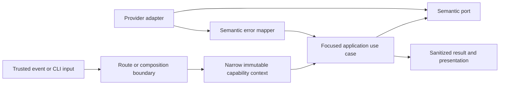
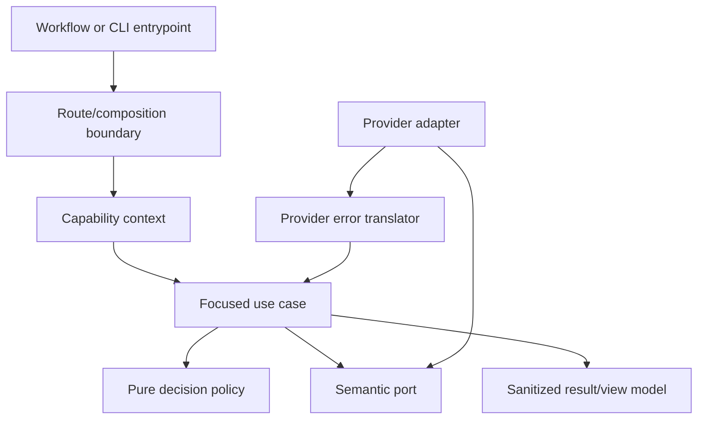

# Architecture Quality and Scalability Hardening

- Status: In implementation — P0-A complete; P0-B automated scope complete
- Date: 2026-09-11
- Last updated: 2026-09-12
- Catalog capability ID: `architecture-quality-hardening`
- Last verified: 2026-09-11 at `2fec5c24a80135dd0611d3bc37e7dc3a8ab1b41a`
- Owners: Copilot maintainers
- Scope: close the verified concurrency, error-contract, context-coupling,
  fan-out, setup/doctor, and provider-policy risks without changing unrelated
  product behavior
- Related issues/PRs: none recorded
- Required review gates: product UX, architecture, testing, documentation,
  security/operations
- Open decisions blocking readiness: none

## 1. Executive summary

Copilot shall harden six verified architectural seams in dependency order. The
work starts with a typed error boundary and a no-growth rule for the shared
`Execution` aggregate, fixes release correctness before further refactoring,
then bounds Bugbot context loading, decomposes setup and doctor, isolates
provider execution policy, and finally removes the remaining leaf-use-case
dependencies on `Execution`.

The recommended delivery model is one priority at a time. A priority is not
complete when code merely compiles: its owning SDD, implementation, tests,
documentation, catalog evidence, generated artifacts, and measured architecture
must agree.

```text
baseline and ratchets
  -> P0-A semantic error contract
  -> P0-B deployment serialization and decomposition
  -> P1-A bounded Bugbot context
  -> P1-B setup and doctor decomposition
  -> P1-C provider-specific execution policy
  -> P2 Execution-context closure and final audit
```

Each priority has one implementation-ready companion. This SDD owns program
ordering and shared gates; companions own exact types, algorithms, budgets,
clean cutovers, provider contracts, and acceptance evidence:

| Priority | Owning implementation contract |
|---|---|
| P0-A and P2 | [`execution-error-and-context-hardening.md`](./execution-error-and-context-hardening.md) |
| P0-B | [`deployment-concurrency-and-state-fencing.md`](./deployment-concurrency-and-state-fencing.md) |
| P1-A | [`bugbot-context-selection-and-budgeting.md`](./bugbot-context-selection-and-budgeting.md) |
| P1-B | [`setup-doctor-architecture-hardening.md`](./setup-doctor-architecture-hardening.md) |
| P1-C | [`agent-execution-policy-hardening.md`](./agent-execution-policy-hardening.md) |

Implementation ledger:

| Priority | State | Delivery evidence | Remaining gate |
|---|---|---|---|
| P0-A | complete | commit `759f418d`; semantic-boundary and architecture suites catalogued in `execution-error-and-context-hardening.md` | none |
| P0-B | implemented | workflow-contract, state-fence, handler, adapter, architecture, package, and coverage gates catalogued in `deployment-concurrency-and-state-fencing.md` | controlled live serialization evidence |
| P1-A | next | implementation contract ready | implementation and acceptance evidence |
| P1-B | queued | implementation contract ready | implementation and acceptance evidence |
| P1-C | queued | implementation contract ready | implementation and acceptance evidence |
| P2 | queued | implementation contract ready | implementation and final audit evidence |

The fixed safety rule is that a refactor MUST preserve observable product
behavior unless this SDD and the capability-owning SDD explicitly define the
change. Metric improvement is evidence, not the acceptance criterion.

This product has no installed users, external API consumers, or real persisted
operations. All priorities therefore use a greenfield cutover: the merged
implementation contains only the target contract. Compatibility adapters,
deprecated fields/overloads, dual readers or writers, migration handlers,
transitional flags, and legacy test suites are explicitly out of scope.

## 2. Problem, current behavior, and evidence

### 2.1 Problem

The repository has strong global boundaries and coverage, but several local
contracts are weaker than their SDDs imply. The risks are not primarily style:
they include concurrent state loss, raw provider failures crossing semantic
boundaries, unbounded provider requests, excessive change radius, and
security-sensitive decisions concentrated in complex functions.

If these seams are addressed as unrelated file extractions, the repository may
score better without becoming safer. This SDD therefore owns the cross-cutting
delivery order and quality gates; the existing capability SDDs remain the
authoritative product contracts.

### 2.2 Current behavior

The following facts were observed at the verified commit:

| Area | Observed evidence | Risk |
|---|---|---|
| Global baseline | RepoWise average health `8.07`; line coverage `94.69%`; branch coverage `84.14%`; no production dependency cycles or reported dead code | preserve the healthy baseline while changing hotspots |
| Deployment orchestration | `deployment_orchestration_use_case.ts` is 765 NLOC; `persist()` performs read/compare/write; the GitHub issue update has no atomic conditional write | two invocations can validate the same phase before either write |
| Deployment provider adapter | `github_deployment_repository.ts` is 825 NLOC; `normalizeEffectiveRules` has cyclomatic complexity 78 | ruleset, protection, queue, PR, Git, and workflow decisions are coupled |
| Error boundary | 26 production application sites put caught `unknown` values directly into `Result.errors` | the documented `ApplicationError` contract is not structurally enforced |
| Runtime context | 127 production application files import `Execution`; 124 production signatures use `ParamUseCase<Execution, ...>` | leaf changes can propagate across unrelated capabilities |
| Bugbot context | open PRs are mapped through two unbounded `Promise.all` fan-outs; the resulting flow primarily uses the first PR | repository size can multiply GitHub requests and selection is implicit |
| Setup and doctor | `setup_prompt_adapter.ts` implements five ports with 19.12% line coverage; `DoctorUseCase.execute` has cyclomatic complexity 44 | terminal state, product questions, remote probes, and reporting are coupled |
| Agent execution policy | one central policy branches across all providers; its main decision has cyclomatic complexity 25 | adding a provider changes a security-sensitive shared decision path |

The deployment SDD currently requires concurrent duplicate invocations to
permit only one successful transition. Its traceability cites a simulated stale
phase, not two simultaneously admitted invocations. GitHub REST documentation
states that conditional requests for unsafe methods such as `PATCH` are not
supported unless an endpoint explicitly documents them; the issue-update
endpoint provides no such state transition primitive. The current
compare-before-write sequence therefore does not establish atomic compare-and-set.

### 2.3 Evidence

- Code and tests: the catalogued paths for release orchestration, execution
  lifecycle, Bugbot analysis, setup/doctor, and agent runtime.
- Architecture contract: `docs/dependency-rules.md` and
  `docs/development/architecture.mdx`.
- Reproducible audit command: `pnpm run metrics:architecture` from a clean clone
  at the verified commit, plus Graphify queries over `graphify-out/graph.json`.
- Provider evidence: GitHub Actions concurrency groups are repository-wide
  across workflows when they use the same key; job-level keys may use `needs`
  outputs; queued ordering is not a business-order guarantee.
- Unknowns: production-scale latency distributions are not stored in this
  repository. The plan uses deterministic upper-bound tests rather than
  inventing latency targets from absent telemetry.

### 2.4 Retrospective classification


Not applicable. This is a prospective hardening specification. Current
behavior remains classified in each capability-owning as-built SDD.

## 3. Actors, surfaces, and terminology

| Actor | Goal | Entry point | Visible surfaces |
|---|---|---|---|
| Contributor | receive unchanged, reliable automation | issue, PR, push, comment | comments, checks, summaries |
| Release operator | advance exactly one durable deployment transition | release/hotfix workflows | launcher issue, PRs, Job Summary |
| Setup owner | install and diagnose without hidden side effects | `copilot setup`, `copilot doctor` | terminal plan and report |
| Maintainer | add a provider or capability safely | code and configuration change | CI, docs, architecture report |
| Copilot application | translate input into semantic decisions | application use cases | typed results |

“Leaf use case” means an application use case that performs one capability step
and is not the route or workflow coordinator. “Semantic error” means a typed,
sanitized application fact, not a provider exception. “Authoritative
serialization” means GitHub admits at most one mutation job for an operation;
state preconditions remain a second defensive layer. “Ratchet” means an
executable baseline that may shrink but cannot grow.

## 4. Goals, non-goals, and fixed invariants

### 4.1 Goals

1. `Result.errors` MUST contain only typed semantic errors.
2. Every deployment mutation path MUST share one operation-scoped concurrency
   group and revalidate operation, phase, and revision before side effects.
3. Bugbot MUST select at most one canonical PR context before loading PR detail.
4. Setup prompts, diagnosis decisions, provider probes, and rendering MUST have
   separate testable owners.
5. Provider execution policy MUST be fail-closed and isolated per provider.
6. New leaf use cases MUST NOT depend directly on the full `Execution` aggregate.
7. Every priority MUST reduce or hold its measured risk without lowering global
   coverage, introducing cycles, or changing unrelated UX.

### 4.2 Non-goals

1. This work does not redesign every repository or use case.
2. It does not pursue a perfect static-analysis score by splitting cohesive code.
3. It does not add dynamic provider plugins, service locators, or generic
   dependency registries.
4. It does not add distributed infrastructure solely to store deployment locks.
5. It does not change model selection, release strategy, setup defaults, or
   Bugbot finding policy unless an owning SDD is revised first.

### 4.3 Fixed product and safety invariants

1. Raw provider messages, causes, responses, stack traces, commands, and secrets
   MUST NOT enter application results, persisted state, public UI, or logs.
2. A deployment run that cannot prove exclusive admission MUST perform no
   mutation and MUST report a retryable blocked state.
3. A stale, duplicate, out-of-order, or ambiguous event MUST NOT guess a target.
4. Bounded fan-out, concurrency keys, error sanitization, provider allowlists,
   and read/write authority are intentionally not user-configurable.
5. Doctor remains read-only; reviewer roles remain read-only; trusted code keeps
   ownership of Git and provider mutations.
6. Removed APIs, inputs, schemas, state shapes, and command formats MUST fail
   compile-time or boundary validation; they are never translated or tolerated.

## 5. Current versus proposed product journey

| Stage | Current | Proposed | User/operator effect |
|---|---|---|---|
| Failure handling | many catches pass `unknown` onward | adapter/application boundary maps one semantic error | stable action and no diagnostic leak |
| Deployment admission | workflow-local or PR-local grouping plus read/compare/write | one cross-workflow operation group plus state fence | no lost phase transition |
| Bugbot context | enumerate then fan out to every matching open PR | resolve one canonical PR, then load bounded detail | predictable requests and target |
| Setup/doctor | large prompt adapter and central conditional report | questionnaire policy, terminal driver, named checks, report policy | same flow with isolated failures |
| Provider policy | one multi-provider complex decision | exhaustive dispatcher to provider-specific pure policies | safer provider additions |
| Runtime context | full aggregate reaches leaf use cases | route projects immutable capability contexts | smaller change radius |



Text equivalent: a trusted entrypoint selects one route; that boundary projects
only the capability facts needed by a focused use case; adapters implement
semantic ports and translate provider failures; the use case returns a typed,
sanitized result for presentation.

## 6. Functional behavior and state model

### 6.1 Delivery sequence

| Priority | Required outcome | Depends on | Exit gate |
|---|---|---|---|
| P0-A | semantic errors everywhere; install `Execution` no-growth ratchet | baseline | all application error paths classified; no new aggregate consumers |
| P0-B | serialize and decompose deployment orchestration | P0-A | simultaneous-invocation test proves one mutation owner |
| P1-A | resolve and load one bounded Bugbot PR context | P0-A | request-count upper bound holds for 0, 1, and 10,000 candidates |
| P1-B | decompose setup prompts, doctor checks, and remote configuration adapters | P0-A | interactive, non-interactive, partial, and read-only contracts pass |
| P1-C | isolate provider execution policies | P0-A | exhaustive cross-provider security contract passes |
| P2 | replace remaining leaf-use-case `Execution` inputs and complete final audit | all prior slices | allowlist contains only route/workflow boundaries and cannot grow |

P0-A is a foundation, not a broad rewrite. It first introduces the contract and
replaces all 26 known raw-error result sites. The aggregate ratchet lands in the
same priority so P0-B and all later work cannot increase coupling.

### 6.2 Priority state machine

| State | Entered when | Meaning | Allowed next state | Owner/recovery |
|---|---|---|---|---|
| specified | owning SDD and traceability are current | implementation may start | implementing | maintainer |
| implementing | one bounded slice is open | old behavior remains supported | validating/blocked | slice owner |
| validating | automated gates pass locally | human/provider evidence may remain | accepted/blocked | reviewers |
| blocked | a safety or product decision lacks evidence | no lower-priority work may hide it | specified/implementing | resolve in owning SDD |
| accepted | all exit criteria and evidence exist | next priority may start | terminal | maintainers |

A lower priority MAY be researched while another is active, but production code
for it MUST NOT merge before the active priority is accepted. A failed slice is
reverted or fixed within its priority; partially completed refactors cannot be
declared architectural progress.

### 6.3 P0-A — semantic error contract and architecture ratchet

The exact contract is owned by
[`execution-error-and-context-hardening.md`](./execution-error-and-context-hardening.md).

1. Define its closed 18-value `ApplicationErrorCode` union, derived kind and
   retryability, safe public message, impact, recommended action, retained-state
   summary, UUID correlation ID, and ECMAScript-private non-serializable cause.
2. Change `Result.errors` to a readonly semantic error contract. Boundary
   helpers MUST map expected provider failures and normalize unexpected failures
   without interpolating the raw value.
3. Adapters map provider-specific status into semantic codes. Application use
   cases may add product impact/action but may not inspect provider DTOs.
4. Structured logs accept only allowlisted semantic fields and a correlation
   identifier. Raw exceptions are not a logging escape hatch.
5. Add AST-based architecture checks for raw caught values in results/logs and
   a generated allowlist of production files that import `Execution`.
6. The `Execution` allowlist MUST NOT grow. New leaf use cases receive named,
   readonly capability contexts projected at a route or composition boundary.
7. Replace the public API in one atomic cutover: `Result.errors` becomes readonly
   semantic errors; `review(request)` is the sole review entrypoint; and
   `review(Execution)` plus `Execution`/`Ai` exports are removed. No compatibility
   adapter, alias, overload, or deprecation period is implemented.

Exit criteria: zero production `errors: [error]` patterns; every failure code
has presentation and retry semantics; the error policy has 100% enumerated
branch coverage; public/log fixtures contain no raw provider diagnostics; the
aggregate-import baseline is checked in and non-increasing.

### 6.4 P0-B — deployment correctness and decomposition

The exact workflow expressions, state schema, fence outcomes, effect ledger,
and recovery copy are owned by
[`deployment-concurrency-and-state-fencing.md`](./deployment-concurrency-and-state-fencing.md).

1. Replace the SDD's unprovable issue-body CAS claim with two explicit layers:
   authoritative GitHub Actions serialization and defensive state preconditions.
2. Every release, hotfix, managed-PR continuation, publication, reconciliation,
   cleanup, and retry mutation job MUST use the same normalized group:
   `copilot-deployment-<repository-id>-<issue-number>` with
   `cancel-in-progress: false` and `queue: max`. Release/hotfix require a
   positive `issue` input with no sentinel default. A read-only trusted resolver
   derives the managed-PR issue before the mutation job uses a job-level group.
3. The application reloads operation ID, expected phase, monotonic state
   revision, and authoritative provider facts after admission and immediately
   before each irreversible side effect. A mismatch returns stale/no-op or
   blocked; it never writes over newer state.
4. Workflows are the only deployment mutation entrypoints. Local code may plan,
   inspect, or dispatch the trusted workflow but cannot bypass its concurrency
   group.
5. Extract one handler per phase transition behind narrow semantic ports. The
   coordinator selects and sequences a handler but owns no provider rule parsing.
6. Split GitHub deployment data responsibilities into managed-PR, Git/ref,
   target-rules/merge-queue, publication, and state adapters. Shared Octokit
   protocol code may be reused; no public universal deployment client is added.
7. Replace `normalizeEffectiveRules` with typed pure normalization policies for
   branch protection, rulesets, required checks, merge queue, and workflow
   producers. No resulting decision function may have cyclomatic complexity
   above 15 without a documented architecture-review waiver.
8. The only deployment state is the initial schema from the companion:
   `stateVersion: 1`, starting at `revision: 1`. Missing/unversioned, unknown,
   malformed, or partial state blocks and is never migrated or rewritten. Every
   effect uses the pre-effect/post-effect protocol and stable idempotency proof.

Exit criteria: structural workflow tests prove the shared key on every mutation
path; a deterministic barrier test starts two invocations from the same phase
and observes one admitted mutation sequence; replay after cancellation
converges; no handler receives `Execution`; the release SDD and traceability
matrix describe the implemented guarantee rather than issue-body CAS.

### 6.5 P1-A — bounded Bugbot context

The exact target checks, page ledger, prompt packing, and partial-coverage
semantics are owned by
[`bugbot-context-selection-and-budgeting.md`](./bugbot-context-selection-and-budgeting.md).

1. A pure policy resolves the canonical PR in this order: trusted event PR that
   matches repository and head; unique open PR for the exact head branch;
   otherwise no PR or an explicit ambiguous-context result.
2. The semantic port MUST support an exact head query. It MUST NOT list every
   open PR and then issue detail calls for each candidate.
3. Detailed comments, threads, and review state load for at most one canonical
   PR. At most two independent detail requests may run concurrently.
4. With a canonical PR and issue, context loading performs at most five logical
   reads and 17 raw provider requests before bounded transient retries, with
   maximum concurrency two. Selection requests at most two exact-head matches;
   comments/threads use two pages of 100 and diff uses ten pages of 100 files.
5. Preserve the distinct existing content budgets: previous findings 100 items/
   48,000 chars; human conversation 50 items/24,000 chars/2,000 per item; diff
   64,000 chars/12,000 per patch; rules 100,000 chars/30,000 per rule source.
   Pack newest-first but render the selected conversation chronologically.
6. Provider pagination is bounded and exposes truncation as a semantic fact.
   Partial detail failure yields `unknown`/degraded context, never false clean.

Exit criteria: provider-call count is constant with respect to the number of
open PRs; tests cover no match, unique match, trusted event, ambiguity,
pagination, rate limit, partial failure, and 10,000 synthetic candidates; the
selected PR is the same one used for diff, publication, and reconciliation.

### 6.6 P1-B — setup and doctor decomposition

The exact questionnaire states, exit codes, non-interactive defaults, check
dependency graph, and statuses are owned by
[`setup-doctor-architecture-hardening.md`](./setup-doctor-architecture-hardening.md).

1. Extract a pure setup-questionnaire state machine from terminal I/O. It owns
   questions, validation, dependencies, cancellation, and next state.
2. Keep one low-level terminal driver for masked input, choice rendering,
   confirmation, width, and non-interactive rejection. Thin adapters implement
   the existing semantic prompt ports without sharing mutable questionnaire state.
3. Replace `DoctorUseCase.execute` conditionals with an explicit typed check
   plan and named collaborators for configuration, PAT, workflows, merge queue,
   variables, secrets, and provider credential health. This is fixed
   composition, not a runtime registry or service locator.
4. A pure report policy maps check facts to ordered `pass`, `warn`, `fail`, and
   `skipped` entries. Independent read-only probes execute through one fixed
   four-slot limiter; output remains in plan order and mutation ports are absent
   from doctor composition. A failed PAT skips its remote dependants but does
   not suppress independent local configuration/workflow checks.
5. Split repository Variables, Secret presence, storage inspection, and
   credential-health responsibilities into narrow adapters over a shared
   provider protocol helper.

Exit criteria: interactive and non-interactive terminal paths reach at least
90% line and 85% branch coverage; doctor report policy reaches 100% enumerated
branch coverage; tests prove cancellation/no-write, stable ordering under
parallel completion, partial/unverifiable results, secret masking, and absence
of mutation ports.

### 6.7 P1-C — provider-specific execution policy

The exact plan fields, executable selection, environment, provider argv/config,
hard limits, runtime manifest, and smoke evidence are owned by
[`agent-execution-policy-hardening.md`](./agent-execution-policy-hardening.md).

1. Keep a compile-time exhaustive dispatcher for `codex`, `opencode`, and
   `cursor`; do not introduce runtime registration.
2. Each provider owns a pure fail-closed policy that validates structured inputs,
   workspace mode, approval, network, authentication, effort, environment, and
   output limits for the requested role.
3. `agent-command`, arbitrary argv, wrappers, and their parser are deleted.
   Provider policies build all tokens from structured configuration and optional
   validated `agent-executable` selection.
4. The dispatcher returns a semantic execution plan; only process adapters turn
   it into argv/stdin/environment. Unknown provider or flag is rejected before
   process creation.
5. Cross-provider contract tests prove that user configuration cannot weaken
   fixed read/write, credential, approval, network, or output constraints.
6. Execution is version-pinned and fail-closed: a provider/version is usable
   only after its exact managed configuration proves sandbox, network,
   approval, persistence, plugin/MCP/subagent, and output behavior. Prompt,
   output, and timeout maxima are 512 KiB, 4 MiB, and 15 minutes.

Exit criteria: provider policies and dispatcher have 100% enumerated branch
coverage; adding a provider fails compilation or contract validation until its
policy, adapter, credentials, docs, workflow/setup support, and smoke evidence
exist; no security-sensitive decision function exceeds complexity 15.

### 6.8 P2 — `Execution` context closure

The final 16-file production allowlist and clean public API closure are
normative in
[`execution-error-and-context-hardening.md`](./execution-error-and-context-hardening.md).

1. Inventory remaining consumers by capability and classify each as route,
   workflow coordinator, or leaf. Classification is checked in code, not a
   spreadsheet.
2. Project immutable contexts at the closest trusted boundary. Contexts are
   named for capabilities and contain facts, not method bags or
   `Pick<Execution>` facade aliases.
3. Leaf use cases under `src/application/usecases/steps/**` MUST have zero direct
   `Execution` imports. Other leaf paths require the same rule unless an
   architecture test classifies the file as a top-level coordinator.
4. The final allowlist contains only entry routes and explicit top-level
   workflow coordinators, with a justification beside every entry. It may shrink
   in future changes and MUST NOT grow without an SDD and architecture review.
5. Delete obsolete aggregate helpers only after all consumers are replaced and
   characterization tests prove parity.

Exit criteria: zero leaf imports, no `Pick<Execution>` shims, no service locator,
all context projections are readonly, architecture tests are green, and a final
Graphify/RepoWise audit shows no new cycle, god node, or changed-file health
regression attributable to the program.

## 7. User-facing configuration

No new user-facing configuration is introduced. The following are fixed product
or safety contracts:

| Input/limit | Type | Fixed value/default | Scope/persistence |
|---|---|---|---|
| deployment concurrency key | normalized string | repository ID + launcher issue number | workflow run; shared across workflows |
| deployment cancellation | policy | never cancel an admitted mutation | workflow contract |
| canonical Bugbot PR count | integer | `0..1` | one review invocation |
| Bugbot detail concurrency | integer | maximum `2` | internal execution |
| retained previous Bugbot findings | bounded content | `100` items and `48,000` characters | sanitized prompt context |
| retained human Bugbot conversation | bounded content | `50` items, `24,000` characters, `2,000` per item | sanitized prompt context |
| retained Bugbot diff/rules | bounded content | diff `64,000`/patch `12,000`; rules `100,000`/source `30,000` characters | sanitized prompt context |
| doctor probe concurrency | integer | maximum `4` | one CLI invocation |
| error codes/provider policies | closed compile-time contracts | no runtime override | build artifact |

An alternative deployment group based on workflow name is rejected because it
does not serialize different workflows for the same operation. Configurable
fan-out, cancellation, raw diagnostic publication, and provider safety bypasses
are intentionally unsupported. Removed inputs/state are invalid; no migration
of repository Variables, Secrets, or any other prior shape is implemented.

## 8. Clean Architecture design

### 8.1 Responsibilities and dependency direction

| Layer/boundary | Owns | Must not own/import |
|---|---|---|
| Domain/pure policy | semantic error taxonomy, selection, state transitions, report and provider decisions | GitHub/CLI/process DTOs |
| Application | focused orchestration and narrow immutable contexts | concrete SDKs, terminal APIs, full context in leaves |
| Semantic ports | exact provider capabilities and typed failures | generic client methods or provider response shapes |
| Adapters/data | GitHub/process/terminal mapping and error translation | product state/selection policy |
| Infrastructure/composition | concrete wiring, trusted clocks/IDs, fixed parallel groups | runtime service lookup or business branching |
| Entrypoints/workflows | trusted input adaptation and authoritative serialization | duplicated application policy |
| Presentation | sanitized view models and rendering | mutations or raw causes |



Text equivalent: the entrypoint owns trusted input and serialization, the
boundary projects a capability context, the use case combines pure policy with
semantic ports, adapters translate providers, and only sanitized facts reach
results or views.

### 8.2 Contracts, state, and trust boundaries

- Pure decisions: error classification, deployment phase selection, ruleset
  normalization, canonical PR selection, questionnaire/report planning, and
  provider execution planning.
- Application contracts: readonly named contexts and semantic result/error types.
- Semantic ports: exact PR lookup, deployment facts/mutations, read-only doctor
  checks, terminal interaction, and process execution.
- Durable state: the launcher issue owns deployment facts and a monotonic
  revision; workflows own exclusive mutation admission.
- Concurrency/idempotency: shared workflow group, phase/revision revalidation,
  deterministic side-effect identities, and provider postcondition reads.
- Untrusted inputs: events, issue/PR content, branch names, repository rules,
  terminal/config values, CLI output, agent output, and provider errors.
- Provider error mapping: adapter to semantic code; application adds bounded
  product impact/action; presentation never sees the cause.

### 8.3 Executable architecture constraints

CI MUST enforce:

- production dependency graph remains acyclic;
- domain/application provider and outer-layer import boundaries;
- `Result.errors` contains only the semantic error type;
- no raw caught value enters results or logging APIs;
- `Execution` import allowlist cannot grow and leaf paths have zero imports;
- workflow YAML has the required deployment group and queued/non-canceling mode;
- provider DTOs do not occur in application port signatures;
- doctor composition imports no mutation port; and
- provider execution dispatcher is exhaustive.

## 9. UI/UX and content contract

Hardening should be mostly behavior-preserving, but changed failure paths MUST
improve clarity. The first visible content follows status, completed facts, next
step, action, impact, and technical-evidence order.

```markdown
Pending: **Deployment operation #355 is waiting for the active transition.** No action is required.
Action required: **Bugbot found more than one matching pull request.** Close the obsolete PR or run from the intended PR.
Blocked: **The deployment state changed before this run acquired ownership.** No mutation was attempted; retry from the launcher issue.
Partial: **Setup completed 7 checks; provider credential health is unverifiable.** Existing configuration was not changed.
Complete: **Doctor completed 12 read-only checks.** No configuration drift was found.
```

Error views MUST use `impact -> cause category -> action -> retained state` and
include a correlation ID for logs. They MUST NOT render provider message text,
stack traces, argv, prompts, secrets, or private paths. Existing localization
ownership and English fallback remain unchanged. Stable headings, textual
statuses, narrow terminal/Markdown readability, descriptive links, and current
comment budgets remain mandatory.

## 10. Failure, recovery, and cleanup

| Failure/partial state | User impact | Retained facts | Automatic retry | Required action | Cleanup |
|---|---|---|---|---|---|
| semantic mapping missing | capability fails closed | correlation/code boundary | no | add mapping/test | discard raw response |
| deployment group unresolved | no mutation starts | operation/issue facts | bounded workflow retry | inspect resolver/input | none |
| deployment state stale | current run no-ops | newer durable state | next event/retry | inspect launcher issue | none |
| Bugbot PR ambiguous | no PR-specific publication | issue/head candidates | no guessing | select/close PR | none |
| Bugbot detail rate-limited | context is degraded/unknown | bounded prior facts | bounded adapter retry | retry later | none |
| doctor probe fails | report is partial/unverifiable | successful check facts | no mutation | repair permission/credential | none |
| provider policy rejects | process never starts | sanitized plan/code | after config fix | correct allowed value | none |
| context replacement regression | slice cannot merge | current implementation | revert/fix slice | restore parity | remove obsolete projection only after acceptance |

Already completed irreversible work is always reported as retained state. A
cleanup/reporting failure cannot relabel a successful publish, merge, or setup
write as though it never occurred.

## 11. Security, permissions, and privacy

1. Error translation is a trust boundary; provider text is untrusted data.
2. Deployment resolver jobs use minimum read permissions. Only the serialized
   mutation job receives write/OIDC permissions required for its phase.
3. Concurrency group components are normalized trusted identifiers, not raw
   issue titles, branch names, or comment content.
4. Bugbot query/filter values are encoded by the adapter and bounded before
   provider calls or prompt construction.
5. Setup/doctor never store or render secret values; parallel probes do not
   broaden credentials or share mutable secret state.
6. Provider policies remain fail-closed for unknown providers, flags, modes, and
   combinations; repository instructions cannot override authority.

## 12. Observability and operational UX

- All priorities emit semantic outcome, phase, retryability, correlation ID,
  elapsed time, and bounded counts without raw payloads.
- Deployment reports concurrency group identity, operation/phase/revision, and
  whether it waited, acquired, became stale, or completed.
- Bugbot reports candidate count, canonical-selection reason, retained/truncated
  item counts, and provider-call count; it does not log content.
- Doctor reports named check state and stable order independent of completion order.
- Agent runtime reports provider/role/policy phase and semantic rejection code.
- The architecture audit records baseline and post-priority metrics. A metric
  regression blocks acceptance only when the review connects it to an actual
  boundary, complexity, coverage, or change-radius regression.

## 13. Compatibility, migration, rollout, and rollback

1. Product compatibility and persisted-data migration are not applicable: no
   installed user, external API consumer, or real operation exists.
2. Each priority lands as an atomic clean cut across code, public types, schemas,
   workflows/templates, generated artifacts, tests, and docs. The target branch
   never contains old and new contracts behind a flag or fallback.
3. P0-A replaces `Result` and the public review API directly. P0-B accepts only
   its initial state version 1. P1-C removes `agent-command` and its parser.
   Removed shapes fail compile-time or boundary validation.
4. Characterization tests protect product behavior during implementation, but
   they do not require old APIs, readers, writers, inputs, or serialized fixtures
   to remain in the shipped result.
5. Internal context replacement may proceed by capability on the implementation
   branch, but each merged slice has one authoritative context per use case and
   no shim around `Execution`.
6. Before first real use, rollback is a complete revert of an unreleased slice.
   After real state or an irreversible effect exists, pause and fix forward;
   never introduce reverse translators or run older code over newer state.

## 14. Testing strategy and numeric budget

The program MUST add or materially strengthen at least **128 distinct cases**.
Cases assigned to an existing capability SDD may satisfy both requirement maps,
but each test counts once in this program ledger.

| Area | Minimum distinct cases | Behaviors and risks covered |
|---|---:|---|
| Domain/configuration/pure planning | 24 | error codes, transition/rule normalization, PR selection, questionnaire/report/provider plans |
| State/application/idempotency/races | 24 | simultaneous deployment, stale revision, replay, cancellation, ordered doctor results |
| Application use cases | 22 | mapping, phase handlers, bounded context, setup/doctor coordination, projections |
| Adapters/provider contracts | 20 | GitHub exact queries, error mapping, variables/secrets, argv/environment |
| Workflows/setup/schema | 12 | shared groups, permissions, queueing, sole-state validation, active/template parity |
| UI/UX/localization/sanitization | 12 | five states, semantic errors, terminal width, masking, stable order |
| Integration/security/cutover | 14 | cross-workflow races, large repositories, injection, removed-shape rejection, context ratchet |
| **Total** | **128** | No double counting |

Priority allocation is also fixed: P0-A 22, P0-B 28, P1-A 18, P1-B 24,
P1-C 18, P2 12, and cross-priority integration 6. This allocation totals 128
and prevents a large low-risk unit suite from masking a missing race or security case.

The two dimensions reconcile exactly; each row and column is a non-overlapping
case ledger:

| Priority | Pure planning | State/race | Use case | Adapter | Workflow/schema | UX/sanitization | Integration/security | Total |
|---|---:|---:|---:|---:|---:|---:|---:|---:|
| P0-A | 5 | 2 | 5 | 4 | 0 | 3 | 3 | 22 |
| P0-B | 5 | 8 | 4 | 4 | 4 | 1 | 2 | 28 |
| P1-A | 4 | 3 | 3 | 4 | 0 | 2 | 2 | 18 |
| P1-B | 4 | 4 | 4 | 3 | 2 | 4 | 3 | 24 |
| P1-C | 4 | 2 | 3 | 4 | 2 | 1 | 2 | 18 |
| P2 | 1 | 3 | 3 | 1 | 2 | 0 | 2 | 12 |
| Cross-priority | 1 | 2 | 0 | 0 | 2 | 1 | 0 | 6 |
| **Total** | **24** | **24** | **22** | **20** | **12** | **12** | **14** | **128** |

Repository thresholds remain 90% lines/statements, 88% functions, and 82%
branches. Changed pure error, state, selection, report, and provider security
policies require 100% enumerated branch coverage. Changed orchestration modules
require at least 95% lines/statements and 90% branches/functions. Refactored
terminal adapters require at least 90% lines and 85% branches.

Tests use deterministic barriers, clocks, IDs, pagination, provider fakes, and
process fakes; they never sleep or call live services. Workflow tests parse YAML
and expression structure. UI fixtures require semantic assertions in addition
to reviewed snapshots. Manual evidence is required for terminal widths,
GitHub summary/error comprehension, a controlled provider smoke per runtime,
and one real cross-workflow deployment queue observation before final rollout.

## 15. Documentation and discoverability

| Audience | Artifact/page | Required content | Validation/navigation |
|---|---|---|---|
| User | existing capability pages | unchanged normal path and improved failure/recovery text | docs contract and fixture parity |
| Setup owner | provisioning, credentials, workflow/CLI pages | prompt states, doctor checks, partial/unverifiable recovery | CLI fixtures and route checks |
| Release operator | deployment orchestration and release process | shared serialization, initial state, unsupported-state rejection | workflow structural tests |
| Contributor | architecture and dependency rules | semantic errors, context projections, adapter boundaries, ratchets | architecture tests |
| Provider maintainer | agent execution/failure docs | provider policy checklist and smoke matrix | agent-doc validator |

Before implementing each priority, update its owning SDD and traceability rows.
After implementation, update catalog evidence and `lastVerified`, generated
`specs/CATALOG.md`, public docs, and any checked-in workflow/action bundles in
the same pull request.

## 16. Acceptance scenarios

1. Given a provider exception, when an adapter/application boundary handles it,
   then only a typed code, safe message, action, retryability, retained state,
   and correlation ID reach results/logs/UI.
2. Given a new raw-error result or `Execution` leaf import, CI rejects it.
3. Given release and managed-PR continuation runs for the same issue, both use
   the same repository-wide concurrency group.
4. Given two invocations released from a deterministic barrier at the same
   phase, exactly one mutation sequence is admitted and the other safely
   waits/reloads/no-ops.
5. Given cancellation after an irreversible deployment effect, retry verifies
   the effect and converges without duplication.
6. Given changed phase/revision before an effect, no stale state write or
   provider mutation occurs.
7. Given 10,000 unrelated open PR candidates, Bugbot makes no per-candidate
   detail calls and selects only an exact canonical PR if one exists.
8. Given multiple exact candidates without an authoritative event PR, Bugbot
   reports ambiguity and does not choose array position zero.
9. Given partial/rate-limited Bugbot detail, state is degraded/unknown and never clean.
10. Given canceled setup, no terminal or remote mutation occurs.
11. Given doctor checks finishing out of order, rendered results remain stable
    and no mutation port can be invoked.
12. Given a secret entered or inspected, no plan, error, log, backup, or doctor
    view contains its value.
13. Given each supported provider and role, policy produces only allowed
    authority, argv, environment, and output limits.
14. Given an unknown provider, unsafe flag, or weakening configuration, no
    process starts.
15. Given a leaf use-case replacement, characterization tests show unchanged
    observable results and the aggregate allowlist shrinks.
16. Given any removed API, input, state, or command shape, it fails without a
    compatibility reader, adapter, warning path, or translator.
17. Given each priority exit, specifications, traceability, tests, docs, catalog,
    bundles, Graphify, metrics, and CI report one consistent contract.

## 17. Requirements traceability

| Requirement | Policy/use case/adapter/presentation | Test or evidence | Documentation |
|---|---|---|---|
| P0-A semantic errors | application error policy, adapter mappers, result/publication/log boundaries | mapping, AST boundary, redaction, publication tests | architecture, troubleshooting |
| P0-A no-growth ratchet | context projector and import allowlist | architecture dependency tests | dependency rules |
| P0-B exclusive mutation | resolver workflow, exact shared group, `DeploymentStateBoundary`, phase handlers | `validate_workflow_contract.test.ts`, `deployment_state_boundary.test.ts`, `deployment_state_fence.test.ts`, `deployment_phase_handlers.test.ts` | `deployment-concurrency-and-state-fencing.md`, deployment orchestration guide |
| P0-B decomposition | four entry-mode handlers, two phase collaborators, separate managed-PR/Git/target-rule adapters | `architecture_boundaries.test.ts`, `github_deployment_adapters.test.ts`, ESLint complexity gate, handler coverage validator | release SDD/traceability, architecture and dependency rules |
| P1-A bounded context | canonical PR policy, exact query adapter, context loader | 10,000-candidate, request-budget, ambiguity tests | Bugbot detection/failure |
| P1-B setup/doctor | questionnaire/report policies, terminal and GitHub adapters | state, no-write, order, masking tests | setup/CLI/provisioning |
| P1-C provider policy | exhaustive dispatcher and provider plans | cross-provider security matrix, controlled smoke | agent execution/failure |
| P2 context closure | named contexts and boundary projectors | characterization and zero-leaf-import checks | architecture/dependency rules |
| program quality | composition roots, generated artifacts | full CI, coverage, metrics, Graphify, human evidence | catalog and this SDD |

Each implementation priority MUST replace these planned evidence descriptions
with exact test files, case names, commits, and documentation routes before it is accepted.

## 18. Implementation sequence

### 18.1 Program bootstrap

1. Register this proposed capability and link it from the five affected SDDs.
2. Capture the clean-commit metric, import, raw-error, workflow, and test baseline.
3. Add a priority ledger to the implementation PR template or tracking issue.

### 18.2 P0-A slices

Follow `execution-error-and-context-hardening.md` for every slice:

1. Define semantic error types, mapping policy, fixtures, and architecture tests.
2. Replace all known application result/log boundaries by capability.
3. Make the removed error shape unrepresentable and install the `Execution` import ratchet.
4. Update execution-lifecycle SDD, error UX, docs, and catalog evidence.

### 18.3 P0-B slices

Follow `deployment-concurrency-and-state-fencing.md` for every slice:

1. Revise release persistence/concurrency contract and add failing structural/race tests.
2. Add trusted issue resolution and the cross-workflow concurrency group to
   active workflows and setup templates.
3. Add the sole state-version-1 schema, monotonic revision, unsupported-state
   rejection, and fresh-operation recovery.
4. Extract phase handlers and pure GitHub rules normalization policies.
5. Split narrow provider adapters, update traceability, docs, bundles, and live queue evidence.

### 18.4 P1 slices

1. P1-A (`bugbot-context-selection-and-budgeting.md`): characterization;
   atomic port replacement; canonical selection/exact query; bounded loader;
   failure UX/docs; large-repository verification.
2. P1-B (`setup-doctor-architecture-hardening.md`): questionnaire/report
   policies; terminal driver/thin adapters; named
   doctor check plan; remote adapter split; CLI/manual UX evidence.
3. P1-C (`agent-execution-policy-hardening.md`): provider policy
   characterization; delete command/parser; provider policies;
   exhaustive dispatcher; adapter integration; docs and controlled smoke matrix.

### 18.5 P2 closure

Follow `execution-error-and-context-hardening.md` for the final allowlist and API
closure:

1. Replace one capability context at a time, starting with code changed in P0/P1.
2. Remove leaf imports and obsolete aggregate methods only after parity tests.
3. Run the final clean-clone architecture audit and review every remaining allowlist entry.
4. Update all affected SDDs from proposed debt to implemented evidence and mark
   this catalog capability implemented only after every Definition of Done item passes.

For every code slice run, at minimum: focused tests, `pnpm run typecheck`,
`pnpm run lint`, `pnpm run test:coverage`, `pnpm run validate:workflows`,
`pnpm run validate:documentation`, `pnpm run validate:specifications`, build and
package validation when bundles change, and `graphify update .` after code changes.

## 19. Definition of Done

- [ ] All six priorities are accepted in dependency order; no priority is marked
      complete with deferred correctness, security, documentation, or test debt.
- [ ] Every normative requirement maps to exact automated or human evidence.
- [ ] All deployment mutation paths share the verified operation group; race,
      stale, cancellation, replay, initial-state, and unsupported-state scenarios converge.
- [ ] `Result.errors` and logs contain no raw provider failure or secret, and the
      semantic taxonomy is exhaustive and publicly safe.
- [ ] Bugbot provider-call count is constant with repository PR count and all
      ambiguity/partial states are explicit.
- [ ] Setup/doctor and provider policies meet their coverage, authority, and
      complexity bounds without registries or facade shims.
- [ ] Leaf use cases have zero direct `Execution` imports; remaining boundary
      entries are justified and protected by a non-growing allowlist.
- [ ] No legacy/deprecated API, compatibility adapter, dual schema reader/writer,
      migration handler, removed command parser, or transitional feature flag ships.
- [ ] At least 128 non-double-counted cases and all repository/changed-module
      coverage thresholds pass.
- [ ] Active workflows, setup templates, generated bundles, schemas, docs,
      fixtures, SDDs, traceability, catalog, and implementation agree.
- [ ] Type, lint, unit/integration, coverage, architecture, cycle, workflow,
      documentation, specification, build, package, and Graphify checks pass.
- [ ] Manual terminal, GitHub UX, provider smoke, and deployment queue evidence
      is attached to the relevant implementation PRs.
- [ ] A final clean-clone architecture audit shows no new dead code or cycle and
      no unexplained health, cohesion, complexity, duplication, or coverage regression.
- [ ] No readiness-blocking decision, TODO, temporary waiver, or unowned follow-up remains.

## 20. References and decisions

- Capability contracts:
  `configurable-release-orchestration.md`,
  `execution-admission-queue-and-publication.md`,
  `bugbot-analysis-publication-and-autofix.md`,
  `setup-configuration-credentials-and-doctor.md`, and
  `agent-runtime-provider-and-model-routing.md`.
- Implementation-ready hardening contracts:
  `execution-error-and-context-hardening.md`,
  `deployment-concurrency-and-state-fencing.md`,
  `bugbot-context-selection-and-budgeting.md`,
  `setup-doctor-architecture-hardening.md`, and
  `agent-execution-policy-hardening.md`.
- Architecture contracts: `docs/dependency-rules.md` and
  `docs/development/architecture.mdx`.
- [GitHub Actions concurrency](https://docs.github.com/en/actions/how-tos/write-workflows/choose-when-workflows-run/control-workflow-concurrency):
  same-key groups serialize jobs/runs within a repository and job groups may
  use `needs` outputs; queued ordering is not business-order authority.
- [GitHub REST API best practices](https://docs.github.com/en/rest/using-the-rest-api/best-practices-for-using-the-rest-api):
  unsafe conditional requests are unsupported unless an endpoint explicitly says otherwise.
- Decision: use GitHub Actions as the authoritative deployment mutex and durable
  state as a defensive monotonic fence; reject a fictional issue-body CAS.
- Decision: use compile-time explicit composition and provider dispatch; reject
  service locators, dynamic registries, and universal repositories.
- Decision: replace `Execution` use with characterization tests and a shrinking
  allowlist; reject a big-bang aggregate rewrite and `Pick<Execution>` aliases.
- Decision: because the product is not in use, make clean cutovers and reject
  all compatibility/deprecation/migration code; external CLI version validation
  remains a security contract, not product legacy support.
- Decision: quality is satisfied by observable invariants and evidence. Static
  scores guide review but are never optimized independently of cohesion and risk.
