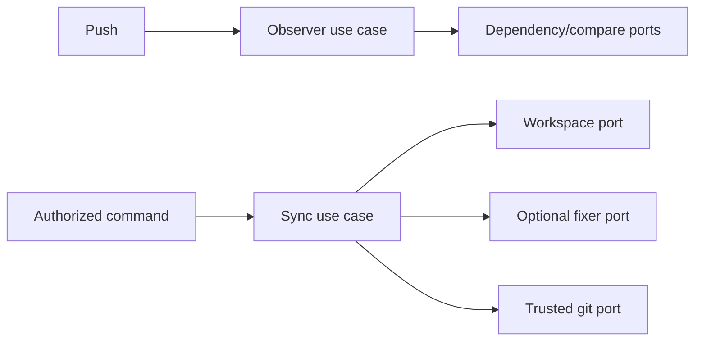

# Branch Synchronization and Conflict Recovery

- Status: As-built baseline
- Date: 2026-09-11
- Owners: Copilot maintainers
- Scope: all-branch drift observation and authorized parent-to-working-branch synchronization
- Related issues/PRs: managed issue lifecycle and agent runtime SDDs
- Required review gates: product UX, architecture, testing, documentation, security/operations
- Open decisions blocking readiness: none for the baseline

## 1. Executive summary

A lightweight all-branch observer finds open parent→working-branch relationships,
compares them, and maintains one issue notice when a branch falls behind.
Authorized users can dry-run or merge the parent into the working branch. Clean
merges need no agent; eligible conflicts may use the fixer inside a strict path,
Git-state, verification, credential, and remote-head boundary.

```text
push any branch -> resolve dependencies -> compare -> upsert/resolve one notice
authorized sync -> fetch heads -> prepare merge -> clean OR guarded fixer
                -> verify -> recheck heads -> trusted commit/push -> observer resolves notice
```

## 2. Problem, current behavior, and evidence

### 2.1 Problem

Feature chains and long-running branches drift as parents advance. Running the
full issue/agent pipeline on main/develop/release pushes is expensive and noisy,
while blind automated merges can overwrite concurrent work or expose credentials.

### 2.2 Current behavior

1. `copilot_branch_sync.yml` observes every non-deletion push with no agent inputs.
2. It reads open issues/PRs with pagination and resolves dependencies first from
   durable Copilot configuration, then linked branches and PR base/head facts.
3. It compares affected relationships and upserts one bot-owned notice; alignment
   resolves the same notice.
4. `/copilot sync-branch` or a bounded mentioned phrase invokes authorization
   and resolves the conversation target.
5. `--dry-run`, `--no-agent`, and `--from` alter only documented bounded behavior.
6. Workspace preparation fetches exact remote heads and performs a no-ff merge.
7. Conflicts are eligible for fixer only at ≤20 non-sensitive conflicted paths.
8. Verification, merge-state validation, and remote-head recheck precede trusted commit/push.

### 2.3 Evidence and contract classification

- Observed behavior: branch-sync domain, policies, use cases, repositories,
  workspace/time adapters, workflow, and docs.
- Intentional contract: separate observer, durable-first discovery, sticky
  notification, clean-merge fast path, conflict boundary, and race-safe push.
- Known debt and limitations: observation scales with open issue/PR pagination;
  relationships without durable configuration need an open PR; no live large-repo
  performance evidence is checked in.
- Unknown rationale: the original polling/GraphQL query shape is not a permanent API contract.
- Proposed improvements: indexed durable dependency storage needs a separate migration design.

## 3. Actors, surfaces, and terminology

| Actor | Goal | Entry point | Surface |
|---|---|---|---|
| Contributor | know branch is stale | parent/child push | issue notice |
| Maintainer | align safely | comment command | result comment/commit |
| Observer workflow | compare only | all-branch push | sticky notice |
| Fixer agent | resolve eligible conflicts | guarded merge workspace | conflict paths only |

“Parent” is the branch whose commits the “working branch” must contain. A
dependency is owned by durable issue configuration when available. “Aligned”
means the comparison shows no parent commits missing from the working branch.

## 4. Goals, non-goals, and fixed invariants

### 4.1 Goals

1. Parent drift MUST become visible without invoking an agent.
2. Sync MUST never push work prepared from stale remote heads.
3. Conflict assistance MUST be path- and state-bounded.

### 4.2 Non-goals

1. The observer does not run Bugbot, issue sizing, or full commit automation.
2. Sync does not rebase, force-push, auto-merge PRs, or resolve release reconciliation.
3. The fixer cannot choose branches or git operations.

### 4.3 Fixed product/safety invariants

1. Observer workflows MUST remain agent-free and all-branch.
2. Deletion pushes and invalid/same parent-child targets MUST not merge.
3. Sensitive/workflow paths and >20 conflicts MUST not use automated fixing.
4. Verification runs credential-free; only trusted fetch/push receives credentials.
5. Both remote heads MUST match preparation immediately before commit/push.

## 5. Current versus proposed product journey

| Stage | Broad/unsafe alternative | As-built contract | Effect |
|---|---|---|---|
| Observe | full commit workflow | metadata-only observer | low cost/no model |
| Notify | comment per push | one updated bot notice | bounded noise |
| Merge | agent always | clean git merge first | deterministic |
| Conflict | unrestricted edits | exact conflict-path guard | bounded risk |
| Push | trust checkout | remote-head compare | race safety |

No behavior change is proposed.

## 6. Functional behavior and state model

### 6.1 Happy path

1. Observer resolves and compares an affected dependency.
2. It updates a stale notice with branches and next command.
3. Authorized maintainer invokes sync; clean merge is prepared and verified.
4. Remote heads remain unchanged; trusted code commits/pushes.
5. The bot-authored push runs the observer and resolves downstream/current notices.

### 6.2 Alternative paths

- Already aligned returns a no-op result.
- Dry run reports clean/conflicted, aborts, and invokes no agent.
- `--no-agent` permits clean merge and safely aborts conflict.
- `--from` overrides only the parent after ref validation.
- Eligible conflict invokes fixer, validates exact paths/state, then follows normal verify/push.

### 6.3 State model

| State | Meaning | Next | Recovery |
|---|---|---|---|
| unknown relation | no parent/working fact | observed when linked | create/link PR/config |
| aligned | no parent drift | stale | parent advances |
| stale | notice active | preparing/aligned | invoke sync/manual merge |
| preparing | exact heads/merge prepared | conflicted/verifying/aborted | wait |
| conflicted | git conflicts exist | fixing/aborted | eligible fixer/manual |
| verifying | merge state/commands checked | pushing/aborted | repair tests |
| pushing | heads revalidated | aligned/failed | inspect remote |
| aborted | no push completed | stale | retry latest |

Replays update the same notice. Parent-child chains are reevaluated after bot
pushes. Any failure attempts merge abort and reports whether no push occurred.

## 7. User-facing configuration

| Input/option | Default | Allowed | Persistence |
|---|---|---|---|
| `check_branch_sync_action` | workflow-owned | exact single action | per observer run |
| `--dry-run` | false | flag | command only |
| `--no-agent` | false | flag | command only |
| `--from <branch>` | discovered parent | one validated ref | command only |
| fixer role tuple | common agent inheritance | validated provider/model/effort/command | run |
| verify commands | empty | bounded parsed commands | repository/run |

All-branch observation, no agent in observer, no-ff merge, conflict/file limits,
sensitive paths, credential isolation, remote-head validation, and no force push
are not configurable.

## 8. Clean Architecture design

| Boundary | Owns | Must not own/import |
|---|---|---|
| Domain | command options/natural-language phrase | Git/GitHub |
| Policies | dependency normalization, eligibility, outcome presentation | subprocesses |
| Use cases | observe and synchronize sequencing | provider DTOs |
| Ports | dependency query, compare, workspace, fixer, git, auth | concrete clients |
| Adapters | GraphQL pagination, Git workspace, timers | product policy |
| Workflows | event/permissions/composition inputs | agent configuration in observer |



Architecture and workflow contract tests MUST forbid agent inputs in the
observer and keep git/provider implementations outside application policy.

## 9. UI/UX and content contract

```markdown
Pending: **`feature/B` is 3 commits behind `feature/A`.** No automatic merge is running.
Action required: **Synchronize the branch.** Run `/copilot sync-branch` in issue #42.
Blocked: **2 conflicts include `.github/workflows/ci.yml`.** Automated resolution is forbidden; merge manually.
Partial: **Merge prepared, but verification failed.** Nothing was pushed; the stale notice remains.
Complete: **Merged `feature/A` into `feature/B` and pushed `abc1234`.** The notice is resolved.
```

One sticky issue notice owns current drift and links parent, working branch,
issue/PR, and command guidance. Command result names outcome, verification count,
and commit SHA when present. `--dry-run` explicitly says nothing was pushed.
English is fallback; visual icons have text; untrusted refs/paths/diagnostics are sanitized.

## 10. Failure, recovery, and cleanup

| Failure | Impact | Retained facts | Retry | Action | Cleanup |
|---|---|---|---|---|---|
| relation unavailable | no comparison | issue/PR facts | yes | link PR/config | none |
| compare/provider error | notice may be stale | prior notice | yes | rerun observer | none |
| ineligible conflict | no push | merge aborted | after manual resolution | merge manually | abort |
| verification/state fail | no push | remote branches | yes | fix command/code | abort |
| head race | no stale push | new heads | yes | rerun | abort |
| post-push notice fail | merge exists, notice stale | commit SHA | yes | rerun observer | no commit rollback |

## 11. Security, permissions, and privacy

Observer has read-only implicit token permissions and uses explicit PAT only for
needed GitHub reads/comment writes. Sync requires fresh actor authorization.
Branch refs, issue markers, PR content, conflict paths, fixer output, and verify
commands are untrusted and validated. Credentials are scoped to trusted
subprocesses; agent/verification environments are credential-free. Sensitive
paths, unexpected index/worktree changes, and control sequences fail closed.

## 12. Observability and operational UX

Observer logs dependency count/comparison outcomes without agent telemetry.
Sticky notices expose current stale/aligned fact. Sync result payload includes
outcome, branches, initial SHAs, conflicts, verification count, and commit SHA.
Failures say “no push completed” when true. Workflow contracts ensure bot pushes
remain observable and downstream relationships can update.

## 13. Compatibility, migration, rollout, and rollback

Durable configuration is preferred; existing linked branches/PR references are
fallback-compatible. Unknown/malformed markers are ignored as dependency
evidence, not executed. Installing/removing the observer does not change branch
history. Rollback disables the workflow/command; any completed merge remains an
ordinary auditable commit and is reverted normally if necessary.

## 14. Testing strategy and numeric budget

| Area | Minimum cases | Risks |
|---|---:|---|
| Commands/dependency/eligibility | 24 | options, links, limits, sensitive paths |
| State/idempotency/races | 20 | notice replay, chains, remote heads, abort |
| Use cases/workspace | 22 | clean/conflict/dry-run/verify/push |
| Adapters/workflow contracts | 16 | pagination, git states, all-branch/no-agent |
| UX/localization/sanitization | 12 | notices/outcomes/refs/errors |
| Integration/security/migration | 14 | observe→sync→resolve, credentials, fallback |
| **Total** | **108** | no double counting |

Global thresholds remain; dependency/eligibility policies SHOULD reach 95%
branch coverage. Fake git/GitHub/timers replace live services and waits. Tests
must exercise interrupted merge states and remote races. Manual evidence covers
sticky notice updates, chained branches, PR/issue rendering, and conflict guidance.

## 15. Documentation and discoverability

| Audience | Artifact | Required content |
|---|---|---|
| Contributor | branch synchronization | notice and commands |
| Maintainer | comment commands | authority/options |
| Operator | troubleshooting/security | abort/race/credentials |
| Developer | this SDD/architecture | ports and git boundary |

## 16. Acceptance scenarios

1. Any non-deletion branch push checks only affected open dependencies with no agent.
2. Repeated stale pushes update one notice; alignment resolves it.
3. Dry run reports clean/conflicted and leaves worktree/remote unchanged.
4. Clean sync verifies and pushes without fixer.
5. Unauthorized, same-branch, invalid-ref, sensitive, or >20-conflict requests do not push.
6. Eligible conflicts allow only conflict-path edits and valid merge state.
7. Verification or remote-head race aborts and reports no push.
8. Bot push triggers observer and updates dependent child relations.
9. Untrusted paths/refs/output cannot expose credentials or escape commands.

## 17. Requirements traceability

| Requirement | Owner | Evidence | Documentation |
|---|---|---|---|
| dependency discovery | policy/repository | dependency tests | detection flow |
| sticky observer | observe use case | observer tests | branch sync |
| safe merge | sync use case/workspace | sync/workspace tests | align branch |
| conflict boundary | eligibility/workspace policies | security/path tests | conflict boundary |
| workflow separation | workflow validator | contract tests | why separate |

## 18. Maintenance sequence

1. Update command/dependency/eligibility policies and tests.
2. Update observer/sync use cases including replay/race cases.
3. Update GraphQL/git/time adapters and workflow checks.
4. Update notices/results/docs/catalog.
5. Run full automated and human branch-chain UX validation.

## 19. Definition of Done

- [ ] The 108-case budget, coverage, architecture, and workflow gates pass.
- [ ] Clean/conflict/dry-run/replay/race/abort paths retain correct state.
- [ ] Agent, verify, and credentials remain in separate trust boundaries.
- [ ] All five UI states, links, localization, accessibility, and noise pass.
- [ ] Documentation and catalog evidence are current.
- [ ] Live chained-branch and conflict UX evidence is captured.

## 20. References and decisions

- Primary sources: catalogued branch-sync code, workflows, tests, and docs.
- Related SDDs: managed issue lifecycle; comment automation; agent runtime.
- Decision: observe cheaply on all branches; invoke fixer only for eligible conflicts.
- Rejected: full commit workflow everywhere, force push, agent-owned git.
- Follow-up: indexed dependency storage/performance study is outside this baseline.
