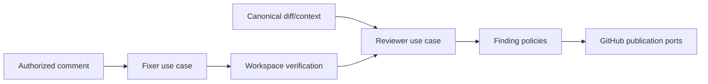

# Bugbot Analysis, Finding Publication, and Autofix

- Status: As-built baseline
- Date: 2026-09-11
- Owners: Copilot maintainers
- Scope: bounded change analysis, finding identity/publication, authorized autofix, and independent verification
- Related issues/PRs: Bugbot review-state reconciliation SDD; architecture
  quality and scalability hardening SDD
- Required review gates: product UX, architecture, testing, documentation, security/operations
- Open decisions blocking readiness: none for the baseline

## 1. Executive summary

Bugbot reviews a canonical bounded change scope, validates structured findings
locally, publishes only actionable evidence, and maintains stable identities
across reruns. Autofix is a separate authorized write path: it edits only a
guarded workspace, runs configured verification, commits and pushes through
trusted code, then performs a fresh read-only review. A successful edit alone
never proves a finding fixed.

```text
range/context -> read-only review -> validate/deduplicate/rank -> publish
comment + finding IDs -> authorize -> guarded fix -> verify -> commit/push
                      -> independent review -> reconcile current state
```

## 2. Problem, current behavior, and evidence

### 2.1 Problem

AI review is unsafe and noisy when it guesses diff locations, repeats defects,
trusts stale heads, leaks context, or marks its own edits fixed without fresh
evidence. GitHub review snapshots, inline comments, threads, checks, and issue
comments can also disagree after partial mutations.

### 2.2 Current behavior

1. Push, PR, comment, single action, or CLI selects a bounded review context.
2. Bugbot verifies one event PR or resolves one unique exact-head PR, then loads
   trusted prior markers, canonical diff locations, bounded human discussion,
   and ordered organization/repository/path/learned rules for that identity.
3. The read-only agent returns schema-constrained findings and resolved IDs.
4. Local policy rejects malformed, unsafe, ignored, low-confidence, duplicate,
   below-severity, or over-budget findings and ranks retained results.
5. Head freshness is checked before analysis and publication; superseded runs
   make no finding mutation.
6. Issue-only findings upsert comments; PR findings create one historical review
   snapshot with line/range or file-level children plus one stable status card.
7. Publication precedes resolution; provider state is re-read and projected by
   the separate reconciliation contract.
8. Authorized autofix resolves a target branch, applies guarded edits, verifies,
   commits/pushes, and reruns independent review while findings remain open until proved.

### 2.3 Evidence and contract classification

- Observed behavior: Bugbot domain/policies/use cases/composition, workflows,
  quality tests, and Bugbot docs.
- Intentional contract: canonical diff, stable local identity, trusted marker
  ownership, freshness gates, publication-before-resolution, independent review,
  and fail-closed unknown state.
- Known debt and limitations: model quality is probabilistic; provider APIs can
  make surfaces temporarily unverifiable; comment update budget limits how many
  historical blocks are refreshed per run; fixed context caps can intentionally
  produce a partial review; controlled live quality evidence is external.
- Unknown rationale: earlier prompt wording is not treated as a permanent public contract.
- Implemented hardening: canonical single-PR selection, bounded provider reads,
  explicit coverage, and retained-only resolution are specified in
  [`bugbot-context-selection-and-budgeting.md`](./bugbot-context-selection-and-budgeting.md)
  under the shared gates in
  [`architecture-quality-and-scalability-hardening.md`](./architecture-quality-and-scalability-hardening.md).
  New model/evaluation policies require benchmark-backed proposals.

## 3. Actors, surfaces, and terminology

| Actor | Goal | Entry point | Visible surfaces |
|---|---|---|---|
| Contributor | receive actionable review | push/PR | review, inline finding, status |
| Maintainer | request/dismiss/fix | comment/CLI | thread, comment, commit |
| Reviewer agent | analyze only | structured port | validated response |
| Fixer agent | edit bounded workspace | authorized use case | proposed files only |
| GitHub | own reviews/threads/checks | adapters | provider facts |

A “review snapshot” is immutable history. A “status card” is the current
aggregate projection. Finding identity uses stable provider ID, location
fingerprint, then unambiguous semantic fingerprint. `unknown` means evidence was
not verified; it is not clean.

## 4. Goals, non-goals, and fixed invariants

### 4.1 Goals

1. Published findings MUST be actionable, addressable, bounded, and traceable.
2. Reruns MUST converge without duplicate or false-resolved findings.
3. Autofix MUST be authorized, verified, race-safe, and independently reviewed.

### 4.2 Non-goals

1. Bugbot does not guarantee detection of every defect.
2. Style opinions and speculative concerns are excluded.
3. Autofix does not auto-merge or declare its own result correct.

### 4.3 Fixed product/safety invariants

1. Confidence below 0.70, unsafe paths, malformed schema, and stale heads are rejected.
2. Marker ownership requires authenticated bot identity and matching author.
3. Publication MUST finish before resolution transitions.
4. Manual human thread resolution becomes durable dismissal.
5. Fixer/verification processes never receive GitHub credentials.
6. File-changing comment actions require an authoritative PR/branch target and
   never infer one by scanning issue-related open PRs.

## 5. Current versus proposed product journey

| Stage | Naive risk | As-built contract | Effect |
|---|---|---|---|
| Scope | checkout guess | verified event PR or unique exact-head PR, then exact before/after or canonical bounded diff | relevant evidence |
| Output | prose | local schema and policy validation | deterministic rejection |
| Location | guessed line | proved diff address or file fallback | valid GitHub review |
| Identity | comment ID only | local location + semantic fingerprints | rebase resilience |
| Fix | model edits/pushes | guarded edit + trusted verify/git | least authority |
| Resolution | fixer claims success | independent provider re-read/review | no false clean |

No behavior change is proposed.

## 6. Functional behavior and state model

### 6.1 Happy path

1. Materialize and verify review range/context and current head.
2. Query reviewer with bounded prior findings/rules/discussion/diff.
3. Parse, validate, deduplicate, filter, rank, and limit findings.
4. Recheck head; publish review/comments/status; resolve eligible prior findings.
5. Re-read all applicable surfaces, project state, publish summary/check/telemetry.
6. For autofix, authorize, edit, validate paths, verify, commit/push, and repeat review.

### 6.2 Alternative paths

- Draft PRs skip unless `bugbot-review-drafts` is enabled.
- Dry run returns proposed state after freshness checks but mutates nothing.
- Overflow remains summarized and counts in aggregate state.
- Unaddressable lines become explicit file-level findings, never guessed anchors.
- An issue-only route can use a bounded branch/current-commit scope. A
  PR-required route without a verified canonical PR aborts without analysis.
- Reaching a fixed context cap is explicit partial coverage; provider read
  failure aborts before the model and is not converted to empty context.

### 6.3 Finding state model

| State | Meaning | Next | Recovery |
|---|---|---|---|
| candidate | model output not yet trusted | rejected/open | local policy |
| open/reopened | actionable defect visible | fixed/dismissed/verification-required | code/human action |
| verification-required | evidence changed/manually reopened | open/fixed/dismissed | fresh review |
| fixed | independent evidence proves absence | reopened | later regression |
| obsolete | finding no longer maps to scope | terminal/reopened | fresh evidence |
| dismissed | human resolved/explicit dismissal | terminal/reopened by human policy | human |
| unknown | provider evidence unavailable/malformed | any verified state | retry/reconcile |

Canceled or superseded runs publish no stale mutations. Partial marker/thread
transitions are ordered marker-first and repaired by replay.

## 7. User-facing configuration

| Input | Default | Allowed/bounds | Persistence |
|---|---|---|---|
| `bugbot-severity` | `low` | info/low/medium/high | per run |
| `bugbot-comment-limit` | `20` | 1–100 | per run |
| `bugbot-dry-run` | `false` | boolean | per run, no persistence when true |
| `bugbot-effort` | Action `default`; setup recommends `smart` | low/default/high/smart | per run |
| `bugbot-review-drafts` | `false` | boolean | per run |
| `bugbot-suggested-changes` | `true` | boolean | per run |
| `bugbot-fail-on-unresolved` | `false` | boolean | check conclusion only |
| rules/ignore/verify commands | empty | bounded policy values | repository/workflow |

Confidence floor, schema validation, head guards, path safety, marker ownership,
publication ordering, independent review, provider page limits/concurrency,
prompt bounds (100 prior findings/48,000 characters, 50 conversation entries/
24,000 characters, 1,000 diff files/64,000 characters), retained-only
resolution eligibility, and credential isolation are not configurable.

## 8. Clean Architecture design

| Boundary | Owns | Must not own/import |
|---|---|---|
| Domain | finding, canonical PR selection, coverage, identity, review state/projection | GitHub/CLI/credentials |
| Policies | bounded packing/concurrency/eligibility, filtering, ranking, ownership, presentation/reconciliation | I/O |
| Use cases | load/analyze/publish/fix/reconcile sequences | provider DTOs/credentials |
| Ports | repository-bound context, findings, resolution, agent, git, telemetry/navigation | concrete clients, tokens in method parameters |
| Adapters | GitHub surfaces, CLI agent, filesystem rules | finding policy |
| Composition | repository/credential binding and capability wiring | product decisions, credentials in use-case requests |



The reconciliation SDD owns post-publication cross-surface truth. Dependency,
cycle, provider-port, workflow, schema, and quality-eval checks MUST remain executable.

## 9. UI/UX and content contract

```markdown
Pending: **Bugbot is reviewing commit `abc1234`.** No action is required.
Action required: **2 actionable findings remain.** Open each linked thread or request `/copilot fix <id>`.
Blocked: **The PR head changed during review.** No stale finding was published; the newer run owns the result.
Partial context: **The retained evidence was reviewed, but a fixed context cap was reached.** Findings may be actionable; this run cannot declare the whole PR clean or resolve omitted history.
Partial publication: **Review published; one thread could not be reconciled.** Current state is `unknown`, not clean; retry reconciliation.
Complete: **Bugbot verified this revision with no actionable findings.** Historical reviews remain available.
```

Each finding shows severity/category/confidence, causal explanation, evidence,
exact file/location or explicit fallback, practical fix, and stable ID. The PR
has one current status card; historical review snapshots stay history. Suggested
changes require proved right-side ranges. Links are same-server/repository and
descriptive. Icons never replace status text. English is fallback; untrusted
discussion, paths, Markdown, mentions, markers, and URLs are sanitized.

## 10. Failure, recovery, and cleanup

| Failure | Impact | Retained facts | Retry | Action | Cleanup |
|---|---|---|---|---|---|
| invalid agent response | no new publication | prior state | yes | inspect runtime/schema | none |
| stale head | run superseded | prior state | automatic newer run | none | discard snapshot |
| partial publication | some findings visible | marker/provider facts | yes | reconcile | no false resolution |
| provider re-read fail | aggregate unknown | historical evidence | yes | retry | none |
| context cap reached | bounded partial analysis | retained evidence and counts | explicit recheck | inspect/split/recheck | no omitted resolution |
| canonical PR ambiguous/stale | no analysis or mutation | target and bounded candidate fact | new event | close obsolete PR/retry current head | none |
| autofix verification fail | no commit | findings remain open | yes | repair code/tests | abort workspace |
| push race | no stale push | remote heads/open findings | yes | rerun | abort workspace |

## 11. Security, permissions, and privacy

Reviewer roles are read-only, approval-never, network-disabled where supported,
and ignore repository/user agent configuration. Fixer writes are limited by
workspace/path policies; trusted code owns verification/git. Prompt inputs are
bounded and untrusted. Structured output is locally validated. Secrets, control
sequences, and sensitive paths are rejected/redacted. Finding navigation accepts
only authenticated same-HTTPS-server/repository URLs.

## 12. Observability and operational UX

Content-free telemetry records outcome, elapsed time, configured effort, counts,
validation stages, canonical selection reason, request counts, fixed concurrency,
coverage, and per-source retained/omitted/truncated counts. Job Summary and Check Run expose aggregate states; status
card links to current findings and trusted run/commit/review context. Provider
read status distinguishes verified/failed/not-applicable. Concurrency cancels
superseded branch review runs; head guards and idempotent writes protect races.

## 13. Compatibility, migration, rollout, and rollback

Current code contains marker identity checks, but there are no installed users
or real persisted findings to preserve. Hardening therefore replaces marker and
context contracts atomically: removed shapes are invalid, with no compatibility
reader, translation, migration, or deprecation window. Dry run and non-blocking
unresolved default enable controlled first use. After real publication, rollback
must preserve visible history and incorrect mutations are reverted through Git,
not deleted invisibly.

P2-C additionally replaces every unbound Bugbot SCM/Git method with a bound
semantic port. Public programmatic reviews supply an already repository-bound
gateway as the single source of repository identity; `BugbotReviewRequest`
contains target/review facts and no credential or duplicate repository, and the
service never constructs `Execution`. Removed credential/request and unbound
gateway shapes are invalid immediately and receive no compatibility adapter.

## 14. Testing strategy and numeric budget

| Area | Minimum cases | Risks |
|---|---:|---|
| Finding/config/identity policy | 36 | schema, fingerprint, rank, limits |
| Lifecycle/idempotency/races | 30 | stale heads, replay, partial transitions |
| Use cases/autofix | 28 | context, publish, verify, commit, re-review |
| Provider/workflow contracts | 22 | diffs, reviews, threads, checks, ranges |
| UX/localization/sanitization | 20 | status/finding/overflow/links/Markdown |
| Integration/security/cutover | 20 | E2E lifecycle, injection, credentials, sole marker schema |
| **Total** | **156** | no double counting |

Global thresholds remain; new pure Bugbot policies SHOULD reach 95% branch
coverage and security/identity policy 100% for enumerated branches. Fakes replace
live GitHub/models/waits; golden output also receives semantic assertions.
Quality eval and benchmark are required but do not replace deterministic tests.
Manual evidence covers real diff anchors, suggested changes, mobile, dark/light,
screen reader, and controlled live model samples.

## 15. Documentation and discoverability

| Audience | Artifact | Required content |
|---|---|---|
| User | Bugbot detection/autofix | trigger, states, action |
| Maintainer | publication/failure/permissions | markers, limits, recovery |
| Operator | quality observability/verification | telemetry, checks, commands |
| Contributor | this + reconciliation SDD | boundaries and invariants |

## 16. Acceptance scenarios

1. An exact current range produces only locally valid actionable findings.
2. A malformed/unsafe/low-confidence/stale result publishes nothing unsafe.
3. Repeated semantic/location finding updates one identity where unambiguous.
4. PR publication uses proved anchors or states a file-level fallback.
5. Overflow remains counted while comment budget is respected.
6. Partial publication cannot mark a finding resolved.
7. Unauthorized autofix performs no workspace or finding mutation.
8. Authorized autofix verifies, commits/pushes, then independently reviews.
9. Provider read failure yields unknown and a failed/neutral contract as configured, never clean.
10. Dry run mutates no comment, thread, check, config, or branch.
11. Event identity or unique exact-head selection owns one canonical PR end to end.
12. Fixed cap reach is partial and omitted findings are not resolution-eligible.

## 17. Requirements traceability

| Requirement | Owner | Evidence | Documentation |
|---|---|---|---|
| bounded review | context/prompt/schema policies | prompt/schema/E2E tests | detection |
| stable identity | finding identity domain | identity tests | publication |
| safe publication | publish/reconciliation use cases | publication/reconciliation tests | publication |
| guarded autofix | autofix/workspace/git use cases | autofix/security tests | autofix |
| current truth | reconciliation spec/policies | projection tests | detection/quality |

## 18. Maintenance sequence

1. Update finding/config/identity contracts and exhaustive tests.
2. Update context/review/publication/autofix use cases and race tests.
3. Update provider adapters/workflows/schema/benchmarks.
4. Update presentation fixtures, Bugbot docs, companion SDD, and catalog.
5. Run full gates plus controlled live and human UX evidence.

## 19. Definition of Done

- [ ] The 156-case budget, coverage, quality eval, and architecture gates pass.
- [ ] Stale, replay, partial, unknown, dismissal, and unsupported-schema cases converge safely.
- [ ] Autofix authority, paths, verification, git, and fresh review are proven.
- [ ] All five UI states, anchors, links, accessibility, localization, and noise pass.
- [ ] Workflows, docs, reconciliation SDD, and catalog agree.
- [ ] Controlled live provider and GitHub UX evidence is captured.

## 20. References and decisions

- Primary sources: catalogued Bugbot code, workflows, tests, docs, and evals.
- Related SDD: `bugbot-review-state-reconciliation.md`.
- Planned hardening: `bugbot-context-selection-and-budgeting.md` owns canonical
  PR selection and the provider-request budget; the architecture hardening SDD
  owns shared sequencing and verification gates.
- Decision: independent evidence, not fixer assertion, owns resolution.
- Rejected: guessed anchors, model-only validation, provider-ID-only identity.
- Follow-up: model-specific quality tuning remains benchmark-governed.
