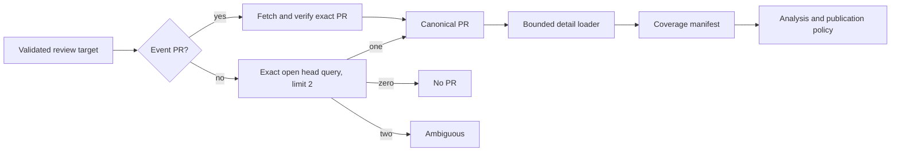

# Bugbot Context Selection and Budgeting

- Status: Implemented
- Date: 2026-09-11
- Last updated: 2026-09-12
- Catalog capability ID: `bugbot-analysis-and-autofix`
- Last verified: 2026-09-12 against `develop` at `9fc07632ca39fce585b762b1cc08bde1e797f76a`
- Owners: Copilot and Bugbot maintainers
- Scope: resolve exactly one canonical pull request, bound every provider read
  and prompt section, and make incomplete context visible and safe
- Related issues/PRs: none recorded
- Required review gates: product UX, architecture, testing, documentation,
  security/operations, provider-contract review
- Open decisions blocking readiness: none

## 1. Executive summary

Bugbot MUST resolve zero or one canonical pull request before it loads detailed
review context. It never lists every open PR and fans out comments/thread/diff
requests. A trusted event candidate is verified against GitHub; otherwise a
server-side exact head query returns at most two records so uniqueness or
ambiguity is known with constant work.

All context sources have page, item, character, and concurrency limits. Reaching
a limit is a successful but `partial` coverage fact. A provider failure is
`unavailable` and aborts review before the model or publication. Partial coverage
may produce findings about included evidence but can never produce a whole-PR
clean result or resolve an omitted prior finding.

```text
trigger -> canonical PR decision -> bounded reads (max concurrency 2)
        -> complete/partial coverage -> analysis -> bounded publication
```

## 2. Problem, current behavior, and evidence

### 2.1 Problem

Before this change, the loader asked for all open PR numbers for a branch, fanned comments and
thread-state reads out across all of them, and then loads diff context from the
first array element. Repository size can multiply requests, while array order
silently decides which PR receives diff, publication, and reconciliation logic.

### 2.2 Replaced behavior

1. `getOpenPullRequestNumbersByHeadBranch` returns an unbounded number array.
2. Two independent `Promise.all` operations request comments and threads for
   every returned PR.
3. `openPrNumbers[0]` supplies head/diff context.
4. Human conversation is limited to 50 items, 24,000 characters, and 2,000 per
   item; previous findings use 100 items/48,000 characters; diff uses 64,000 and
   12,000 per patch; rules use 100,000 and 30,000 per rule.
5. Conversation packing walks old-to-new through the last 50 and stops at the
   first overflow, which can omit newer items.

### 2.3 Evidence

- Code: `load_bugbot_context_use_case.ts`, `bugbot_review_context.ts`,
  `bugbot_finding_context.ts`, `bugbot_review_rules.ts`, and Bugbot read ports.
- Product contract: `bugbot-analysis-publication-and-autofix.md` and the Bugbot
  documentation set.
- Provider contract: GitHub's pull-request list API supports `head=owner:branch`,
  `state=open`, pagination, and complete PR identity fields.
- Unknowns: production PR/comment distributions are not stored in the repository;
  deterministic 10,000-candidate and page-limit fixtures define the bound.

### 2.4 Retrospective classification

Not applicable. This prospective SDD refines the catalogued as-built Bugbot SDD.

## 3. Actors, surfaces, and terminology

| Actor | Goal | Entry point | Visible surfaces |
|---|---|---|---|
| PR author/reviewer | receive findings for the intended PR | push, PR, `/copilot review` | review comments, check, summary |
| Issue participant | receive issue-only analysis when supported | issue/commit event | issue comments/check |
| Maintainer | predict provider cost and diagnose missing context | workflow run | Job Summary/telemetry |
| Bugbot | never infer clean/resolved from omitted evidence | analysis pipeline | review projection |

A `canonical PR` is a provider-verified open PR in the target repository whose
head owner, ref, and SHA match the review target. `Coverage` is `complete` or
`partial`; `unavailable` is a failure, not partial success. A `logical read` is
one semantic port operation even if its bounded adapter uses more than one HTTP
page.

## 4. Goals, non-goals, and fixed invariants

### 4.1 Goals

1. Make provider work constant with respect to unrelated/open PR count.
2. Use the same canonical PR for diff, discussion, publication, freshness, and resolution.
3. Bound pages, retained items, characters, and simultaneous requests.
4. Preserve useful partial analysis without overstating cleanliness or resolution.
5. Expose deterministic coverage counts and selection reason without content telemetry.

### 4.2 Non-goals

1. This work does not review multiple PRs in one invocation.
2. It does not configure context/page/concurrency safety limits.
3. It does not treat a provider error as empty context.
4. It does not change severity, comment limit, autofix authorization, or rule precedence.

### 4.3 Fixed product and safety invariants

1. Position zero, newest PR, highest number, or first provider result is never a
   selection policy.
2. A PR-specific trigger without a verified canonical PR performs no model call,
   publication, resolution, or autofix.
3. Omitted findings are never eligible for `resolved_finding_ids`.
4. Partial diff/context cannot yield a whole-review `clean` state.
5. At most two independent provider detail requests are in flight.
6. Query values and retained content remain sanitized and bounded.

## 5. Current versus proposed product journey

| Stage | Current | Proposed | User/operator effect |
|---|---|---|---|
| Select | list numbers, use first | verify event or unique exact head | deterministic target |
| Load | fan out per PR | detail for one PR | bounded requests |
| Pack | local section limits, ambiguous recency | newest-first selection, chronological rendering | relevant discussion retained |
| Failure | empty/degraded can be confused | provider failure aborts | no false clean |
| Truncation | notes in some text blocks | typed coverage manifest | safe resolution/publication |



Text equivalent: the target either verifies its event PR or performs one exact
head query; only a unique result becomes canonical; one bounded loader produces
context plus coverage facts that constrain analysis and publication.

## 6. Functional behavior and state model

### 6.1 Review target contract

The route projects a `BugbotReviewTarget` containing repository owner/name,
numeric ID when the event supplies it, trigger kind, optional positive issue
number, normalized head owner and ref, expected full head SHA, and optional event
PR number. It contains no token; context ports are auth-bound in composition.

PR-required triggers are pull-request events, PR review comments, explicit review
commands on a PR, and autofix. Issue/commit analysis MAY be issue-only only when
the owning workflow does not request PR publication or resolution.

An issue-only comment does not scan open PRs to infer a write branch. Autofix or
another file-changing comment command requires the intended PR review-comment
event or another execution with an explicit authoritative branch. This is the
sole initial contract; there is no first-matching-PR fallback.

### 6.2 Canonical selection policy

1. If an event PR number exists, call `getPullRequest(number)` once. Accept only
   an open PR whose base repository owner/name and, when available, numeric ID
   equal the target, whose head repository owner and ref exactly match the target,
   and whose current head SHA equals the expected SHA.
   Closed, cross-repository, fork-owner mismatch, or stale SHA is `stale/invalid`,
   not a fallback to branch search.
2. Without event PR, call `findOpenPullRequestsByExactHead` with encoded
   `head=<owner>:<ref>`, `state=open`, and `per_page=2`. The port returns full
   candidate records, not numbers.
3. Zero candidates yields `none`; one candidate is canonical only after the same
   repository/head/SHA checks; two results yields `ambiguous` and no pagination.
4. A PR-required target with `none`, `ambiguous`, or `stale` aborts safely. An
   issue-only target with `none` continues without PR detail.

No retry changes the selection criteria. A transient selection read uses the
standard bounded provider retry and otherwise becomes unavailable.

### 6.3 Provider and page budget

| Source | Logical reads | HTTP-page cap | Retained cap |
|---|---:|---:|---:|
| event PR or exact head selection | 1 | 1 | at most 2 candidates |
| issue comments | 1 | 2 x 100 | newest 200 provider records |
| canonical PR review comments | 1 | 2 x 100 | newest 200 provider records |
| review thread states | 1 | 2 x 100 nodes | newest 200 thread records |
| canonical PR diff snapshot | 1 | 10 x 100 files | 1,000 file records before prompt packing |

With a canonical PR and issue, context loading therefore performs at most five
logical reads and 17 raw provider requests before bounded transient retries.
Without a PR it performs only the applicable issue read plus selection. Rules
are local/versioned file reads and are not provider requests. The fixed request
concurrency is two; pagination within one logical read is sequential.

When an endpoint exposes a last-page link, adapters MAY fetch the last two pages
to retain newest comments without walking all earlier pages. Otherwise they stop
after two pages and mark earlier records omitted. Deduplication uses provider ID
before any item/character budget.

### 6.4 Prompt and item budget

| Context section | Item cap | Section cap | Per-item cap | Selection order |
|---|---:|---:|---:|---|
| unresolved previous findings | 100 | 48,000 chars including wrappers/note | existing finding body cap | newest unresolved first, render chronological |
| human conversation | 50 | 24,000 chars including omission note | 2,000 chars | newest first for packing, render chronological |
| diff | 1,000 files pre-pack | 64,000 chars | 12,000 patch chars | provider file order; ignored files removed first |
| review rules | deduplicated | 100,000 chars | 30,000 chars | organization then repository specificity |

Every record gains a normalized `createdAt` and stable provider ID. Combined
conversation sorting is ascending `(createdAt, sourceKind, providerId)`; packing
walks that sequence from newest to oldest until both item and character budgets
are reached, then reverses selected entries for chronological rendering. An
oversized item is truncated to its per-item cap and does not prevent newer items.

The coverage manifest records per source: fetched pages/items, retained items,
omitted items when known, truncated items/chars, limit reached, and status. It is
model-visible as a short fixed template and observable as content-free counts.

### 6.5 Complete, partial, and unavailable behavior

| Condition | Coverage | Model call | Publication/resolution |
|---|---|---:|---|
| all applicable reads complete, no cap hit | complete | yes | ordinary policy |
| page/item/character/diff/rule cap hit | partial | yes | new findings for included evidence; no whole-PR clean; resolve only included IDs with current evidence |
| issue comments fail when issue exists | unavailable | no | none |
| PR comments or threads fail | unavailable | no | none |
| diff/identity read fails or PR changes SHA | stale/unavailable | no | none |
| rule loading fails validation/read | unavailable | no | none |
| issue-only target has no PR | complete/partial issue coverage | yes if workflow supports it | issue-only, no PR publication/resolution |

If the head SHA changes after context load, the existing freshness guard rejects
all output. A partial run updates at most one durable summary to say partial and
does not close/resolve any finding absent from `eligibleResolutionIds`.

### 6.6 State machine

| State | Entered when | User-visible meaning | Allowed next states | Recovery/owner |
|---|---|---|---|---|
| selecting | target validated | finding intended PR | canonical/none/ambiguous/stale/unavailable | selection policy |
| canonical | one exact PR verified | loading PR context | complete/partial/unavailable | loader |
| complete | all applicable sources complete | full bounded review | analyzed/stale | analyzer |
| partial | a fixed cap omitted data | limited review | analyzed/stale | analyzer/publisher |
| unavailable | required source failed | no review published | selecting on retry | provider/operator |
| stale | identity/SHA changed | obsolete review discarded | selecting on new event | route |

## 7. User-facing configuration

Existing Bugbot settings remain unchanged. Selection order, exact query, five
logical reads, page/item/character limits, concurrency two, coverage semantics,
and resolution restrictions are safety/quality boundaries and are not
configurable. Ignore patterns and organization/repository rules continue to be
snapshotted for the run after validation; they cannot increase hard budgets.

## 8. Clean Architecture design

### 8.1 Responsibilities and dependency direction

| Layer/boundary | Owns | Must not own/import |
|---|---|---|
| Domain/pure policy | candidate validation/selection, coverage, deterministic packing | GitHub DTOs, `Execution` |
| Application | target/context requests, bounded scheduling, resolution eligibility | Octokit, tokens |
| Adapters | exact encoded query, bounded pagination, DTO mapping/error mapping | finding/publication policy |
| Infrastructure | auth-bound port composition and concurrency limiter | selection criteria |
| Entrypoints | validated event/command target projection | direct context fan-out |
| Presentation | partial/unavailable/clean/finding views | hidden omitted content |

The PR context port exposes `getPullRequest`,
`findOpenPullRequestsByExactHead(limit: 2)`, bounded comments, bounded threads,
and a diff snapshot including canonical identity. It never exposes “all open PR
numbers.” Issue/comment ports return typed page metadata.

### 8.2 Executable architecture constraints

1. No `Promise.all` or unbounded map over provider candidates is permitted in
   Bugbot context code; a tested limiter owns concurrency.
2. The old all-open-PR port method and `openPrNumbers` context field are removed.
3. Architecture tests prohibit `Execution`, raw token parameters, Octokit DTOs,
   and provider pagination from the domain/loader contracts.
4. Request-budget tests instrument raw calls and fail above the table caps.
5. Publication/resolution requires the same canonical identity and coverage
   manifest generated by the loader.
6. A coverage ratchet enforces 100% branch coverage on the new pure selection,
   packing, limiter, and eligibility policies and 95/90 changed-path thresholds.

## 9. UI/UX and content contract

Normal complete runs keep current finding/check UX. Partial and blocked states
are explicit:

```markdown
### Bugbot review: partial coverage

**Status:** Findings below are based on the retained portion of PR #412 at `9ad6…`.
**Impact:** This run cannot declare the whole pull request clean.
**Coverage:** 1,000 files inspected; 37 file records and 18 older discussion items omitted by fixed limits.
**Action:** Inspect omitted files locally or split the pull request, then run `/copilot recheck`.

[Open pull request](...) · [Open workflow run](...)
```

Ambiguous: **No review was run because two open pull requests have the exact
head `acme:feature/355`. Close the obsolete PR or invoke review from the intended
PR.** Unavailable: **No finding state changed because GitHub review threads could
not be loaded. Retry later.** Complete clean may say clean only when coverage is
complete and freshness passes.

One summary update is allowed per run plus configured finding comments. Selection
errors do not create per-candidate comments. Existing locale/fallback,
sanitization, descriptive links, and narrow Markdown requirements remain.

## 10. Failure, recovery, and cleanup

| Failure/partial state | User impact | Retained facts | Automatic retry | Required action | Cleanup |
|---|---|---|---|---|---|
| no PR for required trigger | no review | target facts | no guessing | invoke from/open intended PR | none |
| ambiguous exact head | no review | bounded candidate count | no | close/select PR | none |
| stale head/event | obsolete run stops | prior finding state | next event | rerun at current head | discard output |
| required read unavailable | no model/publication | prior durable state | bounded adapter retry | retry later | none |
| fixed limit reached | partial findings possible | coverage manifest | no expansion | inspect/split/recheck | no omitted resolution |
| model/publish failure | current result fails | context identity/coverage | owning policy | retry if fresh | existing idempotent publication |

## 11. Security, permissions, and privacy

1. Event PR number, branch, SHA, comments, patches, and rules are untrusted until
   provider validation/sanitization.
2. Head query values are passed as encoded structured parameters, never string
   interpolation into URLs or shell commands.
3. Auth is bound in adapters; context and domain records contain no token.
4. Omitted content is represented only by counts; logs/telemetry contain no body,
   patch, rule, author, or secret.
5. Fork/head-owner mismatch and cross-repository PRs fail closed.

## 12. Observability and operational UX

Emit repository numeric ID, trigger kind, selection reason, candidate bucket
`0|1|2+`, canonical PR number/SHA when public, logical/raw request counts,
maximum observed concurrency, coverage state, and per-source retained/omitted/
truncated counts. Do not emit branch/comment/rule/patch content. Rate-limit
failure remains distinct from fixed-budget truncation.

## 13. Compatibility, migration, rollout, and rollback

1. Compatibility and persisted-data migration are not applicable because there
   are no installed users or real finding records to preserve.
2. Replace the old all-open-PR port, `openPrNumbers`, loader, context shape, and
   presentation contract atomically. Do not add the exact-query method beside
   the old method or ship dual fields/readers.
3. Only `canonicalPullRequest` and explicit coverage/resolution eligibility are
   accepted after merge. Removed context/marker shapes are invalid and are not
   translated.
4. Partial status is part of the sole initial user contract, not additive or
   gated behavior. Code, docs, tests, and UI launch together.
5. Before first real use, rollback is a complete revert. Afterwards, fix forward;
   no rollback may reintroduce per-PR fan-out or implicit first-element selection.

## 14. Testing strategy and numeric budget

This SDD owns at least **18 distinct cases**.

| Area | Minimum cases | Required risks |
|---|---:|---|
| Selection/pure packing | 4 | event, none, unique, ambiguity/stale; newest packing |
| State/freshness/eligibility | 3 | partial clean prohibition, omitted resolution, SHA change |
| Application loader | 3 | PR, issue-only, unavailable abort |
| Provider adapters | 4 | exact encoding, two-result cap, page caps, rate/error mapping |
| UX/sanitization | 2 | partial and ambiguous/unavailable content |
| Integration/security | 2 | 10,000 unrelated candidates and max concurrency/call ledger |
| **Total** | **18** | no double counting |

Selection, packing, coverage, and resolution-eligibility policies require 100%
enumerated branch coverage. Changed loader/adapters require 95% lines/statements
and 90% branches/functions; repository thresholds remain 90/90/88/82. Tests use
synthetic pages, counters, deferred promises, and fixed clocks; no live GitHub or
sleep. Manual evidence reviews one complete, one partial, and one ambiguous Job
Summary/check on narrow and desktop layouts.

## 15. Documentation and discoverability

Update `docs/bugbot/how-it-works.mdx`, `detection.mdx`,
`failure-scenarios.mdx`, `quality-observability.mdx`, and `permissions.mdx`.
Document canonical identity, exact query, fixed budgets, partial-clean limitation,
omitted-finding resolution rule, and recovery commands. Update the as-built SDD
and catalog evidence in the implementation slice.

## 16. Acceptance scenarios

1. Ten thousand unrelated open PRs cause no per-candidate detail read and do not
   change the fixed call count.
2. A verified event PR wins only when repository, owner/ref, state, and SHA match.
3. An event mismatch aborts instead of falling back to another branch PR.
4. Exact head zero/one/two results yield none/canonical/ambiguous deterministically.
5. Only the canonical PR is used for comments, threads, diff, publication,
   freshness, and resolution.
6. No more than two provider detail requests run concurrently and raw page caps hold.
7. Newest discussion is retained and rendered chronologically within all caps.
8. A required source failure causes no model call or finding-state mutation.
9. Fixed truncation marks partial, prevents whole-PR clean, and limits resolution
   to included prior IDs with current evidence.
10. A head SHA change discards generated output before publication.
11. Issue-only supported flow never invokes a PR port.

## 17. Requirements traceability

| Requirement | Owner | Evidence | Documentation |
|---|---|---|---|
| canonical PR | selection policy/exact query adapter | identity/ambiguity/stale tests | detection |
| bounded reads | loader/limiter/adapters | call/page/concurrency ledger | how it works |
| deterministic prompt | packing/coverage policies | boundary/ordering tests | observability |
| safe partial behavior | analyzer/publication/resolution policy | partial clean/omission tests | failure scenarios |
| no secrets/content telemetry | auth-bound ports/telemetry mapper | architecture/redaction tests | permissions |

## 18. Implementation sequence

1. Add canonical candidate, target, coverage, and request-ledger types/tests.
2. Implement direct verification and exact-head query with bounded pagination.
3. Replace per-PR fan-out with the two-slot loader and one canonical identity.
4. Correct newest-first packing and propagate coverage/resolution eligibility.
5. Update presentation, telemetry, docs, SDD/catalog evidence, then delete the
   obsolete all-open-PR port and fields.

## 19. Definition of Done

- [x] Canonical selection has no implicit ordering or fallback.
- [x] Provider work and maximum concurrency meet every fixed budget.
- [x] Required read failures abort before model/publication/resolution.
- [x] Partial coverage cannot declare clean or resolve omitted findings.
- [x] The same identity is used end to end and freshness is rechecked.
- [x] At least 18 distinct cases and changed-module/repository thresholds pass.
- [x] Active behavior, docs, UX, telemetry, SDD, catalog, and ports agree.
- [x] No open decision, unbounded pagination/fan-out, legacy context/marker,
      compatibility method, dual field, or translator remains.

## 20. References and decisions

- Parent: `architecture-quality-and-scalability-hardening.md`.
- Baseline: `bugbot-analysis-publication-and-autofix.md`.
- [GitHub REST pull requests](https://docs.github.com/en/rest/pulls/pulls#list-pull-requests).
- Decision: provider failure is unavailable and aborts; deterministic cap reach
  is partial and may analyze only retained evidence.
- Decision: exact head queries return at most two records because uniqueness,
  not enumeration, is the required fact.
- Implementation evidence: `src/domain/bugbot/context.ts`,
  `src/application/usecases/steps/commit/bugbot/load_bugbot_context_use_case.ts`,
  `src/infrastructure/composition/bugbot_context_port_factory.ts`, provider
  bounded-read repositories, Bugbot context tests, and the documentation named
  in section 15.
