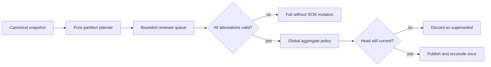
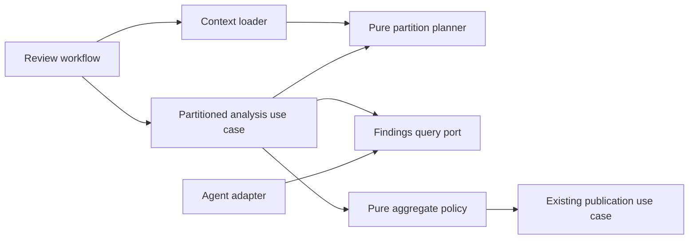

# Bugbot Exhaustive Partitioned Diff Analysis

- Status: Implemented
- Date: 2026-09-20
- Catalog capability ID: `bugbot-analysis-and-autofix`
- Last verified: 2026-09-21 on `develop`
- Owners: Copilot and Bugbot maintainers
- Scope: review every reviewable canonical pull-request diff fragment through
  bounded, attested partitions and publish one atomic aggregate result
- Related issues/PRs: PR #400; `bugbot-context-selection-and-budgeting.md`;
  `bugbot-analysis-publication-and-autofix.md`
- Required review gates: product UX, architecture, testing, documentation,
  security/operations, model-quality evaluation
- Open decisions blocking readiness: none

## 1. Executive summary

Bugbot MUST stop treating the single-prompt diff budget as a reason to silently
omit later file patches. It MUST create a deterministic review plan for the
provider-verified PR head, split oversized patches without dropping content,
pack all reviewable fragments into bounded partitions, obtain an attested
structured response for every partition, and aggregate all candidate findings
before any GitHub mutation.

The recommended and non-configurable default is exhaustive partitioning with a
maximum of two concurrent reviewer calls. A PR review is atomic: publication
occurs only after every planned partition for the same head SHA validates. If a
partition fails, is missing, returns the wrong identity, exceeds the execution
ceiling, or the head changes, the run publishes no new finding and resolves no
prior finding.

```text
canonical PR at SHA -> fragment every reviewable patch -> pack bounded partitions
                    -> review all partitions (concurrency <= 2)
                    -> verify attestations -> globally normalize/dedupe/rank
                    -> recheck SHA -> publish/reconcile once
```

Text equivalent: one canonical snapshot produces one immutable partition plan;
all partitions must finish and attest that plan before their findings are merged
and the existing single publication/reconciliation flow begins.

## 2. Problem, current behavior, and evidence

### 2.1 Problem

The current 64,000-character diff prompt keeps the workflow bounded but can
exclude most of a medium or large PR. A successful partial review may contain
useful findings, yet defects in omitted files remain invisible. The status is
honest, but the product cannot provide complete review confidence while a prompt
packing artifact decides which changed files the model can inspect.

### 2.2 Current behavior

1. GitHub returns up to 1,000 changed-file records for the canonical PR.
2. Ignored paths are removed.
3. Each patch is truncated after 12,000 characters.
4. File sections are packed into one 64,000-character block in provider order.
5. A section that does not fit is omitted; later smaller sections may still fit.
6. One model response is normalized and may be published as a partial review.
7. Partial coverage prevents whole-PR clean and limits resolution eligibility,
   but omitted changed code receives no model analysis.

### 2.3 Evidence

- `bugbot_diff_partition_policy.ts` defines the 64,000-character section limit and
  12,000-character patch truncation.
- `load_bugbot_context_use_case.ts` converts omitted or truncated patches into
  partial diff coverage.
- `analyze_bugbot_revision_use_case.ts` performs exactly one reviewer query.
- PR #400 supplied 44 changed files; the final review retained 14, omitted 30,
  and truncated four patches even though GitHub pagination was complete.
- GitHub provider pagination remains separately bounded at 10 pages x 100 files.
- Unknowns: no repository evidence proves that any provider/model reads content
  it was not supplied or explicitly assigned to inspect.

### 2.4 Retrospective classification

Not applicable. This is a prospective extension of the implemented Bugbot
baseline and context-budgeting SDDs.

## 3. Actors, surfaces, and terminology

| Actor | Goal | Entry point | Visible surfaces |
|---|---|---|---|
| PR author/reviewer | receive coverage of every reviewable change | PR event or review command | review comments, status card, check, Job Summary |
| Maintainer | understand progress, cost, and failures | workflow run | partition progress and content-free telemetry |
| Reviewer agent | inspect one bounded assignment | structured query port | no direct GitHub mutation |
| Aggregator | prove completeness and produce one result | application use case | prepared findings and resolutions |
| GitHub | provide canonical identity/diff and receive one projection | bounded adapters | PR review, comments, checks |

A **diff fragment** is a non-empty, ordered portion of one provider patch, or an
explicit no-patch file assignment. A **partition** is a bounded ordered group of
fragments. A **review plan** is the immutable head SHA, ordered partition IDs,
fragment/file totals, and coverage disposition. An **attestation** is the exact
partition ID and head SHA echoed in a schema-validated response. **Complete diff
analysis** means every non-ignored provider file has at least one assignment and
every provider-supplied patch character belongs to exactly one completed
partition. When every provider file is intentionally ignored, complete analysis
is a deterministic zero-work result: it invokes no reviewer, publishes no new
finding, and resolves no prior finding. It does not claim that probabilistic
analysis detects every defect.

## 4. Goals, non-goals, and fixed invariants

### 4.1 Goals

1. Eliminate prompt-budget omission and truncation for ordinary canonical PR
   diffs while preserving fixed per-prompt bounds.
2. Make completion mechanically verifiable through an immutable partition plan
   and exact response attestations.
3. Aggregate, filter, deduplicate, rank, limit, publish, and reconcile once for
   the complete plan.
4. Preserve head freshness, least privilege, stable finding identity, and
   retained-only prior-finding resolution.
5. Expose actionable progress and failures without logging diff content.

### 4.2 Non-goals

1. The feature does not guarantee detection of every defect.
2. It does not analyze files matched by configured ignore patterns.
   A leading `**/` matches both the repository root and any nested prefix, so
   documented patterns such as `**/node_modules/**` cannot leak root-level
   files into the review plan.
3. It does not remove GitHub's 1,000-file provider-read ceiling.
4. It does not auto-merge, change severity policy, or increase the publication
   comment limit.
5. It does not make prompt, fragment, partition, or concurrency safety ceilings
   user-configurable.

### 4.3 Fixed product and safety invariants

1. Every provider-supplied patch character for a non-ignored file MUST be
   assigned exactly once; partition boundaries MUST NOT discard text.
2. A file whose provider patch is absent MUST receive an explicit file-scope
   assignment requiring inspection of the local canonical diff and workspace.
3. Each partition prompt MUST remain within 64,000 diff-block characters and
   each fragment within 12,000 characters.
4. At most two reviewer queries MAY run concurrently.
5. A plan MUST contain at most 64 partitions. Exactly 64 is valid; only the
   attempted creation of partition 65 fails before model execution and
   instructs the reviewer to split the PR. It is never partially reviewed.
6. No findings or resolutions MAY be published until all planned partitions
   validate for the same head SHA.
7. One designated partition owns prior-finding resolution; all other partitions
   MUST return an empty resolution list.
8. Global normalization, safety filtering, deduplication, ranking, and comment
   limiting MUST run after responses are combined, never independently per
   partition.
9. Any missing/duplicate/wrong partition attestation, invalid response, model
   failure, or stale SHA fails the aggregate closed with no SCM mutation.
10. Provider-incomplete diff enumeration remains partial and can never yield a
   whole-PR clean result.
11. Repository content, patches, provider file status/count metadata,
    discussion, and agent responses remain bounded untrusted data and cannot
    modify the plan or execution policy.
12. Any canonical PR diff plan with zero partitions, whether the provider
    returned zero changes or every changed file was intentionally ignored, MUST
    NOT enter the legacy resolution-capable single-query path. It completes
    without an agent query and with empty finding and resolution sets. Only a
    legacy or synthetic context where partition metadata is absent keeps its
    existing compatibility behavior.

## 5. Current versus proposed product journey

| Stage | Current | Proposed | User/operator effect |
|---|---|---|---|
| Plan | one first-fit prompt block | immutable all-fragment plan | omissions are not hidden by packing |
| Large patch | truncate after 12,000 chars | split at line boundary, then hard boundary if required | all text is assigned |
| Execute | one query | every partition, concurrency two | bounded prompts with complete plan coverage |
| Validate | response schema only | schema plus partition/head attestation | missing or replayed output fails closed |
| Aggregate | prepare one response | combine then normalize/dedupe/rank once | one coherent review |
| Publish | partial findings allowed | atomic after plan completion | no half-review mutation |
| Observe | retained/omitted counts | total/completed partitions and fragments | clear progress and recovery |



Text equivalent: a canonical snapshot is planned, every partition is reviewed
through a two-slot queue, attestations and head identity are checked, all
responses are globally aggregated, freshness is rechecked, and only then is one
publication/reconciliation operation allowed.

## 6. Functional behavior and state model

### 6.1 Deterministic partition planning

1. Before ignore filtering, validate every provider change as a non-null
   object with a non-empty string filename and status, non-negative safe-
   integer additions/deletions counts, and an absent, null, or string patch.
   Validate any string patch for isolated UTF-16 surrogates at this same
   boundary, including a change whose valid filename would later be ignored.
   Any malformed field raises the bounded malformed-input plan error before
   model execution or provider mutation. Only then filter ignored files and
   preserve provider file order for the remaining files. Valid ignored patches
   consume no raw-input or partition budget. Leading `**/` is an optional
   directory prefix and therefore matches the same path at the repository root
   or at any nesting depth.
2. Normalize line endings and remove unsafe invisible prompt characters through
   the existing untrusted-content boundary before measuring. Provider-supplied
   filename, status, additions, and deletions metadata MUST each remain inside
   a bounded labelled untrusted-data envelope; runtime types are not trusted
   merely because the application contract declares them.
   Before any patch normalization or fragment allocation, count raw UTF-16
   code units for non-ignored patches and reject an individual or cumulative
   total above the fixed 4,096,000-code-unit input ceiling using the same
   bounded plan-limit error. This deliberately rejects a PR near the execution
   ceiling when sanitization/envelopes would expand it; it never silently
   truncates, schedules a partial review, or starts provider mutation. The
   provider transport may already have allocated its response; pagination is
   a file-count bound, not a byte bound, and is not claimed to protect that
   earlier allocation.
3. Split an oversized patch at the last newline that fits the fragment budget.
   When a single line exceeds the budget, split that line at a hard UTF-16
   boundary moved left when necessary so it never separates a surrogate pair.
   Reject an input patch containing an isolated high or low UTF-16 surrogate
   with the bounded malformed-input plan-limit error before ignore filtering
   or assigning any partition. The
   sanitized patch and the direct fragment-splitting boundary MUST both fail
   closed on malformed scalar input; do not silently replace or discard a
   provider character while claiming lossless reconstruction. The bounded
   failure guidance MUST distinguish malformed provider content (correct the
   diff source and retry) from a size ceiling (split the PR and retry).
   Every fragment remains within 12,000 UTF-16 code units, starts and ends with
   a complete Unicode scalar value, and concatenating logical fragment payloads
   MUST reproduce the sanitized patch exactly. Render each fragment in a
   collision-free, length-labelled untrusted-data frame whose closing marker
   is absent from that fragment. The rendered payload MUST preserve the
   sanitized fragment verbatim, including literal `[END_UNTRUSTED_DATA]`
   sequences; do not use the ordinary terminator-escaping renderer for diff
   fragments. The framing overhead still counts towards the partition budget.
4. Represent an absent (`undefined`/`null`) or empty provider patch as one
   explicit assignment naming the file and instructing the reviewer to inspect
   the local diff. The repository adapter normalizes omitted patches, and the
   pure planner independently accepts absent values rather than rejecting the
   whole PR; each assigned file still counts towards fragment/partition budgets.
   Only actual string patches consume the raw UTF-16 input ceiling. Unexpected
   non-null, non-string patch payloads remain invalid and fail closed. Validate
   the original provider field's type before ignore filtering, nullish
   normalization, or length arithmetic; malformed values MUST raise the bounded
   plan-limit error even on ignored paths, never masquerade as an absent patch.
5. Pack fragment sections in stable order. Start a new partition before adding a
   section that would exceed the diff-block budget.
6. Before planning any provider diff context, canonicalize `prHeadSha` through
   the shared Git object-ID policy. Only a non-zero 40-hex SHA-1 or 64-hex
   SHA-256 value is accepted; whitespace and case are normalized before the
   value reaches an instruction, partition identity, attestation, telemetry, or
   result contract. Invalid or instruction-like values fail closed through a
   bounded provider-input error and are never interpolated into trusted prompt
   text. The partition planner independently revalidates the value and reports
   malformed input if called outside canonical PR selection.
7. Derive IDs from the canonical reviewed head SHA, partition ordinal/total,
   and the full lowercase 64-hex-character SHA-256 digest of the assigned
   identities/content. IDs MUST be deterministic, collision-resistant, bounded
   to the response schema's 128-character ceiling, and safe to echo. A short or
   non-cryptographic checksum MUST NOT identify a partition because a collision
   would make a complete response set indistinguishable or invalidate it only
   after reviewer execution.
8. Reject a plan that cannot represent even one fragment within a partition;
   never silently truncate it.
9. If a canonical PR diff contains zero provider changes, or filtering
   intentionally retains zero files and records ignored files, produce a
   zero-work plan and preserve all available counts for auditability. Do not
   synthesize a partition or reuse the issue/local fallback prompt.

### 6.2 Partition execution

Every prompt identifies the canonical head SHA, exact partition ID and ordinal,
assigned files/fragments, and total plan size. The assigned fragment is the
entry-point scope: the reviewer MUST inspect surrounding and dependent current
workspace code needed to prove a finding. It MUST report only defects introduced
or exposed by changed code assigned to the partition, preventing arbitrary
whole-repository duplication.

Partition one is the resolution owner and receives the bounded prior-finding
context. Resolution is not limited to its assigned fragments: it inspects the
current workspace for every retained prior ID. Other partitions receive no prior
finding bodies and are instructed to return `resolved_findings: []`.

Reviewer calls run through the existing read-only agent port with concurrency
two. Results retain plan order regardless of completion order. The aggregate
fails if any response is undefined, invalid, in the wrong locale, carries a
wrong/duplicate partition ID or head SHA, or violates resolution ownership.

A canonical PR whose zero-work plan retained no files and recorded at least one
intentionally ignored changed file bypasses reviewer calls and returns a
deterministic empty prepared result. In particular, it does not send prior-
finding context to the legacy prompt and cannot propose `resolved_findings`.
The normal freshness and status-card reconciliation gates still run, so existing
open findings remain open and the reviewed SHA remains visible.

### 6.3 Aggregation

After all attestations validate, raw finding arrays are concatenated in plan
order, bounded against an aggregate model-output ceiling, normalized, filtered,
deduplicated, severity/confidence-ranked, and limited once. Resolution entries
come only from the owner partition and pass the existing eligibility and active-
finding reconciliation policies. Publication uses the existing single atomic
workflow and never exposes partition-local intermediate output.

### 6.4 State machine

| State | Entered when | User-visible meaning | Allowed next states | Recovery/owner |
|---|---|---|---|---|
| planning | canonical context loaded | calculating complete review work | reviewing/blocked | pure planner |
| reviewing | valid plan exists | `n/m` bounded partitions complete | reviewing/aggregating/failed/superseded | analyzer |
| aggregating | all attestations valid | consolidating one review | publishing/failed/superseded | aggregate policy |
| publishing | aggregate valid and head fresh | updating GitHub once | complete/failed/superseded | existing publisher |
| complete | publication/reconciliation verified | all planned diff evidence reviewed | reviewing on newer SHA | workflow |
| failed | a partition/aggregate is invalid | no partial review was published | planning on retry | operator/provider |
| superseded | canonical head changed | obsolete output discarded | planning on newer event | workflow |
| provider-partial | GitHub file enumeration is capped | complete plan cannot be proven | planning after smaller/new scope | provider/operator |

Duplicate or replayed execution for the same head creates a fresh in-memory plan
and converges through existing finding identity. No partition result is durable
on its own. Cancellation stops scheduling new work; completed outputs are
discarded unless the full plan completes in the same invocation.

## 7. User-facing configuration

No public input is added. Existing ignore patterns, severity, comment limit,
effort, dry-run, draft, suggestion, telemetry, and unresolved-check settings
retain their current semantics.

| Internal invariant | Recommended/fixed value | Allowed range | Scope/persistence |
|---|---:|---:|---|
| diff block per partition | 64,000 characters | fixed | one prompt |
| fragment payload | 12,000 characters | fixed maximum | one fragment |
| reviewer concurrency | 2 | fixed | one run |
| resolution owners | 1 | fixed | one plan |
| partitions per plan | 64 | fixed maximum | one canonical SHA |
| aggregate candidate findings | 2,000 | fixed maximum | one plan |

These values are safety boundaries, not configuration. In-flight runs snapshot
the existing user configuration and canonical SHA once. No migration or
precedence change applies.

## 8. Clean Architecture design

### 8.1 Responsibilities and dependency direction

| Layer/boundary | Owns | Must not own/import |
|---|---|---|
| Domain/pure policy | fragment/partition plan invariants, attestation validation, aggregate completeness | GitHub DTOs, agent clients, credentials |
| Application use case | bounded scheduling, response collection, aggregate preparation | Octokit/process implementation, GitHub mutation |
| Semantic ports | read-only structured reviewer query | partition/product policy |
| Adapters/data | canonical provider diff and model invocation/error mapping | publication decisions |
| Infrastructure/composition | dependency wiring and auth binding | packing/aggregation rules |
| Presentation/telemetry | progress, complete/failed/superseded meaning | hidden diff content, state mutation |



Text equivalent: the workflow loads canonical context, a pure policy creates the
plan, an application use case schedules semantic reviewer calls, another pure
policy validates and aggregates them, and only the existing publisher mutates
GitHub. The concrete agent adapter depends inward on the port.

### 8.2 Contracts, state, and trust boundaries

- Pure decisions: fragment splitting, packing, stable identity, completion,
  resolution ownership, response combination.
- Application contracts: immutable `BugbotDiffReviewPlan`, partition request,
  attested response, aggregate result.
- Durable state: unchanged; partition output is invocation-local.
- Concurrency/idempotency: fixed two-slot scheduler, ordered results, same-SHA
  freshness guards, existing finding fingerprints.
- Trusted inputs: validated execution configuration and canonical identity.
- Untrusted inputs: provider filenames/patches, repository workspace, discussion,
  rules, and model output; all stay inside existing sanitization/schema bounds.
- Provider error mapping: any reviewer error fails the aggregate as `agent.failed`;
  provider diff incompleteness stays an explicit coverage fact.

### 8.3 Executable architecture constraints

1. Planner and aggregate policies import no provider, SCM, process, or credential types.
2. Partition execution uses `FindingsQueryPort`; it does not instantiate adapters.
3. Architecture tests forbid SCM publication ports from the partition scheduler.
4. Tests prove maximum observed reviewer concurrency is two and results preserve
   plan order.
5. Static coverage budgets include the planner, attestation, and aggregation paths.

## 9. UI/UX and content contract

### 9.1 Information hierarchy

1. Current review state and partition progress.
2. Completed plan facts for the exact head SHA.
3. Next transition.
4. Required human action or explicit none.
5. Impact of failure/provider partiality.
6. Technical counts without patch content.

### 9.2 Representative views

Pending/no action:

```markdown
### Bugbot review in progress

**Status:** Reviewing partition 3 of 5 for `c06d8ab`.
**Completed:** 2 partitions covering 19 changed files.
**Next:** Bugbot will aggregate and publish once all 5 partitions validate.
**Action required:** None.
```

Blocked/action required:

```markdown
### Bugbot review blocked

**Status:** GitHub stopped enumerating the diff at the provider file limit.
**Impact:** Complete diff coverage cannot be proved and no clean result was published.
**Action required:** Split the pull request or reduce its reviewable scope, then rerun.
```

Failed without mutation:

```markdown
### Bugbot review failed safely

**Status:** Partition 4 of 5 returned an invalid or missing attestation.
**Completed:** No new finding was published and no prior finding was resolved.
**Next:** Retry the review for the same current head.
**Action required:** Inspect the failed reviewer step if retry does not recover.
```

Partially successful after an irreversible effect: not applicable to partition
execution because no partition performs an irreversible effect. Existing
publication-partial UX remains owned by the publication/reconciliation SDD.

Complete:

```markdown
### Bugbot review complete

**Status:** All 5 partitions for `c06d8ab` were reviewed and aggregated.
**Coverage:** 44 changed files, 67 diff fragments, 0 prompt-budget omissions.
**Action required:** Review the 2 actionable findings below.
```

### 9.3 Issue, PR, and comment behavior

The current single status card remains the durable user surface. Progress MAY be
written to the GitHub Job Summary/log without creating one comment per partition.
The notification budget remains one status-card reconciliation plus configured
finding comments. Partition IDs appear only in collapsed technical evidence and
telemetry. Replays update existing finding identities; they do not create a
partition history on the PR.

### 9.4 Accessibility, localization, and responsive behavior

Status text never relies on icons or color. Counts use short sentences that wrap
on narrow views. Existing requested locale and English fallback apply. Paths and
provider/model content remain sanitized; partition identifiers are locally
generated ASCII. Mermaid has the adjacent textual equivalent above.

## 10. Failure, recovery, and cleanup

| Failure/partial state | User impact | Retained facts | Automatic retry | Required action | Cleanup |
|---|---|---|---|---|---|
| partition query fails | no current review mutation | canonical plan/counts | provider policy only | rerun/inspect agent | discard all responses |
| wrong/missing attestation | no current review mutation | failed ordinal/ID | no | inspect model/schema, rerun | discard all responses |
| non-owner returns resolution | no current review mutation | policy violation count | no | inspect prompt/provider | discard all responses |
| plan exceeds 64 partitions | no reviewer starts | canonical diff/count | no | split PR | discard plan |
| aggregate output exceeds 2,000 candidates | no current review mutation | bounded counts | no | split PR | discard all responses |
| head changes during review | obsolete output discarded | old/new SHA | newer event | none | discard plan/results |
| provider diff cap reached | cannot prove full diff | fetched/page counts | no expansion | split PR | no mutation |
| publication fails after aggregate | existing partial-publication contract | provider mutation facts | bounded replay | retry reconciliation | no hidden deletion |

Errors follow impact -> cause -> action -> retained state and never imply that a
partition-local finding was published.

## 11. Security, permissions, and privacy

1. Reviewers remain read-only, approval-never, credential-free, and network-
   disabled where supported.
2. Partition IDs and head SHA are generated from trusted canonical facts; agent
   echoes are compared exactly after schema validation.
3. Diff filenames, status/count metadata, and fragments use separate bounded
   untrusted-content envelopes with invisible-control sanitization. Embedded
   instructions or malformed provider runtime values cannot alter scope,
   concurrency, ownership, or output schema.
4. Telemetry contains counts, timings, IDs, and SHA only; never patch, rule,
   comment, finding prose, or credentials.
5. Aggregate arrays are hard-bounded before allocation/publication to prevent a
   large partition count from multiplying model-controlled data without limit.
6. No partition receives a mutation port or GitHub credential.

## 12. Observability and operational UX

Telemetry MUST add plan partition count, completed partition count, fragment
count, assigned-file count, maximum reviewer concurrency, aggregate prompt/
response characters, and failed partition ordinal/category when applicable.
Existing review ID and canonical SHA correlate every partition. Logs MAY state
`partition 3/5` and elapsed time but MUST NOT include paths or fragment content.
An observed canonical partition plan MUST emit those plan fields even when it
contains zero partitions, so empty-diff and ignored-only canonical zero-work
reviews remain distinguishable from legacy non-partitioned issue/local
execution.

`diff` coverage reports complete only when provider enumeration is complete and
the plan assigns all reviewable files/characters. Prompt-budget omission and
truncation counters become zero for a completed plan. Provider limits remain
distinguishable from reviewer/model failure.

## 13. Compatibility, migration, rollout, and rollback

There is no durable partition schema and no data migration. Existing single-
partition PRs follow the new planner and should produce equivalent findings with
an added attestation. Issue-only and non-PR local-scope reviews retain the legacy
single-query contract because no canonical provider diff can be partitioned.
Any canonical PR with a zero-partition plan, including an empty provider diff or
an ignored-only diff, never uses that legacy path.

Roll out atomically across prompt/schema, planner, analyzer, telemetry, docs,
tests, catalog, and generated bundles. A rollback reverts the entire feature;
it must not accept partition responses with the legacy schema. Historical review
comments remain untouched.

## 14. Testing strategy and numeric budget

This SDD owns at least **61 distinct cases**.

| Area | Minimum distinct cases | Behaviors/risks covered |
|---|---:|---|
| Domain/pure planning | 34 | empty/single/multi-file, newline/hard split, UTF-16 surrogate-safe hard boundaries and pre-ignore rejection of isolated high/low surrogates, collision-free untrusted-data framing with verbatim delimiter-like patch text, individual and cumulative raw input ceilings before normalization, exact prompt and 64/65 partition boundaries, omitted/null/empty patch assignments, malformed change/object/filename/status/count/patch rejection even on ignored paths, root/nested leading-`**/` ignore parity, canonical SHA-1/SHA-256 head acceptance plus hostile/invalid head rejection before interpolation, full SHA-256 ID format plus content/head sensitivity, stable IDs, order, no character loss, hostile status/count metadata envelope |
| State/application/idempotency/races | 8 | all-complete, one failure, wrong/duplicate ID, wrong SHA, resolution ownership, stale head, replay, empty canonical zero-work |
| Agent adapter/schema contracts | 4 | required attestation, locale, undefined/invalid result, aggregate bounds |
| Workflow/architecture/telemetry | 5 | concurrency two, ordered collection, no mutation before complete, positive and zero-partition plan metrics |
| UI/UX/localization/sanitization | 4 | pending, failed, complete, hostile content/control characters |
| Integration/security/compatibility | 6 | 44-file regression, oversized patch, provider partial, dry-run, legacy issue-only path, ignored-only canonical no-op |
| **Total** | **61** | No double counting |

Planner, attestation, and aggregate pure policies require 100% enumerated branch
coverage. Changed analyzer/context modules require at least 95% lines/statements
and 90% branches/functions; repository thresholds remain in force. Tests use
deterministic fake agents, deferred promises, fixed SHA/clock, and no live GitHub,
network, or real waits. Assertions verify reconstructed sanitized patch content,
not snapshots alone. Automated contract evidence covers pending, failure,
complete, narrow-layout, and deterministic multi-partition reviewer execution;
PR CI supplies the final packaged Action and GitHub-surface evidence.

## 15. Documentation and discoverability

| Audience | Artifact/page | Required content | Validation/navigation |
|---|---|---|---|
| User | `docs/bugbot/how-it-works.mdx` | exhaustive plan flow and atomic result | docs contract/link checks |
| Reviewer | `docs/bugbot/detection.mdx` | assigned scope, cross-file context, single publication | examples/tests |
| Operator | `docs/bugbot/failure-scenarios.mdx` | failed partition, provider cap, retry | decision table |
| Operator | `docs/bugbot/quality-observability.mdx` | plan/progress/aggregate telemetry | schema tests |
| Contributor | this SDD and baseline SDDs | boundaries, invariants, traceability | specification validation |

Configuration and permissions docs MUST state that partitioning adds no new
token scope, secret, or public input.

## 16. Acceptance scenarios

1. Given the 44-file PR #400-shaped fixture, when the plan is built, then every
   non-ignored file is assigned, no patch content is truncated/omitted, and all
   partitions remain within budget.
2. Given a patch over 12,000 characters, when planned, then ordered fragments
   reconstruct the sanitized patch exactly.
3. Given an omitted, null, or empty provider patch alongside an ordinary
   changed file, when planned, then each file has a bounded assignment and
   the ordinary patch remains intact; an unexpected numeric/object patch
   fails closed rather than masquerading as absence.
4. Given five valid partitions completing out of order, when aggregated, then
   results preserve plan order, normalize/deduplicate/rank globally, and publish once.
5. Given one failed or invalid partition, then no finding or resolution mutation occurs.
6. Given a response for another partition or head SHA, then the aggregate fails closed.
7. Given a non-owner resolution response, then the aggregate fails closed.
8. Given findings duplicated across partitions, then one stable finding remains.
9. Given a head change before publication, then every completed partition output
   is discarded as superseded.
10. Given provider file pagination reaches its cap, then the run cannot claim
    complete diff analysis or whole-PR clean.
11. Given dry run, then all partitions execute and aggregate but GitHub remains unchanged.
12. Given hostile prompt text or terminator/control syntax in a patch, filename,
    status, additions, or deletions value, then every provider field remains in
    its bounded untrusted-data envelope and cannot alter partition identity or
    task policy.
13. Given an issue-only review without a canonical PR diff, then the established
    single-query path remains functional.
14. Given a complete plan with no accepted findings, then Bugbot may report clean
    only after the final freshness check and all other context coverage is complete.
15. Given a diff requiring more than 64 partitions, then no reviewer query or
    provider mutation starts and the result instructs the maintainer to split the PR.
16. Given a canonical PR whose provider diff is empty or whose changed files are
    all ignored, then no reviewer query runs, no prior finding is resolved, and
    the normal status projection retains existing open findings for the current
    head.
17. Given a diff that packs into exactly 64 partitions, then the plan succeeds;
    adding content that requires partition 65 fails before reviewer execution.
18. Given an empty or ignored-only canonical diff produces an observed
    zero-partition plan, then telemetry emits zero plan/completion/fragment/
    file/concurrency fields; a legacy execution with no plan omits those fields.
19. Given `**/node_modules/**`, both `node_modules/package.json` and
    `packages/app/node_modules/package.json` are ignored before partitioning,
    while unrelated root and nested paths remain reviewable.
20. Given an astral Unicode character crosses the 12,000-code-unit hard
    boundary with no earlier newline, then the boundary moves left, neither
    fragment contains an orphan surrogate, both stay within budget, and their
    concatenation exactly reconstructs the sanitized patch.
    Given a patch with an isolated high or low surrogate, either the planner
    or a direct fragment split rejects it before review; no fragment with an
    orphan surrogate reaches the provider.
21. Given one patch or the cumulative non-ignored patches exceed 4,096,000 raw
    UTF-16 code units, the planner rejects before normalization, model query,
    or publication with bounded split-PR guidance; ignored patches consume no
    plan budget and accepted patches remain lossless.
22. Given a patch containing literal `[END_UNTRUSTED_DATA]` or a proposed
    frame terminator, then the rendered data frame selects a non-colliding
    terminator; its payload is exactly the sanitized fragment, never silently
    rewritten, and the final partition remains within its budget.
23. Given an ignored change contains an isolated surrogate, or any provider
    change has a null/non-object shape, empty/non-string filename or status,
    unsafe/negative additions or deletions, or another invalid patch type, the
    planner returns the bounded malformed-input error before ignore filtering,
    model execution, or mutation. A valid ignored change remains budget-free.
24. Given any accepted partition, its ID ends in the full lowercase SHA-256
    digest of the canonical reviewed head and rendered assigned content, remains
    within 128 characters, is stable for identical input, and changes when the
    head or assigned content changes.
25. Given a provider head value, a valid 40-hex SHA-1 or 64-hex SHA-256 value is
    canonicalized before partition construction; an empty, zero, malformed,
    oversized, newline-bearing, or instruction-like value fails with a bounded
    provider-input error before diff rendering, model execution, telemetry
    identity, or publication; direct planner calls report malformed input.

## 17. Requirements traceability

| Requirement | Policy/use case/adapter/presentation | Test or evidence | Documentation |
|---|---|---|---|
| lossless bounded plan | diff partition policy | reconstruction, surrogate-boundary, raw-input ceiling, budget, and 44-file tests | how it works |
| absent patch without lost review | repository projection plus pure partition policy | omitted/null/empty mixed-file assignments and malformed payload tests | how it works/failure scenarios |
| root/nested ignore parity | file-ignore policy | leading-`**/` root and nested fixtures | configuration |
| untrusted diff metadata | diff partition policy + security envelope | hostile filename/status/count/patch fixtures | detection/security |
| attested atomic execution | partitioned analyzer | failure/identity/concurrency tests | failure scenarios |
| global coherent result | aggregate policy + existing preparation | duplicate/rank/limit/resolution tests | detection |
| same-SHA safety | existing freshness + attestation | stale/replay tests | how it works |
| content-free progress | telemetry/presentation | schema/render/redaction tests | observability |
| clean only after completeness | coverage + workflow result policy | provider-partial/zero-finding tests | detection/failures |
| canonical zero-work resolution safety | partitioned analyzer zero-work guard | empty and ignored-only canonical no-agent/no-resolution tests | detection/failures |
| zero-work plan observability | partition telemetry | zero-plan versus legacy-no-plan telemetry test | observability |
| unchanged authority | semantic agent port/composition | architecture/credential tests | permissions |

## 18. Implementation sequence

1. Add this SDD, catalog evidence, immutable plan/attestation contracts, and
   pure planner tests.
2. Add partition-aware prompt/schema and exact attestation validation.
3. Implement the bounded partition scheduler and global response aggregation.
4. Replace single diff packing in the context loader while preserving issue-only behavior.
5. Integrate freshness, resolution ownership, telemetry, and atomic failure results.
6. Update Bugbot documentation, baseline SDDs, catalog evidence, generated
   bundles, architecture checks, and regression fixtures.
7. Run specification, type, lint, focused/full tests, coverage, build/package,
   workflow, documentation, Graphify, eval, and controlled UX/model evidence.

## 19. Definition of Done

- [x] Every normative requirement maps to acceptance and automated evidence.
- [x] The planner loses no sanitized provider patch content within supported
      provider enumeration and every partition respects fixed prompt bounds.
- [x] Attestation, resolution ownership, concurrency, aggregation, freshness,
      replay, cancellation/failure, and no-prepublication-mutation tests pass.
- [x] The 61-case floor and changed-module/repository coverage budgets pass.
- [x] Pending, failed, provider-partial, complete, dry-run, and publication-
      partial surfaces are accurate, localized, accessible, and bounded.
- [x] No public configuration, permission, credential, or durable-state change
      exists beyond the documented additive telemetry fields.
- [x] User/operator/contributor docs and both Bugbot baseline SDDs agree.
- [x] Generated bundles, catalog, Graphify, quality eval, and every repository
      validation gate are current.
- [x] No readiness-blocking decision remains unresolved.

## 20. References and decisions

- Parent specifications: `bugbot-context-selection-and-budgeting.md` and
  `bugbot-analysis-publication-and-autofix.md`.
- Primary implementation evidence: `bugbot_diff_partition_policy.ts`,
  `load_bugbot_context_use_case.ts`, `analyze_bugbot_revision_use_case.ts`,
  `query_bugbot_findings.ts`, `schema.ts`, and Bugbot telemetry/presentation.
- Decision: preserve per-prompt bounds by adding partitions, not by increasing
  a single model context.
- Decision: aggregate before publication; rejected alternative is publishing
  each partition because it exposes incomplete state and complicates rollback.
- Decision: one partition owns prior-finding resolution; rejected alternative is
  unioning independent resolution claims because conflicting evidence could
  create false resolution.
- Decision: assigned changed code is the finding scope while the read-only
  workspace supplies cross-file context; rejected alternative is isolated file-
  only review because it misses dependency defects.
- Follow-up outside scope: provider APIs that omit changed files beyond their
  enumeration limit require PR splitting or a separately specified local-diff
  authority contract.
