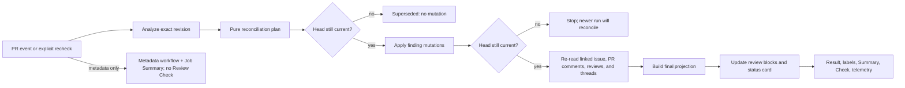
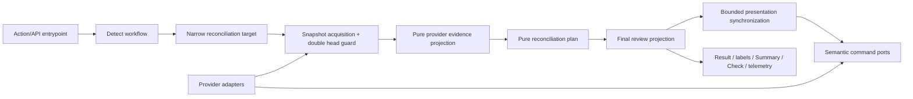

# Bugbot Pull-Request Review State Reconciliation

- Status: Implemented
- Date: 2026-09-11
- Catalog capability ID: `bugbot-review-state-reconciliation`
- Last verified: 2026-09-14 on `develop`; generic localized presentation is verified by the catalog and publication contract tests
- Owners: `vypdev/copilot` product and engineering maintainers
- Scope: make every Bugbot pull-request surface present one coherent, current,
  recoverable finding state without erasing the historical review record.
- Related issues/PRs: [PR #358](https://github.com/vypdev/copilot/pull/358),
  [original finding](https://github.com/vypdev/copilot/pull/358#discussion_r3972947434),
  [successful reconciliation run](https://github.com/vypdev/copilot/actions/runs/34537613448),
  [current Check Run](https://github.com/vypdev/copilot/runs/103074383528),
  and [PR #363 concurrency evidence](https://github.com/vypdev/copilot/pull/363)
- Required review gates: product UX, architecture, testing, documentation,
  security/operations
- Open decisions blocking readiness: none

## 1. Executive summary

Before this change, Bugbot reconciled the durable finding comment and its native GitHub
thread, but it did not reconcile the parent review summary. The concrete PR
that exposed this gap is internally correct and visibly contradictory at the
same time: GitHub reports the thread as resolved, the latest Check says
`fixed=1`, and the old review card still says that there is one active problem.

The recommended solution separates history from current state and derives
every mutable surface from one verified projection:

1. a submitted review remains a **historical snapshot** of the commit that was
   analyzed;
2. a small mutable block at the top of that review states what happened to the
   findings originating there;
3. one stable **Bugbot status** comment per PR presents the current aggregate
   state and the one next action, if any;
4. inline finding comments and native thread resolution remain the durable
   per-finding evidence;
5. the Check Run, Job Summary, lifecycle labels, review status blocks, and PR
   status comment consume the same final, read-after-write projection; and
6. partial writes, human resolution, retries, duplicate events, cancellation,
   and superseded revisions converge without inventing success.

```text
PR revision -> Analyze -> Build a pure reconciliation plan
  -> verify current head -> publish/refresh/reopen active findings
  -> verify current head -> resolve/dismiss eligible findings
  -> re-read GitHub's durable state -> build one final projection
  -> update affected review status blocks -> upsert one PR status card
  -> publish Result, labels, Job Summary, Check Run, and telemetry
```

This is not a legacy compatibility feature. There will be one lifecycle, one
projection model, and one presentation contract. Existing bot-owned reviews
are normalized through the same idempotent projection path when they are next
encountered.

## 2. Problem, current behavior, and evidence

### 2.1 Problem

A maintainer must be able to answer “is this finding still active?” without
having to compare hidden markers, GraphQL thread state, Actions logs, and a
Check Run. Today those sources can disagree visibly even when the underlying
automation succeeded.

The contradiction has three product costs:

- maintainers can delay or reject a merge because an old review appears active;
- users can rerun or manually modify automation that already succeeded; and
- operators cannot distinguish a Bugbot failure from a stale presentation.

### 2.2 Verified incident on PR #358

The following facts were read from GitHub on 2026-09-11:

1. Review `PRR_kwDONSeBW88AAAABM4v5Hg`, submitted for commit `df972490`, says
   “Bugbot found **1** active potential problem(s) in this revision.”
2. Commit `e6089b9d` triggered run `34537613448` with the exact incremental
   range `010a17ef..e6089b9d`.
3. The run loaded one existing unresolved finding, produced zero current
   findings, resolved one finding, and completed successfully.
4. The provider log contains `Resolved pull request review thread.`
5. Telemetry records `candidateFindings=0`, `resolvedFindings=1`,
   `findingStates.fixed=1`, and `outcome=completed`.
6. GitHub GraphQL reports the original thread as `isResolved: true`.
7. The inline body now contains `Resolved`, `resolved:true`, and
   `finding_resolution:"fixed"`.
8. The `Copilot / Review` Check says “0 new/current findings; 1 marked as
   resolved” and reports lifecycle `ready`.
9. The parent review summary was not edited, so its historical sentence still
   looks like a current assertion.

Conclusion: Bugbot ran and resolved the finding correctly. The defect is a
missing and misleading presentation projection, not a missed workflow event or
failed analysis.

### 2.3 Verified code behavior at `e6089b9d`

- `PullRequestReviewCommentPublisher.flush()` returns immediately when there
  are no findings or overflow. A clean reconciliation therefore creates no
  replacement review and updates no review summary.
- `buildReviewSummary()` calls findings “active ... in this revision” and uses
  the generic watermark “This will update automatically on new commits.” The
  parent review body does not actually participate in that update path.
- `applyDetectedFindings()` publishes current findings first and then calls
  `markFindingsResolved()`. This protects against claiming a clean state when
  publication itself failed, but there is no final presentation reconciliation.
- `resolvePullRequestFinding()` resolves the native thread before updating the
  marker body. If the second mutation fails, a later context load can interpret
  the resolved thread plus unresolved marker as a human dismissal and lose the
  intended `fixed` or `obsolete` reason.
- `PullRequestReviewComment` does not retain its parent review identity or URL.
  No semantic port can therefore find and update the parent review.
- `listPullRequestReviewThreadStates()` returns only a boolean. It cannot
  distinguish a thread resolved by the bot from a human decision.
- `projectBugbotFindingStatuses()` correctly supplies aggregate counts to the
  Result and Check, but reviews and comments do not consume a shared final view
  model.
- The shipped workflows do not declare cross-workflow concurrency. A push and
  a PR synchronization can analyze the same branch concurrently in consumer
  repositories where both workflows apply.

### 2.4 Documentation mismatch

Current documentation says both that the review is the single source of truth
and that historical PR destinations stay in sync. It does not explain that a
review body is a historical snapshot or identify the latest Check as the
current aggregate projection. The generic watermark promises behavior that the
review summary does not implement.

### 2.5 External provider facts

- GitHub provides an authenticated endpoint to
  [update the body of a pull-request review](https://docs.github.com/en/rest/pulls/reviews#update-a-review-for-a-pull-request).
  It requires Pull requests write permission.
- GitHub provides an endpoint to
  [update an inline review comment](https://docs.github.com/en/rest/pulls/comments#update-a-review-comment-for-a-pull-request).
- GraphQL exposes `isResolved`, `isOutdated`, and `resolvedBy` on review threads,
  plus the
  [`resolveReviewThread` and `unresolveReviewThread` mutations](https://docs.github.com/en/graphql/reference/pulls).
- GitHub Check Runs support mutable status and Markdown output, including a
  summary and line annotations
  ([Checks API](https://docs.github.com/en/rest/guides/using-the-rest-api-to-interact-with-checks)).
- Updating a submitted review can emit `pull_request_review: edited`. The
  shipped workflow already filters bot-authored events; that protection MUST be
  retained and tested
  ([workflow events](https://docs.github.com/en/actions/reference/workflows-and-actions/events-that-trigger-workflows#pull_request_review)).
- GitHub documents `pull_request_review_thread` as a webhook event, but it is
  not a supported GitHub Actions trigger in the Actions event reference. The
  reusable Action therefore cannot promise an immediate run when a person only
  resolves or reopens a native thread.

### 2.6 Verified concurrency regressions and ownership correction

On three successive PR heads, an `efraespada`-authenticated metadata update
emitted `pull_request: edited` while the `synchronize` review was starting.
Because the edit used the same branch group with unconditional cancellation, it
canceled real review runs `34728370424`, `34729137152`, and `34730134528`.
Successor metadata runs completed successfully without agent analysis. Branch
Sync did not edit the PR in those runs, and bot-authored edits were already
filtered. The final Check summary exposed `Bugbot review: —`, proving that a
green job was not evidence that the head had been reviewed.

The first correction kept the shared branch group but made cancellation
conditional. Code-change and review events canceled obsolete analysis;
`pull_request: edited` waited behind the active review. GitHub's bounded pending
slot may replace an older waiting metadata event with the newest one, which is
safe because metadata normalization is idempotent and only the newest event is
current. Controlled verification on head `70585d9e` started review run
`34756303262` and then edit run `34756384500`. The edit stayed pending until the
review completed successfully, then completed itself. Bot-authored follow-ups
`34756389864` and `34756489001` were skipped by the existing loop guard.

PR #367 exposed the remaining flaw: a paired `pull_request:synchronize` run
canceled Commit run `34846885692` through the same native group after every job
step had succeeded, leaving a misleading canceled conclusion. Running Bugbot
from both event routes also made cancellation necessary only because ownership
was duplicated. The final contract therefore uses distinct `copilot-push-…`
and `copilot-pr-…` branch groups. The Commit route retains issue progress work,
then Bugbot's read-only exact-head preflight validates whether an open
same-repository PR owns the pushed branch. A match skips review-context loading
and agent invocation; the PR synchronization event exclusively owns review for
that head. This decision uses provider discovery rather than the absent
`pull_request` field on a push payload. PR metadata retains conditional
non-preemption within the PR-specific group, and fork PR execution remains
excluded by the same-repository workflow gate.

The next head `0e039ae9` proved that ordering alone was insufficient. Review run
`34756692307` published Check `103722773263` with truthful `partial` Bugbot
telemetry. After a maintainer body edit, metadata-only run `34756981026`
published Check `103722965203` under the same `Copilot / Review` name with
`Bugbot review: —`. GitHub presented only that newer same-name Check in the PR
rollup. The final contract therefore reserves the review name for result sets
with exactly one structurally valid, current-schema Bugbot telemetry snapshot;
metadata-only or ambiguous runs retain their native
workflow outcome and Job Summary but publish no Review Check. Partial, skipped,
and superseded review outcomes are neutral, never successful.

Bugbot review `5190848886` then found a second fail-open edge in that selector:
it discarded malformed telemetry before counting snapshots, so a valid snapshot
could conceal a malformed owned sibling. The corrected contract counts every
result owning `bugbotTelemetry` first and accepts only exact cardinality one,
then validates that sole snapshot. The same audit found independent lenient
parsers for Result `findingStates`; they are replaced by one strict canonical
projection shared by Action exit, lifecycle, `/copilot status`, Job Summary,
and Check evidence.

Follow-up review `5190965601` exposed a separate absence ambiguity: a valid
current-head `completed`, `no-findings`, or `partial` snapshot could omit the
entire `findingStates` field, leaving the Check policy free to interpret absent
evidence as zero findings. The canonical projection now treats state evidence
as required for every outcome that evaluates findings (`completed`,
`no-findings`, `partial`, and `dry-run`). Absence remains valid only for
metadata-only results and terminal outcomes that cannot claim a clean analysis
(`skipped`, `superseded`, and `failed`).

Review `5191003573` on head `1d3c155d` found that the finding-state projection
still called the single-payload parser directly: valid zero counts could hide a
second owned but malformed telemetry payload from Summary, lifecycle, status,
and Action exit even though the Review Check selector rejected the pair. The
final telemetry-set projection now returns explicit `absent`, `invalid`, or
`valid` state after checking owned cardinality and schema exactly once. The
finding-state projection consumes that set result before reading counts, so a
malformed or duplicated telemetry sibling invalidates every current-state
consumer consistently.

The same PR conversation exposed two successful metadata-edit comments
(`5653191018` and `5653243319`) containing only “Waiting state cleared,” a GIF,
and debug logs. They added permanent noise after the metadata run had already
reported through its native workflow and Job Summary. Generic publication now
uses one explicit mode: `pull_request: edited` is `omit-metadata-only`, a real
Bugbot result is `omit-feature-owned`, and other routes remain `publish`.

## 3. Actors, surfaces, and terminology

| Actor | Goal | Entry point | Visible surfaces |
|---|---|---|---|
| PR author | Know what must be fixed and request help | Push, PR open/synchronize, `/copilot review` | Status card, inline threads, Check |
| Maintainer | Decide whether the PR is ready | PR conversation/files/checks | Review status block, status card, labels, Check |
| Human reviewer | Dismiss or reopen a finding deliberately | Native resolve/unresolve action | Thread state, next reconciliation |
| Repository operator | Diagnose and recover a partial run | Actions run or `/copilot recheck` | Job Summary, Check, technical details |
| Integrator | Use Bugbot through the npm API | `BugbotReviewService.review()` | Semantic output and SCM-specific adapter |

Terms:

- **Finding record**: the trusted bot-authored inline comment, marker, parent
  review identity, and native thread facts for one finding.
- **Finding state**: `open`, `reopened`, `fixed`, `obsolete`, `dismissed`,
  `verification-required`, or `unknown`.
- **Review snapshot**: the immutable explanation of what Bugbot reported for a
  particular analyzed commit.
- **Review status block**: a bounded mutable block prepended to a bot-owned
  review snapshot. It describes only the current state of findings originating
  in that review.
- **PR status card**: the single bot-owned PR conversation comment containing
  the latest verified aggregate state.
- **Final projection**: the immutable application output built after provider
  mutations have been re-read. Every current-state surface consumes it.
- **Presentation drift**: durable finding state is correct but one or more
  derived surfaces are missing or stale.
- **State drift**: marker state and native thread state disagree.
- **Last verified head**: the exact PR head SHA for which a complete analysis
  and final provider read succeeded.

## 4. Goals, non-goals, and fixed invariants

### 4.1 Goals

1. Every successful PR analysis MUST leave the inline thread, review status
   block, PR status card, Result, labels, Job Summary, Check, and telemetry
   semantically consistent.
2. A historical review MUST remain understandable as history and MUST NOT make
   an unlabeled current-state claim.
3. A maintainer MUST see the current aggregate status and next action from one
   stable PR comment without opening logs.
4. A resolution, dismissal, or reopening MUST be idempotent and recoverable
   after any individual provider mutation fails.
5. A superseded or canceled run MUST NOT overwrite a newer verified projection.
6. A human thread resolution MUST remain distinguishable from bot-owned thread
   synchronization.
7. Partial completion MUST name what changed, what did not, its impact, and the
   exact recovery action.
8. Existing trusted Bugbot reviews MUST converge through the same product path,
   without a legacy mode or permanent alternate implementation.
9. PR metadata normalization MUST NOT cancel an active code-change review or
   allow a metadata-only success to masquerade as review evidence.
10. The `Copilot / Review` Check MUST be emitted only from a result set carrying
    exactly one valid Bugbot telemetry snapshot for the exact head. Metadata-only
    or ambiguous runs MUST NOT create a newer same-name Check, and bounded
    partial/skipped/superseded outcomes MUST be neutral rather than successful.
11. All result consumers MUST use one complete seven-state finding-count
    projection. Missing or extra keys, non-safe/non-integer/negative counts, and
    aggregate overflow MUST fail or block every current-state surface.

### 4.2 Non-goals

1. Rewriting human-authored reviews or comments.
2. Treating a review summary as a database or authoritative finding store.
3. Reacting immediately to native thread-only events that GitHub Actions cannot
   subscribe to.
4. Guaranteeing atomicity across independent GitHub API mutations; the product
   instead guarantees detectable, idempotent convergence.
5. Deleting historical reviews, comments, or audit evidence.
6. Adding a configuration switch that permits visibly contradictory state.
7. Changing issue-only finding UX except where shared lifecycle correctness
   requires it.

### 4.3 Fixed product and safety invariants

1. Trusted finding markers plus verified native thread facts own durable
   per-finding state. Review bodies, the PR status card, labels, and Checks are
   derived projections only.
2. Only content authored by the authenticated configured bot identity and
   carrying a valid marker may be adopted or mutated.
3. The bot MUST never mark a finding resolved merely because it is absent from
   a model response. The strict validated `resolved_findings` contract remains
   mandatory: each entry contains an exact retained finding `id` and an explicit
   `fixed` or `obsolete` resolution. The removed id-list/reason-map fields are
   invalid and have no legacy reader or translation path. Conflicting
   classifications for one id make that id ineligible for resolution.
4. Active publication MUST complete before any unrelated finding is marked
   resolved.
5. The comment marker MUST be updated before the corresponding native thread
   mutation. A retry can then recover toward the explicit marker state.
6. An unresolved marker plus a thread resolved by a non-bot actor means
   `dismissed`; it MUST NOT be silently reopened by a model response.
7. A marker/thread mismatch that cannot be attributed safely MUST be
   `verification-required` or `unknown`, never clean.
8. Every mutation phase MUST verify that the remote PR head still matches the
   analyzed head. Superseded work stops without presenting itself as current.
9. `bugbot-dry-run` MUST perform no SCM, review, status-card, label, Check, or
   configuration mutation.
10. Sanitization, bounded content, secret redaction, and exact safe links are
    not configurable.
11. There MUST be at most one canonical Bugbot status card per PR. Normal runs
    update it in place and create no additional generic PR comments.
12. Provider or presentation failures MUST NOT roll back already successful
    GitHub mutations or describe them as failed.
13. A final provider snapshot that omits a previously observed unresolved or
    verification-required durable finding MUST retain that finding as
    `unknown` and emit one bounded reconciliation error. Only fully resolved
    durable findings may disappear without making the projection non-clean.
14. Linked-issue and pull-request evidence MUST be projected independently and
    folded conservatively. A clean state in one destination MUST NOT hide an
    actionable, verification-required, or unknown state in the other.
15. Final provider snapshot acquisition MUST verify the same pull-request head
    immediately before and after reading its surfaces. Missing or changed head
    evidence makes the run superseded and MUST produce no presentation writes.
16. Shipped PR workflows MUST serialize metadata edits on the review branch
    key without letting those edits cancel an active `opened`, `reopened`,
    `synchronize`, push, or review-triggered analysis.
17. Review evidence eligibility MUST be a pure application policy over semantic
    Result payloads; it MUST NOT query, copy, or merge a previous provider Check.

## 5. Current versus proposed product journey

| Stage | Current | Proposed | User/operator effect |
|---|---|---|---|
| Review starts | Native workflow is running | Native workflow remains the pending authority; last verified card remains explicitly historical | Cancellation cannot leave a custom current-state claim stuck in progress |
| Metadata edit during review | Edit can cancel or later hide analysis with a green metadata run | Edit waits; afterward its workflow/summary update without emitting `Copilot / Review` | Reviewed-head evidence remains latest by name |
| Findings detected | One review with “active” findings | One commit-scoped review snapshot plus current status block | History and current state are visually distinct |
| Existing finding remains | Inline body refreshed | Inline body refreshed; origin review and status card use the same final projection | No counter drift |
| Finding resolved | Inline marker and thread change | Marker changes first, thread follows, provider state is re-read, all projections update | Partial failures are retryable and visible |
| Human resolves thread | Context infers dismissal but marker may remain open | Resolver identity establishes dismissal; marker is persisted on next supported reconciliation | Human decisions survive later model output |
| Finding returns | Thread/body are reopened | Pure plan records `reopened`; marker changes before unresolve; projections update | Reopening cannot be confused with dismissal |
| Clean revision | Check is correct; old review still says active | Status card says clean; origin review says all findings resolved; snapshot remains historical | The PR tells one coherent story |
| Analysis fails | Check/logs fail | Card says current head is unverified and retains last verified facts; Check fails | No false clean state |
| Projection update fails | Not modeled separately | Check and Job Summary report partial success and `/copilot recheck` | State is recoverable without guessing |



Text equivalent: a PR event or explicit recheck analyzes one exact head, builds
a pure plan, verifies freshness before each mutation boundary, re-reads the
actual provider state, derives one final projection, and then updates every
user-facing surface. Superseded work stops and cannot claim current ownership.

## 6. Functional behavior and state model

### 6.1 Durable facts and precedence

The final state is derived in this order:

1. reject comments, reviews, and markers whose author is not the authenticated
   bot identity;
2. reject malformed or ambiguous marker identity as `unknown` when the object
   is otherwise provably Bugbot-owned;
3. use the validated marker lifecycle as the bot's intended durable state;
4. use native thread state and `resolvedBy` to recognize a human dismissal;
5. classify any remaining marker/thread mismatch explicitly;
6. overlay the current validated analysis only through the pure transition
   plan; and
7. after writes, re-read every durable destination (linked-issue comments, PR
   comments, reviews, and thread facts) and project what GitHub actually
   contains, not what the application intended to write;
8. verify the same remote PR head immediately before and after that concurrent
   read, discarding the entire snapshot if freshness changed; and
9. project linked-issue and PR destinations separately before applying the
   conservative cross-destination state fold.

### 6.2 Finding states

| State | Durable evidence | User-visible meaning | Merge-gate treatment | Next states |
|---|---|---|---|---|
| `open` | Open marker and open thread | Current defect requires attention | actionable | fixed, obsolete, dismissed |
| `reopened` | Previously resolved finding is current again and thread is open | The defect returned | actionable | fixed, obsolete, dismissed |
| `fixed` | Resolved marker with reason `fixed` and resolved thread | Latest verified analysis confirms the defect is fixed | clean | reopened, verification-required |
| `obsolete` | Resolved marker with reason `obsolete` and resolved thread | The original situation no longer applies | clean | reopened, verification-required |
| `dismissed` | Human-resolved thread persisted as dismissed marker | An authorized human intentionally closed it | clean but auditable | verification-required |
| `verification-required` | Safe, explainable marker/thread mismatch or human unresolve | Bugbot cannot yet confirm whether the finding is current | not clean | open, reopened, fixed, obsolete, dismissed |
| `unknown` | Missing identity, permission, malformed owned state, or ambiguous mapping | State cannot be trusted | failure | any verified state after recovery |

`open`, `reopened`, and `verification-required` count as unresolved for product
readiness. `unknown` is a system failure and fails the review regardless of
`bugbot-fail-on-unresolved`.

### 6.3 Transition matrix

| Previous evidence | Current analysis/provider event | Planned transition | Mutation order |
|---|---|---|---|
| No record | Active finding | `open` | create review/comment, then re-read |
| Open | Same active identity/fingerprint | remain `open` | update body only when semantic content changed |
| Open | Valid resolution claim `fixed` | `fixed` | update marker/body, resolve thread, re-read |
| Open | Valid resolution claim `obsolete` | `obsolete` | update marker/body, resolve thread, re-read |
| Open marker + human-resolved thread | Provider state | `dismissed` | persist dismissed marker, keep thread resolved |
| Fixed/obsolete | Active finding | `reopened` | update marker/body, unresolve thread, re-read |
| Dismissed | Model reports same finding | remain dismissed | suppress model reopening; no mutation |
| Resolved marker + open thread | Next supported review | `verification-required` | include in analysis; do not silently re-resolve |
| Open marker + bot-resolved thread | Retry after partial reopen | repair toward open | unresolve thread, re-read |
| Open marker + human-resolved thread | Human action | dismissed | persist dismissal on next reconciliation |
| Previously non-clean durable finding absent from final snapshot | Provider omission, deletion, or inconsistent pagination | unknown | preserve identity in projection; publish one bounded diagnostic; recheck |
| Any | Head changed before phase | superseded | stop phase; no current projection update |
| Any | Head changes while final surfaces are being read | superseded | discard the incoherent snapshot; perform no presentation write |
| Same finding is clean in one destination and non-clean in the other | Duplicated or partially synchronized durable evidence | most conservative observed state | retain both destination identities; publish the non-clean projection |
| Any | Malformed/ambiguous trusted state | unknown | no destructive mutation; publish diagnostic |

### 6.4 Happy path: the PR #358 scenario

1. The run loads the open finding and its parent review identity.
2. The agent returns no current findings and explicitly returns that finding id
   as fixed.
3. The policy accepts the claim because the finding exists and no active id,
   local fingerprint, or semantic fingerprint conflicts.
4. The application verifies the head SHA.
5. It updates the finding body and marker to `fixed`, including a visible link
   to the verifying commit.
6. It resolves the native thread.
7. It re-reads the comment, parent review, thread, resolver, and PR head.
8. The final projection contains `fixed=1`, `open=0`, and `verifiedHead=e6089b9d`.
9. The origin review's current-state block becomes “all findings from this
   review are resolved”; its original snapshot remains below.
10. The one PR status card becomes “no active findings; no action required.”
11. Labels, Result, Job Summary, Check, and telemetry consume those same counts.

### 6.5 Duplicate, stale, and out-of-order behavior

- A duplicate run for the same head and same provider state produces the same
  projection digest. Bodies that already contain that digest MUST NOT be
  updated again.
- A run whose analyzed head is no longer the PR head MUST return superseded and
  MUST NOT mutate findings or current-state projections.
- Shipped Commit and Pull Request workflows MUST use distinct branch-scoped
  concurrency groups. Each uses cancel-in-progress semantics only for its own
  replaceable revisions. On push, a read-only exact-head preflight MUST validate
  any open same-repository PR before Bugbot loads review context or invokes the
  agent; a validated match yields to the PR code-change event. The decision MUST
  NOT read PR identity from the push payload. `pull_request: edited` uses the PR
  group with cancellation disabled, so
  it waits and cannot preempt an active review. Application freshness checks
  remain mandatory because API consumers and comment-triggered flows are not
  fully serialized by workflow YAML.
- If cancellation happens after a durable mutation, the next run discovers the
  marker/thread mismatch and converges. The status card still names the last
  completely verified head, so it never turns a canceled attempt into success.
- Two same-head API callers may race. Mutations MUST be naturally idempotent;
  status-card duplicate detection chooses the oldest trusted marker as
  canonical and converts any trusted duplicate to a bounded redirect instead
  of deleting audit history.

### 6.6 Manual thread actions

- A person resolving an open Bugbot thread gets immediate native GitHub visual
  feedback. Because GitHub Actions cannot subscribe to the thread webhook, the
  aggregate card converges on the next push, PR review event, reopened event, or
  explicit `/copilot recheck`.
- On that reconciliation, a non-bot `resolvedBy` persists `dismissed` in the
  marker. A later model response cannot silently reopen it.
- A person unresolving a fixed, obsolete, or dismissed Bugbot thread makes the
  next state `verification-required`. The next analysis decides whether it is
  active again; the old resolved classification is not blindly restored.
- The documentation MUST state this bounded eventual-consistency behavior next
  to the native resolve/unresolve instructions.

### 6.7 PR lifecycle boundaries

- Draft review behavior remains controlled by `bugbot-review-drafts`.
- Closing or merging a PR stops new Bugbot review mutations. Existing cards and
  snapshots remain audit history and identify their last verified head.
- Reopening a PR performs a full review and recreates the current projection.
- Fork PRs remain excluded by shipped workflow trust guards. API consumers must
  supply equivalent authorization and writable-provider capability.
- Issue-only analysis retains separate issue comments and does not create a PR
  status card when no PR exists.

## 7. User-facing configuration

No new public configuration is recommended. Consistent status is a correctness
guarantee, not a preference.

| Existing input | Type | Recommended default | Effect in this specification | Persistence |
|---|---|---|---|---|
| `bugbot-fail-on-unresolved` | boolean | `false` | Open/reopened/verification-required states are neutral when false and failing when true; system/unknown/projection errors always fail | read per run |
| `bugbot-comment-limit` | integer | `20` | Bounds inline findings and active rows; it does not disable the single status card | read per run |
| `bugbot-dry-run` | boolean | `false` | When true, no review/status/check/label mutation occurs | read per run |
| `repository-locale`, `pull-requests-locale` | BCP-47 locale | repository `en-US`; PR override empty | Selects the effective PR locale. English and Spanish are bundled; any other valid locale uses one complete dynamic catalog or atomically falls back to English | read once per run before the first publication mutation |
| `bugbot-telemetry` | boolean | `true` | Controls content-free telemetry only, never user-visible consistency | read per run |

Invalid combinations and fixed rules:

- `dry-run=true` plus any requested mutation still results in no mutation.
- No input may disable status reconciliation while publication remains enabled.
- No input may trust arbitrary authors, marker prefixes, URLs, Markdown, or
  resolver identities.
- The update batch, body-size, retry, and sanitization limits are fixed safety
  constants and are not public knobs.

Recommended configuration remains the shipped defaults. A meaningful
alternative is `bugbot-fail-on-unresolved=true` for repositories that want the
same active-state projection to act as a required merge gate.

## 8. Clean Architecture design

### 8.1 Responsibilities and dependency direction

| Layer/boundary | Owns | Must not own/import |
|---|---|---|
| Domain | Finding lifecycle states, drift classification, transition plan, state invariants, projection digest | GitHub DTOs, Octokit, Markdown, environment variables |
| Application use cases | Phase ordering, freshness gates, mutation recovery, read-after-write, final projection publication | REST/GraphQL calls, GitHub field names, presentation string decisions |
| Semantic ports | Read/write capabilities for finding records, review snapshots, thread facts, and one PR status card | Octokit request types or pagination shapes |
| Data/provider adapters | REST/GraphQL pagination, parent review identity, resolver mapping, update-review/status-comment operations, provider error translation | Finding lifecycle policy or UX wording |
| Infrastructure/composition | Concrete client wiring, token selection, workflow evidence integration | Duplicated orchestration or state decisions |
| Presentation policies | Localized view models and bounded Markdown for cards, review blocks, Result, Summary, and Check | Provider mutation calls |
| Entrypoints/workflows | Event adaptation, trust guard, branch concurrency, permissions | Finding reconciliation logic |



Text equivalent: entrypoints invoke one application workflow; that workflow
uses pure domain policy and semantic ports; GitHub adapters implement the ports;
the final provider-backed projection feeds pure renderers and every output
surface.

### 8.2 Domain and pure policies

The implementation uses these pure modules:

- `review_state.ts`
  - defines the complete state vocabulary;
  - classifies marker/thread/resolver combinations;
  - decides whether a state is actionable or clean.
- Existing finding preparation and marker policies
  - accept existing records, normalized current findings, validated resolution
    claims, and the analyzed head;
  - keep mutation planning deterministic and provider-free.
- `review_projection.ts`
  - aggregates final records by PR and origin review;
  - computes counts, actionable flags, outcome, update digest, and bounded
    presentation inputs.
- `application/policies/bugbot_review_presentation_policy.ts`
  - renders the localized review status block and canonical PR status card;
  - never mutates provider state.

The existing identity and response-normalization policies remain responsible
for fingerprints and safe model output. They do not gain provider knowledge.

### 8.3 Application contracts and use cases

The orchestration is decomposed without creating a second pipeline:

- `runDetectPotentialProblemsWorkflow` is the only top-level sequence.
- Existing analysis/preparation policies keep the model call read-only and
  normalize its output locally.
- `publishFindings` applies active publication first with a head guard.
- `markFindingsResolved` applies marker-first resolution/dismissal and repairs
  interrupted marker/thread transitions.
- Route coordinators project immutable Bugbot fact contexts, while composition
  binds repository identity and credential once into semantic SCM/Git ports.
  No reconciliation collaborator imports the runtime aggregate or receives a
  credential contract.
- `loadBugbotReconciliationSnapshot` guards the head before and after concurrent
  reads and returns explicit per-surface completeness. A head change discards
  the snapshot before any presentation write.
- `projectBugbotProviderEvidence` parses trusted evidence independently per
  destination and folds states conservatively. A clean issue or PR destination
  cannot hide a non-clean sibling destination.
- `buildBugbotReconciliationPlan` is pure and owns malformed, missing durable,
  missing expected-publication, and overflow decisions.
- `synchronizeBugbotReviewPresentation` owns only bounded review-summary and
  canonical-card writes. It updates at most 20 reviews per run with concurrency
  bounded to four and returns a complete/partial/failed report.
- `reconcileBugbotReviewState` is the small orchestration shell joining those
  collaborators; it performs no direct provider read or write.
- The workflow produces the final `Result` and telemetry only from that report.
- Generic result publication receives an explicit mode from the application
  context. Metadata-only PR edits remain Job-Summary-only, while Bugbot-owned
  results keep their stable status/review surfaces; neither creates an
  independent “Automatic Actions” conversation comment.
- A shared pure telemetry-projection policy validates the minimal review outcome
  used by Job Summary and native evidence. Its set projection distinguishes
  absent, invalid, and valid evidence after checking owned-snapshot cardinality
  before validation, so malformed siblings cannot disappear.
- A shared pure finding-state projection validates and aggregates the complete
  canonical seven-state Result shape. Outcomes that evaluate findings
  (`completed`, `no-findings`, `partial`, and `dry-run`) require that evidence;
  omission is invalid, not an empty aggregate. Action exit, lifecycle state,
  status command, Job Summary, and native evidence consume only this
  projection; none keeps a private compatibility parser.
- The native evidence policy returns no `Copilot / Review` for a PR result set
  without that telemetry. It maps `partial`, `skipped`, and `superseded` to
  neutral, while failures/unknown state and configured actionable findings keep
  their existing fail-closed rules.

Inputs and outputs MUST be immutable, credential-free, and provider-neutral. Errors MUST retain
phase, operation, target identity, retryability, and whether a durable mutation
already succeeded, without including secret tokens or raw model/provider text.

### 8.4 Semantic ports

Extend narrowly instead of turning the existing gateway into an Octokit mirror:

- Review comments expose opaque `identity`, `parentReviewIdentity`, safe URL,
  author login, body, path, and line.
- Thread queries return `{ resolved, resolvedByLogin }` per comment identity.
- Review snapshot queries return opaque review identity, author, original commit
  SHA, body, and URL.
- Review commands can create a snapshot and update one bot-owned review body.
- PR status commands can list, create, and update one marker-owned conversation
  comment; identity/URL are returned only where an immediate consumer needs
  them.
- Head queries remain the freshness authority.
- A required navigation port returns trusted absolute HTTPS PR, commit, and
  optional run URLs. Application code does not construct provider URLs.

The generic `BugbotScmGateway` public API is already bound to one repository and
credential and exposes the same token-free semantic capabilities. The public
gateway is the single source of repository identity; the review request
contains no credential or duplicate repository and is projected directly into
Bugbot fact contexts without constructing `Execution`. Non-GitHub providers may render
equivalent current-state and snapshot surfaces without importing GitHub
terminology.

### 8.5 GitHub adapters

Provider work belongs under `src/data/repository/pull_request/` and the existing
GitHub protocol boundary:

1. map REST `pull_request_review_id` into an opaque parent review identity;
2. page reviews and review comments completely;
3. query thread `resolvedBy.login` together with `isResolved`;
4. use `pulls.updateReview` for bot-owned submitted review summaries;
5. use issue-comment endpoints for the single PR status card;
6. return create/update identities and URLs rather than `void` where the
   application needs navigation or idempotency evidence; and
7. map 401/403, 404, 409, 422, abuse/secondary-rate-limit, malformed response,
   and unavailable identity into typed application errors.
8. build navigation from `GITHUB_SERVER_URL` (including GitHub Enterprise),
   add the run only when repository/run environment facts match, and discard
   provider-returned links outside the same HTTPS repository.

No adapter may decide that a mismatch is a dismissal or that a PR is clean.

### 8.6 Presentation contract

Add pure Bugbot presentation policies, following the existing deployment
presentation pattern:

- one view model generated from the final projection;
- one typed catalog resolved for the effective PR locale and reused by every
  review/status/finding surface in the operation; English and Spanish are
  bundled, while any other valid BCP-47 locale resolves dynamically with every
  target-locale cardinal plural category or falls back atomically to English;
- deterministic review status block, status card, partial/failure details, and
  compact Job/Check summaries;
- surface-specific watermarks: mutable finding comments say “last reconciled,”
  historical reviews say “snapshot for commit,” and neither uses the false
  generic promise “will update automatically”;
- stable bounded markers for the review status block and PR status card; and
- semantic assertions on headings, action text, state counts, links, and marker
  uniqueness.

### 8.7 State, concurrency, and idempotency

- GitHub comments/threads remain the durable state; no database or repository
  variable is introduced.
- Final snapshot acquisition uses a head guard before and after its concurrent
  surface reads. If the head changes, no data from that acquisition is
  projected or published.
- The status card marker contains schema version, PR number, verified head SHA,
  and projection digest. It contains no model text or secret.
- Review bodies use start/end markers around only the mutable status block. The
  original snapshot below is preserved.
- A body update is skipped when its digest is unchanged.
- Existing bot-owned review bodies are adoptable only when ownership is proven
  by current bot author plus trusted child finding markers or trusted
  review-level finding markers.
- Shipped PR and commit workflows use the same normalized repository/branch
  concurrency key. The PR workflow conditionally disables preemption only for
  `pull_request: edited`; code/review events still cancel obsolete analysis.
  The application still performs remote head checks.
- The Review Check is single-purpose evidence. Metadata-only PR lifecycle runs
  publish no same-name Check and therefore cannot supersede the latest analyzed
  head in GitHub's latest-by-name rollup. Their native workflow check and Job
  Summary remain independently visible.
- Review-summary updates are deterministic and bounded to 20 per run. If more
  remain, the status card and Check report the exact pending count and instruct
  `/copilot recheck`; later runs continue from provider state.
- Provider retries honor `Retry-After`, use bounded attempts with jitter supplied
  through an injected delay port, and never use real waits in tests.

### 8.8 Executable architecture constraints

1. Extend `bugbot_port_boundaries.test.ts` to prevent application/domain imports
   of Octokit, `@actions/github`, REST field names, or concrete repositories.
2. Add a source dependency test ensuring renderers import only domain/application
   contracts and cannot invoke mutation ports.
3. Add a contract test proving one top-level reconciliation workflow owns phase
   ordering; entrypoints may not duplicate it.
4. Parse workflow YAML to verify the identical branch key, unconditional
   cancellation for Commit, conditional non-preemption for PR metadata edits,
   bot-event guards, expected triggers, and necessary permissions.
5. Keep API declaration generation and package smoke tests authoritative for the
   public `BugbotScmGateway` change.
6. Pure evidence-policy tests must reject metadata-only Review publication and
   enumerate complete, partial, skipped, superseded, failure, and configured
   actionable conclusions without provider I/O.
7. Coverage validation must keep both shared result-projection policies at 100%
   statements, branches, functions, and lines, including malformed siblings,
   unknown keys, invalid numeric bounds, and aggregate overflow.

## 9. UI/UX and content contract

### 9.1 Information hierarchy

Every current-state surface answers, in order:

1. current verified or unverified state;
2. what completed;
3. what happens next;
4. one required action or “No action required”;
5. impact of any partial state;
6. links to findings, commit, Check, and run; and
7. collapsed technical evidence.

Emoji supplements text and never carries state alone.

### 9.2 One canonical PR status card

The card is created once and updated in place. Example completed state:

```markdown
<!-- copilot-bugbot-status schema="1" pr="358" verified_head="e6089b9d..." digest="..." -->
## 🤖 Bugbot status

> **Current status:** No active findings on `e6089b9`.
>
> **Action required:** No action required.

### Current state

| State | Count |
| --- | ---: |
| Open or reopened | 0 |
| Fixed | 1 |
| Obsolete | 0 |
| Dismissed | 0 |

### Changed in this review

- [x] Merge-queue mode is accepted without workflow support validation — fixed

[Verified commit](...) · [Copilot / Review](...) · [Workflow run](...)

<details>
<summary>Technical details</summary>

Projection: complete · Analyzed head: e6089b9d... · Reconciliation: fixed=1

</details>
```

Action-required state:

```markdown
## 🤖 Bugbot status

> **Current status:** 2 findings require attention on `abc1234`.
>
> **Action required:** Review the linked threads or comment `/copilot fix all`.

- [ ] High — Token authorization can be bypassed — [Open thread](...)
- [ ] Medium — Retry can publish twice — [Open thread](...)

[Review findings](...) · [Copilot / Review](...) · [Workflow run](...)
```

### 9.3 Historical review with current status block

```markdown
<!-- copilot-bugbot-review schema="1" analyzed_head="df972490..." -->
<!-- copilot-bugbot-review-status:start digest="..." -->
> **Current status:** All findings originating in this review are resolved.
> Last reconciled on `e6089b9`. [See aggregate Bugbot status](...).
<!-- copilot-bugbot-review-status:end -->

## 🤖 Bugbot review snapshot

Bugbot reported **1** potential problem when commit `df972490` was analyzed.
This section is historical; use the status block above for the current state.

### Findings reported in this snapshot

- **medium**: Merge-queue mode is accepted without workflow support validation
  — `src/actions/github_action_execution.ts:81`
```

The words “active” and “current” MUST NOT appear in the immutable snapshot
sentence. Existing owned reviews are normalized to this form when encountered.

### 9.4 Pending/no-action state

While analysis is running, the native workflow check and `state:ai-processing`
label own pending status. The durable card remains explicitly “last verified”:

```markdown
> **Last verified state:** 1 active finding on `010a17e`.
> A newer revision `e6089b9` is being reviewed in [this workflow run](...).
> **Action required:** None while the review is running.
```

The card MAY show this pending note only when an idempotent event can update it;
it MUST still remain truthful if the runner is canceled. The implementation
must not create a custom required Check that can remain permanently in progress
after hard cancellation.

### 9.5 Failure before finding mutations

```markdown
## 🤖 Bugbot status

> **Current status:** Bugbot could not verify `e6089b9`.
>
> **Action required:** Fix the reported analysis problem and run `/copilot recheck`.

No finding was automatically resolved. The last complete review was `010a17e`
and reported 1 active finding.

[Failed Check](...) · [Workflow diagnostics](...)
```

### 9.6 Partial success

```markdown
## 🤖 Bugbot status

> **Current status:** Finding state was updated, but GitHub presentation is only partially synchronized.
>
> **Action required:** Run `/copilot recheck`; code changes are not required.

- Completed: 1 finding marked fixed and its thread resolved.
- Pending: 1 historical review status block could not be updated.
- Impact: the Check is failing to prevent a misleading merge decision.
- Retained state: the finding resolution will be reused on retry.

[Resolved thread](...) · [Failed operation](...)
```

### 9.7 Superseded and canceled runs

- A superseded run's own Job Summary/Check says that a newer head owns the
  result and links that head. It does not update the current card.
- A canceled run relies on GitHub's native canceled workflow state. The card
  continues to show its last verified head and cannot claim that the canceled
  revision was reviewed.

### 9.8 Accessibility, localization, and responsive behavior

- Use the effective `pull-requests-locale`, inherited from
  `repository-locale` (`en-US` by default). English and Spanish resolve from
  reviewed bundled catalogs; another valid BCP-47 locale resolves one complete
  dynamic catalog or falls back atomically to `en-US`.
- Reuse that catalog across the mutable status, historical snapshot, inline
  findings, review-level findings, overflow, and resolution notes. Skipped,
  superseded, and dry-run paths do not pay for presentation resolution.
- Status words accompany every emoji and checkbox.
- Tables contain no essential action that is absent from surrounding prose.
- Active finding lists remain readable without horizontal scrolling; technical
  identifiers live in collapsed details.
- Link labels describe destinations; raw URLs are not presented.
- Rendered Markdown is reviewed in narrow and desktop widths and in light/dark
  themes.
- Finding titles, paths, actor names, provider errors, commands, and links are
  bounded and sanitized. Untrusted text cannot mention users, inject headings,
  close markers, add HTML, or alter product commands.

### 9.9 Read-only status command

The status command consumes the same projection and never a reduced legacy
shape:

```markdown
## Copilot status
- **Lifecycle:** blocked
- **Bugbot findings:** 1 open, 2 reopened, 3 verification required, 0 unknown, 4 resolved
```

If owned evidence is malformed, the last line is instead:

```markdown
- **Bugbot findings:** invalid evidence; inspect the workflow result.
```

Text equivalent: every non-clean category is visible. Invalid evidence has no
numeric fallback and instructs the operator to inspect the producing run.

### 9.10 Noise and notification budget

- At most one Bugbot status conversation comment exists per PR.
- A normal later run creates zero generic comments and edits only changed
  surfaces.
- A run creates at most one submitted review for genuinely new findings.
- Inline comments remain bounded by `bugbot-comment-limit`.
- One partial-state update replaces the existing card; it does not add an error
  comment per failed mutation.

## 10. Failure, recovery, and cleanup

| Failure/partial state | User impact | Retained facts | Automatic behavior | Required action | Cleanup |
|---|---|---|---|---|---|
| Agent returns no/invalid analysis | Current head unverified | Previous markers and last verified card | No finding mutation; failure projection if writable | Fix agent/config, `/copilot recheck` | None |
| Head changes before active publication | Old result superseded | Existing state unchanged | Stop | None; newer run owns state | None |
| New/active finding publication fails | New state incomplete | Previous findings unchanged | Do not resolve unrelated findings | Retry run | Idempotent body dedupe |
| Marker update fails before thread resolve | Finding remains open | Native thread unchanged | Continue independent items; final projection partial | `/copilot recheck` | Retry marker first |
| Thread resolve fails after marker update | Body says fixed; thread open | Resolution reason retained | Classify verification-required, retry safely | `/copilot recheck` if not automatic | Resolve thread after fresh read |
| Marker update fails before thread unresolve | Finding remains resolved | Native thread unchanged | No false reopened claim | Retry | Retry marker first |
| Thread unresolve fails after marker update | Body says open; bot-resolved thread remains closed | Intended open state retained | Recognize bot-owned drift and retry | `/copilot recheck` | Unresolve thread |
| Human resolves open thread | Summary/card may await next event | Native dismissal is immediate | Persist dismissed next supported run | None, or `/copilot recheck` for immediate aggregate refresh | No deletion |
| Human unresolves resolved thread | Aggregate awaits verification | Native thread is open | Mark verification-required next run | `/copilot recheck` | Agent verifies |
| Review status block update fails | Old review looks stale | Finding/thread and final projection retained | Continue status-card/check publication | `/copilot recheck` | Idempotent block replacement |
| Status card update fails | Primary PR view stale/missing | Findings and review blocks retained | Check and Job Summary fail as partial | Correct permission/rate limit, rerun | Upsert same marker |
| Check publication fails | PR comments may be correct | Final projection retained | Existing optional-check behavior logs failure; Job Summary remains | Inspect token if Check is required | Retry run |
| Secondary rate limit | Some presentation updates pending | Completed provider writes retained | Honor `Retry-After`, bounded retry, then partial | Rerun after advised time | Continue from digest mismatch |
| Duplicate status cards | Confusing duplicate current views | All comments retained | Select oldest trusted canonical; rewrite extras as redirects | None unless ownership ambiguous | Never delete automatically |
| Token identity changed | Old bot content cannot be trusted/mutated | Historical GitHub record retained | Create new current card under new identity; report orphaned projections | Operator reviews migration | No implicit cross-author adoption |
| PR closes/merges mid-run | No current open target | Completed earlier writes retained | Stop and report superseded/closed | None | Preserve audit history |

Errors follow `impact -> cause -> action -> retained state`. A partial failure
never says “Bugbot failed to resolve” if the marker and thread already prove
that resolution completed.

## 11. Security, permissions, and privacy

1. Review and status mutations require Pull requests/issues write permission on
   the configured PAT; Check publication keeps using the isolated evidence
   token with Checks write permission.
2. The authenticated token identity is read from GitHub and compared
   case-insensitively with content authors. Repository text cannot nominate a
   trusted bot author.
3. Review adoption requires both trusted authorship and trusted finding
   linkage. A heading such as `Bugbot review` alone is never sufficient.
4. Model output cannot supply comment ids, review ids, URLs, authors, resolver
   identities, projection digests, or provider mutation instructions.
5. Provider identifiers remain opaque application strings and are validated in
   adapters before numeric/GraphQL conversion.
6. Markdown and HTML marker boundaries are generated locally. Untrusted content
   is normalized, redacted, length-bounded, and prevented from emitting mentions
   or marker terminators.
7. Logs and telemetry contain ids, counts, states, durations, and error
   categories only. They never contain tokens, raw diffs, prompts, comment
   bodies, or model responses.
8. Fork and untrusted-code workflows retain existing secret isolation. This
   design does not authorize running privileged mutation code from a fork.

## 12. Observability and operational UX

### 12.1 Shared correlation

Every run uses `owner:repo:pr:headSha` as its review correlation identity. Logs,
Result payload, Job Summary, Check output, and telemetry include the same
analyzed and verified head SHAs.

### 12.2 Required aggregate facts

The final projection exposes:

- state counts and actionable count;
- changed-this-run counts by transition;
- analyzed head and last verified head;
- new review identity/URL when created;
- status-card operation: `created`, `updated`, `unchanged`, or `failed`;
- review status blocks: updated, unchanged, pending, failed;
- state-drift repairs and manual dismissals;
- publication outcome: `complete`, `partial`, `failed`, `superseded`, or
  `dry-run`; and
- retryable/non-retryable error categories.

### 12.3 Conclusion policy

- Complete clean review: Check `success`.
- Complete review with actionable findings: `neutral` by default, `failure` when
  `bugbot-fail-on-unresolved=true`.
- `verification-required`: same actionable policy, clearly labeled.
- Analysis failure, unknown state, or incomplete required presentation:
  `failure` regardless of the unresolved policy.
- Superseded: successful non-current result with no mutation.
- Dry-run: mutation-free result reported only on its invocation surface.

### 12.4 Rate limits and retry

- Reads remain paginated and bounded by current previous-finding limits.
- Body updates are skipped by digest when unchanged.
- Review status updates are sequential or use a small fixed concurrency and
  stop on a secondary-rate-limit signal.
- `Retry-After` is presented as an approximate next safe retry time.
- No polling loop or runner sleep is added to the normal review lifecycle.

## 13. Compatibility, migration, rollout, and rollback

### 13.1 Existing open PRs

On the next supported Bugbot reconciliation:

1. trusted existing child comments supply parent review identities;
2. trusted review-level finding markers cover unanchored findings;
3. the renderer prepends/replaces one bounded review status block;
4. the original review content is preserved under a historical snapshot
   heading;
5. the one aggregate status card is created or updated; and
6. subsequent runs use exactly the same path and digest rules.

PR #358 is the required real-shape fixture: after replay, the origin review says
all findings are resolved, the inline thread remains fixed/resolved, the status
card says no action is required, and every count is one fixed/zero active.

### 13.2 No legacy mode

- There is no old/new behavior switch.
- There is no fallback that leaves mutable review language without the status
  block.
- Existing marker identity remains the live domain contract; it is not a
  second compatibility pipeline.
- Adoption is based on current ownership and finding relationships, not a list
  of historical versions.
- Unprovable ownership is surfaced and left untouched rather than supported by
  a permissive legacy parser.

### 13.3 Rollout

1. Land pure contracts, provider fakes, and render fixtures behind no runtime
   behavior change.
2. Enable final projection and status-card creation in the repository's own PR
   workflow.
3. Replay PR #358-shaped fixtures and a controlled live PR through open,
   resolved, dismissed, reopened, partial, and retry states.
4. Update shipped setup workflows and release the new Action version only after
   live evidence passes.

No feature flag is retained after rollout. The repository has negligible
external adoption, so a clean contract cut is preferred over carrying parallel
behavior.

### 13.4 Rollback

Rolling back code stops future projection updates but does not delete comments,
reviews, or markers. The new status card remains a last-verified snapshot and
must state its verified head. A rollback release note instructs operators to use
the Check/threads as the authoritative fallback until forward-fixed.

## 14. Testing strategy and numeric budget

The minimum is derived from the state matrix, multi-mutation failure points,
provider mappings, two locales, and rollout behavior. Cases may not be double
counted across rows.

| Area | Minimum distinct cases | Behaviors/risks covered |
|---|---:|---|
| Domain lifecycle, transition planning, and projection | 31 | every state, resolver precedence, fixed/obsolete/dismissed/reopened, per-destination projection, conservative cross-destination fold, canonical result shape, required-outcome absence, telemetry set validity, invalid numeric bounds, overflow, aggregate counts, deterministic digests |
| Application ordering, idempotency, replay, cancellation, and races | 35 | active-before-resolution, mutation head guards, double snapshot head guard, read-after-write, per-surface completeness, missing durable evidence, resolved omission, duplicate same-head, newer-head supersession, partial mutations, retry convergence, PR close/reopen, metadata-during-review ordering |
| Adapters and provider error mapping | 18 | pagination, parent review id/URL, resolver identity, create/update review, status-card upsert, 401/403/404/409/422, malformed response, rate limit |
| Workflow, composition, public API, and schema contracts | 13 | shared concurrency key, conditional metadata non-preemption in active/setup copies, malformed-sibling telemetry cardinality, negative unconditional-cancel fixture, bot guard, permissions, trigger contract, strict finding/resolution schema, composition wiring, API declarations, package exports |
| UI/UX, localization, accessibility, links, and sanitization | 22 | pending, active, clean, failed, partial, skipped, superseded, metadata-only Check/generic-comment omission, missing/invalid summary and status output, every non-clean count, historical snapshot, en/es/fallback, narrow content, markers, mentions, unsafe Markdown |
| Integration, security, migration, and live-shaped replay | 14 | PR #358 replay, new PR lifecycle, multiple reviews, overflow/unanchored, manual resolve/unresolve, identity rotation, duplicate card repair, dry-run/fork trust, missing-state completion fail-closed, latest-by-name PR #363 replay |
| **Total** | **133** | No double counting |

Coverage requirements:

- Existing repository thresholds remain: 90% lines/statements, 88% functions,
  and 82% branches globally.
- New pure lifecycle, transition, projection, and rendering policies require
  100% line/statement/function coverage and at least 95% branch coverage.
- Changed application use cases and adapters require at least 95%
  line/statement/function coverage and 90% branch coverage.
- Every provider mutation has success, already-applied, retryable failure,
  non-retryable failure, and malformed-response coverage where applicable.
- Fake clocks, delays, ids, heads, authors, and provider stores are
  deterministic. Tests use no live sleeps or services.
- Golden Markdown fixtures are paired with semantic assertions; snapshots alone
  are insufficient.
- The in-memory lifecycle E2E fake models reviews, parent-child identities,
  resolver identity, partial writes, and status comments rather than returning
  `void` for every mutation.
- A controlled GitHub test repository supplies manual evidence for review-body
  updates, resolver mapping, bot-event loop prevention, mobile/desktop,
  light/dark, and both locales.

Required commands:

```bash
pnpm test
pnpm run test:coverage
pnpm run typecheck
pnpm run lint
pnpm run validate:documentation
pnpm run validate:workflows
pnpm run build
pnpm run validate:build
pnpm run validate:npm-package
pnpm run smoke:npm-package
graphify update .
```

Local implementation evidence on 2026-09-11:

- 377 suites and 2,893 tests pass under coverage;
- global coverage is 93.12% statements, 84.43% branches, 94.22% functions,
  and 94.68% lines;
- `review_state.ts` and `review_projection.ts` are 100% covered;
- the finding domain contract, ownership/provider-projection policies,
  reconciliation planning, coherent snapshot loader, orchestration shell, and
  bounded presentation synchronizer are each 100% covered across statements,
  branches, functions, and lines;
- the presentation policy is 100% line/function and 96.72% branch covered;
- the GitHub navigation adapter is 100% line/function and 96.15% branch
  covered.

The build, npm-package validation, and typed consumer smoke test pass.
`validate:build` also passes against an isolated Git index containing the
intended generated artifacts. Against the normal worktree it intentionally
reports any generated bundle diff until that diff is committed; the rebuilt
`build/` artifacts are present and must be included in the implementation
commit.

PR #363 concurrency-correction evidence on 2026-09-13: 407 suites and 3,364
tests pass; global coverage is 95.11% statements, 88.50% branches, 95.53%
functions, and 96.45% lines. The workflow validator's 90 cases include active
and setup-copy negatives for unconditional PR-edit cancellation. All 24
workflow contracts, documentation, catalog, build/package, and Bugbot benchmark
gates pass locally. Controlled post-push ordering passed on head `70585d9e`:
review run `34756303262` completed before queued edit run `34756384500`, with
no cancellation. Bugbot
truthfully reported partial context coverage for the large 116-file PR; this is
the pre-existing bounded-context contract rather than a concurrency failure.

## 15. Documentation and discoverability

| Audience | Artifact/page | Required content | Validation/navigation |
|---|---|---|---|
| PR author | `docs/bugbot/detection.mdx` | Snapshot versus current state, status card, resolve/reopen flow, examples | Linked from Bugbot index and PR docs |
| Maintainer | `docs/bugbot/concepts.mdx` | State vocabulary, source of truth, merge-gate meaning | State table checked against domain fixture |
| Operator | `docs/bugbot/failure-scenarios.mdx` and troubleshooting | Partial mutations, stale card, permissions, rate limits, recheck recovery | Decision tree and exact messages |
| Setup owner | `docs/bugbot/configuration.mdx` and workflow setup | No new toggle, token permissions, concurrency, locale | Workflow/config contract tests |
| Contributor | `docs/bugbot/how-it-works.mdx` and architecture docs | Plan/apply/re-read/project sequence, ports, trust and state ownership | Architecture boundary test links |
| API consumer | API docs/declarations | Added semantic review/status capabilities and error model | Declaration and npm smoke tests |

Documentation MUST remove or qualify:

- “the review is the single source of truth”;
- “historical destinations stay in sync” without explaining projections;
- “This will update automatically on new commits” on historical reviews; and
- any implication that a manual native thread action immediately launches a
  GitHub Actions workflow.

Examples MUST show active, fixed, dismissed, reopened,
verification-required, failure, partial, and superseded states. The rendered
examples should reuse the same fixtures as presentation tests where practical.

## 16. Acceptance scenarios

1. Given a new finding on a current PR head, when analysis succeeds, then one
   review snapshot, one inline thread, one aggregate status card, and one
   coherent final projection are visible.
2. Given PR #358's original finding, when `e6089b9d` verifies it fixed, then the
   thread is resolved, the body names the verifying commit, the origin review
   says all its findings are resolved, and the status card/check report
   `fixed=1` and zero active.
3. Given a current finding with unchanged content, when the same head is
   replayed, then no review, comment, thread, or status body is redundantly
   mutated.
4. Given a finding whose line, file, or provider id changes but whose trusted
   fingerprint identity remains unique, then the same thread and origin review
   remain attached.
5. Given a fixed or obsolete finding that is valid again, when a fresh analysis
   reports it, then the marker changes before the thread is un-resolved and the
   state is `reopened` everywhere.
6. Given an open finding that a non-bot user resolves, when the next supported
   reconciliation runs, then it is persisted as dismissed and is not reopened
   by model output.
7. Given a human-unresolved fixed/dismissed thread, when reconciliation runs,
   then it becomes verification-required until analysis classifies it.
8. Given failure updating a marker, then the native thread is not changed and
   unrelated resolutions do not create a false clean state.
9. Given failure resolving a thread after the marker was updated, then the run
   reports partial success and a retry converges without losing the resolution
   reason.
10. Given failure unresolving a thread after an open marker update, then bot
    resolver identity prevents the state from being misclassified as a human
    dismissal.
11. Given one review-block failure after finding resolution, then the status
    card and Check state exactly what succeeded and `/copilot recheck` repairs
    only the stale projection.
12. Given status-card permission failure, then the Action/Check fail as partial,
    preserve completed finding mutations, and link the permission recovery.
13. Given more than 20 stale review summaries, then exactly the bounded batch is
    updated, the remaining count is visible, and later runs continue
    idempotently.
14. Given two status cards from a race, then the oldest trusted marker becomes
    canonical and the other becomes a non-authoritative redirect without
    deletion.
15. Given a newer PR head before any mutation phase, then the old run becomes
    superseded and does not update current-state surfaces.
16. Given cancellation after one durable mutation, then the last verified card
    remains truthful and the next run repairs the discovered drift.
17. Given duplicate same-head workflows, then shared workflow concurrency and
    application idempotency prevent duplicate reviews/comments.
18. Given a maintainer or external automation emits `pull_request: edited`
    while a `synchronize` review is active, then the edit waits on the same
    branch group and the review completes for the current head before metadata
    normalization continues.
19. Given a response that omits a required nullable finding property or uses a
    removed resolution field, then strict native/local validation rejects the
    whole response and no finding lifecycle mutation runs.
20. Given malformed or ambiguous bot-owned state, then the projection is
    unknown, no unsafe mutation occurs, and the Check fails with recovery
    guidance.
21. Given an untrusted human comment imitating Bugbot markers, then it is neither
    adopted nor mutated and cannot affect counts.
22. Given a dry run, then the complete proposed projection is returned locally
    and no GitHub/configuration state changes.
23. Given a closed/merged PR, then no new review-state mutation occurs and
    historical evidence remains.
24. Given a reopened PR, then a full review reconstructs the current projection.
25. Given `es-ES`, every primary status/action string is Spanish; given any
    other valid BCP-47 locale, one schema-valid complete catalog is reused or
    the whole operation falls back to English; machine markers remain
    locale-neutral.
26. Given narrow/mobile rendering or no emoji/color perception, status and the
    required action remain unambiguous in text.
27. Given any active/reopened/verification-required state, then the Check
    conclusion follows `bugbot-fail-on-unresolved`; system/unknown/partial
    publication errors always fail, while bounded partial context is neutral.
28. Given review/status edits authored by the bot, then workflow actor guards
    prevent an automation loop.
29. Given the packaged npm API, a non-GitHub fake implements semantic ports
    without importing GitHub DTOs and receives the same final projection.
30. Given completed implementation, every documented example is validated
    against code fixtures and all repository/package gates pass.
31. Given a previously observed unresolved or verification-required durable
    finding that is absent from a successful final provider read, then it
    remains visible as `unknown`, its origin review cannot claim that all
    findings are resolved, one bounded diagnostic is published, and the Check
    fails. A previously observed fully resolved finding may remain absent.
32. Given that the same finding is clean in its linked issue but non-clean in
    the PR, or clean in the PR but non-clean in its linked issue, then both
    destinations retain their identities and the final state is the most
    conservative observed state; the PR cannot claim clean.
33. Given that the PR head changes between the two final snapshot guards, then
    every concurrently read surface is discarded, the run is superseded, and
    no review block or status card is created or updated from that snapshot.
34. Given a metadata-only PR result set with no Bugbot telemetry, then its Job
    Summary and workflow conclusion remain visible but neither a generic result
    comment nor `Copilot / Review` Check is created, preserving the analyzed
    same-head Check as latest by name without adding conversation noise.
35. Given complete, partial, skipped, superseded, or failed Bugbot telemetry,
    then the evidence policy emits respectively successful, neutral, neutral,
    neutral, or failed review evidence, subject to stricter finding-state policy.
36. Given one valid Bugbot telemetry snapshot plus any second owned malformed
    snapshot, then the complete set is rejected as ambiguous and no Review Check
    is emitted.
37. Given one or more complete canonical finding-state Results, then their
    counts are safely aggregated once and Action exit, lifecycle, status,
    Summary, and Check show the same non-clean decision.
38. Given a missing or extra state, a negative/fractional/non-finite/unsafe
    count, or aggregate overflow, then the Action and eligible Check fail,
    lifecycle blocks, Summary/status say `invalid`, and no surface reports clean.
39. Given valid `completed`, `no-findings`, `partial`, or `dry-run` telemetry but
    no canonical finding-state Result anywhere in the result set, then the
    shared projection is invalid. Eligible Review evidence fails, lifecycle
    blocks, Action completion fails outside dry-run mode, and Summary/status
    identify invalid evidence. Metadata-only, `skipped`, `superseded`, and
    `failed` result sets may omit counts because none can claim a clean review.
40. Given valid canonical zero counts beside malformed or duplicated owned
    telemetry, then the telemetry-set and finding-state projections are invalid.
    No Review Check is emitted; Action exit fails, lifecycle blocks, and
    Summary/status identify invalid evidence instead of reporting clean.

## 17. Requirements traceability

| Requirement | Policy/use case/adapter/presentation | Test or evidence | Documentation |
|---|---|---|---|
| One coherent final state | review-state projection + top-level workflow | lifecycle E2E and PR #358 replay | Detection, Concepts |
| Historical/current separation | review projection renderer | golden/semantic UI cases | Detection, Examples |
| One stable PR status card | status-card use case and issue-comment adapter | upsert/race/duplicate cases | Detection |
| Safe resolution/reopen order | reconciliation plan/apply use case | every partial mutation boundary | How it works, Failure scenarios |
| Human dismissal precedence | lifecycle policy + resolver adapter | bot/human/unknown resolver matrix | Concepts, Detection |
| Freshness and concurrency | head guards + workflow contract | stale, duplicate, canceled, race cases | Workflow setup |
| Review ownership and metadata non-preemption | distinct push/PR branch groups + exact-head push preflight + conditional PR cancellation | active/setup workflow parser, cross-group negative fixtures, ownership policy matrix, push-shaped detection integration, PR #363/#367 live evidence | Workflow setup, Configuration, How it works |
| Metadata/review publication ownership | result-publication mode + telemetry/evidence policies | metadata generic-comment negative, outcome matrix, completion integration, PR #363 latest-by-name/noise replay | Detection, Workflow setup, How it works, Troubleshooting |
| Canonical Result evidence | discriminated telemetry-set and finding-state projections + completion/lifecycle/status/summary/Check policies | complete aggregation, malformed/duplicate telemetry siblings, required-outcome absence, missing/extra key, numeric limits, overflow, cross-surface fail-closed cases | Detection, Observability, Comment commands, Failure scenarios |
| Coherent final snapshot | snapshot loader + explicit surface completeness | before/after head, head-change, missing-head, per-surface failure, shared issue/PR read cases | How it works, Failure scenarios |
| No false clean partial state | final read + publication report | provider failure matrix | Troubleshooting |
| Missing durable evidence | reconciliation policy + final projection | unresolved, verification-required, observed, and fully resolved omission cases | How it works, Failure scenarios |
| Cross-destination disagreement | provider evidence projection policy | clean-issue/non-clean-PR and clean-PR/non-clean-issue regressions | How it works, Failure scenarios |
| Bounded/noisy UX | renderer limits + digest policy | body/no-op/update-budget cases | Configuration |
| Localization/accessibility | presentation policy | en/es/fallback and semantic rendering | Examples |
| Trust/sanitization | marker/authorship policies | spoofing/Markdown/mention/URL cases | Security/operations |
| Public API cleanliness | semantic ports + composition | boundary/declaration/package tests | API docs, Architecture |
| No legacy mode | single adoption/projection path | existing/new review parity cases | Migration section |

## 18. Implementation sequence

### Phase 1 — Lock the contract before mutation

1. Add the complete domain state vocabulary and transition truth table.
2. Define provider-neutral records, final projection, publication report, and
   typed errors.
3. Add architecture boundary tests and failing acceptance fixtures.
4. Freeze the exact English/Spanish content fixtures and stable marker formats.

Exit gate: pure policies and contract tests compile; no production behavior has
changed.

### Phase 2 — Enrich provider reads

1. Add parent review identity and safe URL to review-comment mapping.
2. Add complete review snapshot pagination.
3. Add `resolvedByLogin` to thread state.
4. Add PR status-comment discovery by trusted marker and author.
5. Extend GitHub protocol fakes and typed error mapping.

Exit gate: adapter tests cover pagination, missing identities, authorship,
malformed responses, permissions, and rate limits.

### Phase 3 — Pure planning and final projection

1. Implement drift classification and transition planning.
2. Move aggregate state ownership out of ad-hoc Result formatting.
3. Implement origin-review grouping and projection digests.
4. Model unknown and verification-required as non-clean states.

Exit gate: 100% pure-policy line/function/statement and at least 95% branch
coverage.

### Phase 4 — Recoverable mutation orchestration

1. Replace publish-then-resolve helpers with the single plan/apply workflow.
2. Update marker/body before thread resolve/unresolve.
3. Persist human dismissals.
4. Add head guards before active publication, resolution, and final projection.
5. Re-read actual provider state after mutation.
6. Return partial results without rolling back completed operations.

Exit gate: every mutation boundary fails once and converges on retry in tests.

### Phase 5 — Product presentation

1. Add localized pure renderers.
2. Create/update the one PR status card.
3. Create historical snapshot wording for new reviews.
4. Normalize trusted existing reviews and update affected status blocks.
5. Feed Result, lifecycle labels, Job Summary, Check, and telemetry from the
   same final projection.
6. Replace the misleading generic review watermark with surface-specific copy.

Exit gate: active, clean, failure, partial, superseded, dismissed, and reopened
goldens pass in both locales.

### Phase 6 — Workflow and integration hardening

1. Add distinct branch concurrency to shipped PR/commit workflows and setup
   copies; cancel only superseded same-owner runs, queue PR metadata edits, and
   make PR synchronization the sole Bugbot owner once an open PR exists.
2. Reserve `Copilot / Review` for valid Bugbot telemetry and make incomplete
   review outcomes neutral; metadata-only completion keeps only workflow/summary
   evidence.
3. Validate exact owned-telemetry cardinality and replace all private Result
   finding-state readers with the canonical fail-closed projection.
4. Preserve bot-author guards for review/comment update events.
5. Validate permissions and workflow structure semantically.
6. Upgrade the in-memory E2E provider and public API gateway.
7. Regenerate build and declaration artifacts.

Exit gate: workflow, architecture, API, package, and build validators pass.

### Phase 7 — Documentation and controlled live evidence

1. Update every artifact in section 15 and navigation links.
2. Replay PR #358's state in deterministic tests.
3. Exercise a controlled live PR through open -> fixed -> dismissed -> reopened
   -> partial/retry.
4. Capture desktop/narrow and light/dark evidence in English and Spanish.
5. Confirm no duplicate notification/review loop occurs.

Exit gate: all acceptance scenarios and Definition of Done items have linked
evidence.

## 19. Definition of Done

- [x] Every normative requirement has an acceptance scenario and traceability.
- [x] The incident shape from PR #358 produces zero visible contradiction.
- [x] One final read-after-write projection feeds every current-state surface.
- [x] Historical review text and mutable current state are clearly separated.
- [x] Marker/thread mutation order and every partial failure converge on retry.
- [x] Human resolve/unresolve, bot repair, missing resolver, stale head,
      cancellation, duplicate events, and PR close/reopen are covered.
- [x] Architecture boundaries and workflow contracts are executable and pass.
- [x] The 133-case minimum and changed-module coverage requirements pass; the
      two shared result-projection policies are 100% covered in every metric.
- [x] Metadata-only PR runs cannot overwrite the latest Review Check, and the
      incomplete-outcome conclusion matrix is enforced by pure tests.
- [x] Metadata-only PR edits publish through the native workflow and Job
      Summary only; repeated edits do not append generic discussion comments.
- [x] Malformed sibling telemetry cannot hide behind a valid snapshot, and all
      current-state Result consumers fail closed through the same discriminated
      telemetry-set projection.
- [x] Finding-evaluating telemetry cannot claim zero findings by omitting the
      canonical state aggregate; metadata and non-clean terminal outcomes keep
      an explicit absence path.
- [x] No new correctness toggle, legacy mode, parallel pipeline, or database was
      introduced.
- [x] Status card, review block, thread body, labels, Job Summary, Check, and
      telemetry agree in every fixture.
- [ ] English, Spanish, arbitrary-locale atomic fallback, narrow/mobile,
      light/dark, non-color, links, headings, sanitization, and notification
      budget are reviewed. Catalog completeness, pluralization, scope selection,
      one-call reuse, and no-call terminal paths are automated; visual review
      remains open.
- [x] User, setup, operator, contributor, API, migration, and troubleshooting
      documentation is complete and discoverable.
- [x] Permissions, identity trust, fork isolation, secret redaction, abuse
      resistance, retries, and rate-limit behavior pass.
- [x] Generated bundles/declarations and all repository/package validation
      commands pass from a clean tree.
- [ ] Controlled live GitHub evidence confirms review update, status-card upsert,
      thread resolver mapping, loop prevention, partial recovery, and no duplicate
      surfaces.
- [ ] No readiness-blocking decision remains unresolved.

## 20. References and decisions

### 20.1 Primary sources

- [GitHub REST: update a pull-request review](https://docs.github.com/en/rest/pulls/reviews#update-a-review-for-a-pull-request)
- [GitHub REST: pull-request review comments](https://docs.github.com/en/rest/pulls/comments)
- [GitHub GraphQL pull requests and review threads](https://docs.github.com/en/graphql/reference/pulls)
- [GitHub Checks API](https://docs.github.com/en/rest/guides/using-the-rest-api-to-interact-with-checks)
- [GitHub Actions pull-request review events](https://docs.github.com/en/actions/reference/workflows-and-actions/events-that-trigger-workflows#pull_request_review)
- [GitHub webhook review-thread event](https://docs.github.com/en/webhooks/webhook-events-and-payloads#pull_request_review_thread)

### 20.2 Decisions and rejected alternatives

1. **Rely only on the Check Run — rejected.** The check was correct in the
   incident and the PR still looked wrong where the finding was discussed.
2. **Overwrite the entire old review as if it described the latest commit —
   rejected.** That destroys useful audit history and makes commit attribution
   misleading.
3. **Create a new clean review after every run — rejected.** It creates noise,
   notifications, rate-limit pressure, and multiple competing current views.
4. **Update only inline comments — rejected.** That is the current behavior and
   produced the incident.
5. **Use only one status comment and never repair review summaries — rejected.**
   A visible old review would still contain an apparently active assertion.
6. **Store lifecycle state in repository variables or a database — rejected.**
   Trusted GitHub finding/thread evidence already supplies durable state; a
   second store creates synchronization and migration risk.
7. **Add a configuration toggle for review synchronization — rejected.**
   Contradictory status is not a valid supported product mode.
8. **Immediately react to native thread resolution — rejected for the reusable
   Action.** GitHub exposes the webhook but not a GitHub Actions trigger. The
   product documents native immediate feedback plus bounded convergence on the
   next supported event.
9. **Use unconditional cancellation for PR metadata edits — rejected.** PR #363
   demonstrated that a maintainer-authored title/body update can cancel the
   current-head review and leave a successful metadata-only run. Conditional
   cancellation preserves one branch mutex without allowing that false-green
   sequence.
10. **Read and merge the previous Review Check into metadata output — rejected.**
    It adds provider reads and a stale read/write race while still allowing a
    non-review run to impersonate review evidence. Metadata runs publish no
    Review Check; the analyzed projection remains independently authoritative.

### 20.3 Follow-up work outside this specification

- A dedicated GitHub App could consume `pull_request_review_thread` webhooks for
  immediate aggregate-card refresh, but that is a separate hosting/product
  decision and is not required for the reusable Action to be correct.
- Broader cross-SCM visual conventions may be standardized after the GitHub
  contract has controlled live evidence; the domain and ports are deliberately
  provider-neutral now.
