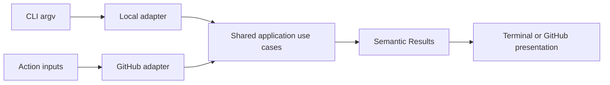

# CLI and Single-Action Execution

- Status: As-built baseline
- Date: 2026-09-11
- Owners: Copilot maintainers
- Scope: the published `copilot` CLI, local action adapter, and bounded GitHub Action single-action dispatch
- Related issues/PRs: setup, execution lifecycle, Bugbot, and release orchestration SDDs
- Required review gates: product UX, architecture, testing, documentation, security/operations
- Open decisions blocking readiness: none for the baseline

## 1. Executive summary

Copilot exposes two explicit operator interfaces over the same application core:
the published `copilot` CLI for local/setup/diagnostic/quality tasks, and the
GitHub Action `single-action` input for bounded workflow operations. CLI commands
validate repository context and options before building a local `Execution`;
single actions validate an exact domain catalog and required issue/version/comment/
operation fields before dispatch. Internal durable deployment actions are
workflow-owned and are not general automation primitives.

```text
CLI argv/env -> command policy -> local execution adapter -> shared use case -> text/JSON
workflow inputs -> SingleAction domain -> shared route -> one bounded use case -> GitHub result
```

## 2. Problem, current behavior, and evidence

### 2.1 Problem

Maintainers need local commands and workflow-callable operations without two
independent business implementations. Loose string dispatch, implicit repository
targets, or exposing internal continuation actions would create unsafe and
unmaintainable interfaces.

### 2.2 Current behavior

1. The package exposes `copilot` and the Action bundle on Node 24+.
2. Command registry installs `think`, `do`, progress, recommendation, detection,
   Bugbot eval/analytics/benchmark, setup, upgrade, doctor, and reconcile commands.
3. Repository-dependent commands validate current Git worktree/origin and input;
   setup/doctor use the separate setup contract.
4. Local actions build the same `Execution` model and call `mainRun`, then render
   text or command-specific JSON where supported.
5. `SingleAction` accepts only the exact `ACTIONS` catalog and validates whether
   an issue is required or the operation is issue-free.
6. Single-action workflow dispatch selects one use case; exceptions become a
   failed `Result`, and agent-backed actions honor members-only authorization.
7. Durable deployment continuation/publication/failure actions require operation
   identity and remain workflow-owned.
8. CLI update checks are bounded/advisory; upgrade is an explicit command.

### 2.3 Evidence and contract classification

- Observed behavior: CLI program/registry/commands, local Action adapters, action
  type/single-action domain, dispatch workflow, package exports, tests, and docs.
- Intentional contract: shared application core, strict command/action catalogs,
  validated inputs, semantic results, explicit internal operation boundary, and no legacy aliases.
- Known debt and limitations: command output schemas are not uniform across all
  older commands; some local operations still require GitHub PAT/agent environment;
  no shell-completion contract exists; live Windows runner support is not claimed.
- Unknown rationale: historic command names are current compatibility, not proof
  of ideal information architecture.
- Proposed improvements: uniform versioned JSON output or shell completion needs a separate spec.

## 3. Actors, surfaces, and terminology

| Actor | Goal | Entry point | Surface |
|---|---|---|---|
| Developer | analyze/change locally | `copilot <command>` | terminal/files |
| Setup owner | install/diagnose | setup/doctor/reconcile | plan/report/backups |
| Workflow author | invoke bounded operation | `single-action` | Actions result/comment |
| Release workflow | resume durable operation | internal single action | control center/summary |

“CLI command” is a public executable subcommand. “Single action” is a domain
value passed through `action.yml`. “Workflow-owned” means a generated workflow,
not a user-facing generic primitive, owns required sequencing and identity.

## 4. Goals, non-goals, and fixed invariants

### 4.1 Goals

1. Every public entry MUST validate before invoking shared application behavior.
2. A single-action value MUST dispatch to at most one use case.
3. Human and JSON output MUST truthfully distinguish success, skip, failure, and partial state.

### 4.2 Non-goals

1. The CLI is not an arbitrary GitHub Actions runner.
2. `copilot do` has no single-action equivalent and does not imply GitHub authority.
3. Internal deployment actions are not supported for direct ad-hoc use.

### 4.3 Fixed product/safety invariants

1. Unknown commands/actions and invalid issue/version/mode/operation IDs fail or no-op visibly.
2. Tokens and credentials MUST not be embedded in config/output/command examples.
3. CLI and Action adapters MUST not duplicate domain orchestration.
4. A result error MUST produce a failing Action/CLI status where the command contract requires it.

## 5. Current versus proposed product journey

| Stage | Fragmented risk | As-built contract | Effect |
|---|---|---|---|
| Entry | ad-hoc scripts | registered commands/action values | discoverability |
| Validation | deep runtime errors | command/domain policies | early feedback |
| Execution | separate implementations | shared Execution/use cases | consistency |
| Internal ops | publicly callable stages | workflow-owned identity | safe sequencing |
| Output | logs only | results + text/JSON/summary | automation and humans |

No legacy compatibility layer exists and no behavior change is proposed.

## 6. Functional behavior and state model

### 6.1 Happy path

1. Parse a registered command or exact single-action value.
2. Resolve repository, credentials, options, and required target fields.
3. Build provider-neutral execution configuration.
4. Invoke one shared application use case.
5. Render bounded output and set the correct process/Action conclusion.

### 6.2 Alternative paths

- `--version`, help, update check, and upgrade can run outside a target repository.
- Setup dry-run needs no token; doctor is remote read-only; reconcile is local read-only unless `--apply`.
- `think_action`, initial setup, release creation/publication, inactivity, and
  branch observer are issue-free only where the domain explicitly allows it.
- `publish_issue_comment` owns its create/replace/append presentation.
- `copilot do` may modify the local workspace but does not commit/push through a single action.

### 6.3 State model

| State | Meaning | Next | Recovery |
|---|---|---|---|
| parsing | entry/options read | invalid/resolving | use help |
| invalid | contract rejected | terminal | correct exact field |
| resolving | repo/config/credentials loading | executing/failed | fix context |
| executing | one use case running | complete/skipped/failed/partial | inspect output |
| skipped | valid but prerequisites absent/policy no-op | terminal | satisfy named prerequisite |
| partial | irreversible substep succeeded | retry/recover | follow retained-state guidance |
| complete | result rendered/status correct | terminal | none |

Repeated read-only commands are safe. Mutation replay follows the owned feature's
idempotency contract and durable operation ID where applicable.

## 7. User-facing configuration

| Surface | Recommended default | Bounds | Precedence/persistence |
|---|---|---|---|
| CLI repository | current worktree/origin | valid GitHub repo where required | argv → env → defaults |
| token | hidden prompt or protected environment | valid PAT | memory only |
| output | `text` | text/json where documented | invocation only |
| debug | false | boolean | invocation only |
| `single-action` | empty | exact `ACTIONS` value | workflow run |
| issue/version/title/changelog/message | empty | action-specific required values | workflow run |
| comment mode | inferred create/replace | create/replace/append | workflow run |
| operation ID | empty | exact durable ID for internal continuation | stored operation + run |

Command and action catalogs, required-field matrix, deployment ownership,
repository resolution, token redaction, and one-handler dispatch are not configurable.

## 8. Clean Architecture design

| Boundary | Owns | Must not own/import |
|---|---|---|
| Domain | action catalog and validity | commander/core/GitHub |
| CLI/action policies | argv/input validation and presentation selection | feature orchestration |
| Application | single-action dispatch and shared use cases | terminal/provider DTOs |
| Ports | repository, GitHub, agent, output capabilities | concrete clients |
| Adapters | Commander, local config, GitHub Action inputs/output | product decisions |
| Composition | local/GitHub dependency wiring | duplicate handler logic |



CLI entrypoint, composition, architecture, workflow, package, and specification
catalog tests MUST enforce these boundaries and exported artifacts.

## 9. UI/UX and content contract

```markdown
Pending: **Running `detect-potential-problems` for issue #42.** No action is required.
Action required: **`--issue` must be a positive number.** Run `copilot ... --help`.
Blocked: **No GitHub repository was found at this worktree origin.** No remote action ran.
Partial: **Package/release step succeeded, but follow-up publication failed.** Inspect retained IDs before retrying.
Complete: **Command completed successfully.** Text/JSON contains the same semantic result.
```

Help lists required flags, defaults, side effects, credential source, and examples.
Errors start with impact and one recovery action; debug adds sanitized detail.
JSON MUST be machine-readable without ANSI/prose contamination. Text is the
default and English fallback. Terminal output must wrap/read at narrow widths;
icons are supplemental. Secret values and raw provider responses are never shown.

## 10. Failure, recovery, and cleanup

| Failure | Impact | Retained facts | Retry | Action | Cleanup |
|---|---|---|---|---|---|
| parse/input | no use case | argv/config | yes | use help | none |
| repo/token | no remote mutation | local workspace | yes | fix root/origin/token | none |
| agent/provider | command capability fails | bounded logs | yes | fix runtime/auth | terminate process |
| feature failure | route-specific | Result payload | route-specific | follow message | feature-owned |
| internal op mismatch | no continuation | durable operation unchanged | only exact retry | use workflow/control center | none |
| output render | operation may be complete | semantic Result | yes | use alternate output/log | no hidden rollback |

## 11. Security, permissions, and privacy

CLI arguments and environment are untrusted; tokens should use hidden prompt or
protected environment, never examples/process args where avoidable. Command
overrides are audited. Local `do` authority is the user's workspace authority;
GitHub single actions additionally use actor/token/operation guards. JSON/text
rendering redacts secrets/control sequences. Internal deployment actions reject
forged or stale operation IDs.

## 12. Observability and operational UX

Semantic `Result` exposes ID, executed/success, steps, errors, reminders, and
bounded payload. CLI exit code, Action conclusion, Job Summary, comments, and
JSON convey the same outcome. Debug is opt-in and redacted. Update-check failure
does not block normal commands; explicit upgrade reports its own result. Internal
deployment actions delegate status to the durable release control center.

## 13. Compatibility, migration, rollout, and rollback

Unknown/retired action values are not aliased. Removing or renaming a public CLI
command/action requires explicit migration and docs; internal deployment stages
may change only with workflow/action version coordination. Package smoke tests
verify exports, shebang, Node version, and installed invocation. Rollback pins a
prior major/patch or restores workflows; irreversible feature effects remain visible.

## 14. Testing strategy and numeric budget

| Area | Minimum cases | Risks |
|---|---:|---|
| Command/action/input policy | 28 | catalog, required fields, bounds, precedence |
| Dispatch/state/idempotency | 20 | one handler, skips, errors, durable IDs |
| Local/GitHub adapters | 18 | repo/env/input/result mapping |
| Package/workflow/setup contracts | 16 | exports, CLI, Action, internal ownership |
| Text/JSON UX/sanitization | 14 | help, parity, ANSI, secrets, wrapping |
| Integration/security/migration | 14 | installed smoke, forged IDs, compatibility |
| **Total** | **110** | no double counting |

Global thresholds remain; action/input/command policies SHOULD reach 100% branch
coverage. Tests use fake GitHub/agents/processes and temporary worktrees, with no
live services. Package build/npm smoke is required. Manual evidence covers
installed CLI help/text/JSON, narrow terminal, Action dispatch, and error recovery.

## 15. Documentation and discoverability

| Audience | Artifact | Required content |
|---|---|---|
| CLI user | workflow & CLI | install, prerequisites, commands/options |
| Workflow author | available/config/examples | action catalog/required matrix |
| Operator | troubleshooting/upgrade | exits, recovery, compatibility |
| Contributor | this SDD/architecture | shared-core boundaries |

## 16. Acceptance scenarios

1. Every registered CLI command appears in help/docs and validates required options.
2. Unknown CLI/single action performs no feature mutation and exits visibly.
3. A valid single action dispatches exactly one use case.
4. Issue-required/issue-free actions enforce the documented matrix.
5. Internal deployment action with absent/wrong operation ID cannot continue.
6. Local and GitHub entrypoints return equivalent semantic Results for shared behavior.
7. Text and JSON truthfully distinguish skipped, partial, failed, and complete.
8. Tokens/provider output/control sequences are absent from public output.
9. Published package smoke verifies CLI and Action/API artifacts.

## 17. Requirements traceability

| Requirement | Owner | Evidence | Documentation |
|---|---|---|---|
| public command catalog | command registry/CLI | CLI program tests | workflow & CLI |
| action catalog/validation | action types/SingleAction | model tests | available actions |
| shared dispatch | local adapter/single workflow | local/single-action tests | architecture |
| durable internal boundary | deployment use case | orchestration/workflow tests | deployment docs |
| package/output contract | build/render/package scripts | smoke/output tests | install/build docs |

## 18. Maintenance sequence

1. Update command/action contracts and exhaustive policy tests.
2. Update shared use cases/dispatch and result tests.
3. Update CLI/Action adapters, package/workflow checks, and security cases.
4. Update help, examples, docs, catalog, and migration notes.
5. Build/package/smoke and run full automated/human UX validation.

## 19. Definition of Done

- [ ] The 110-case budget, coverage, architecture, package, and workflow gates pass.
- [ ] Command/action catalogs, dispatch, required fields, skips, partial state, and durable identity agree.
- [ ] Text/JSON/Action conclusions and all five UI states are accessible and sanitized.
- [ ] Installed package/CLI/API/Action smoke evidence passes on supported runtime.
- [ ] Documentation/help/examples/catalog are complete with no legacy aliases.
- [ ] Human CLI and Action recovery UX evidence is captured.

## 20. References and decisions

- Primary sources: catalogued CLI/single-action code, tests, package, and docs.
- Related SDDs: execution lifecycle; setup; Bugbot; release orchestration.
- Decision: two adapters over one application core; exact catalogs; internal stages workflow-owned.
- Rejected: arbitrary string dispatch, duplicate business logic, legacy action aliases.
- Follow-up: versioned uniform JSON output and shell completion are outside this baseline.
