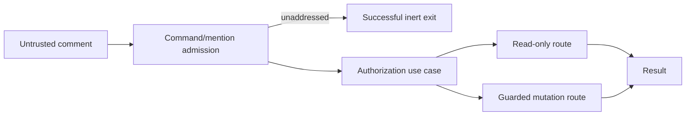

# Comment Automation and Authorization

- Status: Implemented
- Date: 2026-09-11
- Last updated: 2026-09-12
- Owners: Copilot maintainers
- Scope: parsing and routing issue/PR comments to read-only or mutation-capable use cases
- Related issues/PRs: Bugbot and branch synchronization SDDs
- Required review gates: product UX, architecture, testing, documentation, security/operations
- Open decisions blocking readiness: none for the baseline

## 1. Executive summary

Comments expose two product paths: deterministic `/copilot` commands and
natural-language requests that mention the authenticated bot account. Public
metadata and read-only help remain broadly available; file or finding-state
mutations require organization membership, repository ownership, or collaborator
write authority. Ambiguous, unauthorized, or incomplete mutation requests fall
back to a read-only answer or explicit no-op, never an inferred broad edit.
Comments that contain neither an explicit command nor an exact mention are
discarded before project lookup, AI configuration, translation, or runtime
preparation, regardless of whether their author is a human or machine account.

```text
comment -> bounded parser -> explicit command OR mentioned intent
        -> authorization -> read-only answer/review OR guarded mutation
        -> verification/commit when applicable -> one published result
```

## 2. Problem, current behavior, and evidence

### 2.1 Problem

Issue and PR comments mix untrusted prose, executable-looking text, bot mentions,
and requests with different side effects. Without a deterministic parser and
central authorization, a model classification error could expand privileges or
modify the wrong branch.

### 2.2 Current behavior

1. Commands are recognized only at the beginning, case-insensitively, with a
   2,000-character and 20-argument maximum.
2. Unknown commands and missing required arguments return validation errors.
3. `help` and `status` are public metadata. Read-only plan/explain/diagnose/test
   and review commands invoke their assigned agent role.
4. `fix`, `implement`, `remember`, `dismiss`, `description`, and `sync-branch`
   apply command-specific authorization and availability checks.
5. Non-command prose needs an exact bot mention before any comment automation,
   including translation, can run. A bounded natural-language branch-sync
   phrase has a dedicated deterministic detector.
6. Unauthorized file-modifying intent routes to read-only Think or a visible no-op.
7. Successful workspace mutations pass preflight, path checks, verification,
   authenticated commit, and push before publication.
8. Unaddressed comments are successful no-ops before project/provider reads, so
   documentation, coverage, and other machine-authored reports cannot activate agents.
9. Comment-triggered file mutation requires a PR review-comment event with its
   authoritative branch, or an explicitly branch-scoped execution. An
   `issue_comment` never scans open PRs or selects a first matching branch.
10. Issue and PR comment routes project one frozen, credential-free
    `CommentAutomationContext`; shared workflows receive only capability facts
    and repository-bound semantic ports.

### 2.3 Evidence and contract classification

- Observed behavior: command domain, comment automation workflows/policies,
  actor authorization repository, comment use cases, and comment docs.
- Intentional contract: explicit commands first, exact mention boundary,
  capability-specific roles, mutation authorization, and safe fallback.
- Known debt and limitations: natural-language intent and addressed-comment
  translation depend on a configured agent and can be unavailable; localization of deterministic system errors is
  incomplete; live comment UX evidence is not stored.
- Unknown rationale: the historic command vocabulary is accepted as current
  product language, not evidence that every original name is optimal.
- Proposed improvements: command aliases or richer approval workflows require a
  separate compatibility/product decision.

## 3. Actors, surfaces, and terminology

| Actor | Goal | Entry point | Surface |
|---|---|---|---|
| Participant | ask/read status | issue or PR comment | result comment |
| Authorized maintainer | mutate files/state | explicit/mentioned request | branch, commit, finding |
| Bot account | identity and publication | PAT-authenticated run | comments/checks |
| Agent runtime | classify or act within role | semantic port | structured result |

“Read-only” means no repository file or finding-state mutation. “Authorized” is
calculated from current GitHub organization/repository facts, not self-asserted
comment text. “Mentioned” uses username boundaries, so a prefix collision is not
a mention.

## 4. Goals, non-goals, and fixed invariants

### 4.1 Goals

1. Every accepted comment MUST resolve to a bounded, explainable route.
2. File/finding mutations MUST require fresh provider authorization.
3. Invalid or unauthorized commands MUST expose a useful safe result.
4. Unaddressed comments MUST NOT activate project, AI, runtime, or publication work.

### 4.2 Non-goals

1. Comments do not grant arbitrary shell access.
2. Natural language does not extend the command/configuration vocabulary.
3. This SDD does not define finding identity or branch merge mechanics.

### 4.3 Fixed product/safety invariants

1. Missing mutation arguments never imply “all”.
2. Prompt classification cannot override actor authorization.
3. Unmentioned prose cannot trigger general file mutation.
4. Agent output cannot commit or push directly; trusted runner code owns it.
5. Issue-only and general PR-conversation comments cannot infer a write target.
6. Comment author account type is not an authorization signal; explicit addressing
   is the machine-neutral admission boundary.

## 5. Current versus proposed product journey

| Stage | Unsafe/unclear alternative | As-built contract | Effect |
|---|---|---|---|
| Admission | every comment activates AI | command or exact mention required | no passive machine loops |
| Intent | model parses addressed prose | command parser first | auditability |
| Mention | substring match | exact username boundary | no accidental trigger |
| Authority | prompt assertion | GitHub membership/permission | least privilege |
| Mutation | agent controls git | guarded runner commit/push | constrained blast radius |
| Failure | silence | result/no-op with reason | clear next action |

This is a greenfield contract change. Passive translation of unaddressed comments
is removed outright; there is no compatibility flag or legacy route.

## 6. Functional behavior and state model

### 6.1 Happy path

1. Discard the event unless it starts with the command prefix or contains an exact mention.
2. Parse a valid command or detect an exact mention.
3. Resolve only the agent roles reachable by that route.
4. Check authorization for state/file mutations.
5. Execute read-only or guarded mutation use case.
6. Publish one bounded result and relevant lifecycle state.

### 6.2 Alternative paths

- `/copilot help` and `/copilot status` do not require mutation authority.
- `/copilot analyze|review|findings|recheck` use read-only Bugbot.
- `/copilot sync-branch --dry-run` prepares and aborts without push or agent.
- A plain comment without a bot mention receives no language, intent, project,
  runtime, or publication handling.
- An issue or general PR-conversation comment may ask for an answer or read-only
  review, but `fix`/`implement` requires the intended PR review thread or an
  explicitly branch-scoped execution.

### 6.3 State model

| State | Meaning | Next | Recovery |
|---|---|---|---|
| ignored | no actionable command/mention | terminal | mention bot/use command |
| invalid | parser rejected command | terminal | use shown syntax |
| classified | bounded route known | authorizing/executing | none |
| unauthorized | mutation denied | think/no-op | ask authorized maintainer |
| executing-read-only | analysis/help/status | complete/failed | retry |
| executing-mutation | guarded workspace action | verifying/aborted | inspect reason |
| verifying | commands and workspace checked | committed/aborted | fix tests |
| complete | result published | terminal | none |

Duplicate comment deliveries MUST converge through provider markers and
mutation preflight; already pushed commits are not repeated blindly.

## 7. User-facing configuration

| Input | Default | Bounds | Persistence |
|---|---|---|---|
| `ai-members-only` | `false` | boolean | repository/workflow |
| bot username | PAT identity | authenticated GitHub login | resolved per run |
| `bugbot-fix-verify-commands` | empty | bounded command list/policy | repository/workflow |
| `ai-ignore-files` | empty | comma-delimited patterns | per run |
| role provider/model/effort/command | common agent tuple | validated role tuple | Variables/inputs |

The command prefix, supported command names, 2,000-character/20-argument bounds,
required arguments, command-or-mention admission boundary, authorization rules,
mention boundary, and git ownership are
not configurable. New commands require compatibility docs and parser tests.

## 8. Clean Architecture design

| Boundary | Owns | Must not own/import |
|---|---|---|
| Domain | command grammar and branch-sync phrase/options | GitHub/agent SDK |
| Policies | route choice and authorization-independent decisions | I/O |
| Application | command/natural-language workflows and completion | provider DTOs |
| Ports | actor authorization, agent capabilities, git, finding state | concrete clients |
| Adapters | GitHub permission lookup and CLI invocation | route policy |
| Presentation | help/status/result text | mutations |



Application and architecture tests MUST prevent provider types from entering
parsers/use-case contracts and keep presentation separate from mutation policy.

The issue-comment and PR-review-comment coordinators are the only aggregate
boundaries. They project the addressed comment, translation request, Think
request and selected specialist, status snapshot, and Bugbot facts into one
deeply readonly `CommentAutomationContext`. Permissions, translation, Think,
title, publication, configuration, and project-link leaves consume smaller
records. Repository identity and credentials are captured in composition and
exposed through bound semantic ports; none of these records contains a token,
provider client, `Ai` instance, or configuration getter. Command-specific review
overrides create a new frozen context and cannot mutate the run-wide AI model.
There is no legacy aggregate overload or compatibility route.

## 9. UI/UX and content contract

```markdown
Pending: **Copilot is classifying this mentioned request.** No action is required.
Action required: **`/copilot fix` needs at least one finding ID.** Copy an ID from Bugbot status.
Blocked: **This account cannot modify repository files.** Ask an authorized maintainer; nothing changed.
Partial: **The requested edit was prepared, but verification failed.** No commit was pushed; inspect the command result.
Complete: **Request applied and pushed as `abc1234`.** A fresh review will verify the result.
```

Help MUST enumerate exact commands and side effects. Mutation responses state
branch, verification, commit/push, and whether independent review remains.
Notification budget is one generic result per addressed run plus feature-owned stable
status where applicable. Text accompanies icons; English fallback is required;
untrusted mentions, Markdown, markers, and URLs are sanitized.

## 10. Failure, recovery, and cleanup

| Failure | Impact | Retained facts | Retry | Action | Cleanup |
|---|---|---|---|---|---|
| invalid syntax | no route | comment | yes | correct command | none |
| denied actor | no mutation | authorization result | after access change | maintainer | none |
| no authoritative branch/context | mutation skipped | issue/PR state | yes | use intended PR review thread or branch-scoped execution | none |
| agent/verification | no commit | workspace aborted | yes | repair config/tests | abort changes |
| push race | no stale push | remote heads | yes | rerun latest | abort local operation |
| publication | work may be pushed | commit/result | yes | inspect run/commit | do not undo commit |

## 11. Security, permissions, and privacy

Actor login comes from the event and authority from GitHub APIs. Organization
repositories require membership; personal repositories accept owner or
`push`/`maintain`/`admin` collaborator permission. Comment and parent-thread text
are bounded untrusted prompt context. Read-only agents cannot write; mutation
agents cannot own git credentials or trusted verification execution. Secrets and
raw provider errors are redacted.

## 12. Observability and operational UX

Logs record parser route, authorization outcome, active roles, mutation phase,
verification count, and sanitized failure. Results identify explicit command
and review overrides. GitHub comments, commit SHA, finding/status links, Job
Summary, and lifecycle/activity labels are correlated. Unauthorized no-ops are
visible without being reported as workflow failures. Unaddressed comments emit
only a bounded internal log and exit successfully before result publication or
provider/runtime reads.

## 13. Compatibility, migration, rollout, and rollback

There are no installed users, so no legacy passive-comment behavior is retained.
Existing command names remain stable. New names MUST not reinterpret previously
ordinary comments as mutations without an explicit SDD change. Natural-language
classification may evolve only behind the same fixed admission and authorization boundaries.
Rollback of code edits uses normal Git history; Copilot never resets a remote
branch. Finding dismissal and learned rules require explicit follow-up commands.

## 14. Testing strategy and numeric budget

| Area | Minimum cases | Risks |
|---|---:|---|
| Parser/mention/route policy | 24 | limits, vocabulary, precedence, collisions |
| Workflow/idempotency/races | 18 | fallback, duplicate, branch/push race |
| Authorization/adapters | 14 | org/personal permissions, API errors |
| Workflow/config contracts | 8 | events, permissions, active roles, inert passive comments |
| UX/localization/sanitization | 14 | help/errors/links/mentions/Markdown |
| Integration/security/migration | 14 | comment→commit/review, prompt injection |
| **Total** | **92** | no double counting |

Global coverage remains mandatory; command and route policies SHOULD have 100%
branch coverage. Use fake authorization/agents/git; no live models or waits.
Manual evidence covers issue/PR/review-thread rendering, narrow screens, and
English/non-English requests.

## 15. Documentation and discoverability

| Audience | Artifact | Required content |
|---|---|---|
| User | comment commands | syntax, side effects, examples |
| Maintainer | Bugbot permissions/do request | authority and mutation journey |
| Operator | failure scenarios | no-op, verification, push recovery |
| Contributor | this SDD/architecture | route and trust boundaries |

## 16. Acceptance scenarios

1. A valid public help/status command returns metadata without mutation authority.
2. Unknown, oversized, or argument-less mutation commands fail validation.
3. `@vypbot-extra` does not mention `@vypbot`.
4. An unauthorized fix/implement/dismiss cannot mutate files or finding state.
5. An authorized explicit mutation runs verification before trusted commit/push.
6. A review request remains read-only.
7. A verification or remote-head failure aborts without push and reports recovery.
8. A duplicated delivery does not silently duplicate the mutation.
9. Untrusted comment text cannot inject shell, marker, mention, or secret output.
10. An issue-only or general PR-conversation mutation request performs no
    workspace operation and never scans open PRs for a branch.
11. An unaddressed human or machine comment exits before project lookup, AI
    configuration, runtime provisioning, translation, or publication.

## 17. Requirements traceability

| Requirement | Owner | Evidence | Documentation |
|---|---|---|---|
| bounded grammar | command domain | command tests | comment commands |
| safe routing/admission | request/route/workflow policies | entrypoint and use-case tests | comment commands |
| authorization | authorization port/adapter | repository tests | permissions |
| guarded mutation | workspace/git workflows | mutation tests | autofix/do request |
| safe output | result policies | publication tests | failure scenarios |
| narrow comment context | issue/PR route projectors and bound ports | P2-D eight-case projection ledger plus route parity suites | architecture and dependency rules |

## 18. Maintenance sequence

1. Change grammar/route policy and exhaustive tests.
2. Change semantic use-case contracts and authorization cases.
3. Change adapters/workflows and security tests.
4. Change help/status/results, docs, examples, and catalog.
5. Run all automated gates and human GitHub UX review.

## 19. Definition of Done

- [ ] Commands, mentions, authorization, fallback, replay, and races are covered.
- [ ] The 92-case budget, coverage, and architecture checks pass.
- [ ] No model output or comment can expand authorization or git authority.
- [ ] All five UI states and help content are reviewed and accessible.
- [ ] Workflows, documentation, and catalog agree.
- [ ] Human issue/PR/review-comment evidence is captured.

## 20. References and decisions

- Primary sources: catalogued command/comment code, tests, workflows, and docs.
- Related SDDs: Bugbot analysis; branch synchronization; agent runtime.
- Decision: deterministic commands precede agent intent; authorization is fixed.
- Rejected: model-only command parsing and silent unauthorized mutation.
- Follow-up: localized deterministic command errors are outside this baseline.
