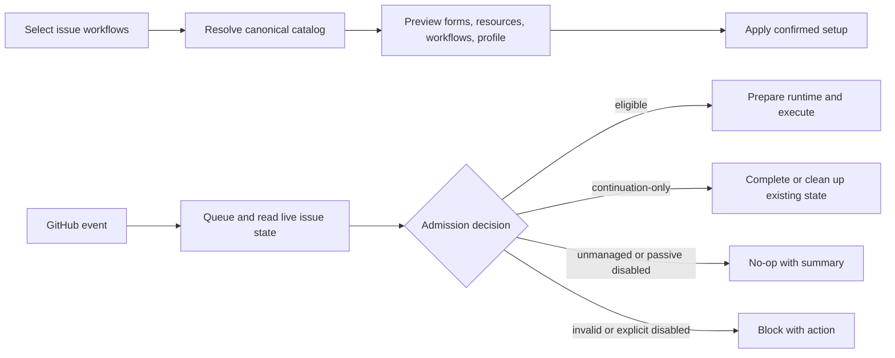
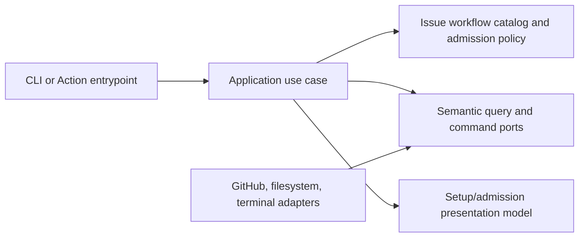

# Configurable Issue Workflows and Fail-Closed Admission

- Status: Implemented — automated local gates complete; controlled live GitHub UX evidence remains pending
- Date: 2026-09-16
- Catalog capability ID: `configurable-issue-workflows`
- Last verified: 2026-09-16
- Owners: Copilot maintainers
- Scope: one selectable issue-workflow catalog that drives setup assets, runtime admission, branch behavior, release dependencies, diagnosis, and user guidance
- Related issues/PRs: none yet; related SDDs are listed in section 20
- Required review gates: product UX, architecture, testing, documentation, security/operations
- Open decisions blocking readiness: none

## 1. Executive summary

`copilot setup` will offer a keyboard multi-select for the repository's supported
issue workflows. All seven workflows are selected by default. One versioned
catalog will then determine which Issue Forms, labels, optional native GitHub
Issue Types, workflows, runtime routes, branch policies, and body schemas are
valid. The selected set is persisted as a compact repository Variable and
passed to every relevant Action run.

Before an agent runtime is prepared or any repository mutation occurs, the
Action MUST classify the live issue, validate the selected workflow and its
dependencies, and produce an admission decision. Unknown, disabled,
contradictory, or malformed work MUST NOT fall through to a feature branch or
partially execute. Native GitHub Issue Types remain best-effort presentation;
labels plus durable Copilot state are the canonical runtime evidence.

```text
setup selection -> canonical catalog -> forms/resources + runtime profile
event -> live issue snapshot -> classify + validate -> execute | continue-only | no-op | block
```

Implementation status as of 2026-09-16: setup selection, compact profile
propagation, live-state admission, exact kind-to-branch projection,
continuation/durable-operation policy, selected resource installation, doctor
checks, documentation, and repository dogfood are implemented. Final acceptance
still requires controlled GitHub runs for the user-visible blocked and
continuation states; that evidence does not weaken the fail-closed runtime gate.

## 2. Problem, current behavior, and evidence

### 2.1 Problem

Setup currently treats Issue Forms as one mostly all-or-nothing feature while
runtime behavior independently infers work from labels and Markdown headings.
There is no persisted statement of which issue workflows a repository enabled.
Consequently, setup can advertise a workflow that runtime cannot complete,
runtime can act on a workflow the owner intended to omit, and malformed or
conflicting inputs can reach branch, project, assignment, or deployment steps.

This affects setup owners, contributors, repository agents, and operators. It is
particularly risky for release and hotfix issues because their form fields are
parsed as deployment inputs and their branches are mandatory.

### 2.2 Current behavior

The following is verified as of 2026-09-16:

1. `SetupConfiguration.features.issueTemplates` enables or disables the Issue
   Form set as a whole. Release and hotfix forms are additionally filtered by
   their feature booleans; the other five forms are copied together.
2. Setup provisions the full label and native Issue Type inventories regardless
   of which templates were selected. Native Issue Type creation uses an
   organization GraphQL path and therefore is not universally available to
   personal repositories or non-admin setup tokens.
3. Existing Issue Forms are skipped, not compared with the desired contract.
   Doctor compares workflows but does not validate forms, their required
   headings, or their relationship to runtime configuration.
4. Branch selection and native Issue Type selection use separate precedence
   functions. Conflicting labels can therefore produce a branch from one type
   and a native Issue Type from another.
5. An issue with no recognized branch label falls back to a feature branch in
   `label_branch_policy.ts`, while native Issue Type selection falls back to
   Task. Help/question issues can also become branchable when global
   `branch-management-always` is enabled even though documentation says they do
   not create branches.
6. The issue workflow checks actor permission, then may remove branches, assign
   a member, update the title and Issue Type, link projects, calculate priority,
   prepare branches, and dispatch deployment work. There is no workflow-profile
   admission gate before those mutations.
7. Release and hotfix extraction relies on headings generated by their forms:
   `Release Type`, `Release Version`, `Base Version`, `Hotfix Version`,
   `Changelog`, `Hotfix Solution`, and `Additional Context`. Missing or invalid
   values can currently be interpreted as an automatic version request.
8. Agent-task activation and runtime preparation happen before `mainRun`, while
   live issue setup and queueing happen inside `mainRun`. A type gate added only
   to the issue workflow would therefore be too late to avoid agent cost and
   unrelated side effects.
9. GitHub Issue Form labels are applied only when those labels already exist.
   Also, disabling blank issues in `config.yml` does not prevent users with
   repository write, maintain, or admin access from opening a blank issue.
   Runtime validation therefore cannot trust chooser configuration or apparent
   form provenance as an authorization boundary.

### 2.3 Evidence

- Setup contract and planning: `src/domain/setup.ts`,
  `src/application/policies/setup_configuration_defaults.ts`,
  `src/application/policies/setup_configuration_plan.ts`, and
  `src/utils/setup_files.ts`.
- Wizard and terminal constraints: `src/domain/setup_questionnaire.ts`,
  `src/application/policies/setup_questionnaire_policy.ts`,
  `src/cli/setup_terminal_driver.ts`, and `src/cli/setup_question_renderer.ts`.
- Provisioning and diagnosis:
  `src/application/usecases/actions/setup_resource_provisioning.ts`,
  `src/application/usecases/setup/doctor_use_case.ts`, and
  `src/infrastructure/setup_workspace_adapter.ts`.
- Classification and mutation order: `src/data/model/label_branch_policy.ts`,
  `src/application/usecases/issue_workflow_context.ts`,
  `src/application/usecases/issue_workflow.ts`, `src/actions/github_action.ts`,
  and `src/actions/common_action.ts`.
- Issue Form assets: `setup/ISSUE_TEMPLATE/`.
- Packaging checks: `package.json`, `scripts/validate-npm-package.cjs`, and
  `scripts/smoke-test-npm-package.cjs`.
- External primary sources: GitHub's documentation for
  [repository issue templates](https://docs.github.com/en/communities/using-templates-to-encourage-useful-issues-and-pull-requests/configuring-issue-templates-for-your-repository),
  [Issue Form syntax](https://docs.github.com/en/communities/using-templates-to-encourage-useful-issues-and-pull-requests/syntax-for-issue-forms),
  [creating issues](https://docs.github.com/en/issues/tracking-your-work-with-issues/using-issues/creating-an-issue),
  [organization Issue Type permissions](https://docs.github.com/en/rest/orgs/issue-types),
  and the [`gh issue create` template option](https://cli.github.com/manual/gh_issue_create).
- Unknowns: no repository evidence establishes why the two current label
  precedence orders differ or why unknown labels default to feature work. This
  specification does not preserve either behavior.

### 2.4 Retrospective classification (as-built baselines only)

Not applicable. This document originated as a prospective specification and is
now the maintained implementation contract. Section 2.2 remains the audited
pre-change baseline rather than a reconstruction of current behavior.

### 2.5 Implementation evidence

- Catalog/profile/classifier: `src/domain/issue_workflow_profile.ts` and
  `src/domain/issue_workflow_runtime_policy.ts`.
- Setup projection/reconciliation:
  `src/application/policies/setup_issue_workflow_policy.ts`,
  `src/application/policies/setup_issue_resource_policy.ts`, and
  `src/utils/setup_files.ts`.
- Live gate and mutation boundary: `src/actions/common_action.ts`,
  `src/actions/github_action.ts`, and
  `src/application/usecases/execution/setup_execution_workflow.ts`.
- Workflow propagation: `action.yml`, setup/dogfood workflows, and
  `scripts/validate-workflow-contract.cjs`.
- Verification: the catalogued domain, setup, execution, Action, workflow, and
  package tests plus the commands in section 19.

## 3. Actors, surfaces, and terminology

| Actor | Goal | Entry point | Visible surfaces |
|---|---|---|---|
| Setup owner | choose only supported work | `copilot setup` | multi-select, plan, warnings |
| Repository maintainer | understand and change the contract | config file, rerun setup | forms, Variables, doctor |
| Contributor | file valid work | New issue or CLI | Issue Form chooser, validation |
| Repository collaborator agent | work like a human contributor | repository instructions | forms, linked branch, PR |
| Action runtime | mutate only admitted work | GitHub event/single action | check, Job Summary, issue/PR |
| Operator | diagnose drift or a block | `copilot doctor`, Action run | pass/warn/fail/skipped checks |
| Organization admin | optionally provision native Issue Types | setup | organization settings |

An **issue workflow kind** is a Copilot-owned stable identifier. It is not the
same as a GitHub native Issue Type. The initial closed set is:

| Kind | Form | Recognition labels | Branch policy | Native Issue Type projection | Required semantic body |
|---|---|---|---|---|---|
| `feature` | `feature_request.yml` | `feature`, `enhancement` | Action-managed feature branch | Feature | none beyond valid form output |
| `bugfix` | `bug_report.yml` | `bugfix`, `bug` | Action-managed bugfix branch | Bug | none beyond valid form output |
| `documentation` | `doc_update.yml` | `docs`, `documentation` | Action-managed docs branch | Documentation | none beyond valid form output |
| `chore` | `chore_task.yml` | `chore`, `maintenance` | Action-managed chore branch | Maintenance | none beyond valid form output |
| `help` | `help_request.yml` | `help`, `question` | no branch | Help | a non-empty help description |
| `hotfix` | `hotfix.yml` | `hotfix` | mandatory Action-managed hotfix branch | Hotfix | Base Version, Hotfix Version, Hotfix Solution |
| `release` | `release.yml` | `release` | mandatory Action-managed release branch | Release | Release Type, Release Version, Changelog |

`config.yml` is global Issue Form chooser configuration and is installed when
forms are enabled; it is not a selectable kind. `All` is a setup control, not a
stored kind. `Task` and `Question` may still exist as native GitHub Issue Types,
but they are not independent selectable workflows in this version because no
independent form or runtime branch contract exists for them.

An **unmanaged issue** has no recognized kind and no durable Copilot kind. A
**managed branch** is a remote repository ref whose creation, naming, parent,
rename, and deletion are owned by the Action. A contributor may check out that
exact remote ref locally and push commits to it; that does not transfer lifecycle
ownership.

## 4. Goals, non-goals, and fixed invariants

### 4.1 Goals

1. Let setup owners select any non-empty subset of the seven kinds with `All`
   selected by default.
2. Generate one deterministic plan for forms, labels, workflows, runtime
   profile, branch behavior, and diagnosis from one catalog.
3. Decide runtime eligibility before agent preparation and before domain
   mutation.
4. Preserve safe completion and cleanup for work that was already admitted
   before a kind was disabled.
5. Make every block actionable through a stable Job Summary and, only for an
   explicit comment command, one bounded reply.

### 4.2 Non-goals

1. This version does not provide an arbitrary user-defined workflow or Issue
   Form builder.
2. It does not make native GitHub Issue Types a prerequisite.
3. It does not infer form provenance from editable Markdown.
4. It does not repair a malformed issue body automatically or invent release
   versions.
5. It does not implement transactional rollback across all GitHub and local
   writes; it does make each planned artifact recoverable and idempotent.

### 4.3 Fixed product/safety invariants

1. One domain catalog MUST own identifiers, aliases, ordering, form filenames,
   body schemas, branch policy, native Issue Type projection, and dependencies.
2. Unknown work MUST NOT default to `feature` or any branch-bearing kind.
3. More than one recognized kind on a new issue is a conflict and MUST block.
4. Runtime admission MUST complete before provider-backed actor authorization,
   agent runtime preparation, assignment, title/label/type/project changes,
   branch mutation, deployment, or lifecycle state mutation. A no-op, blocked,
   or continuation-only decision performs no members-only lookup; a lookup
   failure therefore cannot turn non-executable work into a failed run.
5. The only allowed pre-admission repository write is one bounded diagnostic
   reply to an explicit addressed command. Passive events use logs and Job
   Summary only.
6. Help work MUST remain branchless even when `issue-managed-branches=true`
   and after its `in-progress` start.
7. Release and hotfix bodies MUST distinguish the explicit value `Automatic`
   from missing, duplicated, empty, or invalid values; invalid is never
   reinterpreted as automatic.
8. Native GitHub Issue Type lookup or provisioning failure MUST degrade to a
   warning when labels and the runtime profile are valid.
9. The Action owns remote managed-branch creation, naming, rename, parent, and
   deletion. Configuration cannot delegate those operations to an agent.
10. Invalid, unknown-version, or contradictory profile configuration MUST fail
    closed before mutations. An absent profile selects all seven kinds and
    applies the same body validation as an explicit profile.
11. Labels required by a selected rendered form MUST exist before that form is
    considered ready. `blank_issues_enabled=false` improves the chooser but does
    not replace runtime classification and schema validation.

## 5. Current versus proposed product journey

| Stage | Current | Proposed | User/operator effect |
|---|---|---|---|
| Selection | all forms, except release/hotfix filters | Space/Enter multi-select, `All` default | repository advertises only intended work |
| Planning | files and resources planned separately | one per-kind dependency matrix | contradictions are visible before mutation |
| Forms | copied statically, existing files skipped | rendered from effective labels and reconciled by ownership | forms and runtime agree |
| Native Issue Types | all provisioned, organization-dependent | selected kinds only, best effort | personal repositories remain supported |
| Runtime type | separate precedence and fallback | one exact classifier | no feature fallback or split identity |
| Admission | no type/dependency gate | live fail-closed preflight | no partial branch/deploy side effects |
| Existing work | configuration change is ambiguous | continuation-only or durable-operation mode | safe completion without starting new work |
| Diagnosis | workflow-focused | profile, form, dependency, and drift checks | exact remediation |



Text equivalent: setup selection becomes one catalog-derived plan and persisted
profile. Each event waits for its mutation queue, reads live state, and then
either executes, performs only safe continuation, does nothing, or blocks before
domain changes.

## 6. Functional behavior and state model

### 6.1 Happy path

1. Setup resolves defaults and explicit configuration. New interactive runs
   begin with all seven kinds checked.
2. When issue handling is enabled, the terminal presents the multi-select. Up
   and Down move, Space toggles, and Enter confirms. Selecting `All` checks every
   kind; toggling it while all are checked clears them. A child toggle
   recomputes the `All` state.
3. The catalog expands the selection into Issue Forms, effective configured
   labels, native Issue Type projections, required workflow files, branch roles,
   body schemas, runtime routes, and documentation/guidance facts.
4. Setup validates cross-field dependencies and shows a per-kind plan before
   any local or GitHub write.
5. Confirmed setup renders selected forms from effective label configuration,
   writes the compact profile Variable, provisions selected labels, attempts
   selected native Issue Types when supported, and installs required workflows.
6. A relevant Action run performs cheap actor/unaddressed-event filtering,
   validates the static profile, enters the existing workflow queue, and reads
   the live issue plus durable Copilot state.
7. One pure classifier resolves exactly one kind. A dependency/body validator
   returns an immutable admission outcome.
8. Only `eligible` work proceeds to provider-backed project hydration, actor
   authorization, agent runtime preparation, route composition, and normal
   mutation. A side-effect-free base `Execution` value may be assembled before
   admission so the queue and live-state use case have typed context. When an
   active user-content task is protected by `ai.membersOnly`, that base value
   keeps every protected task model disabled. Only after live admission returns
   `execute` may the Action query membership and restore the validated requested
   task configuration; denial keeps it disabled and provider failure fails
   closed before agent preparation.

### 6.2 Alternative paths

- Non-interactive setup accepts explicit stable IDs or `all`; it never requires
  a TTY and rejects unknown, duplicate, or contradictory values.
- If raw terminal input is unavailable, the interactive renderer falls back to
  a numbered comma-separated selection with the same domain result. EOF and
  Ctrl-C cancel without applying a partial answer.
- `features.issueTemplates=false` may coexist with enabled kinds for teams that
  author issues through another UI. Setup warns that users must apply the exact
  configured labels and body schema. Runtime admission is unchanged.
- A personal repository or insufficient organization permission skips native
  Issue Type provisioning with a warning; labels and profile still work.
- A maintainer may still see GitHub's blank-issue route despite
  `blank_issues_enabled=false`. Such an issue is unmanaged until it has exactly
  one enabled kind and satisfies that kind's semantic body contract.
- A passive event for an unmanaged or disabled kind is a successful no-op with
  a Job Summary and no repository comment.
- An explicit command, launcher/deploy label, or issue-bound single action for
  an unmanaged or disabled kind is blocked. An addressed comment receives one
  actionable reply; other triggers rely on the failed check and Job Summary.
- An unlinked pull request remains eligible for the PR-native lifecycle defined
  by the pull-request SDD. It is not reclassified as an issue.

### 6.3 Setup state machine

| State | Entered when | User-visible meaning | Allowed next states | Recovery/owner |
|---|---|---|---|---|
| `unresolved` | defaults/config loaded | selection not validated | `selected`, `canceled` | setup owner answers or cancels |
| `selected` | kinds chosen | dependencies being resolved | `validated`, `invalid`, `canceled` | edit selection/config |
| `invalid` | cross-field rule fails | plan cannot be applied | `selected`, `canceled` | exact validation message |
| `validated` | catalog expansion succeeds | complete preview is available | `confirmed`, `canceled` | review plan |
| `confirmed` | owner approves | writes may begin | `applied`, `partial`, `failed` | setup use case |
| `partial` | a later reversible write fails | retained writes and backups listed | `confirmed`, `failed` | rerun idempotently |
| `applied` | all required work succeeds | runtime contract is active | `unresolved` on rerun | doctor verifies |

### 6.4 Runtime admission state machine

| State | Entered when | User-visible meaning | Allowed next states | Recovery/owner |
|---|---|---|---|---|
| `all-selected` | profile is absent | all seven kinds are enabled with normal body validation | any decision below | optionally persist an explicit profile |
| `eligible` | one enabled kind, valid body/dependencies | normal behavior may run | `completed`, route-specific failure | Action |
| `continuation-only` | disabled kind has pre-existing managed state | only synchronization, PR completion, and cleanup are allowed | `completed`, `blocked` | Action/maintainer |
| `durable-operation` | stored release/hotfix operation predates disablement | recover or finish that exact operation; no new deploy | `completed`, `blocked` | orchestration owner |
| `unmanaged` | no recognized kind and no durable kind | no automatic issue lifecycle | terminal no-op or explicit block | add one enabled kind intentionally |
| `disabled` | exactly one known but unselected kind | repository does not support this work | terminal no-op or explicit block | enable it through setup |
| `conflict` | multiple recognized kinds disagree | work identity is ambiguous | `eligible` after human correction | maintainer removes conflicting labels |
| `invalid-body` | required schema is missing/duplicated/invalid | release/hotfix cannot be trusted | `eligible` after edit and rerun | issue author/maintainer |
| `invalid-profile` | JSON/schema/kind is invalid | installation contract is unsafe | terminal block | rerun setup/doctor |
| `dependency-blocked` | selected kind lacks required workflow/config | requested operation cannot complete | `eligible` after repair | setup owner |

Classification order is not precedence. Durable stored kind is authoritative for
continuation; otherwise all live label groups are evaluated as a set. Zero
groups is unmanaged, one is exact, and more than one is conflict. Native Issue
Type is consistency evidence only. Duplicate events return the same decision;
stale events are evaluated against live state after queueing. Canceled setup
does not change the previous profile.

### 6.5 Admission matrix

| Condition | Passive issue event | Explicit command/launcher/deploy/single action | Allowed effects |
|---|---|---|---|
| enabled + valid | execute | execute | route-defined effects |
| disabled | successful no-op | failed/blocking result | summary; one reply only for addressed comment |
| unmanaged | successful no-op | failed/blocking result | same as disabled |
| conflicting kinds | fail | fail | diagnostics only |
| malformed required body | fail | fail | diagnostics only |
| missing dependency | fail | fail | diagnostics only |
| pre-existing managed state, now disabled | continuation-only | only explicit safe continuation commands | synchronization, PR completion, cleanup |
| pre-existing durable release/hotfix operation | finish/recover exact operation | finish/recover only; reject new deploy | durable operation effects only |
| unlinked PR | PR-native route | PR-native route | no issue workflow effects |

## 7. User-facing configuration

| Input | Type | Recommended default | Allowed values/range | Scope/persistence |
|---|---|---|---|---|
| `issueWorkflows.enabled` | ordered unique array | all seven kinds | closed IDs in catalog | setup config and immutable plan |
| `--issue-workflows` | comma-separated IDs | omitted means config/default | `all` or closed IDs | one CLI run |
| `features.issues` | boolean | `true` | boolean | setup config |
| `features.issueTemplates` | boolean | `true` | boolean | setup config |
| legacy `features.release` | boolean compatibility input | derived | accepted only when new field absent or consistent | deprecated setup input |
| legacy `features.hotfix` | boolean compatibility input | derived | accepted only when new field absent or consistent | deprecated setup input |
| `issue-workflow-profile` | canonical compact JSON string | empty selects all seven with body validation | schema version 1, known unique IDs only | Action input |
| `COPILOT_ISSUE_WORKFLOW_PROFILE` | canonical compact JSON string | explicit all for new setup | same as Action input | repository Variable |

The compact runtime value is exactly minified JSON with lexically stable catalog
order, for example:

```json
{"schemaVersion":1,"enabled":["feature","bugfix","documentation","chore","help","hotfix","release"]}
```

Validation rules:

1. `all` is accepted only by the CLI selector and expands before persistence.
   Config files and stored profiles always contain explicit IDs.
2. If `features.issues=true`, at least one kind MUST be enabled. If false, the
   enabled list MUST be empty and issue forms/runtime issue workflows are absent.
3. Selecting `release` or `hotfix` derives installation of its setup workflow and
   orchestration dependency. Interactive setup shows this; non-interactive
   configuration with contradictory legacy booleans fails instead of guessing.
4. When `issueWorkflows.enabled` is absent, legacy release/hotfix booleans derive
   the equivalent selection for compatibility. When both new and legacy fields
   are present, they must agree.
5. `features.issueTemplates=false` is valid but emits a warning and does not
   disable runtime kinds.
6. Unknown keys, schema versions, IDs, duplicates, non-arrays, oversized
   non-blank input, or malformed JSON fail before mutation. GitHub Actions maps
   both an omitted input and its declared empty default to the same empty
   string, so that value selects all kinds with normal body validation.
7. Workflow templates MUST pass the repository Variable into the Action input.
   Setup writes the Variable and forms from one immutable plan. Runtime rereads
   the value for each run and snapshots it in the admission outcome.
8. Version 1 forms do not depend on the optional top-level GitHub `type` field.
   The Action projects a native Issue Type after admission when supported, so a
   personal repository or a later organization-type change cannot make the form
   itself unusable.

Recommended setup keeps all kinds and forms. A meaningful alternative is a
library repository enabling `feature`, `bugfix`, `documentation`, `chore`, and
`help` while omitting release/hotfix orchestration.

Classification precedence, fail-open parsing, branch ownership, and the
meaning of `Automatic` are intentionally not configurable.

## 8. Clean Architecture design

### 8.1 Responsibilities and dependency direction

| Layer/boundary | Owns | Must not own/import |
|---|---|---|
| Domain/pure policy | catalog, profile schema, classifier, body/dependency rules, continuation policy | GitHub SDK, filesystem, terminal |
| Application | selection/plan use case, runtime admission use case, setup reconciliation, doctor checks | concrete Octokit, Actions core, raw TTY |
| Adapters/data | live issue/profile/state queries, Variable/label/type commands, form rendering, Markdown extraction | product precedence or fallback decisions |
| Infrastructure/composition | port binding and sequencing before agent preparation/mutation | duplicated classification |
| Entrypoints | CLI/action input and event adaptation | catalog rules, branch decisions |
| Presentation | setup matrix, summaries, localized diagnostics | state transitions or provider calls |



### 8.2 Contracts, state, and trust boundaries

- Pure decisions: `IssueWorkflowCatalog`, `IssueWorkflowProfile`,
  `IssueWorkflowClassification`, `IssueWorkflowAdmissionDecision`, dependency
  expansion, and form-schema validation.
- Application contracts: `PlanIssueWorkflowsUseCase`,
  `ReconcileIssueWorkflowAssetsUseCase`, and
  `ResolveIssueWorkflowAdmissionUseCase`.
- Semantic ports: live issue snapshot query, durable managed-state query,
  repository Variable query/command, setup asset query/command, native Issue
  Type capability query/command, and Job Summary publication.
- Durable state: managed issue configuration gains `issueWorkflowKind`,
  `profileSchemaVersion`, and `profileDigest`. Durable release/hotfix operations
  retain their own immutable kind and operation snapshot.
- Concurrency/idempotency: static profile validation may occur before queueing;
  the authoritative live classification occurs after the existing per-workflow
  queue and before mutations. Replays with the same live state yield the same
  outcome and diagnostic identity.
- Trusted inputs: package catalog and validated setup plan. Untrusted inputs:
  config files, Variables, labels, Issue Type names, issue Markdown, event
  payloads, and provider errors.
- Provider mapping: unavailable native Issue Type capability is warning-only;
  unavailable live issue or durable-state evidence is a fail-closed admission
  error for issue-bound work.

The GitHub Action lifecycle becomes:

```text
event adaptation
-> PAT self-loop and unaddressed-comment discard
-> bounded profile parse
-> workflow queue
-> live issue/durable-state admission
-> active agent task selection and runtime preparation
-> full Execution construction
-> route mutations
-> semantic publication
```

### 8.3 Executable architecture constraints

1. A repository test MUST prove there is exactly one catalog declaration and no
   second label-to-kind precedence table.
2. Branch and native Issue Type projection MUST accept a classified kind, never
   raw label booleans.
3. Mutation-capable issue use cases MUST require an admitted, immutable context;
   composition tests must prove denied outcomes cannot reach their ports.
4. Agent runtime preparation MUST be unreachable before accepted admission for
   issue-bound agent tasks.
5. Workflow contract validation MUST prove every relevant setup and dogfood
   workflow passes `issue-workflow-profile`, while `action.yml` documents its
   compatibility default.
6. Package validation and npm smoke tests MUST prove all selected source forms
   and setup renderers ship in the package.
7. Doctor and setup MUST consume the same expected plan; doctor remains
   query-only by architecture test.
8. A test MUST detect any form heading used by a semantic parser that is absent
   or duplicated in the corresponding source form.

## 9. UI/UX and content contract

### 9.1 Information hierarchy

1. Selected kinds and whether forms are installed.
2. Derived workflows, branch policy, labels, and optional Issue Type behavior.
3. Validation or drift state.
4. Exact human action, or “No action required.”
5. Links to the issue, setup documentation, and failed Action run.
6. Collapsed sanitized technical evidence.

### 9.2 Setup multi-select and plan

```text
Issue types and workflows
Use ↑/↓ to move, Space to toggle, Enter to confirm.

❯ [x] All (7)
  [x] Feature
  [x] Bug fix
  [x] Documentation
  [x] Chore / maintenance
  [x] Help / question — no branch
  [x] Hotfix — installs hotfix orchestration
  [x] Release — installs release orchestration
```

The plan then renders a compact matrix:

```text
Kind            Form                 Branch owner   Runtime   Dependencies
Feature         feature_request.yml  Action         enabled   issue workflow
Help / question help_request.yml     none           enabled   issue workflow
Release         release.yml          Action         enabled   release workflow

Native GitHub Issue Types: best effort (organization permission not yet verified)
Runtime profile: COPILOT_ISSUE_WORKFLOW_PROFILE (schema 1)
```

TTY rendering MUST remain usable without color and at 80 columns. Cursor state
uses both `❯` and text/checkbox state; color is never the only indicator.

### 9.3 Representative runtime views

Pending:

```markdown
# ⏳ Issue workflow admission

> **Current status:** Waiting for the earlier issue workflow run.
>
> **Action required:** No action required.
```

Action required:

```markdown
# 🛠 Issue workflow configuration needs attention

> **Current status:** `release` is enabled, but `release_workflow.yml` is missing.
>
> **Action required:** Run `copilot doctor`, then rerun `copilot setup` to restore the selected workflow.
```

Blocked:

```markdown
# ⛔ Issue workflow blocked

> **Current status:** This issue matches both `bugfix` and `release`.
>
> **Action required:** Keep exactly one supported type label, then rerun the failed workflow.

No branch, assignment, project, agent, or deployment change was made.
```

Partial:

```markdown
# ⚠️ Existing operation needs recovery

> **Current status:** Release `2.4.0` was already published before its workflow type was disabled; reconciliation is incomplete.
>
> **Action required:** Continue the existing operation from its control issue. A new deployment will not be started.
```

Complete:

```markdown
# ✅ Issue workflow admitted

> **Current status:** `bugfix` is enabled and valid.
>
> **Action required:** No action required.

The Action may now create or update the linked `bugfix` branch.
```

### 9.4 Issue, PR, and comment behavior

- Admission summaries use a stable semantic identity keyed by repository,
  issue, event intent, profile digest, and decision. Replays update rather than
  multiply any diagnostic reply.
- Passive disabled/unmanaged events publish no issue comment. An explicit
  addressed command may receive at most one reply for its command identity.
- Labels and native Issue Types supplement the visible state but never override
  a blocked classification silently.
- A PR linked to continuation-only work may complete the existing lifecycle;
  an unlinked PR remains governed by the PR lifecycle.
- Direct links use descriptive text and never expose raw provider URLs or
  credentials in diagnostics.

### 9.5 Accessibility, localization, and responsive behavior

- Setup remains English while it establishes repository locale, matching the
  existing setup contract. Runtime messages use the resolved issue locale with
  atomic English fallback.
- Every checkbox, status, and visual has text; terminal selection works without
  color and has a line-mode fallback.
- Job Summaries avoid wide mandatory tables; narrow renderings may use one
  labeled block per fact.
- Untrusted titles, labels, body excerpts, provider text, mentions, markers, and
  URLs are sanitized and bounded. Diagnostics name required headings but do not
  echo arbitrary issue content.

## 10. Failure, recovery, and cleanup

| Failure/partial state | User impact | Retained facts | Automatic retry | Required action | Cleanup |
|---|---|---|---|---|---|
| no kinds selected | setup cannot continue | previous config untouched | no | select one or disable issues | none |
| managed form drift | setup cannot replace silently | current file and desired hash | no | approve backed-up replacement | timestamped backup |
| deselected managed form | stale chooser would advertise disabled work | manifest ownership and backup | no | approve retirement | move to backup, do not hard-delete |
| deselected unmanaged form | stale form remains visible | file untouched | no | owner removes/updates it | doctor warning |
| native Issue Type unavailable | selected workflow still works | labels/profile/forms | bounded provider retry only | optional org admin action | none |
| Variable write fails | runtime contract not activated | local files may exist and are listed | safe rerun | repair permission and rerun | no false success |
| invalid profile | all issue-bound mutations blocked | existing repo state | no | rerun setup/doctor | none |
| conflicting labels | issue automation blocked | issue unchanged | on new event only | retain one kind | none |
| invalid release/hotfix body | deployment/branch work blocked | issue unchanged | on edited/rerun event | fix named field | none |
| disabled in-flight work | no new work; safe completion remains | stored kind/branch/PR/operation | route-specific | finish or close existing work | exact managed cleanup only |
| live issue query unavailable | no safe classification | logs/correlation only | provider retry policy | rerun after provider recovery | none |

Errors follow `impact -> cause -> action -> retained state`. Setup never reports
the profile active if its Variable write failed. Runtime never describes an
existing irreversible release as wholly failed when only reconciliation failed.

## 11. Security, permissions, and privacy

1. Setup MUST distinguish required repository permissions from optional
   organization Issue Type administration. Optional enrichment cannot broaden
   runtime authority.
2. Issue bodies, labels, configuration files, Variables, and provider messages
   are untrusted. Parsing is bounded by size, exact schema, known keys, and exact
   catalog IDs; none is executed.
3. Profiles contain no token, secret, arbitrary command, prompt, or free-form
   provider output. Secrets never enter setup plans, forms, summaries, or
   durable issue state.
4. Actor authorization remains mandatory after type admission. Admission proves
   capability, not permission. Provider-backed authorization MUST NOT run before
   live admission or for no-op, blocked, or continuation-only work.
5. A forged native Issue Type, template-like body, or label cannot bypass the
   enabled profile; a forged profile cannot bypass action/workflow permissions.
6. Explicit deploy intent retains the authorization, fencing, and idempotency
   rules of the release-orchestration SDD.

## 12. Observability and operational UX

- User-facing state: stable decision name, classified kind if safe, profile
  schema/digest prefix, impact, action, and retained state.
- Job Summary: one admission section per run, including `eligible`, `no-op`,
  `continuation-only`, or `blocked`; optional native Issue Type warnings are
  visually separate from runtime eligibility.
- Logs: structured fields for decision, reason code, event intent, kind,
  profile digest, durable-state mode, dependency checks, and correlation ID.
  Never log issue body values or full Variable contents.
- Metrics: counts and latency by decision/reason, profile schema, and kind;
  agent preparation after denial is a zero-tolerance invariant alert.
- Dependency outages are labeled separately from user configuration errors.
- Provider retries use existing bounded backoff/rate-limit policy; no retry loop
  adds repository comments.

## 13. Compatibility, migration, rollout, and rollback

1. A missing or empty Action input selects all seven kinds with normal body
   validation. The Actions input API cannot distinguish omission from an
   empty declared default.
2. Every new or rerun setup writes explicit schema-1 JSON, including when all
   kinds are selected.
3. Existing setup config without `issueWorkflows.enabled` derives the profile
   from `features.issues`, `features.release`, and `features.hotfix`. Documentation
   marks the latter two as compatibility inputs once the new selector ships.
4. Existing managed issue state is upgraded lazily with an inferred exact kind
   only when one can be proven. Ambiguous state blocks and is never guessed.
5. Disabling a kind applies immediately to new work. Existing ordinary work is
   continuation-only; an existing durable release/hotfix operation may finish
   or recover its exact snapshot, but no new deployment starts.
6. Rollout stages are: catalog/classifier shadow diagnostics; setup/profile and
   doctor; fail-closed runtime gate; form reconciliation; native Issue Type
   selection optimization. Shadow mode records differences without changing
   decisions and MUST be removed before Definition of Done.
7. Rollback can stop passing the input, selecting all seven kinds. The
   operator MUST be warned that this re-enables every kind. Form retirements are
   recoverable from setup backups; remote irreversible releases are not rolled
   back by this feature.

## 14. Testing strategy and numeric budget

The minimum budget is derived from distinct behaviors and risks; parametrized
rows count only when they assert a distinct decision branch.

| Area | Minimum distinct cases | Behaviors/risks covered |
|---|---:|---|
| Catalog, profile, configuration, classifier | 26 | seven kinds, aliases, all/empty/unknown/duplicate/schema cases, zero/one/multiple groups, no fallback, cross-field rules |
| Setup planning, selection, rendering, reconciliation | 24 | Space/Enter/All, fallback input, cancel/EOF, dependencies, effective labels, managed/unmanaged drift, retire/backup, idempotency |
| Runtime admission, state, replay, continuation | 31 | passive/explicit matrix, queue/live state, disabled/unmanaged/conflict, body validation, legacy, continuation, durable operations, unlinked PR, deferred members-only lookup, denied/failing authorization with fail-closed task configuration |
| Adapters and provider contracts | 12 | Variable, issue snapshot, state, labels, org/no-org Issue Types, permission/rate-limit/error mapping |
| Workflows, packaging, doctor, architecture | 16 | all workflow inputs, package contents, npm smoke, query-only doctor, mutation reachability, single catalog, parser/form contract |
| UI, localization, security, integration, migration | 18 | five UI states, no-color/narrow, sanitization, comment budget, no secrets, old config/profile migration, dogfood and rollback |
| **Total** | **127** | No double counting |

The issue-workflow domain and setup/rendering decision policies named by the
`Configurable issue workflows and repository agent guidance` coverage budget
require 100% statements, lines, functions, and branches. The ownership
reconciler requires at least 95% statements/lines/functions and 90% branches;
integration adapters remain subject to the non-decreasing repository-wide
budget. Tests use fake
clocks, IDs, terminal drivers, GitHub ports, and agent preparers; they perform no
real waits or live service writes. At least one integration test proves every
denied decision leaves assignment, title/type, project, branch, deployment,
lifecycle, and agent-preparation spies untouched. Golden terminal and Job
Summary fixtures are paired with semantic assertions. Manual evidence covers
TTY keyboard usability, no-color output, and GitHub mobile readability.

## 15. Documentation and discoverability

| Audience | Artifact/page | Required content | Validation/navigation |
|---|---|---|---|
| Setup owner | `docs/how-to-use.mdx` | selector, default All, config examples, plan/reconciliation | docs nav + setup fixture |
| Maintainer | `docs/issues/configurable-workflows.mdx` | catalog matrix, labels vs native types, dependencies, migration | table generated/validated from catalog |
| Contributor | issue type pages and chooser copy | exact form, branch expectation, required fields | template/docs contract test |
| Operator | `docs/issues/configuration.mdx` | admission decisions, doctor, failure recovery | decision tree test |
| Release owner | release/hotfix/deployment pages | strict body semantics, disable/in-flight behavior | parser examples from fixtures |
| Contributor/architect | `docs/development/architecture.mdx` | pre-admission boundary and single catalog | architecture check link |

`docs/issues/type/help.mdx` is added because help becomes an explicit selectable
workflow. `docs/configuration.mdx`, the configuration checklist, README feature
summary, and `docs.json` navigation are updated. Examples are sourced from or
validated against setup forms and profile fixtures.

## 16. Acceptance scenarios

1. Given a fresh interactive setup, when the selector opens, then all seven kinds
   are checked and Space/Enter produces the canonical ordered selection.
2. Given release and hotfix are deselected, when setup is confirmed, then their
   forms/workflows/resources are absent or safely retired, the explicit profile
   omits them, and all other selected forms remain.
3. Given a personal repository, when native Issue Type provisioning is
   unavailable, then setup completes with a warning and label-based admission
   remains functional.
4. Given custom configured labels, when forms and the profile are rendered,
   then their labels and runtime classification agree exactly.
5. Given an issue has both bugfix and release aliases, when its event runs, then
   admission fails before every domain mutation and identifies both groups.
6. Given a help issue and `issue-managed-branches=true`, when `in-progress`
   starts it, then help handling may run but no branch operation is reachable.
7. Given an explicit `Automatic` release version and valid release type, when
   admitted, then automatic version resolution is allowed; given a missing or
   malformed heading, it blocks instead.
8. Given a disabled kind receives a passive event, then the run is a quiet no-op;
   given an addressed command for the same issue, then it fails with one bounded
   actionable reply and no other mutation.
9. Given an existing bugfix branch/PR whose kind is later disabled, when a PR
   lifecycle event occurs, then only synchronization, completion, and exact
   cleanup are allowed.
10. Given an existing release operation is mid-reconciliation when release is
    disabled, then the same operation can recover to a terminal state but a new
    deploy request is rejected.
11. Given an absent profile, then all kinds use the same admission and body
    validation as an explicit all-kinds profile; malformed JSON blocks.
12. Given an unlinked PR, when its workflow runs, then PR-native enrichment is
    not blocked by issue workflow classification.
13. Given a selected managed form is locally modified, when setup reruns, then it
    previews drift and requires backed-up replacement approval.
14. Given doctor runs against any drift above, then it performs no writes and
    reports the exact selection/profile/form/workflow remedy.
15. Given `ai.membersOnly` and an active user-content task, a live no-op,
    blocked, or continuation-only decision performs no membership lookup and
    prepares no agent. A live `execute` decision queries membership afterwards,
    restores requested task models only on authorization, keeps them disabled
    on denial, and fails closed before preparation when the provider lookup
    fails.

## 17. Requirements traceability

| Requirement | Policy/use case/adapter/presentation | Test or evidence | Documentation |
|---|---|---|---|
| single seven-kind catalog | domain catalog | catalog completeness and uniqueness tests | configurable workflows page |
| multi-select default All | questionnaire policy + terminal adapter | key-sequence, fallback, cancel tests | setup guide |
| deterministic setup expansion | planning/reconciliation use cases | plan, effective-label, drift tests | setup and config pages |
| optional native Issue Types | capability adapter | org/no-org/permission tests | permissions section |
| pre-mutation admission | admission use case + composition | zero-reachable-mutation and deferred-authorization integration tests | operator decision tree |
| strict release/hotfix bodies | semantic body policy | form/parser contract matrix | release/hotfix pages |
| no branch for help | kind branch policy | always-on branch regression test | help page |
| continuation and durable recovery | state policy | disable-mid-flight/replay tests | migration and operations pages |
| compact profile compatibility | parser + workflow input | absent/invalid/schema/workflow tests | configuration reference |
| actionable bounded UX | presentation policy | golden + semantic + comment-budget tests | troubleshooting |

## 18. Implementation sequence

1. Add the domain catalog, stable IDs, compact profile schema, classifier, body
   validator, dependency policy, and exhaustive pure tests.
2. Extend typed setup configuration and migration, then implement semantic
   multi-select questions and terminal raw/fallback adapters.
3. Derive setup plan, forms, labels, workflows, and optional Issue Types from
   the catalog; add managed asset reconciliation and backups.
4. Add Variable/input propagation, workflow/package validators, and doctor
   checks before enabling runtime enforcement.
5. Split GitHub Action composition so queue/live admission precedes issue-bound
   agent task selection and all mutation contexts.
6. Replace independent branch/type selectors with classified-kind projections;
   persist kind/profile snapshot and implement continuation-only behavior.
7. Add localized presentation, documentation, migration tooling, integration
   tests, and shadow comparison telemetry.
8. Dogfood all positive and negative cases in this repository, remove shadow
   mode, regenerate the specification catalog, and complete final validation.

## 19. Definition of Done

- [x] Every normative requirement has acceptance and traceability.
- [x] The seven-kind catalog is the sole source for setup and runtime semantics.
- [x] Multi-select, non-interactive configuration, migration, and cancellation pass.
- [x] Denied admission cannot prepare an agent or reach a domain mutation port.
- [x] Non-executable live state performs no members-only lookup; executable
      state authorizes before enabling or preparing protected agent tasks.
- [x] Help cannot branch; unknown work cannot become feature work.
- [x] Release/hotfix body and configured-type validation fail closed.
- [x] Continuation-only and durable-operation recovery pass policy and route tests.
- [x] Native Issue Type absence degrades exactly as specified.
- [x] Setup reconciliation, backups, package contents, workflow inputs, and
      query-only doctor checks pass.
- [x] Numeric automated test budget, named coverage floors, security scan, and
      comment budgets pass in repository validation.
- [ ] Controlled TTY/GitHub desktop/mobile UX evidence remains to be attached
      during rollout.
- [x] User, setup, operator, contributor, release, and architecture documentation
      is complete and discoverable.
- [x] `specs/catalog.json` evidence and `specs/CATALOG.md` are current and
      `pnpm run validate:specifications` passes.
- [x] No readiness-blocking decision remains unresolved.

## 20. References and decisions

- Primary sources: GitHub
  [Issue Form syntax](https://docs.github.com/en/communities/using-templates-to-encourage-useful-issues-and-pull-requests/syntax-for-issue-forms),
  [template configuration](https://docs.github.com/en/communities/using-templates-to-encourage-useful-issues-and-pull-requests/configuring-issue-templates-for-your-repository),
  [issue creation](https://docs.github.com/en/issues/tracking-your-work-with-issues/using-issues/creating-an-issue),
  [Issue Type API and permissions](https://docs.github.com/en/rest/orgs/issue-types),
  and [`gh issue create`](https://cli.github.com/manual/gh_issue_create).
- Related specifications:
  [`setup-configuration-credentials-and-doctor.md`](./setup-configuration-credentials-and-doctor.md),
  [`managed-issue-and-branch-lifecycle.md`](./managed-issue-and-branch-lifecycle.md),
  [`execution-admission-queue-and-publication.md`](./execution-admission-queue-and-publication.md),
  [`configurable-release-orchestration.md`](./configurable-release-orchestration.md),
  [`pull-request-lifecycle-and-enrichment.md`](./pull-request-lifecycle-and-enrichment.md),
  and [`cli-and-single-action-execution.md`](./cli-and-single-action-execution.md).
- Decision: use seven workflow kinds matching actual forms, not the nine current
  native Issue Type records. Rejected: exposing Task and Question independently
  before they have distinct forms and runtime behavior.
- Decision: labels plus durable state are canonical. Rejected: gating on native
  Issue Types, which are organization-scoped optional enrichment.
- Decision: version 1 forms do not set a top-level native Issue Type. Rejected:
  making form usability depend on an organization-scoped optional resource.
- Decision: classify all matching groups and reject ambiguity. Rejected: a
  precedence order, because it hides contradictory user state.
- Decision: absence selects all kinds with normal body checks; invalid presence fails closed.
  Rejected: treating all parse failures as absence.
- Decision: disablement preserves bounded completion of already-admitted work.
  Rejected: immediate destructive branch/operation cancellation.
- Follow-up outside this specification: arbitrary custom workflow plugins,
  transactional rollback across every remote resource, and independent Task or
  Question workflow definitions.
