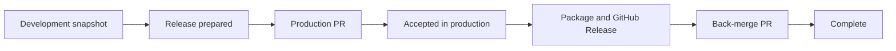

# Configurable Production-First Release Orchestration

- Status: Implemented; live rollout and human UX validation pending
- Date: 2026-09-09
- Last updated: 2026-09-10
- Owners: Copilot maintainers
- Scope: release and hotfix promotion, publication, reconciliation, and cleanup
- Implementation: `df972490` plus the documentation/validation follow-up recorded
  in the companion traceability matrix
- Required review gates: architecture, product UX, security, and operations
- Open validation gates: AC-40 and the human portion of AC-46 must be captured
  from a real GitHub release/hotfix flow on desktop/mobile and light/dark views
- Standard: [Product Specification Standard](./README.md)

## 1. Summary

Copilot shall replace its post-publication, runner-blocking branch merge flow with
an event-driven and resumable release orchestration.

A release branch remains a frozen cut of the configured development branch. It
is prepared and validated on that branch, promoted to the configured production
branch through a pull request, and only then tagged and published. After
publication, the accepted production state is reconciled into the current
development line.

The recommended default is:

```text
development branch
  -> cut release/<version>
  -> prepare, build, validate and smoke-test release/<version>
  -> PR release/<version> -> production branch
  -> GitHub-managed merge after required checks
  -> tag the accepted production commit
  -> publish npm through OIDC
  -> publish the GitHub Release and update the major action tag
  -> reconcile production -> development
  -> close the launcher issue and clean temporary branches
```

Hotfixes use the same production-first promotion rule, but their source is the
latest production tag rather than the development branch.

The behavior is configurable through a bounded set of validated strategies.
Arbitrary source/target graphs and publication before production acceptance are
intentionally not configurable.

## 2. Problem statement

The pre-implementation project workflow documented by this specification:

1. prepares and commits version/build files on the release branch;
2. creates the version tag from the release branch;
3. publishes npm and the GitHub Release;
4. runs a second post-publication branch-completion path; and
5. creates `release -> main` and `release -> development` PRs concurrently.

This has four correctness and reliability problems:

1. The package can be publicly available before the production branch accepts
   the release.
2. Both reconciliation PRs use the same release head SHA. GitHub's Checks API
   lists checks for a Git ref/SHA, so checks associated with different PR bases
   can be observed together or satisfy a same-named required context.
3. The Action waits and polls inside one runner with a finite timeout, despite
   GitHub already owning branch protection, required checks, auto-merge, and
   merge queues.
4. The operation is not resumable. A partial success can leave the package
   published, PRs open or merged, the source branch retained, and the launcher
   issue in an inconsistent state. Re-running may fail because the `deployed`
   label, tag, release, package, or PR already exists.

The v3.3.1 audit demonstrated the shared-SHA and timeout problem: publication
succeeded, both release PRs were created from the same head, the custom waiters
saw checks belonging to both PR contexts, and the workflow timed out before a
third-party check completed.

## 3. Terminology and branch roles

The design uses semantic branch roles. Concrete names continue to come from the
existing configuration.

| Role | Existing input | Default | Meaning |
|---|---|---|---|
| Production | `main-branch` | `master` | The accepted, production-ready source line |
| Development | `development-branch` | `develop` | Integration line for the next release |
| Release source tree | `release-tree` | `release` | Prefix for versioned release branches |
| Hotfix source tree | `hotfix-tree` | `hotfix` | Prefix for emergency production fixes |
| Reconciliation tree | new `reconciliation-tree` | `sync` | Prefix for ephemeral back-merge branches |

### 3.1 Release origin

A release branch MUST be created from the exact commit referenced by
`development-branch` at cut time:

```text
release origin branch = configured development branch
release origin SHA    = development HEAD when the branch is created
release branch        = <release-tree>/<version>
```

Commits added later to development are outside that release. Only commits made
or merged into the release branch after the cut are additional release content.

The release origin branch and SHA MUST be persisted with the launcher issue.
Changing repository Variables after a release starts MUST NOT change its stored
origin, branch roles, version, or orchestration strategy.

### 3.2 Hotfix origin

A hotfix branch MUST continue to be created from the latest accepted production
version tag:

```text
hotfix origin ref = tags/v<current-production-version>
hotfix branch     = <hotfix-tree>/<next-patch-version>
```

### 3.3 Promotion and reconciliation

- Promotion moves a prepared release or hotfix into production.
- Publication creates external artifacts from the accepted production commit.
- Reconciliation carries the accepted production state, or the original source
  branch in canonical Gitflow mode, into the current development line.
- A reconciliation branch is an ephemeral branch created from the current
  reconciliation target and updated with the selected reconciliation source.

## 4. Goals

1. Never publish a new version before its promotion PR is merged into the
   configured production branch.
2. Tag the exact accepted production commit, not the pre-merge release head.
3. Delegate required-check and review enforcement to GitHub.
4. Do not keep a runner alive while waiting for PR checks or human reviews.
5. Resume safely after cancellation, timeout, duplicate events, or manual
   workflow re-runs.
6. Support both production-lineage and canonical Gitflow reconciliation through
   safe, documented strategies.
7. Support direct PRs, ephemeral reconciliation branches, merge queues, and
   create-only/manual merging through bounded configuration.
8. Preserve development commits made after the release cut.
9. Keep release and hotfix behavior consistent where their semantics overlap.
10. Make setup templates, project workflows, Action inputs, persisted issue
    configuration, documentation, and tests agree.
11. Make the launcher issue and managed PRs understandable as a coherent product
    without requiring maintainers to inspect workflow logs.
12. Preserve Clean Architecture boundaries and make them executable through
    dependency and contract tests.

## 5. Non-goals and fixed safety limits

The following behavior is intentionally not configurable:

1. A release cannot use the current development branch as the source of the
   production PR. The source is always the frozen release branch.
2. A release cannot be defined as `release -> current development ->
   production`; that can promote post-cut development work.
3. A new npm version cannot be published before its production PR is merged.
4. A version tag cannot point at a commit other than the accepted production
   commit.
5. Managed promotion cannot bypass branch protection or force-push a protected
   branch.
6. User-provided arbitrary DAGs, arbitrary refs, shell fragments, or JSON merge
   plans are not accepted.
7. Production-lineage reconciliation cannot use squash or rebase merge because
   it must retain production ancestry. Managed promotion and reconciliation use
   merge commits unless a future specification defines equivalent ancestry
   guarantees.
8. The workflow never merges the current development branch into production to
   make a reconciliation PR "up to date".

## 6. User-facing configuration

All values MUST be Action inputs, accepted by local/setup configuration, exposed
as repository Variables by setup, validated at the boundary, documented, and
snapshotted into the launcher issue when orchestration starts.

### 6.1 Strategy inputs

#### `release-reconciliation-strategy`

Default: `production-lineage`

Allowed values:

- `production-lineage`: promote `release -> production`, then reconcile the
  accepted production commit into development.
- `canonical-gitflow`: promote `release -> production`, then reconcile the
  release head into development.
- `manual`: stop after successful publication; do not create a reconciliation
  PR and do not close the issue automatically.

#### `hotfix-reconciliation-strategy`

Default: `production-lineage`

Allowed values:

- `production-lineage`: promote `hotfix -> production`, then reconcile the
  accepted production commit into the selected hotfix back-merge target.
- `canonical-gitflow`: promote `hotfix -> production`, then reconcile the
  hotfix head into the selected hotfix back-merge target.
- `manual`: stop after successful publication.

#### `reconciliation-pr-mode`

Default: `auto`

Allowed values:

- `auto`: use merge queue when the target requires it; otherwise enable native
  auto-merge when the PR is not immediately mergeable; merge immediately only
  when GitHub reports all target requirements satisfied.
- `auto-merge`: use GitHub native auto-merge. Fail with an actionable message if
  repository settings do not support it.
- `merge-queue`: enqueue the PR. Fail if the target or required integrations do
  not support merge queues. Readiness is derived from live classic protection,
  effective rulesets, and required producer contracts; see
  [`merge-queue-readiness.md`](./merge-queue-readiness.md).
- `create-only`: create/reuse the PR and wait for an authorized person or another
  system to merge it.

All PR modes are event-driven and have no runner wait timeout. Checks, reviews,
branch protection, and merge timing remain owned by GitHub.

#### `reconciliation-backmerge-mode`

Default: `auto`

Allowed values:

- `auto`: inspect the target rules and branch relationship. Use `sync-branch`
  when a direct PR cannot safely satisfy an up-to-date requirement; otherwise
  use `direct`.
- `direct`: open the second PR directly from the selected reconciliation source
  to its target.
- `sync-branch`: create a branch from the current target, merge the selected
  reconciliation source into it, and open the PR from that unique head.

The `direct` mode MUST fail with guidance rather than updating production from
development when strict target rules make the direct source out of date.

### 6.2 Hotfix target selection

#### `hotfix-active-release-policy`

Default: `prefer-release`

Allowed values:

- `prefer-release`: if exactly one active release exists, reconcile the hotfix
  into that release; otherwise reconcile into development.
- `development`: always reconcile into the development branch.
- `both`: reconcile sequentially into the active release, when present, and
  development. Each target MUST use a unique reconciliation head when their
  required checks can be target-dependent.

If more than one active release is detected and the policy needs an active
release, orchestration MUST enter `blocked` and request an explicit maintainer
decision. It MUST NOT guess.

### 6.3 Lifecycle and cleanup inputs

#### `reconciliation-tree`

Default: `sync`

The branch prefix used for managed ephemeral branches. The generated name MUST
be deterministic and collision-resistant, for example:

```text
sync/release-3.4.0-to-develop-<operation-id-prefix>
```

#### `reconciliation-cleanup`

Default: `all`

Allowed values:

- `all`: delete the release/hotfix source and all reconciliation branches after
  full completion.
- `source-only`: delete the release/hotfix source and retain reconciliation
  branches.
- `sync-only`: retain the release/hotfix source and delete reconciliation
  branches.
- `none`: retain all branches.

No source branch is deleted before publication and every required reconciliation
target completes.

#### `reconciliation-issue-completion`

Default: `close`

Allowed values:

- `close`: close the launcher issue after the complete configured plan.
- `keep-open`: leave it open and publish a completion comment.

`manual` reconciliation always keeps the issue open until a maintainer explicitly
marks the operation complete.

#### `orchestration-presentation-mode`

Default: `guided`

Allowed values:

- `guided`: show the current phase, completed/pending steps, one concise diagram,
  artifact links, the expected next transition, and any required human action.
- `compact`: show status, current phase, next action, and primary links without a
  diagram or expanded technical context.
- `quiet`: publish only the initial control-center comment, actionable failures,
  requests for human input, and final completion.

Operational facts, failure impact, and required user action are never hidden by
presentation mode.

#### `orchestration-diagrams`

Default: `true`

When enabled in `guided` mode, render a small GitHub-supported Mermaid flow in
the issue control center and managed PR descriptions. Every diagram MUST have an
equivalent textual phase table. Diagrams are never the sole source of status or
instructions.

#### `orchestration-comment-mode`

Default: `update`

Allowed values:

- `update`: maintain one durable issue control-center comment and update it as
  the operation advances.
- `milestones`: update the control center and additionally publish a bounded
  notification for promotion merged, publication completed, reconciliation
  blocked, and orchestration completed.

`milestones` MUST publish at most four additional lifecycle comments for one
operation. Duplicate event delivery cannot create duplicate comments.

### 6.4 Existing configuration retained

The following inputs retain their current meaning:

- `main-branch`
- `development-branch`
- `release-tree`
- `hotfix-tree`
- `release-workflow`
- `hotfix-workflow`
- `issues-locale`, used for the issue control center and issue comments
- `pull-requests-locale`, used for managed PR titles and descriptions

### 6.5 Project publication timing

The active Copilot repository workflow additionally exposes bounded repository
Variables for npm visibility checks:

| Variable | Default | Allowed range |
|---|---:|---:|
| `NPM_VISIBILITY_POLL_INTERVAL_SECONDS` | `20` | 10-60 seconds |
| `NPM_VISIBILITY_TIMEOUT_SECONDS` | `120` | 60-900 seconds |

These are project workflow settings, not generic Action inputs, because the
reusable setup release template does not require npm. Invalid, missing, or
out-of-range values fail validation before publication rather than being passed
to shell arithmetic unchecked.

### 6.6 Invalid combinations

Validation MUST reject at least:

- identical production and development branch names;
- any tree value equal to a protected long-lived branch name;
- empty or unsafe branch prefixes;
- `production-lineage` with a non-ancestry-preserving merge method;
- malformed merge-queue attestations at static input validation; live unknown
  or unsupported producers are rejected by runtime preflight before side
  effects and immediately before enqueue;
- automatic issue closure with `manual` reconciliation;
- `direct` back-merge when GitHub reports that satisfying strict rules would
  require merging development into production;
- unknown enum values, including case variants not explicitly normalized.

## 7. Recommended default flows

### 7.1 Release

```text
develop@D3
  -> create release/3.4.0@D3

develop:       D3---D4---D5
                \
release:         R1---R2---R3
                           |
                           +-- PR release/3.4.0 -> master
                                  |
                                  +-- required checks/reviews
                                  +-- GitHub merge
                                  +-- accepted production SHA P
                                          |
                                          +-- tag v3.4.0 -> P
                                          +-- npm publish from v3.4.0
                                          +-- GitHub Release
                                          +-- update v3
                                          +-- reconcile P -> current develop
```

When `sync-branch` is selected:

```text
sync branch = current develop + merge accepted production SHA P
PR sync branch -> develop
```

This preserves D4 and D5 while adding the release changes and production
lineage. D4 and D5 never enter production.

### 7.2 Hotfix

```text
latest production tag
  -> create hotfix/<next-patch>
  -> prepare and validate
  -> PR hotfix -> production
  -> accepted production SHA P
  -> tag and publish P
  -> reconcile P according to hotfix-active-release-policy
```

## 8. Durable orchestration state

The issue configuration schema MUST be incremented and gain a typed
`deploymentOrchestration` object. Unknown fields and future schema versions MUST
continue to round-trip safely.

Minimum persisted shape:

```json
{
  "schemaVersion": 3,
  "deploymentOrchestration": {
    "operationId": "uuid",
    "kind": "release",
    "version": "3.4.0",
    "phase": "promotion_pr_pending",
    "strategy": "production-lineage",
    "prMode": "auto",
    "backmergeMode": "auto",
    "cleanup": "all",
    "issueCompletion": "close",
    "sourceBranch": "release/3.4.0",
    "sourceSha": "release-head-after-build",
    "originBranch": "develop",
    "originSha": "develop-head-at-cut",
    "productionBranch": "master",
    "developmentBranch": "develop",
    "promotionPullRequest": 123,
    "productionSha": "accepted-merge-commit",
    "tag": "v3.4.0",
    "publicationVerified": false,
    "reconciliationTargets": [
      {
        "targetBranch": "develop",
        "sourceBranch": "master",
        "syncBranch": "sync/release-3.4.0-to-develop-abcd1234",
        "pullRequest": 124,
        "status": "pending"
      }
    ],
    "lastFailure": null
  }
}
```

SHAs, PR numbers, and phase transitions are runtime state. Strategy, branch
roles, and cleanup policy are immutable configuration snapshots for one
operation.

### 8.1 State machine

```text
preparing
  -> promotion_pr_pending
  -> promoted
  -> publishing
  -> published
  -> reconciliation_pending
  -> completed

Any non-terminal phase
  -> blocked

blocked
  -> previous safe phase after explicit correction/retry
```

Each transition MUST be monotonic and compare the stored operation ID and
expected phase before writing. Duplicate or out-of-order events MUST be no-ops
with an observable result.

## 9. Event-driven orchestration

The system MUST NOT wait for PR checks in a long-running release job.

### 9.1 Initial release workflow

The workflow dispatched on the release branch shall:

1. enter the mutation queue;
2. verify the stored release origin and source branch;
3. update version files;
4. build;
5. run release validation and smoke tests;
6. commit generated/version files to the release branch;
7. persist the final release source SHA;
8. create or reuse the promotion PR to production;
9. request the configured GitHub merge behavior; and
10. exit successfully in `promotion_pr_pending` without creating a tag or
    publishing npm.

### 9.2 Promotion PR completion

A dedicated PR completion path shall listen for merged managed PRs. It cannot be
silently excluded by the generic `COPILOT_BOT_LOGIN` guard used for ordinary PR
automation.

Before advancing, it MUST verify:

- the event repository is the expected repository;
- the PR marker and operation ID match durable state;
- head and base branches match the stored plan;
- the PR is closed and merged, not merely closed;
- the reported production merge SHA exists and is reachable from the production
  branch; and
- the release source SHA included by the promotion is the stored prepared SHA.

It then persists `productionSha` and dispatches the publication continuation on
the production ref. The active `release_workflow.yml` and `hotfix_workflow.yml`
gain an internal execution-mode input with a default initial mode and a
continuation mode. A continuation dispatch includes the operation ID and issue
number, but all version, ref, strategy, and SHA facts are reloaded from durable
state instead of trusting dispatch input.

Keeping publication in the same workflow file preserves the npm trusted
publisher identity already bound to `release_workflow.yml`. The continuation
mode skips branch preparation and enters only the verified tag/publication path.

### 9.3 Publication continuation

The publication job shall:

1. create or verify `v<version>` at exactly `productionSha`;
2. check out the immutable tag;
3. install locked dependencies;
4. validate release identity and package contents;
5. run the npm package smoke test;
6. publish through npm trusted publishing/OIDC;
7. poll npm visibility using the bounded project timing configuration;
8. create or verify the GitHub Release;
9. create/update and verify the major action tag;
10. replace `deploy` with `deployed` idempotently after npm and GitHub
    publication are verified; and
11. create or reuse the configured reconciliation PRs.

The npm environment and `id-token: write` permission remain limited to the npm
publication job.

### 9.4 Reconciliation completion

For every configured target, a merged managed PR event advances that target to
`completed`. After every target completes, the orchestrator:

1. marks the operation `completed`;
2. applies the configured cleanup policy;
3. closes or comments on the launcher issue according to configuration; and
4. publishes a summary containing production SHA, version tag, package, release,
   promotion PR, reconciliation PRs, and retained/deleted branches.

### 9.5 Workflow event delivery

Managed PRs MUST be created with the configured PAT or another credential whose
events can start the repository's PR completion workflow. They MUST NOT rely on
events suppressed by GitHub's recursive `GITHUB_TOKEN` protection.

The completion workflow uses the `pull_request: closed` payload only as a wake-up
signal. It checks out a trusted base/production ref and invokes the orchestrator,
which reloads and verifies authoritative PR and issue state. It MUST NOT use
`pull_request_target` to execute code from the PR head.

## 10. Managed PR identity

Every managed PR MUST contain a machine-readable marker that is not used as the
sole authorization mechanism, for example:

```html
<!-- copilot-deployment operation-id="..." phase="promotion" issue="355" -->
```

The operation ID, issue configuration, exact source/base pair, and live GitHub
PR data MUST all agree.

PR creation is idempotent:

1. reuse an open PR with the same valid operation/phase marker;
2. accept an already merged matching PR and advance;
3. block when a matching PR was closed without merge;
4. block when multiple matching PRs are found; and
5. never reuse a PR based only on a title or branch-name substring.

## 11. Native GitHub merge behavior

The application layer shall expose semantic ports for:

- reading target rules/merge capabilities;
- creating/finding managed PRs;
- enabling auto-merge;
- enqueueing a PR;
- reading authoritative PR merge state;
- creating/deleting refs;
- merging a trusted source commit into an ephemeral reconciliation ref; and
- verifying commit reachability.

GitHub GraphQL/REST details remain in provider adapters.

No check-run polling or direct post-check merge adapter is part of this design.
Every mode MUST use GitHub's mergeability and protection decisions instead of
reproducing them from Checks API responses.

Merge queue support MUST be accompanied by a `merge_group` trigger covering
`checks_requested` in every required GitHub Actions workflow. The explicit
filtered form is recommended and equivalent unfiltered GitHub syntax is valid.
Runtime, setup, and doctor share the
fail-closed evidence policy in
[`merge-queue-readiness.md`](./merge-queue-readiness.md): accessible GitHub
Actions producers are verified automatically, while an otherwise-unknown
producer needs an exact reviewed attestation. Known contrary evidence cannot be
overridden.

## 12. Idempotency and recovery rules

### 12.1 Tags

- Missing tag: create it at `productionSha`.
- Existing tag at `productionSha`: treat as complete.
- Existing tag at another SHA: block; never move the immutable version tag.

### 12.2 npm

- Version absent: publish through OIDC.
- Exact version already visible: do not republish; verify package identity and
  continue.
- Registry response ambiguous: retry bounded reads before deciding.
- Published package identity inconsistent with the stored operation: block.

### 12.3 GitHub Release and major action tag

- Reuse an existing release only when its tag matches the operation.
- Updating the moving major tag is allowed only after the immutable version tag
  and published package are verified.
- Verify the final major tag target after update.

### 12.4 Labels and issue closure

- An existing `deployed` label is a fact, not an error.
- A closed launcher issue may be updated with the final summary without failing
  the operation.
- Issue closure is not used as proof that reconciliation completed.

### 12.5 Branches

- Existing expected source/sync branches are reused after verifying their SHAs.
- A name collision with a different operation blocks the run.
- Deleted source branches do not block a retry after all facts needed from them
  have been persisted and verified.

## 13. Failure semantics

Failures before production merge do not create a tag or publish external
artifacts.

Failures after production merge but before publication leave the operation
resumable from `promoted`.

Failures after publication leave the issue open unless configured otherwise,
retain enough state and branches to resume reconciliation, and report that the
artifact is already public.

Closing a promotion PR without merging sets `blocked` and does not publish.
Closing a reconciliation PR without merging sets `blocked` and does not delete
source branches or close the issue.

Every failure comment and Job Summary MUST distinguish:

- promotion failure;
- publication failure;
- reconciliation failure; and
- cleanup/reporting failure after functional completion.

Cleanup/reporting failures MUST NOT falsely mark publication or merges as
failed; they remain retryable post-completion tasks.

## 14. Security requirements

1. npm publication uses OIDC trusted publishing; no npm automation token is
   introduced.
2. The PAT may create PRs, comments, refs, tags, and workflow dispatches only
   through existing scoped repository operations.
3. A privileged continuation MUST NOT check out or execute an arbitrary PR head.
   It checks out the verified production SHA or immutable version tag.
4. Managed events MUST be same-repository events and must pass the identity
   checks in section 10.
5. Auto-merge and merge queue MUST respect branch protection; no admin bypass is
   part of this design.
6. Source branch names, target names, prefixes, operation IDs, and version values
   are validated before reaching GitHub API calls.
7. Secrets and OIDC claims are never persisted in issue configuration, PR
   markers, summaries, logs, or setup Variables.

## 15. Observability

Every invocation shall log and summarize:

- operation ID and kind;
- previous and resulting phase;
- immutable strategy snapshot;
- source/origin/production/development branches and relevant SHAs;
- created or reused PRs;
- selected PR and back-merge modes, including why `auto` selected them;
- tag/package/release verification status;
- pending external action, if any; and
- explicit recovery instructions when blocked.

No invocation should emit repeated PR check polling logs.

## 16. GitHub product experience and UI/UX

The GitHub issue is the product's release control center. Managed PRs are
focused execution surfaces for one transition. Workflow logs and Job Summaries
are technical evidence, not the primary place where a maintainer must discover
what is happening.

### 16.1 Presentation principles

Every issue, PR description, comment, and Job Summary MUST answer, in this
order:

1. What is the current state?
2. What has already completed?
3. What is happening or expected next?
4. Does a person need to do anything?
5. What changed, and where can it be inspected?
6. Where are the technical details if they are needed?

The primary view uses plain product language. Internal use-case names, enum
values, operation IDs, full SHAs, GraphQL terminology, and stack traces belong
in a collapsed technical section or Job Summary.

Success, pending, warning, blocked, and failure states MUST use both an icon and
a textual label. Color or emoji alone never communicates status.

### 16.2 Overall visual model

In guided mode, the issue control center contains a compact diagram equivalent
to the following:



The diagram MUST be generated from fixed, localized node labels. Branch names,
titles, errors, and other untrusted values MUST NOT be interpolated into Mermaid
syntax. The adjacent textual phase table remains the accessible and canonical
status representation.

### 16.3 Issue control center

One durable bot-owned comment is created per orchestration operation and found
through an operation marker. In `update` mode it is edited in place. It is never
recreated because of a retry or duplicate event.

The guided presentation follows this information hierarchy:

```markdown
<!-- copilot-deployment-dashboard operation-id="..." issue="355" -->

# 🚀 Release 3.4.0

> **Current status: waiting for production approval**
>
> No action is required while GitHub checks are running.

## Progress

- [x] Release cut from `develop` at [`abc1234`](...)
- [x] Version files, build, validation, and smoke test
- [ ] Promotion PR [#401](...) into `master`
- [ ] npm package and GitHub Release
- [ ] Reconciliation into `develop`
- [ ] Cleanup and issue completion

## Current transition

| From | To | State |
|---|---|---|
| `release/3.4.0` | `master` | ⏳ Checks and review |

## What happens next

After [PR #401](...) is merged, Copilot will tag the accepted `master` commit,
publish `@vypdev/copilot@3.4.0`, and start development reconciliation.

## Links

[Promotion PR](...) · [Compare changes](...) · [Workflow run](...)

<details>
<summary>Technical details</summary>

Strategy, operation ID, full SHAs, selected merge mode, and verification facts.
</details>
```

The actual renderer MAY use a table instead of a checklist in compact mode, but
MUST preserve the same semantic facts and ordering.

The top status statement MUST distinguish at least:

- preparing release;
- waiting for production checks;
- waiting for production review/manual merge;
- publishing artifacts;
- waiting for registry visibility;
- reconciling development;
- waiting for reconciliation review/manual merge;
- blocked before publication;
- published but reconciliation blocked; and
- completed.

When no action is needed, say so explicitly. When action is needed, the first
visible section after status is `Action required` and contains one primary
instruction with a direct link or copyable command.

### 16.4 Blocked and failure presentation

A blocked presentation uses the following order:

```markdown
# ❌ Release 3.4.0 needs attention

> **Published package:** No
> **Production updated:** No
> **Development synchronized:** No

## What happened

The production PR was closed without merging, so publication was stopped.

## Action required

Reopen [PR #401](...) or run `/copilot retry-release` after correcting the
problem.

## What Copilot protected

No npm version, GitHub Release, or version tag was created.

<details>
<summary>Technical details</summary>
Sanitized diagnostic and correlation data.
</details>
```

For failures after publication, the first block MUST state that the package is
already public and MUST NOT be republished. Errors use the structure `impact ->
cause -> action -> retained state`, not a raw API message.

### 16.5 Promotion PR UX

Promotion PR titles are deterministic and human-readable:

```text
release(3.4.0): promote to master
hotfix(3.4.1): promote to master
```

Its first screen follows this compact visual contract:

```markdown
# 🚀 Promote release 3.4.0 to `master`

> **Purpose:** accept the prepared release in production.
> **After merge:** Copilot will publish npm and the GitHub Release from the
> accepted `master` commit. This PR does not publish before merge.

| Origin | Prepared source | Destination | Publication |
|---|---|---|---|
| `develop@abc1234` | `release/3.4.0@def5678` | `master` | After merge |

## Ready before review

- ✅ Build and release validation
- ✅ Package smoke test
- ⏳ Protected-branch checks and reviews

[Compare release](...) · [Release control center](...)
```

The PR body contains, in this order:

1. a one-sentence purpose and publication consequence;
2. the route from origin snapshot to source branch to production;
3. a release-scope table with version, origin SHA, prepared SHA, target, and
   launcher issue;
4. the validation already completed before PR creation;
5. required GitHub checks/reviews still owned by the target branch;
6. an explicit `After merge` list explaining tag, package, release, major tag,
   and back-merge actions;
7. a compare link and launcher issue link; and
8. collapsed technical metadata and the managed marker.

The promotion PR references the launcher issue but MUST NOT close it. Only final
orchestration completion may close the issue.

### 16.6 Reconciliation PR UX

Reconciliation PR titles are deterministic:

```text
release(3.4.0): reconcile master into develop
hotfix(3.4.1): reconcile master into develop
```

For canonical Gitflow mode, the title and body name the release/hotfix source
instead of production. For an ephemeral branch, the title describes the
semantic source and target, not the generated sync branch name.

Its first screen follows this compact visual contract:

```markdown
# 🔄 Reconcile release 3.4.0 into `develop`

> **Package status: already published.** Merging or closing this PR cannot
> publish `@vypdev/copilot@3.4.0` again.

| Production fact | Development preserved | Completion effect |
|---|---|---|
| `v3.4.0` at `fed9012` | Commits made after the release cut | Close issue and clean branches |

Copilot selected a sync branch because `develop` requires an up-to-date head.

[Compare reconciliation](...) · [Release control center](...)
```

The PR body MUST prominently say:

- whether the package is already public;
- that the PR cannot publish or republish anything;
- which production tag/SHA it reconciles;
- which post-cut development commits are preserved;
- why a sync branch was selected, when applicable;
- what completion and cleanup will happen after merge; and
- what happens if the PR is closed without merge.

### 16.7 Comments and notification budget

- Routine transitions update the issue control center rather than adding new
  comments.
- No comment is produced for each check poll, check-run update, or unchanged
  state observation.
- PRs do not receive duplicate status comments already visible in the issue or
  GitHub merge box.
- `milestones` mode emits only the bounded events defined in section 6.3.
- A human-action request and a recovery confirmation are separate comments only
  when editing the control center would be unlikely to notify the maintainer.
- Every separately published comment has its own stable idempotency marker.

### 16.8 Links and actionable controls

Every visible entity name links to its GitHub or registry page when a URL exists:

- launcher issue;
- source, production, development, and sync branches;
- short commit SHA;
- compare view;
- promotion and reconciliation PRs;
- immutable version tag;
- npm package version;
- GitHub Release;
- major action tag; and
- relevant workflow run.

Link labels describe their destination. Generic labels such as `click here` are
not allowed. Destructive actions are never represented as one-click links in a
comment; they require an authorized command or GitHub confirmation surface.

### 16.9 Labels and lifecycle projection

The orchestration reuses the existing lifecycle, activity, and waiting label
dimensions rather than creating a label for every internal phase:

| Orchestration state | Durable lifecycle | Waiting label |
|---|---|---|
| Preparing/building/publishing | `state:in-progress` | none |
| Promotion or reconciliation PR open | `state:reviewing` | none |
| PR checks complete but manual merge required | `state:ready` | `state:awaiting-maintainer` |
| Blocked | `state:blocked` | `state:awaiting-maintainer` when human action is required |
| Completed | `state:verified` | none |

The `deploy` label means publication was requested. It is replaced idempotently
by `deployed` immediately after npm and GitHub publication are verified. The
issue remains open until reconciliation completes. `deployed` therefore reports
the external deployment fact, while lifecycle labels report orchestration state.

Managed PRs inherit the release or hotfix type label and the relevant durable
lifecycle label when doing so does not conflict with existing PR lifecycle
automation. Labels supplement, but never replace, the PR body status.

### 16.10 Localization

Issue-facing presentation uses `issues-locale`; PR-facing presentation uses
`pull-requests-locale`.

All orchestration-owned headings, status sentences, instructions, table labels,
and failure guidance MUST come from a typed message catalog rather than scattered
string literals. The first implementation MUST provide complete `en-US` and
`es-ES` catalogs. An unsupported locale falls back to `en-US` and emits one
visible, non-blocking warning in technical details.

Branch names, package names, tag names, GitHub check names, and copied provider
facts are not translated.

### 16.11 Accessibility and responsive readability

- Status is never encoded only through color, emoji, a checkbox, or a Mermaid
  node style.
- Images and diagrams have concise alternative text or an adjacent textual
  equivalent.
- Decorative GIFs are omitted from the durable control center by default; they
  may appear only outside the operational status block when existing image
  configuration enables them.
- Primary status and required action are never hidden inside `<details>`.
- Tables use at most four columns and avoid long unbroken full SHAs.
- Full SHAs and verbose provider facts remain available in technical details.
- Headings follow a logical hierarchy without skipped levels.
- The presentation remains readable in GitHub desktop/mobile layouts and light
  and dark themes.
- Generated Markdown is bounded and sanitized through the existing publication
  boundary. Untrusted values cannot create mentions, workflow commands, hidden
  markers, injected Mermaid syntax, or misleading headings.

### 16.12 Job Summary

The Job Summary mirrors the issue's current facts but is optimized for operators:

- result and phase at the top;
- transition performed by this invocation;
- verified input/output SHAs;
- API operations created/reused/skipped;
- publication evidence;
- pending external dependency;
- sanitized failure classification and retryability; and
- a final artifact/PR link table.

It MUST distinguish `waiting externally` from `workflow failure`. A workflow that
successfully creates a pending auto-merge PR finishes green and reports the
pending PR as the next external transition.

## 17. Clean Architecture design

### 17.1 Layer ownership

| Layer | Owns | Must not own |
|---|---|---|
| Domain and pure policies | phases, strategies, invariants, transition decisions, branch-role plans, configuration validation | Octokit types, Actions contexts, Markdown, npm commands, timers |
| Application use cases | orchestration, semantic ports, idempotent transition coordination, typed results | GitHub SDK calls, filesystem/process details, workflow YAML assumptions |
| Data/repository adapters | GitHub/npm data mapping, managed PR/tag/ref persistence, provider error classification | release policy or presentation decisions |
| Infrastructure/composition | Octokit/process implementations, clocks, logging, dependency wiring | business branching rules |
| Action/workflow entrypoints | input adaptation, trusted event facts, workflow outputs, composition selection | duplicated orchestration policy |
| Presentation policies | localized issue/PR/summary view models and safe Markdown rendering | provider mutations or phase transitions |

Dependency direction remains inward. Domain and application production code
cannot import GitHub SDKs, Actions packages, concrete repositories, CLI/process
libraries, or workflow-specific payload types.

### 17.2 Narrow contracts

New orchestration policies MUST receive narrow immutable contracts rather than
the complete `Execution` aggregate. `Execution` is adapted once at the
route/composition boundary.

Recommended application contracts include:

- `DeploymentOperationSnapshot`
- `DeploymentTransitionFacts`
- `DeploymentPlan`
- `DeploymentTransitionDecision`
- `ManagedPullRequestIdentity`
- `PublicationEvidence`
- `ReconciliationTargetState`
- `DeploymentPresentationModel`

Provider DTOs are translated into these contracts at adapter boundaries.

### 17.3 Pure state and presentation policies

The following decisions MUST be pure and exhaustively unit-testable:

- configuration normalization and invalid-combination detection;
- release/hotfix origin and target planning;
- next valid state transition;
- duplicate/out-of-order event handling;
- direct versus sync-branch selection;
- hotfix active-release target selection;
- cleanup eligibility;
- lifecycle/waiting label projection;
- issue control-center view-model construction;
- PR title/body view-model construction; and
- localized Markdown rendering and link selection.

The orchestrator produces structured facts. It does not embed large Markdown
strings in generic `Result.steps`. Presentation policies render structured
deployment results at the publication boundary.

### 17.4 Ports and failures

Ports describe semantic capabilities such as `enableAutoMerge`,
`findManagedPullRequest`, `verifyTagTarget`, or `mergeIntoReconciliationRef`.
They do not expose raw REST/GraphQL request shapes.

Expected operational failures use typed `ApplicationError` categories with
retryability and sanitized diagnostics. Provider exceptions and stack traces do
not cross into domain decisions or user-facing models.

### 17.5 Persistence and concurrency

Durable transitions use compare-before-write semantics on operation ID and
expected phase. Concurrent duplicate invocations may repeat safe reads but only
one can persist a successful phase transition. Side effects are protected by
deterministic identities and postcondition verification.

Persisted orchestration and configuration readers accept only the current
schema. Missing, malformed, or different-version state fails closed instead of
being inferred or transformed by orchestration.

### 17.6 Executable architecture constraints

Architecture tests MUST enforce:

- no domain/application import of `@octokit`, `@actions`, concrete adapters, or
  Node process/filesystem APIs;
- no adapter-to-use-case dependency cycle;
- presentation policies cannot call mutation ports;
- provider DTOs cannot appear in public application port signatures;
- workflow/action entrypoints depend on composition roots rather than construct
  provider clients ad hoc; and
- every new production import resolves and the production dependency graph
  remains acyclic.

## 18. Testing strategy and required quantity

Test quantity is a floor, not a substitute for requirement coverage. This
feature MUST add or materially update at least **72 distinct test cases**. Each
`it`/`test` case counts once; parameterized rows count only when they represent a
distinct input/output behavior.

Minimum distribution:

| Test area | Minimum cases | Required focus |
|---|---:|---|
| Domain/configuration/planning policies | 18 | enum normalization, invalid combinations, release origin, strategy plans, strict-safe selection |
| State machine/idempotent application orchestration | 18 | every transition, duplicate and stale events, cancellation/retry, partial publication |
| GitHub/repository adapters and port contracts | 12 | PR identity, auto-merge, queue, refs, tag target, reachability, provider error mapping |
| Workflow/setup contracts | 8 | phase dispatch, permissions, OIDC environment, PAT event delivery, variables, templates |
| UI/UX, rendering, localization, and sanitization | 10 | all primary states, links, diagrams/fallbacks, en-US/es-ES, bounded comments |
| Integration/replay/security scenarios | 6 | multi-run lifecycle, concurrent delivery, forged events, strict develop, schema rejection |
| **Total** | **72** | Cases cannot be double-counted between rows |

### 18.1 Coverage requirements

The existing global Jest thresholds remain mandatory:

- lines: 90%;
- statements: 90%;
- functions: 88%; and
- branches: 82%.

In addition:

- new pure planning, state-transition, configuration, and presentation policies
  require 100% branch coverage;
- new orchestration use cases require at least 95% line/statement coverage and
  90% branch/function coverage;
- changed modules cannot reduce repository-wide coverage; and
- every MUST requirement has at least one test or an explicit workflow/manual
  verification entry in the traceability matrix.

### 18.2 Required test styles

- Table-driven unit tests cover every enum value and invalid combination.
- Deterministic fakes own clocks, UUIDs, GitHub facts, registry facts, and delays;
  tests do not sleep or call live services.
- Contract tests parse active and setup workflow YAML rather than searching only
  for unstructured text.
- Replay tests invoke the same event multiple times and in reordered sequences.
- Race tests simulate two invocations reading the same phase and verify one
  durable transition/side effect identity.
- Adapter tests cover success, already-exists, not-found, conflict, protection,
  permission, rate-limit, and transient failure mappings.
- Presentation tests assert semantic sections, ordering, stable markers, URLs,
  localization, and sanitization. Snapshot tests are used only for reviewed
  complete Markdown fixtures and are not the sole assertions.

### 18.3 UX fixture matrix

Golden Markdown fixtures MUST include at least:

- release preparing;
- promotion pending with no human action;
- promotion ready for manual merge;
- publishing/registry pending;
- reconciliation pending;
- blocked before publication;
- blocked after publication;
- completed with cleanup;
- promotion PR body; and
- reconciliation PR body.

At least the critical pending, blocked, and completed states are rendered in
both `en-US` and `es-ES`, in guided and compact modes. Quiet-mode suppression and
milestone comment limits receive separate policy tests.

### 18.4 Human GitHub UX acceptance

Before completion, the implementation PR MUST include evidence from a test
repository showing:

- issue control center on desktop and narrow/mobile width;
- promotion and reconciliation PR bodies;
- pending, blocked, published-but-not-reconciled, and completed states;
- light and dark GitHub themes;
- Mermaid enabled and disabled/fallback presentations; and
- en-US and es-ES output.

Reviewers verify that the current state and required next action can be
identified without opening workflow logs and that no primary instruction is
hidden below technical details.

## 19. Documentation and discoverability

Documentation is part of the implementation, not a follow-up.

### 19.1 Required user documentation

Update or add:

- release lifecycle: origin snapshot, preparation, promotion, publication,
  reconciliation, and cleanup;
- hotfix lifecycle and active-release behavior;
- a complete configuration reference with defaults, allowed values, safe limits,
  invalid combinations, and examples;
- setup/upgrade instructions and the exact repository Variables/workflow changes;
- OIDC/trusted publishing prerequisites;
- protected branch, strict check, auto-merge, and merge-queue guidance;
- operator recovery for every blocked/partial-publication phase;
- strict behavior for absent, malformed, and different-version operation state;
- issue/PR UI examples for guided, compact, and quiet modes; and
- a troubleshooting decision tree beginning with the visible orchestration
  phase rather than raw error text.

### 19.2 Documentation information design

Each user-facing page follows progressive disclosure:

1. recommended default and one diagram;
2. normal happy-path steps;
3. configuration choices and when to use them;
4. failure/recovery guidance; and
5. technical/security detail.

Examples use real semantic branch names but clearly state that concrete names
come from configuration. Every diagram has an adjacent textual explanation.
Documentation never describe `release` as originating from production.

### 19.3 Developer documentation

Update the architecture guide with the state machine, dependency boundaries,
ports, persistence schema, event trust model, and presentation boundary. Add a
requirements traceability table mapping:

```text
SDD requirement -> policy/use case/adapter -> automated tests -> user docs
```

The implementation PR description links this SDD and summarizes any accepted
deviation. Deviations require an explicit update to this specification.

### 19.4 Documentation validation

- Register every new MDX route in `docs.json`.
- `validate:documentation`, `validate:docs-page`, link/asset validation, and
  workflow-contract validation MUST pass.
- Examples are copied from or checked against workflow/configuration fixtures so
  documented input names and defaults cannot silently diverge.

## 20. Required code and workflow changes

### 20.1 Domain and configuration

- Add provider-neutral enums and validation policies for every new input.
- Extend `SetupRepositoryConfiguration`, defaults, validation, plan generation,
  and override merging.
- Add Action inputs and `INPUT_KEYS` entries.
- Read the values in GitHub and local configuration builders.
- Add repository Variables to active and setup workflow templates.
- Snapshot effective values into durable issue orchestration state.
- Define schema v3 as the only accepted persisted configuration and operation
  contract; reject every other schema without inference.

### 20.2 Application

- Replace the current two-element merge plan with a typed phase/state policy.
- Add a narrow orchestration context rather than expanding the full `Execution`
  dependency across new policies.
- Add an idempotent `advance deployment orchestration` use case that performs at
  most the safe transitions enabled by verified current facts.
- Separate deployment-label facts, publication facts, reconciliation, issue
  completion, and cleanup so each can be retried independently.

### 20.3 GitHub adapters

- Add managed PR lookup and marker parsing.
- Add native auto-merge and merge-queue capabilities.
- Add target-rule/capability inspection.
- Add tag-at-SHA and reachability verification.
- Add reconciliation ref creation and trusted server-side merge support.
- Keep provider response types outside the application layer.

### 20.4 Workflows

- Change the active project release workflow and setup template to prepare and
  promote before tagging/publishing.
- Make the hotfix workflow follow the same production-first phase model.
- Add a dedicated managed-PR completion path that can process bot-authored PRs
  without enabling generic bot recursion.
- Add `merge_group` support only when merge-queue mode is supported by all
  required workflows.
- Keep project-specific npm publication in the active project workflow; the
  reusable setup template retains generic deployment extension points.

### 20.5 Presentation

- Add typed deployment view models separate from orchestration results and
  provider DTOs.
- Add a stable control-center marker and an idempotent find-or-update comment
  port; never identify the dashboard from mutable prose.
- Add safe localized renderers for the issue control center, promotion PR,
  reconciliation PR, milestone comment, failure guidance, and Job Summary.
- Add fixed-label Mermaid renderers with an adjacent textual phase table and a
  configuration-controlled fallback.
- Build every URL from verified repository entities and sanitize all untrusted
  values before Markdown publication.
- Keep generic `Result.steps` for short generic feedback only; deployment
  orchestration uses its dedicated structured presentation boundary.

### 20.6 Documentation

- Correct the existing statement that release branches are created from main.
- Document release origin as a development snapshot and hotfix origin as a
  production tag.
- Document every strategy, default, invalid combination, state, recovery path,
  and strict-branch caveat.
- Update release, hotfix, deployment, setup, configuration, and troubleshooting
  pages.

### 20.7 Generated artifacts

- Do not edit `build/` manually.
- Rebuild the Action and CLI bundles after source and workflow-contract tests
  pass.
- Run `graphify update .` after implementation.

## 21. Version boundary, rollout, and rollback

1. There is no compatibility window or alternate deployment implementation.
2. An issue without a valid schema-v3 orchestration block is not resumable and
   MUST fail with instructions to inspect external artifacts before starting a
   fresh operation.
3. Different-version configuration and operation payloads are rejected; fields
   are neither inferred nor silently preserved.
4. Setup dry-run shows the complete Variables and workflow changes before
   provisioning.
5. Rollout requires the shared continuation and every enabled publisher on the
   default branch before the first operation starts.
6. Rollback restores one complete known-good bundle of Action code, setup
   workflows, active workflows, and current-schema state contracts. It never
   re-enables a removed deployment path.

## 22. Acceptance scenarios

The implementation is not complete until deterministic automated tests, or the
explicitly identified human UX evidence where automation cannot establish
readability, cover at least the following scenarios.

1. A release is cut from the exact current development SHA and that SHA is
   persisted.
2. Development advances after the cut; those commits never appear in the
   production promotion diff.
3. Release-only version, build, changelog, and fix commits reach production.
4. No tag, npm publication, GitHub Release, or major tag update occurs before the
   promotion PR merges.
5. The immutable tag points at the accepted production merge SHA.
6. A required check remains pending longer than ten minutes; the original
   workflow has already exited and no timeout failure occurs.
7. Two PRs would otherwise share a release SHA; sync-branch mode generates a
   unique reconciliation SHA and observes only its own target validation.
8. Development is strict and has advanced; auto back-merge selects a sync branch
   without merging development into production.
9. Development is loose and compatible; auto back-merge may select a direct PR.
10. A promotion PR is manually merged; the event resumes publication.
11. A promotion PR is closed unmerged; publication does not occur and the issue
    reports `blocked`.
12. A reconciliation PR is closed unmerged; published artifacts remain valid,
    source branches are retained, and retry is possible.
13. The same merged event is delivered twice; the second delivery is a no-op.
14. A workflow is canceled between tag creation and npm publish; retry verifies
    the tag and resumes.
15. npm already contains the exact version; retry does not attempt another
    publish.
16. An existing version tag points to another SHA; orchestration blocks.
17. The GitHub Release already exists for the correct tag; it is verified/reused.
18. The `deployed` label already exists; retry continues rather than failing.
19. Repository Variables change mid-release; the stored release strategy and
    branch roles remain unchanged.
20. `canonical-gitflow` reconciles the prepared release head, not current
    development, into development.
21. `production-lineage` reconciles the accepted production commit and preserves
    its ancestry.
22. An active release exists during a hotfix; each active-release policy produces
    its documented target plan.
23. Multiple active releases with `prefer-release` block for a decision.
24. `manual` publishes successfully, creates no reconciliation PR, and leaves the
    issue open.
25. Every cleanup and issue-completion mode follows its configuration.
26. Bot-authored managed PR events advance the operation while ordinary
    bot-authored PR automation remains suppressed.
27. A forged marker, wrong operation ID, wrong head/base, fork PR, or stale SHA
    cannot advance or publish.
28. Setup validation rejects all invalid combinations from section 6.6.
29. Workflow contract tests verify OIDC permissions and npm environment scoping.
30. Architecture tests confirm that GitHub SDK types do not enter application or
    domain policies.
31. One operation creates exactly one marked issue control center; retries,
    duplicate events, and reordered events update it without duplicating it.
32. Guided, compact, and quiet presentation modes expose their documented
    information and never suppress an actionable failure.
33. Guided mode renders a fixed-label Mermaid diagram and an equivalent textual
    phase representation; untrusted content cannot alter either structure.
34. All primary pending, blocked, partially complete, and complete states render
    correctly in `en-US` and `es-ES`; an unsupported locale safely falls back.
35. Promotion and reconciliation PRs use deterministic titles and ordered bodies
    that explain origin, destination, publication consequence, and next action.
36. A blocked-before-publication view and a published-but-not-reconciled view
    state the production, package, and development facts without ambiguity.
37. Every available issue, PR, compare, commit, tag, package, release, branch,
    and workflow entity has a descriptive verified link.
38. `deploy` changes to `deployed` immediately after publication verification,
    while lifecycle labels continue to show reconciliation as pending.
39. Check updates and unchanged external state create no comment spam; milestone
    mode never exceeds its configured four additional lifecycle comments.
40. Manual UX evidence verifies desktop, narrow/mobile, light-theme, dark-theme,
    Mermaid, and textual-fallback readability.
41. Malicious branch names, titles, errors, provider facts, or configuration
    cannot inject mentions, workflow commands, headings, markers, or Mermaid.
42. Job Summary distinguishes a successful wait on an external PR from a failed
    workflow and links to the pending transition.
43. Documentation routes, links, examples, defaults, and configuration names are
    checked against implementation fixtures and pass all documentation validators.
44. Architecture tests enforce the dependency direction, provider-neutral ports,
    acyclic production imports, and mutation-free presentation policies.
45. The feature adds or materially updates at least 72 distinct cases with the
    distribution and coverage floors from section 18 and a complete traceability
    matrix.
46. In a ten-second comprehension review, a maintainer unfamiliar with the run
    can identify the operation kind, current phase, published/not-published fact,
    branch transition, and whether human action is required without opening logs.

## 23. Implementation sequence

1. Add configuration enums, defaults, validation, Action inputs, setup Variables,
   typed localization catalogs, and documentation stubs.
2. Define narrow domain/application/presentation contracts and add executable
   dependency-boundary tests before provider implementation.
3. Add strict schema-v3 durable orchestration state and rejection tests.
4. Add pure planning, transition, lifecycle-label, and presentation-view-model
   policies with exhaustive table-driven tests.
5. Add managed PR identity and idempotent lookup.
6. Add native auto-merge, merge queue, target-rule inspection, and tag-at-SHA
   ports/adapters.
7. Implement the idempotent issue control center, promotion/reconciliation PR
   renderers, safe links, diagrams/fallbacks, and Job Summary.
8. Implement promotion creation without publication and convert release/hotfix
   workflows to the new first phase.
9. Implement verified merged-PR continuation and production-SHA persistence.
10. Move tag/npm/GitHub Release/major-tag publication behind production merge
    and project `deploy`/`deployed` labels from verified facts.
11. Implement direct and sync-branch reconciliation.
12. Implement hotfix active-release target policies.
13. Implement final cleanup, issue completion, bounded notifications, and
    recovery commands.
14. Complete the 72-case minimum, UX fixture matrix, race/replay tests, and
    requirement traceability matrix.
15. Update active workflows, setup templates, user/developer docs, workflow
    contracts, and all generated bundles.
16. Capture the human GitHub UX evidence required by section 18.4.
17. Run unit, integration, architecture, workflow-contract, documentation, lint,
    build, coverage, and Graphify update checks.

## 24. Definition of done

- Every functional and safety requirement in this specification is implemented.
- All automatable acceptance scenarios have deterministic coverage; human-only
  readability scenarios have the reviewed evidence required by section 18.4.
- The active project release path publishes only from a tag on the accepted
  production commit.
- No default release/hotfix path polls PR checks inside a runner.
- A canceled or duplicated run can resume without duplicate tags, packages,
  releases, PRs, comments, labels, or merges.
- Release origin and strategy are visible and immutable for the duration of an
  operation.
- Default setup produces the recommended production-lineage, auto PR, automatic
  strict-safe back-merge behavior.
- Documentation and runtime behavior agree about release and hotfix origins.
- Clean Architecture boundaries are enforced by automated dependency and port
  contract tests, not only described in documentation.
- At least 72 distinct feature cases and every section 18 coverage floor pass;
  every MUST requirement is represented in the traceability matrix.
- The issue control center and both managed PR types satisfy the semantic order,
  direct-link, accessibility, responsive, localization, sanitization, and
  comment-budget requirements from section 16.
- Reviewed fixtures cover every primary state in guided and compact modes, plus
  quiet-mode suppression and both `en-US` and `es-ES`.
- The implementation PR contains desktop/mobile and light/dark UX evidence, and
  reviewers can identify status, publication fact, next transition, and required
  action without inspecting workflow logs.
- User, setup, recovery, architecture, and troubleshooting documentation passes
  route/link/example validation and is linked from the implementation PR.

## 25. External references

- [A successful Git branching model](https://nvie.com/posts/a-successful-git-branching-model/)
  defines release branches from development, production-first release finishing,
  and the active-release exception for hotfix back-merges.
- [Automatically merging a pull request](https://docs.github.com/en/pull-requests/how-tos/merge-and-close-pull-requests/automatically-merging-a-pull-request)
  defines GitHub-native auto-merge behavior after required reviews and checks.
- [About protected branches](https://docs.github.com/en/repositories/configuring-branches-and-merges-in-your-repository/managing-protected-branches/about-protected-branches)
  defines strict versus loose required status checks.
- [Managing a merge queue](https://docs.github.com/en/repositories/configuring-branches-and-merges-in-your-repository/configuring-pull-request-merges/managing-a-merge-queue)
  defines temporary merge groups and the required `merge_group` workflow event.
- [REST API endpoints for check runs](https://docs.github.com/en/rest/checks/runs?apiVersion=2022-11-28)
  documents that check runs are listed for a Git reference rather than a unique
  PR/base pair.
