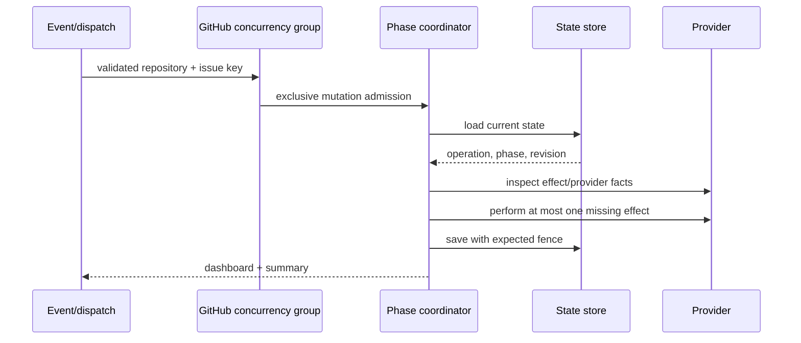

# Deployment Concurrency and State Fencing

- Status: Proposed — ready for implementation
- Date: 2026-09-11
- Last updated: 2026-09-12
- Catalog capability ID: `release-orchestration`
- Last verified: 2026-09-11 at `2fec5c24a80135dd0611d3bc37e7dc3a8ab1b41a`
- Owners: Copilot maintainers and release operators
- Scope: establish one cross-workflow deployment mutex, monotonic durable state,
  idempotent side effects, and focused phase/adaptor ownership for release and
  hotfix orchestration
- Related issues/PRs: none recorded
- Required review gates: product UX, architecture, testing, documentation,
  security/operations, live workflow evidence
- Open decisions blocking readiness: none

## 1. Executive summary

Every release, hotfix, and managed pull-request continuation for the same
launcher issue MUST enter one GitHub Actions concurrency group before receiving
mutation authority. GitHub Actions is the authoritative mutex; the application
then reloads versioned durable state and verifies operation, phase, revision,
and provider facts as a defensive fence.

The design deliberately does not claim that an issue-body read/compare/write is
atomic. Workflow serialization prevents two supported mutation owners from
running together, while monotonic revision and idempotent provider checks make
cancellation, replay, and stale delivery converge safely.

```text
release/hotfix dispatch ----\
                            shared operation group -> reload/fence -> one phase -> persist -> present
managed PR close -> resolve /
```

## 2. Problem, current behavior, and evidence

### 2.1 Problem

The current application loads and compares a deployment checkpoint before
saving issue state, but two invocations can both compare successfully before
either writes. The release/hotfix workflows use a generic polling queue gate,
while the managed-PR workflow groups by PR number rather than launcher issue.
Those mechanisms do not prove exclusive ownership of one deployment operation.

### 2.2 Current behavior

1. Release and hotfix workflow inputs accept a launcher `issue`, defaulting to
   `-1`, and begin with a `queue-gate` job.
2. Managed PR continuation uses a workflow-level group containing repository
   full name and PR number.
3. `DeploymentStateStorePort.save` returns `void`; the use case performs
   load/compare/write with an in-memory checkpoint containing operation and phase
   but no revision.
4. Local action composition can dispatch the deployment single action without a
   workflow concurrency guarantee.
5. One large use case and one broad GitHub repository adapter own phase policy,
   state, rules, PRs, Git, publication, and presentation concerns.

### 2.3 Evidence

- Workflows: `.github/workflows/release_workflow.yml`,
  `.github/workflows/hotfix_workflow.yml`, and
  `.github/workflows/copilot_deployment_orchestration.yml`, plus matching
  `setup/workflows` templates.
- Code: `deployment_orchestration_use_case.ts`,
  `deployment_orchestration_ports.ts`, `deployment_operation.ts`, and the
  catalogued GitHub deployment adapter.
- External source: GitHub Actions supports repository-wide same-key concurrency,
  job keys may use `needs`, `queue: max` retains up to 100 waiting runs, and
  waiting order is not a business-order guarantee.
- External limitation: GitHub REST conditional GET support does not establish
  atomic conditional `PATCH` for issue-body state.

### 2.4 Retrospective classification

Not applicable. This is prospective; the two configurable release orchestration
SDDs remain the as-built product baseline and traceability record.

## 3. Actors, surfaces, and terminology

| Actor | Goal | Entry point | Visible surfaces |
|---|---|---|---|
| Release operator | advance one durable release/hotfix safely | launcher issue/workflow dispatch | issue dashboard, workflow, release |
| Approver | merge a managed promotion/reconciliation PR | pull request | PR and launcher issue |
| Maintainer | retry/cancel without duplicating effects | workflow UI or launcher issue | Job Summary and dashboard |
| Copilot | own exactly one transition at a time | serialized mutation job | provider state and issue snapshot |

An `operation` is the release/hotfix identified by one immutable operation ID
and launcher issue. A `revision` is the monotonic version of its snapshot. A
`fence` is the required `(operationId, phase, revision)` tuple. An `effect
receipt` is provider evidence that an irreversible action already completed.

## 4. Goals, non-goals, and fixed invariants

### 4.1 Goals

1. Admit at most one supported mutation owner per repository and launcher issue.
2. Reject or no-op stale, duplicate, malformed, and out-of-order invocations.
3. Resume after cancellation without duplicating any external effect.
4. Split phase decisions, provider normalization, state, and presentation into
   focused owners with explicit ports.
5. Keep active workflows and installed setup templates structurally identical.

### 4.2 Non-goals

1. The issue body is not upgraded into a general transactional database.
2. FIFO queue order is not product ordering or transition authority.
3. This work does not permit local/direct deployment mutation.
4. It does not add a dynamic phase-handler registry or universal GitHub client.

### 4.3 Fixed product and safety invariants

1. No mutation occurs without a positive launcher issue, valid operation ID,
   supported state version, acquired shared group, and fresh fence.
2. Every mutation path uses the same group expression and `queue: max`; none
   cancels an in-progress owner.
3. An event is only a wake-up signal. Durable state and current provider facts
   decide the next transition after admission.
4. A revision increases exactly once for each successfully persisted snapshot
   and never decreases or wraps.
5. Unknown schema, malformed state, conflicting operation identity, or unverifiable
   irreversible effect fails closed.
6. Safety limits, group format, queue mode, fence fields, and idempotency checks
   are not configurable.
7. No state/config compatibility reader, migration handler, dual schema, or
   fallback writer exists because there are no deployed operations to preserve.

## 5. Current versus proposed product journey

| Stage | Current | Proposed | User/operator effect |
|---|---|---|---|
| Admission | generic queue or PR-specific group | one issue-scoped group | one mutation owner |
| State | operation+phase compare | versioned revision fence | stale writes cannot win |
| Transition | large coordinator performs policy | one pure phase handler | focused review/retry |
| Effect | retry behavior varies | explicit receipt/check per effect | cancellation converges |
| Recovery | inspect logs | dashboard names retained facts/action | safe operator retry |



Text equivalent: an event joins the shared group; after exclusive admission the
coordinator reloads state, inspects provider evidence, performs only a missing
effect, persists with the prior fence, and publishes the resulting state.

## 6. Functional behavior and state model

### 6.1 Exact workflow admission contract

Release and hotfix workflows declare this workflow-level block:

```yaml
concurrency:
  group: copilot-deployment-${{ github.repository_id }}-${{ inputs.issue }}
  cancel-in-progress: false
  queue: max
```

Their `issue` input remains required but loses the `-1` default. A first
validation job checks positive safe integer, operation ID/mode requirements,
version, title, and changelog. All later jobs require it; no write permission,
checkout credential, OIDC token, or secret is available before validation.
The obsolete `queue-gate` job is removed from release and hotfix workflows.

Managed-PR continuation has two jobs:

1. `resolve-operation` has only `contents: read`, `issues: read`, and
   `pull-requests: read`. It accepts only a same-repository closed PR, parses the
   bounded marker, validates positive issue and operation ID, reads the launcher
   issue, and proves the PR marker matches its durable operation.
2. `mutate` needs the resolver and declares job-level concurrency with group
   `copilot-deployment-${{ github.repository_id }}-${{ needs.resolve-operation.outputs.issue }}`,
   `cancel-in-progress: false`, and `queue: max`. Only this job receives issue
   write, Actions write, deployment credentials, or trusted base checkout.

Every setup template uses the same structure. YAML contract tests normalize
expressions and compare the three mutation routes; string grep is insufficient.
Within a release/hotfix run, the job DAG MUST NOT allow two mutation jobs for the
operation to overlap.

GitHub may reject a run beyond the 100-waiter queue. Rejection performs no
mutation. The launcher dashboard's standard recovery action is **Retry current
deployment phase**; retry reloads durable state and does not replay the event as
authority. No product promise depends on queue order.

### 6.2 Initial durable state schema

The only supported `deploymentOrchestration` state shape is:

```text
stateVersion: 1
revision: non-negative safe integer
operationId: immutable validated identifier
phase: existing DeploymentPhase
...versioned operation facts defined by this SDD
```

New operations start with state version 1 and revision 1 on their first save.
Each subsequent save requires expected current revision `n` and writes `n + 1`.
A missing/unknown version, absent revision on a stored operation, partial fields,
negative/unsafe revision, or any previous unversioned shape is invalid and is
never translated or rewritten. Since no real operation exists, recovery is to
discard the unused invalid launcher/state and start a new operation.

### 6.3 State-store contract and fence outcomes

`DeploymentStateStorePort` becomes credential-bound at composition. Commands do
not carry tokens. `load(target)` returns `absent`, `current`, `unsupported`, or
`invalid`. `save` requires repository/issue, expected operation ID, expected
phase, expected revision, and proposed state, then rereads before write and
returns one of:

| Outcome | Meaning | Application behavior |
|---|---|---|
| `saved` | exact fence matched; revision advanced | continue/present success |
| `already-applied` | proposed semantic state is already durable | duplicate no-op success |
| `stale` | same operation has later revision/phase | no-op success; reload/present current state |
| `missing` | expected operation disappeared | block, no write/effect |
| `conflict` | operation ID differs | block as ownership conflict |
| `invalid` | schema/revision/state malformed | block as non-retryable |

The store's reread is defensive, not advertised as atomic CAS. Exclusive
workflow admission and prohibition of alternate writers provide authority.

### 6.4 Pre-effect and post-effect protocol

For each phase handler:

1. Reload and validate the fence after admission.
2. Inspect the authoritative provider receipt.
3. If already complete and consistent, derive/persist the next state without
   repeating the effect.
4. If absent, persist a phase that names the intended effect when the existing
   state machine requires it, then execute exactly one effect.
5. Reinspect provider state and persist the confirmed receipt/revision.
6. If execution outcome is unknown, block as `unverifiable`; never retry the
   effect until inspection can prove absence or completion.

### 6.5 Idempotency ledger

| Effect | Stable key | Already-complete proof | Conflict behavior |
|---|---|---|---|
| promotion PR | operation marker + issue + head/base | one matching PR with persisted head SHA | multiple/mismatched PRs block |
| merge/queue promotion | PR node/number + expected head SHA | merged commit reachable from production, or exact PR queued | different head/base blocks |
| create sync branch | derived branch + source SHA | ref exists at exact SHA | different SHA blocks |
| reconciliation PR | operation marker + target + source SHA | one exact PR/merge receipt | ambiguity blocks |
| direct reconciliation | target + source SHA | source reachable from target | unverifiable ancestry blocks |
| Git tag | tag + production SHA | annotated/lightweight target resolves to exact SHA | different target blocks |
| GitHub Release | tag + operation ID marker | release exists for exact tag/marker | mismatch blocks |
| npm publication | package + version + registry integrity | registry reports expected version and build integrity | differing artifact blocks |
| branch cleanup | validated operation-owned branch | branch absent | non-owned/different branch blocks |
| dashboard/milestone | durable marker | existing item with exact marker | update exact item; duplicates reconciled visibly |
| issue completion/labels | issue + projected final state | desired state already present | recompute from durable state |

Provider checks are bounded and may retry only transient read failures. A write
timeout is `unverifiable`, not automatically absent.

### 6.6 Phase ownership and state machine

The coordinator validates the mode, selects one handler, and sequences common
fence/presentation behavior. Handlers are fixed compile-time collaborators:
`preparePromotion`, `acceptPromotion`, `beginPublication`, `confirmPublication`,
`planReconciliation`, `acceptReconciliation`, `completeOperation`, and
`recordFailure`. Each handler receives `DeploymentOperationContext`, semantic
ports, and current snapshot; none receives `Execution`.

Existing phases and valid transitions remain. Duplicate next-phase events are
no-op success; earlier revision/phase events are stale no-op; skipped transitions
and identity conflicts block. Cancellation before an effect retains prior state;
cancellation after an effect is unknown until receipt inspection.

## 7. User-facing configuration

Existing reconciliation/presentation configuration remains unchanged and is
snapshotted in the operation. The following are intentionally not configurable:
concurrency group format, queue mode/capacity behavior, state version/revision,
fence validation, idempotency proofs, mutation entrypoints, and maximum one phase
handler per invocation.

`issue` is a required positive workflow input. `operation-id` is empty only for
`prepare`; every continuation/publication/failure mode requires exact match.
Invalid cross-field combinations fail in the validation job before credentials
or mutation authority are exposed.

## 8. Clean Architecture design

### 8.1 Responsibilities and dependency direction

| Layer/boundary | Owns | Must not own/import |
|---|---|---|
| Domain | state schema, transitions, fence/idempotency decisions | GitHub DTOs, `Execution` |
| Application | admission assumptions, phase handlers, semantic ports | Octokit, YAML, npm client |
| Adapters | managed PR, Git/ref, rules/queue, state, publication operations | transition/product presentation policy |
| Infrastructure | auth-bound adapters and fixed handler composition | phase decisions |
| Entrypoints | trusted input/resolver and workflow dispatch | direct provider mutation |
| Presentation | dashboard, milestone, Job Summary view models | state transition/mutation |

### 8.2 Narrow provider ownership

Use separate ports/adapters for managed PRs; Git refs/ancestry; target rules and
merge queue; issue state; publication receipts; and dashboard/labels. Shared
Octokit transport/auth/pagination helpers are internal composition details, not
a broad application repository. Ruleset, classic protection, required-check,
merge-queue, and producer normalization are separate pure policies.

### 8.3 Executable architecture constraints

1. YAML AST tests prove exact group, queue, cancellation, permissions, resolver,
   validation dependency, and active/template parity.
2. Import tests prohibit deployment mutation adapters from local action/CLI
   composition and prohibit `Execution` in phase handlers.
3. Only the three catalogued workflows may compose deployment command ports.
4. No pure provider-normalization function exceeds cyclomatic complexity 15;
   any change above it fails CI rather than accepting an undocumented waiver.
5. State schema fixtures cover absent, current v1, missing/unversioned,
   malformed, and future versions; only current v1 is accepted.

## 9. UI/UX and content contract

The launcher issue is the control center. It shows phase, completed irreversible
facts, next transition, one action, operation/revision, and links. It never calls
queue position authoritative.

```markdown
<!-- copilot-deployment-dashboard operation-id="release-01K4..." issue="355" -->
# 🚀 Release 3.4.0

> **Current status:** Waiting to continue after promotion PR #412 merged.
>
> **Action required:** No action required. A serialized continuation is queued.

## Retained progress
- [x] Version files prepared at `9ad6…`
- [x] Promotion PR #412 merged into `main`
- [ ] Package and GitHub Release publication verified

## What happens next
The next admitted run reloads revision 8 and verifies publication receipts.

[Open workflow run](...) · [Open promotion PR](...)
```

Blocked state: **No new mutation was attempted because revision 9 superseded
this run. Retry current deployment phase from issue #355. Existing tag and
release state were preserved.** Partial state names each verified artifact and
marks an unknown write outcome as requiring inspection. Completed state links
to tag, release, package, and reconciliation PRs. At most one dashboard is
updated per transition plus one milestone comment when configured.

## 10. Failure, recovery, and cleanup

| Failure/partial state | User impact | Retained facts | Automatic retry | Required action | Cleanup |
|---|---|---|---|---|---|
| invalid resolver/input | no mutation job | none/new event facts | no | fix marker/input | none |
| queue capacity rejection | event run canceled | durable operation | no | retry from launcher | none |
| stale/later revision | current run no-ops | newer durable snapshot | no | none unless still blocked | none |
| state identity/schema conflict | operation blocks | raw issue body unchanged | no | discard unused launcher and start a new operation | none |
| read failure before effect | no effect | current state | bounded adapter retry | retry phase | none |
| write outcome unknown | operation unverifiable | prior state plus known attempt | no blind retry | inspect receipt | effect-specific |
| effect already complete | state catches up | verified receipt | automatic convergence | none | none |
| cleanup failure | deployment remains successful/partial | all published facts | bounded retry | retry cleanup only | never delete unproven refs |

## 11. Security, permissions, and privacy

1. Resolver jobs never receive PAT, write permission, OIDC, or untrusted checkout.
2. Mutation jobs checkout only the trusted base/ref and use least phase-specific
   permissions.
3. Group components are trusted numeric repository/issue IDs, not title, branch,
   comment, or arbitrary marker text.
4. Operation markers are bounded and validated against durable state after the
   mutex; marker possession is not authorization.
5. Local/API callers may inspect or dispatch a trusted workflow but cannot
   instantiate state/provider command adapters.
6. Logs and dashboards follow the semantic-error redaction contract.

## 12. Observability and operational UX

Job Summary records group, wait/acquire time, operation, state version, prior
and resulting revision/phase, handler, effect receipt status, and semantic
outcome. It does not log token, issue body, changelog, provider response, or full
command. Metrics count waited, saved, duplicate, stale, blocked, unverifiable,
and queue-recovery invocations. A queued run is pending external admission, not
a failed deployment.

## 13. Compatibility, migration, rollout, and rollback

1. Compatibility and state migration are not applicable: there are no installed
   users or real in-flight deployment operations.
2. Update state contracts, all three active workflows, setup templates, docs,
   tests, and bundled artifacts atomically. Only state version 1 from this SDD
   is readable or writable after merge.
3. Do not implement an unversioned reader, state converter, dual writer,
   feature flag, or old/new workflow coexistence path. Unsupported state blocks
   and an unused launcher is recreated cleanly.
4. The first controlled live validation starts a fresh operation after the full
   cutover. No fixture from the prior in-repository shape is seeded as user data.
5. Before first real use, rollback is a complete revert. After a real effect or
   version-1 state exists, pause deployment and fix forward; never run older
   code against it or add a reverse translator. Completed effects are not rewound.

## 14. Testing strategy and numeric budget

This SDD owns at least **28 distinct cases**.

| Area | Minimum cases | Required risks |
|---|---:|---|
| Domain/schema/fence | 5 | absent/current/unversioned/future, revision, transition outcomes |
| State/race/idempotency | 8 | simultaneous barrier, replay, stale, cancellation, unknown effect |
| Application handlers | 4 | prepare, publish, reconcile, block/complete |
| Provider adapters | 4 | receipts, conflicts, status/error mapping |
| Workflow/setup contracts | 4 | three shared routes, permissions, queue, parity |
| UX/observability | 1 | partial/blocked semantic dashboard matrix |
| Integration/security | 2 | cross-workflow race and local-bypass prohibition |
| **Total** | **28** | no double counting |

Transition/fence/idempotency policies require 100% enumerated branch coverage.
Changed orchestration modules require 95% lines/statements and 90%
branches/functions; repository thresholds remain 90/90/88/82. Tests use
deterministic barriers and provider fakes, never sleeps or live publication.
Workflow tests parse YAML and expression ASTs.

Human evidence: one controlled release/managed-PR pair must visibly share a
group and serialize; cancel once after a reversible checkpoint, retry, and
attach the converged dashboard/Job Summary without publishing a real package.

## 15. Documentation and discoverability

Update `docs/issues/deployment-orchestration.mdx`, release/hotfix setup docs,
`docs/security-operations/operations/troubleshooting.mdx`, architecture/dependency
rules, and the release SDD/traceability matrix. Document queue overflow recovery,
clean initialization, unsupported-state rejection, stale/no-op, unknown effect,
and fresh-operation recovery. Recommended
normal flow appears before internals.

## 16. Acceptance scenarios

1. Release, hotfix, and managed-PR mutation for one issue resolve the identical
   concurrency group and never overlap.
2. A malformed/negative issue fails before any credential or write permission is used.
3. Two invocations released from one deterministic barrier yield one effect
   owner; the waiter reloads and no-ops or advances from current state.
4. A fresh operation persists state version 1/revision 1 before advancing.
5. A missing, unversioned, future, or malformed state blocks without rewriting the issue.
6. A stale revision cannot write or mutate; an already-applied state is success.
7. Cancellation after an effect causes receipt inspection and convergence, not duplication.
8. Every idempotency-ledger conflict blocks with retained-state guidance.
9. A direct local deployment attempt has no command port and fails before mutation.
10. Active and setup workflows have identical concurrency and validation semantics.
11. Queue order changes do not alter the phase selected from durable state.
12. Partial and complete views name true provider facts and direct links.

## 17. Requirements traceability

| Requirement | Owner | Evidence | Documentation |
|---|---|---|---|
| shared mutex | workflow resolver/admission | YAML and cross-workflow barrier tests | deployment guide |
| version/revision fence | domain/state port | schema, stale, concurrent save tests | initialization/recovery |
| effect convergence | phase handlers/provider ports | idempotency ledger tests | operations |
| no bypass | composition/import policy | architecture test | dependency rules |
| focused adapters | normalization policies/adapters | complexity and contract tests | architecture |
| truthful UX | presentation policy | semantic view fixtures/human review | deployment guide |

## 18. Implementation sequence

1. Add failing YAML, state-version, fence, and deterministic race tests.
2. Implement the sole version-1 domain/state contract and rejection of every
   unversioned or unsupported shape.
3. Replace the three admission paths and remove their obsolete queue gates.
4. Implement receipt checks and one phase handler at a time, preserving output
   with characterization tests.
5. Split provider adapters/pure normalization and prohibit local command wiring.
6. Update presentation, documentation, traceability, setup templates, generated
   bundles, and collect controlled live queue evidence.

## 19. Definition of Done

- [ ] All supported mutation paths use the exact shared group with `queue: max`.
- [ ] No write authority exists before validation/admission or in local composition.
- [ ] Sole version-1 state, unsupported-shape rejection, revision fences, and all outcomes pass.
- [ ] Every irreversible effect implements its ledger proof and unknown-outcome behavior.
- [ ] Deterministic simultaneous, stale, replay, cancellation, and recovery tests converge.
- [ ] Phase handlers and narrow adapters meet architecture/complexity thresholds.
- [ ] At least 28 distinct cases and all repository gates pass.
- [ ] Active/setup workflows, SDDs, traceability, docs, bundles, catalog, and UI agree.
- [ ] Controlled live serialization evidence is attached.
- [ ] No readiness-blocking decision, temporary waiver, or alternate writer remains.

## 20. References and decisions

- Parent program: `architecture-quality-and-scalability-hardening.md`.
- Capability contracts: `configurable-release-orchestration.md` and
  `configurable-release-orchestration-traceability.md`.
- [GitHub Actions workflow concurrency](https://docs.github.com/en/actions/reference/workflows-and-actions/workflow-syntax#jobsjob_idconcurrency).
- [GitHub REST API best practices](https://docs.github.com/en/rest/using-the-rest-api/best-practices-for-using-the-rest-api).
- Decision: GitHub Actions serialization is authoritative; state is a monotonic
  defensive fence, not fictional issue-body CAS.
- Decision: `queue: max` protects ordinary bursts; a rejected overflow is
  recoverable from durable state and never silently treated as success.
- Decision: define one initial version-1 state and reject every earlier,
  unversioned, malformed, or future shape; implement no migration path.
