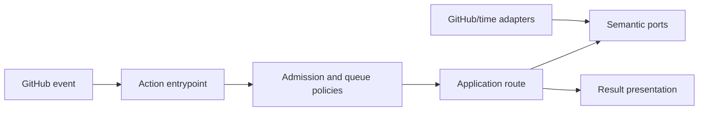

# Execution Admission, Queueing, Routing, and Result Publication

- Status: As-built baseline with implemented review-evidence ownership hardening
- Date: 2026-09-11
- Owners: Copilot maintainers
- Scope: the shared GitHub Action lifecycle from an incoming event to visible results and persisted execution state
- Related issues/PRs: architecture quality and scalability hardening SDD;
  [PR #363](https://github.com/vypdev/copilot/pull/363); historic motivation
  before that live evidence is not recoverable from repository evidence
- Required review gates: product UX, architecture, testing, documentation, security/operations
- Open decisions blocking readiness: none for the baseline; see known debt and limitations

## 1. Executive summary

Copilot admits an event before expensive setup, serializes mutation-capable runs
per workflow, resolves one application route, and publishes a bounded result to
the relevant GitHub conversation and Job Summary. A run created by the account
behind the workflow PAT is ignored unless it is an explicit valid single action.
The native `Copilot / Review` name is reserved for results carrying exactly one
current-schema Bugbot telemetry snapshot for the exact head. A valid snapshot
does not hide a second malformed owned snapshot: the complete set is ambiguous
and publishes no Review Check. Metadata-only or ambiguous PR runs retain their workflow
result and Job Summary without impersonating or hiding review evidence.

```text
GitHub event -> actor admission -> queue -> execution setup -> one route
             -> lifecycle reconciliation -> comment/summary/check -> stored state
```

The intentional safety rule is fail closed: missing identity, queue identity, or
route prerequisites MUST NOT be treated as permission to mutate.

## 2. Problem, current behavior, and evidence

### 2.1 Problem

Every issue, PR, push, comment, and single-action workflow needs the same answer
to four questions: may it run, may it overlap, which use case owns it, and where
will a human see the outcome. Duplicating those decisions in workflows would
create inconsistent authorization and failure behavior.

### 2.2 Current behavior

1. `runGitHubAction` resolves the event, token user, and single-action request.
2. Bot-authored normal events are discarded; valid explicit single actions pass.
3. Only agent roles reachable by the event are prepared, subject to
   `ai-members-only` authorization.
4. `mainRun` waits for older active runs of the same workflow, except the
   dedicated failure-comment action.
5. Setup restores issue, branch, and durable operation state; the route policy
   selects exactly one of issue, issue-comment, PR, review-comment, push, or
   single-action.
6. Results reconcile lifecycle/activity labels and are published to the target,
   Job Summary, optional semantic Check Run, and configuration marker as
   applicable. A PR result without exact-head Bugbot telemetry publishes no
   `Copilot / Review` Check.
7. The first executed result error, malformed canonical finding-state evidence,
   an unknown Bugbot state, or configured unresolved findings marks the Action
   failed.

### 2.3 Evidence and contract classification

- Observed behavior: `src/actions/github_action.ts`, `common_action.ts`,
  `main_run_lifecycle.ts`, `main_run_route.ts`, and
  `github_action_completion.ts`.
- Intentional contract: early bot-loop admission, workflow-scoped serialization,
  single-route ownership, sanitized publication, and fail-closed errors.
- Known debt and limitations: queue state is polled and bounded by a 90-minute
  internal budget; optional Check Run publication is best-effort; 26 production
  application paths pass a caught `unknown` directly into `Result.errors`; 127
  production application files import the shared `Execution` aggregate; no live
  UX capture is stored in the repository.
- Unknown rationale: why workflow-scoped polling was originally chosen instead
  of only GitHub concurrency is not established by current evidence.
- Proposed improvements: the semantic-error replacement and shrinking
  `Execution`-context allowlist are specified in
  [`execution-error-and-context-hardening.md`](./execution-error-and-context-hardening.md),
  under the sequencing and cross-cutting gates in
  [`architecture-quality-and-scalability-hardening.md`](./architecture-quality-and-scalability-hardening.md).
  Changes to queue ownership or durable event processing beyond that proposal
  require a separate design; they are not part of this baseline.

## 3. Actors, surfaces, and terminology

| Actor | Goal | Entry point | Visible surfaces |
|---|---|---|---|
| Contributor | trigger automation | GitHub event/comment | issue, PR, check |
| Maintainer | operate/recover a run | workflow dispatch or retry | run, Job Summary |
| PAT account | perform provider mutations | explicit single action | audit log/run |
| Copilot | execute one bounded route | `action.yml` | comments, labels, summary |

“Admission” decides whether a run enters setup. “Queue” prevents older runs of
the same workflow from overlapping. “Result” is the application-level fact;
presentation adapters decide where that fact appears.

## 4. Goals, non-goals, and fixed invariants

### 4.1 Goals

1. Every accepted event MUST resolve to at most one top-level route.
2. Mutation-capable workflow runs MUST wait for older active runs or fail.
3. Results MUST remain understandable without raw logs.
4. A named native Check MUST represent only its semantic capability; a metadata
   result MUST NOT supersede a same-head review in GitHub's latest-by-name view.

### 4.2 Non-goals

1. This contract does not define feature-specific issue, PR, Bugbot, or release behavior.
2. It does not promise exactly-once delivery from GitHub.

### 4.3 Fixed product/safety invariants

1. A normal event authored by the PAT user MUST NOT recursively execute.
2. Invalid or missing workflow identity MUST NOT bypass queueing.
3. Provider diagnostics and secrets MUST NOT be copied verbatim to comments.
4. A failed result MUST NOT be converted to a successful process exit.
5. Bounded partial, skipped, and superseded Bugbot review outcomes MUST be
   neutral; metadata-only PR completion MUST publish no Review Check.
6. Finding-state evidence MUST use the complete canonical seven-state schema
   with non-negative safe-integer counts and no additional state keys. Missing,
   malformed, or arithmetically overflowing owned evidence MUST fail closed.

## 5. Current versus proposed product journey

| Stage | Pre-baseline understanding | As-built contract | Effect |
|---|---|---|---|
| Admission | implicit in entrypoint | explicit identity decision | bot loops stop early |
| Queue | implementation detail | fail-closed workflow gate | mutations do not overlap |
| Routing | spread across handlers | one route policy | predictable ownership |
| Completion | comments only were assumed | comment + summary + optional check + state | evidence is inspectable |
| Review evidence | every PR completion could reuse the Review name | exact-head telemetry owns Review; metadata keeps workflow/summary only | latest-by-name remains truthful |

The baseline is retrospective except for the implemented semantic ownership
hardening described here: Review Check publication now requires exactly one
current-schema, exact-head Bugbot telemetry snapshot and incomplete outcomes are
neutral.

## 6. Functional behavior and state model

### 6.1 Happy path

1. Resolve trusted repository/event metadata and the PAT identity.
2. Admit, queue, build configuration, restore state, and dispatch one route.
3. Collect ordered results, reconcile labels, publish user and operator evidence,
   persist applicable configuration, and retain a successful exit status.

### 6.2 Alternative paths

- Queue-only mode admits the workflow and returns before application setup.
- A valid single action can run when actor and PAT user match.
- Events with no resolvable issue may run only issue-free single actions.
- Dry-run Bugbot results skip comments, state persistence, and checks.
- Metadata-only PR results publish their native workflow result and Job Summary
  but no `Copilot / Review`; no previous Check read/merge is performed.

### 6.3 State machine

| State | Entered when | Meaning | Next | Recovery/owner |
|---|---|---|---|---|
| discarded | PAT user authored a normal event | intentional no-op | terminal | none |
| queued | older run exists | waiting safely | setup/failed | retry by maintainer |
| setup | identity/context loads | restoring facts | routed/failed | fix config/token |
| routed | one use case owns event | work is running | publishing/failed | inspect results |
| publishing | results exist | evidence/state being written | complete/partial/failed | retry idempotently |
| partial | core work succeeded, optional evidence failed | retained work remains valid | terminal | inspect run |
| complete | required work and publication succeeded | no action required | terminal | none |

Duplicate events are tolerated through route-specific idempotency and persisted
markers; this shared layer does not itself deduplicate GitHub deliveries.

## 7. User-facing configuration

| Input | Type | Recommended default | Allowed values | Scope/persistence |
|---|---|---|---|---|
| `debug` | boolean | `false` | `true`, `false` | per run |
| `token` | secret | required PAT | valid GitHub token | per run; never persisted in markers |
| `ai-members-only` | boolean | `false` | `true`, `false` | workflow/repository variable |
| `bugbot-fail-on-unresolved` | boolean | `false` | `true`, `false` | per run |

The 90-minute queue budget, exponential backoff, maximum 60-second delay,
jitter, admission rules, route precedence, and error-to-exit mapping are not
configurable. Inputs use Action values; stored issue configuration restores
operation facts but never secrets.

## 8. Clean Architecture design

| Boundary | Owns | Must not own/import |
|---|---|---|
| Domain/policy | admission, route, queue delay, publication selection | Octokit/core |
| Application | setup, waiting, lifecycle synchronization | provider DTOs |
| Adapters | GitHub queries, comments, checks, timers | route policy |
| Composition | concrete wiring | product decisions |
| Entrypoints | event/input/output adaptation | duplicated use cases |
| Presentation | sanitized comment, status, summary, and Check rendering | mutations |



Text equivalent: GitHub data is adapted at the entrypoint; pure policies and
application use cases decide; provider adapters satisfy ports; renderers expose
sanitized results. Architecture and cycle tests MUST prevent inward layers from
importing concrete infrastructure.

## 9. UI/UX and content contract

The first view MUST say status, completed facts, next step, action, impact, and
links before technical detail.

```markdown
Pending: **Waiting safely for 2 older Copilot runs.** No action is required.
Action required: **Configuration could not be loaded.** Repair the PAT or inputs, then re-run.
Blocked: **Queue identity is unavailable.** No repository mutation started.
Partial: **Work completed; optional Check Run could not be published.** Inspect the Job Summary.
Complete: **Copilot execution succeeded.** Results and lifecycle state are up to date.
Review partial: **Bugbot reviewed bounded evidence but cannot declare the whole PR clean.** The Review Check is neutral.
Metadata only: **PR metadata normalization completed.** See this workflow summary; the analyzed Review Check is unchanged.
```

There SHOULD be at most one generic result comment per invocation. Stable
markers, bounded error text, descriptive links, and headings provide narrow and
screen-reader-friendly output. English is the fallback for runtime/system text;
feature renderers may use configured issue or PR locales.

## 10. Failure, recovery, and cleanup

| Failure | Impact | Retained facts | Retry | Action | Cleanup |
|---|---|---|---|---|---|
| identity/admission | no work starts | none | yes | repair token | none |
| queue timeout/query | no route starts | older runs unchanged | yes | inspect/cancel older run | none |
| route failure | some steps may exist | result list/state | route-specific | read first error | route-specific |
| comment/state write | core work may be complete | result and logs | yes, idempotent | inspect summary | marker policy |
| optional check failure | summary remains | core result | optional | inspect logs | none |

Errors MUST follow impact → cause → action → retained state and distinguish a
publication failure from failure of already completed work.

## 11. Security, permissions, and privacy

Least-privilege workflow permissions remain workflow-owned. Actor identity is
read from GitHub context and compared case-insensitively to the token identity.
Event bodies and agent output are untrusted and sanitized before publication.
Secrets MUST stay in environment/action secret channels and be redacted from
logs, comments, summaries, errors, and persisted configuration.

## 12. Observability and operational UX

The Action emits bounded logs, application results, a Job Summary, the
`bugbot-telemetry` output, and optionally a Copilot Check Run. Repository/run,
event, target, lifecycle, result counts, and sanitized failures provide
correlation. Queue polling logs count and next delay without leaking responses.
Repeated unchanged state SHOULD not generate repeated discussion comments.
The shared telemetry projection is the only parser used by Job Summary and
native evidence. It first counts every result that owns the telemetry field and
accepts the set only when that count is exactly one and the snapshot is valid;
malformed siblings cannot be discarded before cardinality is checked.
Missing/mismatched/ambiguous telemetry is observable as absence of a Review
Check, never as `Bugbot review: —` in a newer same-name Check. A second shared
pure projection validates and aggregates complete canonical finding-state
counts for Action exit, lifecycle, status, Job Summary, and Check. Valid
`completed`, `no-findings`, `partial`, and `dry-run` telemetry requires that
aggregate; omitting it is invalid. Metadata-only, `skipped`, `superseded`, and
`failed` results may keep it absent because they cannot claim a clean review.
Invalid evidence fails or blocks every current-state surface and is rendered
as `invalid`, never as zero findings.

## 13. Compatibility, migration, rollout, and rollback

This document records the repository behavior at the audit commit. There are no
installed users or real in-flight markers to preserve. The linked hardening work
therefore makes a clean cut: removed API/marker/result shapes are rejected and
no compatibility parser, migration, deprecation window, or dual reader ships.
After first real use, already completed provider mutations are never hidden or
rewound; incompatible future state fails closed and recovery starts from
inspectable provider facts.

## 14. Testing strategy and numeric budget

| Area | Minimum cases | Risk covered |
|---|---:|---|
| Admission/route/queue policy | 14 | bot loops, route precedence, delay bounds |
| Setup/state/idempotency/races | 12 | restored state, no issue, queue timeout |
| Adapters/error mapping | 8 | pagination, provider errors, timers |
| Workflow/setup contracts | 8 | queue gate, permissions, timeouts |
| Publication/UX/sanitization | 20 | targets, dry run, summary, errors, links, exact-head review eligibility, metadata-only omission, malformed-sibling telemetry, required finding-state evidence, canonical projection, invalid status and incomplete neutral matrix |
| Integration/security/cutover | 8 | end-to-end routes, secrets, removed-shape rejection |
| **Total** | **70** | no double counting |

Repository thresholds (90% lines/statements, 88% functions, 82% branches)
remain mandatory; changed pure policies SHOULD reach 95% branch coverage.
Tests use fake clocks/randomness/providers and no live waits. Golden Markdown
needs semantic assertions. Human evidence remains required for desktop/mobile,
light/dark, and screen-reader order.

## 15. Documentation and discoverability

| Audience | Artifact | Contract |
|---|---|---|
| User | `docs/overview.mdx` | event-to-result journey |
| Setup owner | workflow/setup docs | permissions and queue gate |
| Operator | troubleshooting | timeout, partial publication, retry |
| Contributor | architecture + this SDD | boundaries and route ownership |

## 16. Acceptance scenarios

1. Given a PAT-authored normal event, the run exits before queue or mutation.
2. Given a valid explicit single action from that account, it executes.
3. Given older active runs, the current run waits with bounded jitter.
4. Given unavailable workflow identity on GitHub Actions, queueing fails closed.
5. Given a known event, exactly one route owns it.
6. Given successful core work and failed optional check publication, the summary
   reports partial evidence without claiming core failure.
7. Given untrusted output, published Markdown contains no executable/secret content.
8. Given a catalog/spec change, CI validates registered evidence and this contract.
9. Given a metadata-only PR result, the Job Summary is published and no
   `Copilot / Review` evidence call occurs.
10. Given exact-head Bugbot telemetry, complete/no-findings may succeed;
    partial/skipped/superseded are neutral; failed remains failure.
11. Given one valid telemetry snapshot plus any second malformed owned snapshot,
    no `Copilot / Review` Check is published.
12. Given complete canonical finding-state results, Action exit, lifecycle,
    `/copilot status`, Job Summary, and Check consume the same aggregate counts.
13. Given a missing state, extra state, invalid count, or aggregate overflow,
    the Action and eligible Check fail, lifecycle blocks, summaries say
    `invalid`, and no surface invents a clean state.
14. Given a valid finding-evaluating review outcome with no `findingStates`
    aggregate, the shared projection is invalid across Action completion,
    lifecycle, status, Summary, and eligible Check evidence; metadata-only and
    skipped/superseded/failed results retain a deliberate absent state.

## 17. Requirements traceability

| Requirement | Owner | Test/evidence | Documentation |
|---|---|---|---|
| admission invariants | admission policy/use case | admission tests | overview |
| serialization | queue policy/use case/adapters | queue + workflow tests | troubleshooting |
| one route | route policy/dispatcher | route tests | architecture |
| safe publication | completion/presentation policies | completion tests | overview |
| semantic Check ownership | telemetry projection + evidence policy | outcome matrix + metadata-only and malformed-sibling negatives | Bugbot detection, workflow setup, troubleshooting |
| canonical finding-state evidence | result-state projection + completion/lifecycle/status/summary/Check policies | strict schema, required-outcome absence, aggregation, overflow, fail-closed, and rendering tests | Bugbot detection, observability, failure scenarios, comment commands |
| dependency direction | architecture tests | boundary/cycle suites | architecture |

## 18. Maintenance sequence

1. Change contracts/pure policies and tests.
2. Change setup/route orchestration and deterministic race tests.
3. Change adapters and workflow structural checks.
4. Change presentation fixtures, documentation, and catalog evidence.
5. Run all quality gates and capture human UX evidence when visible content changes.

## 19. Definition of Done

- [x] Normative changes have acceptance and traceability.
- [x] Architecture, workflow, catalog, and cycle checks pass.
- [x] The 70-case risk budget and repository coverage gates pass; both shared
      evidence projections maintain 100% line, statement, branch, and function
      coverage.
- [x] Queue, retry, cancellation, partial success, and idempotency are covered.
- [x] UI states, sanitization, accessibility, localization, and noise are reviewed.
- [x] User/operator/contributor documentation and catalog dates are current.
- [x] No secret or raw provider diagnostic reaches a public surface.

## 20. References and decisions

- Primary sources: catalogued code, workflows, tests, and documentation.
- Related specs: release orchestration, merge-queue readiness, Bugbot reconciliation.
- Planned hardening: `execution-error-and-context-hardening.md` owns the semantic
  error boundary and `Execution` context replacement; the architecture hardening
  SDD owns shared sequencing and verification gates.
- Decision: retain one shared lifecycle and semantic ports; reject route logic in YAML.
- Decision: omit Review evidence for metadata-only PR runs; reject reading and
  merging a previous Check because it adds a stale provider race and preserves
  semantic impersonation.
- Follow-up outside scope: durable event storage beyond issue configuration markers.
