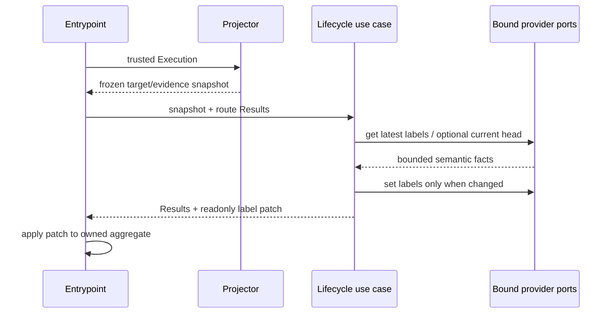
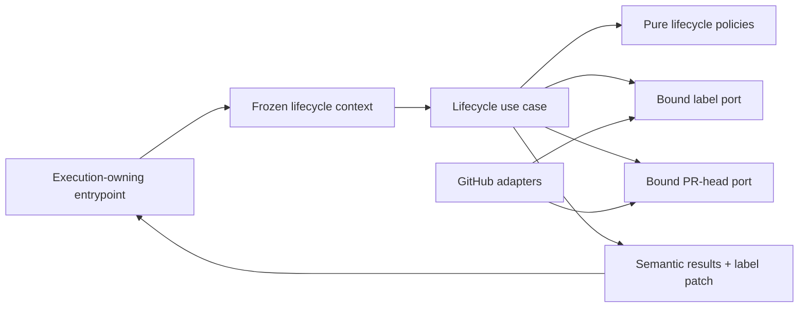

# Execution Boundary Closure Audit

- Status: Implemented — automated local and pull-request evidence complete
- Date: 2026-09-13
- Catalog capability ID: `execution-lifecycle`
- Last verified: 2026-09-14 on `develop` (414 suites, 3,580 tests, and all local and remote gates)
- Owners: Copilot maintainers
- Scope: complete P2-G by proving and hardening the final `Execution` boundary,
  lifecycle synchronization contract, and raw-error logging ratchet
- Related issues/PRs: [#365](https://github.com/vypdev/copilot/pull/365)
- Required review gates: product UX, architecture, testing, documentation,
  security/operations, GitHub checks
- Open decisions blocking readiness: none

## 1. Executive summary

P2-G closes the execution-context program with an executable audit, not a
one-time review. The final 13 `Execution` consumers remain because each owns
aggregate construction, entrypoint orchestration, a route contract, or a route
coordinator. Every entry receives a checked-in role and justification; any
addition, removal, move, duplicate, unknown role, or blank rationale fails CI.

Lifecycle synchronization is the last credential-shaped structural alias below
those boundaries. It MUST receive an immutable, provider-independent snapshot,
operate through repository-bound ports, and return an explicit label patch for
the entrypoint to apply. It MUST NOT retain `ExecutionInputs`, credentials, live
aggregate subobjects, or mutation authority in its request.

```text
GitHub event -> Execution entrypoint -> frozen lifecycle snapshot
             -> lifecycle policy -> bound label/head capabilities
             -> semantic Result + readonly label patch -> entrypoint applies patch
```

The safety rule is fixed: a raw caught value, including a locally derived alias
or interpolated message, MUST NOT enter logging or user-visible setup outcomes.

## 2. Problem, current behavior, and evidence

### 2.1 Problem

The shrinking import ratchet proves the current direct symbol inventory, but it
does not prove that its own alias/re-export detection works and its JSON does not
record why each remaining consumer is allowed. A future refactor could weaken
the scanner or turn the list into an unexplained exception registry.

`LifecycleSynchronizationExecution` is a structural copy of the aggregate. It
contains owner, repository, token, the complete provider event DTO, mutable label
arrays, and nested aggregate objects. The use case supplies repository identity
on every call and mutates its request after a successful write. This violates
the capability-context and bound-authority contracts even though the type does
not import the `Execution` class.

The raw-error logging architecture test follows the caught symbol directly but
not local derived variables. Existing code can therefore interpolate a provider
message into a `message` variable and log it without failing the ratchet.

### 2.2 Current behavior

1. `common_action.ts` passes the live aggregate to lifecycle synchronization.
2. The use case derives target kind from an event-name list. An `issue_comment`
   on a pull request can consequently select issue labels despite the verified
   pull-request identity.
3. The use case calls unbound ports with owner, repository, and token.
4. A successful provider mutation writes back into the supplied aggregate.
5. A provider failure interpolates its message into both a log and semantic
   error.
6. The import baseline stores only a maximum and filenames.
7. The raw-error guard does not taint local variables derived from the catch
   symbol.

### 2.3 Evidence

- Graphify query: `Execution` and `LifecycleSynchronizationExecution` share the
  `ExecutionInputs` dependency even though no directed symbol path exists.
- Import inventory: `src/architecture/execution_import_baseline.json` contains
  exactly 13 consumers after P2-F.
- Code: `synchronize_lifecycle_state_use_case.ts`,
  `lifecycle_state_policy.ts`, `common_action.ts`, and
  `lifecycle_state_composition_root.ts`.
- Tests: `execution_import_ratchet.test.ts` and
  `raw_error_logging_boundaries.test.ts` expose the missing negative proof and
  local-taint rule respectively.
- Quality baseline: the clean P2-F merge audit reported no dead code or cycles;
  RepoWise average health `7.92`, maintainability `9.34`, performance `9.97`,
  and hotspot score `5.96` at merge commit
  `7a42b62491715b6187449564d290a153a4b628ec`.
- Closure audit: the final clean P2-G code audit at
  `e0931481f2098e3faf28d8b1598d6ed958c286f0` reported zero safe-to-delete dead
  code, RepoWise average health `7.93`, maintainability `9.35`, performance
  `9.97`, and hotspot scores `6.11`, `8.98`, and `9.93` respectively. Graphify
  indexed `8,386` nodes and `21,511` edges. The shared
  validator scores `8.58` with maximum CCN `5`; its test scores `7.35` with
  maximum CCN `2` and `7.36%` duplication after the remote quality feedback was
  reduced from `43.33%`. Neither file has a current structural medium/high
  finding. Remaining churn and entropy signals describe the intentionally
  iterative review history rather than a static dependency or implementation
  defect.
- Security audit: RepoWise scanned the complete 3,295-commit history and 33,009
  blobs. It persisted no working-tree security finding. All password-shaped
  history matches belong to generated bundles; the three secret-shaped matches
  belong to a removed Supabase template and are two environment references plus
  one commented example. No credential value is present in the current tree or
  was copied into audit evidence.
- Pull-request verification found actionable gaps in two successive snapshots.
  At `889550e`, Codecov patch coverage was `88.75740%` and Bugbot found that an
  all-zero coverage entry could satisfy a budget. At `0e9bd74`, Codecov reached
  `95.90643%`, the first Bugbot finding was fixed, and Bugbot found that a
  finite but out-of-range or count-inconsistent reported percentage could
  satisfy an `each` budget. At `3a5c8a0`, Bugbot then identified a precision
  assumption in the consistency check. The corrections reject empty, malformed,
  fractional, and out-of-range measurements, evaluate both aggregate and
  per-file budgets from authoritative counts regardless of reported percentage
  precision, cover every changed branch reported by Codecov, and close a
  provider-diagnostic leak discovered by those regressions. At the final code
  head `e0931481`, CI, branch sync, the authoritative Copilot PR run, and
  RepoWise passed; Codecov reported every modified coverable line covered and
  `91.67%` project coverage; Bugbot completed with zero open/reopened or
  verification-required findings and all three findings fixed. Its aggregate
  projection remained partial because the large diff was truncated, but it had
  no pending operation or actionable review. The documentation preview was
  available and GitHub reported the pull request `MERGEABLE / CLEAN`.
- Unknowns: production label-write latency is not recorded. P2-G changes no
  request count on the happy path and therefore defines deterministic call-count
  limits instead of inventing a latency target.

### 2.4 Retrospective classification

Not applicable. This is a prospective closure specification.

## 3. Actors, surfaces, and terminology

| Actor | Goal | Entry point | Visible surfaces |
|---|---|---|---|
| Contributor | see correct lifecycle state without provider diagnostics | issue or pull-request event | labels, check, Job Summary |
| Maintainer | change a leaf without aggregate-wide coupling | TypeScript change | CI architecture tests, generated architecture graph |
| Operator | diagnose a failed synchronization safely | GitHub Actions run | sanitized log and result summary |
| Reviewer | verify P2 completion from durable evidence | pull request | checks, Codecov, Bugbot, spec/catalog diff |

An **aggregate boundary** constructs or owns `Execution`. A **route
coordinator** may receive it only to select and project capability work. A
**lifecycle snapshot** is a deeply readonly copy of target facts, configured
labels, action, and bounded review/check evidence. A **label patch** is the sole
successful in-memory change requested by lifecycle synchronization.

## 4. Goals, non-goals, and fixed invariants

### 4.1 Goals

1. Preserve an exact, justified, machine-validated 13-consumer allowlist.
2. Prove renamed imports, re-exports, type aliases, and `Pick<Alias, ...>` remain
   detectable by the scanner.
3. Replace `LifecycleSynchronizationExecution` with a frozen snapshot and
   explicit outcome.
4. Bind repository coordinates and credentials once in composition.
5. Select pull-request conversation comments by verified target kind, not by an
   incomplete event-name list.
6. Detect locally derived caught values at logging calls and remove every
   violation exposed by the stronger rule.

### 4.2 Non-goals

1. P2-G does not delete the internal `Execution` aggregate.
2. It does not move route coordination into a generic service locator.
3. It does not change lifecycle label names, waiting-state policy, provider
   request limits, or expose a new user configuration switch.
4. It does not preserve the obsolete token-bearing lifecycle request or its
   mutation behavior through overloads or adapters.

### 4.3 Fixed product/safety invariants

1. A lifecycle context contains no token, credential, repository authority,
   provider DTO, getter, or mutable aggregate reference.
2. Target identity is one of `issue`, `pull-request`, or absent; it is never
   inferred again inside the leaf use case.
3. Stale review/check evidence never changes lifecycle state.
4. Label writes use the latest provider inventory and perform at most one read,
   one optional current-head read, and one write per invocation.
5. Raw provider values remain private causes and are absent from logs, results,
   setup summaries, fixtures, and GitHub UI.
6. The allowlist can shrink but cannot grow, and no compatibility path may
   recreate removed authority.

## 5. Current versus proposed product journey

| Stage | Current | Proposed | User/operator effect |
|---|---|---|---|
| Projection | live aggregate passed to leaf | fresh frozen snapshot | later aggregate mutation cannot change the decision |
| Target | event-name list chooses labels | discriminated verified target | PR conversation comments update PR labels |
| Provider calls | leaf supplies repo and token | bound capabilities accept only number/facts | credentials cannot be redirected by application code |
| Success | leaf mutates request | leaf returns readonly patch | entrypoint owns aggregate mutation |
| Failure | provider text can be interpolated | stable semantic error and log | actionable result without diagnostic leakage |
| Audit | filenames only | role, rationale, exact symbol scan, negative fixture | CI explains and protects every exception |



Text equivalent: the entrypoint projects one immutable snapshot, the lifecycle
use case reads bounded current facts through credential-bound ports, writes only
when necessary, and returns a patch which only the entrypoint applies.

## 6. Functional behavior and state model

### 6.1 Happy path

1. The entrypoint projects event action, one discriminated target, lifecycle
   label configuration, and one bounded evidence candidate.
2. The use case verifies the provider-current pull-request head for every
   review, check-suite, or workflow-run evidence event.
3. Pure policies select lifecycle and waiting states.
4. The use case reads current target labels, preserves non-managed labels,
   writes only a changed list, and returns a successful result plus patch.
5. The entrypoint applies the patch to its aggregate before later publication.

### 6.2 Alternative and edge paths

- Missing or non-positive target: no provider call, no result, no patch.
- Current labels already match: no write and no patch.
- Label read returns no inventory: use the frozen event-time labels as the
  deterministic fallback.
- Current-head read fails: ignore external evidence, log one fixed debug
  sentence, and continue with route facts.
- Evidence SHA is missing or stale: ignore it.
- Label read/write fails: return one retryable `provider.unavailable` error,
  no patch, and no provider text.
- Duplicate/replayed event: replacement is idempotent and produces no second
  write once provider labels already match.

### 6.3 Lifecycle synchronization states

| State | Entered when | User-visible meaning | Allowed next states | Recovery/owner |
|---|---|---|---|---|
| untargeted | no unique issue/PR | no lifecycle label action | terminal | new unambiguous event |
| projected | immutable target exists | no visible change yet | verified/degraded/failed | application |
| verified | current labels/head read | current event may change labels | unchanged/updated/failed | application |
| degraded | head read failed or evidence stale | route facts still reconcile safely | unchanged/updated/failed | automatic |
| unchanged | desired labels already current | no write | terminal | none |
| updated | provider accepted one write | new lifecycle/waiting labels visible | terminal | entrypoint applies patch |
| failed | label operation failed | existing labels retained | retry | operator reruns event |

## 7. User-facing configuration

No new configuration is introduced. Target precedence, evidence freshness,
provider call limits, error sanitization, bound credentials, the allowlist, and
its roles are correctness contracts and MUST NOT be configurable. Existing
lifecycle label names remain repository configuration snapshotted into the
context.

Recommended and only supported behavior is strict current-head validation for
review/check evidence. Accepting stale evidence is not a supported alternative.

## 8. Clean Architecture design

### 8.1 Responsibilities and dependency direction

| Layer/boundary | Owns | Must not own/import |
|---|---|---|
| Pure policy | lifecycle/waiting decision and evidence normalization | `Execution`, provider clients, credentials |
| Application context | copied target/evidence/configuration facts and outcome | `ExecutionInputs`, token, repository authority |
| Application use case | ordering, idempotence, semantic failure | aggregate mutation, raw provider call shape |
| Semantic ports | label and current-head capabilities | mutable identity parameters after binding |
| Data adapters | GitHub requests and provider error causes | lifecycle policy |
| Infrastructure | credential binding and concrete composition | product state decisions |
| Entrypoint | projection and application of explicit patch | provider details |



Text equivalent: only the entrypoint owns `Execution`; it projects facts for an
application use case whose provider authority is already bound, and applies the
returned patch.

### 8.2 Contracts, state, and trust boundaries

- Pure decisions: target precedence, evidence freshness, lifecycle state,
  waiting state, label replacement, equality.
- Application request: deeply readonly plain records only.
- Application outcome: frozen result list plus optional frozen target/labels.
- Semantic ports: `BoundIssueLabelsPort` and
  `BoundPullRequestHeadShaPort` accept only target numbers and semantic values.
- Durable state: GitHub labels remain authoritative; aggregate labels are a
  local cache updated only after provider success.
- Concurrency/idempotency: provider reread immediately precedes replacement;
  equal lists cause no write.
- Trust boundary: GitHub event payload and caught provider values are untrusted;
  the projector copies bounded scalar facts and the error mapper retains causes
  privately.

### 8.3 Executable architecture constraints

1. The TypeScript checker resolves the canonical `Execution` symbol through
   direct imports, renamed imports, re-exports, aliases, and utility types.
2. A synthetic negative fixture MUST fail the consumer policy if indirect alias
   usage is introduced.
3. The baseline schema MUST reject unknown roles, empty rationales, duplicates,
   non-sorted entries, and any inventory mismatch.
4. Context-schema tests MUST reject credential-shaped fields and references to
   `Execution`, `ExecutionInputs`, `Tokens`, or mutable label aggregates.
5. Raw-error logging analysis MUST propagate taint through local declarations
   and assignments while treating `toApplicationError` as the semantic boundary.
6. Existing dependency, cycle, specification, documentation, workflow, build,
   package, Graphify, and clean-clone RepoWise gates remain mandatory.
7. Specialized coverage gates MUST declare budgets in
   `scripts/coverage-budgets.json` and use the sole shared validator; copied
   report parsing, percentage arithmetic, or drift logic is forbidden.
8. Every configured coverage entry MUST contain valid measurable data. Counts
   MUST be non-negative safe integers with `covered <= total`; a supplied
   percentage MUST be finite and within 0–100, but is never authoritative.
   Aggregate and per-file thresholds MUST be computed from counts so percentage
   precision or inconsistency cannot create a false pass. All-zero or malformed
   entries and aggregate metrics without a denominator fail closed; a single
   denominator-free per-file metric is vacuously covered only when another
   configured metric proves that the file has measurable instrumentation.

## 9. UI/UX and content contract

P2-G adds no comment or notification. GitHub labels remain the concise state
surface; the existing Job Summary renders semantic results.

| Primary state | First visible fact | Human action | Noise budget |
|---|---|---|---:|
| pending/reviewing | `state:reviewing` | none | 0 new comments |
| action required | `state:changes-requested` + `state:awaiting-issue-author` | address findings | 0 new comments |
| blocked | `state:blocked` + `state:awaiting-maintainer` | inspect sanitized failed step and rerun | 1 existing summary result |
| complete | `state:ready` or `state:verified` | merge/review as already documented | 0 new comments |

Representative failed Job Summary content remains:

```markdown
### Lifecycle state could not be synchronized

**Impact:** Existing issue or pull-request labels were retained.
**Cause:** The repository provider was unavailable.
**Action:** Retry the workflow after provider access recovers.
**Retained state:** No label patch was applied.
```

Labels contain text and do not rely on color alone. Existing locale fallback and
responsive GitHub rendering are unchanged. No raw Markdown, mentions, command
text, URL, or provider diagnostic is added by this capability.

## 10. Failure, recovery, and cleanup

| Failure/partial state | User impact | Retained facts | Automatic retry | Required action | Cleanup |
|---|---|---|---|---|---|
| no target | no label change | all labels | no | emit a valid target event | discard snapshot |
| stale evidence | evidence ignored | route facts and labels | no | none | discard evidence |
| head read fails | review/check evidence ignored | route facts and labels | no | none unless repeated | discard cause |
| label read/write fails | lifecycle update absent | provider and aggregate labels | workflow retry only | rerun after recovery | no patch; discard cause |
| provider write succeeds | label list updated | provider labels | not needed | none | apply one local patch |

No rollback migration exists. A successful provider label write is idempotent;
retry rereads it and becomes unchanged.

## 11. Security, permissions, and privacy

1. Credentials exist only in the infrastructure binding closure.
2. The lifecycle context cannot select another repository or credential.
3. Untrusted event values are copied only into bounded scalar evidence fields;
   they are never executed or rendered directly.
4. Provider causes and provider-returned observation diagnostics are untrusted.
   They are absent from logs, results, setup summaries, checked fixtures, and
   GitHub surfaces unless secret patterns, workflow commands, markup, and
   mentions have been neutralized at the presentation boundary.
5. Exact head-SHA equality prevents stale review/check events from forging a
   current lifecycle transition.

## 12. Observability and operational UX

- User-facing state: provider labels and the existing Job Summary result.
- Operator evidence: one stable result ID,
  `SynchronizeCopilotLifecycleStateUseCase`, and semantic error code.
- Logs: one fixed debug sentence for degraded head lookup; one semantic error
  record for label failure. No raw error sampling.
- Metrics: no new cardinality. Existing result aggregation counts success and
  failure by stable task ID/code.
- Call budget: zero calls without a target; otherwise at most one label read,
  one current-head read for external evidence, and one conditional label write.
- Notification budget: zero new comments, reviews, checks, or mentions.

## 13. Compatibility, migration, rollout, and rollback

There are no users, external consumers, persisted lifecycle requests, or
in-flight schemas to migrate. The cutover removes the token-bearing interface,
unbound constructor contract, and in-place mutation in one change. No overload,
adapter, deprecation, dual reader, or feature flag is permitted.

Rollout is the ordinary `develop` to `master` pull request. Local and remote
checks, Codecov, Bugbot, automatic comments, Graphify, and a clean-clone
architecture audit MUST complete before review. Rollback is a whole-change
revert and MUST NOT weaken the ratchets.

## 14. Testing strategy and numeric budget

P2-G owns at least **45 distinct cases**.

| Area | Minimum cases | Required risks |
|---|---:|---|
| Context projection | 6 | issue, PR comment precedence, no target, copy/freeze, credentials/DTO absent, evidence variants |
| Lifecycle policy and use case | 8 | state/waiting replacement, unchanged, fallback, stale evidence, head failure, label failure, explicit patch |
| Binding and composition | 3 | labels, PR head, frozen identity/credential capture |
| Route and replay integration | 6 | review/check/workflow replay, ambiguous event, patch application, idempotence |
| Execution architecture | 5 | schema, exact inventory, roles/rationales, alias/re-export fixture, forbidden lifecycle fields/types |
| Error/security regression | 4 | direct, interpolation, local declaration/assignment taint, sanitizer allowance, provider-observation presentation |
| Coverage-gate infrastructure | 13 | aggregate boundary, labelled failure, per-file failure, missing entry, discovered-count drift, all-zero input, fractional counts, percentage bounds, authoritative counts, alternate percentage precision, branchless per-file metric, denominator-free aggregate, malformed metric |
| **Total** | **45** | no double counting |

The repository thresholds remain 90% lines/statements, 88% functions, and 82%
branches. The new pure projector requires 100% statement and enumerated-branch
coverage; the compiled scanner fixtures enumerate every required bypass and
taint class; changed lifecycle modules require at least 95% lines/statements and
90% branches/functions. Tests use deterministic fakes, no
real provider, no sleep, no secret snapshot, and exact call-count assertions.

Manual evidence is limited to PR checks, Codecov patch result, Bugbot completion,
automatic comments, mergeability, and clean-clone Graphify/RepoWise output; the
product UI itself is unchanged.

## 15. Documentation and discoverability

Update:

1. `docs/development/architecture.mdx` with final aggregate ownership and
   lifecycle projection/outcome flow.
2. `docs/dependency-rules.md` with the justified allowlist schema and alias
   fixture guarantee.
3. `docs/security-operations/operations/error-reference.mdx` with the derived
   caught-value rule.
4. `specs/catalog.json`, generated `CATALOG.md`, and the two parent SDDs with
   final status and evidence.
5. Generated action, CLI, and API bundles after validation.

## 16. Acceptance scenarios

1. Given an issue event, the projector returns a frozen issue target with copied
   labels and no repository authority.
2. Given `issue_comment` on a verified pull request, the PR target and PR labels
   win over the issue event name.
3. Given no positive target number, no provider method is called.
4. Given stale or headless evidence, no external evidence changes state.
5. Given current evidence and changed labels, one write occurs and one readonly
   patch is returned.
6. Given already-current labels or replay, no write and no patch occur.
7. Given a head-read failure, route facts continue without provider diagnostics.
8. Given a label failure containing a secret marker, the marker is absent from
   logs, results, and patches.
9. Given caller mutation after projection or binding, the snapshot and bound
   repository identity remain unchanged.
10. Given an indirect alias/re-export/`Pick` of `Execution`, the negative fixture
    proves the scanner detects it.
11. Given any allowlist role/rationale or inventory drift, CI fails with the
    exact offending file.
12. Given a local variable or assignment derived from a caught value and passed
    to logging, CI fails; a `toApplicationError` value passes.
13. Given an all-zero, malformed, fractional, out-of-range, count-inconsistent,
    alternate-precision, or denominator-free configured coverage measurement,
    the shared validator derives thresholds from counts and cannot declare a
    false pass.
14. Given a provider-returned merge-policy reason containing a secret, workflow
    command, markup, or mention, setup and deployment output expose none of the
    unsafe source text.

## 17. Requirements traceability

| Requirement | Owner | Automated evidence | Documentation |
|---|---|---|---|
| immutable target/evidence snapshot | lifecycle context projector | projection and replay suites | architecture guide |
| bound credentials | lifecycle bindings/composition root | binding/root tests | dependency rules |
| explicit label patch | lifecycle use case and entrypoint | use-case/common-action tests | architecture guide |
| stale evidence safety | lifecycle policy | policy/replay tests | troubleshooting/error reference |
| exact justified allowlist | architecture JSON/checker | ratchet schema/inventory tests | dependency rules |
| alias bypass prevention | TypeScript symbol scanner | synthetic negative fixture | dependency rules |
| derived raw-error prevention | logging taint scanner/error mapper | architecture and failure tests | error reference |
| release readiness | CI/Codecov/Bugbot/Graphify/RepoWise | PR and clean-clone evidence | catalog and parent SDDs |

## 18. Implementation sequence

1. Land this SDD as the authoritative P2-G contract.
2. Add the immutable lifecycle context, explicit outcome, and narrow evidence
   policy.
3. Bind label and PR-head capabilities in composition and project/apply at the
   entrypoint.
4. Replace the allowlist schema and add indirect-alias plus context-shape
   architecture proofs.
5. Strengthen local caught-value taint analysis and sanitize all exposed
   violations without compatibility paths.
6. Add/revise the 45-case minimum, documentation, catalog evidence, and bundles.
7. Run focused and complete validation, `graphify update .`, clean-clone metrics,
   then observe every remote PR signal until stable.

## 19. Definition of Done

- [x] The lifecycle request is immutable, credential-free, DTO-free, and does
  not expose `Execution` or aggregate subobjects.
- [x] Bound label and PR-head ports capture repository identity once.
- [x] Success returns an explicit frozen patch; only the entrypoint mutates its
  aggregate and only after provider success.
- [x] PR conversation comments target PR labels and missing/non-positive targets do no I/O.
- [x] Raw direct and locally derived caught values fail the logging guard; all
  current violations are sanitized.
- [x] The exact 13-consumer allowlist contains a valid role and rationale for
  every entry and cannot grow or drift silently.
- [x] The indirect alias/re-export/utility-type negative fixture passes.
- [x] At least 45 distinct P2-G cases and all changed-module/repository coverage
  thresholds pass.
- [x] Public documentation, parent SDDs, catalog, and generated bundles agree.
- [x] Typecheck, lint, complete tests/coverage, specification, documentation,
  workflow, build, package, smoke, Graphify, and clean architecture audits pass.
- [x] The pull request has completed CI, Codecov, Bugbot, RepoWise, automatic
  comments, and is `MERGEABLE / CLEAN` without actionable review.
