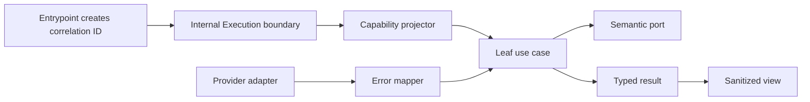

# Semantic Errors and Capability Contexts

- Status: In implementation — P0-A and P2-A complete; remaining P2 context slices queued
- Date: 2026-09-11
- Last updated: 2026-09-12
- Catalog capability ID: `execution-lifecycle`
- Last verified: 2026-09-12 at `ddc7e683`
- Owners: Copilot maintainers
- Scope: make application failures typed and safe, stop growth of the shared
  `Execution` aggregate, and replace every leaf use-case input with a narrow immutable
  capability context
- Related issues/PRs: none recorded
- Required review gates: product UX, architecture, testing, documentation,
  security/operations, public API cutover
- Open decisions blocking readiness: none

## 1. Executive summary

Copilot MUST translate every failure into one closed semantic error contract
before it reaches an application result, log, GitHub surface, or CLI view. Raw
provider values remain private and ephemeral. In parallel, CI MUST freeze the
current set of production imports of the mutable `Execution` aggregate; leaf use
cases then move one capability at a time to immutable request contexts.

This is a greenfield cutover: there are no external consumers or persisted
installations to preserve. The implementation changes the public API directly
to the semantic result and request-based Bugbot entrypoint. It removes
`review(execution)`, the `Execution`/`Ai` exports, arbitrary error inputs, and all
compatibility adapters in the same change. No deprecated overload, dual result
type, legacy reader, or transitional branch is permitted.

```text
untrusted failure -> boundary mapper -> ApplicationError -> Result/presenter
trusted event -> Execution boundary -> capability projection -> leaf use case
```

## 2. Problem, current behavior, and evidence

### 2.1 Problem

`ResultInput.errors` currently accepts `unknown[]`, normalizes arbitrary values
into `Error`, and can therefore publish provider text or secrets. `ApplicationError`
has only a coarse kind and publicly exposes its cause. Separately, 127 production
application files import `Execution`, so a change to one shared mutable aggregate
can affect unrelated capabilities.

### 2.2 Current behavior

1. Many catches pass the caught `unknown` directly to `Result.errors`.
2. `Result` stringifies non-`Error` values, including arbitrary objects.
3. `ApplicationError.cause` is public and enumerable through ordinary object
   inspection even though its comment calls it diagnostic.
4. Routes, workflows, and leaf steps commonly accept `ParamUseCase<Execution, ...>`.
5. `BugbotReviewService.review` exposes `Execution` in the package API.

### 2.3 Evidence

- Code: `src/application/errors/application_error.ts`,
  `src/data/model/result.ts`, `src/data/model/execution.ts`, and `src/api.ts`.
- Architecture: `docs/dependency-rules.md` and
  `docs/development/architecture.mdx`.
- Reproducible inventory: an AST rule and checked-in JSON baseline will replace
  the current text-search count before the first implementation slice merges.
- Unknown rationale: repository evidence does not establish why arbitrary
  errors or full aggregate inputs were originally made public.

### 2.4 Retrospective classification

Not applicable. This is a prospective hardening specification; the catalogued
execution-lifecycle SDD remains the as-built baseline.

## 3. Actors, surfaces, and terminology

| Actor | Goal | Entry point | Visible surfaces |
|---|---|---|---|
| Contributor | understand a failure and recover safely | GitHub event | comment, check, Job Summary |
| CLI operator | know impact and next action without a stack trace | local command | terminal, exit code |
| API consumer | handle stable typed failures through the sole supported API | package API | TypeScript types and results |
| Maintainer | change one capability without aggregate-wide fallout | code change | CI architecture report |

An `ApplicationError` is a sanitized semantic failure. A `cause` is the original
untrusted value and is never product data. A `capability context` is a deeply
readonly plain record projected once from trusted entrypoint state. A `leaf use
case` performs one capability step and is not an entrypoint, route coordinator,
or public API adapter.

## 4. Goals, non-goals, and fixed invariants

### 4.1 Goals

1. Make a raw error impossible to construct into an internal `Result`.
2. Give every failure a stable code, retry rule, impact, action, retained state,
   and correlation ID.
3. Replace the public API atomically with the sole typed request/result contract.
4. Reduce production `Execution` imports to the final boundary allowlist.
5. Remove credentials, mutable collections, provider DTOs, and service objects
   from capability contexts.

### 4.2 Non-goals

1. This work does not replace errors with HTTP status codes or provider types.
2. It does not create a generic context/service locator.
3. It does not remove `Execution` from its data model or approved internal
   entrypoint boundaries.
4. It does not preserve mutation of returned `Result.errors` as a supported API.

### 4.3 Fixed product and safety invariants

1. Raw messages, causes, response bodies, stack traces, argv, prompts, paths,
   and secrets MUST NOT reach results, logs, persisted state, or presentation.
2. Error code meanings and retryability are not user-configurable.
3. A wrapper MUST preserve the originating correlation ID.
4. A capability context MUST contain facts, never live repositories, clients,
   tokens, mutable `Execution` subobjects, or getters with side effects.
5. The aggregate-import baseline may shrink and MUST NOT grow.
6. No legacy API, compatibility adapter, deprecated overload, dual reader, or
   migration-only code is implemented because no consumer or persisted state exists.

## 5. Current versus proposed product journey

| Stage | Current | Proposed | User/operator effect |
|---|---|---|---|
| Catch | arbitrary `unknown` continues | boundary selects a closed code | deterministic behavior |
| Result | arbitrary values become `Error` | only semantic errors compile | no diagnostic leak |
| UI/log | message-centric | impact, category, action, retained state, ID | useful recovery |
| Use case | receives full aggregate | receives one immutable context | smaller change radius |
| Public API | `review(Execution)` and broad exports | request-only entrypoint and semantic result | one smaller contract |



Text equivalent: the entrypoint creates one correlation ID and may construct the
internal aggregate; a projector copies only required facts into a narrow
context; adapters map provider failures; the result and view expose only the
semantic contract.

## 6. Functional behavior and state model

### 6.1 Closed error taxonomy

`ApplicationErrorCode` contains exactly these values:

| Code | Kind | Retryable default | Meaning |
|---|---|---:|---|
| `configuration.invalid` | configuration | no | configured value or combination is invalid |
| `configuration.unsupported` | configuration | no | installed/runtime capability is unsupported |
| `authorization.denied` | authorization | no | actor or token lacks required authority |
| `authorization.credential-invalid` | authorization | no | credential is missing, rejected, or expired |
| `provider.not-found` | provider | no | required provider resource does not exist |
| `provider.conflict` | provider | yes | provider rejected a conflicting current state |
| `provider.rate-limited` | provider | yes | quota or secondary limit delayed the operation |
| `provider.unavailable` | provider | yes | provider or transport is temporarily unavailable |
| `provider.contract-invalid` | provider | no | response violates the adapter contract |
| `agent.policy-rejected` | agent | no | execution plan violates fixed policy |
| `agent.failed` | agent | yes | an admitted agent process failed |
| `validation.invalid-input` | validation | no | trusted entrypoint input is malformed |
| `workflow.invalid-event` | workflow | no | event cannot target the requested workflow |
| `workflow.stale` | workflow | no | newer durable state superseded this event |
| `workflow.cancelled` | workflow | no | user or platform canceled before completion |
| `workflow.failed` | workflow | yes | orchestration failed without a narrower code |
| `timeout` | workflow | yes | a bounded operation exceeded its deadline |
| `unexpected` | unknown | no | no reviewed semantic mapping exists |

`kind` is derived from `code`; callers cannot provide an inconsistent pair.
Retryability uses the table default and MAY be narrowed from yes to no by a
specific product decision, but never broadened from no to yes at presentation.

### 6.2 `ApplicationError` contract

The class extends `Error` for standard JavaScript error semantics and has these public,
readonly fields: `code`, derived `kind`, `retryable`, `impact`, `action`,
`retainedState`, and `correlationId`. Its inherited `message` is the safe public
message. `toJSON()` returns exactly those allowlisted fields plus `name` and
`message`.

The raw cause is stored in an ECMAScript `#cause` private field with no public
getter and is never serialized. It exists only for an in-memory debugger before
the boundary object becomes unreachable. Production structured logging accepts
an `ApplicationErrorPublicRecord`, not an `Error` or `unknown`.

Correlation IDs are lowercase UUIDs created with `crypto.randomUUID()` at the
first CLI/GitHub/API boundary. A valid inbound ID is never trusted from event
text. Nested operations reuse the request ID; independently dispatched workflows
create a new request ID and may record the parent ID as a separate safe UUID.

### 6.3 Provider mapping and application refinement

| Provider fact | Adapter code | Application refinement |
|---|---|---|
| 400/422 or invalid response shape | `provider.contract-invalid` | `validation.invalid-input` only when the caller's trusted input is proven invalid |
| 401 | `authorization.credential-invalid` | none |
| 403 | `authorization.denied` | rate-limit headers map to `provider.rate-limited` |
| 404 | `provider.not-found` | none |
| 409/412 | `provider.conflict` | `workflow.stale` when durable/provider facts prove supersession |
| 408/429 | `provider.rate-limited` | none |
| transport or 5xx | `provider.unavailable` | none |
| owned deadline/abort timeout | `timeout` | explicit user cancellation maps to `workflow.cancelled` |
| agent nonzero exit after admission | `agent.failed` | policy rejection remains `agent.policy-rejected` |
| unclassified thrown value | `unexpected` | fail closed; add a mapping before retry behavior changes |

### 6.4 Result and public API cutover

1. `Result.errors` changes directly to `readonly ApplicationError[]`; its
   constructor accepts no `unknown`, plain `Error`, or mutable error array.
2. Add `BugbotReviewRequest` and make `review(request)` the only Bugbot public
   entrypoint.
3. Remove `review(Execution)`, `Execution`, and `Ai` from `src/api.ts` in the
   same change. Do not leave aliases, deprecated declarations, overloads, or a
   second result representation.
4. TypeScript negative compile fixtures MUST prove that every removed shape is
   unavailable. Positive fixtures cover only the final public surface.

### 6.5 Context projection and final allowlist

Projection copies and validates primitives, readonly arrays, and plain records.
It never returns references to mutable aggregate subobjects. Development/test
builders deep-freeze projections. Production builders construct fresh records;
mutation tests prove that later changes to `Execution` cannot alter a context.

The final production import allowlist contains only these 16 files:

```text
src/actions/common_action.ts
src/actions/configuration_builders.ts
src/actions/execution_builder.ts
src/actions/github_action_completion.ts
src/actions/github_action_execution.ts
src/actions/github_event_inputs.ts
src/actions/main_run_dispatcher.ts
src/actions/main_run_lifecycle.ts
src/application/ports/main_run_route_ports.ts
src/application/usecases/commit_use_case.ts
src/application/usecases/issue_comment_use_case.ts
src/application/usecases/issue_use_case.ts
src/application/usecases/pull_request_review_comment_use_case.ts
src/application/usecases/pull_request_use_case.ts
src/application/usecases/single_action_use_case.ts
src/data/model/execution.ts
```

`setup_execution_use_case.ts` and `setup_execution_workflow.ts` MUST move to a
`SetupExecutionContext`; every workflow below a listed route MUST use its own
context. The AST check resolves imports and type aliases, so `Pick<Execution>`,
re-exports, renamed imports, or type-only indirection do not bypass it.

#### 6.5.1 P2-A setup-context cutover

The first P2 slice removes `Execution` from the complete setup capability, not
only from its top-level class. `common_action.ts` projects a fresh,
`SetupExecutionContext` plain record and applies the returned
`SetupExecutionResult`; setup use cases, issue-number policy, branch-version
resolution, and release/hotfix description readers receive only their named
immutable inputs.

Repository coordinates and the token are passed once to the setup composition
root. Composition binds them into semantic ports whose methods accept only the
operation facts (`issueNumber`); credentials never enter a capability context.
The setup result is discriminated so an unresolved issue or unresolved release
version cannot accidentally apply fields belonging to the completed path.

P2-A is a direct cutover. It removes the aggregate-shaped signatures and generic
issue/PR/single-action dispatch from version readers in the same change. No
alias, overload, adapter for the removed shape, optional legacy field, or
dual-write path is permitted.

Implementation evidence: the setup capability, issue resolution, branch-version
resolver, and three description readers have zero `Execution` imports; the
credential-bound composition test and 11-case P2-A ledger pass; per-file
coverage meets the fixed threshold; and the exact aggregate inventory is 130.

### 6.6 State machine

| State | Entered when | User-visible meaning | Allowed next states | Recovery/owner |
|---|---|---|---|---|
| raw | provider/process fails | never visible | mapped | owning adapter |
| mapped | code and safe fields exist | actionable failure | refined/presented | application |
| refined | product impact is known | precise failure | presented | use case |
| presented | result/view emitted | stable action and ID | terminal | presenter |
| unmapped | mapper has no rule | generic safe failure | mapped after code change | maintainer |

Duplicate wrapping of a mapped error preserves its identity and ID. A stale
context is discarded and reprojected at a route boundary; a leaf never refreshes
the aggregate itself.

## 7. User-facing configuration

There is no new user configuration. Error mappings, correlation format,
redaction, context boundaries, deep-copy behavior, the import allowlist, and API
cutover timing are fixed correctness contracts. Existing product settings
remain facts copied into the relevant context after ordinary validation.

## 8. Clean Architecture design

### 8.1 Responsibilities and dependency direction

| Layer/boundary | Owns | Must not own/import |
|---|---|---|
| Domain/pure policy | code metadata, retry defaults, redaction-safe record | provider SDKs, `Execution` |
| Application | error refinement, results, capability contexts/use cases | raw DTOs, process errors in results |
| Adapters/data | provider/status/process mapping | product presentation |
| Infrastructure/composition | correlation creation, auth-bound port wiring | business error decisions |
| Entrypoints/routes | event validation, internal aggregate ownership, projection | leaf behavior |
| Presentation | public error view and exit/check mapping | raw cause, mutation |

### 8.2 Contracts and trust boundaries

- Pure decisions: code metadata, retry narrowing, safe serialization, projection validation.
- Application contracts: semantic `Result`, named capability requests, semantic ports.
- Credentials are bound into adapters by composition and absent from contexts.
- Untrusted values: caught errors, provider payloads, event text, external IDs and URLs.
- Trusted values: validated semantic records and freshly projected capability facts.

### 8.3 Executable architecture constraints

1. ESLint/AST rejects `Result` construction with anything except
   `ApplicationError` expressions or typed arrays.
2. AST rejects caught identifiers passed to results, interpolation, or logging.
3. Import rule rejects `Execution` outside the exact allowlist and rejects
   aliases that structurally expose it to leaf use cases.
4. Dependency/cycle checks continue to enforce domain -> application -> adapter
   direction.
5. API Extractor/TypeScript fixtures assert the sole intended public surface and
   negatively assert every removed broad export/overload.

## 9. UI/UX and content contract

Every failure view follows `impact -> cause category -> action -> retained
state -> correlation ID`. GitHub annotations and terminal output use the same
semantic view model. Exit code is `0` for success/no-op, `1` for failed/blocked,
and `130` only for an explicit local user cancellation.

```markdown
### Deployment could not continue

**Impact:** No repository or release mutation was attempted.
**Cause:** The saved deployment state is newer than this event.
**Action:** Re-run the operation from the launcher issue.
**Retained state:** The existing deployment state and published artifacts were preserved.
**Reference:** `6f173f89-96a3-4fc8-b90e-4f8f48e0e319`
```

Pending views do not show an error. Partial views name successful irreversible
facts before the failure. Completed views contain no correlation ID unless it
is already part of the standard operator evidence. Existing locale resolution
and English fallback remain; codes and UUIDs are not translated.

## 10. Failure, recovery, and cleanup

| Failure/partial state | User impact | Retained facts | Automatic retry | Required action | Cleanup |
|---|---|---|---|---|---|
| known retryable provider failure | current step stops | prior durable facts | bounded by owning use case | retry after stated condition | discard raw cause |
| known non-retryable failure | no unsafe retry | prior durable facts | no | correct input/permission | none |
| unmapped failure | safe generic failure | only correlation ID | no | add reviewed mapping | discard raw cause |
| stale context | leaf invocation stops | authoritative aggregate | route may reproject once | retry event if still relevant | discard projection |
| removed API/input used | build or validation fails | none | no | use the final request/result contract | none |

## 11. Security, permissions, and privacy

1. `#cause` is never a logging or telemetry escape hatch.
2. Environment variables and tokens are absent from projection records.
3. Public messages use fixed templates plus validated bounded identifiers; raw
   external Markdown is never interpolated.
4. Correlation IDs are random, non-secret, untrusted-input independent, and not
   authorization tokens.
5. Read/write authority is expressed by the injected semantic port, not by a
   boolean field that a context consumer can weaken.

## 12. Observability and operational UX

Structured records contain only `code`, `kind`, `retryable`, `correlationId`,
capability, operation phase, and bounded safe counts. Metrics aggregate by code
and capability, never by message. The architecture report records current, added,
and removed aggregate imports; any positive delta fails CI. No raw error sampling
is permitted in production.

## 13. Compatibility, migration, rollout, and rollback

- Compatibility and data migration are not applicable: the product has no
  external consumers, installed users, or persisted executions.
- The merge is an atomic clean cut. Code, types, package exports, tests, docs,
  workflows, and generated artifacts expose only the final contract.
- Intermediate implementation commits MAY be staged on the working branch, but
  no merged commit may contain dual results, deprecated exports, overloads,
  adapters, readers, feature flags, or warnings for removed shapes.
- Inputs using a removed API fail at compile time or boundary validation with no
  runtime translation.
- Rollback means reverting the complete unreleased change. It MUST NOT add a
  compatibility layer, restore raw-error publication, or increase the allowlist.

## 14. Testing strategy and numeric budget

This SDD owns at least **34 distinct cases**: P0-A 22 and P2 12.

| Area | Minimum cases | Required risks |
|---|---:|---|
| Error taxonomy/serialization | 7 | every code family, retry narrowing, JSON allowlist |
| Provider/application mapping | 6 | HTTP/process matrix, conflict refinement, unknown |
| Result/public API cutover | 5 | request-only API, readonly semantic result, removed-export negative fixtures |
| Presentation/security | 4 | all states, sanitization, UUID, exit codes |
| Context projection | 6 | copy/freeze, credentials absent, characterization |
| Architecture/cutover | 6 | exact allowlist, alias bypass, no-growth, zero leaves, no dual contract |
| **Total** | **34** | no double counting |

The taxonomy, retry metadata, serializer, and import-classification policies
require 100% enumerated branch coverage. Changed orchestration modules require
95% lines/statements and 90% branches/functions; repository thresholds remain
90% lines/statements, 88% functions, and 82% branches. Tests use provider fakes,
fixed UUID factories, mutation attempts, API compile fixtures, and AST fixtures;
they never log or snapshot a real secret/raw exception.

P2 uses this non-overlapping 12-case ledger. P2-A supplies 11 cases now; the
final exact-allowlist audit remains reserved for P2 closure.

| P2 evidence | Cases | Automated owner |
|---|---:|---|
| deep-copy/freeze, credential exclusion, partial and completed result application | 4 | `src/actions/__tests__/setup_execution_boundary.test.ts` |
| immutable event/single-action issue resolution | 3 | `src/application/usecases/execution/__tests__/execution_issue_number_policy.test.ts` |
| explicit release/hotfix query and empty-payload outcomes | 3 | `src/application/usecases/execution/__tests__/execution_branch_version_resolver.test.ts` |
| credentials bound behind semantic setup ports | 1 | `src/infrastructure/composition/__tests__/execution_setup_composition_root.test.ts` |
| final exact 16-file allowlist and indirect-alias audit | 1 | reserved for P2 closure |
| **Total** | **12** | no double counting |

`scripts/validate-setup-execution-coverage.cjs` enforces at least 95% lines and
statements plus 90% branches and functions independently for every executable
module in the P2-A setup path. The broader setup characterization suite remains
parity evidence and does not inflate this case ledger.

Manual evidence: review one narrow terminal failure, one GitHub annotation/Job
Summary, and the generated final API reference/change notice.

## 15. Documentation and discoverability

Update `docs/development/architecture.mdx`, `docs/dependency-rules.md`,
`docs/security-operations/operations/troubleshooting.mdx`, the package API
reference, and the release change notice. Error-code documentation lists user
meaning and action, not provider diagnostics. Capability docs link to the common
failure contract instead of redefining it.

## 16. Acceptance scenarios

1. Given any caught provider value, only a typed, sanitized semantic record can
   enter an internal result.
2. Given JSON serialization, inspection, logging, and presentation, the raw
   cause, stack, token, argv, prompt, and private path are absent.
3. Given nested wrapping, the original code where already semantic and the same
   correlation ID are preserved.
4. Given positive API fixtures, only readonly semantic errors and request-based
   review compile.
5. Given `review(Execution)`, `Execution`/`Ai` imports, raw errors, or a removed
   shape, negative compile fixtures fail exactly as intended.
6. Given a new leaf import or indirect alias of `Execution`, CI fails.
7. Given a projected context, later mutation of `Execution` cannot change its facts.
8. Given a use case with write authority, the authority comes from an injected
   command port and not a token or mutable flag in the context.
9. Given every final allowlist entry, an architecture review classifies it as an
   entrypoint, route coordinator, or aggregate definition.

## 17. Requirements traceability

| Requirement | Owner | Evidence | Documentation |
|---|---|---|---|
| closed safe errors | code metadata, mapper, semantic `Result` | taxonomy/mapping/redaction tests | troubleshooting/error reference |
| correlation and UI | entrypoint factory, presenter | UUID and view tests | operations |
| clean public API | package boundary | positive/negative TypeScript API fixtures | API reference/change notice |
| narrow contexts | `setup_execution_boundary.ts`, `SetupExecutionContext`, and capability use cases | setup boundary, issue-resolution, branch-resolution, composition, characterization, and per-file coverage gates | architecture |
| shrinking allowlist | AST architecture check | fixture plus final inventory | dependency rules |

## 18. Implementation sequence

1. Add code metadata, correlation factory, private-cause implementation, and
   public serializer with failing security tests.
2. Change `Result` directly and replace the 26 known raw-result sites by
   capability; install the no-growth AST baseline immediately.
3. Replace the public Bugbot API and remove broad exports in the same slice.
4. Replace P0-B/P1 capability inputs with contexts as those priorities land.
5. Replace all remaining leaf inputs, enforce the final 16-file allowlist, and
   publish the final API reference/change notice.

## 19. Definition of Done

- [ ] Every internal result contains only `ApplicationError` values.
- [ ] Every taxonomy value has mapping, retry, presentation, and documentation evidence.
- [ ] No raw cause or secret appears in result, JSON, log, state, CLI, or GitHub fixtures.
- [ ] The sole final API passes positive fixtures and every removed API fails negative fixtures.
- [ ] All leaf use cases use deeply readonly capability contexts without credentials.
- [ ] The final exact 16-file `Execution` allowlist passes and cannot grow.
- [ ] At least 34 distinct cases and all coverage/architecture gates pass.
- [ ] Documentation, API reference, change notice, catalog, and generated
      artifacts agree.
- [ ] No readiness-blocking decision, TODO, temporary waiver, or unowned
      legacy or compatibility follow-up remains.

## 20. References and decisions

- Parent program: `architecture-quality-and-scalability-hardening.md`.
- As-built baseline: `execution-admission-queue-and-publication.md`.
- Decision: make one greenfield public API cutover; reject compatibility layers,
  deprecation windows, dual shapes, and migration code.
- Decision: raw causes are private and disposable, not telemetry.
- Decision: credentials are adapter-bound dependencies, not context facts.
- Decision: the exact final allowlist replaces a percentage or best-effort goal.
