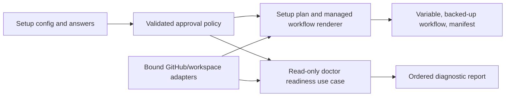

# Guarded Pull-Request Approval: Setup, Doctor, and Operations

- Status: Draft — local implementation in progress; controlled live evidence pending
- Date: 2026-09-17
- Catalog capability ID: `guarded-pull-request-approval`
- Last verified: not applicable; setup/doctor baseline inspected 2026-09-17
- Owners: Copilot product and engineering maintainers
- Scope: install, validate, diagnose, document, and safely roll back the guarded approval policy defined in [the runtime SDD](./guarded-pull-request-approval.md).
- Related issues/PRs: none linked; this is the configuration/operations companion to the runtime SDD.
- Required review gates: product UX, architecture, testing, documentation, security/operations
- Open decisions blocking readiness: none on the default; recommendation-only is the first-install choice and guarded approval requires explicit operator attestation.

## 1. Executive summary

`copilot setup` offers recommendation-only approval assessment by default for **new** installations, asks for exact test and coverage producers and an explicit source/coverage attestation, previews the effective safety policy, and installs a dedicated observer workflow. `copilot doctor` checks the installed policy, bot identity/permissions, review configuration, effective branch rules, workflow event wiring, and evidence producers without mutating repository configuration. The installed workflow uses the workflow PAT bot; the local setup PAT never becomes an approver. Existing installations without the new Variable remain off until setup explicitly provisions the policy.

```text
setup answers + repository inspection -> validated policy and exact producer names
-> preview + explicit confirmation -> backed-up managed workflow + Variable
-> default-branch installation -> workflow_run observer
doctor -> read installed contract and GitHub facts -> pass/warn/fail/skipped + one action
```

The text equivalent is: setup gathers bounded choices and remote facts, previews one plan, provisions only approved resources, and requires the generated workflow to reach the default branch; doctor later reads the same contract and reports what is ready, missing, unsafe, or unverifiable. Runtime decision semantics remain exclusively in [the runtime SDD](./guarded-pull-request-approval.md).

## 2. Problem, current behavior, and evidence

### 2.1 Problem

Simply adding an `auto-approve=true` input would make a security-sensitive action appear configured while checks might not wake it, coverage could be advisory, stale approvals might remain valid, and the supplied PAT might be the PR author. Installers need a preview of effective eligibility and a read-only diagnosis after installation. They must know when the feature is active but safely unable to approve, rather than discovering that from silence.

### 2.2 Current behavior — observed, not proposed

1. The [setup/doctor SDD](./setup-configuration-credentials-and-doctor.md) defines a typed setup configuration, immutable forward-only questionnaire, validation, plan, separate setup/workflow PAT collection, backups for changed managed files, and `pass`/`warn`/`fail`/`skipped` doctor checks. Doctor does not change repository configuration.
2. [Setup types](../src/domain/setup.ts), [defaults](../src/application/policies/setup_configuration_defaults.ts), [questionnaire](../src/application/policies/setup_questionnaire_policy.ts), [validation](../src/application/policies/setup_configuration_validation.ts), and [plan](../src/application/policies/setup_configuration_plan.ts) own the current fields/Variables/action inputs. The [workflow catalog](../src/domain/setup_workflow_catalog.ts) selects supplied files; the [workspace adapter](../src/infrastructure/setup_workspace_adapter.ts) and manifest own controlled installation.
3. The supplied [PR analysis](../setup/workflows/copilot_pull_request.yml) and [review-state workflow](../setup/workflows/copilot_pull_request_review_state.yml) are separate and both skip bot-authored events. Neither waits for a selected consumer CI workflow to finish.
4. [Authentication docs](../docs/authentication.mdx) require a runtime `PAT` Secret with Pull requests write; the setup PAT is distinct. Existing health diagnostics can validate secrets through a workflow without disclosing secret values.
5. `copilot setup` currently recommends Bugbot severity `low`, dry-run false, telemetry true ([defaults](../src/application/policies/setup_configuration_defaults.ts)); a strict no-suppressed-finding approval gate requires the new setup plan to surface and resolve that mismatch deliberately.

### 2.3 Provider evidence and limits

- GitHub's [`workflow_run` event](https://docs.github.com/en/actions/reference/workflows-and-actions/events-that-trigger-workflows#workflow_run) runs a workflow on the default branch after a named producer and can access secrets. It is a safe wakeup only if the observer never executes PR-head content. `check_run` and `check_suite` cannot be the primary trigger for Actions-generated checks ([event reference](https://docs.github.com/en/actions/reference/workflows-and-actions/events-that-trigger-workflows#check_run)).
- GitHub's [review API](https://docs.github.com/en/rest/pulls/reviews) requires Pull requests write for a fine-grained PAT; [PR authors cannot approve themselves](https://docs.github.com/en/pull-requests/how-tos/review-pull-requests/reviewing-proposed-changes-in-a-pull-request).
- Stale-approval dismissal, last-push approval, and CODEOWNERS are effective branch rules, not setup guesses ([protected branch reference](https://docs.github.com/en/repositories/configuring-branches-and-merges-in-your-repository/managing-protected-branches/about-protected-branches)). A limited PAT may be unable to inspect classic protection, so doctor must report `skipped`/unverifiable rather than pass.
- Unknown: a generic green check's internal test/coverage semantics cannot be proved from its name. Setup may validate a known workflow step structurally or require the owner to select and attest an exact producer; it must label those evidence classes honestly.

### 2.4 Retrospective classification

Not applicable: prospective capability. The observed setup/doctor baseline is not being relabeled as implemented approval functionality.

## 3. Actors, surfaces, and terminology

| Actor | Goal | Entry point | Visible surfaces |
|---|---|---|---|
| Setup owner | enable only a viable policy | interactive/non-interactive `copilot setup` | questionnaire, plan, confirmation, backup list |
| Repository administrator | manage branch protection and CI producer | GitHub settings/workflow | doctor report, rules, checks |
| Runtime bot | submit eligible approval | `PAT` Secret in observer | PR review and status card |
| Operator | diagnose missing approval | `copilot doctor`/observer dispatch | ordered checks, Job Summary |
| Maintainer | review risky or bot-authored PR | GitHub PR | recommendation and native review state |

**Configured mode** is `off`, `recommend`, or `guarded` in the versioned policy. **Effective readiness** is the current diagnosis, not a second stored mode. **Producer** is an exact workflow/check identity on the current head. **Setup PAT** is the local operator credential. **Workflow PAT** is the stored bot Secret. **Managed observer** is `copilot_pull_request_approval.yml`, distinct from PR analysis and review-state observation. **Trusted workflow** means code installed on the default branch, not a workflow file read from the PR head.

## 4. Goals, non-goals, and fixed invariants

### 4.1 Goals

1. `S1` New setup runs MUST default to `recommend`, visibly explain guarded approval's prerequisites, and offer `guarded` and `off` without concealing the choice.
2. `S2` Setup MUST install a bounded, exact event-wakeup and policy contract, with dry-run preview, explicit confirmation, backups, and no secret serialization.
3. `S3` Doctor MUST be read-only with respect to repository configuration, reuse setup validation, and identify one corrective action for every failed or unverifiable prerequisite.
4. `S4` Existing installations MUST remain approval-off until an explicit setup plan installs the versioned policy; runtime and doctor MUST fail closed on malformed/unknown policy.

### 4.2 Non-goals

1. Setup does not edit arbitrary consumer CI workflows silently; numeric coverage reporter integration is a separately reviewed step on the plan.
2. Doctor does not change branch protection, repair the Secret, dismiss reviews, dispatch a release, or approve a PR.
3. Setup cannot guarantee that every future CI run succeeds or every future PR is eligible. Doctor reports prerequisites, not an approval prediction.
4. No free-form shell snippets, arbitrary webhook URLs, branch-rule bypasses, or extra approval identities are configurable.

### 4.3 Non-configurable safety invariants

1. A missing policy Variable means `off`; neither a template fallback nor `--yes` may turn it into `guarded` implicitly at runtime.
2. Setup PAT and workflow PAT stay separate. The setup PAT is never persisted as an approval credential. A workflow PAT must resolve to a stable bot user ID and Pull requests write capability before a native approval can be considered.
3. The observer runs only trusted default-branch code; PR-head checkout, untrusted artifacts as executable input, and arbitrary PR-provided URLs are forbidden.
4. Effective stale-dismissal validation and runtime revalidation cannot be disabled by config. Failure means no native approval, even if setup previously passed.
5. Secret values, raw provider errors, and PR content are absent from plans, backup metadata, doctor reports, and documentation examples.

## 5. Current versus proposed product journey

| Stage | Current | Proposed | Effect |
|---|---|---|---|
| Setup selection | PR automation and Bugbot questions | one approval-policy stage after Bugbot | clear optional default |
| CI/coverage selection | no approval producer map | inspect rules/workflows; ask for exact test/coverage checks | no generic-green inference |
| Plan | files/Variables/Secrets and warnings | add policy digest, producer list, observer file, branch-rule readiness | reviewable safety impact |
| Confirmation | one approved plan | same confirmation; changed observer backed up | no silent overwrite |
| Installation | PR/review workflows | add separate observer, installed only when mode != off | event separation |
| Doctor | credential, file, readiness checks | add named approval checks and actionable results | diagnosable missing approval |
| Upgrade | new Action code may run | missing Variable remains off | no surprise review writes |

## 6. Functional behavior and state model

### 6.1 Setup sequence

`S5` Add a conditional `pull-request-approval` questionnaire stage after `bugbot` and before `projects`. Skip it when `features.pullRequests=false`; set policy `off` in that case. The recommended answers are `recommend`, development target, selected routine branch kinds, distinct linked issue required, fixed protected-path exclusions, and no acceptance of dismissed findings. Setup asks for exact producer tuples and an explicit operator attestation of their App identity and coverage-enforcing step; it does not silently infer coverage from a green workflow. In non-interactive mode missing explicit producer data is an error with no writes, not an invented default. The plan states that a freshly copied observer will not run until committed on the default branch.

The setup plan MUST display, in order: configured mode; PR scope and fixed exclusions; selected test/coverage producer names and source IDs; Bugbot review floor and path exclusions; effective branch-rule/stale-dismissal readiness for each selected target; workflow files and event names; runtime PAT identity/permission status; Secret/Variable names only; and a one-line outcome (`can approve after installation`, `installed but recommendation only`, or `setup blocked`). `--dry-run` performs no writes and needs no token for local-only preview, marking remote facts `unverified` rather than passing them. `--non-interactive --yes` approves only the complete plan and cannot choose an ambiguous producer or credential.

### 6.2 Doctor sequence

`S6` Doctor uses a dedicated read-only `ApprovalReadinessUseCase` sharing strict policy validation and source inspection with setup. It produces stable ordered checks:

| Check ID | Fact | `pass` | `warn`/`skipped` | `fail` |
|---|---|---|---|---|
| `approval.policy` | versioned effective Variable, mode and bounds | valid and installed | `off` intentional; remote read unavailable | invalid/unknown/drifted policy |
| `approval.workflow` | managed file on default branch and enabled `workflow_run` producers | exact rendered contract | not yet merged; API unavailable | drift/unsafe trigger/PR checkout |
| `approval.bot` | runtime Secret health, user ID, PR write | reserved for independently verifiable permission evidence | Secret healthy but future write permission unprovable read-only | Secret missing or identity invalid |
| `approval.rules` | effective selected target rules, stale dismissal, and no self-required approval Check | on/readable | access unknown or rule absent; no native approval | configured guarded but known unsafe drift or `Copilot / Approval` required |
| `approval.producers` | exact test/coverage names, App IDs, workflow paths, event wiring | unambiguous | not yet observed/unavailable | nonexistent/duplicate/mismatched producer |
| `approval.bugbot` | review enabled, telemetry complete-capable, `info` floor, dry-run off, ignored-path policy | compatible | PR workflow not installed yet | known incompatible config |
| `approval.overall` | conjunction of prerequisites | guarded viable only with verified evidence | recommendation only / disabled, including unprovable PAT write | unsafe invalid contract |

Checks are independent where possible; a failed setup PAT blocks remote probes as `skipped`, while local schema/file checks still run. `healthy` and exit behavior follow the existing doctor contract: `fail` yields nonzero; `warn` and `skipped` alone do not, but `approval.overall` never says native approval is ready when an input is unknown. Doctor links to the exact workflow, branch rules, CI run, credential-health run, or documentation action when available. It never exposes token values or raw provider prose. Runtime repeats critical checks for every PR, so a previous doctor pass is not authorization.

### 6.3 Installation/retry states

| State | Entered when | Meaning/next action | Recovery |
|---|---|---|---|
| `draft` | questionnaire collecting | no writes; choose exact producers | continue/cancel |
| `planned` | validated preview | files/resources/risks shown; confirm | approve/cancel |
| `installed-pending-default-branch` | local/remote resources written but workflow not on default branch | no event wakeups yet | commit/merge through normal repo process |
| `recommendation-only` | mode `recommend` or guarded prerequisite unknown | no native approvals | fix prerequisite or keep advisory mode |
| `ready` | policy, workflow, PAT, rules, producers, Bugbot pass, including independent live permission evidence | future eligible PRs may be approved; read-only doctor alone does not assert this state | controlled test/recheck |
| `partial` | only some approved setup writes succeed | names of completed and failed resources shown | rerun preserve-existing; backups retained |
| `disabled` | mode `off` | no observer/reviews created by feature | setup to re-enable |

Cancellation before confirmation writes nothing. If a changed managed workflow is not approved for replacement, setup preserves it and cannot claim the new feature installed. A retry compares expected bytes/digests and preserves valid resources; it does not duplicate a workflow, Variable, or Secret. Disabling stops future observations, but does not delete historical approval reviews.

## 7. User-facing configuration

### 7.1 Public contract and defaults

One top-level `pullRequestApproval` object joins `SetupConfiguration`; there is no separate redundant boolean. Setup serializes it as canonical versioned JSON in the non-secret `PR_APPROVAL_POLICY` Repository/Organization Variable and forwards it via `pr-approval-policy` Action input to the dedicated observer. The observer workflow's static `workflow_run.workflows` list is rendered from the selected exact producer **workflow names**, because GitHub workflow event filters cannot be populated from runtime Variables. The default suggested new-install policy is:

```yaml
pullRequestApproval:
  version: 1
  mode: recommend
  targetRoles: [development]
  branchKinds: [feature, bugfix, documentation, chore]
  requireLinkedIssue: true
  additionalExcludedPaths: []
  testChecks:
    - name: CI Check                 # example: selected from this repository, not universal
      sourceAppId: 15368             # example ID; setup verifies on the target repository
      workflowName: CI Check
  producerAttested: false           # change to true only after exact producer and coverage-step verification
  coverage:
    mode: check
    checkName: CI Check             # this repository's CI runs its coverage budget
  allowHumanDismissed: false
  skipWhenHumanApproved: true
```

The YAML is an example of setup config, **not** the runtime Variable representation. A meaningful alternative is the same evidence configuration with `mode: guarded` and `producerAttested: true`, which may post a native review after every runtime gate passes. `mode: off` selects no observer workflow and is the opt-out.

| Field | Type/default | Allowed values/range | Validation and scope |
|---|---|---|---|
| `version` | integer `1` | exactly 1 | unknown version fails closed; repository policy |
| `mode` | enum `recommend` for new setup | `off`, `recommend`, `guarded` | `off` selects no workflow; missing runtime Variable is off |
| `targetRoles` | array `['development']` | unique subset of `development`, `main`, 1–2 | resolved via configured branch names; no arbitrary ref |
| `branchKinds` | array routine kinds | unique nonempty subset of feature/bugfix/documentation/chore | resolve through installed issue workflow profile; no release/hotfix |
| `requireLinkedIssue` | boolean `true` | true/false | false must be explicit in setup plan |
| `additionalExcludedPaths` | `[]` | <=32 rooted globs, each <=120 chars; no negation/traversal | additive only to fixed trust-path exclusions |
| `testChecks` | selected exact tuples | 1–8 unique `(name, sourceAppId, workflowName)` | sourceAppId positive; names <=100 chars; guarded requires at least one |
| `producerAttested` | boolean `false` | true/false | guarded requires explicit operator confirmation of exact check/App/workflow and a coverage-enforcing CI step; runtime still verifies current-head evidence |
| `coverage.mode` | `check` | `check`, `numeric` | selected exact coverage producer required |
| `coverage.checkName` | selected check | one `testChecks` entry or separate exact trusted check | must be success on current head |
| `coverage.minDiffPercent` | absent | integer 0–100 only for `numeric` | not accepted with `check`; no inferred percentage |
| `coverage.artifactWorkflowName` | absent | exact installed workflow for numeric mode | path/run/head/base and artifact schema validated |
| `coverage.reporterAttested` | absent | boolean in numeric mode | guarded numeric mode requires explicit confirmation that the reporter is installed in trusted CI |
| `allowHumanDismissed` | boolean `false` | true/false | only verified human dismissals; unknown remains blocking |
| `skipWhenHumanApproved` | boolean `true` | true/false | avoids redundant bot review |

Total serialized policy <= 16 KiB; unknown keys, duplicates, malformed globs, conflicting mode/coverage fields, or source identities fail validation. Names are exact, not regex/wildcards. The fixed exclusions at least include `.github/workflows/**`, `.github/actions/**`, `.copilot/**`, `setup/workflows/**`, `action.yml`, `CODEOWNERS`, and approval-policy/observer implementation paths; setup exposes them in the plan but cannot remove them. Policy is reread for each observer invocation and fingerprinted before mutation. Repository Variables override accessible Organization Variables per existing GitHub precedence; setup config file defaults/explicit values are applied before the interactive questionnaire, while direct workflow input overrides are **not** allowed for this high-risk policy. The current `actionInputs` escape hatch MUST reject `pr-approval-policy` overrides.

### 7.2 Cross-field rules and coverage evidence

`S7` `guarded` requires PR automation, Bugbot enabled, `bugbot-dry-run=false`, telemetry enabled, severity `info`, complete review-capable workflow, at least one exact test check, a declared coverage producer, and explicit producer attestation. New setup suggests `info` Bugbot severity to make recommendation evidence complete; an explicitly configured weaker severity is never silently rewritten. The plan calls out the increase in low-severity review comments. Numeric guarded mode additionally requires an installed-reporter attestation and a live current-PR artifact before approval. If `ai-ignore-files` hides any changed code path not in a fixed/safely declared generated-only exemption, runtime withholds approval even if setup is otherwise valid.

For `coverage.mode=check`, setup either structurally verifies a selected trusted workflow job contains a coverage-enforcing step (for this repository `test:coverage` and its budget validation) or requires a clearly labeled operator attestation of that **exact** check/workflow/source. It does not invent a percentage or consider an advisory upload a gate. For `numeric`, a trusted CI workflow must publish one `copilot-diff-coverage-v1` artifact containing a <=16 KiB `copilot-diff-coverage.json` file from a successful run for the same PR/head/base; the strict data schema, math, and failure behavior are in [runtime section 7](./guarded-pull-request-approval.md#7-user-facing-configuration). Setup does not fetch arbitrary URLs or install a reporter into an unmanaged CI file without preview/approval. Numeric mode with no installed reporter is invalid for guarded mode; `recommend` may retain it as a visible unverified prerequisite.

### 7.3 Persistence and migration

`S8` Config-file schema, setup plan, Repository/Organization Variable, Action input, generated workflow, doctor reader, and runtime parser share one versioned policy codec. Setup writes the Variable after validated file/resource decisions; if remote writes fail, it reports exactly which effects remain. No policy Secret is added. For an existing repository with no Variable, runtime remains `off`; a new setup plan proposes `recommend`, offers guarded explicitly, and previews the new Variable and observer. If an old unmanaged observer file exists, setup treats it as unmanaged/changed and requires explicit approval/backup. Disabling sets policy `off` and proposes retiring only setup-owned observer files with backup under the existing manifest contract; it does not delete native reviews. Unknown future versions fail closed, not best-effort parse. No unbounded compatibility alias is introduced.

## 8. Clean Architecture design

### 8.1 Responsibilities and dependency direction

| Boundary | Owns | Must not own/import |
|---|---|---|
| Domain | strict versioned `PullRequestApprovalPolicy`, exact producer identities, protected exclusions | Octokit, terminal, YAML |
| Pure application policies | defaults, validation, canonical serialization, plan diff, doctor check projection | prompts, credentials, provider DTOs |
| Application use cases | questionnaire transition, setup plan, read-only approval readiness diagnosis | filesystem/provider mutation in doctor |
| Semantic ports | branch-rule/workflow/check/credential identity queries; managed file comparison/provisioning | raw REST URLs and tokens |
| GitHub/workspace adapters | scope-aware remote reads, health dispatch, rendered workflow, backups/manifest | risk/approval decisions |
| CLI/composition | flags and bound ports; one locale catalog per doctor report | duplicate validation/implicit defaults |
| Presentation | setup plan and doctor view models; localized messages | mutation authority |



Text equivalent: one pure versioned policy feeds both setup's provisionable plan and doctor's read-only inspection; bound adapters provide remote facts, while only setup receives mutation ports. Runtime consumes the same codec but owns per-PR eligibility and approval.

### 8.2 Trust and installed workflow contract

- Extend `SetupConfiguration`, defaults, questionnaire, validation, plan, source-action input schema, `setup_workflow_catalog`, workflow asset renderer, manifest comparison/backup path, and doctor composition. The new workflow is generated from a bounded template: only exact escaped workflow names fill its `workflow_run.workflows` list; no user-provided YAML, expression, shell, URL, or arbitrary Action reference can enter it.
- Wake on `workflow_run: completed` for the supplied `Copilot - Pull Request` analysis workflow plus each selected test/coverage workflow (deduplicate, max eight total), and `workflow_dispatch` with a positive PR number for authorized manual recheck. Manual dispatch verifies the actor's repository permission. A completion event resolves only bound same-repository PRs by validated number or exact-head lookup, then queries **all** current PR evidence; the triggering run's conclusion is not itself the approval decision. Ambiguous or absent PR association is a safe skip with a diagnostic. If a selected external non-Actions status has no supported completion bridge, setup reports that automatic reevaluation is unavailable and guarded mode cannot claim fully automatic approval until a supported producer or explicit integration is installed.
- Place the observer on the default branch with a distinct fixed name and repository-wide concurrency group, so associated and SHA-only wakeups for one PR cannot race. The source repository's installed test workflow checks out exactly `github.sha` (the trusted default-branch revision) and runs the local bundled Action; local setup and doctor compare it to `setup/source-workflows/copilot_pull_request_approval.yml` and preserve it rather than replacing it with the consumer template. Distributed workflows use the published Action reference and must be retested after release. Neither observer checks out PR head, invokes an agent, nor executes artifacts. Supply `PAT` only to the bound approval adapter. Do not share the normal PR analysis concurrency group or Check name.
- The status card and native approval events must not wake full PR analysis or recursively approve. Retain bot-actor guards for `pull_request_review`; add only the narrow analysis-only bot-actor exception described in the runtime SDD for code-change PR events. `workflow_run` itself does not assume that a bot-authored PR can be approved.
- Doctor reads branch rules using the same effective ruleset/classic aggregation approach as [merge queue readiness](./merge-queue-readiness.md), with a separate approval-specific projection. It must not reuse a `merge_queue` producer attestation as evidence of stale-approval configuration.

### 8.3 Executable architecture constraints

AST tests reject provider imports in the policy/doctor layers and mutation-port injection into doctor. Schema tests cover every public field, precedence, size, unknown version, and direct Action override rejection. Workflow validators parse installed and distributed YAML to enforce event list, exact generated names, no checkout/head code/agent/cache, no `pull_request_target`, narrow job permissions, fixed check names, and parity with the selected plan. File/manifest tests verify backup-before-replace, disable retirement, and no unmanaged overwrite. Documentation fixtures must match the codec and generated workflow examples.

## 9. UI/UX and content contract

### 9.1 Setup plan and doctor hierarchy

Setup's first view says what will be enabled, which PRs could receive a native review, and which prerequisites remain. It then shows changed files/Variables/Secret names, one confirmation, and technical details. Doctor's first line says whether native approvals can occur now; each check has stable ID, status, safe evidence, one action, and a link. Setup stays in English while creating the repository profile; doctor uses `repository-locale` (reviewed English/Spanish, complete dynamic catalog or atomic English fallback), consistent with [existing setup/doctor behavior](./setup-configuration-credentials-and-doctor.md).

Representative plan/doctor content, with examples rather than fixed repository names:

```text
Pending — Inspecting PR checks and branch rules. No changes have been made.
Selected: guarded approval for human-authored feature/bugfix/docs/chore PRs into develop.
Next: choose the exact CI check that enforces coverage.
```

```text
Action required — Two checks could be the test producer: CI Check and Unit Tests.
Choose one exact workflow/check pair. Setup will not infer a producer from a name.
No files or GitHub resources have been changed.
```

```text
Blocked — Guarded approval cannot be enabled for develop: stale approvals are not dismissed.
Enable dismissal in branch protection/rulesets, or select recommend/off.
The planned workflow and Variable remain unapplied. Inspect: Settings → Rules.
```

```text
Partial — The policy Variable was updated, but copilot_pull_request_approval.yml was not replaced.
Native approval remains unavailable because the default-branch workflow is not installed.
Rerun setup after reviewing the backed-up file; the Variable is retained.
```

```text
Complete — Guarded approval is installed and doctor found its prerequisites healthy.
Future eligible human-authored PRs can receive one bot approval after CI and Bugbot finish.
No current PR was approved during setup. Review: installed workflow and approval policy.
```

For doctor, show `pass`, `warn`, `fail`, and `skipped` text alongside semantic meaning; do not rely on color/emoji. At narrow widths, render vertically, not a wide table. Use descriptive GitHub links and one primary action. Localize human prose but not stable check IDs, config keys, workflow filenames, SHA, or source IDs. Sanitize remote rule/workflow/error text, paths, Markdown, mentions, and URLs. Secret values never appear, including in dry-run or failure output.

### 9.2 PR and notification relation

The [runtime SDD](./guarded-pull-request-approval.md#9-uiux-and-content-contract) owns the one PR card/native review/Check content. Setup and doctor do not create PR comments or approvals. The plan names the `Copilot / Approval` Check as supplemental and warns not to make it a prerequisite of itself. At most one setup confirmation and one ordered doctor report appear per CLI invocation; there is no per-check comment spam.

## 10. Failure, recovery, and cleanup

| Condition | User impact | Retained facts | Automatic retry | Required action | Cleanup |
|---|---|---|---|---|---|
| ambiguous test/coverage producer | setup cannot install guarded policy | config/preview | no | choose exact producer or recommend/off | no writes |
| stale-dismissal absent | native approval unsafe | plan/config | runtime always blocks | enable rule or choose recommend/off | no bypass |
| PAT health unavailable | bot identity/permission unknown | Secret name and existing resources | next doctor | run health/check access | no value leak |
| observer not on default branch | no automatic wakeups | copied file and Variable | after normal merge | commit/merge file; rerun doctor | no duplicate file |
| workflow file changed/unmanaged | possible unsafe drift | original file and backup | rerun after approval | inspect diff/approve replacement | backup retained |
| remote Variable succeeds, file fails | partial installation | Variable name/value digest only | preserve-existing retry | correct file issue, rerun | no silent rollback |
| unknown policy version | no native approval | raw Variable untouched | after config fix | rerun setup with supported version | no best-effort parse |
| external producer never emits wakeup | no automatic reassessment | valid CI/check evidence | manual dispatch | install supported bridge or recheck | no poll loop |

`S9` Errors follow impact → cause → action → retained state. A retry preserves successful resources and names remaining work; it does not claim installation complete because a Variable exists. Doctor never repairs state. Disabling keeps GitHub review history and may retire only setup-owned workflow files after approved backup, under existing setup cleanup rules.

## 11. Security, permissions, and privacy

The setup PAT reads repository metadata, exact workflow files, effective branch rules, and resource scopes; its existing write privileges are used only after plan confirmation. Where classic protection inspection requires Administration read, setup/doctor request only that permission and clearly mark an unreadable rule as unverifiable. The workflow PAT is stored as `PAT`, identified through metadata or a credential-health run, and needs Pull requests write for native approval plus necessary read access. No new Administration write, Secret readback, second token, or external network endpoint is required. The observer's `GITHUB_TOKEN` is read-only except any narrowly isolated Check publication permission; approval is through the bound PAT adapter.

Do not echo raw PAT, auth headers, arbitrary provider responses, PR titles/bodies, artifact content, or signed download URLs. Setup-generated YAML contains only validated workflow names and an immutable reviewed Action revision or package digest. Numeric coverage data is parsed in the trusted observer as bounded, non-executable data. An untrusted PR that changes workflow/setup/policy files is excluded from native approval, and those PR files never supply the running observer. See [GitHub secure-use guidance](https://docs.github.com/en/actions/reference/security/secure-use) for the privileged `workflow_run` boundary.

## 12. Observability and operational UX

Setup records a policy digest, selected resource names, producer identities, effective rule summaries, file decisions, and confirmation result without secrets. Doctor emits ordered `approval.*` checks and `approval.overall`, including dependency blockers and a stable reason code. Credential-health output identifies bot user ID/login and permission capability only, never Secret values. Workflow run names distinguish approval observation from PR analysis/review-state/merge-queue runs; the observer Job Summary gives exact PR/head, wakeup, evidence wait/block reason, and recheck action. Metrics aggregate install modes and doctor reasons without repository content. No background polling, repeated status comments, or silent success on unknown remote state.

## 13. Compatibility, migration, rollout, and rollback

`S10` There is no implicit migration of existing repositories: `PR_APPROVAL_POLICY` absent means off. A new setup version proposes the Variable and observer in its visible plan; new installs default to recommendation-only. Setup must not overwrite user-owned workflow files or reinterpret removed/unknown keys. Once installed, a policy-version change requires setup migration and backup rather than runtime guessing. The default `recommend` stage precedes guarded rollout in controlled repositories; live permission, branch-rule, and event-order evidence is required before the SDD status becomes Implemented. Rollback uses `mode: off` and, if desired, approved retirement of setup-owned observer workflow; already submitted GitHub approvals are historical and remain for human assessment. Reverting the Action alone must not cause an older binary to misread the new policy as another setting.

## 14. Testing strategy and numeric budget

The minimum **82 distinct setup/doctor cases** is derived from config safety, generated workflow privileges, secret identity, partial multi-resource installation, and diagnosis drift. It does not double-count the runtime SDD's 112 cases; the combined implementation floor is **194**.

| Area | Minimum cases | Required risk cases |
|---|---:|---|
| Domain/defaults/codec/validation | 20 | every field/bound, absent/unknown version, invalid combinations, precedence, explicit vs default severity |
| Questionnaire/plan/install/replay | 14 | interactive/non-interactive, ambiguous producer, cancel, backup, partial Variable/file, disable retirement |
| Doctor/adapters | 16 | all seven checks, blockedBy, PAT/rule permission denial, identity, source mismatch, no mutation |
| Workflow/render/schema/architecture | 14 | exact static workflow names, safe escaping, default-branch trigger, no PR checkout/agent/cache, package parity |
| CLI UX/localization/sanitization | 8 | five states, narrow width, en/es/dynamic fallback, hostile diagnostics, secret masking |
| Integration/security/migration | 10 | fresh vs upgrade, same bot author, producer order, numeric reporter missing, rollback, live-shaped fixtures |
| **Total** | **82** | no double counting |

Keep global 90% lines/statements, 88% functions, and 82% branches. New config codec, validation, workflow renderer, and doctor result policies MUST achieve 100% statements/branches/functions/lines; changed setup/doctor application modules MUST meet 95% lines/statements and 90% branches/functions. Use temporary workspaces, fake terminal/GitHub/health ports, deterministic IDs/clocks, no real waits or live services. YAML and manifest tests parse structure and compare exact expected outputs. Golden plan/report fixtures require semantic assertions, not snapshots alone. Manual evidence covers interactive confirmation/cancel, 80-column terminal, masked Secret prompt, real branch-rule permissions, fresh default-branch installation, and controlled `workflow_run` producer-order inversions.

## 15. Documentation and discoverability

| Audience | Artifact/page | Required content | Validation/navigation |
|---|---|---|---|
| New user | `docs/how-to-use.mdx`, `docs/quick-start.mdx`, `docs/features.mdx` | recommendation default, guarded opt-in, first PR flow, no self-approval/no auto-merge | route/index/link check |
| Setup owner | `docs/configuration.mdx`, `docs/configuration-checklist.mdx`, `docs/pull-requests/configuration.mdx` | every field/default/bound, policy Variable, producer examples, numeric artifact integration, mode alternative | examples compiled against codec fixtures |
| Security/CI owner | `docs/authentication.mdx`, `docs/pull-requests/workflow-setup.mdx` | PAT separation/permissions, default-branch observer, `workflow_run` and fork boundaries, stale rules | workflow YAML contract fixture |
| Operator | new approval troubleshooting page and `docs/security-operations/operations/troubleshooting.mdx` | doctor IDs, blocked/skipped/partial recovery, rerun, rollback, retained reviews | decision-tree/link tests |
| Contributor | `docs/development/architecture.mdx`, both SDDs | pure policy, setup/doctor/runtime ownership and trust boundary | dependency/architecture checks |

Documentation must explain that `CI Check` and source App ID in examples are repository-specific, not magic defaults. The normal path and flow diagram precede advanced config/recovery. Navigation registrations and links are part of delivery. The shipped workflow template, config example, and docs are validated against the same fixtures.

## 16. Acceptance scenarios

1. `S1`: Given a fresh interactive setup with unique inspectable CI/coverage producer and compatible Bugbot, the proposal shows `recommend` mode, exact producer, `info` review floor, observer file, Variable, branch-rule readiness, and one confirmation before writes. Switching to `guarded` requires an explicit answer and producer attestation.
2. `S1`: Given explicit `recommend` or `off`, setup does not submit approvals; `off` selects no observer, while `recommend` retains assessments.
3. `S2`: Given two plausible producers, setup asks the user to choose; non-interactive setup without a choice fails before writes even with `--yes`.
4. `S2`: Given cancellation or declined changed-workflow replacement, no unapproved file/remote resource is overwritten and backup/retained state is named.
5. `S2/S7`: Given a selected coverage check whose Codecov upload is advisory, setup does not claim a numeric threshold; numeric mode needs a valid trusted reporter.
6. `S3`: Given doctor with valid policy, readable rules, and matching workflows, ordered checks identify verified prerequisites; PAT write permission remains an explicit warning because read-only diagnosis cannot prove a future review mutation. Doctor never approves a current PR.
7. `S3`: Given invalid PAT, missing default-branch workflow, disabled stale dismissal, or missing producer, doctor names each condition and a concrete fix; no mutation port is called.
8. `S4/S8/S10`: Given an upgraded repository without `PR_APPROVAL_POLICY`, runtime remains off; fresh setup proposes `recommend` and offers guarded explicitly, without silently backfilling approvals or old PR cards.
9. `S5`: Given `features.pullRequests=false`, the approval stage is skipped and no observer/Variable that claims guarded operation is installed.
10. `S6`: Given remote API denial, local doctor checks still run, dependent remote checks are `skipped`, and overall never claims readiness.
11. `S7`: Given explicit `bugbot-severity=low` and guarded mode, setup reports the conflict and requires a choice rather than silently raising review severity.
12. `S9`: Given Variable write success but workflow copy failure, setup reports partial retained state; a retry preserves the Variable, backs up only approved changed files, and converges.
13. Given hostile workflow names, policy JSON, provider error text, or PR payload, generated YAML cannot inject an expression/command, and plan/doctor never expose raw tokens or unsafe links.
14. Given English, Spanish, or invalid dynamic locale, doctor emits one complete catalog with stable IDs and no mixed-language fallback or color-only signal.
15. Given selected CI and Bugbot producer completions in either order, the observer is awakened after each, queries all current evidence, and can approve only after the final required fact; `check_run` is not relied upon.
16. Given the approval Check is configured as required, setup and doctor report the dependency cycle and runtime posts no approval.

## 17. Requirements traceability

| Requirement | Policy/use case/adapter/presentation | Test/evidence | Documentation |
|---|---|---|---|
| `S1/S5`, default and stage | defaults + questionnaire policy | wizard/default/explicit-choice cases | quick start/configuration |
| `S2/S8`, managed install | plan/codec/workflow renderer/workspace adapter | cancel/backup/partial/YAML/manifest fixtures | workflow setup/upgrade |
| `S3/S6`, read-only diagnosis | approval readiness use case + doctor report policy | seven-check/mutation-denial cases | troubleshooting |
| `S4/S10`, safe migration | runtime missing-policy default + setup plan | absent/unknown config and upgrade fixtures | upgrade/configuration |
| `S7`, evidence prerequisites | pure validation + remote producer queries | severity/coverage/source/rule matrix | auth/configuration |
| `S9`, partial truth | setup provisioning workflow + presenter | Variable/file failure/replay tests | recovery guide |
| observer trust | workflow catalog/renderer + composition | parsed YAML, AST/security, live event order | security/architecture |
| locale/noise | plan and doctor view models | en/es/fallback, narrow/golden fixtures | CLI/doctor docs |

## 18. Implementation sequence

1. Ratify both SDDs and the default scope, then add catalog entry and failing schema/workflow fixtures.
2. Implement the versioned policy codec/defaults/validation/questionnaire/plan; add explicit producer selection and severity conflict behavior.
3. Add bounded managed observer rendering, workflow catalog selection, file comparison/backups/manifest and strict Action input/Variable mapping.
4. Add read-only doctor queries and stable checks, extend credential-health with bot identity/permission status without exposing Secret values.
5. Implement runtime decision and approval use case from [the runtime SDD](./guarded-pull-request-approval.md); wire the narrow bot-actor PR analysis exception and loop guards.
6. Add setup/doctor/PR presentation and all documentation together with fixtures; run workflow, architecture, package, docs, and specification validation.
7. Capture controlled installation, default-branch event, branch-rule, human/bot PR, and rollback evidence; update both SDDs/catalog only when implementation is verified.

## 19. Definition of Done

- [ ] Every `S1`–`S10` and normative requirement has observable acceptance and traceability.
- [ ] New setup defaults to recommendation-only for fresh installations; guarded requires explicit attestation, existing missing-policy installations remain off, and invalid config fails closed.
- [ ] Setup's workflow/Variable/Secret plan, confirmation, backup, retry, disable, and partial states are proven; doctor has no repository mutation port.
- [ ] At least 82 distinct setup/doctor cases and stated coverage thresholds pass, in addition to the runtime SDD's 112 cases.
- [ ] Workflow event, default-branch trust, no PR-head execution, PAT separation, strict producer identity, and effective stale-rule checks pass automated and controlled live evidence.
- [ ] Pending, action-required, blocked, partial, and complete setup/doctor UX is localized, accessible, narrow-width readable, sanitized, and secret-free.
- [ ] User/setup/operator/security/contributor documentation, navigation, examples, and migration/rollback instructions are implemented and validated.
- [ ] `pnpm run generate:specifications` and `pnpm run validate:specifications` pass; implementation also passes test/coverage, lint, workflow, architecture, docs, build, and package gates.
- [ ] No readiness-blocking decision remains and both SDD statuses reflect verified implementation, not intent.

## 20. References and decisions

- Primary sources: [GitHub reviews API](https://docs.github.com/en/rest/pulls/reviews), [Actions events](https://docs.github.com/en/actions/reference/workflows-and-actions/events-that-trigger-workflows), [secure workflow use](https://docs.github.com/en/actions/reference/security/secure-use), [protected branch rules](https://docs.github.com/en/repositories/configuring-branches-and-merges-in-your-repository/managing-protected-branches/about-protected-branches).
- Related repository specs: [runtime approval](./guarded-pull-request-approval.md), [setup/doctor baseline](./setup-configuration-credentials-and-doctor.md), [PR lifecycle](./pull-request-lifecycle-and-enrichment.md), [Bugbot reconciliation](./bugbot-review-state-reconciliation.md), [merge queue readiness](./merge-queue-readiness.md).
- Decision: one mode field, one versioned non-secret Variable, one generated trusted observer, exact selected producer identities, and no default-on migration. Rejected: arbitrary YAML injection, a simple `auto-approve=true`, silent CI selection, treating advisory Codecov upload as a numeric gate, and automatic branch-rule changes by doctor.
- Follow-up outside scope: automatic merge and generic external status webhooks. The documented manual recheck remains the recovery route for a producer without a supported completion bridge.
