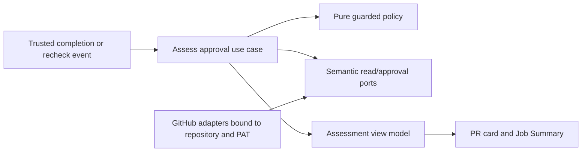

# Guarded Pull-Request Approval

- Status: Draft — local implementation in progress; controlled live evidence pending
- Date: 2026-09-17
- Catalog capability ID: `guarded-pull-request-approval`
- Last verified: not applicable; current-state evidence inspected 2026-09-17
- Owners: Copilot product and engineering maintainers
- Scope: decide whether the workflow PAT's bot may submit one native GitHub approval for a verified pull-request revision, and explain every other outcome.
- Related issues/PRs: none linked; the setup/doctor contract is in [the companion SDD](./guarded-pull-request-approval-setup-and-doctor.md).
- Required review gates: product UX, architecture, testing, documentation, security/operations
- Open decisions blocking readiness: none in this proposal; reviewers must approve the default risk boundary before implementation.

## 1. Executive summary

New setup installations default to `recommend` assessment mode and offer `guarded` approval explicitly. Copilot may submit a native `APPROVE` review only for an eligible human-authored, same-repository PR when independent CI, declared coverage evidence, complete Bugbot evidence, human review state, effective branch rules, and the current head all agree. Otherwise it publishes one intelligible recommendation or blocker. This is **not** auto-merge or an AI assertion of correctness. GitHub may count the bot's review toward a generic minimum approval count; teams requiring independent human review must enforce that separately through branch governance.

```text
PR/head changes -> independent checks and Bugbot finish -> trusted approval observer wakes
-> read current PR, effective rules, checks, coverage, findings, reviews
-> pure guarded decision -> re-read head/base and bot reviews
-> eligible: one APPROVE for that head; otherwise: one bounded explanation
-> later head/rule/evidence change: reevaluate, never reuse an old decision
```

The observer runs trusted default-branch code and never checks out or executes PR-head code. The approval operation uses the workflow PAT, not the local setup PAT. GitHub's [review API](https://docs.github.com/en/rest/pulls/reviews) supports `APPROVE`, a target `commit_id`, and a fine-grained PAT with Pull requests write permission. GitHub [forbids PR authors from approving their own PRs](https://docs.github.com/en/pull-requests/how-tos/review-pull-requests/reviewing-proposed-changes-in-a-pull-request).

## 2. Problem, current behavior, and evidence

### 2.1 Problem

Maintainers already see a useful Bugbot `state:ready` signal but must manually reconcile it with CI, test coverage, native review requirements, and freshness. A clean model result alone is not a safe approval: Bugbot may have partial context, a configured severity floor or ignored paths; tests may still be pending; and the PR may move after analysis. Conversely, a fully verified routine PR can wait unnecessarily for the bot's native approval.

### 2.2 Current behavior — observed, not proposed

1. [PR capabilities](../docs/pull-requests/capabilities.mdx) define `state:ready` as readiness for human action. Bugbot writes review snapshots, one status card, lifecycle labels, a Job Summary, and `Copilot / Review` Check; partial evidence must not claim ready.
2. The [Bugbot review-state SDD](./bugbot-review-state-reconciliation.md) makes the exact-head, read-after-write projection authoritative; review bodies, labels, and Checks are derived surfaces. The review comment adapter currently submits `COMMENT`, not `APPROVE` ([adapter](../src/data/repository/pull_request/pull_request_review_comment_command_repository.ts)).
3. The [supplied PR workflow](../setup/workflows/copilot_pull_request.yml) runs on code-change PR events, skips fork heads and bot-actor events, and has no check-completion approval observer. [Review-state observation](../setup/workflows/copilot_pull_request_review_state.yml) is separate.
4. The [CI workflow in this repository](../.github/workflows/ci_check.yml) runs `test:coverage`; its Codecov upload is advisory (`continue-on-error`), so a green CI job does not prove an arbitrary numeric diff-coverage percentage.
5. [Authentication](../docs/authentication.mdx) separates the local setup PAT from the runtime `PAT` Secret. The runtime PAT already calls for Pull requests read/write; the setup PAT must never become a second approving identity.

### 2.3 External evidence and unknowns

- GitHub [can dismiss stale approvals](https://docs.github.com/en/repositories/configuring-branches-and-merges-in-your-repository/managing-protected-branches/about-protected-branches) after the diff changes, and can separately require a reviewer other than the latest pusher. Those effective rules must be inspected, not assumed.
- Actions [`check_run` and `check_suite` events](https://docs.github.com/en/actions/reference/workflows-and-actions/events-that-trigger-workflows#check_run) do **not** trigger workflows for check suites made by GitHub Actions; `workflow_run: completed` does. A `workflow_run` observer has access to secrets, so [GitHub's secure-use guidance](https://docs.github.com/en/actions/reference/security/secure-use) requires strict separation from untrusted PR code/artifacts.
- GitHub API mutations are not atomic with a concurrent push. This design requires a before-write head/base guard, a review pinned to `commit_id`, a post-write read, and effective stale-approval protection. It does not claim impossible cross-API atomicity.
- Unknown: exact branch-rule/coverage-producer availability varies by consuming repository. Missing or ambiguous evidence means recommendation only, never an inferred pass.

### 2.4 Retrospective classification

Not applicable: this is a prospective feature. Section 2.2 is an observed baseline, not an as-built description of approval behavior.

## 3. Actors, surfaces, and terminology

| Actor | Goal | Entry point | Visible surfaces |
|---|---|---|---|
| PR author | know whether bot approval is possible and what to fix | open/push/ready-for-review | PR approval card, native review, checks |
| Human reviewer or code owner | retain independent judgment | GitHub review | native review state, approval card |
| Setup owner | set risk and evidence policy | `copilot setup` | plan and doctor report |
| Operator | recover missed or failed observation | approval workflow dispatch | Job Summary, PR card |
| Workflow PAT bot | approve only verified human PRs | trusted observer | one native `APPROVE` per eligible head |

**Approval assessment** is Copilot's explainable decision for a particular PR head and base. **Native approval** is GitHub's submitted `APPROVE` review, not a label or Check. **Evidence** is a complete, source-bound current-head fact; a PR body, label, model text, or old review is not evidence. **Current head** is the exact PR head SHA read from GitHub. **Effective target policy** combines applicable rulesets and classic protection. **Coverage check mode** means a named CI check asserts a repository-owned coverage budget, not that Copilot knows a percentage. **Numeric mode** consumes the bounded attestation defined in section 7.

## 4. Goals, non-goals, and fixed invariants

### 4.1 Goals

1. `A1` Copilot MUST approve only an exact-head eligible PR with complete, independent evidence and a valid bot identity.
2. `A2` Copilot MUST provide a current, actionable reason when it waits, recommends human review, or cannot safely decide.
3. `A3` Duplicate, delayed, canceled, and retried events MUST converge without duplicate approval spam or stale success.
4. `A4` New installations MUST offer guarded approval but default to recommendation-only assessment; old installations cannot begin approving merely by upgrading the Action.

### 4.2 Non-goals

1. No automatic merge, queue enrollment, branch-rule bypass, CODEOWNERS substitution, or human review dismissal.
2. No model-generated approval decision and no interpretation of natural-language comments as authorization.
3. No universal promise that a passing arbitrary check proves test or coverage quality.
4. No approval of fork PRs, bot-authored PRs, deployment/release/hotfix/reconciliation PRs, or PRs modifying approval trust boundaries.

### 4.3 Non-configurable safety invariants

1. The setup PAT is never used at runtime; the workflow PAT identity MUST differ from the PR author. A bot-authored PR receives a recommendation for a human reviewer.
2. The approval observer MUST run trusted default-branch code with no PR-head checkout, scripts, cache restoration, executable artifacts, or agent invocation; untrusted PR text is bounded data only.
3. Missing, failed, canceled, skipped, neutral, ambiguous, partial, superseded, or wrong-SHA mandatory evidence MUST NOT approve. Neither `state:ready` nor `bugbot-fail-on-unresolved=false` weakens this gate.
4. Effective stale-approval dismissal MUST be enabled and inspectable for the target before submitting a native approval; otherwise Copilot stays in recommendation mode. No config may disable the runtime check.
5. GitHub remains the authority for whether a review counts toward merge requirements. Copilot never claims that its approval satisfies all required reviews.

## 5. Current versus proposed product journey

| Stage | Current | Proposed | User/operator effect |
|---|---|---|---|
| Open/push | PR workflow begins review; CI independent | approval observer waits for declared producer completions | no premature approval |
| Bugbot complete | clean projection may say `state:ready` | exact-head finding and coverage completeness become inputs, not the decision | one consistent meaning |
| CI complete | GitHub shows check conclusions | observer rereads checks and branch rules, then computes all blockers | clear reason when not approved |
| Eligible | maintainer manually synthesizes evidence | bot emits one native approval pinned to current head | routine PR can progress |
| Ineligible | maintainer investigates multiple surfaces | one stable card names primary action and evidence links | fewer opaque waits |
| New push | previous Bot/Check state may look current | pending card replaces current claim; fresh evidence required | no stale green |

Text equivalent of the overview flow in section 1: a PR event starts independent work; trusted completion events prompt a full re-read; a pure decision either submits one native review or publishes a non-approval explanation; every later revision starts a new decision.

## 6. Functional behavior and state model

### 6.1 Decision order

`A5` The pure policy evaluates all independently observable reasons and chooses one primary reason in this order: disabled/unsupported scope; identity and branch-rule safety; PR revision drift; required evidence unavailable; evidence failed or findings present; human change request; eligible. The card may list up to four secondary reasons, but it has one primary next action. Scope may be `recommend` while still showing a quality assessment.

For `guarded`, the fixed prerequisites are:

1. Open, non-draft, same-repository PR; configured target role, branch kind, and optional distinct linked issue match. The author and current workflow PAT user are resolved by immutable GitHub user ID and differ. No excluded trust-boundary path changed; file pagination must be complete. Release/hotfix/reconciliation and bot-authored PRs never receive native approval even if a pattern matches.
2. Effective target rules are readable and require dismissal of stale approvals. The branch's required status producers are enumerated with source identity. If `Copilot / Approval` itself is configured as a required check, the configuration is invalid and approval blocks; it is never silently removed from the rule set to break a cycle. Required test and declared coverage producers are selected by setup, not guessed from a label.
3. Each required status/test/coverage producer has exactly one authoritative latest attempt with `success` for the current PR revision; pending, `neutral`, `skipped`, duplicate/ambiguous, missing, or a result from an unexpected App is not sufficient. GitHub `pull_request` workflows normally attach checks to the synthetic merge commit, not the head SHA. The observer reads `merge_commit_sha` and requires its two commit parents to be the current base SHA and head SHA before using its checks; a missing/unverified merge ref blocks approval. Checks attached directly to the head are accepted only when no verified test-merge check exists for that selected producer. The observer maps Check Run IDs through the current workflow-run attempt's jobs so an older rerun result cannot authorize or mask the latest attempt. A latest failed test-merge retry supersedes an older head success. A selected producer that cannot be observed has a named blocker.
4. Bugbot has one valid complete current-head telemetry/projection, no dry-run/partial/superseded/unknown state, full in-scope changed-file coverage, and zero `open`, `reopened`, `verification-required`, `unknown`, or — by default — human-`dismissed` findings. Any filtered code path not explicitly classified as safe generated output blocks. Approval mode requires `bugbot-severity=info`; otherwise the card says the review floor hides possible findings.
5. Native human review state is paginated and current. Any active human `CHANGES_REQUESTED` blocks. A pending code-owner review is never claimed satisfied; GitHub continues to enforce its rule. If existing human approvals already satisfy the effective policy, the default is not to add a redundant bot approval.
6. Immediately before `APPROVE`, the use case re-reads PR head/base, effective rule fingerprint, current evidence identifiers, bot identity, and bot reviews. A mismatch returns `superseded`; the review API receives the captured head as `commit_id`. After submission it re-reads the PR and exact review ID to report `approved`, `superseded-after-submit`, or `publication-unknown` truthfully.

### 6.2 Alternative paths

- `recommend` computes the same assessment but performs no native approval. `off` performs no assessment/publication and installs no observer.
- Bot-authored PRs, including Action-managed PRs opened with `PAT`, may show a human-ready recommendation after complete analysis but never a native bot approval. The existing bot-actor skip must gain a narrowly scoped same-repository `opened`/`reopened`/`synchronize` **analysis-only** exception; bot-authored review/metadata events remain loop-guarded. The approval observer itself does not run Bugbot.
- A human dismisses a Bugbot finding: the default still asks for human review. An explicit `allowHumanDismissed=true` may treat only a verified human-resolved/dismissed record as non-blocking; `verification-required` and `unknown` are never bypassable.
- A docs-only PR may be exempted from numeric line coverage by an explicit complete file classification, but still needs configured documentation/CI checks and Bugbot evidence. A changed code file with zero measurable changed lines is not automatically exempt.
- A requested reviewer who is also the workflow PAT bot is removed from candidate assignment if approval mode is enabled; the approval use case does not infer consent from a review request.

### 6.3 State machine, replays, and cancellation

| State | Entered when | Visible meaning | Next | Recovery owner |
|---|---|---|---|---|
| `pending` | current-head producer running/missing | waiting for named evidence; no approval | assessed/blocked/superseded | automatic completion/manual recheck |
| `recommend` | quality assessed but policy/identity excludes native approval | human review next | pending/approved only after new eligible state | human reviewer |
| `blocked` | failing/unsafe/unknown evidence | no approval; named action | pending/assessed | author or setup owner |
| `eligible` | pure decision passes before mutation | transient; not advertised as approved | approved/partial/superseded | observer |
| `approved` | native review read back for current head | bot approved this revision; GitHub rules still apply | pending/superseded after change | GitHub/observer |
| `partial` | review may have been posted but confirmation/card failed | exact retained review ID/status shown | approved/blocked after read-first retry | operator |
| `superseded` | PR head/base/rules/evidence moved | old run cannot approve current state | pending | new event/recheck |

`A6` The single observer concurrency group is repository-wide; this intentionally trades throughput for stable serialization when some `workflow_run` payloads omit the PR number and others include it. No full PR analysis shares that lane. A `workflow_run` wakeup resolves associated open PRs by validated payload PR numbers, then by an exact-head same-repository API lookup when the payload omits them; it rejects ambiguous matches and never trusts an event URL. Manual dispatch takes one positive PR number and checks the dispatch actor's repository permission. Every resolved PR is reread against its current head; a stale `workflow_run` is a wakeup, not evidence. Replays first list all bot reviews, normalize by bot ID and `commit_id`, and never create a second approval for the same head if one already exists. A bot approval dismissed by a maintainer on that same head is a human decision: replay reports human review needed and does not reapprove. If an older approval is not dismissed despite a changed diff, the rule guard blocks future native approval and reports the unsafe branch policy. A cancellation before mutation leaves only pending/recommend state. A cancellation after mutation is repaired by read-first replay. No bot approval is automatically dismissed: dismissal can require privileges not granted to the runtime PAT.

## 7. User-facing configuration

The canonical, versioned configuration and setup surface are specified in [the companion SDD](./guarded-pull-request-approval-setup-and-doctor.md). The runtime consumes one `PR_APPROVAL_POLICY` JSON value, forwarded through one `pr-approval-policy` Action input. Missing value means `off` for safe upgrades; a fresh `copilot setup` proposes `recommend` by default and offers `guarded` explicitly. Repository Variable overrides an accessible organization Variable; PR content and event inputs never override either. Invalid versions or unknown keys fail closed.

| Field | Type/default in new setup | Bounds and behavior | Snapshot/reread |
|---|---|---|---|
| `mode` | enum `recommend` | `off`, `recommend`, `guarded` | read every observer run; fingerprint before mutation |
| `targetRoles` | `['development']` | subset of `development`, `main`; never inferred from PR title | re-evaluate exact base and rules |
| `branchKinds` | `['feature','bugfix','documentation','chore']` | nonempty subset; deployment kinds prohibited | read each run |
| `requireLinkedIssue` | boolean `true` | false only by explicit setup choice; no PR-number fallback | read each run |
| `additionalExcludedPaths` | `[]` | 0–32 safe rooted globs, each <= 120 chars; additive to fixed exclusions | read each run |
| `testChecks` | setup-selected | 1–8 exact `(name, sourceAppId, workflowName)` tuples in guarded mode | current-head query every run |
| `producerAttested` | `false` | explicit confirmation of exact producer identity and coverage-enforcing step; required for guarded | read each run |
| `coverage` | `{mode:'check'}` | `check` uses an exact trusted producer; `numeric` additionally requires `minDiffPercent` integer 0–100 and one trusted artifact producer | current-head evidence every run |
| `coverage.reporterAttested` | `false` in numeric mode | explicit confirmation that the bounded reporter is installed in trusted CI; required for guarded numeric | read each run |
| `allowHumanDismissed` | `false` | boolean; cannot override unknown/verification-required | read each run |
| `skipWhenHumanApproved` | `true` | boolean; avoids redundant notifications | read each run |

The numeric attestation schema is fixed: `version=1`, repository ID, PR number, head SHA, base SHA, workflow run ID/attempt, `coveredChangedLines`, and `totalChangedLines` (safe nonnegative integers, covered <= total). Copilot recomputes the percentage; artifact <= 16 KiB; only one artifact from the configured exact workflow path and successful current-head run is accepted. A changing base invalidates the attestation. No URL, arbitrary expression, script, or secret is configurable. Missing/invalid artifact blocks, not a zero-percent guess. The artifact is CI evidence, not an independent security boundary against a malicious contributor who controls test code. The default `check` mode makes only the narrower assertion that a declared coverage-enforcing check passed; it never displays a fabricated percentage.

Recommended first-install policy: `recommend` on the development target with linked feature/bugfix/docs/chore branches, exact test/coverage producers, and fixed trust-path exclusions. After controlled evidence and operator attestation, `guarded` enables native reviews. `off` is the explicit opt-out.

## 8. Clean Architecture design

### 8.1 Responsibilities and dependency direction

| Boundary | Owns | Must not own/import |
|---|---|---|
| Domain `pull_request_approval` | immutable assessment facts, states, reason priority, freshness/idempotency invariants | Octokit, Actions, Markdown |
| Application policy/use case | evaluate snapshot, orchestrate read/guard/submit/readback, semantic error mapping | provider DTOs or workflow YAML |
| Semantic ports | exact PR/rules/checks/coverage/findings/reviews/identity queries and one approval command | token, REST paths, GitHub types |
| GitHub adapters | pagination, provider IDs, REST review `APPROVE`, provenance, 403/422/rate-limit mapping | eligibility decisions |
| Composition/entrypoint | bind immutable repository identity and PAT; translate trusted wakeup to PR number | model judgment or direct review mutation |
| Presentation | one assessment view model for card, Job Summary, and optional approval Check | provider writes or state transitions |



Text equivalent: a trusted event invokes the application use case; it gathers semantic facts from bound GitHub adapters, passes them through one pure policy, performs at most one guarded approval mutation, and renders one shared assessment on user surfaces.

### 8.2 Trust, state, and contract ownership

- Reuse the Bugbot **final projection** contract; do not parse PR card prose or trust `state:ready` as source. Distinguish complete in-scope review from partial context and the configured severity floor.
- The authoritative approval state is GitHub's native reviews. The PR assessment card is a derived, marker-bounded cache keyed by repository ID, PR number, head SHA, base SHA, policy digest, and selected evidence IDs. No separate database is required.
- The use case receives a bounded `ApprovalObservationRequest {repositoryId, pullNumber, wakeupKind}`. It fetches all facts itself; event-supplied check conclusions, URLs, paths, actor names, and artifacts are never authority.
- The write port receives `{repositoryId, pullNumber, headSha, sanitizedBody}`. The adapter binds the PAT and validates that returned review state/user/commit match; `403`, `422`, secondary rate limit, and unknown response become typed partial/blocked results.
- The approval observer must have its own route/composition and check name, not reuse the full PR workflow's `Copilot / Review` Check or replace its current-head telemetry.

### 8.3 Executable constraints

AST dependency tests MUST reject domain/application imports from Octokit, `@actions/*`, filesystem/process, and presentation; mutation adapter imports are permitted only in composition. Workflow contract tests MUST parse YAML and prove default-branch-only trusted execution, no PR-head checkout/agent/`run` of untrusted strings, narrow permissions, exact event filters, no `check_run`/`check_suite` dependency, and no check-name collision. Schema tests MUST reject unknown/oversized policy, attestation, or event payloads. Existing repository architecture and cycle validators remain mandatory.

## 9. UI/UX and content contract

### 9.1 Primary surface and states

One marker-bounded **Copilot approval assessment** card in the PR conversation is the primary explanation; edit it in place, never add a success comment per run. The native GitHub approval is the approval authority. `Copilot / Approval` is a supplemental exact-head Check, with `neutral` for recommendation/pending, `failure` for invalid system evidence, and `success` only after current-head native approval is confirmed. It MUST NOT be configured as its own required check or be counted as a prerequisite. The card starts with status, completed facts, next action, impact, and links; technical IDs are collapsed.

Representative English-default content (Spanish is bundled; other configured locales use the repository's complete-catalog fallback contract):

```markdown
<!-- copilot:approval-assessment:v1 -->
### Copilot approval · waiting for checks
No approval has been submitted for `abc1234`.
Bugbot finished a complete review; `CI Check` is still running.
Next: Copilot will reassess when CI finishes. No action is needed now.
[Review check](https://github.com/owner/repo/actions/runs/123)
```

```markdown
### Copilot approval · human review needed
No bot approval was submitted for `abc1234`: this PR was opened by the bot account.
Tests and Bugbot are complete. Next: ask a human reviewer to decide.
[See evidence](https://github.com/owner/repo/pull/42/checks)
```

```markdown
### Copilot approval · blocked
No approval was submitted for `abc1234`: the coverage producer did not report for this head.
Next: rerun `CI Check` or correct its configured producer in `copilot setup`.
The existing PR and review history are unchanged. [Inspect CI](https://github.com/owner/repo/actions/runs/123)
```

```markdown
### Copilot approval · publication incomplete
GitHub accepted review `987` for `abc1234`, but Copilot could not refresh this card.
The review remains in GitHub. Next: rerun the approval observer; it will read that review before any write.
[Open review](https://github.com/owner/repo/pull/42#pullrequestreview-987)
```

```markdown
### Copilot approval · approved
The bot approved `abc1234` after `CI Check`, declared coverage, and a complete Bugbot review passed.
GitHub still applies configured branch rules. A bot review can count toward a generic approval minimum; enforce independent human review separately if required. No automatic merge was started.
[Open approval](https://github.com/owner/repo/pull/42#pullrequestreview-987) · [See checks](https://github.com/owner/repo/pull/42/checks)
```

The review body itself is concise: `Copilot approved this revision (abc1234): CI Check and the configured coverage gate passed; Bugbot finished with no blocking findings. GitHub still applies branch rules; a bot review may count toward a generic approval minimum.` It includes a stable machine marker and evidence links, not raw model text or arbitrary CI output.

### 9.2 Navigation, accessibility, and noise

Cards are <= 1,800 rendered characters with at most four secondary reasons and one primary action. Use logical headings, text states (not color/emoji alone), descriptive same-repository links, and short lines readable at narrow/mobile widths. Escape Markdown, mentions, HTML markers, commands, paths, and URLs from all PR and provider data. No new issue comment or lifecycle label is necessary; `state:ready` keeps its current human-action meaning. At most one bot native approval per head, one card per PR, one approval Check per verified head, and one bounded Job Summary per run. A stale run cannot overwrite a newer card.

## 10. Failure, recovery, and cleanup

| Failure/partial state | User impact | Retained facts | Automatic retry | Required action | Cleanup |
|---|---|---|---|---|---|
| CI/Bugbot pending | no approval yet | current PR and pending card | producer completion | none unless stuck | no review |
| missing/ambiguous current-head evidence | recommendation only | raw GitHub checks/reviews | bounded reread; next event | fix named producer/recheck | no review |
| branch rules unreadable or stale dismissal off | recommendation only | existing PR/reviews | next event | setup owner fixes rules/permissions | no bypass |
| head/base moves before submit | old run stops | new head | new event | none | old card cannot claim current |
| review POST returns ambiguous timeout | possible native approval | result `publication-unknown` | read-first retry | recheck if not converged | never blindly repost |
| review accepted, card/Check fails | native approval remains | review ID and current-head facts | read-first retry | rerun observer | do not dismiss review |
| PAT `403`/`422` | no confirmed approval | assessment/card | after credentials fixed | run doctor/replace PAT | no secret in logs |
| rate limit | no confirmed new approval | existing review/evidence | bounded `Retry-After` | later recheck if exhausted | no repeated comments |

`A7` Every error presentation follows impact → cause → one action → retained state. A partial outcome never says approval failed if GitHub accepted it. Rollback of an already submitted review is not automatic; disabling the feature stops new approvals and leaves native review history for a maintainer to assess.

## 11. Security, permissions, and privacy

`A8` The workflow PAT needs only the already documented Pull requests write plus read permissions needed for PR/check/rule queries; an independently privileged setup PAT never enters Actions. Use the job-local `GITHUB_TOKEN` for read-only Checks metadata where appropriate, but never let `GITHUB_TOKEN` substitute the bot identity for native approval. GitHub documents that most [`GITHUB_TOKEN`-created events do not start new workflows](https://docs.github.com/en/actions/reference/workflows-and-actions/events-that-trigger-workflows), another reason not to conflate credentials.

The privileged observer uses an immutable, reviewed Action revision or installed package digest from the trusted default branch and no PR checkout, downloaded executable artifact, shared untrusted cache, or shell interpolation from the event. Numeric artifacts are parsed as bounded data with workflow/repository/run/head provenance; only supported same-repository PRs are assessed. Exact bound owner/repository and positive PR number determine every API target. Secrets, token values, raw provider errors, full PR text, and raw model output never enter card, Check, Job Summary, telemetry, or logs. Policy digest and provider IDs are safe technical details. A PR changing protected workflow, approval policy code, setup/workflow templates, or CODEOWNERS cannot approve itself.

## 12. Observability and operational UX

The observer Job Summary records wakeup, PR, head/base, configured/effective mode, all reason codes, selected producer identities and conclusions, Bugbot completeness, native-review result, card/Check publication, and one recovery action. A privacy-safe metric counts `approved`, `recommend`, `pending`, `blocked`, `superseded`, and `partial` by reason, without PR content. Correlate with repository ID, PR number, head SHA, workflow run ID/attempt, and optional GitHub review ID. Pending external checks are not a workflow failure. System/permission/unknown evidence is a failure; ineligible author/scope is a neutral recommendation. No new generic recap comments are posted.

## 13. Compatibility, migration, rollout, and rollback

`A9` Runtime absence of `PR_APPROVAL_POLICY` means `off`, even though fresh setup defaults to `recommend`; upgrading an existing consumer must not silently issue approvals. Existing Bugbot `COMMENT` reviews remain historical and are never rewritten into approvals. Already approved PRs are read before any new write; the feature does not backfill old PRs on install without an explicit recheck. Rollout sequence: recommendation-only assessments in controlled PRs, then `guarded` after setup/doctor pass and live race evidence. Rollback sets `off` or restores the prior managed workflow backup; it cannot revoke native reviews already submitted. No parallel legacy policy or indefinite dual reader is allowed.

## 14. Testing strategy and numeric budget

The minimum **112 distinct cases** derives from five high-risk boundaries: authorization, stale approval, multi-provider evidence, non-atomic review writes, and privileged event handling. Parameter rows count separately only for distinct behavior.

| Area | Minimum cases | Required risk cases |
|---|---:|---|
| Domain/eligibility and config | 30 | every reason precedence; author/bot/last-pusher; scope; exclusions; completeness; coverage modes; human reviews |
| Application/state/idempotency/races | 24 | duplicate/out-of-order wakeups, head/base/rule movement at each guard, cancellation before/after POST, read-first replay |
| GitHub/coverage adapters | 16 | pagination, exact App/source/attempt, malformed artifact, 403/422/timeout/rate limit, review readback |
| Workflow/schema/architecture | 14 | `workflow_run` producers, trusted default-branch code, no PR checkout/cache/agent, loop guard, permissions, no check collision |
| UI/localization/accessibility/sanitization | 12 | five primary states, one action, en/es/fallback, hostile links/mentions/markers, narrow output |
| Integration/security/migration | 16 | human/bot PRs, full Bugbot projection, numeric producer, stale rules, fresh vs absent config, rollback, live-shaped replay |
| **Total** | **112** | no double counting |

Global Jest gates remain 90% lines/statements, 88% functions, and 82% branches ([configuration](../jest.config.js)). New pure decision/schema/renderer modules MUST reach 100% statements/branches/functions/lines; changed application/adapters MUST meet at least 95% lines/statements and 90% branches/functions. Tests use deterministic clocks, fake GitHub ports, recorded but sanitized webhook/review fixtures, no sleeps or live mutations. Contract tests parse YAML and JSON rather than grep prose; golden Markdown is paired with semantic assertions. Controlled live evidence MUST cover human-owned approval, bot-owned recommendation, a post-approval push under stale-dismissal rules, and check-order inversion; manual review covers desktop/mobile, light/dark, and screen-reader reading order.

## 15. Documentation and discoverability

| Audience | Required artifact | Content | Validation/navigation |
|---|---|---|---|
| PR author/reviewer | `docs/pull-requests/capabilities.mdx`, new approval page, `docs/features.mdx` | meaning of approval vs `ready`, bot/self cases, five states, no auto-merge | routes and link checker |
| Setup owner | `docs/pull-requests/workflow-setup.mdx`, `docs/authentication.mdx` | PAT identity, workflow triggers, protected paths, stale rules, producer provenance | examples checked against workflow/config fixtures |
| Operator | Bugbot failure/troubleshooting and new approval recovery section | partial POST, missed producer, recheck, disable/rollback | decision-tree tests |
| Contributor | `docs/development/architecture.mdx`, both SDDs | policy/port/adapter boundaries and trust model | architecture check |

Docs lead with the normal journey and a text-equivalent flow before internals. The companion SDD owns complete setup/doctor and configuration reference deliverables.

## 16. Acceptance scenarios

1. `A1`: Given a human-authored same-repo routine PR and complete current-head CI, coverage, Bugbot, review, and stale-rule evidence, when the last producer completes, GitHub contains exactly one bot `APPROVE` at that head and the card links it.
2. `A1/A2`: Given a bot-authored PR with identical quality evidence, no native approval is posted; the card asks for a human decision.
3. `A1`: Given a pending/neutral/skipped/failing test, missing numeric artifact, Bugbot partial/dry-run/unknown, hidden finding floor, or changed excluded path, no approval is posted and the specific blocker is shown.
4. `A1`: Given a human `CHANGES_REQUESTED` or stale-dismissal rule disabled/unreadable, no approval is posted even if labels and checks are green.
5. `A3`: Given simultaneous CI and Bugbot completions plus a duplicate replay, one assessment and at most one native approval exist for the head; a maintainer-dismissed bot approval is not reposted.
6. `A3`: Given a new push/base or rule change between assessment and submission, the old run is superseded; a later run requires fresh evidence and cannot claim the old approval as current.
7. `A3/A7`: Given a review POST timeout or card-write failure, read-first replay discovers and reports an accepted review instead of posting another one.
8. `A4/A9`: Given an upgraded repository without the new variable, no native approval occurs; a fresh setup produces guarded policy but still fails closed on missing prerequisites.
9. `A8`: Given a forged event URL, artifact, PR marker, or untrusted workflow content, the observer reads only its bound repository and neither executes PR code nor approves.
10. `A2`: Given pending, human-action, blocked, partial, and approved states, the primary card answers status, completed facts, next action, retained effect, and navigable evidence in English and Spanish without relying on color or logs.
11. Given a documentation-only PR and an explicit complete docs classification, numeric line coverage may be exempt while required docs/CI and Bugbot gates still apply; changed code with zero measurable lines is blocked.
12. Given `mode=off`, no observer review/card/Check is created; existing native reviews are retained.
13. Given `Copilot / Approval` appears among effective required checks, the observer reports a policy cycle and posts no native approval; doctor identifies the offending rule.
14. Given a `workflow_run` without a PR number, an exact-head same-repository lookup may select one open PR; zero or multiple matches produce no approval. An unauthorized manual dispatch cannot bypass eligibility.

## 17. Requirements traceability

| Requirement | Owner | Test/evidence | Documentation |
|---|---|---|---|
| `A1`, scope/evidence | domain eligibility policy + query ports | domain matrix, provider identity, integrated PR replay | approval page/configuration |
| `A2`, explanatory UX | view model/renderers | five-state semantic/golden/localization cases | PR capabilities/recovery |
| `A3`, freshness/idempotency | approval use case + review adapter | race, cancellation, duplicate, timeout cases; live push | workflow setup/operations |
| `A4/A9`, safe migration | runtime schema/default and setup plan | absent/unknown config and cutover cases | upgrade guide |
| `A5`, reason priority | pure policy | precedence matrix | approval page |
| `A6`, observer isolation | event route/composition/workflow | YAML/AST/security contract and live check-order evidence | architecture/workflow setup |
| `A7`, partial truth | use case + presentation | POST/card failure replay | troubleshooting |
| `A8`, least privilege | composition + GitHub adapter | token/URL/artifact adversarial tests | authentication/security |

## 18. Implementation sequence

1. Agree on this runtime SDD and [the setup/doctor SDD](./guarded-pull-request-approval-setup-and-doctor.md), including default risk scope; register evidence and failing contract fixtures.
2. Add strict policy/attestation domain types, pure eligibility/reason/renderer policies, and exhaustive tests.
3. Add semantic ports, application observer/read-before-write/readback path, cancellation and race tests.
4. Add exact GitHub adapters, PAT identity validation, provenance checks, and a separate default-branch observer workflow generated by setup.
5. Integrate Bugbot final projection without parsing presentation; add the narrow bot-authored PR analysis exception and loop tests.
6. Implement card/Check/Job Summary and localization with five-state fixtures; document setup, permissions, troubleshooting, migration, and architecture in the same change.
7. Run all repository and workflow gates, then capture controlled live evidence before calling the feature implemented.

## 19. Definition of Done

- [ ] Every `MUST` and `A1`–`A9` requirement has an observable acceptance case and traceability.
- [ ] Architecture, schema, workflow safety, dependency, cycle, and package contract checks pass.
- [ ] At least 112 distinct runtime tests and stated coverage thresholds pass with deterministic race/security fixtures.
- [ ] Native reviews are exact-head, one-per-head, and never bot-self, stale, fork, deployment, or trust-path approvals.
- [ ] Pending, human-action, blocked, partial, and complete UX, localization, sanitization, accessibility, responsive behavior, and noise budgets pass.
- [ ] Setup/doctor companion gates and user/setup/operator/contributor documentation are complete.
- [ ] Failure, read-first recovery, cancellation, no-auto-merge, rollback, and retained native-review history are verified.
- [ ] `pnpm run generate:specifications`, `pnpm run validate:specifications`, test/coverage, lint, workflow, architecture, docs, build, and package validations pass at implementation time.
- [ ] Controlled live human/bot/check-order/post-approval-push evidence is reviewed; no readiness-blocking decision remains.

## 20. References and decisions

- Primary GitHub sources: [review API](https://docs.github.com/en/rest/pulls/reviews), [self-approval rule](https://docs.github.com/en/pull-requests/how-tos/review-pull-requests/reviewing-proposed-changes-in-a-pull-request), [protected-branch approvals](https://docs.github.com/en/repositories/configuring-branches-and-merges-in-your-repository/managing-protected-branches/about-protected-branches), [Actions event behavior](https://docs.github.com/en/actions/reference/workflows-and-actions/events-that-trigger-workflows), [secure-use reference](https://docs.github.com/en/actions/reference/security/secure-use).
- Related repository contracts: [Bugbot reconciliation](./bugbot-review-state-reconciliation.md), [PR lifecycle](./pull-request-lifecycle-and-enrichment.md), [setup and doctor](./setup-configuration-credentials-and-doctor.md).
- Decision: one new native approval observer, separate from analysis and review-state workflows; `workflow_run` completion is a wakeup and never authority. Rejected: `state:ready` alone, a green generic workflow, `check_run` of Actions checks, a privileged PR-head checkout, and treating the setup PAT as a second reviewer.
- Follow-up outside scope: auto-merge, arbitrary third-party webhook subscriptions, and revocation of existing native approvals.
