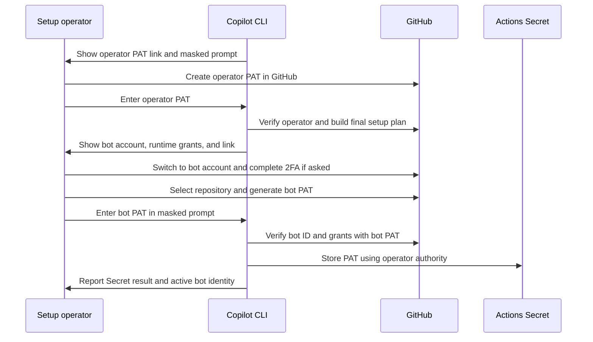
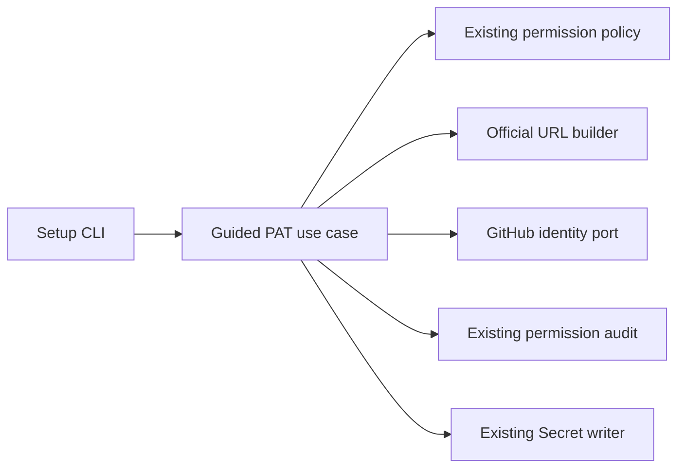

# Guided Bot PAT Onboarding

- Status: Draft — guided form is viable; runtime expiry and identity UX need review
- Date: 2026-09-24
- Catalog capability ID: `guided-bot-pat-onboarding`
- Last verified: Not applicable; prospective change
- Owners: Copilot maintainers and setup operators
- Scope: guide creation and installation of the workflow/bot PAT when operator and bot are different GitHub accounts
- Related issues/PRs: none; no Action dogfooding for this design
- Required review gates: product UX, architecture, testing, documentation, credential security, GitHub form compatibility
- Open decisions blocking readiness: runtime PAT expiration default/rotation owner; behavior when organization PAT approval is pending; supported non-interactive identity assertion

## 1. Executive summary

`copilot setup` already asks for two separate credentials: an operator setup PAT
and a workflow PAT owned by the Action's bot account. After the operator PAT
and setup plan are accepted, the proposed guided path builds an official GitHub
fine-grained PAT creation URL from the final **bot** permission plan. The user
reviews the browser account and repository, generates a PAT, and enters it in
Copilot's masked prompt. Copilot checks its identity and grants. The operator
credential installs it as GitHub Actions Secret `PAT`; it remains active for
future workflow runs.

This uses [GitHub's documented PAT URL parameters](https://docs.github.com/en/authentication/keeping-your-account-and-data-secure/managing-your-personal-access-tokens#pre-filling-fine-grained-personal-access-token-details-using-url-parameters).
The URL does **not** choose an individual repository or press Generate for the
user. It also cannot switch the browser's GitHub account. Therefore the UI
calls this **guided creation**, not automatic PAT issuance. There is no local
account manager or browser credential collection in this scope.

```text
operator PAT: guided link -> user creates PAT -> verify operator -> setup plan
bot PAT: final runtime grants -> guided link -> user switches browser to bot
       -> user selects repository and creates PAT -> verify bot -> Secret PAT
```

Text equivalent: the operator and bot each create their own PAT on GitHub;
Copilot checks the returned credential's identity and permissions and uses
each one only for its defined role.

## 2. Problem, current behavior, evidence, and feasibility

### 2.1 Problem

The setup owner often has a work or personal GitHub account, while the Action
uses a separate service account. The existing terminal permission table helps
configure both PATs but leaves the user to navigate GitHub's form and enter
many grants. A browser signed into the wrong account can produce a syntactically
valid PAT for the wrong identity. The bot PAT is especially consequential
because it persists as `PAT` for Actions rather than expiring at the end of
setup.

### 2.2 Observed repository behavior

1. `src/cli/commands/setup.ts` resolves the operator PAT before running the
   wizard, shows permission requirements, and later collects the separate
   workflow PAT.
2. `src/application/policies/setup_token_permission_policy.ts` derives the
   workflow PAT grants from the final selected features and storage policy.
3. `src/application/usecases/setup/setup_credentials_use_case.ts` requires a
   supplied or re-entered workflow PAT for permission audit, even if remote
   Secret `PAT` already exists. GitHub Secrets cannot reveal stored values.
4. `src/data/repository/repository_variables_repository.ts` writes validated
   Secret values to the selected repository or organization scope.
5. `docs/authentication.mdx` recommends a dedicated bot account for an
   organization and explains bot/self-event behavior and runtime grants.

### 2.3 External primary evidence

| Question | GitHub source | Contract consequence |
|---|---|---|
| What can a PAT URL prefill? | [PAT management: supported query parameters](https://docs.github.com/en/authentication/keeping-your-account-and-data-secure/managing-your-personal-access-tokens#supported-query-parameters) | `name`, `description`, `target_name`, `expires_in`, and permission levels. `expires_in` is 1–366 days or `none`, subject to owner policy. |
| Can it select the repository or browser identity? | [PAT creation steps](https://docs.github.com/en/authentication/keeping-your-account-and-data-secure/managing-your-personal-access-tokens#creating-a-fine-grained-personal-access-token) and [supported query parameters](https://docs.github.com/en/authentication/keeping-your-account-and-data-secure/managing-your-personal-access-tokens#supported-query-parameters) | The documented URL has no individual-repository selector. The user selects repository access and confirms the active account in GitHub. |
| Can a user switch browser accounts? | [GitHub account switcher](https://docs.github.com/en/authentication/keeping-your-account-and-data-secure/switching-between-accounts) | Yes. The browser may prompt for an account when following a link. CLI identity selection does not set that browser state. |
| Can Copilot create or delete the PAT through an owner API? | [PAT management](https://docs.github.com/en/authentication/keeping-your-account-and-data-secure/managing-your-personal-access-tokens), [organization PAT API](https://docs.github.com/en/rest/orgs/personal-access-tokens) | No documented owner PAT creation/deletion API found. Organization access management is not a user PAT minting flow. |

### 2.4 Viability conclusion

The official URL provides a supported, useful first release for **both** PAT
roles. It removes repetitive form entry and preserves GitHub's login, 2FA,
account switching, and final consent. It does not provide fully automatic PAT
creation or revocation. Replaying private GitHub web requests or sharing user
cookies is not required for this release and is not a stable product contract.
The temporary operator authorization proposal is in
[`temporary-setup-operator-authorization.md`](./temporary-setup-operator-authorization.md);
this SDD covers the bot's persistent runtime PAT.

### 2.5 Retrospective classification

Not applicable: this SDD specifies a proposed user journey, with current
behavior identified above.

## 3. Actors, surfaces, and terminology

| Actor | Goal | Entry point | Visible surfaces |
|---|---|---|---|
| Setup operator | configure repo/org and install Secret | `copilot setup` | permission tables, links, plan, result |
| Bot account owner | issue runtime PAT | GitHub PAT form | account switcher, permission form, PAT value |
| Organization admin | approve PAT/org resources if policy requires | GitHub Settings | pending/approved state |
| GitHub Action | use bot PAT after setup | workflows | jobs, PRs, issues |

**Operator PAT** is the setup-only token, preferably short lived. **Bot PAT**
is a fine-grained personal access token issued by the bot account and stored as
Secret `PAT`. **Expected bot identity** is a GitHub account resolved to its
immutable numeric user ID before accepting a PAT. **Guided link** is a URL to
GitHub's own form, never a bearer credential. **Installed** means the Secret
API accepted the value; it does not prove a later workflow has run.

## 4. Goals, non-goals, and fixed invariants

### 4.1 Goals

1. Setup MUST generate the bot PAT form link from the final runtime permission
   plan and clearly distinguish it from the earlier operator link.
2. Interactive setup MUST offer guided creation (recommended) or the existing
   manual PAT input at the workflow credential step.
3. In guided mode, the bot PAT MUST be checked against an explicitly chosen
   expected bot user ID, repository/organization access, and selected-feature
   permissions before Secret `PAT` is written.
4. Setup MUST report bot PAT installation separately from local disposal and
   later workflow health.
5. The existing manual and non-interactive PAT inputs MUST remain available.

### 4.2 Non-goals

1. Managing several GitHub accounts or credential stores on the device.
2. Switching a GitHub browser, Git, or `gh` account automatically.
3. Creating or revoking a PAT through undocumented website requests.
4. Replacing the Action's PAT with an App installation token, or deleting the
   bot PAT after setup; it is needed by later Action runs.
5. Automatically opening a browser, managing the clipboard, or adding a local
   account store in the first release.

### 4.3 Fixed invariants

1. The generated URL contains no PAT, cookie, session key, 2FA data, or secret.
   Only documented query parameters and a fixed GitHub host are allowed.
2. The user MUST select the individual repository in GitHub and confirm the
   active browser account; URL `target_name` sets only resource owner.
3. Neither the browser login nor a typed bot username proves the PAT's owner.
   In guided mode, Copilot MUST call GitHub `/user` with the supplied bot PAT
   and compare the immutable user ID to the expected account before any
   Secret write. Legacy manual/unattended inputs retain their current audit
   until a separately reviewed compatibility migration extends this binding.
4. Operator PAT and bot PAT are never interchanged. The bot PAT never becomes
   a local setup authority; the operator PAT never becomes Secret `PAT`.
5. A successfully installed bot PAT remains active. Local memory disposal is
   not described as remote revocation. No PAT value enters config, files,
   logs, URLs, or account metadata.
6. `--yes` cannot select the bot identity, accept missing grants, or generate
   a PAT on behalf of the user.
7. The guided URL is printed in full as plain terminal text outside a bordered
   box; no URL shortener or browser opener is required.

## 5. Current versus proposed product journey

| Stage | Current | Proposed | User effect |
|---|---|---|---|
| Operator access | permission table + masked prompt | official prefilled link + existing prompt | less manual form setup |
| Bot identity | implicit in docs and PAT value | ask expected bot login; resolve and display ID | wrong account detected |
| Bot grants | exact table before prompt | table + guided/manual choice and link from same policy result | fewer transcription errors |
| Bot browser | no explicit check | tell user to select bot in GitHub account switcher | handles separate accounts |
| Secret installation | validate and write `PAT` | same, with identity and scope result | clear Action owner |
| Completion | setup summary | setup summary distinguishes Secret from local PAT | accurate lifecycle |



Text equivalent: each user-owned PAT is generated inside GitHub. Copilot checks
the resulting identities, uses the operator PAT to configure the repository,
and stores the bot PAT in the selected Actions Secret scope.

## 6. Functional behavior and state model

### 6.1 Normal path

1. Complete the separate [operator PAT journey](./temporary-setup-operator-authorization.md),
   including its local preflight and final permission audit. Do not reuse the
   operator token as the Action credential.
2. Once setup choices and remote targets are final, use the existing workflow
   permission policy to build the bot PAT link. Its name/description identify
   purpose and repository; `target_name` is the repository owner; `expires_in`
   is a reviewed runtime expiration; each permission uses GitHub's documented
   query name and level.
3. At the existing workflow PAT collection point, present the final runtime
   permission table and offer `Create with GitHub guidance` (recommended) or
   `I already have a PAT`. In guided mode, ask for the expected bot login,
   resolve its immutable GitHub ID, and display both. Print the full URL on
   its own line outside `renderBox`; do not auto-open a browser. The user
   switches to that account in GitHub, selects the target repository, reviews
   the form, generates the PAT, and pastes it into the masked prompt.
4. Verify `/user` with the exact supplied PAT, compare immutable IDs, and run
   the existing role-specific permission audit. An `Unverifiable` write stays
   `Unverifiable` and follows the established acknowledgement policy.
5. After plan confirmation, use the operator credential to install the bot
   PAT as repository or organization Secret `PAT`. Print Secret scope, expected
   bot identity, successful setup facts, and any remaining health checks.
6. Release the local PAT value after use. The bot PAT remains in GitHub for
   future Action runs and needs an owner-managed renewal before its expiration.

### 6.2 Alternatives

- Choosing `Enter PAT manually` keeps the existing masked prompts, permission
  checks, and Secret provisioning. The current path does not bind a bot ID;
  the CLI must not claim that it does.
- A user may decline the guided link and use the docs directly. Setup still
  runs the existing permission audit without claiming bot identity binding.
- Non-interactive setup keeps supplied values and existing validation for the
  first release. It never opens a browser or infers the bot from the operator
  token. A later, explicit expected-bot-ID input and migration are required
  before identity binding can become mandatory there.
- `--dry-run` generates a plan without a PAT; it may display an example link
  only when its permission set is complete and clearly marked provisional.
- If organization policy requires approval, setup stops before writing Secret
  `PAT` until target access is verified. It reports `pending approval` only
  when GitHub provides explicit evidence; otherwise it reports unavailable
  access and says approval is one possible cause.
- If the bot is the same account as the operator, explain event self-suppression
  and enforce the existing guarded-approval identity restriction.

### 6.3 State machine

| State | Entered when | User-visible meaning | Next | Owner |
|---|---|---|---|---|
| `operator-pat-needed` | bootstrap grants known | create/paste operator PAT | `operator-verified`, `cancelled` | user |
| `operator-verified` | identity/grants accepted | finish plan choices | `bot-pat-needed` | CLI/user |
| `bot-pat-needed` | final grants and expected bot ID known | open GitHub as bot, create PAT | `bot-pat-verified`, `blocked`, `cancelled` | bot user |
| `bot-pat-verified` | ID and grants accepted | Secret ready to write after approval | `secret-writing` | operator |
| `secret-writing` | remote call started | provisioning | `installed`, `partial`, `blocked` | CLI |
| `installed` | Secret API accepted | runtime PAT is stored | terminal | operator |
| `partial` | Secret write succeeded but later setup failed | PAT may be active | inspect/retry | operator |

Retries do not generate or store a second PAT automatically. A changed final
permission plan invalidates the previously shown URL and requires a new link.
If setup is canceled before Secret write, a PAT the user already generated may
remain active at GitHub; the CLI instructs the user to delete it. A crash after
Secret write requires read-first reconciliation of Secret **name and scope**;
GitHub cannot return the stored value. This is not a reason to claim failure
or to overwrite the Secret without a new approved value.

## 7. User-facing configuration

| Input | Type | Recommended default | Allowed values | Scope/persistence |
|---|---|---|---|---|
| PAT creation help | interactive choice | guided | `guided`, `manual` | one setup run; not saved |
| Operator PAT expiry | integer days | `1` for a one-run token | defined by companion operator SDD | link only |
| Bot PAT expiry | integer days | proposed `90`, subject to review and org policy | 1–366 per GitHub, no `none` in generated link | link only; not a new config Secret |
| Expected bot | GitHub login and resolved ID | explicit selection | one valid GitHub user | one run; non-secret display |
| Secret scope | existing setup storage policy | repository | repository or organization as already supported | approved setup plan |

The final runtime permission policy is the sole source of URL grants. The
existing `--workflow-pat`/`--secret PAT=...` values override interactive input
and retain their current permission validation; they cannot silently enter
guided mode without an expected bot identity. The bot expiry default is
an open product decision; it cannot be shipped as a fixed value until rotation
ownership is documented. No link may select `none` silently. Invalid owner,
permission name/level, URL length, account, or scope blocks link generation.
There is no migration of existing PAT Secrets or account state. Role separation,
no embedded secret, and exact identity checking within guided mode are not
configurable.

Recommended example: use `copilot setup`, follow the earlier operator guidance,
then choose guided bot creation after the approved plan. Alternative: create
the bot PAT manually from GitHub Settings and enter it into the existing prompt.

## 8. Clean Architecture design

### 8.1 Responsibilities and dependency direction

| Boundary | Owns | Must not own/import |
|---|---|---|
| Domain/pure policy | role, owner, expiry, grant-to-URL mapping and identity match | HTTP, browser, terminal, tokens |
| Application | guide role-specific creation, verify supplied PAT, hand off bot PAT | GitHub DTOs, process opening |
| Ports | resolve GitHub identity, inspect permissions, write Secret | private web sessions |
| Adapters | official URL encoder, GitHub identity/permission queries, existing Secret API | product decisions |
| Composition | wire current setup stages and conditional guidance | duplicate permission rules |
| Presentation | permission table, link, masked prompt, state summary | PAT mutation |



Text equivalent: setup presents the guide; a pure builder encodes the existing
permission plan into GitHub's URL; application logic verifies the token's
identity and grants; the existing Secret writer installs the runtime PAT.

### 8.2 Contracts, state, and trust boundaries

- `PatRole` is `operator` or `workflow-bot`; each has a separate permission
  plan, expected identity, lifetime guidance, and cleanup owner.
- URL builder accepts only normalized `{name, description, targetName,
  expiresIn, permissions}` and returns a URL pinned to
  `https://github.com/settings/personal-access-tokens/new`.
- URL mapping is versioned against GitHub's documented parameter vocabulary.
  `target_name` is an owner slug; the repository name is descriptive only and
  cannot be misrepresented as selected repository access.
- In guided mode, bot token identity comes from GitHub `/user` using that
  token. Compare numeric user IDs and verify repository access, then invoke
  the existing permission audit.
- No durable local state is introduced. The remote Secret is the only durable
  bot PAT copy Copilot creates. Browser state is owned by GitHub, not Copilot.

### 8.3 Executable architecture constraints

Pure URL builder imports no HTTP, filesystem, terminal, or Secret adapter.
Contract tests MUST compare each emitted permission query name to GitHub's
documented set and reject unknown grants. Setup architecture tests MUST show
that no generated URL contains a token or cookie, no guided Secret write
precedes bot identity verification, and no operator token is used as runtime
`PAT`.

## 9. UI/UX and content contract

The CLI first shows the role, expected account, repository, permission purpose,
remaining action, and cleanup ownership. The following English example matches
the current CLI language; it is illustrative. The URL is plain, complete, and
outside the bordered permission summary so it remains copyable.

```text
Workflow PAT · 2 of 2                     Repository: vypdev/copilot
The setup PAT is not the Action's runtime credential.
Choose how to provide the bot PAT:
  1) Create with GitHub guidance (recommended)
  2) I already have a PAT
Select [1]:
Expected bot account: vypbot
Expected account resolved: @vypbot (GitHub ID 5678)

Action required: In GitHub, switch to vypbot and complete 2FA if asked.
Select only vypdev/copilot; review the prepared permissions, then Generate.
PAT creation URL:
https://github.com/settings/personal-access-tokens/new?name=...&target_name=vypdev&expires_in=...&...
Workflow PAT (hidden):
```

| State | Representative first visible text | Primary action |
|---|---|---|
| Pending | `Waiting for a PAT created by vypbot. No Secret has been written.` | open PAT link |
| Action required | `Before generating, check that GitHub is using vypbot. Select only vypdev/copilot, then generate the PAT.` | check browser account |
| Blocked | `The supplied PAT belongs to efrain, not vypbot. No Secret was written. Delete that PAT in GitHub and create one while signed in as vypbot.` | create correct PAT |
| Partial | `Secret PAT was updated, but later setup steps failed. The bot PAT may already be active. Inspect the setup report before retrying.` | inspect report |
| Complete | `Secret PAT is installed for vypdev/copilot. Verified owner: vypbot (ID 5678). The local value was discarded; the GitHub Secret remains active.` | run doctor/health check |

Error content follows impact, cause, action, retained state. Do not say a
typed account name or URL proves the browser account. No Github issue, PR,
check, comment, or label is created solely for this flow. English follows the
current setup CLI; later locales use the message catalog. Text status does not
depend on color or emoji; tables and instructions wrap on narrow terminals,
while the raw URL stays complete on its own line. Limit to
one guided block per role and one final summary; no polling notifications.
Escape untrusted usernames and descriptions in terminal and URL content.

## 10. Failure, recovery, and cleanup

| Failure | Impact | Retained facts | Retry | Action | Cleanup |
|---|---|---|---|---|---|
| Wrong browser account | PAT belongs to another user | no Secret write | new PAT | switch account in GitHub | user deletes wrong PAT |
| Wrong resource owner/repo | PAT lacks target access | no Secret write | correct form | select target repo and owner | user deletes wrong PAT |
| Org PAT pending or inaccessible | Action cannot use it yet | no Secret write | after access is verified | inspect approval with org admin or choose permitted account; label pending only with evidence | user owns token |
| Missing/unverifiable grant | setup blocked by established audit policy | permission table | corrected PAT | inspect settings/acknowledge only where allowed | user deletes obsolete PAT |
| Secret write fails | Action keeps prior Secret or none | known Secret name/scope | setup retry | repair operator rights | local value discarded after run |
| Secret write succeeds, later step fails | bot PAT may be active | Secret name/scope and completed steps | idempotent retry | inspect report | do not delete runtime PAT |
| User cancels after PAT creation | PAT may remain active in GitHub | no local value retained | new setup | delete unused PAT | user-owned deletion |

GitHub's Secret API cannot return the previous value, so a failed update cannot
be rolled back by reading it. `copilot doctor`/health inspection is separate
from Secret-write success. The terminal states these facts without exposing
the PAT.

## 11. Security, permissions, and privacy

1. GitHub owns password, 2FA, browser account selection, PAT generation, and
   organization approval. Copilot handles only the resulting PAT value entered
   in a masked prompt.
2. URL grants are derived from current permission policy, not from CLI prose.
   Strongest required level wins; no unrelated grant is added for convenience.
3. For guided mode, verify bot numeric user ID with the bot PAT itself;
   compare it to a separately resolved expected identity. A login string or
   claimed role is insufficient. Do not describe legacy validation as this
   stronger identity check.
4. Operator and bot PATs remain separate in memory and at API boundaries. Bot
   PAT is written only as Secret `PAT`, never to a Variable or local file.
5. The new guided path never puts a PAT in command arguments, stdout, URL,
   logs, telemetry, diagnostics, or fixtures. Existing command-line PAT flags
   remain for compatibility but should warn about process-list/history exposure.
   Discarding process memory is not revocation.
6. The runtime PAT requires a renewal plan before expiry. No one-run cleanup
   may revoke it while the Action depends on it.

## 12. Observability and operational UX

Record role, GitHub user ID/login, target repo, permission result statuses,
Secret name/scope, and setup outcome only. No token value or raw provider
response is recorded. Confirmed `pending approval` is distinct from a failed
PAT; unknown access must not be mislabeled as pending.
The CLI reports after identity verification and after Secret write, without
repeated prompts. A user can inspect the GitHub Secret **name** and later Action
health but not the Secret value. Failures include an actionable GitHub Settings
link and the retained state. Rate-limited identity or permission checks yield
a bounded retry message, never a false success.

## 13. Compatibility, migration, rollout, and rollback

Existing `--token`, `PERSONAL_ACCESS_TOKEN`, `--workflow-pat`, and
`--secret PAT=...` remain accepted with current precedence. Existing Secrets
are not modified by the link feature alone; a new value is installed only
after the normal plan confirmation and audit. Initial rollout adds guided
links and bot ID binding in interactive guided setup. Manual and unattended
inputs keep current behavior, with an explicit warning that bot identity is
not bound. Non-interactive bot ID binding follows only after an explicit input
contract and migration policy are settled. Rollback hides the links
and returns to current manual instructions; already installed bot PATs remain
active until their owner rotates or revokes them.

## 14. Testing strategy and numeric budget

The implementation floor is **36 distinct bot-specific cases**, derived from
the runtime permission plan, wrong-account and wrong-repository states, Secret
write outcomes, and compatibility modes. Shared URL builder cases in the
operator SDD are not counted again here.

| Area | Minimum cases | Key behavior |
|---|---:|---|
| Domain/configuration/pure URL mapping | 8 | bot-only permission keys/levels, owner, expiry, invalid grants |
| State/application/idempotency | 7 | plan change, cancellation, re-entry, retry, Secret partial state |
| Provider adapters/contracts | 5 | token `/user`, ID mismatch, repository access, Secret response |
| Setup/permissions/schema | 5 | operator/bot role separation, final policy, org scope, existing Secret |
| UI/accessibility/localization | 5 | pending/action/blocked/partial/complete and narrow output |
| Integration/security/migration | 6 | no URL secrets, no wrong-token write, manual/non-interactive compatibility |
| **Total** | **36** | No double counting |

Repository-wide thresholds remain; the new pure mapping and identity policy
target 100% branch coverage, and changed setup modules target at least 95%
lines/statements and 90% branches/functions. Use deterministic GitHub fakes,
not live PAT creation in CI. Contract fixtures assert parsed URL parameters
and semantic CLI copy, not snapshots alone. Manual acceptance evidence must
include two browser accounts, 2FA handled by GitHub, wrong-account rejection,
repository selection, Secret installation, and post-write partial failure.
Test PATs are deleted by their owners after the controlled exercise.

## 15. Documentation and discoverability

| Audience | Artifact | Required content | Validation |
|---|---|---|---|
| New user | `README.md`, `docs/how-to-use.mdx` | two PAT roles, guided links, browser account choice | navigation/link test |
| Setup operator | `docs/authentication.mdx`, `docs/configuration.mdx` | exact grants, repo selection, expiry, Secret scope | permission fixture |
| Operator | `docs/security-operations/operations/troubleshooting.mdx` | wrong account, org approval, cleanup, partial Secret write, renewal | recovery fixture |
| Contributor | `docs/development/architecture.mdx`, this SDD | URL builder, identity binding, trust boundary | architecture test |

Docs must explicitly say the link does not select a repository or create the
PAT, and the bot PAT remains active after setup.

## 16. Acceptance scenarios

1. Given the selected setup features, each role receives a documented PAT URL
   with exactly its own needed permission levels and no token material.
2. Given local-only choices change, the operator link changes before a PAT is
   requested; final remote inspection revalidates its grants.
3. Given a bot account chosen by name, Copilot resolves and displays its
   immutable ID before accepting the bot PAT.
4. Given the browser uses another account, a PAT created there fails `/user`
   ID comparison and no Secret write occurs.
5. Given the correct bot account but wrong repository selection, setup blocks
   before Secret write and names the correction.
6. Given an organization PAT pending approval or otherwise unable to reach
   the target, setup does not present the Action as ready; it names pending
   approval only when provider evidence supports it.
7. Given accepted bot identity and grants, operator authority installs Secret
   `PAT` at the approved scope; the final report says it remains active.
8. Given an existing Secret, the CLI does not claim to know its value and
   requests re-entry for the existing permission audit.
9. Given Secret write success followed by another setup failure, output
   reports the partial result and does not revoke the bot PAT.
10. Given cancellation after GitHub created a PAT but before Secret write,
    the CLI instructs the user to delete the unused PAT in GitHub.
11. Given a legacy manual or non-interactive PAT input, current setup continues
    to work with its existing permission audit; no bot identity verification
    is claimed until the planned migration is implemented.
12. Pending, action, blocked, partial, and complete CLI states are readable
    without color and accurately distinguish local disposal from GitHub Secret.

## 17. Requirements traceability

| Requirement | Owner | Verification | Documentation |
|---|---|---|---|
| Role-specific link (§4.1, §6.1) | policy + URL builder | scenarios 1–2 | how-to-use/authentication |
| Bot ID and grants (§4.3, §6.1) | identity port + existing audit | scenarios 3–6 | authentication |
| Secret lifecycle (§4.3, §10) | existing credential/Secret use cases | scenarios 7–10 | setup/troubleshooting |
| Compatibility (§6.2, §13) | setup CLI | scenario 11 | CLI guide |
| Truthful UX (§9) | presenter | scenario 12 | how-to-use |

## 18. Implementation sequence

1. Resolve operator pre-auth planning and bot PAT expiration policy. Validate
   the official permission-key mapping with GitHub's current documentation.
2. Implement a pure, role-specific URL builder and contract tests using the
   existing permission policy; keep URL generation separate from token input.
3. Add expected bot ID resolution and exact-token `/user` comparison before
   Secret collection/provisioning.
4. Integrate guided links and state messages with the existing CLI prompts and
   setup plan; preserve manual/non-interactive paths.
5. Add Secret partial-state tests, docs, architecture checks, controlled
   two-account UX evidence, coverage, and specification validation.

## 19. Definition of Done

- [ ] Open decisions are resolved before Ready for implementation.
- [ ] Every MUST has an acceptance scenario and test or evidence.
- [ ] URLs use only documented GitHub parameters and never contain secrets.
- [ ] Guided operator and bot IDs/grants are verified with their actual
      credentials; legacy paths are labeled accurately.
- [ ] Secret scope, persistence, partial writes, and cleanup are truthful.
- [ ] Architecture checks, 36-case budget, and coverage targets pass.
- [ ] CLI primary states pass accessibility, sanitization, and locale review.
- [ ] User, setup, operator, and contributor docs are complete and linked.
- [ ] Catalog evidence and generated `specs/CATALOG.md` are current and
      `pnpm run validate:specifications` passes.
- [ ] Controlled two-account acceptance evidence is recorded without PATs.

## 20. References and decisions

- Related specs: [temporary setup operator authorization](./temporary-setup-operator-authorization.md),
  [setup baseline](./setup-configuration-credentials-and-doctor.md), and
  [PAT permission guidance](./setup-pat-permission-guidance-and-verification.md).
- Primary sources: [PAT form and URL templates](https://docs.github.com/en/authentication/keeping-your-account-and-data-secure/managing-your-personal-access-tokens),
  [browser account switcher](https://docs.github.com/en/authentication/keeping-your-account-and-data-secure/switching-between-accounts),
  [organization PAT endpoints](https://docs.github.com/en/rest/orgs/personal-access-tokens).
- Decision: use GitHub's documented guided form for both PATs. Local account
  profiles are unnecessary for this flow; verify each guided PAT's actual
  owner rather than trusting the browser or local CLI account. Legacy paths
  keep their current checks pending a migration. Automatic bot PAT creation
  needs a future supported GitHub API and is not claimed here.
