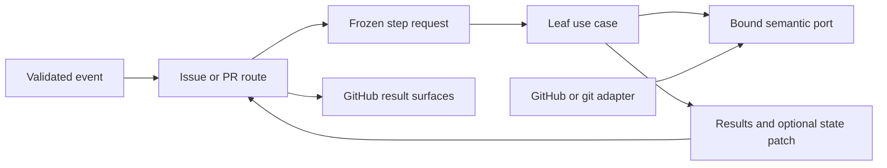

# Issue and Pull Request Capability Context Hardening

- Status: Implemented
- Date: 2026-09-13
- Catalog capability ID: `architecture-quality-hardening`
- Last verified: 2026-09-13 on `develop` (P2-E implementation validation)
- Owners: Copilot maintainers
- Scope: complete P2-E by replacing issue and pull-request leaf access to the
  shared `Execution` aggregate and repository credentials with immutable
  capability requests and bound semantic ports
- Related issues/PRs: parent architecture program, the managed issue and
  pull-request lifecycle SDDs, and the P2-E delivery PR from `develop` to `master`
- Required review gates: product UX, architecture, testing, documentation,
  security/operations, patch coverage, generated bundles
- Open decisions blocking readiness: none

## 1. Executive summary

Issue and pull-request routes MUST copy the facts needed by each lifecycle step
into fresh, deeply readonly requests before invoking that step. Provider
coordinates and credentials MUST be captured once by composition and MUST NOT
appear in application requests or leaf method calls. Branch preparation MUST
return an explicit configuration patch for the route coordinator to apply; it
MUST NOT mutate the shared aggregate from below the route.

The PR-to-issue linkage workaround requires temporarily targeting the default
branch because GitHub interprets closing keywords only for default-branch pull
requests. That operation MUST use a repository-owned URL/query, a durable hidden
marker, ordered compensation, and truthful partial-state results. Event-provided
URLs MUST never be fetched.

```text
validated issue/PR event
  -> route projects immutable step requests
  -> leaf use cases call credential-bound semantic ports
  -> branch step returns results + configuration patch
  -> route applies the validated patch and publishes sanitized results

PR link request
  -> inspect exact repository PR
  -> write temporary marked reference
  -> switch to default branch and wait for GitHub linkage
  -> restore body and base in bounded compensation
  -> report complete or exact retained partial state
```

## 2. Problem, current behavior, and evidence

### 2.1 Problem

Twenty-six production files below `steps/issue` and `steps/pull_request`
import the mutable `Execution` aggregate. Those leaves can read credentials,
provider-facing models, mutable configuration, agent services, and unrelated
capability state. The same credentials are then repeated through application
method signatures, so authority is data that can be forwarded instead of a
composition-owned capability.

Branch preparation mutates `Execution.currentConfiguration` while it is still
performing provider I/O. This obscures which facts are durable after a partial
failure and lets nested helpers change route-owned state. PR-to-issue linkage
also fetches an event-provided URL and performs temporary PR body/base mutations
without a durable recovery marker, so an interruption can retain an unsafe or
misleading intermediate state.

### 2.2 Current behavior

1. `IssueUseCase` and `PullRequestUseCase` receive `Execution` at approved route
   boundaries.
2. Most issue/PR leaf steps receive that same aggregate and extract their own
   facts and token.
3. Composition constructs unbound repositories; application leaves repeatedly
   supply owner, repository, and token.
4. Branch helpers directly write parent, working, release-origin, and
   hotfix-origin fields into `currentConfiguration` before the route persists it.
5. PR linkage calls `fetch(param.pullRequest.url)`, temporarily changes base and
   body, waits 20 seconds, and restores them only on the uninterrupted path.
6. PR description generation has two entry methods (`invoke` and
   `invokeExplicit`) over the aggregate, although the only semantic variation is
   whether the request is forced by an authorized comment.

### 2.3 Evidence

- Graphify queries over `graphify-out/graph.json` identify the issue workflow,
  pull-request workflow, description workflow, composition roots, and
  `Execution` as the P2-E community.
- `src/architecture/execution_import_baseline.json` contained exactly 75 imports
  at `733e68bb`; 26 were in the two P2-E leaf directories and two were in their
  step-interface modules. The implemented ceiling is 47.
- The clean baseline has 405 passing suites and 3,306 passing cases; typecheck
  passes.
- The clean architecture audit at `733e68bb` reports average health `7.95`,
  hotspot health `5.99`, `update_pull_request_description_workflow.ts` health
  `4.21`, and `pull_request_lifecycle_repository.ts` health `2.05`.
- The final clean implementation audit reports average health `7.93`, hotspot
  health `5.96`, `update_pull_request_description_workflow.ts` health `4.50`,
  and `pull_request_lifecycle_repository.ts` health `2.05`. The `0.02` average and
  `0.03` hotspot changes are the measured cost of adding the explicit issue
  context projector (`5.85`) and uniform semantic leaf wrappers (`5.90`) to the
  measured set; both boundaries have full line coverage, the targeted
  description hotspot improves by `0.29`, reaches `91.67%` branch coverage,
  and no existing worst performer regresses.
- GitHub documents that closing keywords create issue links only when a PR
  targets the default branch, and its REST update endpoint permits changing the
  PR `body` and `base` with Pull Requests write permission.
- Unknowns: GitHub does not promise the latency with which the temporary
  keyword link becomes visible. The existing bounded delay remains an injected
  adapter and is not treated as proof of provider completion.

### 2.4 Retrospective classification

This began as a prospective P2-E implementation contract and now records the
delivered implementation evidence. Existing product behavior remains classified
by the managed issue and pull-request lifecycle SDDs; the security and recovery
changes below are explicit amendments.

## 3. Actors, surfaces, and terminology

| Actor | Goal | Entry point | Visible surfaces |
|---|---|---|---|
| Issue author | receive correctly classified, assigned, and branched work | issue event | issue title, labels, projects, comments, branch links |
| PR author | receive deterministic enrichment without losing body/base state | PR event | PR body, base, labels, reviewers, projects, Job Summary |
| Maintainer | recover a partial link or branch operation safely | rerun/action result | check result, summary, PR edit/history |
| Contributor | change a leaf without aggregate-wide fallout | code change | typecheck, architecture and coverage gates |

A **capability request** is a fresh frozen plain record containing facts for one
operation. A **bound port** is repository and credential authority captured by
composition; its methods accept operation facts only. A **configuration patch**
is an immutable set of validated branch facts returned to the route. A
**temporary link marker** is a fixed hidden HTML comment that identifies only a
Copilot-owned in-flight PR-link operation and never authorizes a command.

## 4. Goals, non-goals, and fixed invariants

### 4.1 Goals

1. Production files below `steps/issue` and `steps/pull_request` MUST have zero
   direct or aliased `Execution` imports.
2. Every P2-E leaf MUST receive only a named immutable capability request.
3. Repository coordinates and tokens MUST be absent from P2-E requests and leaf
   provider calls.
4. Branch preparation MUST make route-owned state changes explicit and atomic
   at the coordinator boundary.
5. PR linkage MUST reject event URLs, recover every applied temporary mutation,
   and report retained partial state if compensation fails.
6. Automatic and explicit PR descriptions MUST use one discriminated request
   contract and preserve all four documented body modes.
7. Existing issue/PR sequencing, project/label/assignment behavior, one-welcome
   rule, description ownership, review freshness, and merge closure MUST remain
   observable-equivalent except for the specified security/recovery changes.

### 4.2 Non-goals

1. P2-E does not remove `Execution` from the two top-level route use cases or
   from P2-F push/single-action capabilities.
2. It does not replace GitHub's closing-keyword linkage model or invent a
   provider-independent distributed transaction.
3. It does not change user-configurable labels, branches, counts, description
   modes, agents, locales, or project schema.
4. It does not add generic context bags, service locators, callback fields, or a
   universal GitHub client.

### 4.3 Fixed product and safety invariants

1. Tokens, provider clients, repositories, live `Ai`/`Execution` subobjects,
   getters, callbacks, and mutable arrays MUST NOT enter a capability request.
2. Context projection MUST copy nested arrays, records, project references, and
   agent configuration; later aggregate mutation MUST not change an invocation.
3. Provider write authority MUST be injected as the narrowest bound command
   port and MUST never be enabled by a request boolean.
4. Event-provided URLs MUST NOT be used as network destinations. PR identity is
   the positive safe integer plus the repository identity already bound by
   composition.
5. A failed PR-link compensation MUST name the body/base facts still changed;
   it MUST NOT claim the PR was restored.
6. A configuration patch is applied only after its owning step returns; absent
   fields never clear unrelated current configuration.
7. Removed aggregate signatures, raw-token methods at leaf boundaries, and
   `invokeExplicit` MUST fail compilation. No overload, union fallback, alias,
   adapter, feature flag, or deprecation path is permitted.

## 5. Current versus proposed product journey

| Stage | Current | Proposed | User/operator effect |
|---|---|---|---|
| Projection | leaves read mutable aggregate | route snapshots one request per step | deterministic in-flight facts |
| Authority | token passed on every call | composition binds one repository credential | smaller leak/forgery surface |
| Branch state | nested helper mutates shared config | branch outcome carries validated patch | exact retained state |
| PR linkage target | event URL is fetched | adapter derives exact GitHub target | no SSRF destination |
| Link recovery | restore only on happy path | marker plus ordered compensation | rerunnable partial recovery |
| PR description | aggregate plus separate explicit method | one `{ context, trigger }` request | one final contract |
| Evidence | global import ceiling only | exact zero-leaf rule plus P2-E coverage gate | erosion fails CI |



Text equivalent: the validated event reaches one route; the route copies only
the facts for a leaf; the leaf uses an authority-bearing port wired by
composition; it returns results and, only for branch preparation, a state patch;
the route applies that patch and publishes the resulting GitHub view.

## 6. Functional behavior and state model

### 6.1 Issue step requests

The issue route MUST project separate requests for permission denial closure,
member assignment, issue-type selection, priority propagation, branch cleanup,
branch preparation, obsolete-branch cleanup, deployment dispatch, help reply,
and move-to-in-progress. Common title, permission, and project-link contexts
remain owned by P2-D and are reused without widening them.

Branch preparation returns:

```text
BranchPreparationOutcome {
  results: readonly Result[]
  configurationPatch: {
    parentBranch?, workingBranch?, releaseBranch?, releaseOriginBranch?,
    releaseOriginSha?, hotfixBranch?, hotfixOriginSha?
  }
}
```

The outcome is frozen. The issue workflow applies defined patch fields after the
step returns and before result publication/configuration persistence. Managed,
release, hotfix, already-existing, missing-input, provider-failure, and
post-create project-move paths all return explicit outcomes.

### 6.2 Pull-request step requests

The PR route MUST project separate requests for member assignment, reviewer
selection, issue linkage, label synchronization, priority propagation,
description generation, and merged-issue closure. The description request has
exactly one trigger: `automatic` or `authorized-command`. `disabled` skips both;
`preserve` accepts only `authorized-command`; `replace` and `append` preserve
their documented ownership semantics.

### 6.3 PR-link transaction and compensation

1. Load link state for the exact bound repository and positive PR number.
2. If an owned marker exists, enter recovery before considering an
   already-linked no-op so temporary state is never stranded.
3. If no operation marker exists, require the current provider base to match the
   event snapshot; otherwise stop without a write. Then return no-op when the PR
   is already linked.
4. Write the temporary closing reference and marker while retaining the exact
   original body from the authoritative current-detail snapshot and the
   validated original base from the route request.
5. Change the base to the configured default branch and invoke the injected
   propagation delay.
6. Restore the original body and base even when a later operation fails.
7. If both restore operations succeed, remove the marker and reference, restore
   the exact original body/base, and report either completion or a compensated
   primary failure.
8. If either restore fails, return a partial failure naming the remaining
   mutation and the required manual GitHub action. A rerun first attempts marker
   recovery and does not layer another reference.

### 6.4 State machine

| State | Entered when | User-visible meaning | Allowed next states | Recovery/owner |
|---|---|---|---|---|
| projected | route copied validated facts | enrichment is ready | executing | route |
| executing | leaf has begun I/O | operation pending | complete/skipped/failed/compensating | leaf |
| patch-ready | branch decision and I/O completed | branch facts await route application | complete | route applies once |
| compensating | temporary PR link mutation exists | original PR state is being restored | complete/partial | link workflow |
| partial | one or more temporary facts remain | manual action or rerun required | compensating/complete | maintainer/workflow |
| complete | requested durable behavior and cleanup completed | no action required | terminal/replay no-op | route |
| skipped | precondition/configuration disables step | no mutation occurred | terminal/new event | contributor |
| failed | no temporary mutation remains | retry after named cause | executing | contributor/operator |

Duplicate events use current provider facts and deterministic upserts. A stale
context is discarded at the route and reprojected on the next event; leaves do
not reach back into `Execution`. Cancellation after a temporary PR mutation is
treated as compensation-required, not ordinary failure.

## 7. User-facing configuration

No new configuration is added.

| Existing input | Recommended default | Allowed values/range | Scope/persistence |
|---|---|---|---|
| `ai-pull-request-description-mode` | `replace` | `replace`, `append`, `preserve`, `disabled` | copied once per invocation |
| desired assignees | `1` | `0..10` | copied once per invocation |
| desired reviewers | `1` | `0..15` | copied once per invocation |
| branch families/default/development | repository defaults | validated non-empty safe refs | copied; special origins patched explicitly |
| projects and columns | empty/configured | validated accessible projects/names | projects copied per invocation |

Repository identity, credentials, link marker syntax, event-URL rejection,
compensation order, context copy/freeze, import ceilings, and patch application
are intentionally not configurable. Missing, unknown, or invalid existing
values keep their owning validation behavior; P2-E adds no migration parser.

## 8. Clean Architecture design

### 8.1 Responsibilities and dependency direction

| Layer/boundary | Owns | Must not own/import |
|---|---|---|
| Domain/pure policy | label selection, branch decisions, description merge, compensation plan | provider SDK, token, `Execution` |
| Application route | projection, sequential ordering, patch application | concrete adapters, provider DTOs |
| Application leaf | one request and semantic port interaction | aggregate, credentials, repository coordinates |
| Application ports | bound operation capabilities and immutable DTOs | Octokit/GraphQL types |
| Data/provider adapters | GitHub/git translation, exact repository target, error mapping | event routing or product sequencing |
| Infrastructure composition | owner/repository/token capture and concrete wiring | branching/business decisions |
| Presentation | status, retained facts, next action, descriptive links | mutations or raw errors |

### 8.2 Contracts, state, and trust boundaries

- Pure decisions: issue type, priority, branch strategy/name candidates,
  description mode, link-effect and compensation ordering.
- Application contracts: named frozen requests, bound ports,
  `BranchPreparationOutcome`, and semantic `Result` values.
- Bound ports: actor authorization, issue assignment/closure/type/labels,
  organization selection, reviewer commands, project priority/state, branch
  list/delete/create, workflow dispatch, PR link/details/body/base.
- Durable state: GitHub owns PR/base/body/link facts; the configuration marker
  owns applied branch patches; the hidden link marker exists only while cleanup
  is outstanding and is removed after successful compensation.
- Concurrency/idempotency: workflow concurrency remains the outer admission
  boundary; provider re-reads and owned markers make replay deterministic.
- Untrusted inputs: event URLs, bodies, titles, labels, branch names, author
  names, provider responses, and agent output.
- Provider errors: adapters/application boundaries map them to semantic errors;
  public results contain no provider response or token.

### 8.3 Executable architecture constraints

1. The existing AST import ratchet MUST shrink in the same change.
2. A focused AST test MUST fail any `Execution` import or type alias below the
   two P2-E leaf directories and any token-like field in a P2-E context.
3. Composition tests MUST prove every bound adapter supplies the configured
   owner/repository/token while leaf calls expose only operation facts.
4. Dependency/cycle tests MUST remain green; application code MUST not import
   infrastructure/provider protocols.
5. The dedicated coverage validator MUST require every P2-E context,
   workflow, and binding module to appear in coverage and meet the thresholds in
   section 14.

## 9. UI/UX and content contract

The existing issue/PR result stream remains the product surface. Linkage
recovery adds explicit partial-state wording and no additional comments.

### 9.1 Information hierarchy

1. Current linkage/enrichment status.
2. Completed durable or temporary facts.
3. Next automatic transition.
4. Required human action, or “No action required.”
5. Impact and retained PR body/base/issue state.
6. Descriptive PR/issue/action links.
7. Sanitized technical reference where available.

### 9.2 Representative primary views

```markdown
Pending: **Copilot is linking PR #84 to issue #81.**
Completed: The temporary issue reference is present.
Next: GitHub linkage will be observed, then the original body and base are restored.
Action required: No action required.
```

```markdown
Action required: **PR #84 has no valid linked issue.**
No body, base, label, project, or issue state was changed.
Link the PR to an issue or rename the managed branch, then rerun the workflow.
```

```markdown
Blocked: **Copilot could not inspect PR #84 in the configured repository.**
No temporary linkage mutation was attempted.
Check Pull Requests read/write permission and rerun the failed workflow.
```

```markdown
Partial: **PR #84 is linked, but its original base could not be restored.**
The original body was restored. The PR still targets `master` instead of `develop`.
Change the base back to `develop`, then rerun enrichment. No issue was closed.
```

```markdown
Complete: **PR #84 is linked to issue #81 and its original body/base are restored.**
No action required. Review and merge into `develop` normally.
```

### 9.3 Issue, PR, and comment behavior

- Titles, comments, labels, project items, and body markers remain deterministic.
- The temporary link marker is hidden, fixed-format, repository-owned, and
  removed on successful compensation.
- Replays update/recover the same operation; they do not add another marker,
  closing reference, welcome, comment, or managed description section.
- P2-E has a zero-new-comment budget. It changes existing result/summary content
  only when a partial linkage state needs truthful recovery guidance.

### 9.4 Accessibility, localization, and responsive behavior

English remains the fallback locale. Status words and actions are textual; no
meaning relies on color or emoji. Views use short paragraphs rather than wide
tables on GitHub. Links are descriptive. Untrusted Markdown, mentions, control
sequences, markers, URLs, and branch/body content are never interpolated into a
network target or executable command and are escaped/sanitized where displayed.

## 10. Failure, recovery, and cleanup

| Failure/partial state | User impact | Retained facts | Automatic retry | Required action | Cleanup |
|---|---|---|---|---|---|
| context precondition invalid | step skipped/failed before I/O | original GitHub/config state | new event | correct input | none |
| bound provider read fails | enrichment stops | earlier completed steps | workflow rerun | check permission/provider | none |
| branch created, project move fails | work branch exists | returned branch patch and provider branch | safe rerun | continue work/retry project sync | never delete branch implicitly |
| link marker write fails | no base change | original body/base | safe rerun | rerun | none |
| base switch/wait fails | link may be incomplete | marker and exact applied effects | compensate immediately | rerun if restored | restore body/base |
| body restore fails | temporary marker/reference remains | exact original base/body known | recovery-first rerun | restore body manually if retry fails | do not add marker |
| base restore fails | PR targets default branch | original body may be restored | recovery-first rerun | restore named original base | do not claim completion |
| description agent/provider fails | existing body retained | earlier enrichment | safe rerun | repair agent/access | never blank body |
| merged issue closure fails | code remains merged; issue open | merge fact | safe rerun/manual | close issue | never undo merge |

Errors follow `impact -> cause category -> action -> retained state`. Cleanup
errors are combined without discarding the primary failure and without exposing
raw provider diagnostics.

## 11. Security, permissions, and privacy

1. Workflow same-repository and actor gates remain before privileged writes or
   agent execution.
2. Tokens are captured in composition closures and never copied into contexts,
   results, markers, logs, prompts, state patches, or tests.
3. Event URLs are untrusted metadata. The adapter derives the only allowed
   GitHub destination from the bound repository and validated PR number.
4. Agent output is sanitized before PR body publication. Existing body text is
   data, never a command or marker authority.
5. Positive safe integers and bounded arrays/counts are validated before I/O;
   provider payloads are copied and normalized at the adapter boundary.
6. Reviewer/member queries and commands retain least-privilege separation;
   read-only requests cannot acquire write capability from request fields.
7. Security tests cover forged URLs, marker injection, token-shaped fields,
   invalid numbers, replay, and compensation failures.

## 12. Observability and operational UX

- User-facing state: ordered semantic results identify skipped, executed,
  partial, and completed steps plus retained body/base/branch facts.
- Job Summary: existing result publication remains the single summary; P2-E
  creates no additional issue or PR comments.
- Logs: capability name, positive issue/PR number, safe branch name, effect
  count, compensation state, and semantic correlation ID only.
- Metrics: aggregate by capability/outcome (`complete`, `skipped`, `partial`,
  `failed`) and compensation result; never by body, URL, title, or token.
- Pending external dependency: the injected propagation delay is reported as
  pending linkage, not as a workflow failure.
- Noise budget: zero new comments, at most one result per semantic mutation plus
  one partial-recovery result, and no raw provider retry logs.

## 13. Compatibility, migration, rollout, and rollback

- There are no installed users, external API consumers, or persisted P2-E
  request shapes. The implementation is one clean cut.
- Aggregate-based leaf signatures, token-bearing leaf calls, event-URL fetches,
  and `invokeExplicit` are deleted in the same change. They are not parsed,
  translated, warned about, or re-exported.
- Existing current configuration is not schema-migrated. Branch facts are still
  persisted in the same fields; ownership changes to an explicit route-applied
  patch.
- An owned temporary marker found after rollout enters recovery-first behavior.
  Unknown/forged markers have no authority and are treated as body text.
- Rollback means reverting the unreleased P2-E change. It MUST NOT restore the
  event-URL fetch or add a compatibility layer. Any live marked PR must be
  restored before rollback.

## 14. Testing strategy and numeric budget

P2-E owns at least **44 distinct cases**. Existing characterization cases count
only after they are rewritten against the final requests and ports.

| Area | Minimum distinct cases | Behaviors/risks covered |
|---|---:|---|
| Domain/context/pure planning | 10 | issue/PR projections, deep copy/freeze, exact fields, branch patches, description trigger |
| State/application/idempotency/races | 10 | issue/PR order, replay, branch patch apply-once, link recovery and compensation failures |
| Adapters/provider contracts | 8 | bound credential forwarding, exact PR target, malformed provider facts, error mapping |
| Workflows/composition/schema | 6 | issue/PR composition, removed signatures, zero-leaf import rule, no cycles |
| UI/UX/localization/sanitization | 4 | pending/action/blocked/partial/complete semantics, marker/body safety |
| Integration/security/migration | 6 | issue→branch, PR→issue→close, forged URL/marker, token absence, clean cut |
| **Total** | **44** | No double counting |

Repository thresholds remain 90% lines/statements, 88% functions, and 82%
branches. The combined changed P2-E context/workflow/binding path MUST reach at
least 95% lines/statements and 90% branches/functions. New pure context and
compensation policies MUST reach 100% enumerated branch coverage. Tests use
fixed request fixtures, provider fakes, mutation attempts, and injected delays;
they never sleep, call live services, or store a real token. Golden result text
has semantic assertions for status, action, impact, and retained state instead
of snapshot-only approval.

Manual evidence: review the five representative states in section 9 for narrow
GitHub rendering, descriptive links, English fallback, and meaning without
emoji/color. A controlled live GitHub linkage smoke remains a pre-rollout gate,
not a substitute for deterministic tests.

## 15. Documentation and discoverability

| Audience | Artifact/page | Required content | Validation/navigation |
|---|---|---|---|
| Issue author | `docs/issues/branch-management.mdx` | explicit branch patch/state ownership and partial move recovery | docs contract + route links |
| PR author | `docs/pull-requests/capabilities.mdx` | exact linkage/recovery behavior and retained body/base | docs contract + examples |
| Setup owner | `docs/pull-requests/configuration.mdx` | unchanged inputs; fixed non-configurable safety rules | input/default validator |
| Operator | `docs/security-operations/operations/troubleshooting.mdx` | marker/base/body recovery decision tree | headings/link validation |
| Contributor | `docs/development/architecture.mdx`, `docs/dependency-rules.md` | contexts, bound ports, patch ownership, zero-leaf rule | architecture/Graphify gates |

The parent architecture SDD, semantic error/context SDD, issue and PR lifecycle
SDDs, catalog metadata, generated catalog, and bundles are updated together.

## 16. Acceptance scenarios

1. Given any issue/PR leaf, importing or aliasing `Execution` fails the focused
   architecture test.
2. Given a projected request, later mutations of nested aggregate arrays,
   projects, configuration, or agent settings cannot change it.
3. Given a leaf port invocation, no owner, repository, token, URL, or provider
   client is supplied by the request.
4. Given zero/maximum configured assignees or reviewers, bounded selection and
   no-op/partial behavior remain deterministic.
5. Given managed/release/hotfix branch creation, the route applies exactly the
   returned patch and retains origin SHA facts without nested mutation.
6. Given a branch provider failure before completion, no unreturned patch is
   applied and the result states the retained branch facts.
7. Given a forged event PR URL, no request is sent to it; only the bound
   repository and validated PR number determine the provider target.
8. Given an unlinked PR, temporary marker/reference/base effects are ordered and
   both original body and base are restored after provider propagation.
9. Given a failure after either temporary mutation, compensation runs; its
   result truthfully distinguishes restored failure from retained partial state.
10. Given a replay with an owned marker, recovery occurs before any new link
    mutation and no duplicate marker/reference is created.
11. Given an already-linked PR with an owned pending marker, cleanup still
    restores the exact body/base; given a stale base snapshot, no write occurs.
12. Given automatic versus authorized-command description triggers, all four
    modes preserve the documented ownership contract through one request API.
13. Given blank agent output or provider failure, the existing PR body is never
    replaced by blank content and no raw diagnostic is published.
14. Given a merged linked PR, closure uses the bound issue port; failure never
    misstates the already-completed merge.
15. Given the final P2-E build, TypeScript rejects old aggregate/token methods
    and `invokeExplicit`; no compatibility symbol remains in source or bundle.
16. Given full validation, specs, catalog, public docs, workflows, package,
    bundles, coverage, architecture metrics, and Graphify agree.

## 17. Requirements traceability

| Requirement | Policy/use case/adapter/presentation | Test or evidence | Documentation |
|---|---|---|---|
| immutable issue requests | issue context projectors and workflow steps | projection mutation/field tests, issue sequencing suites | architecture, branch management |
| immutable PR requests | PR/description context projectors and workflow steps | projection, modes, order, merge suites | architecture, PR capabilities |
| bound authority | lifecycle capability port binding and composition roots | binding argument and token-absence tests | dependency rules, security overview |
| route-owned branch state | preparation outcome and issue workflow patch application | managed/release/hotfix/partial tests | branch management, architecture |
| safe PR link | exact-target adapter and compensation workflow | forged URL, replay, marker, every failure edge | PR capabilities, troubleshooting |
| clean cut and ceiling | AST ratchet, typecheck, generated bundles | zero-leaf/old-symbol negative fixtures | semantic context SDD |
| UX/operations | semantic result strings and common publisher | state/retained-action assertions + manual review | PR and troubleshooting pages |

## 18. Implementation sequence

1. Add final context/outcome and bound-port contracts plus failing projection,
   token-absence, old-signature, and link-compensation tests.
2. Bind repository authority in composition and replace issue leaf inputs.
3. Replace branch mutation with immutable outcomes and coordinator patch apply.
4. Replace PR leaf inputs and the single description request contract.
5. Replace event-URL linkage with exact-target inspection, marker ownership,
   recovery-first replay, and bounded compensation.
6. Delete aggregate/token/dual-entry paths and shrink the exact import baseline.
7. Update public/architecture/operator docs, SDDs, catalog, coverage gate, and
   generated bundles.
8. Run focused tests, typecheck, lint, full coverage, architecture/cycle,
   workflow, docs/spec, build/package, patch coverage, Graphify, and clean-tree
   metrics; then review generated diffs and GitHub UX.

## 19. Definition of Done

- [x] Every normative requirement has acceptance and traceability.
- [x] Zero production P2-E leaf imports/aliases of `Execution` remain and the
      exact repository ceiling decreases.
- [x] All P2-E requests are copied/frozen and contain no credential, provider,
      callback, mutable aggregate subobject, or event URL target.
- [x] Every provider mutation uses a composition-bound semantic command port.
- [x] Branch state is returned as a validated patch and applied only by the
      route coordinator.
- [x] PR linkage target, marker, replay, compensation, partial-state UX, and
      cleanup pass every failure-edge test.
- [x] The single description request preserves all four modes and removed
      methods fail compilation/search.
- [x] The 44-case budget, global coverage, P2-E 95/90 coverage, pure-policy
      branch coverage, architecture, cycle, workflow, and security gates pass.
- [x] User/setup/operator/contributor docs, related SDDs, catalog, generated
      catalog, API/action bundles, and package validation agree.
- [x] `graphify update .` and final clean-tree architecture metrics record no
      unexplained quality, complexity, duplication, or coverage regression.
- [x] No readiness-blocking decision, TODO, waiver, compatibility shim, or
      legacy path remains.

## 20. References and decisions

- Parent program: `architecture-quality-and-scalability-hardening.md`.
- Error/context contract: `execution-error-and-context-hardening.md`.
- Product baselines: `managed-issue-and-branch-lifecycle.md` and
  `pull-request-lifecycle-and-enrichment.md`.
- GitHub primary sources:
  [linking a pull request to an issue](https://docs.github.com/en/issues/tracking-your-work-with-issues/using-issues/linking-a-pull-request-to-an-issue)
  and [REST pull-request updates](https://docs.github.com/en/rest/pulls/pulls#update-a-pull-request).
- Decision: bound semantic capabilities replace token-bearing leaf methods;
  rejected passing a sanitized token field or generic repository context.
- Decision: route-applied immutable patches replace nested aggregate mutation;
  rejected mutable context copies and callbacks.
- Decision: retain GitHub's temporary-default-branch linkage behavior with an
  exact target and recoverable marker; rejected event-URL fetch and silent
  best-effort cleanup.
- Decision: one description request with an explicit trigger replaces two entry
  methods; rejected overloads and deprecated aliases.
- Follow-up outside P2-E: P2-F removes the remaining push/single-action leaf
  aggregate inputs; P2-G performs the final exact 16-file audit.
