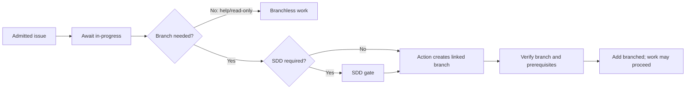
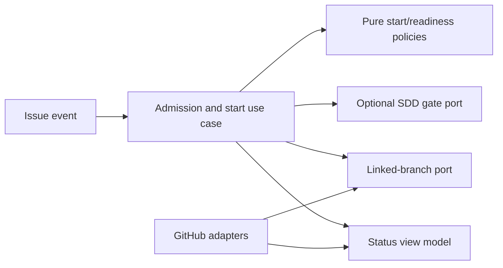

# Uniform Issue Start and Branch Readiness

- Status: Implemented — automated verification complete; live provider UX review pending
- Date: 2026-09-17
- Catalog capability ID: `issue-start-and-sdd-readiness`
- Last verified: 2026-09-17 on `codex/issue-start-sdd-gate`
- Owners: Copilot maintainers
- Scope: one explicit start signal for every enabled issue kind and a factual branch-ready signal
- Related issues/PRs: none; local design work; companion SDD `pre-branch-sdd-gate.md`
- Required review gates: product UX, architecture, testing, documentation, security/operations
- Open decisions blocking readiness: none in the product flow; maintainer review remains pending

## 1. Executive summary

A maintainer starts active work on any admitted issue by adding `in-progress`.
The Action treats that label as a durable start request. It creates a linked
branch only when issue-managed branches are enabled for that issue kind. The
Action applies `branched` after it verifies the exact linked branch and, when
the SDD gate applies, its required first SDD commit. A help issue may complete
without a branch and never receives `branched`. Opening or classifying an issue
does not start agent work, branch creation, or deployment.

```text
issue opened -> admission -> waiting for in-progress
in-progress -> branchless work | SDD gate -> linked branch -> branched
branched -> implementation and PR review -> completion
```

Text equivalent: the issue is first admitted and waits. An authorized
`in-progress` addition starts work. Branchless work proceeds without a branch;
branch-bearing work completes any required SDD gate, creates and
verifies the linked branch, and only then displays `branched`.

## 2. Problem, former behavior, and evidence

### 2.1 Problem

Before this change, the `branched` label was both a branch launcher and a statement that a
branch exists. A reader cannot distinguish intent from a completed fact.
`branch-management-always` and release/hotfix shortcuts create additional launch
paths. Those paths would bypass a future SDD gate and make issue kinds
behave differently. The former label `state:in-progress` meant branch-based
implementation, so a new start label needs a separate, explicit meaning.

### 2.2 Former behavior before this change

1. The issue workflow runs on opened, reopened, edited, labeled, unlabeled,
   assigned, and unassigned events.
2. Runtime admission classifies the live issue before the agent runtime and
   repository mutation boundary.
3. `Execution.isBranched` becomes true when `branch-management-always` is true,
   the configured `branched` launcher is present, or release/hotfix makes a
   branch mandatory. Help is explicitly branchless.
4. The issue use case currently assigns, updates title/type, links projects,
   checks size, and prepares a branch when `isBranched` is true.
5. Release/hotfix Issue Forms carry `branched` initially; a release/hotfix type
   can also cause branch creation without that label.
6. Successful managed branch preparation moves the issue to an in-progress
   project column. Lifecycle synchronization then derives `state:in-progress`
   from a successful branch-preparation result.
7. `branched` is also described in generated collaborator guidance as the
   implementation launcher.

### 2.3 Evidence

- Action event surface: `.github/workflows/copilot_issue.yml`.
- Admission and orchestration: `src/actions/common_action.ts`,
  `src/domain/issue_workflow_runtime_policy.ts`,
  `src/application/usecases/issue_use_case.ts`, and
  `src/application/usecases/issue_workflow.ts`.
- Current launch and branch facts: `src/data/model/execution.ts`,
  `src/data/model/labels.ts`,
  `src/application/usecases/steps/issue/prepare_managed_branch.ts`, and
  `src/application/usecases/steps/issue/prepare_branches_use_case.ts`.
- Lifecycle: `src/domain/copilot_lifecycle.ts`,
  `src/application/policies/lifecycle_state_policy.ts`, and
  `src/application/usecases/actions/synchronize_lifecycle_state_use_case.ts`.
- Setup, forms, and public guidance:
  `src/application/policies/setup_issue_workflow_policy.ts`,
  `setup/ISSUE_TEMPLATE/release.yml`, `setup/ISSUE_TEMPLATE/hotfix.yml`,
  `docs/issues/branch-management.mdx`, and
  `.copilot/AGENT_GUIDE.md`.
- External provider fact: GitHub delivers issue `labeled` events; see
  https://docs.github.com/en/actions/reference/workflows-and-actions/events-that-trigger-workflows.
- Unknowns: there is no production adoption evidence for this proposed
  contract. The user explicitly chose a clean replacement without aliases.

### 2.4 Retrospective classification (as-built baselines only)

Not applicable. This was a prospective change. Section 2.2 records the prior
behavior; the current contract is defined by this SDD and its companion. The
managed-issue baseline has been updated to point to the new start boundary.

## 3. Actors, surfaces, and terminology

| Actor | Goal | Entry point | Visible surfaces |
|---|---|---|---|
| Issue author | Describe work and answer questions | Issue Form/comments | Issue, clarification card |
| Maintainer | Admit and start work | Add `in-progress` | Issue labels/status, Job Summary |
| Contributor | Begin on the exact branch | Linked branch; later PR | `branched`, branch URL, SDD commit if required |
| Operator | Recover partial work | Rerun/reconcile | Issue status, Action run, retained branch |
| Copilot Action | Enforce state and publish facts | Issue/comment events | Labels, comments, checks, branch |

`in-progress` is an intent label: an authorized request to start the issue
workflow, including SDD discovery and clarification. `branched` is
an output fact: the linked branch and its required first SDD commit
are verified. `state:specifying` means SDD work is underway;
`state:working` means a verified linked branch can be used for implementation.
Branchless help and planning use `state:planned` after a successful response.
These managed states replace `state:in-progress` in
the new contract. Waiting labels remain orthogonal. A branch name or label
alone never proves readiness.

## 4. Goals, non-goals, and fixed invariants

### 4.1 Goals

1. Every enabled issue kind MUST use the same `in-progress` start boundary.
2. `branched` MUST be present only while an exact, ready linked branch is
   supported by authoritative branch and operation evidence.
3. A branch-required operation MUST NOT start from issue opening, type labels,
   `branched`, or an old always-on setting.
4. A help issue MUST remain branchless and MUST NOT receive `branched`.
5. An operator MUST be able to distinguish waiting, specifying, working,
   partial, and blocked states from the issue without opening logs.

### 4.2 Non-goals

- This SDD does not define SDD selection, clarification, drafting, or validation;
  the companion SDD owns that gate.
- It does not automate implementation merely because a branch is ready.
- It does not change release/hotfix origin, promotion, tagging, or deployment
  authorization semantics.

### 4.3 Fixed product/safety invariants

1. Runtime admission and actor authorization precede active mutation.
2. Only the Action owns remote branch creation, selection, rename, and cleanup.
3. `deploy` cannot dispatch a release/hotfix operation until the required branch
   is ready, and still requires its separate explicit authorization.
4. Replays, stale payloads, and user-applied output labels cannot manufacture
   readiness or create duplicate branches.
5. Removing a start label cannot silently delete a linked branch or commits.

## 5. Current versus proposed product journey

| Stage | Current | Proposed | User/operator effect |
|---|---|---|---|
| Issue opened | May enrich, answer, and launch a mandatory branch | Admit/classify; report waiting state | Owner chooses when work starts |
| Start | `branched`/always-on/type shortcut | Authorized `in-progress` | One deliberate transition |
| SDD | No gate | Optional companion gate before branch | Questions answered first |
| Branch | Label can request branch | Action verifies exact linked ref | `branched` is trustworthy |
| Work | `state:in-progress` from branch result | `state:specifying` then `state:working` | Clear phase wording |
| Release/hotfix | Type can branch immediately | Same start gate; original base rules retained | Uniform control |



Text equivalent: an admitted issue waits for `in-progress`. Branchless work
runs directly. Branch-bearing work completes the optional SDD gate,
then the Action creates and verifies its linked branch before adding
`branched`.

## 6. Functional behavior and state model

### 6.1 Happy path

1. Opening an issue validates one enabled kind and the installed form. The
   issue shows that it is waiting for an authorized start; no agent writes,
   branch creation, or deployment occurs.
2. A permitted actor adds `in-progress`. The Action reloads live issue state,
   records the start operation, and moves the project item to active work.
3. For a branchless help issue, the Action answers the question and records a
   completed branchless result; it never adds `branched`.
4. For a branch-bearing issue, the SDD gate either completes or is
   skipped by policy. The Action selects the existing kind-specific parent and
   exact safe branch name, creates/reuses the linked branch, verifies it, and
   adds `branched` once all prerequisites are true.
5. The issue status links the branch and first SDD commit when applicable.
   Contributors then start implementation and the normal PR flow separately.

### 6.2 Alternative paths

- An eligible issue opened with an authorized `in-progress` label is treated as
  one start request; installed Issue Forms MUST NOT apply it by default.
- `in-progress` can remain while an issue waits for clarification; this is
  work in progress, while `state:specifying` names its current phase.
- If issue-managed branching is disabled, a branch-bearing kind may receive
  read-only planning/answering, but no file-changing implementation. Setup
  rejects this combination when release/hotfix workflows or the SDD gate
  are enabled.
- Removing `in-progress` before branch creation cancels pending agent work and
  retains answered questions. Removing it afterward stops new automatic
  launches but retains `branched` while the branch remains ready.
- Re-adding `in-progress` resumes the same issue operation from durable facts.
  It does not restart a completed SDD or branch creation step.
- A manually applied `branched` label is reconciled against the exact linked
  branch and gate state; unsupported readiness is removed with a clear status.
- A material post-publication change to a required SDD contract enters
  revision-pending. The Action removes `branched` while that revision is open,
  retains the linked branch and first commit, and restores `branched` after the
  revised SDD is validated and verified on the same remote branch.
- Disabling or changing issue kind during an active operation uses the existing
  fail-closed admission and continuation rules; it cannot fall through to
  another branch kind.

### 6.3 State machine

| State | Entered when | Visible meaning | Allowed next | Recovery/owner |
|---|---|---|---|---|
| waiting-to-start | Admitted; no start latch | Add `in-progress` | specifying, preparing, planned | Maintainer |
| specifying | Start accepted; docs gate open | Questions/docs are underway | waiting-for-answer, preparing, blocked | Issue author/Action |
| waiting-for-answer | Blocking question posted | Answer in issue | specifying, canceled | Named respondent |
| preparing | Docs done or skipped | Branch being created/verified | working, partial, blocked | Action/operator |
| planned | Branchless help or planning response succeeded | Answer or plan available | complete, blocked | Issue author/maintainer |
| working | Exact linked branch verified | Branch work can continue | reviewing, blocked, complete | Contributor |
| partial | Branch exists; prerequisite incomplete | Branch retained; implementation waits | preparing, blocked | Operator |
| blocked | Invalid/failed prerequisite | Named recovery action required | prior safe state | Maintainer/operator |
| canceled | Start removed before branch | No new work will run | waiting-to-start | Maintainer |
| complete | Linked work finished | No action required | reopened | Maintainer |

Managed lifecycle labels are a view of these durable facts. A missing label
may be repaired; a label without supporting facts never authorizes mutation.

## 7. User-facing configuration

| Input | Type | Recommended default | Allowed values/range | Scope/persistence |
|---|---|---|---|---|
| `issue-managed-branches` | boolean | `true`: branch-bearing work uses Action branches | `true`, `false` | Repository setup and Action input; snapshot at accepted start |
| Start label | fixed | `in-progress` | fixed | Repository label, never a free-form command |
| Ready label | fixed | `branched` | fixed | Repository label derived from live branch facts |
| Lifecycle labels | bounded set | `state:specifying`, `state:working`, existing review/wait states | names from one installed catalog | Repository setup, rendered from durable state |
| `development-branch` / `main-branch` | safe branch names | existing setup defaults | existing validated names | Snapshot at branch preparation |

Recommended setup: issue-managed branches enabled and explicit start by
`in-progress`. Meaningful alternative: branches disabled for repositories
using Copilot only for help and read-only planning; release/hotfix and the
pre-branch SDD gate must then be disabled. Setup MUST reject
`issue-managed-branches=false` with release, hotfix, or SDD-gate
configuration. Runtime MUST repeat the check against the installed profile.
The old `branch-management-launcher-label` and `branch-management-always`
inputs, setup questions, generated profile fields, and compatibility aliases
are removed in the same implementation; unknown retired values fail validation
with a migration-free correction. Start/ready label names, actor checks,
branch ownership, safe refs, and deployment separation are not configurable.

## 8. Clean Architecture design

### 8.1 Responsibilities and dependency direction

| Boundary | Owns | Must not own/import |
|---|---|---|
| Domain policies | Start eligibility, branch readiness, state transitions | Octokit, Git processes |
| Application use case | Admission, start, optional gate, preparation, verification, result order | Provider DTOs |
| Semantic ports | Live issue, linked branch, durable state, labels, project action | SDK request shapes |
| Provider adapters | GitHub issue/branch APIs and error mapping | Eligibility policy |
| Composition | Bind ports and credentials | Duplicate transition policy |
| Entrypoints | Normalize issue/comment events and trust boundary | Branch decisions |
| Presentation | One status card, labels, check/summary views | Repository mutation |



Text equivalent: the event adapter invokes the application use case. Pure
policies decide eligibility and readiness. The use case coordinates the
optional SDD gate and linked-branch capability; GitHub adapters
perform provider operations, and presentation renders the outcome.

### 8.2 Contracts, state, and trust boundaries

- `IssueStartSnapshot`: issue ID, admitted kind, actor authorization, start
  label presence, effective branch configuration, and current profile digest.
- `BranchReadinessDecision`: `not-required | pending | ready | partial | blocked`
  plus exact branch/ref evidence and SDD-gate outcome.
- Durable start state records operation ID, issue revision/digest, kind,
  configuration snapshot, gate state, exact parent/ref, and completed effects.
- The Action serializes active operations by repository and issue. A retry
  re-reads the remote ref and persisted facts before mutation. Non-fast-forward
  pushes fail and re-evaluate; force push is forbidden.
- Issue bodies, comments, labels, and event payloads are untrusted. Provider
  authority is bound in composition; generated status does not become command
  input. Errors map to semantic `invalid`, `unauthorized`, `unavailable`,
  `stale`, and `partial` results.

### 8.3 Executable architecture constraints

- Pure start/readiness policies cannot import provider, process, or UI modules;
  add dependency-boundary checks.
- Workflow/setup contract tests parse the installed form, Action inputs,
  profile, guide, and label catalog; no retired launcher input may remain.
- The managed branch command is the only remote branch creation path.
- Presentation tests prove a `branched` label requires exact linked branch
  evidence and, when applicable, committed SDD evidence.

## 9. UI/UX and content contract

### 9.1 Information hierarchy

The first visible status says what is happening, what completed, what comes
next, whether a person must act, the impact of partial failure, and where to
inspect the branch/run. One status card is updated in place; labels provide a
compact supplement.

### 9.2 Representative issue views

Illustrative issue `#501` and URLs below are examples, not existing resources.

Pending:

```markdown
## Work status
> **Current status:** Waiting to start.
> **Completed:** The Feature issue was admitted.
> **Next:** Add `in-progress` when work should begin.
> **Action required:** A maintainer adds the label. No branch exists yet.
[Issue #501](https://github.com/vypdev/copilot/issues/501)
```

Action required during an SDD gate:

```markdown
## Work status
> **Current status:** Waiting for two specification answers.
> **Completed:** Work was started; no branch exists yet.
> **Next:** The Action will finish the SDD plan after the answers.
> **Action required:** Issue author, answer questions 1 and 2 below.
[Questions on issue #501](https://github.com/vypdev/copilot/issues/501)
```

Blocked before a branch:

```markdown
## Work status
> **Current status:** Branch preparation is blocked.
> **Completed:** The issue was admitted and started.
> **Impact:** No branch or commit was created.
> **Action required:** Correct the invalid `development-branch` in setup, then rerun.
[Action run](https://github.com/vypdev/copilot/actions)
```

Partial after branch creation:

```markdown
## Work status
> **Current status:** SDD publication is incomplete.
> **Completed:** Linked branch `feature/501-work-start` exists.
> **Impact:** Implementation is waiting; `branched` has not been added.
> **Action required:** Retry the failed publication on the same branch.
[Linked branch](https://github.com/vypdev/copilot/tree/feature/501-work-start) · [Action run](https://github.com/vypdev/copilot/actions)
```

Complete readiness:

```markdown
## Work status
> **Current status:** Ready for implementation.
> **Completed:** The linked branch and any required SDD commit are verified.
> **Next:** Work on the linked branch and open a PR through the normal workflow.
> **Action required:** No start action remains.
[Linked branch](https://github.com/vypdev/copilot/tree/feature/501-work-start) · [SDD commit](https://github.com/vypdev/copilot/commits/feature/501-work-start)
```

### 9.3 Issue, PR, and comment behavior

- One bounded issue status comment is updated by a durable marker such as
  `<!-- copilot-work-readiness:v1 issue=501 -->`; do not append a new status
  comment for every event. Clarification questions have their own single
  correlated comment owned by the companion gate.
- A PR opened later can reference the issue and its SDD commit. Closing or
  merging remains under the existing PR lifecycle rules.
- `in-progress` remains until work completes or is explicitly canceled.
  `branched` remains a derived branch fact even when a later review state is
  `reviewing` or an unrelated `blocked` state. A pending required-SDD
  revision removes `branched` until the updated contract is published.
- Status, check, and Job Summary link exact issue, branch, commit, PR, and run
  when those facts exist; missing links are never fabricated.

### 9.4 Accessibility and localization

Use the issue locale and complete English fallback from the existing message
catalog. Headings and plain text carry meaning without color or emoji. Status
fits narrow/mobile views, uses descriptive links, and preserves screen-reader
order. Escape untrusted titles, Markdown, mentions, commands, and URLs. Mermaid
is accompanied by the textual equivalent above.

## 10. Failure, recovery, and cleanup

| Condition | Impact | Retained facts | Automatic retry | Required action | Cleanup |
|---|---|---|---|---|---|
| Admission/actor fails | No active work | Issue and reason | After correction | Correct form/permissions | None |
| Start removed before mutation | Work canceled | Answers and audit | On re-add | Re-add `in-progress` | Remove transient state |
| Branch API fails before creation | No branch | Operation ID and safe target | Bounded retry | Inspect run if persistent | No deletion |
| Branch exists, label update fails | Ready branch may be hidden | Exact branch/ref | Reconcile | Rerun status reconciliation | Preserve branch |
| Branch exists, docs commit fails | Implementation blocked | Exact branch and docs state | Same-ref retry | Fix validation/push conflict | Preserve branch |
| Wrong/manual `branched` | Misleading label | Provider truth | Reconcile on event | Inspect status if disputed | Remove unsupported label |
| Release/hotfix origin mismatch | No unsafe branch | Verified tag/develop SHA | After correction | Correct source facts | Never rewrite origin silently |

Error content follows impact, cause, action, then retained state. A branch
created before a later failure is reported as retained; no message describes
that whole operation as if nothing happened.

## 11. Security, permissions, and privacy

1. An authorized actor must request start; the Action independently verifies
   live issue admission and creator/type restrictions before any write.
2. The issue text, comments, and labels cannot supply arbitrary refs, commands,
   files, token scopes, or target repositories. Fixed label names and validated
   branch names bound the operation.
3. GitHub credentials stay inside adapters or the narrow commit step; they
   never appear in agent prompts, comments, docs, or logs.
4. Every readiness update checks repository ID, issue number, exact linked ref,
   and expected remote SHA. Duplicate and out-of-order events cannot publish a
   false `branched` fact.
5. Deployment remains an independently authorized operation. This SDD grants
   no permission to merge, tag, release, or deploy.

## 12. Observability and operational UX

The issue status card is the user source of progress; a Job Summary records
transition, operation ID, exact branch/base SHA, SDD-gate result, retry
reason, and next actor. Logs carry correlation IDs and sanitized provider
codes. An outstanding human answer is a pending dependency, distinct from an
Action failure. At most one status card and one active clarification card are
maintained per issue; unchanged event replays are silent.

## 13. Compatibility, rollout, and rollback

The user has stated there is no adoption requiring legacy behavior. The
implementation removes the old launcher and always-on inputs, generated
profile fields, setup prompts, form labels, and documentation in one release.
There is no alias or silent fallback. A setup with retired inputs fails with a
correction message. Existing local or remote branches are not renamed or
deleted by migration; an already linked branch is reconciled from exact facts.
Rollout checks a clean installed setup for each enabled issue kind and one live
issue transition. Rollback can restore a prior package/workflow version but
cannot erase branches or commits already published; reconciliation is explicit.

## 14. Testing strategy and numeric budget

The following **68 distinct cases** are the floor, derived from six kind
transitions, start/stop/replay races, branch partial results, and visible UX.

| Area | Minimum cases | Behaviors and risks |
|---|---:|---|
| Domain/configuration/pure policy | 12 | Start eligibility, six kinds, output label truth |
| State and replay/race transitions | 12 | Open/start/remove/re-add, stale payload, duplicate |
| Application orchestration | 10 | Admission, help, project, gate, branch order |
| Provider adapters/error mapping | 8 | Link/create/reuse, SHA, partial failures |
| Workflow/setup/profile contracts | 8 | Forms, retired inputs, generated guidance |
| UI/localization/accessibility | 8 | Five states, links, locale, sanitization |
| Integration/security/recovery | 10 | End-to-end kinds, auth, deploy, retained branch |
| **Total** | **68** | No case counted twice |

Global Jest thresholds in `jest.config.js` and existing coverage budgets remain
mandatory. New pure transition policy SHOULD reach at least 95% branch
coverage; changed issue/admission modules SHOULD reach 95% lines/statements and
90% branches/functions through the dedicated budget gate. Use deterministic
fakes for events, IDs, time, branch propagation, and GitHub responses; no real
waits or live GitHub calls in automated tests. Workflow checks must parse YAML
and form structure. UI tests use semantic assertions plus representative
golden Markdown rather than snapshots alone. Human evidence checks desktop,
mobile, light/dark, screen-reader order, and a live linked branch.

## 15. Documentation and discoverability

| Audience | Artifact | Required content | Validation/navigation |
|---|---|---|---|
| Contributor | `docs/issues/index.mdx`, `branch-management.mdx` | Start, branch readiness, help path | Docs routes/links |
| Setup owner | `docs/issues/configuration.mdx`, `workflow-setup.mdx` | New input, removed inputs, examples | Setup/doctor fixtures |
| Operator | `docs/issues/notifications-and-auto-close.mdx` | Partial branch recovery and replay | Scenario links |
| Maintainer | `docs/development/specifications.mdx`, architecture docs | State/port ownership | Boundary check |
| Repository agent | `.copilot/AGENT_GUIDE.md` and profile generator | Wait for Action-ready branch | Generator contract |

Documentation examples must match installed forms and fixture output. The
as-built managed issue SDD and `specs/catalog.json` must be updated alongside
implementation to reflect the new observed contract.

## 16. Acceptance scenarios

1. Given each of the seven admitted issue kinds, opening it without
   `in-progress` performs admission but no active work or branch creation.
2. Adding `in-progress` to feature, bugfix, docs, chore, release, or hotfix
   starts exactly one operation; each branch uses its existing semantic base.
3. Adding `in-progress` to help starts the answer path and never produces a
   branch or `branched`; branch cleanup and deployment are not invoked.
4. Release/hotfix type labels and form creation without `in-progress` do not
   create a branch or dispatch deployment.
5. A branch with a required SDD gate gets `branched` only after the
   verified SDD commit; a branch without the gate gets it after
   exact linked-ref verification. Obsolete branch cleanup and deployment
   wait for that verification.
6. Removing and re-adding start before branch creation resumes safely without
   duplicate branch or SDD work; removal after creation retains facts.
7. A user-added `branched`, stale webhook, or duplicate run cannot authorize
   implementation without verified linked branch evidence.
   A material required-SDD revision removes it until the updated contract
   is verified on that branch.
8. Branch creation followed by label or SDD publication failure reports
   the retained branch and a same-ref recovery action.
9. Invalid setup combinations and retired launcher inputs fail with precise
   setup/doctor guidance; no compatibility alias runs.
10. An unauthorized actor cannot create a branch or deploy by manipulating
    labels, issue text, or a comment.
11. Each pending, action-required, blocked, partial, and ready example is
    readable in the configured locale and English fallback on narrow/mobile
    and screen-reader views.
12. The installed forms, Action inputs, profile, guide, user docs, tests, and
    owning SDD agree on the new label meanings.

## 17. Requirements traceability

| Requirement | Owner | Test/evidence | Documentation |
|---|---|---|---|
| 4.1.1 uniform start | Start policy/issue route | Domain + six-kind integration | Workflow setup |
| 4.1.2/4.3.4 readiness truth | Readiness policy/branch port/presenter | Replay, spoof, partial tests | Branch management |
| 4.1.3 no old launch | Setup/action admission | Workflow/form contract tests | Configuration |
| 4.1.4 help branchless | Issue kind policy | Help integration | Help page |
| 4.1.5 visible state | Status presenter | Golden/semantic + human UX | Issue overview |
| 4.3.1 authorization | Admission/actor port | Security tests | Auth guide |
| 4.3.2 branch owner | Linked branch port | Adapter/architecture check | Agent guide |
| 4.3.3 deployment | Deployment admission | Release/hotfix scenarios | Deployment guide |
| 4.3.5 no implicit cleanup | Recovery use case | Partial/cancel tests | Operator guide |

## 18. Implementation sequence

1. Change the setup/profile contract and tests to fixed start/ready labels and
   bounded issue-managed branching; remove retired options and templates.
2. Add pure start/readiness/state policies and architecture checks.
3. Move the start boundary into admission/application orchestration, keeping
   ordinary issue opening passive.
4. Bind the companion SDD gate and exact branch evidence ports.
5. Reconcile labels, project state, comments, checks, and summaries from
   durable facts; add locale and sanitization fixtures.
6. Update generated agent guidance, existing SDD, catalog evidence, all issue
   docs, and workflow contracts.
7. Run automated gates and controlled live UX checks before marking the SDD
   implemented.

## 19. Definition of Done

- [ ] Every normative start/branch requirement has an acceptance case and owner.
- [ ] The Action owns every remote branch and verifies exact linked readiness.
- [ ] Release/hotfix origin and separate deployment authorization remain intact.
- [ ] The 68-case minimum and repository/changed-module coverage gates pass.
- [ ] Forms, setup, profile, doctor, Action inputs, docs, and agent guide agree.
- [ ] Pending, action, blocked, partial, and ready issue content is localized,
      accessible, sanitized, and quiet on replay.
- [ ] Partial branches are retained and recoverable without force push or
      unrelated cleanup.
- [ ] `generate:specifications`, `validate:specifications`, documentation,
      workflow, architecture, and package gates pass.
- [ ] Maintainer review confirms no readiness-blocking decision remains.

## 20. References and decisions

- Existing contracts: `specs/managed-issue-and-branch-lifecycle.md`,
  `specs/configurable-issue-workflows-and-admission.md`,
  `specs/repository-agent-collaboration-contract.md`.
- Companion design: `pre-branch-sdd-gate.md`.
- Provider reference: https://docs.github.com/en/actions/reference/workflows-and-actions/events-that-trigger-workflows.
- Accepted product decisions from the user conversation: one start label for all
  kinds, `branched` as output, SDD requires issue-managed branches, no legacy
  launcher path, and help remains branchless.
- Rejected design: `branched` as an input, mandatory type-specific auto-launch,
  and label-only readiness without provider evidence.
- Follow-up outside this SDD: SDD selection/generation policy (the companion
  specification), release promotion, and later live provider UX review. PRD/ADR support
  would require a separate future design.
