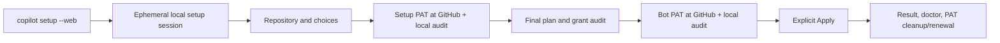
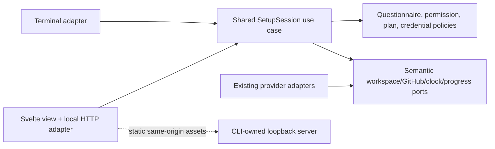

# Local Web Setup Assistant

- Status: Implementation in progress — target contract, not yet release acceptance
- Date: 2026-09-28
- Catalog capability ID: `local-web-setup-assistant`
- Last verified: 2026-10-05 (PR #402 merge baseline and fixture-only follow-up evidence are recorded below; the operator incident is external evidence, not agent dogfooding)
- Owners: Copilot maintainers; product, security, and accessibility reviewers
- Scope: optional, local Svelte-based presentation of the existing repository setup journey, sharing its policy, credential, and application engine with the terminal
- Related issues/PRs: [merged PR #402](https://github.com/vypdev/copilot/pull/402) established the baseline; this follow-up starts from its merge on `develop`. No test issue or Action is created.
- Required review gates: product UX, Clean Architecture, browser/loopback security, credential handling, packaging, cross-platform operation, accessibility, testing, documentation
- Open decisions blocking readiness: active PAT capability probes, incremental permission feedback, cleanup recovery, and live provider review described in the permission SDD remain open

### 2026-10-05 permission-audit correction

The web assistant MUST show live, localized progress for each permission after
PAT submission. At PAT entry, identity and READ rows run; WRITE rows clearly
wait for approval of the reviewed plan. After approval and before application,
the final audit runs the selected temporary WRITE probes with live progress.
The plan warns about temporary resources and any visible GitHub audit trail.
Each READ row performs the named read and accepts an empty
successful response; each required WRITE row performs a resource-specific
temporary create/read/delete probe with exact-target cleanup. The session
shows the current phase, result, bounded HTTP category in the selected web
locale, and any unresolved
cleanup action. Neither a generic `Unverifiable` write row nor operator
attestation is an accepted completion state. The same application audit and
evidence rules apply to CLI. See
[`setup-pat-permission-guidance-and-verification.md`](./setup-pat-permission-guidance-and-verification.md#0-acceptance-correction-2026-10-05)
for the normative transaction table and 63 additional test cases. §18–19
remain open until fixture tests, packaged operation, four-locale and
accessibility review, and explicitly authorized live cleanup evidence pass.
If cancellation or expiry overlaps an audit, confirmed deletion of all
temporary resources retains the ordinary cancelled or blocked result. An
unconfirmed cleanup produces a partial result and preserves the permission
failure and local recovery journal, including during the final pre-Apply
recheck. The browser must show the affected row and recovery action.

## 1. Executive summary

The default `copilot setup` remains the terminal wizard. `copilot setup --web`
starts a short-lived web assistant on this machine and opens the default
browser. It presents repository identity, setup choices, the temporary setup
PAT, the reviewed plan, the bot PAT and other credentials, and final application
as one clearly advancing journey. A failed browser launch prints a local URL
and a terminal fallback. It never creates a hosted account, proxies setup
through an external service, or treats the browser as a GitHub login session.

Svelte + TypeScript + Vite is the presentation/build choice; the packaged
Node CLI serves compiled local assets and owns the setup session. Both UIs
MUST call the **same application decisions and provider ports**. The browser
MUST NOT run GitHub mutations, read repository files directly, or reproduce
the permission/questionnaire policy. Before adding the web adapter, the
orchestration currently embedded in `src/cli/commands/setup.ts` MUST be
extracted into frontend-neutral application contracts. Existing terminal
behavior remains the compatibility baseline.

```text
copilot setup --web
  -> local browser: Repository -> Setup choices -> Setup PAT
  -> reviewed plan -> Bot PAT & credentials -> Apply -> Result/cleanup
  -> GitHub form in a separate tab for each PAT, when guided creation is chosen
```

Text equivalent: one local setup session has two optional presentation
adapters. GitHub still authenticates the operator/bot accounts, performs 2FA,
issues PATs, and lets their owners delete or rotate them. Copilot validates
each supplied token and applies only a newly approved plan.

## 2. Problem, current behavior, and evidence

### 2.1 Problem

The six-stage terminal journey is functional but has many conditional choices,
two account roles, provisional permissions, a plan, and partial outcomes. A
first-time operator can benefit from persistent visual context, progressive
explanations, and a review screen without sacrificing the CLI or creating a
second implementation of setup rules.

### 2.2 Verified baseline before this implementation

1. `src/cli/commands/setup.ts` owns command flags, repository resolution,
   setup-PAT intent, the initial and final permission audits, wizard
   composition, bot-credential collection, and the `runLocalAction` call.
   At the start of this work, the web entrypoint did not exist; the current
   implementation status and remaining release gates are recorded in §18.
2. `SetupJourneyUseCase`, `SetupQuestionnaireController`,
   `SetupWizardUseCase`, `SetupCredentialsUseCase`, the permission policies,
   and existing GitHub/workspace adapters already separate parts of the
   behavior. They are not yet one frontend-neutral setup-session coordinator.
3. The terminal supports guided and manual PAT entry. GitHub's official
   fine-grained PAT form URL pre-fills documented fields but cannot select an
   individual repository or authenticate a browser account. The setup PAT is
   one-run authority; the bot PAT is a distinct runtime Secret `PAT`.
4. At baseline, `package.json` published `build/cli/index.js` and selected
   other bundles but no web asset directory. The new Vite/npm-pack contract
   is described in §8.3 and its current evidence in §18.
5. The existing setup contract includes manual/unattended/dry-run paths,
   final grant re-audit, storage-shadow checks, backups, partial mutation
   reporting, and no claim of remote PAT deletion.

### 2.3 Evidence and limits

- Repository sources: [setup baseline](./setup-configuration-credentials-and-doctor.md),
  [operator PAT](./temporary-setup-operator-authorization.md),
  [bot PAT](./guided-bot-pat-onboarding.md),
  [permission evidence](./setup-pat-permission-guidance-and-verification.md),
  `package.json`, `src/cli/commands/setup.ts`, and setup use cases/tests.
- [GitHub's PAT form](https://docs.github.com/en/authentication/keeping-your-account-and-data-secure/managing-your-personal-access-tokens#pre-filling-fine-grained-personal-access-token-details-using-url-parameters)
  supports documented prefill fields, not issuance, account selection, or
  individual-repository selection; [GitHub's account switcher](https://docs.github.com/en/authentication/keeping-your-account-and-data-secure/switching-between-accounts)
  remains browser-owned.
- [Svelte](https://svelte.dev/docs/svelte/overview) compiles UI components;
  [Vite](https://vite.dev/guide/) supports a `svelte-ts` application and
  produces static assets. SvelteKit/SSR is unnecessary for this local flow.
- [OWASP CSRF guidance](https://cheatsheetseries.owasp.org/cheatsheets/Cross-Site_Request_Forgery_Prevention_Cheat_Sheet.html),
  [CSP guidance](https://cheatsheetseries.owasp.org/cheatsheets/Content_Security_Policy_Cheat_Sheet.html),
  and [browser-storage guidance](https://cheatsheetseries.owasp.org/cheatsheets/HTML5_Security_Cheat_Sheet.html)
  inform the local-server threat model. These are security controls, not a
  claim that loopback or a frontend framework makes secret input risk-free.
- Unknown until implementation: the exact packaged asset manifest, browser
  opening support on each OS, and human usability of the final wireframes.
  These are measured in the acceptance gates, not assumed from dev mode.

### 2.4 Retrospective classification

Not applicable: this is a prospective mode, not an as-built baseline. The
verified CLI behavior above remains the baseline and is not relabeled as
already web-capable.

## 3. Actors, surfaces, and terminology

| Actor | Goal | Entry/surface |
|---|---|---|
| Setup operator | Configure one local checkout and understand what changes | shell launch, local browser wizard, final terminal result |
| Operator PAT owner | Authorize setup only | GitHub form/account switcher/2FA, then local masked web input |
| Bot PAT owner | Issue an Action runtime credential | separate GitHub form/account switcher/2FA, then local masked web input |
| Organization admin | Approve access when required by policy | GitHub's own approval UI; not Copilot's local page |
| Maintainer | Diagnose partial setup and renewal | result, `copilot doctor`, GitHub resources, docs |

**Web session** is one ephemeral CLI-owned run bound to one canonical local
repository. **Plan revision** identifies the exact validated configuration,
repository/workspace facts, remote evidence, grant sets, and file decisions
reviewed by the operator. **Browser controller** is the one tab allowed to
submit actions at a time. **Secret value** is never part of a page view model.
**Installed** means a GitHub Secret write succeeded, not that an Action ran
or that the stored value can be read back. **Discarded locally** does not mean
deleted at GitHub or cryptographically erased from browser/process memory.

## 4. Goals, non-goals, and fixed invariants

### 4.1 Goals

1. `--web` MUST be an optional interactive presentation of the same setup
   engine, with feature, grant, plan, and mutation parity with terminal setup.
2. The web journey MUST explain current/completed/next states, show reasons
   for conditional choices, retain answers while reviewing, and make every
   change to required PAT grants visible before the relevant PAT is used.
3. The web journey MUST guide both PAT roles separately, verify actual
   identity/access/grants under the existing policies, and show truthful
   cleanup/renewal after success, failure, or cancellation.
4. Application MUST require an explicit, current, single-use final approval;
   stale pages, duplicate clicks, and changed repository/remote facts MUST
   NOT apply a plan that was not just reviewed.
5. A packaged global npm install MUST launch the same bundled UI without
   Vite, source files, dev dependencies, network asset fetches, or a writable
   checkout of Copilot.

### 4.2 Non-goals

1. Hosted SaaS, remote access, LAN sharing, Docker-facing binding, mobile
   access to another computer, or simultaneous multi-user setup.
2. Browser automation of GitHub, scraping private requests/cookies,
   capturing 2FA, automatic PAT minting/revocation, or local account profiles.
3. Replacing the bot PAT with a GitHub App, changing Action runtime
   authentication, or changing current CLI defaults/flags outside `--web`.
4. Persistent drafts or crash-resume containing credentials. A future
   resumable setup needs a separate storage/security design.
5. New GitHub issues, PRs, Actions, or dogfooding as part of this spec task.

### 4.3 Non-configurable safety invariants

1. Only `127.0.0.1` on an OS-assigned ephemeral port is bound; no public
   `--host`/`--port`, reverse proxy, external asset, CDN, telemetry endpoint,
   or permissive CORS is added. The exact origin is checked on requests.
2. Browser-originated events are untrusted. No GET or asset request mutates
   repository/GitHub state. API calls are schema-validated, revision-bound,
   method-limited, size-limited, and CSRF-protected.
3. PATs, provider keys, session capabilities, cookies, and 2FA codes never
   enter URLs, browser history/storage, service workers, config, logs, error
   payloads, plans, snapshots, or client-side analytics. No value is returned
   to the browser after submission.
4. The setup PAT and bot PAT never exchange roles. The operator token is not
   Secret `PAT`; the bot token is not authority for setup writes. GitHub owns
   each token's issuance, approval, expiration, and revocation.
5. The existing permission, identity, repository, storage-shadow,
   confirmation, backup, and partial-result gates apply equally to both UIs.
   A visual indicator or typed assertion is never authorization evidence.
6. Applying starts at most once per approved plan revision. No automatic
   destructive rollback of completed local or remote changes is claimed.

## 5. Current versus proposed journey

| Stage | Terminal today | Web proposal | Operator effect |
|---|---|---|---|
| Launch/repository | `copilot setup` resolves git remote | `copilot setup --web` shows canonical checkout, owner/repo, branch and scope; asks confirmation if ambiguous | see target before entering a PAT |
| Setup choices | linear conditional questions; explicit review pass possible | grouped cards and explanations, saved answers, source-locked values, live grant implications | understand what a choice enables |
| Setup PAT | terminal permission summary + GitHub form link or manual input | role-labelled summary, remote unknowns, official link, account/repo checklist, masked local paste and audit | no inferred browser identity |
| Plan | terminal file/resource preview and confirmation | inspectable grouped diff/Secret names/scopes/warnings, single approved revision | know local and remote effects |
| Bot PAT & credentials | guided/manual bot link and secret prompts | separate bot identity/grants/renewal step, masked values, no cross-role reuse | know persistent credential owner |
| Apply/result | CLI executes and reports | explicit Apply, live semantic progress, partial facts, recovery and cleanup | no false reset or success claim |



Text equivalent: the CLI owns one session. The browser only collects
operator decisions; GitHub handles each PAT in its own tab. Copilot checks
the supplied PAT and current plan before performing setup, then reports
exactly what completed and what remains.

## 6. Functional behavior and session state

### 6.1 Launch and normal path

1. Validate `--web` combinations and canonicalize the checkout before
   starting HTTP. Resolve owner/repository from the existing git policy;
   ambiguous/missing remotes block rather than guessing. Acquire a per-checkout
   local setup-session guard shared by terminal and web modes so a second
   setup process cannot apply to the same checkout concurrently. A lock has
   no credentials and is released on normal exit. If the recorded owner is
   dead, the CLI MUST fail closed, print the exact lock path, and require an
   operator to verify no setup process is running before removing that one
   file manually. It MUST NOT unlink a stale lock automatically: another
   process can replace it between a read and an unlink. Publish a fully
   written lock record atomically; failed writes MUST NOT leave a blocking
   empty lock. Web
   mode does not require an input TTY: the browser is the interactive surface,
   but the operator MUST be able to read the launcher's stdout, either directly
   or in a privately captured task log, to obtain the pairing code and local
   URL. An invocation whose stdout is discarded cannot be paired; rerun from
   a readable terminal or captured-output task. Copilot never copies the code
   into the browser URL or a persistent diagnostic log.
   Web setup MUST verify an attached Git branch and canonical HEAD before
   opening the browser or collecting credentials. Detached HEAD or an unreadable
   branch fails immediately with checkout guidance; no fallback branch name
   may be inferred for this guarded session.
   Web setup MUST also reject invocation from a repository subdirectory before
   HTTP or PAT collection. Its current Apply boundary uses process-relative
   checkout paths; accepting a subdirectory would make the approved drift
   snapshot inspect a different destination. The error identifies the
   canonical repository root and tells the operator to change directory and
   rerun. Canonical path comparison permits a symlink spelling of that same
   root, but never a nested directory.
   The root predicate MUST require Git to report a work tree as well as an
   empty relative prefix. A bare repository is not a checkout and MUST be
   rejected by setup and doctor; local bare Git fixtures prove this boundary.
2. Bind `127.0.0.1:0`, record the assigned port, create an unpredictable
   one-run session key, a separate 16-hex-character pairing code, and first
   controller lease in process memory. Print the pairing code only to the
   launcher's stdout, without adding it to accumulated diagnostics, then open the
   default browser to the public `http://127.0.0.1:<port>/` URL. The initial
   page asks for the code before any setup state is shown. A same-origin POST
   exchanges it for the session key held only in browser memory; five invalid
   attempts cause a 30-second cooldown, not a permanent session lockout. The
   page MUST use the same 16-hex-character and busy-state guard for button
   clicks and Enter/form submission, including takeover. Incomplete or
   non-hex text must not consume a server attempt; the server still validates
   every request independently.
   counter resets after the cooldown, so unauthenticated loopback traffic
   cannot permanently consume the operator's pairing opportunity. A second paired tab remains
   read-only until its operator explicitly re-enters that same code for a
   takeover POST; no takeover ticket is distributed in bootstrap. Failed
   takeover codes share the bounded attempt counter and cooldown. A successful takeover
   rotates the controller capability and invalidates the previous tab.
   If opening fails, print the
   public URL and instructions; serving continues. Neither code nor key may
   appear in URL, history, cookies, browser storage, or accumulated logs.
   If binding or packaged
   assets fail, stop without a partial UI and suggest `copilot setup`.
3. Show the six stages already used by terminal setup. Import one immutable
   snapshot of defaults, config file, and non-secret flags. Mark supplied
   fields with their source; fields fixed by existing flags/config are
   read-only in the web questionnaire. A changed config file after launch is
   not silently reread; tell the user to restart to adopt it. The browser
   sends only bounded answer values; the application owns conditionals.
4. Before the setup PAT, collect permission-affecting local intent and show
   the exact required grants plus **May need after GitHub inspection**. A
   review/back action may reopen a second pass over saved answers; the UI
   labels it as the same run. Opening the guided link is a user gesture to
   GitHub; `target_name` is only resource owner. The page explicitly asks the
   user to check their GitHub account, switch **All repositories** to
   **Only select repositories**, select this repository, and Generate. The
   manual path remains available.
5. Paste the setup PAT into a masked field on the local page. Send it once
   to the CLI process; clear the input after receipt and never echo it in a
   response. The server validates identity, target access, and grants,
   displays the actual GitHub account for confirmation, then completes
   authenticated inspection, remaining questions, plan, and final grant
   audit. Unknown organization approval is not labeled `pending` without
   evidence. A new required grant invalidates the prior link and blocks
   dependent mutation until corrected/replaced authority passes re-audit.
6. Show the final plan with file actions, backups, GitHub resource names and
   scopes, workflow updates, warnings, and credential **status only**. The
   operator reviews a plan revision. Then present the *distinct* bot PAT
   grants and resolved expected bot user ID. GitHub's form opens under the
   bot account; the submitted bot PAT must pass the current guided numeric-ID
   and grant checks before Secret `PAT` may be written. Manual and existing
   PAT handling retain the baseline's exact claims, not invented identity
   assurances. An existing GitHub Secret value cannot be read back: when the
   existing policy requires re-audit, ask for a new/re-entered bot PAT and
   show preserve-versus-replace consequences before Apply. Other credentials
   use masked local inputs. Unlike the terminal composition, the web
   composition MUST NOT dispatch or bootstrap the credential-health workflow
   during this pre-Apply step. Existing Secret values remain unreadable; the
   bot PAT is re-entered for grant/identity audit. Existing optional provider
   credentials may be explicitly kept with `unverifiable` status, never
   described as healthy. Post-Apply health is checked with `copilot doctor`.
7. Before Apply, recompute a compact impact summary and verify that the
   approved plan revision, repository identity, relevant workspace file
   digests, remote facts, permission audits, and bot credential are current.
   Revisions or stale evidence return to review and require new approval;
   missing grants return to the appropriate PAT step. The final Apply button
   starts one execution through the existing setup mutation use case.
8. Show event-driven progress, actual completed facts, and a final state.
   On success, distinguish local disposal from user-owned GitHub deletion of
   the temporary setup PAT, and installed bot Secret from later Action health.
   Offer `copilot doctor`/relevant GitHub Settings as inspectable next steps.
   Never silently delete the bot PAT, which the Action still needs.

### 6.2 Alternative and boundary paths

- `copilot setup` without `--web` is unchanged. `--dry-run --web` MAY display
  a local-only plan with explicit **No changes** outcome, no required PAT
  creation, and no Apply action; any remote facts unavailable without a PAT
  are labeled unknown. A supplied PAT permits read-only inspection, but the
  final disposable WRITE permission audit is skipped for every dry-run path.
  No temporary GitHub object or Action run is created. It does not become a
  credential-health proof.
- A detected `PERSONAL_ACCESS_TOKEN` is **not silently consumed** in web
  mode. Offer `Use existing environment setup PAT` with no displayed value,
  or choose guided/manual web input; the chosen credential follows the same
  audit. A supplied value must never be sent to the browser. Exiting Copilot
  does not unset the parent shell's environment variable; cleanup copy must
  distinguish this source from a one-run pasted PAT and tell the operator
  how to remove/revoke it when appropriate.
- Existing non-secret setup flags and `--config` are honored with their
  current precedence. `--non-interactive`, `--yes`, `--token`,
  `--workflow-pat`, `--secret`, and
  `--confirm-unverifiable-write-permissions` combined with `--web` fail early
  with a concrete CLI fallback; this prevents a hidden approval or command
  history secret path from masquerading as visual review. The legacy
  confirmation option is rejected in every setup mode. Required writes must
  pass approved disposable transactions; unverifiable required reads remain
  blocked without exact positive operational evidence.
- The bot may be the same account as the setup operator only under existing
  policy. Warn about self-event/guarded-approval consequences. The browser's
  active GitHub account is never inferred from Git, `gh`, or the setup PAT.
- An unsupported fine-grained grant or GitHub owner policy disables the
  guided link for that role and provides the existing full permission table
  and manual compatibility path; never auto-select a broader classic PAT.
- Leaving the page or closing its tab does not prove cancellation or
  revocation. A second tab starts read-only and may take over only after its
  operator explicitly re-enters the pairing code from the launching output;
  takeover rotates the controller lease, invalidates pending responses from
  the old tab, and shows the current server-owned phase. No PAT value is
  rehydrated into either tab. Browser Back revisits a *view*; it cannot undo
  a committed state or bypass current validation.
- A user may cancel before Apply. The server stops and reports that local
  setup mutation did not start; any PAT they already generated on GitHub may
  still exist and needs owner cleanup. During Apply, cancellation is
  cooperative only at supported safe boundaries; the result is partial or
  indeterminate until inspected, never simply `No changes`.

### 6.3 State machine and event contract

| State | Meaning / evidence | Allowed next action | Block/expiry behavior |
|---|---|---|---|
| `repository` | canonical checkout/remote shown; no mutation | confirm target | invalid remote blocks startup |
| `choices` | one server-owned intent draft and source locks | answer, review, cancel | invalid/stale answer rejected |
| `setup-pat` | grant preview, unknowns, account checklist | guided/manual/environment, paste, audit | wrong account, missing grant, org approval block |
| `plan` | final normalized plan revision and audit | inspect, revise, approve, dry-run end | drift invalidates revision |
| `credentials` | bot ID/grants and other credentials | paste, audit, revise, cancel | wrong bot/Secret scope blocks |
| `ready-to-apply` | current approved plan and credential facts | one explicit Apply | stale revision returns to review |
| `applying` | mutation has begun; completed facts accumulate | wait; bounded safe cancel | duplicate Apply returns same operation |
| `complete` | every required operation reported success | inspect, stop | bot Secret may remain active |
| `partial` | at least one operation may have committed | inspect, run doctor, deliberate retry | no automatic replay/rollback |
| `blocked` | gate failed before mutation | fix named cause, retry/review, stop | retain non-secret draft only |
| `cancelled` | operator ended pre-Apply | close | cleanup GitHub-created PATs manually |
| `expired` | idle/hard session limit, no Apply running | restart CLI | no credential/draft recovery |

Every event includes the current session revision, the plan revision when
one exists, and one bounded idempotency key for Apply. The server serializes
decisions for a session;
duplicate answers are harmless, an out-of-order answer returns current state,
and only the active controller can submit. One plan may have at most one
in-flight Apply operation. After a process crash, no session is resumed and
no prior Apply result is assumed; the next run uses existing read-before-write
and doctor policies to reconcile facts, and requires fresh token entry and
approval before any new mutation.

## 7. User-facing configuration

| Input | Type / default | Allowed scope and validation | Precedence / persistence |
|---|---|---|---|
| `--web` | boolean / off | interactive local setup only | command invocation; no stored preference |
| `--dry-run --web` | boolean / off | no Apply, credentials optional only where existing plan needs evidence | one run; no mutation |
| Existing non-secret flags and `--config` | existing typed values | same validators, skip/fixed semantics as CLI | flags > config > defaults; snapshot at launch |
| Web answers | existing setup question types | existing bounded enums, names, counts, cross-field rules | editable defaults only; one-run memory |
| Environment setup PAT | optional hidden choice / unused | only after explicit operator selection and audit | process memory; never a web response |
| Bot login | explicit GitHub user / none | existing numeric-ID resolution and guided check | one run; non-secret only |
| Local server | fixed `127.0.0.1:0` | no host/port override | OS-assigned port; never persisted |
| Session lifetime | 30-minute human-idle, 4-hour hard cap | Apply in progress is not interrupted by idle timeout; show countdown/warning and fail closed on hard cap before Apply | monotonic process clock; not configurable |

Example recommended: `copilot setup --web` in the intended checkout, with
guided setup and bot PAT links. Alternative: `copilot setup` keeps the terminal
wizard; `copilot setup --non-interactive --config setup.yml` remains an
automation path and never starts a browser. `--web --yes` is invalid rather
than silently treating a web Apply button as already clicked. No browser
theme, host, timeout, or credential persistence config is introduced. Unknown
flags/fields fail existing parsing. There is no stored web session or schema
to migrate; a future version cannot reread an old session.

## 8. Clean Architecture design

### 8.1 Boundaries and dependency direction

| Boundary | Owns | Must not own/import |
|---|---|---|
| Domain and pure policies | setup choices, grant plans, PAT roles, identity comparison, config/storage rules, plan revision and drift decisions | Svelte, HTTP, terminal, Octokit, process state |
| Application | frontend-neutral `SetupSession` coordination, stage transitions, immutable semantic commands/views, credential/permission/plan/apply use cases | web routes, DOM, Node HTTP, provider DTOs |
| Semantic ports | repository/workspace facts, GitHub reads/writes, secret input handoff, clock, operation progress, presentation | HTTP request/response or browser objects |
| Adapters/data | existing GitHub/workspace adapters; terminal and web request/view adapters | duplicate question lists, grant matrices, authorization decisions |
| Infrastructure/composition | short-lived Node HTTP server, session lifecycle, asset serving, browser opener, provider wiring | product decisions or alternate setup implementation |
| Browser presentation | Svelte components, accessible copy, conditional view rendering | direct GitHub API calls, filesystem, persisted PATs, authoritative plan state |



Text equivalent: both presentations submit semantic decisions to one
application coordinator, which uses existing policies and provider adapters.
The loopback server adapts HTTP and serves compiled assets; it is not a
second business-logic engine. `src/cli/commands/setup.ts` becomes a thin
entrypoint/composition root. No `application` or `domain` module imports
Svelte, browser, HTTP, terminal rendering, or `runLocalAction` directly.

The final web Apply authorization is one application use case with injected
repository-facts, selected-file snapshot, remote-facts, permission-audit,
approval, and live-session ports. It must fail closed on missing/drifted facts
or a session that was cancelled/expired while asynchronous reads were running.
The compared remote facts include the GitHub default branch, because setup may
use it as the initial main branch when none was explicitly configured. A
default-branch change after review invalidates Apply even if other remote
resources and the local checkout are unchanged.
It checks repository identity and selected-file digests before remote reads
and again after the final asynchronous permission audit, immediately before
returning approval; drift during those awaits cannot inherit earlier proof.
The CLI supplies Git/HTTP/provider adapters, but must not reimplement this
decision as an inline sequence. The subsequent mutation boundary remains
single-flight and cannot be entered if the approval use case did not return an
approved result. Deterministic fake-port tests cover every drift category,
cancel/expiry interleavings, and audit outcomes.

The follow-up extraction MUST introduce a frontend-neutral application session
coordinator that owns the order and terminal classification of repository
confirmation, choice collection, operator PAT verification, plan review,
credential collection, final authorization, Apply, and result recording.
Its ports express these semantic operations and emit immutable progress facts;
CLI and web composition supply existing use cases and presentation adapters.
The coordinator MUST own cancellation checks before every external operation,
the single-flight Apply transition, and the distinction between a failure
before any possible write and an ambiguous or confirmed partial write. Moving
the command body into a different infrastructure file without these decisions
in application is not an acceptable extraction. The CLI command retains flag
parsing, dependency composition, exit-code adaptation, and terminal cleanup.
The browser retains HTTP/capability validation and redacted rendering.

The pre-PAT permission-intent review is likewise an application use case:
it owns questionnaire transitions, owner-kind conflict checks, provisional
grant calculation, review passes, and guided-link eligibility. Terminal and
web adapters supply prompts, status presentation, and the journey view; the
command only wires them and handles the resulting guided/manual outcome. This
keeps the grant decision out of a presentation-specific entrypoint and lets
pure fake-port tests cover repeated review, conflicts, fallback, and invalid
local configuration without creating a GitHub PAT.
Explicit `--config`/CLI `features.release` and `features.hotfix` values remain
fixed during the permission-intent pass. Its issue-workflow selector shows
those constraints before input and rejects a contradictory selection without
changing the draft or recalculating a misleading PAT grant. An explicit
enabled release/hotfix workflow also prevents disabling the parent Issues
capability; the operator may edit the originating config/flag and restart.
The resulting fixed inputs carry into the full wizard without a second,
silent override. Web validation and pre-answer guidance are localized in all
four supported languages; CLI explains the same constraints in English.

The initial setup-PAT identity/access gate is an application use case shared by
both presentations; it checks identity and required reads, confirms the guided
operator account, then tests every displayed Write with isolated temporary
create/read/delete transactions before planning. Conditional rows are tested too;
applicability governs installation requirements, not verification timing. PAT-entry
and environment-PAT selection disclose these tests and possible history or
pending cleanup. Preview/dry-run performs no writes, including recovery. The configured setup-PAT audit is another application use case. It compares
provisional and final required grants, verifies the authenticated identity and
effective access through the semantic permission inspection port, including
approved temporary write transactions, and returns a blocked
result when owner-kind or grants differ. A pure policy builds corrected official
GitHub form links; presenters own their display and explanatory text. The
command does not decide whether an unverifiable write grant is acceptable.

The browser is decomposed at its own boundary. `web/src/App.svelte` is only
the page shell and view composition. A single `web/src/session/` client owns
bootstrap, polling, revision-bound answer/cancel/takeover/close commands, and
redacted session state; it never retains a submitted PAT in a store or browser
storage. `web/src/components/` contains cohesive presenters for progress,
header/theme, status, prompt kinds, context, and outcome. Components receive
the redacted view and callbacks; they never call `fetch`, import provider or
policy modules, or infer authority from local UI state. Prompt inputs keep
only transient local values, clear secrets before submission, and the prompt
presenter is keyed by the server prompt revision inside `PromptCard`. A new
question remounts with its own defaults; ordinary polling or session-message
revisions do not erase an answer in progress. Background polling also preserves
an action-error banner across successful state reads until a user-initiated
action succeeds; a new connection failure may replace it with the connection
error. Small pure helpers may normalize defaults
and allowlisted links. Adding a prompt kind belongs in its presenter rather
than growing the page shell; avoid one-file-per-element indirection with no
reuse. Architecture tests guard dependency direction and bound shell and
presenter sizes, with reviewed exceptions only when cohesion justifies them.

An empty issue-workflow multi-selection MUST submit an explicit `none` answer,
not an empty answer that reuses defaults or silently selects every workflow.
When the questionnaire's multi-select default is `All`, the browser MUST
visibly preselect `All` and submit `All` if the operator continues unchanged;
explicitly deselecting it MUST still submit `none`. `All` remains mutually
exclusive with individual workflow choices. This is a pure presentation
initialization/serialization rule, not a second questionnaire parser.
Both terminal and web routes use the same questionnaire parser for this choice.

### 8.2 Contracts, ownership, and trust

- The session command API is semantic (`answer(questionId, value, revision)`,
  `review(role)`, `submitCredential(role, value)`, `approvePlan(revision)`,
  `apply(revision, idempotencyKey)`, `cancel()`), not a general RPC, shell,
  arbitrary path, or raw GitHub endpoint. Exact DTO/schema/size limits are
  checked by the HTTP adapter before the application sees them. Provider
  URLs and error strings are never trusted as web links or HTML.
- One application-owned session contains repository identity, copied draft,
  answered IDs, stage, plan revision, non-secret verification facts, and
  short-lived credentials only while needed. Secret-bearing structures never
  implement serialization or enter presenter views. The browser receives
  only a dedicated redacted view model. Server/process memory disposal is
  best-effort, not a remote revocation or guaranteed zeroization.
- Existing questionnaire/default/permission policies are the only source of
  question visibility, defaults, validation, and grants. A web control may
  describe a rule but cannot loosen it. Once choices or remote facts change,
  downstream plan, URL, account confirmation, and approval proofs are
  invalidated according to their dependencies; the UI explains why it
  returned to an earlier stage.
- The repository path is fixed after launch. Recheck canonical path, git
  owner/repo, selected branch/ref, and relevant file digests both before and
  after asynchronous remote/PAT checks; recheck remote facts during those
  checks, immediately before Apply. Unexpected drift yields a new plan revision and
  requires fresh human review; never apply from a stale browser response.
  Repository-relative plan labels such as `workflows/name.yml` and
  `ISSUE_TEMPLATE/name.yml` MUST be translated to their actual checkout
  destinations under `.github/` for this comparison. Include managed assets
  that a changed selection may retire, not only files displayed as selected.
  The guard set always includes the repository-agent guidance manifest, profile,
  guide, skill, and managed `AGENTS.md` pointer destination. Disabling guidance
  can retire manifest-owned artifacts; a changed manifest or any allowlisted
  artifact after approval MUST invalidate Apply before reconciliation. These
  paths are guard evidence even when omitted from the plan's selected files.
- The shared execution boundary owns idempotency and partial facts. The
  browser uses bounded polling or server events for **read-only** progress;
  reconnecting to the same live process retrieves redacted current state,
  not secret values or an implicit retry.
- Progress is an ordered, append-only sequence of semantic stage and resource
  transitions. A resource receipt has a stable ID, scope, and one of
  `not-started`, `in-progress`, `completed`, `skipped`, or `needs-inspection`.
  `needs-inspection` covers a request whose remote effect cannot be proven,
  including process exit during an in-flight write; it MUST never be presented
  as rollback. A bounded public view may project this ledger but may not
  infer completion from an attempted call. Cancellation before Apply records
  no resource writes. Cancellation after mutation begins is rejected and the
  running operation reports its eventual receipt. Expiry and process exit
  dispose in-memory authority; after process exit a new invocation begins a
  fresh review, never a resumed approval. The operator uses existing GitHub
  and local evidence to inspect ambiguous effects before retrying.

### 8.3 Executable architecture and packaging constraints

1. A dependency test MUST reject `src/domain`/`src/application` imports,
   re-exports, and literal lazy/CommonJS dependencies on
   Svelte, Vite, DOM, `node:http`, terminal presenters, Octokit concrete
   adapters, and CLI modules; Svelte modules MUST import only public
   view/contracts and never provider or mutation modules.
2. Contract tests MUST run the same scenario fixtures through terminal and
   web adapters and compare normalized choices, grant sets, plan revisions,
   identity gates, and result facts. Question/permission tables cannot be
   copied into web source; a structural check enforces one policy owner.
3. Build order MUST produce a Vite static directory plus the `ncc` CLI
   bundle. `package.json` allowlist and asset manifest MUST include only
   required hashed HTML/JS/CSS/fonts. Paths resolve relative to the installed
   package, not `process.cwd()`. Assets are read-only, served with exact MIME
   types, and cannot escape their directory through encoded paths or symlinks.
4. `pnpm run validate:build`, `validate:npm-package`, and an isolated
   `npm pack`/global-install smoke fixture MUST prove asset presence,
   checksums/manifest parity, executable launcher, and no runtime use of
   Vite or source/dev files. The Action/API bundles MUST NOT ship Svelte or
   acquire a new runtime web-server dependency through shared imports.
5. No issue, PR, check, comment, or label is generated by launching the UI.
   Existing setup-induced GitHub resources remain governed by the approved
   plan and its existing workflow/permission validators.

## 9. Web UI/UX and content contract

### 9.1 Information hierarchy and navigation

The first viewport of every phase answers: **what is happening**, **what is
complete**, **what is next**, **what the user must do**, and **whether any
change has started**. Render a six-stage text-labelled progress rail, not a
percentage or question count. Use a stable repository badge and PAT role
heading. Show one primary action per screen, with a secondary Review/Back
action only where safe. A stage reopened after revision says why, preserves
answers, and shows `review pass 2` or equivalent, never `Start again` unless
a new CLI process really starts. Permission summary is short by default;
the exact table, reasons, and remote unknowns are one expansion away.

```text
Copilot setup · Local assistant                 vypdev/copilot · develop
Repository ✓  Choices ✓  Setup PAT →  Plan ·  Bot PAT ·  Apply ·

Setup PAT — action required
Known grants: Metadata read · Contents read · Secrets write
May need after GitHub inspection: Actions write (existing managed Secret)
No repository changes have started.

1. Open GitHub's prepared PAT form as your setup account.
2. Change All repositories to Only select repositories → vypdev/copilot.
3. Generate there, then paste the PAT below. Copilot has not created it.
[Open GitHub form]  [View all permissions]  [Use existing PAT]
```

Text equivalent: the operator is at the third phase, sees known and unknown
grants, must complete GitHub's form under the correct account and select the
specific repository, and knows no setup mutation has begun. The link is an
explicit user action to the fixed official GitHub host; it never contains a
credential. The `Bot PAT` screen repeats the checklist under a visibly
different account/role and states that its token remains needed by Actions.

The setup-PAT confirmation view MUST distinguish an evidence limit from a
missing grant. For each reported permission, show the required scope and level,
status, and a short localized reason. A public repository read can be usable
while its PAT grant remains `Unverifiable`; a read-only check cannot prove
Write. `Projects · organization · Read — Verified` MUST remain visibly
verified when a non-public Project supplied positive evidence. The prompt
MUST ask the operator to compare only required `Unverifiable` rows with the
GitHub PAT settings and MUST say that already `Verified` rows need no action.
The confirmation is explicit and does not convert any status to `Verified`.

| Primary state | Representative visible copy | Primary action |
|---|---|---|
| Pending | `Inspecting existing resources for vypdev/copilot. No setup changes have started.` | Wait; `View details` is secondary |
| Action required | `Open GitHub as the bot account @vypbot, select only vypdev/copilot, then paste its PAT here.` | Open official form |
| Blocked before mutation | `Nothing was changed. The setup PAT lacks repository Variables write. Create a corrected PAT, then return to this step; your answers remain.` | Correct setup PAT |
| Partial after mutation | `8 files were installed and Secret PAT was updated; one workflow update failed. Do not delete the bot PAT. Inspect these results before retrying.` | Inspect result/doctor |
| Complete | `Setup finished. The bot PAT is installed as Secret PAT; its future Action health is not yet proven. Delete the temporary setup PAT in GitHub when no longer needed.` | View result/cleanup |
| Cancelled/expired | `No setup mutation started in this session. Any PAT already generated in GitHub may still exist.` | Open GitHub PAT Settings / restart |

Errors follow `impact -> cause -> action -> retained state`; partial states
list each committed local file/resource and unresolved step without a raw
provider payload. Plan review shows `create/update/preserve/skip`, target
scope, backups, and warnings, not credentials or their values. Before Apply,
show the exact repository, affected file/resource counts, verified account
labels, unresolved warnings, and an unchecked explicit confirmation. The
button says `Apply to vypdev/copilot`; it is disabled until the current plan
revision is accepted. After click, disable retries until the same operation
returns; never imply progress based on elapsed time alone.

### 9.2 Browser, responsive, accessibility, and localization

The visual system is a reusable set of tokens and patterns, not page-specific
colors copied into each screen. `web/src/styles/` separates palette tokens,
foundations, layout, form controls, feedback, and responsive rules, imported
once by `style.css`. Shared visual primitives cover banners, buttons and
card/field patterns where presenters actually reuse them; presenters compose
these for question, choice, credential, plan, context, and result states.
State styling uses semantic tokens (`success`, `warning`, `error`, focus) in
light, dark, and system modes. Components retain native labels, keyboard/focus
behavior and explicit status text; decoration never carries meaning alone.
Visual changes require representative state and interaction tests plus both-
palette contrast checks, not screenshot-only assertions. The contributor
architecture guide documents these boundaries for future steps.

- The visual system MUST ship complete **light and dark** palettes for page,
  surfaces, borders, text, muted text, focus, links, warnings, errors, and
  success states. Follow `prefers-color-scheme` by default and offer an
  accessible `System / Light / Dark` control. A manual choice lasts for this
  browser tab only; it stores no credential or session state and a reload
  returns to the system preference. Native controls receive the matching
  `color-scheme`. There is no light-only loading flash in a dark system theme.
  Status meaning never depends on hue alone. Test text contrast at >= 4.5:1
  (>= 3:1 for large text) and essential UI/focus indicators at >= 3:1 in
  both palettes; review hover, disabled, validation, code, and external-link
  states as well as the happy-path cards. These thresholds follow
  [WCAG contrast guidance](https://www.w3.org/WAI/WCAG22/Understanding/contrast-minimum.html)
  and the system-default behavior follows
  [`prefers-color-scheme`](https://developer.mozilla.org/en-US/docs/Web/CSS/Reference/At-rules/%40media/prefers-color-scheme).
- The page SHOULD use a coherent editorial dashboard layout: restrained
  typography using locally packaged/system fonts, generous spacing, a
  high-contrast progress rail, a focused question card, and a persistent
  context/impact panel on wide screens. At narrow widths the context moves
  below the main action without hiding grant deltas or recovery text. Motion
  is purposeful, brief, and removed under `prefers-reduced-motion`.
- The page MUST work at narrow width and 200% zoom, keyboard-only, reduced
  motion, and light/dark modes. Semantic headings, labels, descriptions,
  field errors, focus restoration, and a polite live region carry status;
  color/icons are supplemental. The PAT field is masked, has a visible
  show/hide control only if security review approves, and never displays a
  pasted value in a toast, debug view, or browser history.
- GitHub links have descriptive text, `rel="noopener noreferrer"`, and a
  visible external-destination warning. `Referrer-Policy: no-referrer` protects
  the local origin when a GitHub link opens. A copyable link may be shown
  when browser pop-ups are blocked; it contains no session or PAT value.
- English is the initial setup locale, matching the terminal. A visible
  language selector offers four complete catalogs: English (`en`), Spanish
  (`es`), French (`fr`), and Portuguese (`pt`). These languages are chosen for
  direct maintainer translation; the earlier ten-language preview is retired
  rather than advertised as complete. A locale MUST NOT appear until its
  complete catalog and reviewed safety copy pass the release gate.
  It changes explanatory UI text immediately without restarting setup,
  changing repository/issue locale, modifying answers, or replaying an Apply.
  Unsupported locale falls back atomically to English. Account/repo names
  and remote messages are escaped as text, never injected as HTML or Markdown.
- The questionnaire and local browser session add no GitHub issue, PR, check,
  or comment. After the reviewed plan is approved, permission probes may
  create a temporary Issue, PR, or Actions run and leave notifications or
  history even after cleanup; the plan discloses that budget. Progress updates
  in the page are coalesced and do not
  repeatedly steal focus or announce the same state. GitHub-side account
  switching and 2FA are explained, not reproduced in the local UI.

### 9.3 First-time comprehension and progressive disclosure

Every active question MUST explain, in the selected language: what this
controls, when it applies, why the suggested answer is safe, a concrete
example, what changes if selected, and how to inspect the result. The primary
card uses one plain-language sentence and one recommendation; a reusable
details panel holds deeper examples, security implications, and a documentation
link. The semantic question ID is the stable key. Explanatory copy is owned by
one reviewed application presentation catalog and projected into both terminal
and web views; the browser MUST NOT own an independent copy of setup rules.
Conditional visibility and validation stay in the existing questionnaire.
Question IDs absent from a locale catalog fail the catalog completeness test.

The same completeness rule applies to the English-only interactive CLI. Each
CLI question shows its meaning, recommended answer and a descriptive reference
link before accepting input; entering `?` opens its full `what / when / where /
how / why / example / effect / verify` explanation and returns to the **same**
unanswered question without changing the draft. The web shows the same semantic
help in the selected one of four languages, with those headings in progressive
disclosure and a contextual link beside the question. A link may point to a
relevant Copilot configuration guide or official GitHub documentation, not an
unrelated generic home page. The PAT/setup/bot/plan/Apply/blocked stages,
credential prompts, conditional permission rows, dynamic choices, validation,
and cleanup receive the same treatment. First-time comprehension is not
declared complete while any first-party prompt falls back to English in a
non-English web locale.

The four-language release gate is all-or-nothing for each selectable locale.
It covers every questionnaire ID and every displayed field (`label`, `summary`,
`when`, `where`, `how`, `why`, `example`, `effect`, `verify`), selectable option
labels, permission name/reason/condition/status, credential and confirmation
prompts, plan warnings, progress and validation notices, and every terminal
outcome. Stable wire values, GitHub-owned content, commands, product names,
user-entered text and repository identifiers are not translated. A static
catalog/key audit MUST reject a missing or unchanged English first-party
sentence; render tests MUST traverse representative normal, conditional,
blocked and partial paths in every locale. A persistent "translation preview"
notice is a development warning only and MUST disappear only when these gates
pass. A separate semantic review of safety-critical PAT, Apply and cleanup copy
in each advertised language remains a release gate in addition to machine
checks; direct translation is not its own independent review.

Translation production is a development-time operation, never a setup-time
dependency. This four-language slice is translated directly by maintainers and
sends no content to a translation service. If future work explicitly
authorizes external assistance, a translation provider may
receive only an allowlisted export of static, publicly visible English UI copy
and non-sensitive semantic context (message ID, UI location, placeholder names,
and terminology guidance). The export MUST exclude PATs, API keys, cookies,
repository/account names, questionnaire answers, GitHub responses, session
state, logs, source code, and any other runtime or user-specific data. The
export is reviewed before transmission; neither the web client, CLI, CI, nor
published package calls a translation service. Returned text is committed as
static catalogs only after placeholder/option-identity checks, a second-pass
semantic review against the English source, and the safety-copy review above.
An unavailable provider or failed review blocks advertising the affected
locale; it never triggers an English-mixed view or sends runtime content as a
fallback. Translation provenance and review status are recorded without
storing provider credentials or submitted runtime data.

Help links are selected by a closed, versioned registry keyed by semantic
question/prompt IDs. Their HTTPS origin and path are allowlisted; user-supplied
check names, provider messages, repository names and URLs never become a help
destination. Every registered URL/anchor is verified in documentation/link
tests, and the CLI prints the full safe URL. Browser links open separately
with `noopener noreferrer`, a visible external destination, and no PAT/session
parameters. If a destination is unavailable, setup remains usable and the
local explanation is still complete. GitHub's own PAT form and account/2FA
pages are outside Copilot's translation boundary; the wizard explains those
handoffs in the selected language.

The ordinary path MUST not force a beginner to understand provider executable
paths, raw producer tuples, or rule syntax. Advanced controls remain reachable
and explain why they matter. In particular:

| Decision | Normal presentation | Expanded explanation and guard |
|---|---|---|
| Agent executable | `Use the standard agent command` (recommended) | `codex`, `opencode`, or `agent` runs on the Action runner, not this browser; a custom absolute path is advanced and bound to the chosen provider. Do not copy one explicit path to a different provider. |
| Provider reasoning | Do not offer a misleading toggle while the current string-only CLI adapter cannot return separate reasoning parts | If a future adapter supports it, disclose actual text/retention behavior; never promise concision or metadata-only output without a bounded contract. |
| Bugbot dry-run | `Publish Bugbot findings` (recommended) versus persistent `Analyze without publishing` | Not the same as `copilot setup --dry-run`; suppresses review publication/SCM effects and is incompatible with approval evidence. |
| Organization Bugbot rules | Optional multiline rule editor, one rule per line | These rules take precedence over repository rules; their storage scope is shown separately. Never call a repository Variable an organization-wide policy. |
| Agent CLI provisioning | No setup choice | Reuse an available selected CLI; install the missing default from its official standalone source without an exact version pin. Explicit executable paths are never replaced. Agent workflows use no setup-node, npm, or pnpm installation step. |

Examples in the card must be clearly illustrative, not a real detected value.
The reviewer can always see the current stored value, source (default/config/
answer/remote evidence), and implications in the final plan. The web's existing
one-line input MUST NOT be used for newline-delimited rule text.

### 9.4 Assisted trusted-CI and coverage selection

After the setup PAT is audited, a read-only discovery use case SHOULD propose
recent, exact GitHub Actions job checks for the target repository. It joins
observed check run IDs/App IDs to workflow run attempts and job check-run URLs;
it does not infer a source from a name alone. Display each candidate as a
checkbox/card with exact job/check name, workflow name, App name and numeric ID,
observed SHA/date/conclusion, `required by branch` evidence when available,
and an inspectable GitHub run link. Never suggest Copilot's own approval check
or a generic commit status that the current approval observer cannot consume.
Deduplicate only identical exact tuples, paginate/bound reads, and distinguish
`observed`, `no recent PR runs`, `runs without verifiable jobs`, `permission
denied`, and `unavailable`. Do not claim that a workflow is configured but has
not run unless a separate workflow inventory actually proves it. An empty or
failed discovery keeps a validated manual path; no list result is itself an
attestation. The user may explicitly retry the **current** discovery question
at most twice per setup run. A retry is read-only, retains unsent checkbox and
manual-field input, never advances the questionnaire, and cannot apply a stale
response after a new answer, cancellation, or controller takeover. CLI offers
`r` or an equivalent numbered retry option; the text fallback trims spaces
around comma-separated IDs and recognizes `retry` regardless of casing. The current question updates in
place; prior answers and the PAT are not requested again. When retries are
exhausted, explain the manual path rather than presenting a dead button. Do
not offer retry for a personal-owner Projects endpoint that categorically
does not support the fine-grained PAT, or when no discovery adapter was run.

Selection becomes 1–8 structured identities, not a semicolon-delimited text
field. `coverage.checkName` MUST select one of those checks. Because the
persisted coverage contract stores a check *name*, two trusted producers with
the same name cannot be disambiguated for coverage: reject that selection with
an actionable explanation before the coverage question, rather than
silently displaying two producer cards for one name. An existing ambiguous
configuration may enter interactive setup for repair, but final validation
still forbids applying or installing it. The selector displays the
full producer identity, recent SHA/date/conclusion and inspectable run, even
though it persists the uniquely selected check name. Ask the explicit producer
and coverage-step attestation **after** the final coverage identity and,
where applicable, numeric reporter choices; it must never precede the
choice it claims to attest. If branch-rule evidence
was not fetched, label required-by-branch as **not checked**, never `not
required`. In check mode,
the UI asks which selected check *fails when the coverage budget fails*, shows
the related workflow/job link and an explicit `I verified the enforcing CI
step` action. A green check or filename containing `coverage` is suggestive,
never proof. Numeric mode explains the exact
`copilot-diff-coverage-v1` artifact, reporter, head/base binding, and threshold;
it can show observed artifact evidence but never sets `reporterAttested`
automatically. Recommendation mode may display unresolved prerequisites;
guarded mode fails closed until exact identities and human attestations pass.

Discovery MUST return a semantic state (`observed`, `no-recent-runs`,
`permission-denied`, `unavailable`) independently of its candidates. The web
and terminal explain which state occurred, the bounded sample (20 recent PR
workflow runs, at most 15 inspected; up to 30 Projects over two pages), and the
next action before asking for a manual tuple. A network/API failure must not
masquerade as an empty repository. The manual path labels check name, numeric
source App ID, and workflow name separately (or gives an equivalent CLI
template), validates the exact tuple, and never treats it as verified.
The web App ID field MUST remain string-bound (with a numeric keyboard hint)
and normalize both string and numeric values before validation; an edited
number MUST NOT throw or silently drop a valid producer. Observed check
conclusions, including GitHub's `stale` and `startup_failure`, MUST have
distinct localized labels in every supported locale. Unknown future values
retain an honest unknown-outcome fallback.

Private-repository discovery needs GitHub `Checks: read` and `Actions: read`
from the setup PAT; these conditional read grants MUST be disclosed in the
pre-PAT intent and generated URL when PR approval is enabled, because setup
then inspects producer readiness and offers remote discovery.
If the operator declines extra grants, local workflow inspection may propose
unverified names but cannot invent App IDs or silently elevate the PAT. This
choice is separate from runtime bot-PAT permissions. The GitHub API's check
run and workflow-list endpoints are the provider boundary; the browser never
receives the PAT. See [check runs](https://docs.github.com/en/rest/checks/runs)
and [workflows](https://docs.github.com/en/rest/actions/workflows).

### 9.4a GitHub Projects without opaque IDs

GitHub-supplied Project titles and URLs shown as terminal selector choices
MUST have terminal controls, line separators, and bidirectional override
characters removed before display. The terminal driver applies the same
sanitization at its output boundary to all choices without altering the
underlying selected Project number. Provider text never becomes terminal
markup or a second apparent choice.
If the terminal cannot render an interactive multi-selector (or its driver
does not implement one), the text fallback MUST list these sanitized Project
choices with their actual URL numbers, plus available `manual` and `retry`
actions. It accepts those IDs directly, preserves the current selection on
empty Enter, and never implies that a row index is the Project number.

The permission-intent pass asks only whether Projects integration is wanted;
it must not ask for numbers before the setup PAT exists.
An explicit No on a revised Project-intent pass takes precedence over an
earlier Project selection: clear saved Project numbers in the reviewed draft,
remove the conditional organization Projects grant from the preview and URL,
and do not reject a personal owner merely because of those old numbers.
Fixed configuration overrides that keep Projects enabled remain visible as
fixed decisions rather than an editable opt-out.

The post-PAT pass
shows a bounded, read-only list of Projects owned by the repository owner,
each with title, owner, number and inspectable GitHub URL. Organization
Projects use GitHub's paginated organization Projects endpoint and require
organization `Projects: read` for discovery. Setup only reads Projects and
stores their selected numbers/Status names in repository configuration, so its
PAT does not need `Projects: write`. The separate runtime bot PAT needs
`Projects: write` when automation later updates Project items.
The bounded adapter follows both GitHub REST `Link: rel="next"` forms (`page`
and `after`) for at most two inventory pages. It must report truncation if
another page remains, reject non-GitHub/unsafe pagination URLs, and not treat
a partially paginated Status-field response as a complete set of options.
The discovery adapter MUST exclude Projects whose `closed_at` is non-null
(and any row explicitly marked `state: closed`); the UI and CLI state that
only open, accessible Projects are suggested. A closed Project must not be
offered as an active automation target.
Personal-owner REST listing does not accept a fine-grained PAT, so the UI
explicitly says discovery is unsupported and offers validated manual entry.
Network failure, permission denial, no accessible Projects, and a genuinely
empty list have different messages and recovery actions.

Web Projects use checkboxes with descriptive links; CLI uses a numbered
multi-select. The answer serializes **positive Project numbers** from
`/orgs/OWNER/projects/NUMBER` or `/users/OWNER/projects/NUMBER`, not GraphQL
`PVT_…` IDs. Manual fallback accepts a bounded comma-separated list of positive
numbers or exact matching GitHub Project URLs; it rejects duplicates, wrong
owners, GraphQL IDs and malformed URLs at the question and clearly marks
unverified entries. Existing valid numeric configuration remains readable.
No Project is created by selecting it.

The four legacy “column” settings actually refer to the Projects V2 `Status`
single-select option. The UI calls them **Status values**, explains the four
issue/PR transitions, and proposes choices only when the selected Projects'
Status options can be inspected and have a common intersection. Missing
Status fields, inaccessible fields, incompatible options or manual entries
are explicit validation/recovery states, not silently verified choices.
The existing four shared values cannot map different vocabularies per Project;
the selector must explicitly explain this and block incompatible discovered
Projects before Apply. Per-Project mappings need a separate design. For manual
Projects whose fields cannot be read, require the operator to check the exact
Status option in each Project and answer a separate, non-defaulted attestation
question after the four values. `No` returns to Project selection within the
same run, Enter stays on the question with help, and only an explicit `Yes`
proceeds. This is a run-scoped human assertion, not a fabricated
remote verification or a new persisted Project field. Do not label it verified
by GitHub. A beginner may skip
Projects. `Empty` means the bounded API returned no *accessible* Projects; the
API does not prove there are none, so neither web nor CLI may assert a
genuinely empty organization. Show the applicable GitHub Project link and a
specific recovery action for each discovery state.

The setup-PAT audit MUST NOT treat an empty or public-only organization
Projects response as proof of `Projects: read` or as an automatically usable
required read. It remains `Unverifiable`.

The permission probe's single deadline covers both bounded Projects pages,
including each page request and response inspection. Its abort controller
remains active until pagination finishes; a stalled later page returns
`Unverifiable` without retaining public-read evidence or hanging the setup.
An isolated fetch double must prove this second-page timeout behavior.

Because Project numbers are selected
only after this audit, the operator may explicitly attest that the displayed
`Projects: read` grant is present, alongside any unverifiable writes. This
attestation is never labelled GitHub verification and is not defaulted; a
denial, malformed response, or unavailable identity remains blocking. Later
discovery and selected-Project Status inspection retain their own checks and
recovery states. Web and CLI must identify the exact unconfirmed grant, with
English CLI copy and equivalent wording in all four advertised web locales.
Fixture acceptance includes empty/public-only lists, explicit yes/no,
unconfirmed denial, and later selected-Project inspection without a live PAT.

```text
Want Projects? → audit setup PAT → list owner's Projects or explain why
              → select by title/URL (or enter numbers manually)
              → inspect common Status options → review effects → Apply
```

Text equivalent: decide before creating the PAT, choose existing Projects and
Status values after authorization, review the plan, and only then apply.
Add at least 18 distinct cases to the earlier 241-case budget: 5 policy, 3
use-case, 4 adapter, 4 UI/CLI, and 2 security/integration. Include pagination
limits, personal-owner unsupported, empty/403/5xx, manual normalization and
owner checks, incompatible Status options, four locales, CLI parity, safe
links and no PAT in browser views. User documentation shows a Project URL,
explains number versus GraphQL ID, and says `Status` rather than “column”.
Provider evidence: [GitHub Projects REST](https://docs.github.com/en/rest/projects/projects)
and [REST pagination](https://docs.github.com/en/rest/using-the-rest-api/using-pagination-in-the-rest-api)
and [Project fields](https://docs.github.com/en/rest/projects/fields).

Representative recovery copy, with the same meaning in each advertised web
language and English CLI:

```text
CI suggestion found: Tests · CI · GitHub App 15368 · success · abc1234 · Sep 29
Required by branch rule: not checked. Open this CI run; confirm that its
coverage step fails the job below your budget. Choose it only after inspection.
Retry GitHub discovery (2 read-only attempts left), or add name/App ID/workflow.

Projects query returned no accessible entries. That does not prove the owner
has no Projects. Retry, check Projects: read and owner, or enter the positive
number from github.com/orgs/OWNER/projects/12. The four selected Status values
must exist in every chosen Project; different vocabularies cannot be mapped.
```

The read-only retry is an application-port operation triggered by the CLI or
revision/capability-protected local browser endpoint. The current-question
projection is pure; only the application use case owns GitHub discovery and
the two-attempt budget. The browser keeps its prompt revision stable while the
question's candidates/status update, preserving unsent choices. A concurrent
answer, cancellation, or controller takeover prevents the old result from
committing to the visible prompt. Discovery refresh never stores a PAT in the
browser, changes the setup plan, or creates test issues/Actions.

### 9.5 Language and truthful terminal outcomes

The selector names the four supported languages; English is default
and all four catalogs must be complete for the shipped setup shell, prompt actions,
question labels/help, progress, PAT guidance, plan, validation, and all
result/cleanup states. An unfinished development branch may preview a locale
  only with an explicit persistent notice on untranslated technical content,
  including outside the questionnaire; this is not
release acceptance and such a preview must not be shipped as a complete
translation. Translation is presentation-only: stable question IDs,
enum values, API wire values, PAT URLs, and policy serialization remain
locale-neutral. A language change preserves the current draft, pending prompt
revision, pairing/controller capabilities, typed-but-unsubmitted non-secret
answer, and focus. Do not translate user-supplied repository/workflow/check
names or provider errors. Selection is tab-memory only, not a repository
setting; reload returns to English. Set the document `lang` and announce the
selected language accessibly. Unknown locale falls back to a
complete English view; a missing key in any advertised locale fails the build.
Dynamic provider/GitHub prose remains marked as external English when no
trusted structured reason exists, never silently machine-translated.
Translation catalogs are static packaged assets with no external fetch.
Keep one module per language and copy area (shell, question guidance, options,
permissions, prompts, progress, errors, and plan warnings); locale-neutral
resolvers compose them without duplicating setup rules. CI compares the exact
key set of every language against English, not just key counts, and checks
interpolation placeholders, non-empty copy, static option coverage, and the
full defined-question inventory. An equal count with a missing and an extra
key MUST fail. Deliberately identical product names and technical identifiers
are documented exceptions to the unchanged-English-copy audit.
The CLI remains English-only, including the complete question/stage/credential
help and links. First-party server-to-browser prose MUST instead carry a
stable semantic message ID plus locale-neutral parameters so the web never
renders an English CLI sentence as product copy. Technical identifiers,
commands and user-supplied names remain verbatim with bidi isolation; values
submitted back to setup remain the original locale-neutral option values.
For errors with no known semantic ID, the page MUST identify the content as
untranslated external/diagnostic text and still display a localized impact and
recovery action. It MUST NOT silently treat an arbitrary English message as a
translated explanation. Prompt choice labels and permission reasons use
stable identifiers; their submitted values and policy inputs remain unchanged.

Screenshot evidence on 2026-09-29 showed `PLAN 04/06`, `Setup needs attention`,
and `No setup changes started`. That proves the page reported no Apply
mutation, but hid the actual cause and made cancellation, expiry, and a
blocking validation look identical. This is a product defect. The terminal
may have printed the cause; the browser MUST show the same normalized,
redacted reason and next action itself. A terminal outcome view is immutable
and includes: outcome kind, stopped stage, mutation-started fact, safe reason
code/message, completed local/remote effect names where known, next action,
and PAT cleanup guidance. Never infer `nothing changed` merely from a generic
`blocked` label if an earlier side effect is possible. Preserve the final
cause against later cleanup reminders and close events. Example:

```text
Setup stopped before applying · Plan (4 of 6)
What happened: The selected CI check could not be verified with this PAT.
Already changed: Nothing in your repository or GitHub configuration.
Next: Give the setup PAT Checks: read and retry, or enter an exact check manually.
Your GitHub-created PAT still exists. Delete it in GitHub when finished.
[See technical details] [Close local session]
```

Text equivalent: the user knows the verified cause, what did and did not
change, the safe next action, and the separate GitHub PAT cleanup obligation.
An unknown provider failure says `Cause not confirmed` and offers a bounded
diagnostic code, never a false specific explanation. `copilot doctor` is a
follow-up inspection tool, not a substitute for the result on this page.

### 9.6 First-run completion: orientation, editing, evidence, and handoff

This is a proposed extension of the current implementation slice. A developer
must be able to complete setup without guessing whether a displayed value was
read from GitHub, inherited from this checkout, or merely supplied as a product
default. The same semantic decisions and recovery contract apply to English CLI
and the four-language browser; presentation controls may differ.

```text
Confirm repository -> choose basic/custom scope -> permission preview -> setup PAT
  -> inspect facts -> answer relevant groups -> review/edit -> bot PAT
  -> Apply once -> inspect itemized receipt -> read-only verification/cleanup
```

Text equivalent: the operator sees the target, chooses the amount of optional
configuration, authorizes only needed reads/writes, reviews detected facts and
answers, corrects any group without restarting, explicitly approves mutation,
then receives a durable-to-the-live-session receipt and a safe verification
path. No step silently creates a PAT, issue, Action run, or Project item.

1. **Orientation and progressive disclosure.** Start with a short capability
   summary: what Copilot will install, what a basic path includes, and what
   custom settings expose. Basic is the recommended presentation preset, not a
   separate policy engine; it retains explicit choices for capabilities,
   branches, Projects, guarded approval, storage scope, and all grants that can
   change mutation or security. Advanced choices may retain documented defaults
   only after the operator sees a grouped summary and can expand/edit them.
   The UI MUST show current group and question position/remaining count, not
   only six broad stages; conditional questions change the denominator
   truthfully. CLI uses a textual equivalent. No fixed time estimate is
   presented without measured evidence.
2. **Editing and restart safety.** Back/Change never mutates GitHub, never
   resurrects a secret input, and preserves unaffected answers. The final
   review groups consequences (features, agents, branches, CI approval,
   Projects, Secrets/Variables) and links to edit each group. Changing an
   answer re-evaluates dependent questions, project/check evidence, PAT grants,
   plan, and Apply revision. An increased grant invalidates previous PAT
   readiness until re-audited; a reduced grant warns about excess access but
   does not silently revoke a GitHub token. A live session can be rejoined;
   after process exit the operator restarts and re-enters credentials. No draft
   or approval is persisted to disk or browser storage in this release. A
   future opt-in resume requires a separate credential/data-safety SDD with
   non-secret data only, explicit consent, 0600 permissions, expiry and fresh
   PAT/identity/remote audit. No browser localStorage for PATs, pairing
   capabilities, or approval state.
3. **Source-labelled suggestions.** A read-only fact port reports actual
   default branch, available development branch, observed workflows/checks,
   and selected owner/repository with `observed`, `inherited`, `suggested`, or
   `unavailable` provenance plus a source link where safe. A configured
   `master` default MUST NOT appear as GitHub-observed `main`. Missing or
   inaccessible data is not an empty inventory. Before PAT, local Git facts
   are labelled local; after PAT, remote facts may supersede suggestions but
   never overwrite an explicit answer. The operator confirms branch roles.
4. **Evidence-assisted CI and Projects.** Observed check identity includes
   name, App ID, workflow, run/ref and bounded search scope. When branch
   protection/rulesets are readable, mark required-check evidence with the
   exact source; otherwise say `not checked` and link to the corresponding
   GitHub settings page. A green run never establishes coverage enforcement;
   the human attestation remains mandatory. Show the workflow file and run
   when exact safe links are available. For several Projects whose Status
   vocabularies differ, support an explicit per-Project mapping of all four
   transitions or explain why that capability is not yet safe; never claim a
   shared value works when it does not. The runtime model and PAT audit must
   support per-Project mappings before the UI offers them. No broad grant is
   added merely to make a suggestion appear.
   In the first implementation slice, Basic skips only catalogued advanced
   questions whose configuration still equals the product default; it never
   suppresses a non-default override. The plan names every group with retained
   defaults, exposes an edit control for it, and re-runs permission audit after
   an edit. Selecting independent agent models exposes all per-role questions.
   The web plan review also lists issue workflows, all agent/model routes,
   exact trusted CI producer identities, coverage mode/check, each selected
   Project Status transition, storage scopes, and issue-resource handling;
   technical values remain unchanged while labels are localized.
   An active repository-owned branch ruleset is positive required-check evidence
   only when both check context and source App ID match the observed run;
   inherited organization rulesets, branch protection, or an unreadable ruleset
   remain `not checked`, never `optional`. A numeric
   Project selection with incompatible Status options is blocked rather than
   silently mapped to the wrong option. Per-Project mappings require a separate
   runtime input and are not implied by the shared-Status selector.
5. **PAT handoff and lifecycle.** Every GitHub form handoff displays the
   expected operator/bot account, owner, exact repository selection, grants,
   expiry, and the step to return to. Distinguish pending organization
   approval, wrong account, insufficient scope, expired/revoked PAT, and
   provider outage when evidenced. Setup PAT deletion is a user action in
   GitHub, never implied by closing the local page. Bot PAT renewal is a
   post-setup obligation; its Secret name/scope and renewal date (if known)
   appear in the receipt without revealing value. CLI help prioritizes the
   hidden prompt; command-line flags that expose a PAT in shell history are
   advanced escape hatches with an explicit warning.
6. **Structured results and read-only verification.** The terminal and web
   receive one redacted semantic result: stage, cause, completed/skipped/
   failed/potentially-applied resources, scope, mutation-started fact,
   diagnostic reference, safe next action, and PAT cleanup. Unknown causes
   remain explicitly unknown, not generic success/failure. An interrupted
   Apply cannot claim nothing changed. A post-success `doctor` affordance
   runs only read-only checks; it is separate from Apply and cannot silently
   dispatch credential-health or create test resources. After a confirmed
   successful Apply, the controller may run one bounded in-page read-only
   inspection with at most one retry; the page exposes only redacted counts,
   never raw doctor evidence or provider errors. The browser also gives the
   explicit `copilot doctor --read-only` command; that mode must mark Secret
   values unverified. Plain `copilot doctor` may dispatch the
   installed credential-health workflow and must not be described as read-only.
   The local setup workflow emits a versioned, value-free operation receipt
   covering files, Secrets, labels, issue types, Variables and the initial tag.
   A mutation attempt is `needs-inspection` until a confirmed return; a later
   operation is `not-started` after an earlier exception. The CLI-to-browser
   mapper accepts only these exact operation IDs, states and scopes and never
   serializes raw provider errors or arbitrary result identifiers.
   If Secrets or Variables management is enabled but its provisioning port is
   missing, the application fails preflight before any setup write and reports
   an explicit unavailable error. The receipt marks every operation
   `not-started`, never `completed`, and states that no values were changed.
   A port that attempted a write and returned an error
   remains `needs-inspection` because the provider may have applied it.
   A successful Secret or Variable provisioning call with zero created and
   zero updated values is `skipped`, not `completed`; the provider outcome,
   not the presence of a configured port, determines that receipt state.
7. **Comprehension and accessibility gate.** Every question needs a concrete
   recommendation, source of the expected value, consequence of alternatives,
   validation at the field, and targeted documentation. Generic `enter the
   exact value` copy alone does not meet this requirement. The most important
   consequence remains visible; expanded help adds detail. Errors identify
   the field, cause and correction, preserving input. Dynamic progress/errors
   use locale keys and accessible status announcements; an unknown provider or
   validation message shows a localized, honest fallback with a terminal-
   inspection instruction rather than unreviewed English text. Focus returns
   to the current heading
   or invalid control, and every state is usable by keyboard, screen reader,
   at 200% zoom, and in both themes. English, Spanish, French and Portuguese
   must pass semantic language review across success, partial, blocked,
   validation and PAT cleanup; key parity is necessary but insufficient.

Example review and receipt (labels localized in web; CLI English):

```text
Review setup for org/repo · 6 groups checked, no changes applied
Branches: main (GitHub observed), develop (your answer) [Change]
Trusted CI: Tests · App 15368 · CI (observed run; branch rule not checked) [Change]
Projects: Engineering #12; four Status transitions verified [Change]
Setup PAT: required grants re-audited · Bot PAT: still to be provided
[Apply later] [Continue to bot PAT]

Setup partially applied · 3 of 4 resource groups inspected
Files: applied · Secret PAT (repository): potentially written · Variables: not started
Cause: GitHub rejected the Variable write (403). No automatic replay.
Next: inspect Secret PAT and Variables in GitHub, then run read-only doctor.
Temporary setup PAT still exists in GitHub. [PAT settings] [Technical details]
```

The first view is a no-mutation decision point with editable facts and
explicit provenance. The second is an itemized partial result that does not
equate a failed operation with rollback and separates the two PAT lifecycles.
Primary design references: [W3C multi-page forms](https://www.w3.org/WAI/tutorials/forms/multi-page/),
[W3C error notifications](https://www.w3.org/WAI/tutorials/forms/notifications/),
[GOV.UK check answers](https://design-system.service.gov.uk/patterns/check-answers/),
and [GitHub PAT management](https://docs.github.com/en/authentication/keeping-your-account-and-data-secure/managing-your-personal-access-tokens).

## 10. Failure, recovery, and cleanup

| Condition | Impact and retained facts | Automatic retry | Operator action / cleanup |
|---|---|---|---|
| Browser launch denied or unavailable | local server is ready; no mutation | none | open printed loopback URL or use terminal setup |
| Bind/assets/packaged path failure | web mode never starts | none | run terminal setup; report installation problem |
| Unsupported browser/JS disabled | no secret submitted; no mutation | none | terminal setup; no partial web fallback |
| Second setup process/tab | only one checkout operation/controller; previous state intact | none | stop first process or explicitly take over tab |
| Orphaned local setup lock | no automatic unlink, no setup mutation | none | verify no setup process is running; remove only the printed lock path and retry |
| Tab closes, laptop sleeps, session idles | live session may remain until 30-minute idle cap; no implied cancellation | no mutation replay | reopen while live; otherwise restart and clean up GitHub PATs |
| Git remote/ref/file/config changes mid-session | reviewed plan is stale; no Apply | re-read once on request | review new plan or restart to adopt changed config |
| Wrong GitHub account or wrong repository | PAT audit fails; no dependent mutation | no automatic PAT creation | switch account/select repository and generate/correct PAT; delete unused one |
| Org approval pending, unknown, or GitHub rate limit/outage | no dependent mutation; only evidenced pending is named pending | bounded read-only retry with backoff | inspect GitHub/admin status; retry when accessible |
| Grant added/removed after remote inspection | old link/plan no longer exact; no dependent mutation | recompute preview only | correct PAT; disclose excess grant without claiming least privilege |
| Bot ID mismatch or Secret storage shadow | no Secret write; plan/credentials retained without value echo | none | correct account or scope; delete unused PAT if needed |
| Secret write accepted then later operation fails | partial; Secret name/scope may be active, value unreadable | no automatic Apply retry | inspect report/doctor before overwriting or revoking bot PAT |
| Request times out while Apply continues | result unknown to browser; server operation may still run | reconnect to same process, read-only state | inspect progress/result before any retry |
| CLI crash/power loss mid-Apply | durable result unknown; no session recovery | no replay | run doctor/read-before-write reconciliation, enter fresh PATs, approve new plan |
| Local cancel before Apply | no setup mutation; GitHub-created PATs may exist | none | delete unused PATs in GitHub; close page |

If the local server shuts down, it closes listeners and invalidates session
capabilities. It attempts best-effort cancellation of pre-mutation work and
does not promise to interrupt in-flight GitHub writes. No remote PAT is
deleted by closing the page. The cleanup screen links to GitHub PAT Settings
for the temporary setup PAT and to bot-PAT rotation guidance separately.

## 11. Security, permissions, and privacy

1. **Boundary:** the web server is loopback-only, but TCP loopback does not
   identify or isolate the launching OS user: another local user can connect
   to the port. The browser must enter a cryptographically random code shown
   only in the launcher's readable stdout; the server exchanges it for a one-run
   session key. That key is required for every API read and mutation, including
   bootstrap and takeover. Possession of the pairing code grants local session
   access including explicit takeover, so it must not be shared. If a task runner
   captures stdout, that private capture must be protected like the code. A
   malicious process that can read that output, browser extensions with page
   access, or a compromised browser
   remain outside this boundary. The product must say so honestly.
2. **Request defense:** reject `Host` not exactly `127.0.0.1:<bound-port>`,
   proxy/forwarded host headers, unexpected `Origin`/`Referer` on mutations,
   cross-site Fetch Metadata, unsupported methods/content types, and requests
   over size/time limits. No wildcard CORS or credentials cross-origin.
   The pairing endpoint accepts only same-origin JSON POST, bounds wrong-code
   attempts with a 30-second recoverable cooldown, and returns the session key
   only for the correct code. The code
   and key are not sent in an HTTP URL or stored in a cookie/localStorage/
   sessionStorage; the browser sends the key in a custom header to every
   subsequent API route. In addition,
   state-changing answer, cancel, and close requests require a separate one-run,
   cryptographically random controller capability in a custom header; answers
   additionally require a revision check. Pairing and takeover instead require
   the pairing code with bounded wrong-code attempts;
   that capability is delivered only by an authenticated same-origin no-store
   bootstrap response, never a URL or browser storage. Reject missing/invalid
   keys or capabilities and rotate the controller capability on code-authorized
   tab takeover. Bootstrap never discloses a takeover credential to read-only
   tabs.
   These controls defend cross-site requests and host confusion, but do not
   prove the identity of a local OS user.
   The local server sets no cookies and ignores, never logs, any Cookie header
   another application on the same hostname may have caused the browser to
   send.
3. **Browser isolation:** serve packaged scripts/styles only, with a restrictive
   CSP (`default-src 'none'`, bundled `script-src/style-src`, `connect-src
   'self'`, `frame-ancestors 'none'`, `form-action 'self'` as applicable),
   `X-Content-Type-Options: nosniff`, `Referrer-Policy: no-referrer`, and
   `Cache-Control: no-store` for HTML/API/secret responses. No inline/eval
   scripts, third-party font/image/script, iframe, service worker, WebSocket
   from another origin, or dev-server middleware in the published package.
   Escape untrusted content; do not use raw HTML rendering for provider data.
4. **Secrets:** credential submission uses POST over loopback to an exact
   role-specific endpoint; both DOM input and any client variable are cleared
   after acknowledgement, but browser/process memory cannot be proved erased.
   The server never returns a submitted credential, logs raw request bodies,
   records it in traces or crash diagnostics, or writes it to a temp file.
   It retains the setup token only as long as necessary and the bot token
   until its approved Secret write; after failure, give cleanup guidance.
   `autocomplete="off"` and related hints are defense in depth, not a
   guarantee that browsers/extensions cannot capture a pasted secret.
5. **Provider boundary:** the local UI sends PATs only to this CLI's existing
   verified GitHub adapters; the browser never directly calls GitHub APIs
   with them. Official GitHub form links use the existing allowlisted builder.
   Numeric bot-ID and setup-account checks are preserved; unknown access
   does not become success. The final Apply approval cannot be bypassed by
   `--yes` or a forged/stale browser event.
6. **Abuse/failure:** cap simultaneous TCP clients at 16 and bound read/write time, body and
   field sizes, retries, and progress buffer. Avoid exposing arbitrary local
   files, project paths, source maps, stack traces, or provider responses.
   Expired/invalid capability is a 403-like local error with no secret data;
   stale revision is a 409-like refresh instruction. Audit the actual mutation
   result without a credential-bearing event log.

## 12. Observability and operational UX

The page and terminal share a correlation ID that is random and non-secret.
Report stage, repository, normalized result status, account **login/ID where
already verified**, grant-verification outcomes, plan revision, and completed
resource names/scopes; never PAT text, cookies, browser headers, raw payloads,
or the session capability. Debug mode does not relax redaction. Local access
logs are disabled by default. A page refresh reads the process-owned state
once; status polling is bounded and stops after a terminal state. There is no
cloud telemetry, GitHub comment, or notification from merely using web mode.

## 13. Compatibility, migration, rollout, and rollback

Terminal and non-interactive paths remain unchanged. Web mode has no durable
schema or migration; a running terminal setup is never converted into a web
session, and a web session cannot switch presentation mid-run after entering
credentials. New npm packages include static UI assets, but Action/API bundles
and workflow assets retain parity. Roll out behind explicit `--web` only,
first with packaged read-only journey/plan fixtures, then credential handling
and Apply after security review. No hosted service or feature flag is needed.
Rollback removes/hides `--web` and its static assets; it cannot undo PATs
users created in GitHub or resources already applied. A downgraded package
still offers the terminal setup and doctor paths.

## 14. Testing strategy and numeric budget

The revised floor is **350 distinct cases** (the previous 274 plus 76
first-run-completion cases), derived from shared-engine parity,
six-stage transitions, two PAT roles, local HTTP abuse, packaged installs,
drift, partial mutation, CI discovery/attestation, complete four-language help,
contextual documentation navigation, English CLI parity, bounded Project
discovery, number/URL validation and shared Status options,
and truthful terminal results. Each test/parameterized behavior counts once;
existing CLI tests are retained, not re-counted as new web evidence.

| Area | Minimum cases | Risk covered |
|---|---:|---|
| Pure choices/config/grant/plan projection | 48 | prior rules plus source provenance, optional-step filtering, dependent invalidation and shared-Status compatibility |
| Session/use cases/idempotency/races | 54 | prior stages plus back/edit/review, live reconnect/no-durable-resume boundaries, stale PAT grants, Apply races and immutable receipt |
| GitHub/workspace/HTTP adapters | 40 | bounded discovery, branch/rule facts, provider error mapping, retry auth and 403/5xx differentiation |
| CLI/packaging/workflow contracts | 37 | English progress/help/edit, PAT safety warnings, safe links and bundle isolation |
| UI/accessibility/localization/content | 101 | four-language question/receipt content, progress, edit controls, validation, focus and blocked/partial states |
| Integration/compatibility/recovery | 42 | live reconnect, preserved answers, incompatible-Project blocking and complete beginner replay in CLI/web |
| Security/abuse | 28 | forged links, stale revisions/controller takeover, PAT exclusion, permissions and least-privilege fallback |
| **Total** | **350** | No double counting |

The acceptance ledger is [`local-web-setup-assistant-acceptance.json`](./local-web-setup-assistant-acceptance.json).
It MUST contain one row per ID below with an observable assertion, the
automated test or explicit human evidence, and `pass`/`open` status. Ranges
partition the 350 cases; a Jest count alone cannot close an ID. A human row
remains open until a reviewer records browser/OS, viewport or zoom, assistive
technology where relevant, locale, date, and observed result. Each automated
row must identify a focused assertion or table case; one test cannot be used
as evidence for unrelated rows.
The isolated npm package smoke MUST open its packed archive from an absolute
path before extracting into a separate temporary directory, then inspect the
extracted CLI, web assets, and API. This keeps archive lookup independent of
`tar -C` interpretation across platforms; the existing package smoke is the
acceptance test.
It MUST also start the extracted `setup --web` CLI in a disposable Git fixture
with an inert example remote and no credentials. A test-only browser
opener MUST fail harmlessly. The smoke MUST fetch the packaged page and asset,
reject an unpaired state request, pair with the ephemeral fixture code, read
the fixture repository state, cancel and close the session, then verify that
the fixture checkout is unchanged. Passing this automated path supports but
does not close the six human packaged-launch and fallback observations.

| IDs | Cases | Acceptance family |
|---|---:|---|
| P001–P012 | 12 | choice normalization and bounded configuration |
| P013–P022 | 10 | dependent invalidation and revision |
| P023–P032 | 10 | grant/role derivation and final audit |
| P033–P042 | 10 | plan and resource projection |
| P043–P048 | 6 | Project Status compatibility |
| S001–S010 | 10 | stage order and terminal outcomes |
| S011–S020 | 10 | edit, replay, revision and controller ownership |
| S021–S028 | 8 | PAT identity and permission transitions |
| S029–S038 | 10 | concurrent Apply and stale authorization |
| S039–S046 | 8 | cancellation, idle expiry and process exit |
| S047–S054 | 8 | resource progress, partial receipt and retry guidance |
| A001–A010 | 10 | bounded GitHub discovery |
| A011–A018 | 8 | resource inventory and scope |
| A019–A030 | 12 | HTTP status, provider errors and retry |
| A031–A040 | 10 | checkout and remote drift |
| C001–C009 | 9 | CLI flags, help and unattended compatibility |
| C010–C017 | 8 | CLI progress and result wording |
| C018–C027 | 10 | packaged npm install and asset parity |
| C028–C037 | 10 | workflow/bundle/architecture isolation |
| U001–U040 | 40 | four-language semantic copy and options |
| U041–U054 | 14 | seven terminal views in light and dark |
| U055–U074 | 20 | prompt, progress, input and focus interaction |
| U075–U094 | 20 | keyboard, screen reader, 200% zoom and responsive review |
| U095–U101 | 7 | untrusted text/link rendering |
| I001–I012 | 12 | CLI/web parity on the same semantic fixtures |
| I013–I020 | 8 | reconnect and answer replay |
| I021–I028 | 8 | partial recovery and doctor isolation |
| I029–I036 | 8 | config and package compatibility |
| I037–I042 | 6 | macOS, Linux and Windows launch/fallback |
| X001–X008 | 8 | pairing, Host, Origin and cooldown |
| X009–X016 | 8 | controller, CSRF, revision and idempotency |
| X017–X022 | 6 | PAT redaction, lifetime and role separation |
| X023–X028 | 6 | path, symlink, asset and local-only boundaries |

Within the 101 UI cases, cover at least one render/interaction for each prompt
presenter, one revision-change form reset, secret clearing before dispatch,
read-only disabling, all outcome variants, and both theme palettes. Static
architecture tests additionally reject network/storage/provider calls from
presenters and shell growth; these do not replace behavioral UI evidence.

Repository-wide Jest/coverage, lint, typecheck, build, documentation,
workflow, catalog, and npm-package gates remain. New pure policies target
100% branch coverage; changed application/server/credential modules target
at least 95% statements/lines and 90% branches/functions, with no regression
to higher existing budgets. Architecture tests parse imports, re-exports,
literal lazy/CommonJS dependencies, and contract
schemas, not prose. Use deterministic fake clock/IDs, temp repositories,
fake GitHub ports, fake browsers/HTTP clients, and adversarial origins;
never use real PATs, issue/Action test resources, external services, or
blocking sleeps in CI. Golden UI fixtures must have semantic assertions.
Human evidence covers macOS/Linux/Windows launch or documented fallback,
packaged global install, two GitHub browser accounts, 2FA occurring only at
GitHub, wrong-account handling, narrow/200%-zoom keyboard and screen-reader
pass, system/light/dark visual review including contrast/focus/error states,
browser close/reopen, and truthful partial result. Controlled evidence
uses test accounts outside this repository; no dogfooding is required.

## 15. Documentation and discoverability

| Audience | Artifact | Required content | Check |
|---|---|---|---|
| New user | `README.md`, `docs/how-to-use.mdx` | default CLI and optional `--web` normal path, stages, screenshots with text alternative | route/link + UX fixture |
| Setup owner | `docs/authentication.mdx`, `docs/configuration.mdx`, `docs/configuration-checklist.mdx` | two PAT roles, account/repo selection, grants, flag conflicts, env-token opt-in, expiry/renewal | permission/CLI contract |
| Operator | `docs/security-operations/operations/troubleshooting.mdx`, `docs/security-operations/operations/provisioning.mdx` | browser/bind/session errors, partial Secret write, recovery/doctor, GitHub cleanup | recovery fixture |
| Contributor | `docs/development/architecture.mdx`, `docs/dependency-rules.md`, this SDD | shared coordinator, trust boundaries, asset pipeline, transport schemas and threat model | architecture + package checks |

Docs are published with implementation, not ahead of it. Register routes and
verify links/assets. Examples must match executable fixtures. The terminal
help for `--web` explains local-only scope and the `--non-interactive` conflict.

## 16. Acceptance scenarios

1. Given an installed npm package and an eligible checkout on an attached
   branch, `copilot setup
   --web` opens a bundled local page showing the exact repository and six
   stages; no source checkout or Vite server is needed. A detached HEAD is
   rejected before a browser opens or any PAT is requested. Invocation from a
   subdirectory is likewise rejected with the canonical root path; the
   approved snapshot and Apply can therefore never use different roots.
2. Given a failed browser opener, the CLI prints the loopback URL and keeps
   serving; given a failed bind or missing assets, it stops without a false
   partial setup claim and offers terminal fallback.
3. Given the same bounded configuration through CLI and web, normalized
   questions, grant sets, plan and result facts match; fixed config/flags
   remain visibly locked and are not silently overridden.
4. Given `--web` with non-interactive/`--yes`/secret-bearing flags, launch
   fails before HTTP/credential use. Given an environment PAT, web mode asks
   explicitly whether to use it without returning its value to the browser.
5. Given a deliberate second review of choices, the page preserves answers,
   labels the review pass, recalculates grants, and returns to Setup PAT
   without implying that setup restarted.
6. Given guided setup PAT creation, the page shows the exact local grants and
   remote unknowns, opens the official GitHub form only on user action, and
   instructs account and single-repository selection. Wrong account or new
   required grant blocks setup before mutation.
7. Given finalized runtime requirements, the distinct bot step checks the
   PAT's actual numeric account ID and grants before Secret `PAT` write;
   manual/legacy paths claim only their existing checks.
8. Given a current approved plan and verified credentials, one click applies
   it once. Duplicate click returns the same operation; stale revision,
   changed checkout file, changed remote identity, or new permission need
   returns to review with no new mutation. This includes a changed guidance
   manifest or any managed guidance artifact when guidance is disabled and
   its prior artifacts would be retired.
9. Given an invalid/stale tab event or second tab, no action occurs until the
    new tab re-enters the launcher-output pairing code and explicitly takes
    control; the first tab then cannot submit. Bootstrap to a read-only tab
    contains no takeover credential, and wrong-code attempts are bounded.
    Given a concurrent terminal or web setup in the same checkout, the
    per-checkout guard blocks its Apply before any mutation.
10. Given cancel/idle expiry before Apply, the process closes without setup
    mutation and warns that any PAT already generated at GitHub remains the
    user's responsibility. A crash during Apply never auto-replays it.
11. Given a Secret write succeeds and a later setup operation fails, the
    result lists the Secret's name/scope as possibly active, never prints its
    value, and requires inspection before retry or bot PAT deletion.
12. Given hostile Host/Origin/cross-site requests, missing/incorrect pairing
    codes or a missing session key on bootstrap, state, or mutations, a missing/replayed controller
    capability, excess simultaneous clients, path traversal, oversized body,
    or injected account/provider text, the server rejects/escapes it without
    mutation or secret disclosure. A failed lock write leaves no published
    lock; an orphaned lock is never removed automatically.
13. Given a browser refresh, the user re-enters the terminal pairing code and
    the same live process restores redacted state only; PAT values, controller
    capability, and plan approval are never stored in browser storage or URLs.
    Neither the code nor the session key appears in browser history. The final page never calls local disposal
    GitHub revocation or Secret installation verified Action health.
    Given a rejected answer, bounded retry, or takeover, ordinary background
    polling keeps its error readable; a subsequent successful user action
    clears it. Polling cannot silently dismiss the banner after 900 ms.
14. Given narrow width, 200% zoom, keyboard-only and reduced-motion settings,
    every primary state and recovery action remains understandable without
    color, sound, hover, or developer tools; English fallback is complete.
    System/light/dark selection renders every state legibly, with contrast
    checks for text and essential controls in both palettes.
15. Given no `--web`, existing terminal, unattended, and dry-run contracts
    remain unchanged. Build/package/architecture checks detect missing UI
    assets, policy duplication, and Svelte leaking into Action/API bundles.
16. Given a desktop browser but no input TTY and privately readable captured
    stdout, web mode still permits pairing and explicit browser decisions; if
    stdout was discarded, the operator must relaunch with readable output.
    Given an existing unreadable Secret `PAT`,
    the UI does not claim to recover its value and follows the current
    re-entry/preservation policy. Given an environment-supplied setup PAT,
    exit never claims to have removed it from the parent shell.
17. Given any reachable questionnaire ID, a first-time operator can read
    specific what/when/where/how/why/example/effect/verification help and a
    directly relevant safe reference link in the CLI (English) and web (all
    four locales); no help item silently falls back to a generic section.
18. Given `?` at an interactive CLI question, expanded English help and its
    URL appear without recording an answer or advancing the questionnaire;
    the same question and default are then presented again. Credential-method,
    repository-owner and bot-login prompts offer the same non-advancing help;
    the final Apply prompt explains planned writes and partial-failure recovery
    before returning to an unanswered approval; a PAT is never echoed while
    showing help.
19. Given a web language switch during a question, PAT, plan, validation or
    result, all first-party copy and option labels switch together without
    changing IDs, option values, typed input, permissions or Apply state.
    Technical values retain their original identity in every locale.
20. Given a dynamic GitHub or provider error, the page explains its structured
    impact and next action in the selected language; raw external text is
    separately labelled, escaped and never used as a documentation link.
21. Given any question, Back or Change returns to the selected earlier answer
    with unaffected non-secret answers retained; a changed dependency asks
    newly applicable questions and re-audits grants before new Apply approval.
22. Given a long or conditional question group, browser and CLI show the
    current group and truthful remaining question count; a basic presentation
    path exposes all security-significant choices and an editable advanced
    summary without silently enabling a capability.
23. Given an actual `main` default branch but a product `master` fallback,
    the suggestion is labelled GitHub-observed `main`; if remote inspection
    fails, the product fallback remains explicitly labelled unverified.
24. Given a readable required-check rule, the exact source and matching
    producer are visible; given unreadable rules, the UI says `not checked`
    and retains manual attestation. Given incompatible Project Status values,
    no shared mapping is applied to all Projects without explicit mapping.
25. Given a wrong, pending, expired or insufficient PAT, the handoff names
    the evidenced cause, expected account/owner and repair step; GitHub
    cleanup and bot renewal remain separate human obligations.
26. Given failure before or during Apply, browser and CLI render the same
    redacted, itemized effect states; ambiguous writes are `potentially
    applied`, not `rolled back` or `nothing changed`. A read-only doctor action
    never dispatches or creates a test resource.
27. Given a browser reconnect to a live process, it reads the current
    server-owned state without replaying an answer or restoring a secret.
    Given process exit, no durable draft, pairing authority, or approval is
    written; restart revalidates PAT, identity, remote facts, and plan.
28. Given a novice keyboard/screen-reader user in any supported web locale,
    every high-risk question identifies source, recommendation and consequence,
    errors identify the exact field and correction, and progress/result
    changes are announced without relying on color or a terminal window.
29. Given setup stops at the PAT audit, the browser result retains the last
    redacted permission report and shows each required missing or unverifiable
    grant with its scope and access level in the selected locale. If identity
    itself failed, the result says so separately and still lists the required
    grants as not checked, without presenting an identity-wide rejection as
    an individual missing permission. The lead and recovery action describe
    the rows actually shown in all four web locales. A completed or unrelated
    blocked result must not attribute an earlier PAT report as its cause.
    A required read that was operationally accessible but whose PAT grant was
    unverified still appears as `unverifiable`; operational availability never
    hides it or triggers the "No required grant failed" fallback. The
    four-locale result fixture MUST cover this distinction without exposing
    provider diagnostics or a token.
30. Given the operator reaches setup-PAT confirmation with verified
    organization Projects read and unverifiable public repository reads and
    required writes, the context explains why each row has that status in all
    four web locales. The prompt asks only for manual inspection of required
    `Unverifiable` grants. A verified Projects row is not named as a failure;
    confirmation does not upgrade unknown evidence, and declining starts no
    setup mutation. Local fixtures, not a live PAT, verify this contract.

## 17. Requirements traceability

| Requirement | Owner/boundary | Verification | Documentation |
|---|---|---|---|
| Optional packaged local UI (§4.1, §6.1, §8.3) | CLI composition + asset adapter | scenarios 1–2, 15; npm pack fixture | how-to-use, architecture |
| Shared setup engine/parity (§4.1, §8) | application coordinator + existing policies | scenarios 3, 5, 15; import/schema checks | architecture |
| Bounded config/compatibility (§6.2–7) | CLI parser + config policy | scenarios 3–4, 15–16 | configuration |
| Separate PAT roles/evidence (§4.3, §6) | permission/identity/credential use cases | scenarios 6–7, 11, 13, 16 | authentication, credentials |
| Mixed PAT evidence clarity (§9.1) | web context evidence presenter + localized confirmation prompt | scenario 30; four-locale mixed-report fixture, prompt and explicit decline/confirm tests | authentication, troubleshooting |
| Revision-bound Apply/recovery (§6.1, §6.3, §10) | CLI root precondition + session coordinator + execution boundary | scenarios 1, 8–11; nested-path launch regression | troubleshooting, provisioning |
| Browser security/privacy (§4.3, §11) | loopback HTTP/asset adapters + redacted presenter | scenarios 9, 12–13 | authentication, architecture |
| Accessible truthful UX (§9) | Svelte presenter + message catalog | scenarios 5–7, 10–11, 13–14 | how-to-use, troubleshooting |
| Complete question help and links (§9.3–9.5) | application semantic help catalog + English CLI renderer + four-language web presenter | scenarios 17–20; exhaustive ID/link/locale gates | how-to-use, configuration, authentication, agents |
| First-run completion (§9.6) | pure questionnaire/evidence policies, application session/edit/receipt use cases, read-only provider ports, CLI/web presenters | scenarios 21–28; 76 added risk-derived cases plus human first-use review | how-to-use, authentication, troubleshooting, configuration |
| Actionable PAT failure result (§9, §10) | redacted web permission report and result presenter | scenario 29; four-locale semantic fixture, unrelated-result exclusion, missing-report fallback | authentication, troubleshooting |
| Human acceptance review | [`docs/development/setup-assistant-review.mdx`](../docs/development/setup-assistant-review.mdx) | fixture-only seven-state, four-language, accessibility and platform checklist | acceptance ledger `U041–U054`, `U075–U094`, `I037–I042` |

## 18. Implementation sequence and current evidence

The first implementation slice adds the explicit `--web` route, a Svelte/Vite
static build packaged next to the CLI, a loopback HTTP adapter, an in-memory
semantic prompt bridge, web presentation adapters over existing questionnaire,
wizard, credential, permission, and mutation use cases, and a light/dark/system
responsive UI. It also adds a per-checkout setup guard, redacted views,
controller takeover, origin/Host/capability/revision checks, final browser
Apply approval, and pre-Apply repository/file/remote/permission rechecks.
It composes credential collection without pre-Apply credential-health workflow
dispatch/bootstrap, preserving the terminal's existing composition separately.
The final drift guard resolves package-source labels to checkout destinations,
includes retireable managed assets, and treats cancellation/expiry during
asynchronous final GitHub checks as a hard pre-mutation stop.
Temporary fixture tests and npm-pack checks exercise the built artifacts;
neither this repository nor GitHub is used as a setup test target.

The browser presentation now uses a small page shell, a single session
transport module, prompt-specific presenters, reusable status/theme/card and
control patterns, pure answer/link helpers, and layered CSS. Tests enforce
the browser dependency boundary, module-size budget, palette contrast,
answer normalization, allowlisted links, and revision/capability transport.
This decomposition is an implementation slice, not evidence of the still-open
application coordinator and full UI/accessibility acceptance gates.

These 2026-09-29 facts are **not** release acceptance. The orchestration in
`src/cli/commands/setup.ts` still needed extraction into the prescribed
      application-level session coordinator; the revised 350-case budget, full human
cross-platform/accessibility review, exact per-resource progress/partial
evidence, and adversarial concurrency/idle/crash suite remain open. The
catalog stays `proposed` until the definition of done is evidenced. Existing
terminal policy/use cases remain the authority; the current web path does not
introduce its own permission catalog.

The latest full local run on 2026-09-29 passed 506 Jest suites / 5,484 tests,
with 95.97% statements, 90.91% branches, 96.55% functions, and 97.27% lines
repository-wide. The new setup-PAT intent, bootstrap audit, configured audit,
remote-fact comparison, and override merge modules each reached 100% in all
four metrics; final web Apply authorization reached 100% lines and 95.83%
branches. The browser session transport reached 100% in all four metrics.
The local HTTP server reached 99.41% lines and 92.46% branches.
Focused tests additionally cover the CLI handoff, semantic Svelte/Vite renders,
empty issue-workflow selection, drift, cancellation, and package isolation.
Typecheck, lint, Svelte diagnostics, full build, catalog, documentation,
workflow, npm-package validation, and package smoke checks passed without
real PATs or setup dogfooding. Human browser/accessibility and cross-platform
review, the formal 350-case-by-area acceptance mapping, and the complete
application-level session coordinator remain open release gates. The generated
bundle synchronization check runs after the source/build commit is staged.

The 2026-09-29 localization slice originally previewed ten languages, but
product scope was reduced to English, Spanish, French, and Portuguese. The six
discarded locale catalogs and browser-only high-risk-question overrides are
removed. Separate language modules now own the web shell, question labels and
specific purposes, option labels, prompt decisions, permission explanations,
and progress/validation messages. The four-language question-help contract
includes all defined questions and expanded fields. Tests check exact key
parity, placeholders, static option coverage, permission-reason and plan-warning
inventories, and unchanged wire values. Browser-originated session errors now
have per-language catalogs and an explicitly translated unknown-error fallback;
credential checks carry locale-neutral names and statuses for local display.
These checks prove structural completeness, not linguistic quality or complete
UI coverage. The persistent translation preview remains until dynamic provider
text and normal/blocked/partial render review are closed. The source CI discovery
adapter is a bounded suggestion source, not coverage enforcement or an
attestation.

The subsequent guidance slice gives all 108 defined questions a field-specific
English/Spanish purpose, adds their contextual documentation links, and lets
the terminal open non-advancing `?` help for questionnaire, credential and
final Apply prompts. Inventory and link tests cover those definitions. Until
every web state is localized and reviewed, every non-English locale displays a
persistent translation-preview notice, including on PAT and result screens.
The related documentation link is visible beside each question without opening
the expanded help. This is a development affordance, **not** four-language
release acceptance. Dynamic provider text and independent
language/accessibility review remain open.

The next 2026-09-29 discovery slice preserves the questionnaire draft across
bounded, read-only retries; distinguishes unavailable CI/Projects data from
no accessible results; shows the source, run, conclusion, and sampling limits
of suggested checks; and validates unique producer names before selecting a
coverage-enforcing check. Project choices are made from accessible numbered
Projects when available, with an owner-checked URL/number fallback. Selected
Projects retain their identity if they disappear from a later bounded listing,
but are visibly unverified. Common `Status` options are checked when readable;
otherwise an explicit, run-scoped human attestation is required before Apply.
Personal-owner Projects do not offer a retry that the fine-grained PAT API
cannot fulfill. The web and CLI share the same application-owned discovery
contract; neither creates a test issue or dispatches a test Action.

This slice passed 508 Jest suites / 5,591 tests on 2026-09-29. Repository-wide
coverage was 95.8% statements, 90.64% branches, 96.41% functions, and 97.15%
lines; all configured coverage budgets passed. Typecheck, lint, Svelte
diagnostics, isolated web and CLI production builds, workflow/documentation
validation, and specification validation also passed. These automated checks
do not close the 274-case-by-area acceptance mapping, independent linguistic
and accessibility review, real-browser/cross-platform trials, or the
application-level session coordinator. The catalog remains `proposed`.

The subsequent first-run slice implements Basic/Custom presentation with
explicit permission-affecting decisions, per-question progress and contextual
documentation, source-labelled branch suggestions, revision-bound Back and
section editing, permission re-audit after edits, evidence-labelled check and
Project discovery, a complete grouped plan, and an itemized redacted result.
Web and English CLI use the same questionnaire and policies. The web result can
run a bounded metadata-only doctor after confirmed success; its response
contains counts only. `copilot doctor --read-only` is the matching terminal
path and never dispatches credential-health Actions; plain doctor may dispatch
the already-installed health workflow. The session/error and result copy has
matching English, Spanish, French, and Portuguese catalogs. The latest full
local run passed 509 Jest suites / 5,646 tests with 95.66% statements, 90.41%
branches, 96.41% functions, and 97.08% lines overall; instrumented web
TypeScript reached 100% statements, functions, and lines. Svelte components
are not included in that TypeScript coverage claim. The result/doctor tests
use fake ports and local loopback fixtures; no PAT, repository setup, test
issue, or GitHub Action was created.

These measurements do **not** close independent linguistic, keyboard/screen-
reader, 200%-zoom, dark/light, real-browser/cross-platform, or full 350-case
acceptance review. A disk-persisted resume remains a separately specified
future capability; this slice supports reconnecting to a live session only.
At the 2026-09-29 baseline, the CLI orchestration had not yet been extracted
into the prescribed frontend-neutral coordinator. Until the remaining gates
are evidenced, the catalog
remains `proposed` and the non-English browser notice remains a translation
preview, not an unconditional release-quality claim.

The PR #402 follow-up hardens three observed edge cases: numeric App ID input
in the manual CI producer selector, complete GitHub check-conclusion labels in
all four locales, and terminal-control sanitization for discovered Project
choices. Focused regressions cover the normalized tuple, rendered input type,
every new locale label, and raw terminal output. These corrections do not
change the still-open release acceptance gates above.

A second review follow-up adds the GitHub default branch to the pre-Apply
remote-facts comparison and keeps discovered Project choices usable in both
optional-driver and raw-mode-unavailable text fallbacks. Fake-port and
terminal-driver regressions exercise branch drift, visible Project numbers,
retry, sanitized output, and unchanged selection semantics.

A final pairing follow-up shares one client-side validity predicate between
button state and form submission, so Enter cannot consume invalid attempts or
bypass a busy state. Structural tests cover accepted hex input, incomplete and
non-hex input, and the busy state. Server-side rate limiting remains authoritative.

The 2026-09-30 follow-up adds `SetupSessionCoordinator` in the application
layer and has both CLI and web invocation use the same ordered semantic
phase ports. The command now registers flags and delegates execution;
separate composition modules handle pre-PAT presentation, web Apply adapters,
and terminal outcome wording. Fake-port tests cover once-only execution,
ordered stages, stale/cancelled/expired approval, concurrent calls, and
partial classification after a possible write. The provisioning workflow
emits value-free `in-progress` and terminal resource transitions; the browser
displays them while Apply runs and conservatively changes an interrupted
in-progress state to `needs-inspection`. The final structured receipt remains
the result authority. Empty action results no longer count as success.

The 350-row acceptance ledger records distinct assertions and exact test
names or an explicit human checklist. The ledger validator checks the ID
partition, uniqueness, evidence paths, exact passing Jest titles from the
coverage run, and prevents an unevidenced human `pass`. The 2026-09-30 local
run passed 510 suites and 5,734 tests. Overall coverage was 96.19%
statements, 91.36% branches, 96.88% functions, and 97.49% lines; all
configured module budgets passed. The ledger records **310 passed and 40
open**, with every open row requiring direct human observation. Production
build, Svelte check, typecheck, lint, workflow, documentation and catalog
validators passed; an isolated npm tarball passed content and executable/API
smoke checks. Browser inspection of the pending and partial fixtures caught
and corrected four-language result copy that falsely said Apply had not
started despite an uncertain Secret receipt. The four-language regression
passed, but this limited inspection does not certify the full UI review.
The prior Linux and Windows CI fixture jobs exercised build, typecheck, local
server, session guard, snapshot, and coordinator behavior; Linux also checked
the isolated npm package. These jobs are coverage opportunities, not evidence
of a real-browser or global-install review until their checks run. Human
keyboard/screen-reader, 200%-zoom, light/dark, linguistic, and cross-platform
launch/fallback observations remain explicitly open. The catalog remains
`proposed`; neither source tests nor an unreviewed CI configuration imply
release readiness.

The 2026-10-02 operator report exposed a blocked PAT result that hid the
permission report while instructing the operator to check it. The terminal
showed only the aggregate rejection, so the diagnostic reference alone could
not identify the grant. This follow-up requires the blocked browser result to
retain and display safe, localized permission evidence; it must never display
the PAT or pairing code. The incident also selected organization Projects,
which exposed missing capability evidence described in the permission SDD.
Fixture tests add this regression to the existing acceptance budget; they do
not close the human visual/accessibility or live-provider gates. The local
coverage run passed 511 suites / 5,752 tests, with 96.19% statements, 91.37%
branches, 96.88% functions, and 97.49% lines overall. The acceptance ledger
was 310/350 passed with 40 human-review rows open before the Windows service
file-symlink capability gap was observed. X026 is now also open, yielding
309/350 passed and 41 open cases: 40 human-review rows and one host-specific
security fixture. Hosted platforms passing X026 cannot close its service-runner
gate by inference. A later full service-runner run also skipped X023, which
checks an asset replaced by an escaping file symlink. The current ledger is
308/350 passed and 42 open: the same 40 human rows and both file-symlink
security cases.

The same PR exposed a runner-routing risk: `codex` now selects self-hosted
Windows as well as macOS and will also select Ubuntu. A push-review `run`
step inherited PowerShell on Windows and was stopped by the host's signed
script policy before the Action ran. Every installed `codex` workflow with a
`run` step MUST select Bash explicitly, including CI, review, merge-queue and
release preparation; distributed push/PR templates MUST retain Bash for their
POSIX review-range scripts. Workflow validation MUST reject a new `run` step
that silently inherits a platform-dependent shell. The isolated setup fixture
workflow MUST run build, typecheck, session fixtures and npm-pack smoke on
Ubuntu, Windows and macOS. The npm validation scripts MUST invoke npm without
depending on Windows `.cmd` direct-execution behavior or privileged symlink
creation. A green fixture job proves only its tested path; Action execution,
child-process cancellation, and release
preparation on each self-hosted platform remain open until direct runner
evidence exists. No live setup or credential-bearing test dispatch is allowed
to close those gates.

The first three-platform fixture run passed macOS and Ubuntu. Windows built the
package but failed the exact checked-in bundle comparison: the Windows `ncc`
CLI/Action output and generated HTML differ from the Unix-built checked-in
artifacts. This comparison is a canonical Unix build drift gate, not a Windows
runtime compatibility assertion. CI and the fixture matrix MUST run the build
on Windows, skip only that byte-for-byte comparison there, and continue to
typecheck, isolated session tests and npm package validation/smoke. A passing
Windows fixture after this change is required before counting those paths as
verified; it does not prove all Action jobs or Windows cancellation behavior.

The isolated [2026-10-02 three-platform fixture run](https://github.com/vypdev/copilot/actions/runs/36955416020)
passed on hosted Windows, Ubuntu and macOS. Each job built and typechecked,
exercised local setup/session fixtures, validated the npm package, and extracted
and smoked its packaged CLI/API without a PAT or live setup. The Windows job
also passed 20 fake-agent runtime cases, including ACL rejection, literal
arguments, timeout, descendant cancellation and cleanup. This closes the
automatable fixture path only. A global installation and browser/terminal
review on each target platform, actual self-hosted `codex` runner behavior,
and the human UX/security gates in §19 remain open.

The later [hosted Windows run on `9eefc89a`](https://github.com/vypdev/copilot/actions/runs/37068310921)
passed the isolated agent runtime after its ACL repair, then failed the npm
package smoke because GNU tar interpreted a native `C:\...` archive path as a
remote tar source. The smoke MUST pass the packed archive through stdin while
retaining its extracted CLI, web asset, and typed API assertions. Repeat the
full hosted Windows job before treating this compatibility path as verified.

The platform fixture workflow MUST additionally target a self-hosted runner
labelled `codex` and `Windows` through an authorized manual dispatch only,
without invoking a real setup or agent request. That job MUST prove dependency
installation, build, typecheck, local session fixtures, fake-agent runtime
fixtures, and packaged npm validation/smoke on the actual service runner.
A green hosted Windows job cannot substitute for this service-specific evidence.
A green self-hosted fixture still does not close a real Action execution or
reboot-persistence review gate. Architecture metrics that require
an external model provider remain unverified when no provider is available;
dependency-boundary tests and a successful graph update are separate evidence,
not a substitute for the missing metric report.

The first self-hosted Windows fixture attempt reached `windows-intel-runner-1`
and passed Git Bash, dependency installation, build, and typecheck, then
failed while creating test symlinks with `EPERM`. The fixture suite MUST use a
Windows directory junction for the checkout-escape case. File-symlink cases
MAY be reported as skipped only after an isolated capability probe confirms
that this service account cannot create them; any other probe error fails the
suite. Such skips leave file-symlink protection on that runner unverified and
must remain visible in CI and reviewer evidence. Hosted Windows still runs
those cases where its runner permits symlinks.

The [self-hosted fixture attempt on `windows-intel-runner-2`](https://github.com/vypdev/copilot/actions/runs/36972025378)
passed Git Bash, build, typecheck, 69 local-session tests, 20 fake-agent
runtime tests, and isolated npm package checks. Three file-symlink tests were
reported as skipped because the service account lacks symlink creation rights;
the directory-junction escape test passed. This verifies those tested paths
on that runner, without proving real agent execution or file-symlink defense
on the service host. The overall workflow was red because the canonical Unix
bundles changed with the ACL implementation but were omitted from the commit;
the generated artifacts must be committed and the full matrix rerun before
counting its four-job check as green.

The subsequent [four-job fixture matrix](https://github.com/vypdev/copilot/actions/runs/36972606620)
passed on hosted Ubuntu, macOS, Windows, and `windows-intel-runner-3` after
the canonical bundles were committed. A full manually dispatched
[`CI Check` on `windows-intel-runner-1`](https://github.com/vypdev/copilot/actions/runs/36973236784)
then exposed additional Windows incompatibilities in the broader repository
test suite: path spelling and separators, generated catalog comparison,
unprivileged symlink creation, and a slow process fixture. Its full-suite,
coverage, Codecov, and architecture gates remain open until a passing Windows
run verifies the repairs. The short green matrix is evidence for only its
listed fixture paths.

Three local pre-commit attempts exhausted a 4 GiB Jest worker in
`cli.test.ts`. Isolation showed the test's Git mock did not answer the new
`rev-parse --show-prefix` query; repeated setup flows then accumulated work.
The mock now supplies explicit root and child-prefix responses, and the
isolated 117-case CLI suite passes. A full-suite run still MUST pass before
counting this repair; increasing the heap or ignoring that suite is not
acceptance evidence.

The later [Windows fixture run](https://github.com/vypdev/copilot/actions/runs/36976422911)
failed before fixtures: `pnpm/action-setup` attempted to remove a shared
`~/setup-pnpm` directory while another service runner was installing there.
Every `pnpm/action-setup` step on a self-hosted `codex` runner MUST use a
destination isolated by runner temporary directory, workflow run, attempt and
job. This applies to setup fixtures, CI, release and hotfix preparation so
concurrent jobs cannot race in the same service account. Workflow contract
tests MUST reject a shared destination. A new concurrent platform run MUST
reach and pass its fixture steps; this earlier failure is not product test
evidence.

The next [full Windows CI run](https://github.com/vypdev/copilot/actions/runs/36976403499)
passed 512 of 513 suites; the remaining repository-agent artifact comparison
displayed the same content on every line but failed raw string equality on
Windows. The fixture MUST compare the renderer to checkout text after
normalizing CRLF to LF on Windows only, while keeping byte equality on Unix.
Any non-line-ending drift MUST still fail. A subsequent Windows CI run MUST
pass before counting coverage or this compatibility repair as verified.

That [subsequent Windows CI run](https://github.com/vypdev/copilot/actions/runs/36977406692)
passed 512 of 513 suites. Its sole remaining failure was the analogous raw
string comparison of generated `specs/CATALOG.md` against catalog metadata;
the displayed lines matched while Windows checkout line endings differed.
The catalog validator and its test MUST apply the same Windows-only CRLF to LF
normalization before comparing, preserving exact content comparison on Unix.
The complete CI workflow must pass on a new HEAD before this gate closes.

On the [next full Windows CI run](https://github.com/vypdev/copilot/actions/runs/36978641396),
all 513 suites and 5,783 tests passed, but the independent agent-execution
coverage budget failed for `agent_execution_planner.ts` (93.90% lines, 94.32%
statements, 84.78% branches versus 95/95/90). The existing default-system
preflight fixtures run only on Unix. Add a Windows-only reviewed `.cmd` and
local Node fixture that exercises real planner PATH resolution, direct shim
invocation, version reading, canonical workspace, absolute selection and
missing PATH rejection. The 95/95/90 budget MUST remain in force, and a new
Windows coverage run MUST prove it passes without a real agent or credentials.

The [first expanded fixture matrix](https://github.com/vypdev/copilot/actions/runs/36979702107)
exposed two fixture assumptions. The Windows PATH case passed, but explicit
`codex.cmd` selection was rejected by the basename policy before the reviewed
shim resolver could inspect it. On Ubuntu the planner test used a hosted Node
binary whose group/world write mode violated the existing executable safety
rule. The later Windows execution review found that an explicitly selected
`.cmd` passes this basename policy but cannot run through the no-shell
execution boundary. Explicit Windows selections MUST accept only the
provider's exact native `.exe` basename; `.cmd`, `.bat`, `.ps1`, arguments and
unrelated wrappers are rejected before planning. The reviewed `.cmd` fixture
remains valid only for internal package-shim resolution to a trusted native
interpreter, never as an admitted execution plan. Planner tests on Unix MUST use a private
local fixture file with mode 0700, without changing runner binaries or the
runtime ownership and mode checks. The application basename policy MUST remain
runtime-neutral: identify drive-absolute Windows selections from path syntax,
and leave actual executable, package and OS checks to infrastructure. Repeat
the matrix and full Windows coverage after these repairs.

The [full Windows CI after the fixture repair](https://github.com/vypdev/copilot/actions/runs/36980809204)
passed all 513 suites and 5,794 tests. Planner lines and statements crossed
95%, but branch coverage stayed at 84.78%; the only uncovered source lines in
the report were Unix file-mode and owner checks. Keep those security checks,
move executable-file metadata validation into a focused infrastructure module,
and test its Unix and Windows decisions with explicit facts on every host.
Both the planner and the new module MUST independently meet the same 95%
lines/statements and 90% branches/functions budget in full Windows CI. A
passing platform fixture alone does not close this coverage gate.

The generic `CI Check` could previously be assigned to macOS even while Windows
runners were available. The hosted Windows setup platform job MUST run the full
existing `test:coverage` command, including acceptance and agent coverage
budgets, after its short isolated fixtures. The manually dispatched self-hosted
Windows job MUST retain the same suite for service-specific evidence. Workflow
contract tests MUST reject removal of either full suite. This makes Windows
coverage evidence repeatable without a live agent or PAT and leaves review
state as a separate gate.
The platform workflow MUST fetch full Git history because the shared
communication test-budget validator reads an older baseline commit. Tests
that exercise Action admission MUST provide fake agent credentials explicitly
so hosted CI and platform jobs never depend on credentials or local CLI login
left on a persistent runner.

The next platform expansion MUST keep automatic PR jobs on disposable
GitHub-hosted Ubuntu, Windows and macOS runners. An explicitly dispatched,
credential-free fixture matrix MUST additionally cover the `self-hosted,
codex` service runners on Windows, macOS and Ubuntu. Its Linux job MUST verify
Ubuntu from `/etc/os-release` before counting a result. Each self-hosted job
MUST use a job-private pnpm directory, build and typecheck, run the isolated
session and fake-agent fixtures, verify the npm tarball and packaged local
session, run the full coverage and acceptance budgets, and run the same
documentation/workflow/specification validators. Tests MUST reject removal of
an OS, full suite, package check, checkout-history requirement, manual-only
gate, or private pnpm destination. A workflow-dispatch run MUST record the
runner name, OS and per-job result; a queued or skipped runner is explicitly
unverified. No fixture may create a PAT, mutate GitHub setup state, or invoke a
real agent. Human browser, assistive-technology and real-provider review remain
separate gates even after all six platform jobs pass.

The 40 open human rows in the 350-case ledger cover seven result states in
light/dark, four-language keyboard/screen-reader/zoom/responsive review, and
three-platform packaged launch/fallback observation. These MUST retain named
reviewer, date, platform, browser, assistive technology and observed result;
automated assertions or screenshots may support but cannot silently close a
human row. X023 and X026 remain open until the self-hosted Windows service
account can create file symlinks and runs their exact assertions. Hosted
Windows passing those tests cannot be substituted for that service evidence.

The [first deterministic Windows coverage run](https://github.com/vypdev/copilot/actions/runs/36982636134)
passed all 514 suites and the agent-execution budget at its unchanged
thresholds. `test:coverage` then rejected X023 because the service account
skipped its file-symlink assertion. X023 MUST be marked open with this explicit
reason, as X026 already is. The Windows workflow MUST complete with the two
cases open, while a reviewer with actual symlink capability must rerun both
before either can be marked passed on the service platform.

The [full Windows CI on the canonical-guidance fix](https://github.com/vypdev/copilot/actions/runs/37003674978)
passed 515 suites, the coverage budgets, package checks, and generated-guidance
validation, then failed the independent documentation contract. Windows
`readdirSync` paths use backslashes, and its checkout MDX uses CRLF; the
validator interpreted registered routes and required document excerpts as
missing. Canonicalize only relative path separators and CRLF text at the
documentation validator's read boundary. Keep the same route, snippet,
template, and required-copy assertions, and test that normalization preserves
ordinary content drift. A fresh full Windows CI run MUST pass the complete
documentation contract before the platform gate is considered verified.
The hosted Windows setup job MUST also execute the documentation, workflow,
specification, and acceptance validators after its full coverage suite; the
manually dispatched service-runner job MUST retain them as well. Workflow
contract tests MUST reject removal of either validator step. A passing Unix CI
run alone cannot close the Windows validator gate.
The [first deterministic Windows validator run](https://github.com/vypdev/copilot/actions/runs/37005913771)
passed documentation, workflow, specification, and acceptance validation after
full coverage. Its final `git diff --check` flagged CRLF in regenerated Windows
bundles as trailing whitespace. CI and the dedicated Windows job MUST use
Git's `cr-at-eol` whitespace setting alongside explicit `blank-at-eol`,
`blank-at-eof` and `space-before-tab` checks; actual trailing spaces before
the line ending MUST still fail. Repeat the Windows job after this
change before closing the platform gate.
The [next Windows validator run](https://github.com/vypdev/copilot/actions/runs/37007422803)
passed every validator except the diff check, which reported one whitespace
line in regenerated `build/web/index.html`. `build/` is generated and differs
across platforms; Unix `validate:build` and all-platform npm package checks
cover those artifacts. The diff whitespace gate MUST exclude only `build/`,
while retaining all four whitespace rules and checking source, workflows,
specs, and docs.
A fixture MUST show that a trailing space in source is still rejected. The CI
gate MUST compare committed changes from the event base to HEAD; an unmodified
checkout diff does not verify the PR or push contents. A push event with an
all-zero `before` SHA (new ref) MUST compare HEAD with Git's empty tree so
that the first committed contents are checked too.

The [PR #403 Bugbot review on 67b81ab](https://github.com/vypdev/copilot/actions/runs/37013601183)
reported that the automatic `pull_request` setup job executed PR-controlled
build and test code on a persistent self-hosted Windows runner. This repository
is public. The existing generic CI and RepoWise jobs also use persistent
self-hosted runners on PR events. GitHub's [secure-use guidance](https://docs.github.com/en/actions/reference/security/secure-use)
warns that a public fork PR can compromise such a runner despite a read-only
workflow token. The next workflow change MUST route automatic PR CI and
RepoWise checks to GitHub-hosted runners; the service-specific Windows job
MUST run only under maintainer-controlled `workflow_dispatch`. Hosted Windows
MUST execute the full coverage and contract suite before the manual job is
removed from automatic PR checks. Contract mutation tests MUST reject a
self-hosted automatic PR job in those three quality workflows, missing hosted Windows full coverage, or loss of
the manual service-runner evidence path. No live setup, PAT, or agent request
is needed for these checks.

A manual dispatch is not itself proof that the selected Git ref was reviewed.
The persistent-runner setup matrix MUST accept only dispatches from the
protected default `master` ref; a `develop`, PR branch, or tag dispatch MUST skip every self-hosted
job before checkout or dependency installation. The workflow contract MUST
reject removal or weakening of that ref guard and test both accepted and
rejected ref expressions. This means a PR-head service-runner result cannot be
claimed from this workflow until a separate, reviewed execution mechanism is
available; hosted PR checks continue on the exact head. Maintain the human
service-runner acceptance gate as open for the changed PR head, rather than
inferring a pass from an earlier commit or a protected-branch run. GitHub's
active `Master Push Check` ruleset applies to `~DEFAULT_BRANCH` (`master`),
whereas `Develop Push Check` is disabled; the classic branch-protection API
also reports `develop` unprotected on 2026-10-05. Workflow-level conditions
cannot prevent a separately modified branch workflow from targeting an
unrestricted runner group. The organization runner-group settings could not
be audited with the available GitHub permission (`403`). A repository/org
administrator MUST [restrict the runner group to reviewed workflow refs](https://docs.github.com/en/actions/how-tos/manage-runners/self-hosted-runners/manage-access) or
provide an equivalent approval boundary before PR-head service runs can be
called secure. That external policy review remains an open security gate.

The 2026-10-05 runner-cost decision supersedes only the blanket hosted-runner
requirement for the repository's `CI Check` and `RepoWise code health` jobs.
Both MUST use an Ubuntu self-hosted `codex` runner for repository-owned PRs,
pushes, and manual runs. A fork PR or any merge-group event MUST instead use
disposable `ubuntu-latest`: a merge group can contain fork code but its event
does not expose the original PR trust classification to the runner selector.
The quality checks still run without executing that code on a persistent
runner. The trusted-default-branch PR approval observer
MUST use a self-hosted `codex` runner. The automatic three-OS setup fixture
matrix and its dependent Windows Codecov upload remain GitHub-hosted, while
the three service-runner fixture jobs remain manual-only. Release and hotfix
`publish-npm` MUST remain GitHub-hosted because npm Trusted Publishing does
not support self-hosted runners. This scheduling decision changes no setup
session behavior, PAT access, or acceptance-ledger result.

An ordinary manual service-runner fixture dispatch MUST skip the three hosted
platform jobs so it does not repeat the automatic PR matrix or consume hosted
minutes. The hosted platform matrix MUST still run on PRs and on the explicit
`upload_windows_coverage=true` dispatch, because that upload needs a Windows
coverage artifact from the same run. Workflow-contract tests MUST reject an
unconditional hosted matrix and a selector that omits either authorized path.

Six additional workflow-contract cases, outside the 350 setup cases, MUST
verify repository-owned versus fork PR routing and merge-group isolation for
both CI and RepoWise;
the existing contract validation MUST also reject hosted approval observers,
self-hosted npm publication, and any loss of the six platform fixture paths.
The operator documentation MUST state the fork exception and OIDC publishing
exception. A fresh run on each selected runner type is required before calling
the routing operationally verified; static workflow checks alone do not prove
runner availability or the outcome of remote jobs.

The first [RepoWise run on `e197cb0c`](https://github.com/vypdev/copilot/actions/runs/37289899480)
failed workflow validation before any job started. Its job-level `env` used
`runner.temp`, which GitHub's [context availability table](https://docs.github.com/en/actions/reference/workflows-and-actions/contexts#context-availability)
does not permit at that key. Keep only run/attempt identifiers in the job
environment, resolve the runner temporary root inside steps, and make the
workflow contract reject `runner.*` in job-level `env`. A new remote RepoWise
run MUST actually start on a self-hosted Ubuntu runner and finish before this
routing gate can close.

The [next RepoWise run on `8ac43b0a`](https://github.com/vypdev/copilot/actions/runs/37290766093)
reached `ubuntu-runner-3` but failed while creating a virtual environment:
its system Python 3.14 lacks Ubuntu's `ensurepip`/`python3.14-venv` package.
The workflow MUST select a complete Python distribution using the official
`actions/setup-python` action before creating its private virtual environment;
it MUST NOT install OS packages into the persistent runner. Workflow contracts
MUST reject removal of that setup step, and a subsequent actual RepoWise run
MUST complete report generation and upload on an Ubuntu self-hosted runner.

The [Codecov report for 67b81ab](https://app.codecov.io/gh/vypdev/copilot/pull/403)
shows 83.64% patch coverage and 105 missing changed lines, including Windows
ACL code that the Unix CI upload cannot exercise. The hosted Windows full
suite MUST upload its coverage report for the same exact commit; Codecov
[merges reports from separate jobs](https://docs.codecov.com/docs/merging-reports).
The PR's processed combined report, not a successful upload step alone, is
the patch-coverage evidence. Any remaining missing lines or stale base report
MUST remain explicit reviewer work. The previous Windows run also exposed
three Jest five-second test-budget failures while preparing multiple native
ACL fixtures; the multi-case Jest budget may be extended separately from each
child process's five-second functional timeout. A fresh hosted Windows suite
and a manual service-runner suite MUST both pass after the change.
The [Windows hosted job on `f4703dc4`](https://github.com/vypdev/copilot/actions/runs/37245776836)
passed its isolated runtime fixtures, 523 full-coverage suites, and acceptance
budgets, then failed when Codecov's Windows uploader could not download its
signature file. Keep the coverage measurement on hosted Windows. Transfer only
its generated `lcov.info` through a same-run Actions artifact to a dependent
GitHub-hosted Ubuntu job, and run the Codecov uploader there with the `windows`
flag. The [automatic PR run on `457811a2`](https://github.com/vypdev/copilot/actions/runs/37246539383)
confirmed all hosted platform tests and the artifact transfer, but Codecov's
Linux uploader failed its TLS handshake before verification. Automatic approval
review then rejected a manually dispatched six-platform run because the new
job would export private-source-derived Windows coverage to Codecov without
specific authorization. Until that authorization is granted, the dependent
Codecov upload job MUST run only on a manual dispatch with the explicit
`upload_windows_coverage=true` input. The input defaults to `false`, so
ordinary manual fixture runs and automatic PR checks retain the Windows
coverage artifact without exporting it through this new job. The job MUST use checkout without stored credentials,
fail on a missing artifact or uploader error, and never mask a failed platform
test job. Workflow contract mutation tests MUST enforce this boundary.
A processed Codecov report for the exact PR head remains required; an artifact
or successful uploader step alone does not satisfy patch coverage.

The [Bugbot review of `8aa335da`](https://github.com/vypdev/copilot/actions/runs/37114090732)
found that cancellation used a live environment variable to locate
`taskkill.exe` and that the official installer assumed Windows was installed
on `C:`. The agent runtime SDD defines the repair: capture and validate the
runner's system root once, then use that root for every system executable and
for the isolated installer environment. Deterministic cases MUST reject
tampered roots and demonstrate non-`C:` path selection. Hosted and service
Windows fixture runs MUST pass after the repair; a real Windows Action agent
run is still required to close the provider-runtime gate.
The [Windows Action run on `8e4978e9`](https://github.com/vypdev/copilot/actions/runs/37115583847)
rejected the private Codex replacement for a writable ACL before any agent
execution. The agent runtime SDD now requires preflighting private install
roots, falling back to a safe profile-local directory, and securing the
installed files without changing an operator CLI. The manual Windows setup
smoke on the same commit failed during checkout, before the fixtures ran; it
does not close any Windows service gate.
The [manual six-platform smoke on `9adcd05c`](https://github.com/vypdev/copilot/actions/runs/37182449153)
passed hosted Ubuntu, macOS and Windows plus self-hosted macOS and Ubuntu.
The self-hosted Windows job reached the full coverage step and passed 522 of
523 suites, but a Jest worker ran out of memory in the architecture import
ratchet suite. This is a resource failure, not an assertion pass or evidence
for X023/X026. Windows coverage MUST bound Jest worker concurrency and rerun
the same coverage, acceptance budget and documentation gates on hosted and
self-hosted Windows. The other five jobs do not substitute for that run.
The [manual six-platform run on `a3748c54`](https://github.com/vypdev/copilot/actions/runs/37247387180)
again passed five jobs and all isolated Windows runtime fixtures. Its Windows
service job then passed 522 of 523 full-coverage suites but the architecture
import ratchet worker reached the Node heap limit at roughly 2 GiB. Capping
Windows at two workers alone did not prevent accumulation across suites.
Set a fixed Jest worker-idle memory limit well below that heap ceiling so
workers recycle between suites; do not skip the architecture test, inflate
the agent runtime memory budget, or infer a service pass from hosted Windows.
Both hosted and self-hosted Windows MUST pass the same full 523-suite coverage,
acceptance-budget and documentation sequence on the exact head.
The [manual run on `c1e727cf`](https://github.com/vypdev/copilot/actions/runs/37248458601)
proved the 512 MB Jest worker-idle limit completes those gates on the Windows
service runner, while the hosted Windows job was cancelled at its 20-minute
job limit after only 259 of 523 suites. The same cancellation affected the
[automatic PR job](https://github.com/vypdev/copilot/actions/runs/37248454693).
The earlier hosted Windows job on `a3748c54` completed all 523 suites without
worker recycling. Apply the 512 MB recycle limit only to the Windows
self-hosted coverage step via an explicit workflow environment setting; keep
the two-worker Windows concurrency cap for both jobs. The workflow contract
MUST reject a missing service-runner limit or a hosted-job limit. Repeat the
exact-head six-platform fixture run and automatic hosted Windows PR check;
both Windows coverage jobs MUST complete before the platform gate passes.
The [Bugbot review on `5232e286`](https://github.com/vypdev/copilot/actions/runs/37250096592)
identified accepted Windows ancestor `GW`/`FW` grants. The agent runtime SDD
requires rejecting these generic writes and file-creation rights on the
executable's immediate directory while preserving narrow add-only rights on
higher ancestors. Cover symbolic and numeric ACL forms, then rerun the hosted
and service Windows fixtures on the corrected exact head before closing this
security finding. A passing review check alone is insufficient evidence.
Agent provisioning on macOS also remains open after the installed-file failure
described in the agent runtime SDD.
The [Bugbot review on `2319b41b`](https://github.com/vypdev/copilot/actions/runs/37244058136)
reported that the web journey could end as cancelled after a successful
session. The command currently creates the journey during the repository stage
and the shared coordinator publishes its outcome before the browser bridge
finishes, so this diagnosis requires end-to-end evidence rather than a status
assumption. Fake-port CLI/web tests MUST assert both the journey outcome and
the final browser outcome for complete, dry-run, partial, cancelled and
blocked runs. A mismatch is a correctness defect; a matching result can be
used to resolve the finding with exact code and test evidence.
When an unexpected finalization has no journey outcome, numeric and textual
zero exit codes MUST use the same cancelled fallback; a nonzero or malformed
exit code MUST use blocked. An adapter fixture MUST cover both representations
and preserve a recorded journey outcome over either fallback. CI's event-base
diff check MUST retain a full-history checkout; a workflow-contract mutation
test MUST fail if `fetch-depth: 0` is removed, including for merge groups.

The hosted Windows smoke on `4f498485` reached the isolated runtime fixtures
and failed because the private PowerShell 5.1 `Get-FileHash` fixture exceeded
its 30-second child-process deadline; `spawnSync` returned no exit status.
The code-identical manual fixture on `e7f4b95e` passed that case in 25.8
seconds and completed Windows coverage and documentation gates. The test
must retain a finite deadline but allow 60 seconds for PowerShell module
startup and a longer Jest case deadline, and report its bounded process error
code on timeout. A fresh hosted Windows job on the amended exact head must
pass; the prior manual result does not substitute for it.

1. Review this threat model and UI prototype with product/security/accessibility;
   freeze semantic transport schemas, redacted views, and error taxonomy.
2. Extract the existing CLI orchestration into a frontend-neutral setup
   session use case without changing terminal behavior; add parity and
   dependency tests first.
3. Build a read-only Svelte/Vite six-stage prototype and packaged asset
   pipeline; prove isolated npm install, loopback restrictions, and fallback.
4. Add revision-bound local HTTP commands, session lifetime, tab control,
   CSRF/CSP/content limits, and adversarial tests before accepting a PAT.
5. Add role-separated masked PAT collection, identity/permission audits,
   final plan and single-flight Apply through existing adapters.
6. Add recovery, partial-result, documentation, accessibility, security,
   package, and cross-platform evidence; only then expose `--web` as released.

## 19. Definition of Done

- [ ] Product/security/accessibility review accepts the complete local threat
      model and every normative requirement has scenario/traceability evidence.
- [ ] Terminal behavior remains compatible; web and terminal use one
      application decision engine with enforceable dependency rules.
- [ ] Local HTTP, controller, PAT, plan revision, and Apply defenses pass the
      adversarial/security budget with no secret in browser storage or logs.
- [ ] All 350 distinct setup-assistant cases by area pass without real PATs or
      dogfooding; the repository and changed-module coverage thresholds
      already pass for the current implementation slice.
- [ ] Global npm-pack install serves complete local assets; Action/API bundles
      and workflow assets remain unchanged except intentional shared policies.
- [ ] Pending, action, blocked, partial, complete, cancelled, and expired
      views pass responsive/accessibility/localization/human review.
- [ ] The browser shell, session transport, prompt presenters, shared visual
      patterns, and palette/style layers remain separate, with enforced
      dependency and module-size checks and contributor guidance.
- [ ] User/setup/operator/contributor docs, flag help, migration/rollback,
      recovery, and PAT cleanup/renewal guidance are linked and validated.
- [ ] Build, lint, typecheck, coverage, architecture, workflow, package,
      documentation, catalog generation, and `validate:specifications` pass.
- [ ] Repository-owned CI and RepoWise run on self-hosted Ubuntu, fork PRs on
      hosted Ubuntu, and the approval observer on self-hosted `codex`.
      The self-hosted macOS, Ubuntu and Windows fixture matrix is manual only.
      npm publication remains hosted for Trusted Publishing. All six platform
      jobs pass their full fixture, package, coverage and validator contracts;
      a skipped or queued service job remains open. The combined Codecov report
      is reviewed for the exact PR head.
- [ ] No readiness-blocking decision remains unresolved; no test GitHub issue,
      credential-bearing setup Action run, or test PAT is created while
      validating this implementation.

## 20. References and decisions

- Related specifications: [setup baseline](./setup-configuration-credentials-and-doctor.md),
  [operator PAT](./temporary-setup-operator-authorization.md),
  [bot PAT](./guided-bot-pat-onboarding.md),
  [PAT permission evidence](./setup-pat-permission-guidance-and-verification.md),
  [CLI contract](./cli-and-single-action-execution.md).
- Provider/framework sources: [GitHub PAT creation and deletion](https://docs.github.com/en/authentication/keeping-your-account-and-data-secure/managing-your-personal-access-tokens),
  [GitHub account switcher](https://docs.github.com/en/authentication/keeping-your-account-and-data-secure/switching-between-accounts),
  [Svelte overview](https://svelte.dev/docs/svelte/overview),
  [Vite static build](https://vite.dev/guide/build),
  [Node HTTP](https://nodejs.org/api/http.html).
- Language-selection decision: this release deliberately supports English,
  Spanish, French, and Portuguese, which maintainers can translate and review
  directly. It makes no claim about a live ranking of speaker populations.
- Security sources: [OWASP CSRF](https://cheatsheetseries.owasp.org/cheatsheets/Cross-Site_Request_Forgery_Prevention_Cheat_Sheet.html),
  [CSP](https://cheatsheetseries.owasp.org/cheatsheets/Content_Security_Policy_Cheat_Sheet.html),
  [HTML5 storage](https://cheatsheetseries.owasp.org/cheatsheets/HTML5_Security_Cheat_Sheet.html).
- Decision: use Svelte + Vite static assets and a CLI-owned Node loopback
  server; no SvelteKit, SSR, hosted service, third-party assets, account
  manager, or private GitHub website automation in this version.
- Rejected: wrapping the interactive terminal through HTTP, a second web
  grant/plan implementation, a browser-only GitHub API client, accepting
  `--yes` as web approval, and promising automatic PAT revocation.
- Follow-up outside scope: future GitHub App authentication and optional
  durable resume require separate credential/data-safety specifications.
