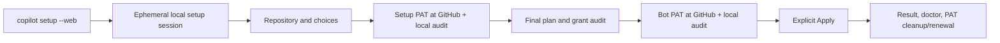
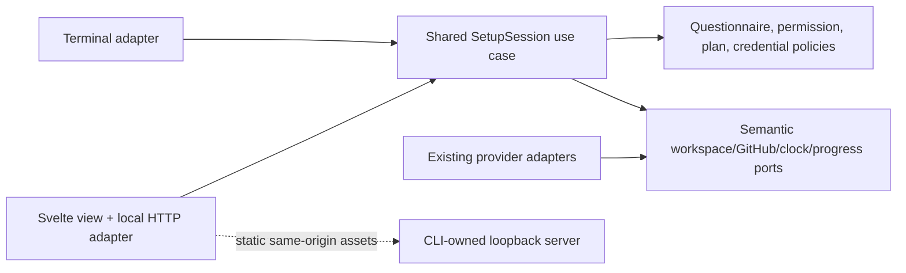

# Local Web Setup Assistant

- Status: Implementation in progress — target contract, not yet release acceptance
- Date: 2026-09-28
- Catalog capability ID: `local-web-setup-assistant`
- Last verified: 2026-09-28 (source/build tests; no live GitHub setup or dogfooding)
- Owners: Copilot maintainers; product, security, and accessibility reviewers
- Scope: optional, local Svelte-based presentation of the existing repository setup journey, sharing its policy, credential, and application engine with the terminal
- Related issues/PRs: [PR #402](https://github.com/vypdev/copilot/pull/402) carries this implementation alongside the earlier guided PAT work; no test issue or Action is created
- Required review gates: product UX, Clean Architecture, browser/loopback security, credential handling, packaging, cross-platform operation, accessibility, testing, documentation
- Open decisions blocking readiness: none at the product-contract level; implementation MUST still pass the security and packaged-install review gates below

## 1. Executive summary

The default `copilot setup` remains the terminal wizard. `copilot setup --web`
starts a short-lived web assistant on this machine and opens the default
browser. It presents repository identity, setup choices, the temporary setup
PAT, the reviewed plan, the bot PAT and other credentials, and final application
as one clearly advancing journey. A failed browser launch prints a local URL
and a terminal fallback. It never creates a hosted account, proxies setup
through an external service, or treats the browser as a GitHub login session.

Svelte + TypeScript + Vite is the presentation/build choice; the packaged
Node CLI serves compiled local assets and owns the setup session. Both UIs
MUST call the **same application decisions and provider ports**. The browser
MUST NOT run GitHub mutations, read repository files directly, or reproduce
the permission/questionnaire policy. Before adding the web adapter, the
orchestration currently embedded in `src/cli/commands/setup.ts` MUST be
extracted into frontend-neutral application contracts. Existing terminal
behavior remains the compatibility baseline.

```text
copilot setup --web
  -> local browser: Repository -> Setup choices -> Setup PAT
  -> reviewed plan -> Bot PAT & credentials -> Apply -> Result/cleanup
  -> GitHub form in a separate tab for each PAT, when guided creation is chosen
```

Text equivalent: one local setup session has two optional presentation
adapters. GitHub still authenticates the operator/bot accounts, performs 2FA,
issues PATs, and lets their owners delete or rotate them. Copilot validates
each supplied token and applies only a newly approved plan.

## 2. Problem, current behavior, and evidence

### 2.1 Problem

The six-stage terminal journey is functional but has many conditional choices,
two account roles, provisional permissions, a plan, and partial outcomes. A
first-time operator can benefit from persistent visual context, progressive
explanations, and a review screen without sacrificing the CLI or creating a
second implementation of setup rules.

### 2.2 Verified baseline before this implementation

1. `src/cli/commands/setup.ts` owns command flags, repository resolution,
   setup-PAT intent, the initial and final permission audits, wizard
   composition, bot-credential collection, and the `runLocalAction` call.
   At the start of this work, the web entrypoint did not exist; the current
   implementation status and remaining release gates are recorded in §18.
2. `SetupJourneyUseCase`, `SetupQuestionnaireController`,
   `SetupWizardUseCase`, `SetupCredentialsUseCase`, the permission policies,
   and existing GitHub/workspace adapters already separate parts of the
   behavior. They are not yet one frontend-neutral setup-session coordinator.
3. The terminal supports guided and manual PAT entry. GitHub's official
   fine-grained PAT form URL pre-fills documented fields but cannot select an
   individual repository or authenticate a browser account. The setup PAT is
   one-run authority; the bot PAT is a distinct runtime Secret `PAT`.
4. At baseline, `package.json` published `build/cli/index.js` and selected
   other bundles but no web asset directory. The new Vite/npm-pack contract
   is described in §8.3 and its current evidence in §18.
5. The existing setup contract includes manual/unattended/dry-run paths,
   final grant re-audit, storage-shadow checks, backups, partial mutation
   reporting, and no claim of remote PAT deletion.

### 2.3 Evidence and limits

- Repository sources: [setup baseline](./setup-configuration-credentials-and-doctor.md),
  [operator PAT](./temporary-setup-operator-authorization.md),
  [bot PAT](./guided-bot-pat-onboarding.md),
  [permission evidence](./setup-pat-permission-guidance-and-verification.md),
  `package.json`, `src/cli/commands/setup.ts`, and setup use cases/tests.
- [GitHub's PAT form](https://docs.github.com/en/authentication/keeping-your-account-and-data-secure/managing-your-personal-access-tokens#pre-filling-fine-grained-personal-access-token-details-using-url-parameters)
  supports documented prefill fields, not issuance, account selection, or
  individual-repository selection; [GitHub's account switcher](https://docs.github.com/en/authentication/keeping-your-account-and-data-secure/switching-between-accounts)
  remains browser-owned.
- [Svelte](https://svelte.dev/docs/svelte/overview) compiles UI components;
  [Vite](https://vite.dev/guide/) supports a `svelte-ts` application and
  produces static assets. SvelteKit/SSR is unnecessary for this local flow.
- [OWASP CSRF guidance](https://cheatsheetseries.owasp.org/cheatsheets/Cross-Site_Request_Forgery_Prevention_Cheat_Sheet.html),
  [CSP guidance](https://cheatsheetseries.owasp.org/cheatsheets/Content_Security_Policy_Cheat_Sheet.html),
  and [browser-storage guidance](https://cheatsheetseries.owasp.org/cheatsheets/HTML5_Security_Cheat_Sheet.html)
  inform the local-server threat model. These are security controls, not a
  claim that loopback or a frontend framework makes secret input risk-free.
- Unknown until implementation: the exact packaged asset manifest, browser
  opening support on each OS, and human usability of the final wireframes.
  These are measured in the acceptance gates, not assumed from dev mode.

### 2.4 Retrospective classification

Not applicable: this is a prospective mode, not an as-built baseline. The
verified CLI behavior above remains the baseline and is not relabeled as
already web-capable.

## 3. Actors, surfaces, and terminology

| Actor | Goal | Entry/surface |
|---|---|---|
| Setup operator | Configure one local checkout and understand what changes | shell launch, local browser wizard, final terminal result |
| Operator PAT owner | Authorize setup only | GitHub form/account switcher/2FA, then local masked web input |
| Bot PAT owner | Issue an Action runtime credential | separate GitHub form/account switcher/2FA, then local masked web input |
| Organization admin | Approve access when required by policy | GitHub's own approval UI; not Copilot's local page |
| Maintainer | Diagnose partial setup and renewal | result, `copilot doctor`, GitHub resources, docs |

**Web session** is one ephemeral CLI-owned run bound to one canonical local
repository. **Plan revision** identifies the exact validated configuration,
repository/workspace facts, remote evidence, grant sets, and file decisions
reviewed by the operator. **Browser controller** is the one tab allowed to
submit actions at a time. **Secret value** is never part of a page view model.
**Installed** means a GitHub Secret write succeeded, not that an Action ran
or that the stored value can be read back. **Discarded locally** does not mean
deleted at GitHub or cryptographically erased from browser/process memory.

## 4. Goals, non-goals, and fixed invariants

### 4.1 Goals

1. `--web` MUST be an optional interactive presentation of the same setup
   engine, with feature, grant, plan, and mutation parity with terminal setup.
2. The web journey MUST explain current/completed/next states, show reasons
   for conditional choices, retain answers while reviewing, and make every
   change to required PAT grants visible before the relevant PAT is used.
3. The web journey MUST guide both PAT roles separately, verify actual
   identity/access/grants under the existing policies, and show truthful
   cleanup/renewal after success, failure, or cancellation.
4. Application MUST require an explicit, current, single-use final approval;
   stale pages, duplicate clicks, and changed repository/remote facts MUST
   NOT apply a plan that was not just reviewed.
5. A packaged global npm install MUST launch the same bundled UI without
   Vite, source files, dev dependencies, network asset fetches, or a writable
   checkout of Copilot.

### 4.2 Non-goals

1. Hosted SaaS, remote access, LAN sharing, Docker-facing binding, mobile
   access to another computer, or simultaneous multi-user setup.
2. Browser automation of GitHub, scraping private requests/cookies,
   capturing 2FA, automatic PAT minting/revocation, or local account profiles.
3. Replacing the bot PAT with a GitHub App, changing Action runtime
   authentication, or changing current CLI defaults/flags outside `--web`.
4. Persistent drafts or crash-resume containing credentials. A future
   resumable setup needs a separate storage/security design.
5. New GitHub issues, PRs, Actions, or dogfooding as part of this spec task.

### 4.3 Non-configurable safety invariants

1. Only `127.0.0.1` on an OS-assigned ephemeral port is bound; no public
   `--host`/`--port`, reverse proxy, external asset, CDN, telemetry endpoint,
   or permissive CORS is added. The exact origin is checked on requests.
2. Browser-originated events are untrusted. No GET or asset request mutates
   repository/GitHub state. API calls are schema-validated, revision-bound,
   method-limited, size-limited, and CSRF-protected.
3. PATs, provider keys, session capabilities, cookies, and 2FA codes never
   enter URLs, browser history/storage, service workers, config, logs, error
   payloads, plans, snapshots, or client-side analytics. No value is returned
   to the browser after submission.
4. The setup PAT and bot PAT never exchange roles. The operator token is not
   Secret `PAT`; the bot token is not authority for setup writes. GitHub owns
   each token's issuance, approval, expiration, and revocation.
5. The existing permission, identity, repository, storage-shadow,
   confirmation, backup, and partial-result gates apply equally to both UIs.
   A visual indicator or typed assertion is never authorization evidence.
6. Applying starts at most once per approved plan revision. No automatic
   destructive rollback of completed local or remote changes is claimed.

## 5. Current versus proposed journey

| Stage | Terminal today | Web proposal | Operator effect |
|---|---|---|---|
| Launch/repository | `copilot setup` resolves git remote | `copilot setup --web` shows canonical checkout, owner/repo, branch and scope; asks confirmation if ambiguous | see target before entering a PAT |
| Setup choices | linear conditional questions; explicit review pass possible | grouped cards and explanations, saved answers, source-locked values, live grant implications | understand what a choice enables |
| Setup PAT | terminal permission summary + GitHub form link or manual input | role-labelled summary, remote unknowns, official link, account/repo checklist, masked local paste and audit | no inferred browser identity |
| Plan | terminal file/resource preview and confirmation | inspectable grouped diff/Secret names/scopes/warnings, single approved revision | know local and remote effects |
| Bot PAT & credentials | guided/manual bot link and secret prompts | separate bot identity/grants/renewal step, masked values, no cross-role reuse | know persistent credential owner |
| Apply/result | CLI executes and reports | explicit Apply, live semantic progress, partial facts, recovery and cleanup | no false reset or success claim |



Text equivalent: the CLI owns one session. The browser only collects
operator decisions; GitHub handles each PAT in its own tab. Copilot checks
the supplied PAT and current plan before performing setup, then reports
exactly what completed and what remains.

## 6. Functional behavior and session state

### 6.1 Launch and normal path

1. Validate `--web` combinations and canonicalize the checkout before
   starting HTTP. Resolve owner/repository from the existing git policy;
   ambiguous/missing remotes block rather than guessing. Acquire a per-checkout
   local setup-session guard shared by terminal and web modes so a second
   setup process cannot apply to the same checkout concurrently. A lock has
   no credentials and is released on normal exit. If the recorded owner is
   dead, the CLI MUST fail closed, print the exact lock path, and require an
   operator to verify no setup process is running before removing that one
   file manually. It MUST NOT unlink a stale lock automatically: another
   process can replace it between a read and an unlink. Publish a fully
   written lock record atomically; failed writes MUST NOT leave a blocking
   empty lock. Web
   mode does not require a TTY: the browser is the interactive surface, and
   a printed local URL is available if automatic opening is unavailable.
   Web setup MUST verify an attached Git branch and canonical HEAD before
   opening the browser or collecting credentials. Detached HEAD or an unreadable
   branch fails immediately with checkout guidance; no fallback branch name
   may be inferred for this guarded session.
2. Bind `127.0.0.1:0`, record the assigned port, create an unpredictable
   one-run session key, a separate 16-hex-character pairing code, and first
   controller lease in process memory. Print the pairing code only in the
   terminal, without adding it to accumulated diagnostics, then open the
   default browser to the public `http://127.0.0.1:<port>/` URL. The initial
   page asks for the code before any setup state is shown. A same-origin POST
   exchanges it for the session key held only in browser memory; five invalid
   attempts lock pairing until a new setup run. If opening fails, print the
   public URL and instructions; serving continues. Neither code nor key may
   appear in URL, history, cookies, browser storage, or accumulated logs.
   If binding or packaged
   assets fail, stop without a partial UI and suggest `copilot setup`.
3. Show the six stages already used by terminal setup. Import one immutable
   snapshot of defaults, config file, and non-secret flags. Mark supplied
   fields with their source; fields fixed by existing flags/config are
   read-only in the web questionnaire. A changed config file after launch is
   not silently reread; tell the user to restart to adopt it. The browser
   sends only bounded answer values; the application owns conditionals.
4. Before the setup PAT, collect permission-affecting local intent and show
   the exact required grants plus **May need after GitHub inspection**. A
   review/back action may reopen a second pass over saved answers; the UI
   labels it as the same run. Opening the guided link is a user gesture to
   GitHub; `target_name` is only resource owner. The page explicitly asks the
   user to check their GitHub account, switch **All repositories** to
   **Only select repositories**, select this repository, and Generate. The
   manual path remains available.
5. Paste the setup PAT into a masked field on the local page. Send it once
   to the CLI process; clear the input after receipt and never echo it in a
   response. The server validates identity, target access, and grants,
   displays the actual GitHub account for confirmation, then completes
   authenticated inspection, remaining questions, plan, and final grant
   audit. Unknown organization approval is not labeled `pending` without
   evidence. A new required grant invalidates the prior link and blocks
   dependent mutation until corrected/replaced authority passes re-audit.
6. Show the final plan with file actions, backups, GitHub resource names and
   scopes, workflow updates, warnings, and credential **status only**. The
   operator reviews a plan revision. Then present the *distinct* bot PAT
   grants and resolved expected bot user ID. GitHub's form opens under the
   bot account; the submitted bot PAT must pass the current guided numeric-ID
   and grant checks before Secret `PAT` may be written. Manual and existing
   PAT handling retain the baseline's exact claims, not invented identity
   assurances. An existing GitHub Secret value cannot be read back: when the
   existing policy requires re-audit, ask for a new/re-entered bot PAT and
   show preserve-versus-replace consequences before Apply. Other credentials
   use masked local inputs. Unlike the terminal composition, the web
   composition MUST NOT dispatch or bootstrap the credential-health workflow
   during this pre-Apply step. Existing Secret values remain unreadable; the
   bot PAT is re-entered for grant/identity audit. Existing optional provider
   credentials may be explicitly kept with `unverifiable` status, never
   described as healthy. Post-Apply health is checked with `copilot doctor`.
7. Before Apply, recompute a compact impact summary and verify that the
   approved plan revision, repository identity, relevant workspace file
   digests, remote facts, permission audits, and bot credential are current.
   Revisions or stale evidence return to review and require new approval;
   missing grants return to the appropriate PAT step. The final Apply button
   starts one execution through the existing setup mutation use case.
8. Show event-driven progress, actual completed facts, and a final state.
   On success, distinguish local disposal from user-owned GitHub deletion of
   the temporary setup PAT, and installed bot Secret from later Action health.
   Offer `copilot doctor`/relevant GitHub Settings as inspectable next steps.
   Never silently delete the bot PAT, which the Action still needs.

### 6.2 Alternative and boundary paths

- `copilot setup` without `--web` is unchanged. `--dry-run --web` MAY display
  a local-only plan with explicit **No changes** outcome, no required PAT
  creation, and no Apply action; any remote facts unavailable without a PAT
  are labeled unknown. It does not become a credential-health proof.
- A detected `PERSONAL_ACCESS_TOKEN` is **not silently consumed** in web
  mode. Offer `Use existing environment setup PAT` with no displayed value,
  or choose guided/manual web input; the chosen credential follows the same
  audit. A supplied value must never be sent to the browser. Exiting Copilot
  does not unset the parent shell's environment variable; cleanup copy must
  distinguish this source from a one-run pasted PAT and tell the operator
  how to remove/revoke it when appropriate.
- Existing non-secret setup flags and `--config` are honored with their
  current precedence. `--non-interactive`, `--yes`, `--token`,
  `--workflow-pat`, `--secret`, and
  `--confirm-unverifiable-write-permissions` combined with `--web` fail early
  with a concrete CLI fallback; this prevents a hidden approval or command
  history secret path from masquerading as visual review. Unverifiable writes
  use the existing explicit, narrowly allowed acknowledgement in the UI;
  unverifiable required reads remain blocked.
- The bot may be the same account as the setup operator only under existing
  policy. Warn about self-event/guarded-approval consequences. The browser's
  active GitHub account is never inferred from Git, `gh`, or the setup PAT.
- An unsupported fine-grained grant or GitHub owner policy disables the
  guided link for that role and provides the existing full permission table
  and manual compatibility path; never auto-select a broader classic PAT.
- Leaving the page or closing its tab does not prove cancellation or
  revocation. A second tab starts read-only and may explicitly take over;
  takeover rotates the controller lease, invalidates pending responses from
  the old tab, and shows the current server-owned phase. No PAT value is
  rehydrated into either tab. Browser Back revisits a *view*; it cannot undo
  a committed state or bypass current validation.
- A user may cancel before Apply. The server stops and reports that local
  setup mutation did not start; any PAT they already generated on GitHub may
  still exist and needs owner cleanup. During Apply, cancellation is
  cooperative only at supported safe boundaries; the result is partial or
  indeterminate until inspected, never simply `No changes`.

### 6.3 State machine and event contract

| State | Meaning / evidence | Allowed next action | Block/expiry behavior |
|---|---|---|---|
| `repository` | canonical checkout/remote shown; no mutation | confirm target | invalid remote blocks startup |
| `choices` | one server-owned intent draft and source locks | answer, review, cancel | invalid/stale answer rejected |
| `setup-pat` | grant preview, unknowns, account checklist | guided/manual/environment, paste, audit | wrong account, missing grant, org approval block |
| `plan` | final normalized plan revision and audit | inspect, revise, approve, dry-run end | drift invalidates revision |
| `credentials` | bot ID/grants and other credentials | paste, audit, revise, cancel | wrong bot/Secret scope blocks |
| `ready-to-apply` | current approved plan and credential facts | one explicit Apply | stale revision returns to review |
| `applying` | mutation has begun; completed facts accumulate | wait; bounded safe cancel | duplicate Apply returns same operation |
| `complete` | every required operation reported success | inspect, stop | bot Secret may remain active |
| `partial` | at least one operation may have committed | inspect, run doctor, deliberate retry | no automatic replay/rollback |
| `blocked` | gate failed before mutation | fix named cause, retry/review, stop | retain non-secret draft only |
| `cancelled` | operator ended pre-Apply | close | cleanup GitHub-created PATs manually |
| `expired` | idle/hard session limit, no Apply running | restart CLI | no credential/draft recovery |

Every event includes the current session revision, the plan revision when
one exists, and one bounded idempotency key for Apply. The server serializes
decisions for a session;
duplicate answers are harmless, an out-of-order answer returns current state,
and only the active controller can submit. One plan may have at most one
in-flight Apply operation. After a process crash, no session is resumed and
no prior Apply result is assumed; the next run uses existing read-before-write
and doctor policies to reconcile facts, and requires fresh token entry and
approval before any new mutation.

## 7. User-facing configuration

| Input | Type / default | Allowed scope and validation | Precedence / persistence |
|---|---|---|---|
| `--web` | boolean / off | interactive local setup only | command invocation; no stored preference |
| `--dry-run --web` | boolean / off | no Apply, credentials optional only where existing plan needs evidence | one run; no mutation |
| Existing non-secret flags and `--config` | existing typed values | same validators, skip/fixed semantics as CLI | flags > config > defaults; snapshot at launch |
| Web answers | existing setup question types | existing bounded enums, names, counts, cross-field rules | editable defaults only; one-run memory |
| Environment setup PAT | optional hidden choice / unused | only after explicit operator selection and audit | process memory; never a web response |
| Bot login | explicit GitHub user / none | existing numeric-ID resolution and guided check | one run; non-secret only |
| Local server | fixed `127.0.0.1:0` | no host/port override | OS-assigned port; never persisted |
| Session lifetime | 30-minute human-idle, 4-hour hard cap | Apply in progress is not interrupted by idle timeout; show countdown/warning and fail closed on hard cap before Apply | monotonic process clock; not configurable |

Example recommended: `copilot setup --web` in the intended checkout, with
guided setup and bot PAT links. Alternative: `copilot setup` keeps the terminal
wizard; `copilot setup --non-interactive --config setup.yml` remains an
automation path and never starts a browser. `--web --yes` is invalid rather
than silently treating a web Apply button as already clicked. No browser
theme, host, timeout, or credential persistence config is introduced. Unknown
flags/fields fail existing parsing. There is no stored web session or schema
to migrate; a future version cannot reread an old session.

## 8. Clean Architecture design

### 8.1 Boundaries and dependency direction

| Boundary | Owns | Must not own/import |
|---|---|---|
| Domain and pure policies | setup choices, grant plans, PAT roles, identity comparison, config/storage rules, plan revision and drift decisions | Svelte, HTTP, terminal, Octokit, process state |
| Application | frontend-neutral `SetupSession` coordination, stage transitions, immutable semantic commands/views, credential/permission/plan/apply use cases | web routes, DOM, Node HTTP, provider DTOs |
| Semantic ports | repository/workspace facts, GitHub reads/writes, secret input handoff, clock, operation progress, presentation | HTTP request/response or browser objects |
| Adapters/data | existing GitHub/workspace adapters; terminal and web request/view adapters | duplicate question lists, grant matrices, authorization decisions |
| Infrastructure/composition | short-lived Node HTTP server, session lifecycle, asset serving, browser opener, provider wiring | product decisions or alternate setup implementation |
| Browser presentation | Svelte components, accessible copy, conditional view rendering | direct GitHub API calls, filesystem, persisted PATs, authoritative plan state |



Text equivalent: both presentations submit semantic decisions to one
application coordinator, which uses existing policies and provider adapters.
The loopback server adapts HTTP and serves compiled assets; it is not a
second business-logic engine. `src/cli/commands/setup.ts` becomes a thin
entrypoint/composition root. No `application` or `domain` module imports
Svelte, browser, HTTP, terminal rendering, or `runLocalAction` directly.

The final web Apply authorization is one application use case with injected
repository-facts, selected-file snapshot, remote-facts, permission-audit,
approval, and live-session ports. It must fail closed on missing/drifted facts
or a session that was cancelled/expired while asynchronous reads were running.
It checks repository identity and selected-file digests before remote reads
and again after the final asynchronous permission audit, immediately before
returning approval; drift during those awaits cannot inherit earlier proof.
The CLI supplies Git/HTTP/provider adapters, but must not reimplement this
decision as an inline sequence. The subsequent mutation boundary remains
single-flight and cannot be entered if the approval use case did not return an
approved result. Deterministic fake-port tests cover every drift category,
cancel/expiry interleavings, and audit outcomes.

The pre-PAT permission-intent review is likewise an application use case:
it owns questionnaire transitions, owner-kind conflict checks, provisional
grant calculation, review passes, and guided-link eligibility. Terminal and
web adapters supply prompts, status presentation, and the journey view; the
command only wires them and handles the resulting guided/manual outcome. This
keeps the grant decision out of a presentation-specific entrypoint and lets
pure fake-port tests cover repeated review, conflicts, fallback, and invalid
local configuration without creating a GitHub PAT.

The initial setup-PAT identity/access gate is an application use case shared by
both presentations; it requires explicit acknowledgement for unverifiable
write grants and confirmation of the authenticated operator account before
planning. The configured setup-PAT audit is another application use case. It compares
provisional and final required grants, verifies the authenticated identity and
effective access through the read-only permission port, and returns a blocked
result when owner-kind or grants differ. A pure policy builds corrected official
GitHub form links; presenters own their display and explanatory text. The
command does not decide whether an unverifiable write grant is acceptable.

The browser is decomposed at its own boundary. `web/src/App.svelte` is only
the page shell and view composition. A single `web/src/session/` client owns
bootstrap, polling, revision-bound answer/cancel/takeover/close commands, and
redacted session state; it never retains a submitted PAT in a store or browser
storage. `web/src/components/` contains cohesive presenters for progress,
header/theme, status, prompt kinds, context, and outcome. Components receive
the redacted view and callbacks; they never call `fetch`, import provider or
policy modules, or infer authority from local UI state. Prompt inputs keep
only transient local values, clear secrets before submission, and the prompt
presenter is keyed by the server prompt revision inside `PromptCard`. A new
question remounts with its own defaults; ordinary polling or session-message
revisions do not erase an answer in progress. Small pure helpers may normalize defaults
and allowlisted links. Adding a prompt kind belongs in its presenter rather
than growing the page shell; avoid one-file-per-element indirection with no
reuse. Architecture tests guard dependency direction and bound shell and
presenter sizes, with reviewed exceptions only when cohesion justifies them.

An empty issue-workflow multi-selection MUST submit an explicit `none` answer,
not an empty answer that reuses defaults or silently selects every workflow.
When the questionnaire's multi-select default is `All`, the browser MUST
visibly preselect `All` and submit `All` if the operator continues unchanged;
explicitly deselecting it MUST still submit `none`. `All` remains mutually
exclusive with individual workflow choices. This is a pure presentation
initialization/serialization rule, not a second questionnaire parser.
Both terminal and web routes use the same questionnaire parser for this choice.

### 8.2 Contracts, ownership, and trust

- The session command API is semantic (`answer(questionId, value, revision)`,
  `review(role)`, `submitCredential(role, value)`, `approvePlan(revision)`,
  `apply(revision, idempotencyKey)`, `cancel()`), not a general RPC, shell,
  arbitrary path, or raw GitHub endpoint. Exact DTO/schema/size limits are
  checked by the HTTP adapter before the application sees them. Provider
  URLs and error strings are never trusted as web links or HTML.
- One application-owned session contains repository identity, copied draft,
  answered IDs, stage, plan revision, non-secret verification facts, and
  short-lived credentials only while needed. Secret-bearing structures never
  implement serialization or enter presenter views. The browser receives
  only a dedicated redacted view model. Server/process memory disposal is
  best-effort, not a remote revocation or guaranteed zeroization.
- Existing questionnaire/default/permission policies are the only source of
  question visibility, defaults, validation, and grants. A web control may
  describe a rule but cannot loosen it. Once choices or remote facts change,
  downstream plan, URL, account confirmation, and approval proofs are
  invalidated according to their dependencies; the UI explains why it
  returned to an earlier stage.
- The repository path is fixed after launch. Recheck canonical path, git
  owner/repo, selected branch/ref, and relevant file digests both before and
  after asynchronous remote/PAT checks; recheck remote facts during those
  checks, immediately before Apply. Unexpected drift yields a new plan revision and
  requires fresh human review; never apply from a stale browser response.
  Repository-relative plan labels such as `workflows/name.yml` and
  `ISSUE_TEMPLATE/name.yml` MUST be translated to their actual checkout
  destinations under `.github/` for this comparison. Include managed assets
  that a changed selection may retire, not only files displayed as selected.
- The shared execution boundary owns idempotency and partial facts. The
  browser uses bounded polling or server events for **read-only** progress;
  reconnecting to the same live process retrieves redacted current state,
  not secret values or an implicit retry.

### 8.3 Executable architecture and packaging constraints

1. A dependency test MUST reject `src/domain`/`src/application` imports,
   re-exports, and literal lazy/CommonJS dependencies on
   Svelte, Vite, DOM, `node:http`, terminal presenters, Octokit concrete
   adapters, and CLI modules; Svelte modules MUST import only public
   view/contracts and never provider or mutation modules.
2. Contract tests MUST run the same scenario fixtures through terminal and
   web adapters and compare normalized choices, grant sets, plan revisions,
   identity gates, and result facts. Question/permission tables cannot be
   copied into web source; a structural check enforces one policy owner.
3. Build order MUST produce a Vite static directory plus the `ncc` CLI
   bundle. `package.json` allowlist and asset manifest MUST include only
   required hashed HTML/JS/CSS/fonts. Paths resolve relative to the installed
   package, not `process.cwd()`. Assets are read-only, served with exact MIME
   types, and cannot escape their directory through encoded paths or symlinks.
4. `pnpm run validate:build`, `validate:npm-package`, and an isolated
   `npm pack`/global-install smoke fixture MUST prove asset presence,
   checksums/manifest parity, executable launcher, and no runtime use of
   Vite or source/dev files. The Action/API bundles MUST NOT ship Svelte or
   acquire a new runtime web-server dependency through shared imports.
5. No issue, PR, check, comment, or label is generated by launching the UI.
   Existing setup-induced GitHub resources remain governed by the approved
   plan and its existing workflow/permission validators.

## 9. Web UI/UX and content contract

### 9.1 Information hierarchy and navigation

The first viewport of every phase answers: **what is happening**, **what is
complete**, **what is next**, **what the user must do**, and **whether any
change has started**. Render a six-stage text-labelled progress rail, not a
percentage or question count. Use a stable repository badge and PAT role
heading. Show one primary action per screen, with a secondary Review/Back
action only where safe. A stage reopened after revision says why, preserves
answers, and shows `review pass 2` or equivalent, never `Start again` unless
a new CLI process really starts. Permission summary is short by default;
the exact table, reasons, and remote unknowns are one expansion away.

```text
Copilot setup · Local assistant                 vypdev/copilot · develop
Repository ✓  Choices ✓  Setup PAT →  Plan ·  Bot PAT ·  Apply ·

Setup PAT — action required
Known grants: Metadata read · Contents read · Secrets write
May need after GitHub inspection: Actions write (existing managed Secret)
No repository changes have started.

1. Open GitHub's prepared PAT form as your setup account.
2. Change All repositories to Only select repositories → vypdev/copilot.
3. Generate there, then paste the PAT below. Copilot has not created it.
[Open GitHub form]  [View all permissions]  [Use existing PAT]
```

Text equivalent: the operator is at the third phase, sees known and unknown
grants, must complete GitHub's form under the correct account and select the
specific repository, and knows no setup mutation has begun. The link is an
explicit user action to the fixed official GitHub host; it never contains a
credential. The `Bot PAT` screen repeats the checklist under a visibly
different account/role and states that its token remains needed by Actions.

| Primary state | Representative visible copy | Primary action |
|---|---|---|
| Pending | `Inspecting existing resources for vypdev/copilot. No setup changes have started.` | Wait; `View details` is secondary |
| Action required | `Open GitHub as the bot account @vypbot, select only vypdev/copilot, then paste its PAT here.` | Open official form |
| Blocked before mutation | `Nothing was changed. The setup PAT lacks repository Variables write. Create a corrected PAT, then return to this step; your answers remain.` | Correct setup PAT |
| Partial after mutation | `8 files were installed and Secret PAT was updated; one workflow update failed. Do not delete the bot PAT. Inspect these results before retrying.` | Inspect result/doctor |
| Complete | `Setup finished. The bot PAT is installed as Secret PAT; its future Action health is not yet proven. Delete the temporary setup PAT in GitHub when no longer needed.` | View result/cleanup |
| Cancelled/expired | `No setup mutation started in this session. Any PAT already generated in GitHub may still exist.` | Open GitHub PAT Settings / restart |

Errors follow `impact -> cause -> action -> retained state`; partial states
list each committed local file/resource and unresolved step without a raw
provider payload. Plan review shows `create/update/preserve/skip`, target
scope, backups, and warnings, not credentials or their values. Before Apply,
show the exact repository, affected file/resource counts, verified account
labels, unresolved warnings, and an unchecked explicit confirmation. The
button says `Apply to vypdev/copilot`; it is disabled until the current plan
revision is accepted. After click, disable retries until the same operation
returns; never imply progress based on elapsed time alone.

### 9.2 Browser, responsive, accessibility, and localization

The visual system is a reusable set of tokens and patterns, not page-specific
colors copied into each screen. `web/src/styles/` separates palette tokens,
foundations, layout, form controls, feedback, and responsive rules, imported
once by `style.css`. Shared visual primitives cover banners, buttons and
card/field patterns where presenters actually reuse them; presenters compose
these for question, choice, credential, plan, context, and result states.
State styling uses semantic tokens (`success`, `warning`, `error`, focus) in
light, dark, and system modes. Components retain native labels, keyboard/focus
behavior and explicit status text; decoration never carries meaning alone.
Visual changes require representative state and interaction tests plus both-
palette contrast checks, not screenshot-only assertions. The contributor
architecture guide documents these boundaries for future steps.

- The visual system MUST ship complete **light and dark** palettes for page,
  surfaces, borders, text, muted text, focus, links, warnings, errors, and
  success states. Follow `prefers-color-scheme` by default and offer an
  accessible `System / Light / Dark` control. A manual choice lasts for this
  browser tab only; it stores no credential or session state and a reload
  returns to the system preference. Native controls receive the matching
  `color-scheme`. There is no light-only loading flash in a dark system theme.
  Status meaning never depends on hue alone. Test text contrast at >= 4.5:1
  (>= 3:1 for large text) and essential UI/focus indicators at >= 3:1 in
  both palettes; review hover, disabled, validation, code, and external-link
  states as well as the happy-path cards. These thresholds follow
  [WCAG contrast guidance](https://www.w3.org/WAI/WCAG22/Understanding/contrast-minimum.html)
  and the system-default behavior follows
  [`prefers-color-scheme`](https://developer.mozilla.org/en-US/docs/Web/CSS/Reference/At-rules/%40media/prefers-color-scheme).
- The page SHOULD use a coherent editorial dashboard layout: restrained
  typography using locally packaged/system fonts, generous spacing, a
  high-contrast progress rail, a focused question card, and a persistent
  context/impact panel on wide screens. At narrow widths the context moves
  below the main action without hiding grant deltas or recovery text. Motion
  is purposeful, brief, and removed under `prefers-reduced-motion`.
- The page MUST work at narrow width and 200% zoom, keyboard-only, reduced
  motion, and light/dark modes. Semantic headings, labels, descriptions,
  field errors, focus restoration, and a polite live region carry status;
  color/icons are supplemental. The PAT field is masked, has a visible
  show/hide control only if security review approves, and never displays a
  pasted value in a toast, debug view, or browser history.
- GitHub links have descriptive text, `rel="noopener noreferrer"`, and a
  visible external-destination warning. `Referrer-Policy: no-referrer` protects
  the local origin when a GitHub link opens. A copyable link may be shown
  when browser pop-ups are blocked; it contains no session or PAT value.
- English is the initial setup locale, matching the terminal; Spanish is
  added only with a reviewed complete catalog, not ad hoc strings. Unknown
  locale falls back atomically to English. Account/repo names and remote
  messages are escaped as text, never injected as HTML or Markdown.
- No issue/PR/check/comment is added by the web surface, so notification
  budget is zero. Progress updates in the page are coalesced and do not
  repeatedly steal focus or announce the same state. GitHub-side account
  switching and 2FA are explained, not reproduced in the local UI.

## 10. Failure, recovery, and cleanup

| Condition | Impact and retained facts | Automatic retry | Operator action / cleanup |
|---|---|---|---|
| Browser launch denied or unavailable | local server is ready; no mutation | none | open printed loopback URL or use terminal setup |
| Bind/assets/packaged path failure | web mode never starts | none | run terminal setup; report installation problem |
| Unsupported browser/JS disabled | no secret submitted; no mutation | none | terminal setup; no partial web fallback |
| Second setup process/tab | only one checkout operation/controller; previous state intact | none | stop first process or explicitly take over tab |
| Orphaned local setup lock | no automatic unlink, no setup mutation | none | verify no setup process is running; remove only the printed lock path and retry |
| Tab closes, laptop sleeps, session idles | live session may remain until 30-minute idle cap; no implied cancellation | no mutation replay | reopen while live; otherwise restart and clean up GitHub PATs |
| Git remote/ref/file/config changes mid-session | reviewed plan is stale; no Apply | re-read once on request | review new plan or restart to adopt changed config |
| Wrong GitHub account or wrong repository | PAT audit fails; no dependent mutation | no automatic PAT creation | switch account/select repository and generate/correct PAT; delete unused one |
| Org approval pending, unknown, or GitHub rate limit/outage | no dependent mutation; only evidenced pending is named pending | bounded read-only retry with backoff | inspect GitHub/admin status; retry when accessible |
| Grant added/removed after remote inspection | old link/plan no longer exact; no dependent mutation | recompute preview only | correct PAT; disclose excess grant without claiming least privilege |
| Bot ID mismatch or Secret storage shadow | no Secret write; plan/credentials retained without value echo | none | correct account or scope; delete unused PAT if needed |
| Secret write accepted then later operation fails | partial; Secret name/scope may be active, value unreadable | no automatic Apply retry | inspect report/doctor before overwriting or revoking bot PAT |
| Request times out while Apply continues | result unknown to browser; server operation may still run | reconnect to same process, read-only state | inspect progress/result before any retry |
| CLI crash/power loss mid-Apply | durable result unknown; no session recovery | no replay | run doctor/read-before-write reconciliation, enter fresh PATs, approve new plan |
| Local cancel before Apply | no setup mutation; GitHub-created PATs may exist | none | delete unused PATs in GitHub; close page |

If the local server shuts down, it closes listeners and invalidates session
capabilities. It attempts best-effort cancellation of pre-mutation work and
does not promise to interrupt in-flight GitHub writes. No remote PAT is
deleted by closing the page. The cleanup screen links to GitHub PAT Settings
for the temporary setup PAT and to bot-PAT rotation guidance separately.

## 11. Security, permissions, and privacy

1. **Boundary:** the web server is loopback-only, but TCP loopback does not
   identify or isolate the launching OS user: another local user can connect
   to the port. The browser must enter a cryptographically random code shown
   only in the launching terminal; the server exchanges it for a one-run
   session key. That key is required for every API read and mutation, including
   bootstrap and takeover. Possession of the pairing code grants local session
   access, so it must not be shared. A malicious process that can read the
   terminal, browser extensions with page access, or a compromised browser
   remain outside this boundary. The product must say so honestly.
2. **Request defense:** reject `Host` not exactly `127.0.0.1:<bound-port>`,
   proxy/forwarded host headers, unexpected `Origin`/`Referer` on mutations,
   cross-site Fetch Metadata, unsupported methods/content types, and requests
   over size/time limits. No wildcard CORS or credentials cross-origin.
   The pairing endpoint accepts only same-origin JSON POST, bounds wrong-code
   attempts, and returns the session key only for the correct code. The code
   and key are not sent in an HTTP URL or stored in a cookie/localStorage/
   sessionStorage; the browser sends the key in a custom header to every
   subsequent API route. In addition,
   state-changing requests require a separate one-run, cryptographically
   random controller capability in a custom header plus a revision check;
   that capability is delivered only by an authenticated same-origin no-store
   bootstrap response, never a URL or browser storage. Reject missing/invalid
   keys or capabilities and rotate the controller capability on tab takeover.
   These controls defend cross-site requests and host confusion, but do not
   prove the identity of a local OS user.
   The local server sets no cookies and ignores, never logs, any Cookie header
   another application on the same hostname may have caused the browser to
   send.
3. **Browser isolation:** serve packaged scripts/styles only, with a restrictive
   CSP (`default-src 'none'`, bundled `script-src/style-src`, `connect-src
   'self'`, `frame-ancestors 'none'`, `form-action 'self'` as applicable),
   `X-Content-Type-Options: nosniff`, `Referrer-Policy: no-referrer`, and
   `Cache-Control: no-store` for HTML/API/secret responses. No inline/eval
   scripts, third-party font/image/script, iframe, service worker, WebSocket
   from another origin, or dev-server middleware in the published package.
   Escape untrusted content; do not use raw HTML rendering for provider data.
4. **Secrets:** credential submission uses POST over loopback to an exact
   role-specific endpoint; both DOM input and any client variable are cleared
   after acknowledgement, but browser/process memory cannot be proved erased.
   The server never returns a submitted credential, logs raw request bodies,
   records it in traces or crash diagnostics, or writes it to a temp file.
   It retains the setup token only as long as necessary and the bot token
   until its approved Secret write; after failure, give cleanup guidance.
   `autocomplete="off"` and related hints are defense in depth, not a
   guarantee that browsers/extensions cannot capture a pasted secret.
5. **Provider boundary:** the local UI sends PATs only to this CLI's existing
   verified GitHub adapters; the browser never directly calls GitHub APIs
   with them. Official GitHub form links use the existing allowlisted builder.
   Numeric bot-ID and setup-account checks are preserved; unknown access
   does not become success. The final Apply approval cannot be bypassed by
   `--yes` or a forged/stale browser event.
6. **Abuse/failure:** cap simultaneous TCP clients at 16 and bound read/write time, body and
   field sizes, retries, and progress buffer. Avoid exposing arbitrary local
   files, project paths, source maps, stack traces, or provider responses.
   Expired/invalid capability is a 403-like local error with no secret data;
   stale revision is a 409-like refresh instruction. Audit the actual mutation
   result without a credential-bearing event log.

## 12. Observability and operational UX

The page and terminal share a correlation ID that is random and non-secret.
Report stage, repository, normalized result status, account **login/ID where
already verified**, grant-verification outcomes, plan revision, and completed
resource names/scopes; never PAT text, cookies, browser headers, raw payloads,
or the session capability. Debug mode does not relax redaction. Local access
logs are disabled by default. A page refresh reads the process-owned state
once; status polling is bounded and stops after a terminal state. There is no
cloud telemetry, GitHub comment, or notification from merely using web mode.

## 13. Compatibility, migration, rollout, and rollback

Terminal and non-interactive paths remain unchanged. Web mode has no durable
schema or migration; a running terminal setup is never converted into a web
session, and a web session cannot switch presentation mid-run after entering
credentials. New npm packages include static UI assets, but Action/API bundles
and workflow assets retain parity. Roll out behind explicit `--web` only,
first with packaged read-only journey/plan fixtures, then credential handling
and Apply after security review. No hosted service or feature flag is needed.
Rollback removes/hides `--web` and its static assets; it cannot undo PATs
users created in GitHub or resources already applied. A downgraded package
still offers the terminal setup and doctor paths.

## 14. Testing strategy and numeric budget

The floor is **102 distinct cases**, derived from shared-engine parity,
six-stage transitions, two PAT roles, local HTTP abuse, packaged installs,
drift, and partial mutation. Each test/parameterized behavior counts once;
existing CLI tests are retained, not re-counted as new web evidence.

| Area | Minimum cases | Risk covered |
|---|---:|---|
| Pure choices/config/grant/plan projection | 14 | source locks, defaults, conditional questions, two PAT roles, grants, revision invalidation |
| Session/use cases/idempotency/races | 20 | stages, saved-review pass, tab takeover, stale events, single-flight Apply, cancel, idle/crash replay boundaries, replacement-lock race |
| GitHub/workspace/HTTP adapters | 10 | identity, missing/unknown grants, org approval, Secret scope, bounded errors and provider mapping |
| CLI/packaging/workflow contracts | 10 | flag combinations, browser-open fallback, asset manifest, npm pack/global install, unchanged Action/API bundles |
| UI/accessibility/localization/content | 18 | pending/action/blocked/partial/complete, plan diff, narrow/zoom/keyboard/focus/no-color, both palettes/system toggle and contrast, English fallback, escaping |
| Integration/compatibility/recovery | 12 | terminal-web parity, manual/environment/dry-run, drift, partial write, doctor reconciliation |
| Security/abuse | 18 | Host/Origin/CSRF, terminal pairing and attempt cap, session-key enforcement on every other API route, CORS, replay, path traversal, XSS/CSP, secret leaks, no GET mutation, body/time/connection limits, atomic lock publication |
| **Total** | **102** | No double counting |

Within the 18 UI cases, cover at least one render/interaction for each prompt
presenter, one revision-change form reset, secret clearing before dispatch,
read-only disabling, all outcome variants, and both theme palettes. Static
architecture tests additionally reject network/storage/provider calls from
presenters and shell growth; these do not replace behavioral UI evidence.

Repository-wide Jest/coverage, lint, typecheck, build, documentation,
workflow, catalog, and npm-package gates remain. New pure policies target
100% branch coverage; changed application/server/credential modules target
at least 95% statements/lines and 90% branches/functions, with no regression
to higher existing budgets. Architecture tests parse imports, re-exports,
literal lazy/CommonJS dependencies, and contract
schemas, not prose. Use deterministic fake clock/IDs, temp repositories,
fake GitHub ports, fake browsers/HTTP clients, and adversarial origins;
never use real PATs, issue/Action test resources, external services, or
blocking sleeps in CI. Golden UI fixtures must have semantic assertions.
Human evidence covers macOS/Linux/Windows launch or documented fallback,
packaged global install, two GitHub browser accounts, 2FA occurring only at
GitHub, wrong-account handling, narrow/200%-zoom keyboard and screen-reader
pass, system/light/dark visual review including contrast/focus/error states,
browser close/reopen, and truthful partial result. Controlled evidence
uses test accounts outside this repository; no dogfooding is required.

## 15. Documentation and discoverability

| Audience | Artifact | Required content | Check |
|---|---|---|---|
| New user | `README.md`, `docs/how-to-use.mdx` | default CLI and optional `--web` normal path, stages, screenshots with text alternative | route/link + UX fixture |
| Setup owner | `docs/authentication.mdx`, `docs/configuration.mdx`, `docs/configuration-checklist.mdx` | two PAT roles, account/repo selection, grants, flag conflicts, env-token opt-in, expiry/renewal | permission/CLI contract |
| Operator | `docs/security-operations/operations/troubleshooting.mdx`, `docs/security-operations/operations/provisioning.mdx` | browser/bind/session errors, partial Secret write, recovery/doctor, GitHub cleanup | recovery fixture |
| Contributor | `docs/development/architecture.mdx`, `docs/dependency-rules.md`, this SDD | shared coordinator, trust boundaries, asset pipeline, transport schemas and threat model | architecture + package checks |

Docs are published with implementation, not ahead of it. Register routes and
verify links/assets. Examples must match executable fixtures. The terminal
help for `--web` explains local-only scope and the `--non-interactive` conflict.

## 16. Acceptance scenarios

1. Given an installed npm package and an eligible checkout on an attached
   branch, `copilot setup
   --web` opens a bundled local page showing the exact repository and six
   stages; no source checkout or Vite server is needed. A detached HEAD is
   rejected before a browser opens or any PAT is requested.
2. Given a failed browser opener, the CLI prints the loopback URL and keeps
   serving; given a failed bind or missing assets, it stops without a false
   partial setup claim and offers terminal fallback.
3. Given the same bounded configuration through CLI and web, normalized
   questions, grant sets, plan and result facts match; fixed config/flags
   remain visibly locked and are not silently overridden.
4. Given `--web` with non-interactive/`--yes`/secret-bearing flags, launch
   fails before HTTP/credential use. Given an environment PAT, web mode asks
   explicitly whether to use it without returning its value to the browser.
5. Given a deliberate second review of choices, the page preserves answers,
   labels the review pass, recalculates grants, and returns to Setup PAT
   without implying that setup restarted.
6. Given guided setup PAT creation, the page shows the exact local grants and
   remote unknowns, opens the official GitHub form only on user action, and
   instructs account and single-repository selection. Wrong account or new
   required grant blocks setup before mutation.
7. Given finalized runtime requirements, the distinct bot step checks the
   PAT's actual numeric account ID and grants before Secret `PAT` write;
   manual/legacy paths claim only their existing checks.
8. Given a current approved plan and verified credentials, one click applies
   it once. Duplicate click returns the same operation; stale revision,
   changed checkout file, changed remote identity, or new permission need
   returns to review with no new mutation.
9. Given an invalid/stale tab event or second tab, no action occurs until the
    new tab explicitly takes control; the first tab then cannot submit.
    Given a concurrent terminal or web setup in the same checkout, the
    per-checkout guard blocks its Apply before any mutation.
10. Given cancel/idle expiry before Apply, the process closes without setup
    mutation and warns that any PAT already generated at GitHub remains the
    user's responsibility. A crash during Apply never auto-replays it.
11. Given a Secret write succeeds and a later setup operation fails, the
    result lists the Secret's name/scope as possibly active, never prints its
    value, and requires inspection before retry or bot PAT deletion.
12. Given hostile Host/Origin/cross-site requests, missing/incorrect pairing
    codes or a missing session key on bootstrap, state, or mutations, a missing/replayed controller
    capability, excess simultaneous clients, path traversal, oversized body,
    or injected account/provider text, the server rejects/escapes it without
    mutation or secret disclosure. A failed lock write leaves no published
    lock; an orphaned lock is never removed automatically.
13. Given a browser refresh, the user re-enters the terminal pairing code and
    the same live process restores redacted state only; PAT values, controller
    capability, and plan approval are never stored in browser storage or URLs.
    Neither the code nor the session key appears in browser history. The final page never calls local disposal
    GitHub revocation or Secret installation verified Action health.
14. Given narrow width, 200% zoom, keyboard-only and reduced-motion settings,
    every primary state and recovery action remains understandable without
    color, sound, hover, or developer tools; English fallback is complete.
    System/light/dark selection renders every state legibly, with contrast
    checks for text and essential controls in both palettes.
15. Given no `--web`, existing terminal, unattended, and dry-run contracts
    remain unchanged. Build/package/architecture checks detect missing UI
    assets, policy duplication, and Svelte leaking into Action/API bundles.
16. Given a desktop browser but no terminal TTY, web mode still permits
    explicit browser decisions. Given an existing unreadable Secret `PAT`,
    the UI does not claim to recover its value and follows the current
    re-entry/preservation policy. Given an environment-supplied setup PAT,
    exit never claims to have removed it from the parent shell.

## 17. Requirements traceability

| Requirement | Owner/boundary | Verification | Documentation |
|---|---|---|---|
| Optional packaged local UI (§4.1, §6.1, §8.3) | CLI composition + asset adapter | scenarios 1–2, 15; npm pack fixture | how-to-use, architecture |
| Shared setup engine/parity (§4.1, §8) | application coordinator + existing policies | scenarios 3, 5, 15; import/schema checks | architecture |
| Bounded config/compatibility (§6.2–7) | CLI parser + config policy | scenarios 3–4, 15–16 | configuration |
| Separate PAT roles/evidence (§4.3, §6) | permission/identity/credential use cases | scenarios 6–7, 11, 13, 16 | authentication, credentials |
| Revision-bound Apply/recovery (§6.3, §10) | session coordinator + execution boundary | scenarios 8–11 | troubleshooting, provisioning |
| Browser security/privacy (§4.3, §11) | loopback HTTP/asset adapters + redacted presenter | scenarios 9, 12–13 | authentication, architecture |
| Accessible truthful UX (§9) | Svelte presenter + message catalog | scenarios 5–7, 10–11, 13–14 | how-to-use, troubleshooting |

## 18. Implementation sequence and current evidence

The first implementation slice adds the explicit `--web` route, a Svelte/Vite
static build packaged next to the CLI, a loopback HTTP adapter, an in-memory
semantic prompt bridge, web presentation adapters over existing questionnaire,
wizard, credential, permission, and mutation use cases, and a light/dark/system
responsive UI. It also adds a per-checkout setup guard, redacted views,
controller takeover, origin/Host/capability/revision checks, final browser
Apply approval, and pre-Apply repository/file/remote/permission rechecks.
It composes credential collection without pre-Apply credential-health workflow
dispatch/bootstrap, preserving the terminal's existing composition separately.
The final drift guard resolves package-source labels to checkout destinations,
includes retireable managed assets, and treats cancellation/expiry during
asynchronous final GitHub checks as a hard pre-mutation stop.
Temporary fixture tests and npm-pack checks exercise the built artifacts;
neither this repository nor GitHub is used as a setup test target.

The browser presentation now uses a small page shell, a single session
transport module, prompt-specific presenters, reusable status/theme/card and
control patterns, pure answer/link helpers, and layered CSS. Tests enforce
the browser dependency boundary, module-size budget, palette contrast,
answer normalization, allowlisted links, and revision/capability transport.
This decomposition is an implementation slice, not evidence of the still-open
application coordinator and full UI/accessibility acceptance gates.

These facts are **not** release acceptance. The orchestration in
`src/cli/commands/setup.ts` still needs extraction into the prescribed
application-level session coordinator; the 102-case budget, full human
cross-platform/accessibility review, exact per-resource progress/partial
evidence, and adversarial concurrency/idle/crash suite remain open. The
catalog stays `proposed` until the definition of done is evidenced. Existing
terminal policy/use cases remain the authority; the current web path does not
introduce its own permission catalog.

The latest full local run on 2026-09-28 passed 502 Jest suites / 5,392 tests,
with 95.95% statements, 90.88% branches, 96.53% functions, and 97.27% lines
repository-wide. The new setup-PAT intent, bootstrap audit, configured audit,
remote-fact comparison, and override merge modules each reached 100% in all
four metrics; final web Apply authorization reached 100% lines and 95.83%
branches. The browser session transport reached 100% in all four metrics.
The local HTTP server reached 99.41% lines and 92.46% branches.
Focused tests additionally cover the CLI handoff, semantic Svelte/Vite renders,
empty issue-workflow selection, drift, cancellation, and package isolation.
Typecheck, lint, Svelte diagnostics, full build, catalog, documentation,
workflow, npm-package validation, and package smoke checks passed without
real PATs or setup dogfooding. Human browser/accessibility and cross-platform
review, the formal 102-case-by-area acceptance mapping, and the complete
application-level session coordinator remain open release gates. The generated
bundle synchronization check runs after the source/build commit is staged.

1. Review this threat model and UI prototype with product/security/accessibility;
   freeze semantic transport schemas, redacted views, and error taxonomy.
2. Extract the existing CLI orchestration into a frontend-neutral setup
   session use case without changing terminal behavior; add parity and
   dependency tests first.
3. Build a read-only Svelte/Vite six-stage prototype and packaged asset
   pipeline; prove isolated npm install, loopback restrictions, and fallback.
4. Add revision-bound local HTTP commands, session lifetime, tab control,
   CSRF/CSP/content limits, and adversarial tests before accepting a PAT.
5. Add role-separated masked PAT collection, identity/permission audits,
   final plan and single-flight Apply through existing adapters.
6. Add recovery, partial-result, documentation, accessibility, security,
   package, and cross-platform evidence; only then expose `--web` as released.

## 19. Definition of Done

- [ ] Product/security/accessibility review accepts the complete local threat
      model and every normative requirement has scenario/traceability evidence.
- [ ] Terminal behavior remains compatible; web and terminal use one
      application decision engine with enforceable dependency rules.
- [ ] Local HTTP, controller, PAT, plan revision, and Apply defenses pass the
      adversarial/security budget with no secret in browser storage or logs.
- [ ] All 102 distinct new web cases by area pass without real PATs or
      dogfooding; the repository and changed-module coverage thresholds
      already pass for the current implementation slice.
- [ ] Global npm-pack install serves complete local assets; Action/API bundles
      and workflow assets remain unchanged except intentional shared policies.
- [ ] Pending, action, blocked, partial, complete, cancelled, and expired
      views pass responsive/accessibility/localization/human review.
- [ ] The browser shell, session transport, prompt presenters, shared visual
      patterns, and palette/style layers remain separate, with enforced
      dependency and module-size checks and contributor guidance.
- [ ] User/setup/operator/contributor docs, flag help, migration/rollback,
      recovery, and PAT cleanup/renewal guidance are linked and validated.
- [ ] Build, lint, typecheck, coverage, architecture, workflow, package,
      documentation, catalog generation, and `validate:specifications` pass.
- [ ] No readiness-blocking decision remains unresolved; no GitHub issue,
      Action run, or test PAT is created while validating this implementation.

## 20. References and decisions

- Related specifications: [setup baseline](./setup-configuration-credentials-and-doctor.md),
  [operator PAT](./temporary-setup-operator-authorization.md),
  [bot PAT](./guided-bot-pat-onboarding.md),
  [PAT permission evidence](./setup-pat-permission-guidance-and-verification.md),
  [CLI contract](./cli-and-single-action-execution.md).
- Provider/framework sources: [GitHub PAT creation and deletion](https://docs.github.com/en/authentication/keeping-your-account-and-data-secure/managing-your-personal-access-tokens),
  [GitHub account switcher](https://docs.github.com/en/authentication/keeping-your-account-and-data-secure/switching-between-accounts),
  [Svelte overview](https://svelte.dev/docs/svelte/overview),
  [Vite static build](https://vite.dev/guide/build),
  [Node HTTP](https://nodejs.org/api/http.html).
- Security sources: [OWASP CSRF](https://cheatsheetseries.owasp.org/cheatsheets/Cross-Site_Request_Forgery_Prevention_Cheat_Sheet.html),
  [CSP](https://cheatsheetseries.owasp.org/cheatsheets/Content_Security_Policy_Cheat_Sheet.html),
  [HTML5 storage](https://cheatsheetseries.owasp.org/cheatsheets/HTML5_Security_Cheat_Sheet.html).
- Decision: use Svelte + Vite static assets and a CLI-owned Node loopback
  server; no SvelteKit, SSR, hosted service, third-party assets, account
  manager, or private GitHub website automation in this version.
- Rejected: wrapping the interactive terminal through HTTP, a second web
  grant/plan implementation, a browser-only GitHub API client, accepting
  `--yes` as web approval, and promising automatic PAT revocation.
- Follow-up outside scope: future GitHub App authentication and optional
  durable resume require separate credential/data-safety specifications.
