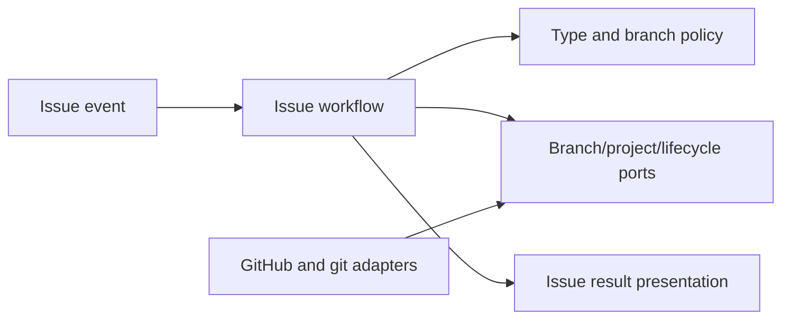

# Managed Issue and Branch Lifecycle

- Status: As-built baseline
- Date: 2026-09-11
- Owners: Copilot maintainers
- Scope: issue admission, metadata enrichment, managed branch creation, lifecycle state, and merge-driven closure
- Related issues/PRs: release orchestration and branch synchronization SDDs
- Required review gates: product UX, architecture, testing, documentation, security/operations
- Open decisions blocking readiness: none for the baseline

## 1. Executive summary

Copilot turns an authorized typed issue into traceable work: it normalizes
metadata, links projects, selects a branch strategy, creates or reuses a linked
branch, persists parent/working branch facts, and communicates the next action.
Regular work starts from the configured development branch; a release starts
from the exact development HEAD at cut time; a hotfix starts from the latest
accepted production tag.

```text
issue -> permission/type/labels -> managed strategy -> linked branch
      -> in-progress state -> commits/PR -> merged PR -> close linked issue
```

## 2. Problem, current behavior, and evidence

### 2.1 Problem

Labels, branch names, issue types, assignments, projects, progress state, and
closing behavior can drift when each maintainer performs them manually. Release
and hotfix origin mistakes are especially hard to recover.

### 2.2 Current behavior

1. The issue workflow verifies permission and closes disallowed issues.
2. It cleans requested stale branches, assigns members, normalizes title/type,
   links projects, and evaluates priority/size.
3. Branch management runs when the launcher label or always-on option applies;
   release/hotfix labels bypass the normal launcher requirement.
4. Strategy precedence is hotfix, then release, then managed work.
5. Managed feature/bugfix/docs/chore branches originate from development;
   release branches persist development origin SHA; hotfix branches use the
   latest tag commit.
6. A created linked branch moves the issue to in-progress and persists branch facts.
7. The workflow may answer help or recommend steps; new issues get one welcome.
8. A merged linked PR closes the issue through the PR lifecycle.

### 2.3 Evidence and contract classification

- Observed behavior: issue workflow/steps, branch preparation strategy and
  policies, branch repositories, lifecycle domain, and issue docs.
- Intentional contract: semantic origins, deterministic strategy precedence,
  idempotent reuse, persisted branch facts, and one welcome.
- Known debt and limitations: linked-branch propagation includes an adapter
  delay; GitHub linkage/project APIs may be eventually consistent; lifecycle
  labels supplement rather than replace GitHub state.
- Unknown rationale: historic emoji/title defaults are treated as current
  presentation choices, not architectural necessities.
- Proposed improvements: replacing propagation delay with provider events needs
  a separate change proposal.

## 3. Actors, surfaces, and terminology

| Actor | Goal | Entry point | Visible surfaces |
|---|---|---|---|
| Issue author | request/understand work | issue template | issue body/comments |
| Maintainer | classify and launch | labels/edit | branch, project, lifecycle |
| Contributor | implement | linked branch | commits and PR |
| Copilot | keep facts aligned | issue/push/PR event | labels, title, comments |

“Parent” is the source line a working branch must contain. “Working branch” is
the linked branch for the issue. Lifecycle, temporary agent activity, and human
waiting labels are independent dimensions.

## 4. Goals, non-goals, and fixed invariants

### 4.1 Goals

1. A managed issue MUST expose its parent and working branch unambiguously.
2. Replayed events MUST not create duplicate branches or welcomes.
3. Release/hotfix origin MUST follow their semantic branch rules.

### 4.2 Non-goals

1. This SDD does not define post-promotion release orchestration.
2. It does not auto-merge contributor PRs.
3. It does not infer arbitrary branch graphs from prose.

### 4.3 Fixed product/safety invariants

1. Hotfix strategy wins if conflicting special labels are present.
2. Managed branch parent and target MUST differ and use safe names.
3. Release origin SHA and hotfix tag SHA MUST be retained once created.
4. Unauthorized issues MUST not create repository branches.

## 5. Current versus proposed product journey

| Stage | Manual/unclear risk | As-built contract | Effect |
|---|---|---|---|
| Classification | labels disagree | deterministic type/strategy | one branch meaning |
| Origin | latest branch guessed | semantic source + SHA | reproducible cut |
| Creation | duplicate branch | list/decision/reuse | replay safe |
| Tracking | prose only | config marker + linked branch + labels | machine/human trace |
| Completion | manual close | merged PR closes issue | lifecycle alignment |

No behavior change is proposed.

## 6. Functional behavior and state model

### 6.1 Happy path

1. An authorized issue is opened or labelled with a supported work type.
2. Metadata and project state are normalized.
3. The branch decision selects origin, safe name, and create/reuse behavior.
4. GitHub creates and links the branch; Copilot persists facts and marks in-progress.
5. Commits and a linked PR advance review state; merge closes the issue.

### 6.2 Alternative paths

- With `branch-management-always=false`, normal work waits for `branched`.
- Existing correct branch becomes a no-op; a rename decision may create the new safe name.
- Question/help issues receive answers instead of branch recommendations.
- Release issues skip generic recommendations and delegate deployment later.
- Closed issues may reopen on push when configured.

### 6.3 State model

| State | Meaning | Next | Owner/recovery |
|---|---|---|---|
| classified | type/labels known | waiting/branched | maintainer |
| waiting-to-branch | launcher absent | branched | add label |
| branched | linked branch exists | in-progress/reviewing | contributor |
| in-progress | changes on working branch | reviewing/blocked | contributor |
| reviewing | linked PR open | changes-requested/verified | reviewers |
| ready | checks/review permit merge | complete/blocked | maintainer |
| blocked | action/input required | prior active state | named actor |
| complete | linked PR merged/issue closed | reopened if new work | maintainer |

Stale or duplicate events MUST reuse persisted/current GitHub facts. Cleanup is
explicit and must not delete unrelated branches.

## 7. User-facing configuration

| Input | Default | Bounds/alternatives | Persistence |
|---|---|---|---|
| `branch-management-launcher-label` | `branched` | non-empty label | workflow input |
| `branch-management-always` | `false` | boolean | workflow/Variable |
| `main-branch` / `development-branch` | `master` / `develop` | safe non-empty branch names | stored at operation cut where needed |
| `feature-tree`, `bugfix-tree`, `docs-tree`, `chore-tree` | matching names | safe prefixes | repository config |
| `release-tree`, `hotfix-tree` | matching names | safe prefixes | operation snapshot |
| `reopen-issue-on-push` | `true` | boolean | repository config |
| assignee count | `1` | 0–10 | repository config |

Labels, issue types, project columns, locale, title emoji, size thresholds, and
commit-prefix transforms are documented public inputs. Branch origin semantics,
authorization, SHA retention, and unrelated-branch protection are not configurable.

## 8. Clean Architecture design

| Boundary | Owns | Must not own/import |
|---|---|---|
| Domain/policies | lifecycle labels, strategy, branch decision | GitHub calls |
| Issue use case | required sequential orchestration | provider DTOs |
| Ports | branch list/create/link, metadata, project, lifecycle | Octokit types |
| Adapters | GraphQL/REST/git implementation | origin policy |
| Composition | concrete step graph | duplicate sequencing |
| Presentation | branch result/reminders/welcome | branch mutations |



Architecture tests MUST keep policies provider-free, application ports semantic,
and composition as the only concrete wiring owner.

## 9. UI/UX and content contract

```markdown
Pending: **This issue is classified but has no work branch.** Add `branched` to start.
Action required: **Prepare `feature/123-readable-title`.** Check out the linked branch and use the shown commit prefix.
Blocked: **Branch creation was not authorized.** No branch was created; ask a maintainer to review access.
Partial: **The branch exists, but project status could not be updated.** Work may continue; retry metadata sync.
Complete: **The linked pull request was merged and the issue is closed.** No action is required.
```

The primary issue comment SHOULD link both parent and working branch and state
the next action. Titles, labels, markers, and welcome content are deterministic.
There is at most one welcome on issue creation. Visual indicators always have
text; links are descriptive; configured issue locale is used with English fallback.
Untrusted titles/body/branch text is sanitized before Markdown or commands.

## 10. Failure, recovery, and cleanup

| Failure | Impact | Retained facts | Retry | Action | Cleanup |
|---|---|---|---|---|---|
| permission denied | issue closed/no branch | reason result | after access fix | maintainer | none |
| origin/tag missing | special branch absent | issue/config | yes | repair branch/tag | none |
| create/link fails | no or partial link | provider state | yes | inspect branch first | do not duplicate |
| project/metadata fails | branch may exist | branch/config | yes | retry enrichment | none |
| stale cleanup request | wrong deletion risk | all branches | no unsafe retry | re-resolve exact targets | exact branches only |

## 11. Security, permissions, and privacy

Permission checks precede branch mutation. Issue text, titles, labels, and
configuration markers are untrusted. Branch names and commit-prefix arguments
must be validated/quoted. Tokens stay in adapters. Cleanup and relinking operate
only on exact repository coordinates and resolved managed branches.

## 12. Observability and operational UX

Results identify each step, branch URLs, project/lifecycle changes, and the
first failure. Stored configuration owns parent/working branch and special
origin facts. GitHub linked branches and PR closing references provide external
evidence. Agent activity is temporary and removed in `finally`; stable lifecycle
and waiting labels remain actionable without logs.

## 13. Compatibility, migration, rollout, and rollback

Existing current-version configuration markers are restored. Missing historic
fields use bounded reconstruction from labels/branches; invalid markers fail or
are ignored according to parser policy, never executed. Renaming branch inputs
does not rewrite in-flight origin facts. Rollback removes only newly created
managed branches after exact validation; merged commits are not erased.

## 14. Testing strategy and numeric budget

| Area | Minimum cases | Risks |
|---|---:|---|
| Strategy/name/lifecycle policy | 22 | precedence, origins, labels, names |
| Issue sequencing/idempotency | 18 | permission, reuse, replay, cleanup |
| Branch/project/provider adapters | 16 | linking, pagination, errors |
| Workflow/template/config contract | 10 | events, inputs, issue types |
| Issue UX/localization/sanitization | 12 | views, links, one welcome |
| Integration/security/migration | 12 | issue→branch→PR, stale state, injection |
| **Total** | **90** | no double counting |

Global coverage remains mandatory; changed pure branch/lifecycle policy SHOULD
reach 95% branch coverage. Use deterministic propagation fakes, not real waits.
Manual evidence covers issue rendering, linked-branch discoverability, mobile,
dark/light, and non-English fallback.

## 15. Documentation and discoverability

| Audience | Artifact | Required content |
|---|---|---|
| User | branch management/type pages | launch and origins |
| Contributor | branch sync + PR pages | update and merge journey |
| Operator | notifications/troubleshooting | stuck/cleanup/reopen |
| Maintainer | architecture + this SDD | state ownership |

## 16. Acceptance scenarios

1. A feature issue without launcher waits and states the required label.
2. The same event with launcher creates one linked branch from development.
3. A replay reuses the branch and does not duplicate welcome or project item.
4. A release records exact development origin SHA; a hotfix uses latest tag SHA.
5. Conflicting release/hotfix flags select hotfix deterministically.
6. An unauthorized issue performs no branch mutation.
7. A provider failure after branch creation reports the retained branch.
8. A merged linked PR closes the issue and exposes completion.
9. Untrusted issue text cannot inject commands, mentions, or markers.

## 17. Requirements traceability

| Requirement | Owner | Evidence | Documentation |
|---|---|---|---|
| strategy/origin | branch policies/preparation | strategy + preparation tests | branch management/release/hotfix |
| issue sequence | issue workflow | issue use-case tests | issue overview |
| lifecycle facts | lifecycle domain/use case | lifecycle tests | labels pages |
| provider linkage | branch repository/ports | repository tests | branch management |
| safe UX | presentation policies | result tests | examples |

## 18. Maintenance sequence

1. Update domain strategy/lifecycle and tests.
2. Update issue orchestration and idempotency tests.
3. Update semantic ports/adapters and provider fixtures.
4. Update result content, issue docs, templates, and catalog.
5. Run complete gates and human GitHub UX review.

## 19. Definition of Done

- [ ] Origins, branch state, retries, cleanup, and closure remain deterministic.
- [ ] Architecture checks and the 90-case budget pass.
- [ ] All issue UI states and next actions are readable and localized/fallback-safe.
- [ ] Workflow/template/config/docs/catalog contracts agree.
- [ ] Security tests cover authorization, names, markers, and cleanup targeting.
- [ ] Human linked-branch and issue UX evidence is captured.

## 20. References and decisions

- Primary sources: catalogued issue/branch code, tests, workflows, and docs.
- Related SDDs: release orchestration; branch synchronization; PR lifecycle.
- Decision: semantic origins are fixed; surface naming remains bounded configuration.
- Rejected: arbitrary branch graphs and inferred release origin.
- Follow-up: event-driven branch propagation is outside this baseline.
