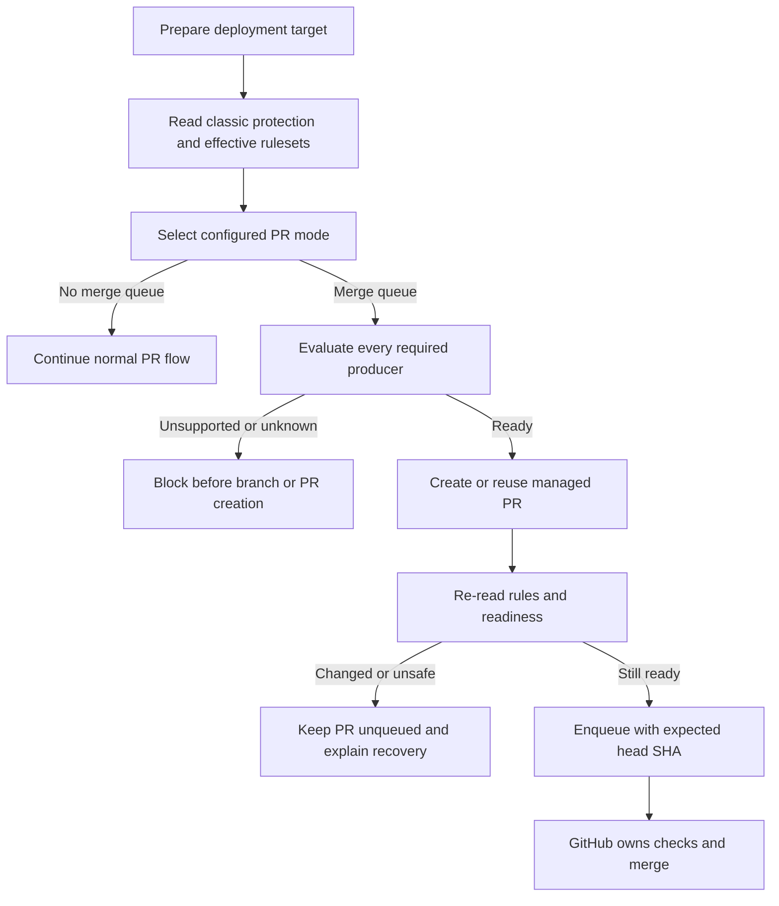
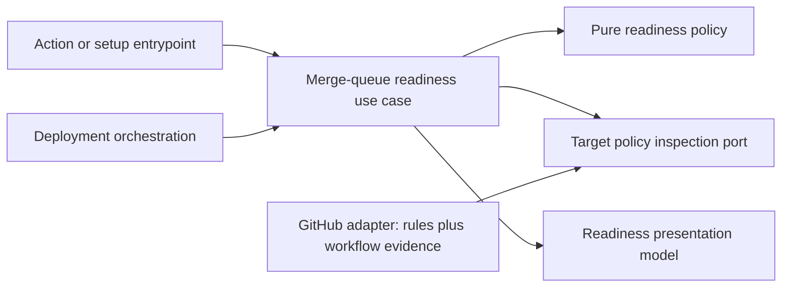

# Merge Queue Readiness and Effective Target Rules

- Status: Implemented — code, test, documentation, workflow, and package gates
  complete; clean-tree bundle validation and controlled live queue validation
  remain external completion gates
- Date: 2026-09-10
- Owners: `vypdev/copilot` product and engineering maintainers
- Scope: discover the effective merge policy of every deployment target and
  prevent a managed pull request from entering an unusable merge queue.
- Related issues/PRs: [PR #358](https://github.com/vypdev/copilot/pull/358),
  [`configurable-release-orchestration.md`](./configurable-release-orchestration.md)
- Required review gates: product UX, architecture, testing, documentation,
  security/operations
- Open decisions blocking readiness: none

## 1. Executive summary

The Bugbot finding was valid. Before this implementation, the Action accepted
`merge-queue` without supplying the optional `mergeQueueWorkflowSupported` fact
and setup hard-coded that fact to `true`. The runtime could therefore enqueue a
managed PR even when a required check could not run for a merge group.

The implemented fix does **not** thread another boolean through the Action builders.
Merge-queue readiness is mutable repository state, not static deployment
configuration. The implemented design is a fail-closed, runtime preflight that:

1. combines classic branch protection with every active repository or
   organization ruleset applying to the exact target branch;
2. verifies accessible GitHub Actions workflows automatically;
3. accepts a bounded, exact operator attestation only for an otherwise unknown
   required check;
4. blocks known-unsupported and unexplained checks before creating a managed
   PR, then rechecks immediately before enqueueing; and
5. leaves final mergeability and check execution to GitHub without polling.

```text
Deployment target -> Read effective rules -> Select PR mode
  -> queue not selected: continue normally
  -> queue selected: verify every required producer
       -> ready: create/reuse PR -> recheck -> enqueue with expected head SHA
       -> unknown/unsupported: block with exact corrective action; do not create PR
```

This scope also fixes an adjacent correctness gap discovered during the audit:
the previous target-capability adapter did not see strict status-check rules
defined only through rulesets. The implemented adapter now includes those
rules, so back-merge planning uses the effective strict policy even when merge
queue is not selected.

## 2. Problem, pre-implementation behavior, and evidence

### 2.1 Problem

Release and hotfix operators expect `auto` and `merge-queue` modes to hand a PR
to GitHub only when GitHub can eventually complete it. Before this change the product could say
that GitHub owns the transition while the required check is structurally unable
to run on the merge-group commit. The result is a PR that remains pending until
someone diagnoses repository configuration outside the orchestration UI.

The failure is especially costly after publication: npm and the GitHub Release
may already be complete while development reconciliation remains blocked.

### 2.2 Verified pre-implementation behavior

The following evidence is pinned to commit
[`010a17e`](https://github.com/vypdev/copilot/commit/010a17ef001a792f11ef34f0948941df01c537cc),
the last revision before this implementation. The current files intentionally no
longer exhibit these behaviors.

1. `validateDeploymentConfiguration` rejects explicit `merge-queue` only when
   `mergeQueueWorkflowSupported === false`; `undefined` is accepted
   ([historical deployment configuration](https://github.com/vypdev/copilot/blob/010a17ef001a792f11ef34f0948941df01c537cc/src/domain/deployment_configuration.ts#L75-L123)).
2. The GitHub Action and local builders pass only branch values, so the fact is
   always `undefined` at those entry points
   ([historical Action builder](https://github.com/vypdev/copilot/blob/010a17ef001a792f11ef34f0948941df01c537cc/src/actions/deployment_configuration_builder.ts#L18-L96)).
3. Setup passes `mergeQueueWorkflowSupported: true` without inspecting the
   target repository
   ([historical setup validation](https://github.com/vypdev/copilot/blob/010a17ef001a792f11ef34f0948941df01c537cc/src/application/policies/setup_configuration_validation.ts#L52-L70)).
   A later warning admitted that setup validated only the bundled bridge.
4. Runtime target inspection reads classic branch protection plus GraphQL
   `branchProtectionRule.requiresMergeQueue`; it does not read effective
   rulesets or required check/workflow identities
   ([historical GitHub adapter](https://github.com/vypdev/copilot/blob/010a17ef001a792f11ef34f0948941df01c537cc/src/data/repository/deployment/github_deployment_repository.ts#L62-L77)).
5. The promotion PR is created before target capabilities are read
   ([historical orchestration use case](https://github.com/vypdev/copilot/blob/010a17ef001a792f11ef34f0948941df01c537cc/src/application/usecases/actions/deployment_orchestration_use_case.ts#L173-L190)).
   Reconciliation could also create a sync branch and PR before merge-queue
   readiness was known.
6. Enqueueing does not pass GraphQL `expectedHeadOid`, and queue membership is
   not read before a retry.

### 2.3 Live repository evidence captured on 2026-09-10

- `GET /repos/vypdev/copilot/branches/master/protection` returned `404 Branch
  not protected` because no classic protection rule applies.
- `GET /repos/vypdev/copilot/rules/branches/master` returned an active ruleset
  with strict required checks `CI Check` and `RepoWise code health`.
- Both checks have `integration_id: 15368`; `GET /apps/github-actions`
  identifies that ID as the GitHub Actions app. Despite its name, `RepoWise code
  health` is therefore a repository GitHub Actions job, not an opaque
  third-party status producer.
- A local YAML contract spike mapped those contexts uniquely to
  `.github/workflows/ci_check.yml` and `.github/workflows/repowise.yml`; both
  explicitly declare `merge_group: checks_requested`.
- `master` has no effective `merge_queue` rule and `develop` currently has no
  effective rules. Consequently PR #358 is not presently exposed to this
  failure, although the implementation defect remains real for configured
  consumers.
- The same evidence proves the adjacent ruleset bug: current code reports
  `requiresStrictStatusChecks: false` for `master` because classic protection
  returns 404, while the effective ruleset says strict checks are required.

### 2.4 External primary-source evidence

- GitHub states that required GitHub Actions checks need the
  [`merge_group` event](https://docs.github.com/en/actions/reference/workflows-and-actions/events-that-trigger-workflows);
  otherwise the check is not reported and the merge fails.
- GitHub's [merge-queue guide](https://docs.github.com/en/repositories/configuring-branches-and-merges-in-your-repository/configuring-pull-request-merges/managing-a-merge-queue)
  requires third-party CI to build `gh-readonly-queue/{base_branch}` refs.
- The [effective rules endpoint](https://docs.github.com/en/rest/repos/rules#get-rules-for-a-branch)
  returns active repository- and organization-level rules for an exact branch,
  including `merge_queue`, `required_status_checks`, and `workflows`, with only
  Metadata read permission.
- GitHub documents that a required workflow check is named after its job and a
  reusable workflow uses `<job name> / <reusable job name>`; required checks do
  not encode the workflow, matrix, or trigger that produced them
  ([troubleshooting rules](https://docs.github.com/en/repositories/configuring-branches-and-merges-in-your-repository/managing-rulesets/troubleshooting-rules)).
- GitHub accepts successful, skipped, or neutral required checks, but warns
  that a workflow skipped by event/path/branch filtering may leave a required
  check pending
  ([status-check troubleshooting](https://docs.github.com/en/repositories/configuring-branches-and-merges-in-your-repository/managing-protected-branches/troubleshooting-required-status-checks)).
- Multiple rulesets and classic branch protection can coexist, so the most
  restrictive effective result must be aggregated rather than selecting one
  source ([about rulesets](https://docs.github.com/en/repositories/configuring-branches-and-merges-in-your-repository/managing-rulesets/about-rulesets)).
- GraphQL exposes `expectedHeadOid` on
  [`enqueuePullRequest`](https://docs.github.com/en/graphql/reference/pulls#enqueuepullrequest),
  allowing the final mutation to reject a moved PR head.

### 2.5 What can and cannot be proved automatically

The system can prove a static GitHub Actions status producer when the required
context maps to at least one accessible workflow job with a literal, exact name
and that workflow explicitly handles `merge_group.checks_requested`. It can
also inspect an exact required-workflow rule because GitHub supplies repository
ID, path, ref, and optional SHA.

The system cannot generically prove:

- third-party webhook/build configuration;
- dynamic job names, unresolved matrix names, or inaccessible reusable
  workflows;
- a status rule whose source is `any`, beyond the operator's explicit trust;
- future rule or workflow changes after the final preflight; or
- the behavior of another PR already ahead in the queue that changes workflow
  files.

Those limits require a three-valued result (`ready`, `unsupported`, `unknown`),
not an optimistic boolean. GitHub remains the final authority after enqueue.

## 3. Actors, surfaces, and terminology

| Actor | Goal | Entry point | Visible surfaces |
|---|---|---|---|
| Release operator | Finish promotion and reconciliation without a stuck queue | Release/hotfix issue action | Issue dashboard, managed PR, Job Summary |
| Repository setup owner | Make queue compatibility explicit before a release | `copilot setup` / `copilot doctor` | CLI readiness table, configuration docs |
| CI owner | Make one required producer work on merge groups | Workflow or vendor configuration | Workflow file, attestation, diagnostic links |
| Maintainer | Diagnose and recover a blocked in-flight operation | Retry the release/hotfix action | Issue dashboard and milestone comment |

Terms:

- **Effective target rules**: the union of active rulesets applying to the exact
  base branch plus applicable classic branch protection.
- **Required producer**: a required status check or required workflow that must
  report on the merge-group commit.
- **Automatic evidence**: provider facts the Action can inspect and match
  without operator assertion.
- **Attestation**: a bounded assertion that one exact otherwise-unknown check
  identity supports the relevant logical target role.
- **Unknown**: support cannot be proved or disproved. Unknown is not success.
- **Unsupported**: inspected evidence proves the producer cannot run for the
  merge group. An attestation cannot override this fact.
- **Readiness preflight**: configuration inspection only. It does not poll
  check runs or predict their result.

## 4. Goals, non-goals, and fixed invariants

### 4.1 Goals

1. MUST detect queue and strict-check rules from both rulesets and classic
   protection for each actual target branch.
2. MUST prevent enqueue when any required producer is unsupported or remains
   unknown.
3. MUST perform the first readiness check before creating a managed PR or sync
   branch, and MUST recheck immediately before enqueue.
4. MUST explain every producer as verified, attested, unsupported, or unknown.
5. MUST share the same readiness semantics across runtime, setup, and doctor.
6. MUST retain the existing event-driven model with no check polling or runner
   wait loop.

### 4.2 Non-goals

1. Predicting whether CI will pass.
2. Reimplementing GitHub mergeability, required-check completion, or queue
   scheduling.
3. Automatically changing consumer rulesets or third-party CI settings.
4. Treating a successful historical check run as permanent support.
5. Supporting arbitrary scripts, URLs, or expressions in attestation config.
6. Providing a legacy optimistic queue mode.

### 4.3 Fixed product and safety invariants

1. Queue readiness MUST fail closed on absent permissions, partial provider
   responses, parsing ambiguity, or unknown producers.
2. Attestation MAY convert `unknown` to `ready`; it MUST NOT override a known
   missing `merge_group` trigger or another `unsupported` result.
3. No global `mergeQueueWorkflowSupported` boolean is a valid authority.
4. A readiness result MUST be recomputed from live target rules; a stored result
   is audit evidence only.
5. `create-only` remains the explicit non-queue escape hatch. There is no
   configurable bypass that silently enqueues an unverified PR.
6. A queue mutation MUST bind to the verified PR head SHA.

## 5. Previous versus implemented product journey

| Stage | Before this change | Implemented behavior | User/operator effect |
|---|---|---|---|
| Input validation | Optional capability is usually absent; setup forces true | Validate only static syntax here | No false claim from an entrypoint |
| Rule discovery | Classic protection plus one GraphQL field | Aggregate classic protection and effective rulesets | Ruleset-only repositories behave correctly |
| Producer discovery | None | Enumerate status checks and required workflows | Exact blocking producer is visible |
| First side effect | Create PR, then inspect capabilities | Preflight before sync branch/PR creation | Known bad configuration leaves no orphan PR |
| Queue mutation | Enqueue by PR node ID | Recheck, inspect membership, enqueue with expected head SHA | Safe retry and reduced race window |
| Setup | Generic warning | Target-by-target readiness report | CI owners know what to fix before release |
| Failure UX | Generic thrown error | Impact, cause, exact producer, action, retained state | Recovery does not require reading source code |



Text equivalent: prepare target -> aggregate rules -> select mode -> either use
the non-queue path, block before mutation, or create/reuse the PR -> recheck ->
enqueue the exact head -> let GitHub own checks and merge.

## 6. Functional behavior and state model

### 6.1 Effective rule aggregation

For an exact target branch, the provider adapter MUST:

1. read repository merge settings;
2. read classic branch protection; a verified 404 means “no classic rule”, not
   “no protection of any kind”;
3. read `GET /rules/branches/{branch}` and retain every active returned rule;
4. OR queue requirements across classic and ruleset sources;
5. OR strict-status requirements across sources;
6. union and deduplicate required checks by `(context, integrationId|any)`;
7. union and deduplicate required workflows by
   `(repositoryId, path, ref, sha)`; and
8. return provider errors or incomplete mappings as explicit unknown facts.

The application MUST never infer that an empty ruleset response cancels a
classic protection requirement, or vice versa.

### 6.2 Automatic GitHub Actions evidence

For a GitHub Actions required status check, automatic verification MUST require:

- an exact static context match to a literal in-repository job name (job ID
  only when no `name` is declared); reusable-workflow and dynamic names remain
  ambiguous and require exact attestation;
- an accessible workflow definition from the relevant GitHub ref;
- a `merge_group` trigger that includes `checks_requested`; explicit type
  filtering and GitHub's equivalent unfiltered string, list, null, or empty
  mapping forms are accepted; and
- no unresolved dynamic element needed to establish the match.

At least one matching eligible workflow is sufficient to produce the required
context. An exact matching workflow with a missing trigger is `unsupported`.
Malformed YAML, reusable/dynamic naming, ambiguous mapping, or inaccessible
content is `unknown`.

Required-workflow rules MUST be verified from their exact repository/path/ref or
SHA. Inaccessibility is `unknown`, not an implicit attestation.

### 6.3 Third-party and ambiguous producers

- A non-GitHub-Actions integration is `unknown` unless an exact active
  attestation matches its context, integration ID/source, and logical target.
- An otherwise ambiguous GitHub Actions status check MAY use the same exact
  attestation mechanism.
- A rule configured for any source matches only an attestation that explicitly
  uses `integrationId: "any"`.
- A known missing trigger remains `unsupported` even if an attestation exists.
- Extra attestations that match no effective rule produce a setup/doctor warning
  but do not block a deployment.

### 6.4 Runtime evaluation points

1. **Promotion preflight:** before creating/reusing the promotion PR. Reusing an
   already existing managed PR is allowed only after the same preflight.
2. **Reconciliation preflight:** before creating a sync branch or managed PR.
3. **Pre-enqueue check:** after verifying PR identity/head and immediately before
   enqueue.
4. **Retry/continuation:** always reread rules and attestations; never trust a
   previous readiness result.

If queue is not the selected mode, producer readiness is `not_required`.
Effective strict-check facts are still used by back-merge selection.

### 6.5 Readiness states

| State | Entered when | User-visible meaning | Allowed next states | Recovery/owner |
|---|---|---|---|---|
| `not_required` | Selected mode does not enqueue | Queue compatibility is irrelevant to this transition | normal PR states | None |
| `ready` | Every required producer is verified or attested | The exact PR head may be enqueued after final recheck | queued, unknown, unsupported | GitHub/Action |
| `unknown` | Evidence or permission is incomplete | The Action refuses to guess | ready, unsupported | Setup/CI owner |
| `unsupported` | Evidence proves a missing queue trigger/contract | Queue would stall or fail | ready | CI owner |
| `queued` | GitHub confirms queue membership | GitHub owns checks and merge | merged, ejected | GitHub/operator |

Duplicate inspection is a pure reread. Duplicate enqueue first inspects queue
membership and becomes a no-op when the PR is already queued. An ambiguous
enqueue response is retryable only after authoritative membership inspection.

## 7. User-facing configuration

### 7.1 Recommended bounded input

| Input | Type | Recommended default | Allowed values/range | Scope/persistence |
|---|---|---|---|---|
| `merge-queue-check-attestations` | JSON array encoded as an Action input; structured YAML in setup config | `[]` — no unverified trust | 0-50 exact entries, max 16 KiB | Repository policy; reread for every readiness decision, never snapshotted as authority |

Each entry has exactly:

| Field | Type | Constraint |
|---|---|---|
| `context` | string | Exact required-check name, 1-255 characters; no control characters |
| `integrationId` | positive integer or `"any"` | Exact ruleset/classic source identity; `"any"` is an explicit weaker-source acknowledgement |
| `targets` | array | 1-3 unique values from `production`, `development`, `active-release` |

Unknown keys, duplicate identities, invalid target roles, non-integers, unsafe
characters, and oversized input MUST fail validation. Values are data only and
MUST never be evaluated as shell, JavaScript, expressions, refs, or URLs.

Recommended setup YAML for an external production check:

```yaml
repository:
  reconciliationPullRequestMode: merge-queue
  mergeQueueCheckAttestations:
    - context: Vendor security gate
      integrationId: 424242
      targets: [production]
```

Meaningful alternative for a status rule deliberately configured with any
source:

```yaml
repository:
  mergeQueueCheckAttestations:
    - context: Internal deployment gate
      integrationId: any
      targets: [production, development]
```

Setup serializes the structured value into the Action input used by generated
publishing and managed-PR continuation workflows. Direct workflow users may
pass the JSON representation. Precedence
follows the existing setup/config/Action-input rules; no environment variable or
undocumented fallback is added.

### 7.2 Intentionally non-configurable

- fail-closed behavior;
- inspection of both rulesets and classic protection;
- final pre-enqueue reread;
- `expectedHeadOid` binding;
- the distinction between `unknown` and `unsupported`; and
- the rule that attestation cannot override known contrary evidence.

The old `mergeQueueWorkflowSupported` context field is removed. It is neither a
public setting nor a legacy compatibility path.

## 8. Clean Architecture design

### 8.1 Responsibilities and dependency direction

| Layer/boundary | Owns | Must not own/import |
|---|---|---|
| Domain/pure policy | check/workflow identities, target roles, exact attestation validation, and readiness decisions | Octokit, YAML, filesystem, Actions runtime |
| Application | preflight use case, evaluation ordering, retry/idempotency, semantic ports | raw GitHub DTOs or REST/GraphQL field names |
| Adapters/data | classic/ruleset union mapping, GitHub Actions workflow parsing/matching, provider error classification | deployment product decisions or presentation prose |
| Infrastructure/composition | Octokit client shape and wiring for runtime/setup/doctor | business validation |
| Entrypoints | parse bounded Action/setup input and adapt the event | repository network calls or duplicated readiness policy |
| Presentation | readiness view model, localized dashboard/CLI/summary rendering | mutations and provider queries |



Text equivalent: entrypoints and deployment orchestration call one application
readiness use case; it applies pure policy to provider-neutral facts from GitHub
ports and returns a typed presentation model.

### 8.2 Implemented contracts

Provider-neutral facts:

```text
TargetMergeCapabilities
  autoMergeAllowed
  mergeQueueRequired
  immediatelyMergeable
  requiresStrictStatusChecks
  mergeQueueProducers[]  { kind, name, integrationId?, path?, support, reason }
  mergeQueueObservationProblems[] { area, sanitizedMessage }

MergeQueueReadiness
  verdict                not_required | ready | unknown | unsupported
  targetRole
  targetBranch
  producers[]            { identity, verdict, evidenceKind, explanation }
```

The application port expresses `getTargetCapabilities`; it does not expose
Octokit response types. The GitHub adapter owns ruleset/classic aggregation and
workflow-contract evidence mapping behind that port. The enqueue port accepts
`pullRequestNodeId` and `expectedHeadSha`, and exposes an authoritative
queue-membership read for idempotent recovery.

### 8.3 State and trust boundaries

- Deployment mode remains snapshotted in the operation.
- Attestations and effective target rules are live policy and MUST be reread.
- A bounded readiness snapshot MAY be emitted to logs, Job Summary, and the
  current dashboard update for audit, but MUST NOT be reused to authorize a
  later enqueue.
- No new durable operation schema field is required for authorization. The
  existing failure state stores a concise sanitized reason; detailed evidence
  is regenerated on retry.
- Repository rule data and workflow YAML are untrusted provider input: enforce
  size limits, safe paths, object-shape validation, and Markdown sanitization.
- `404` classic protection is an expected absence. `403`, rate limit, schema
  drift, truncated data, or required content 404 maps to `unknown` and blocks.

### 8.4 Executable architecture constraints

- Application dependency tests MUST continue forbidding imports from
  `actions`, `cli`, `infrastructure`, and concrete provider adapters.
- Provider DTO types MUST remain under the GitHub infrastructure boundary.
- A contract test MUST parse generated and active workflows structurally and
  verify that every setup-managed required producer includes
  `merge_group.checks_requested`.
- A source-boundary test MUST prevent entrypoints from calling GitHub rule or
  workflow APIs directly.
- No Checks API polling loop, `sleep`, or merge-after-poll implementation may be
  introduced.

## 9. UI/UX and content contract

### 9.1 Information hierarchy

Every blocking readiness surface answers in order. Setup and doctor additionally
show one row per observed producer; runtime keeps producer details inside the
bounded failure diagnosis rather than adding unbounded dashboard rows:

1. Is this target ready for merge queue?
2. Was a PR or package already created/published?
3. Which exact producer is verified, attested, unknown, or unsupported?
4. What one action is required?
5. What happens after retry?
6. Where can rules, workflow, PR, and run be inspected?
7. What technical identities were observed?

### 9.2 Setup/doctor ready state

```text
✅ Merge queue readiness · production (`master`)

Queue rule: required

Producer                 Source          Evidence
CI Check                 GitHub Actions  Verified · ci_check.yml handles merge_group
RepoWise code health     GitHub Actions  Verified · repowise.yml handles merge_group

No action required. Rerun `copilot doctor` after changing rules, workflows, or
attestations and before the next release.
```

### 9.3 Blocked before irreversible effects

```markdown
# 🛑 Release 3.5.0 · promotion blocked

> **Current status:** `master` requires merge queue, but one required check is
> not proven to run for merge groups.
>
> **Action required:** update `Vendor security gate` for
> `gh-readonly-queue/master`, or add an exact reviewed attestation and retry.

## Retained state

- npm package published: no
- GitHub Release created: no
- managed promotion PR created: no

<details>
<summary>Technical evidence</summary>

Target `master`; `Vendor security gate [unknown]`: third-party support cannot be
proved automatically. Observation made immediately before PR creation. No
queue mutation was attempted.

</details>
```

### 9.4 Blocked after publication or after PR creation

```markdown
# ⚠️ Release 3.5.0 · reconciliation paused

> **Current status:** package publication succeeded, but the reconciliation PR
> was not enqueued because the target rules changed during the final recheck.
>
> **Action required:** restore `merge_group` support for `CI Check`, then retry
> the release action. The package will not be republished.

## Retained state

- npm `@vypdev/copilot@3.5.0`: ✅ published
- GitHub Release `v3.5.0`: ✅ published
- reconciliation PR #412: ✅ open, not queued
- development synchronized: ⏸️ no
```

### 9.5 Pending and complete variants

- **Pending/ready:** the dashboard states that no action is required while
  GitHub owns the pending transition, identifies the managed PR in its links,
  and records `merge-queue` as the selected PR mode in technical details.
- **Complete:** existing deployment completion UI remains authoritative; queue
  readiness is shown only inside collapsed technical evidence.

### 9.6 Issue, PR, comment, accessibility, and localization

- The issue control center remains the primary durable surface.
- Existing `update` mode keeps one durable dashboard. Existing `milestones`
  mode publishes bounded operation-scoped events; readiness failures use the
  same comment policy rather than a separate unbounded channel.
- The dashboard is published as GitHub-owned only after auto-merge/queue
  mutation succeeds or authoritative queue membership already exists.
- English and Spanish renderers MUST carry the same facts and action. Unknown
  provider text falls back to English.
- Emoji supplements text and is never the sole status signal. Tables use text
  verdicts, logical headings, and descriptive links. Mobile rendering keeps the
  primary status/action above tables and details.
- Contexts, branch names, provider messages, Markdown, markers, mentions, and
  URLs are sanitized with the existing deployment presentation rules.

## 10. Failure, recovery, and cleanup

| Failure/partial state | User impact | Retained facts | Automatic retry | Required action | Cleanup |
|---|---|---|---|---|---|
| Effective rules API forbidden/unavailable | Queue mode cannot be authorized | No PR/sync branch on first preflight | Yes, after permission/API recovery | Grant Metadata read; grant Administration read for classic protection; or retry service | None |
| Classic protection 404, rulesets readable | No impact by itself | Ruleset facts remain valid | N/A | None | None |
| Known workflow lacks `merge_group` | Queue would never report required check | No PR before first preflight | Yes, after workflow fix | Add trigger and retry | None |
| Producer is external/ambiguous | Support cannot be proved | No PR before first preflight | Yes | Configure provider and add exact attestation | None |
| Rules change after PR creation | Existing PR remains open but unqueued | PR identity and any publication facts | Yes | Correct policy and retry | Do not delete useful PR |
| PR head changes before enqueue | Stale evidence is rejected | PR remains open | Yes after trusted head verification | Restore/recreate managed head | No unsafe enqueue |
| Enqueue response is ambiguous | Membership uncertain | PR remains open | Yes after authoritative membership read | Usually none | Never enqueue blindly twice |
| PR is ejected by failing CI | GitHub owns the failure | Publication facts retained | No hidden loop | Fix CI and explicitly retry/requeue | Follow queue policy |

Errors MUST follow `impact -> cause -> action -> retained state`. A post-publication
readiness failure MUST say that npm/GitHub Release succeeded and MUST promise no
republish on retry.

## 11. Security, permissions, and privacy

1. Effective rules require Metadata read, classic protection inspection
   requires Administration read for fine-grained PATs, and workflow inspection
   uses Contents read already needed for repository operation.
2. An inaccessible organization required workflow blocks instead of requesting
   broader write permission.
3. Attestations contain no secrets, commands, URLs, or credentials. Exact
   identity matching prevents one vendor/check assertion from authorizing a new
   required producer.
4. Provider messages and workflow content are untrusted; enforce response size,
   count, path, and Markdown limits before logging or rendering.
5. Queue mutation uses the PAT already authorized for deployment and includes
   the expected head SHA. Tokens never appear in evidence or errors.
6. Queue membership and managed PR markers remain authoritative against replay
   or forged continuation events.

## 12. Observability and operational UX

- Setup and doctor show a target readiness row plus one row per required
  producer. Runtime stores a bounded sanitized blocking diagnosis in durable
  state; the issue dashboard and Job Summary show that action and retained
  publication facts. Successful pending state shows the selected PR mode.
- Runtime state and logs correlate with deployment operation ID, issue, PR
  (when present), and target; full tokens and raw workflow content are excluded.
- `unknown` is reported as an external/policy dependency, not a failed CI run.
- Reads are one bounded batch at preflight and one final batch before enqueue;
  no polling is added. Provider rate-limit errors are retryable and fail closed.
- Identical evidence does not create repeated comments.

## 13. Compatibility, migration, rollout, and rollback

- This is a correctness hardening with no optimistic legacy mode.
- Existing configuration without attestations defaults to `[]`. Queue mode
  continues automatically only when every producer can be verified.
- Existing in-flight operations reread the new live policy. If they rely on an
  unknown producer they block with recovery instructions; they are not silently
  grandfathered.
- The obsolete optional boolean is removed from domain validation and its tests.
- Rollout order: ship effective rule reads and diagnostics; enable fail-closed
  preflight in the same release. A feature flag is not justified because it
  would preserve the unsafe path.
- Rollback may restore the previous package version, but an already queued PR is
  still governed by GitHub. No code attempts to dequeue or delete it implicitly.

## 14. Testing strategy and numeric budget

The minimum is **46 distinct cases**, derived from the rule-source, evidence,
ordering, race, recovery, and presentation risks below.

| Area | Minimum distinct cases | Behaviors/risks covered |
|---|---:|---|
| Domain/configuration/pure planning | 12 | four verdicts; classic/ruleset union; strict OR; identity dedupe; automatic, attested, missing, contrary evidence; target-role matching; invalid attestation bounds |
| State/application/idempotency/races | 10 | promotion and reconciliation preflight ordering; no side effects on block; final reread; changed rules; moved head; already queued; ambiguous enqueue retry; post-publication retained facts; create-only bypass of readiness |
| Adapters/provider contracts | 11 | classic present/404/403; effective rules parsing; repository/org source aggregation; queue/strict/status/workflow rule mapping; GitHub Actions identity; workflow exact match; dynamic/ambiguous job; inaccessible workflow/error mapping |
| Workflows/setup/schema | 6 | active/setup `merge_group`; structured generated input; setup ready/unknown; doctor drift; no obsolete boolean; least-privilege API contract |
| UI/UX/localization/sanitization | 5 | ready, pre-mutation block, post-publication partial, recovered/queued, Spanish plus hostile provider values |
| Integration/security/migration | 2 | ruleset-only repository end-to-end fake; existing operation with new unknown required check |
| **Total** | **46** | No double counting |

Repository thresholds remain lines/statements 90%, functions 88%, and branches
82%. New pure readiness and attestation policies require 100% statement/function
coverage and at least 95% branch coverage. Changed adapters and orchestration
paths require every mapped provider-error branch to be exercised.

Tests use deterministic fakes and fixtures: no live GitHub calls, real waits, or
queue mutations. Adapter fixtures cover raw classic, ruleset, workflow, and
GraphQL shapes. UI golden fixtures require semantic assertions for status,
action, retained facts, and links instead of snapshots alone. Manual evidence
must confirm narrow-width English/Spanish readability and GitHub light/dark
rendering.

## 15. Documentation and discoverability

| Audience | Artifact/page | Required content | Validation/navigation |
|---|---|---|---|
| User | `docs/issues/deployment-orchestration.mdx` | normal queue journey, fail-closed behavior, partial publication | docs route/link validation |
| Setup owner | `docs/configuration.mdx`, `docs/configuration-checklist.mdx` | exact attestation schema, permissions, recommended empty default | examples checked against parser fixtures |
| Operator | deployment troubleshooting section | four verdicts, rule-source inspection, recovery decision tree | documentation contract test |
| Contributor | this spec and architecture docs | semantic ports, trust boundary, no-polling invariant | architecture boundary tests |

The parent configurable orchestration spec MUST be amended so it no longer says
setup can merely warn for an unproved producer. Documentation MUST distinguish
GitHub Actions jobs from third-party checks by integration identity, not by
human-facing name.

## 16. Acceptance scenarios

1. Given a ruleset-only `master` with strict checks, when back-merge planning
   runs, then strict status checks are reported and the safe back-merge mode is
   selected.
2. Given explicit `merge-queue` and two accessible GitHub Actions jobs with
   exact names and `merge_group.checks_requested`, when promotion starts, then
   readiness is ready and the PR may be created.
3. Given one required workflow that lacks `merge_group`, when promotion starts,
   then the operation blocks before PR creation with that workflow and fix.
4. Given an unknown third-party check and no attestation, when queue mode is
   selected, then the operation blocks before branch/PR creation.
5. Given an exact attestation for that check and logical target, when retried,
   then the check is marked attested and processing resumes.
6. Given contrary inspected evidence plus an attestation, when evaluated, then
   `unsupported` wins and no enqueue occurs.
7. Given readiness before PR creation but a changed required rule before
   enqueue, when final preflight runs, then the existing PR remains unqueued and
   the dashboard identifies the change.
8. Given a moved PR head, when enqueue is attempted, then `expectedHeadOid`
   prevents enqueue and the operation blocks safely.
9. Given an ambiguous enqueue response and an already queued PR, when retried,
   then authoritative membership produces a no-op rather than a second enqueue.
10. Given `create-only`, when required producers are unknown, then the managed
    PR is created for human handling and no queue-readiness claim is displayed.
11. Given npm and the GitHub Release are already published, when reconciliation
    readiness blocks, then the UI preserves those successes and retry does not
    republish.
12. Given a 403 reading effective rules, when queue mode is selected, then the
    system reports unknown/permission action and performs no queue mutation.
13. Given hostile context/provider text, when the dashboard and Job Summary are
    rendered, then mentions, workflow commands, Markdown, and markers are inert.
14. Given Spanish locale, when readiness blocks, then status, action, retained
    facts, and technical evidence are semantically equivalent to English.

## 17. Requirements traceability

| Requirement | Policy/use case/adapter/presentation | Test or evidence | Documentation |
|---|---|---|---|
| Effective rule union | target merge policy + GitHub adapter | adapter and ruleset-only integration fixtures | operator architecture section |
| Fail closed | readiness policy + orchestration preflight | verdict and no-side-effect cases | orchestration guide |
| Automatic workflow proof | workflow contract adapter/policy | static literal name, job-ID fallback, dynamic/reusable ambiguity, malformed, oversized, and inaccessible fixtures | configuration guide |
| Exact attestation | parser + readiness policy | bounds, identity, target, contrary-evidence cases | configuration/checklist |
| Two evaluation points | orchestration use case | ordering and changed-rule race cases | troubleshooting flow |
| Safe enqueue retry | queue port/repository | expected head, membership, ambiguous response cases | operator recovery |
| Product UI | readiness view model/renderers | semantic golden/localization/security tests | issue guide |
| No polling | application/architecture contract | source/contract assertion | contributor docs |

## 18. Implementation sequence

1. Approve this decision and amend the parent orchestration spec.
2. Remove the optional static capability boolean; add bounded attestation value
   objects, parser, target roles, evidence types, and pure readiness policy.
3. Add provider-neutral effective-rule/workflow/queue-membership ports and raw
   GitHub DTOs under the provider boundary.
4. Implement and fixture-test classic plus effective-ruleset aggregation before
   changing orchestration behavior.
5. Implement GitHub Actions workflow matching and required-workflow inspection;
   keep ambiguity explicit.
6. Add pre-mutation and pre-enqueue evaluations, expected-head enqueue, and
   idempotent membership recovery.
7. Integrate structured setup/doctor inspection and generated Action input.
8. Add English/Spanish readiness recovery, target/producer rows in setup and
   doctor, and actionable dashboard/Job Summary failures.
9. Update public docs and workflow contracts, satisfy the 46-case budget,
   coverage, architecture, build, and documentation gates.
10. Run a controlled repository test with a temporary non-required fixture
    workflow first; enable a real merge-queue ruleset only through an explicit
    maintainer operation outside automated tests.

## 19. Definition of Done

- [x] Recommendation and public attestation contract are approved.
- [x] Both classic protection and effective rulesets drive target facts.
- [x] Unknown and unsupported producers block before side effects and again
      before enqueue.
- [x] Queue mutation is head-bound and idempotently recoverable.
- [x] No legacy optimistic mode or obsolete boolean remains.
- [x] Architecture boundaries and the no-polling contract are executable.
- [x] More than 46 distinct feature cases and repository coverage thresholds pass.
- [x] Setup, doctor, issue dashboard, Job Summary, English, Spanish,
      sanitization, and comment-budget automated acceptance pass.
- [x] User, setup, operator, contributor, and parent-spec documentation agree.
- [ ] Controlled live GitHub queue and light/dark/narrow-width human UX gate is
      completed by a maintainer outside deterministic tests.
- [x] Build generation, typecheck, lint, workflow, documentation, package,
      smoke, and git diff validation pass.
- [ ] Clean-tree `validate:build` passes after the generated bundles are
      committed; by design this command rejects any uncommitted `build/` diff.
- [x] No readiness-blocking design decision remains unresolved.

## 20. Decision record

### 20.1 Weighted evaluation

Scores are 1 (poor) to 5 (strong). Weighted total is out of 500.

| Option | Correctness 30% | Rule/check coverage 20% | No polling/unsafe effects 15% | UX 15% | Architecture 10% | Maintainability 10% | Total |
|---|---:|---:|---:|---:|---:|---:|---:|
| A. Thread one optional boolean through builders | 2 | 1 | 5 | 3 | 2 | 5 | 270 / 54% |
| B. Validate bundled workflows only during setup | 2 | 2 | 5 | 4 | 3 | 4 | 305 / 61% |
| C. Automatic static verification only | 4 | 3 | 5 | 2 | 4 | 3 | 355 / 71% |
| D. Operator attestations only | 3 | 4 | 5 | 2 | 4 | 4 | 355 / 71% |
| **E. Automatic evidence + exact attestation + fail closed** | **5** | **5** | **5** | **4** | **5** | **4** | **475 / 95%** |
| F. Enqueue, poll, and detect a stall | 2 | 5 | 1 | 2 | 2 | 2 | 245 / 49% |

### 20.2 Recommendation

Adopt option E. It is the only option that covers ruleset-only repositories,
uses automatic proof where GitHub exposes enough identity, remains usable with
third-party CI, and does not pretend unknown evidence is safe.

Reject A because it moves a mutable external fact into static input validation.
Reject B because setup evidence becomes stale. Reject C because GitHub does not
encode every status-to-workflow relationship and third-party configuration is
opaque. Reject D because it creates needless manual drift for inspectable
GitHub Actions. Reject F because it creates the exact stuck-queue state the
feature must prevent and violates the event-driven no-polling architecture.

### 20.3 Follow-up explicitly outside this spec

- Generic validation of all possible deployment, code-scanning, or environment
  protection products beyond the required status/workflow contracts returned
  for merge-queue targets.
- Automatic edits to rulesets or vendor CI.
- A live destructive merge-queue test in a user repository.
