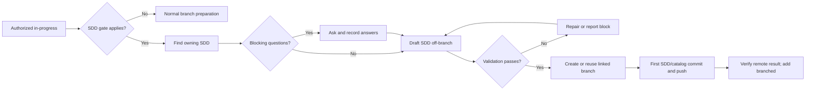
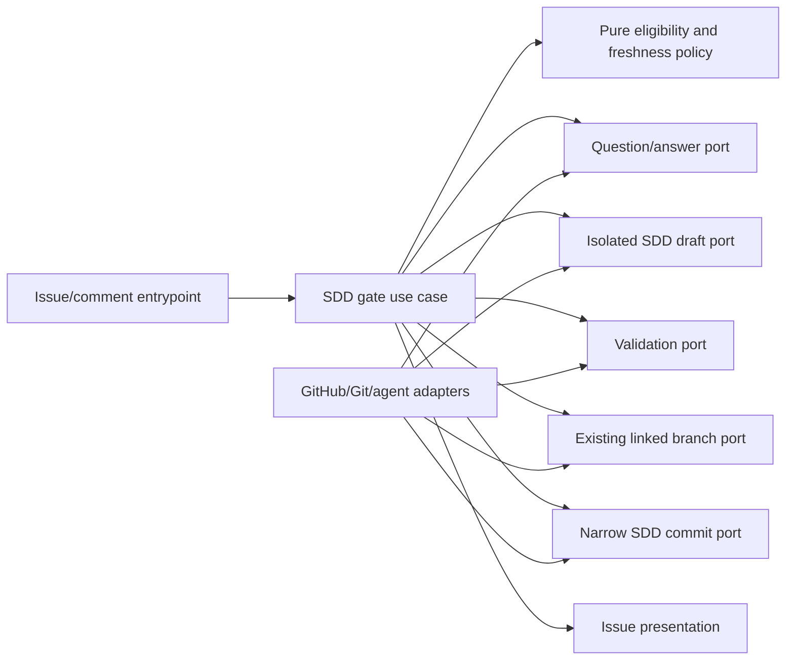

# Pre-branch SDD Gate

- Status: Implemented — automated verification complete; live provider UX review pending
- Date: 2026-09-17
- Catalog capability ID: `issue-start-and-sdd-readiness`
- Last verified: 2026-09-17 on `codex/issue-start-sdd-gate`
- Owners: Copilot maintainers
- Scope: clarify, update, validate, and publish the owning SDD before eligible branch-based work
- Related issues/PRs: none; local design work; companion SDD `issue-start-and-branch-readiness.md`
- Required review gates: product UX, architecture, testing, documentation, security/operations
- Open decisions blocking readiness: none in the SDD-only policy; live provider review remains pending

## 1. Executive summary

A repository can enable a pre-branch SDD gate for feature issues and other
branch-bearing issues explicitly marked as behavior changes. After an authorized
`in-progress` start, the Action finds the owning SDD, analyzes the issue, and
asks blocking questions in the issue before an agent drafts any document. Once
the answers are recorded, the agent updates or creates the SDD in a temporary
workspace. The Action validates it, creates or reuses the exact linked branch,
publishes the SDD and required generated catalog metadata as the first
branch-specific commit, verifies the remote result, and then adds `branched`.

This first version supports **SDDs only**. The Action does not select, request,
generate, validate, catalog, or gate Product Requirements Documents (PRDs) or
Architecture Decision Records (ADRs). Their possible future value does not
justify adding two more document lifecycles to issue comments and branch
readiness now.

```text
in-progress -> find owning SDD -> ask blocking questions in the issue
            -> draft and validate SDD off-branch
            -> Action-linked branch -> first SDD/catalog commit/push
            -> verify remote commit -> branched -> implementation later
```

Text equivalent: a permitted start leads to SDD ownership and clarification.
Only after the blocking answers are recorded does the agent draft the SDD. The
Action validates it before branch creation and announces readiness after the
first SDD commit is confirmed remotely.

## 2. Problem, former behavior, and evidence

### 2.1 Problem

Before this change, the issue-to-branch flow had no SDD readiness gate. The repository
already requires an SDD as a shared, testable contract for capability changes,
but agents can begin branch work while scope, acceptance, or architecture
questions remain unresolved. Supporting PRDs and ADRs in this first gate would
also require distinct selection, answer, review, status, schema, and recovery
rules in the Action, increasing the issue workflow without a demonstrated need.

### 2.2 Former behavior before this change

1. `specs/README.md` and `specs/_template.md` define the SDD standard.
2. `specs/catalog.json` identifies capability ownership and SDD paths;
   `specs/CATALOG.md` is generated. The validator checks catalog registration
   and paths.
3. The issue route can recommend a plan or answer help on opening or editing an
   issue. `/copilot clarify` is a separate read-only interaction.
4. Ordinary issue comments without `/copilot` or an exact bot mention are
   currently inert; there is no active clarification-session exception.
5. The branch preparation route currently creates a linked branch before SDD
   generation. The issue workflow checks out the workflow source, so the new
   gate must explicitly pin its semantic base and validate that source.
6. The installed workflows exclude bot-authored events; a bot-applied `SDD` or
   `branched` label cannot be the only continuation signal.

### 2.3 Evidence

- Specification standard and validator: `specs/README.md`,
  `specs/_template.md`, `specs/catalog.json`, and
  `scripts/validate-specification-catalog.cjs`.
- Current issue/comment/branch paths: `src/application/usecases/issue_workflow.ts`,
  `src/application/usecases/issue_use_case.ts`,
  `src/application/usecases/steps/issue/prepare_branches_use_case.ts`,
  `.github/workflows/copilot_issue.yml`, and
  `.github/workflows/copilot_issue_comment.yml`.
- Current user guidance: `docs/issues/comment-commands.mdx`,
  `docs/issues/branch-management.mdx`, and
  `docs/development/specifications.mdx`.
- Provider event and token behavior:
  https://docs.github.com/en/actions/reference/workflows-and-actions/events-that-trigger-workflows
  and https://docs.github.com/en/actions/concepts/security/github_token.
- Unknowns: there is no production evidence for an SDD gate or for PRD/ADR
  demand in this Action. The user chose local design work before dogfooding.

### 2.4 Retrospective classification (as-built baselines only)

Not applicable. This was a prospective change. Section 2.2 records the prior
behavior; the current gate contract is defined here and in the companion SDD.

## 3. Actors, surfaces, and terminology

| Actor | Goal | Entry point | Visible surfaces |
|---|---|---|---|
| Issue author | Describe behavior and answer questions | Issue Form/comments | Issue question/status cards |
| Maintainer | Start and resolve material choices | `in-progress`/comments | Issue, SDD plan, Action run |
| Contributor | Implement a settled contract | Linked branch | SDD commit, branch, later PR |
| Operator | Recover interrupted publication | Rerun/reconcile | Retained branch/commit, status |
| Copilot Action | Enforce the gate and publish facts | Issue/comment events | Labels, comments, Job Summary, branch |

An **SDD** is the repository's integrated product and engineering contract.
The `SDD` label indicates that this issue requires an SDD update; it is not a
claim that drafting is finished. A **question card** is one correlated issue
comment with numbered blocking questions. The **owning SDD** is the catalogued
contract for the affected capability, or a new/companion SDD justified by a
new bounded capability. **SDD readiness** means the required update passed
validation and is confirmed in the exact remote linked branch. Branch
existence alone does not prove it.

## 4. Goals, non-goals, and fixed invariants

### 4.1 Goals

1. When the gate applies, no SDD draft MUST be generated before every blocking
   product, scope, security, and architecture question has an authorized
   answer or an explicitly accepted resolution.
2. The Action MUST identify one owning SDD path from the catalog, or justify
   and register one new/companion SDD for a new bounded capability.
3. The required SDD change MUST pass structure, catalog, link, and content
   checks before branch creation.
4. The first branch-specific commit MUST contain only the required SDD change
   and generated catalog artifacts; `branched` MUST wait for remote verification.
5. One issue MUST have a bounded, inspectable clarification and publication
   history across edits, retries, cancellation, and partial writes.

### 4.2 Non-goals

- No PRD or ADR selection, generation, templates, catalog extensions, status
  labels, or issue-question branches are part of this version. A separate
  future proposal can define them after the SDD workflow is proven useful.
- The gate does not write implementation code, open a PR as a readiness
  prerequisite, merge, release, or deploy.
- Help issues remain branchless and never enter the SDD gate.

### 4.3 Fixed product/safety invariants

1. An enabled SDD gate requires issue-managed branches at setup and runtime.
2. Only an authorized human can start work or resolve material questions.
   Bot-authored text does not count as a human answer.
3. The drafting agent has no repository write credential. A narrow Action-owned
   writer receives only validated SDD/catalog paths and the exact linked ref.
4. A published first commit is never force-pushed away. A retry checks remote
   facts and reuses the same operation, branch, and commit when present.
5. Requirements and decisions remain traceable to issue comments and SDD
   sections; no answer is invented to pass the gate.

## 5. Current versus proposed product journey

| Stage | Current | Proposed | User/operator effect |
|---|---|---|---|
| Start | Branch launcher/type shortcut | `in-progress` then SDD eligibility | One deliberate entry |
| Discovery | Optional plan/clarify | Find owning SDD and gaps | Avoid duplicate contracts |
| Questions | One-off read-only reply | Correlated blocking questions | Clear next actor |
| Draft | Contributor may write after branch | Agent drafts off-branch after answers | No premature branch |
| Publication | General branch work | SDD/catalog first commit | Reviewable contract first |
| Ready | Branch label may launch work | Verified `branched` output | Trustworthy handoff |



Text equivalent: an authorized start either proceeds directly to normal branch
preparation or finds the SDD owner. Blocking questions are answered in the
issue, then the agent drafts and validates the SDD off-branch. The Action
creates the linked branch, publishes its first SDD/catalog commit, verifies it,
and applies `branched`.

## 6. Functional behavior and state model

### 6.1 Eligibility and SDD ownership

- `pre-branch-sdd=true` applies to a branch-bearing feature issue and to any
  other branch-bearing issue whose authorized maintainer applied the fixed
  `contract-change` label. Help never qualifies. The agent can recommend that
  label but cannot apply it as a decision about scope.
- The Action queries the catalog for the affected capability. It updates its
  owning SDD; a genuinely new capability may receive one new SDD, while a
  bounded cross-capability concern may receive a companion. It rejects
  ambiguous ownership before branch creation.
- Even when an existing SDD largely covers the issue, the gate requires a
  meaningful SDD change, such as issue-specific acceptance and traceability.
  It does not create an empty first commit to satisfy the gate.
- The Action adds `SDD` once the gate is required. This derived label survives
  retries and remains until the issue completes or the requirement is
  deliberately reclassified by an authorized maintainer.

### 6.2 Happy path

1. An admitted eligible issue receives `in-progress` from an authorized actor.
   The Action snapshots kind, issue revision, profile, semantic base SHA,
   catalog ownership, and existing SDD evidence.
2. An agent analyzes missing product and technical facts. One numbered question
   card asks all known blocking questions, gives suggested answers where
   useful, and names each human decision owner. No SDD draft exists yet.
3. Authorized human comments answer the numbered questions. If there are no
   blockers, the Action proceeds without asking for a redundant confirmation.
4. The agent drafts the owning/new SDD in a temporary workspace pinned to the
   semantic base, using `specs/_template.md` and `specs/README.md`; a new SDD
   updates catalog metadata and regenerated catalog output.
5. The Action validates structure, content, catalog registration, links,
   numeric test budget, and the allowlisted path diff. It rereads issue,
   answers, profile, and base SHA. Material drift restarts analysis before any
   branch mutation.
6. The existing managed-branch capability creates or reuses the exact linked
   ref. The writer stages only the SDD and required generated catalog files,
   creates the first branch-specific commit, and pushes without force.
7. The Action verifies the remote SHA and changed-path list, updates the issue
   status with SDD/commit/branch links, and adds `branched`. Implementation may
   then begin in that branch; any PR follows the normal later lifecycle.

### 6.3 Alternatives, changes, and cancellation

- With `pre-branch-sdd=false`, the Action skips this gate and follows the
  companion branch-readiness contract. Non-feature issues without
  `contract-change` also skip the gate.
- A relevant authorized human comment can answer active numbered questions
  without a `/copilot` command. Unrelated or bot-authored comments remain inert.
  The Action continues within the current run when no answer is needed; it
  never relies on its own `SDD` label event to continue.
- Material issue or answer edits before the first push invalidate the draft
  digest and trigger bounded re-analysis. Unrelated comments do not. After
  publication, a material change enters revision-pending: the Action removes
  `branched`, retains the first commit, validates an SDD revision on the same
  branch, and restores `branched` after remote verification.
- Removing `in-progress` before branch creation cancels generation but retains
  questions and answers. After branch or commit creation, cancellation stops
  new work and reports retained artifacts; it never deletes or rewrites them.
- An existing linked branch with unrelated commits cannot claim an SDD/catalog
  first commit. The Action blocks, identifies the retained branch, and requires
  a deliberate maintainer resolution instead of rewriting history.

### 6.4 State machine

| State | Entered when | Visible meaning | Next | Owner/recovery |
|---|---|---|---|---|
| not-required | Gate disabled/ineligible | Normal branch path | branch preparation | Action |
| analyzing | Eligible start accepted | SDD owner and gaps being assessed | awaiting-answer, drafting, blocked | Agent |
| awaiting-answer | Numbered blocker posted | Named person must answer | analyzing, canceled | Issue author/maintainer |
| drafting | Answers complete | SDD generated off-branch | validating, blocked | Agent |
| validating | Draft exists | Structure and freshness checks | publishing, drafting, blocked | Action |
| publishing | Valid draft and exact linked ref | First commit in progress | published, partial | Action |
| partial | Branch/commit exists; later step failed | Retained state and retry | publishing, blocked | Operator |
| published | Remote SDD commit verified | Branch can become ready | revision-pending, implemented | Contributor |
| revision-pending | Material post-publication change | Branch retained; `branched` absent | published, blocked | Maintainer/agent |
| blocked | Invalid source/config/permission | No unsafe progress | prior safe state | Named actor |
| canceled | Start removed before branch | No generation | analyzing on new start | Maintainer |

## 7. User-facing configuration

| Input | Type | Recommended default | Allowed values/range | Scope/persistence |
|---|---|---|---|---|
| `pre-branch-sdd` | boolean | `false` until the team opts in | `true`, `false` | Repository setup and Action input; snapshot at accepted start |
| `issue-managed-branches` | boolean | `true` for branch-bearing work | `true`, `false` | Companion SDD; must be true when SDD gate enabled |
| `contract-change` | fixed label | Absent unless maintainer confirms behavior impact | present/absent | Live issue classification at start |
| `SDD` | fixed label | Added when required | derived present/absent | Issue presentation, not an input |

Recommended opt-in:

```yaml
issue-managed-branches: true
pre-branch-sdd: true
```

Meaningful alternative for repositories that are not ready for the gate:

```yaml
issue-managed-branches: true
pre-branch-sdd: false
```

Setup and runtime MUST reject `pre-branch-sdd=true` with managed branches
disabled. An absent setting resolves to `false`; unknown or malformed values
fail validation. The fixed feature/`contract-change` eligibility rule has no
configurable scope or per-document mode. In-flight operations snapshot the
validated setting and base; later setup changes apply only to new starts.
Answer completeness, path allowlist, exact ref, first-commit contents,
validation, and no-force-push rules are not configurable. No legacy
documentation-gate setting exists to migrate.

## 8. Clean Architecture design

### 8.1 Responsibilities and dependency direction

| Boundary | Owns | Must not own/import |
|---|---|---|
| Domain/pure policy | Eligibility, owner choice rules, answer completeness, freshness, states | GitHub/agent SDKs |
| Application use cases | Analyze, ask/consume answers, draft, validate, publish, reconcile | Provider DTOs/process code |
| Semantic ports | Catalog query, issue comments, scratch workspace, validator, linked branch, commit/push | Octokit or Git CLI shapes |
| Adapters | GitHub comments/branch, agent draft, Git workspace, validator invocation | Product eligibility policy |
| Composition | Credentials, model, port wiring, scoped writer | Human decisions |
| Entrypoints | Issue/comment events and admitted operation | Duplicate SDD policy |
| Presentation | Question/status view models and renderers | Repository mutation |



Text equivalent: an admitted event invokes the gate use case. Pure policies
decide eligibility, answer completeness, ownership, and freshness. The use
case coordinates comments, isolated drafting, validation, linked branch, and
commit ports. Adapters implement external operations; presentation reports
the outcome independently of mutation.

### 8.2 Contracts, state, and trust boundaries

- `SddGateSnapshot`: repository/issue ID, admitted kind, actor, issue/answer
  digest, effective profile, catalog owner, semantic base ref/SHA, question IDs,
  operation ID, and completed publication effects.
- `SddPlan`: one owner action (`update | companion | new`), reason, planned
  repository path, blocking question IDs, and source links. No arbitrary
  executable command or branch name appears in the plan.
- `SddGateOutcome`: `skipped | needs-input | draft-invalid | ready-to-publish |
  partial | published | stale | blocked`, exact SDD path, branch/ref/SHA,
  retained effects, and recovery action.
- One durable state record owns the operation. Labels are projections,
  comments are human evidence, the remote SDD commit is document evidence,
  and the exact linked branch is branch authority.
- Repository/issue concurrency serializes publication. Replays compare the
  operation ID, source digest, exact ref, and remote SHA. Bot-generated events
  are never the sole continuation mechanism.
- A comment is accepted as an answer only during active questioning, from the
  issue author or authorized maintainer, after the current card, and mapped to
  a numbered question. Outside that state, ordinary comments stay inert.
- Provider failures map to `unavailable`, `stale`, `invalid`, `unauthorized`, or
  `partial`, without raw exception text in public comments.

### 8.3 Executable architecture constraints

- Pure gate policies cannot import agent, provider, process, or UI code;
  dependency checks enforce this.
- The draft step has no write credential. The commit port accepts a typed
  allowlist of SDD/catalog paths and an exact Action-owned linked ref.
- Catalog validation retains its existing SDD schema. No PRD/ADR file type,
  metadata field, or status parser is introduced for this feature.
- The first-commit path-diff guard rejects source, workflow, secrets,
  executable scripts, or any unselected file.
- Contract tests parse issue forms, setup profile, Action input, question IDs,
  status markers, catalog output, and staged paths structurally.

## 9. UI/UX and content contract

### 9.1 Information hierarchy

The issue presents one current status and one primary human action. It says
what is complete, whether a branch exists, what happens next, and where to
inspect the questions, SDD, Action run, and commit. A single status card is
updated in place; a single question card changes only when the blocking set
changes. A run with no blocking question does not request confirmation merely
to advance.

### 9.2 Representative issue views

Illustrative issue `#501` and URLs below are examples, not existing resources.

Pending analysis:

```markdown
<!-- copilot-sdd-gate:v1 issue=501 -->
## SDD before the branch
> **Current status:** Checking the issue and existing SDDs.
> **Completed:** Work was started; no branch has been created.
> **Next:** Copilot will find the owning SDD and any blocking questions.
> **Action required:** None yet.
[Issue #501](https://github.com/vypdev/copilot/issues/501)
```

Action required:

```markdown
## SDD before the branch
> **Current status:** Waiting for two answers.
> **Completed:** The owning SDD was found; no branch exists yet.
> **Next:** Copilot will draft the SDD after the answers are recorded.
> **Action required:** Issue author, reply with `Q1` and `Q2`.
1. **Q1 — Product:** Which issue kinds may work without a managed branch? Suggested: help only.
2. **Q2 — Architecture:** Who owns the branch-ready fact? Suggested: the Action, verified from the linked ref.
[Owning SDD](https://github.com/vypdev/copilot/tree/develop/specs)
```

Blocked before mutation:

```markdown
## SDD before the branch
> **Current status:** SDD validation blocked publication.
> **Completed:** Answers were recorded; a draft exists only in the temporary workspace.
> **Impact:** No branch or commit was created.
> **Action required:** Maintainer, resolve the duplicate SDD owner reported in the Action run.
[Action run](https://github.com/vypdev/copilot/actions)
```

Partial after branch creation:

```markdown
## SDD before the branch
> **Current status:** The SDD push needs recovery.
> **Completed:** Linked branch `feature/501-work-start` exists; SDD validation passed.
> **Impact:** The SDD commit is not confirmed remotely; implementation remains paused and `branched` is absent.
> **Action required:** Retry publication on the same branch after inspecting its remote head.
[Linked branch](https://github.com/vypdev/copilot/tree/feature/501-work-start) · [Action run](https://github.com/vypdev/copilot/actions)
```

Complete readiness:

```markdown
## SDD before the branch
> **Current status:** SDD published; branch ready for implementation.
> **Completed:** The SDD update is the first branch commit and passed validation.
> **Next:** Continue work on the linked branch; open a PR through the normal workflow.
> **Action required:** No clarification remains.
[SDD commit](https://github.com/vypdev/copilot/commits/feature/501-work-start) · [Linked branch](https://github.com/vypdev/copilot/tree/feature/501-work-start)
```

### 9.3 Issue, comment, and PR behavior

- Durable hidden markers identify one status and one question card per issue.
  A retry updates/reuses them; unchanged replays are silent. At most one new
  clarification notification appears per changed blocking-question set.
- `SDD` remains a requirement indicator. Waiting labels identify whether the
  author or maintainer must act. `branched` is applied only after remote
  verification under the companion SDD.
- The issue links the SDD path and exact first commit. When a contributor later
  opens a PR through the existing flow, its description can link that commit;
  PR creation is not part of this gate or a readiness dependency.
- The Action never asks for a PRD/ADR choice in this workflow.

### 9.4 Accessibility and localization

Use the effective issue locale and the existing complete English fallback.
Question IDs, statuses, and links carry meaning without emoji or color. Cards
use semantic headings, short paragraphs, ordered questions, and narrow/mobile
friendly lists. Sanitize untrusted Markdown, mentions, commands, HTML markers,
URLs, and model output. Every diagram has the adjacent text equivalent;
screen-reader order follows status, completed facts, next action, impact,
links, and technical detail.

## 10. Failure, recovery, and cleanup

| Failure/partial state | User impact | Retained facts | Retry | Action | Cleanup |
|---|---|---|---|---|---|
| Missing/contradictory answers | Draft waits | Questions and prior answers | On relevant human comment | Answer named IDs | No branch |
| Agent invalid output | No publish | Operation/draft diagnostics | Bounded regeneration | Inspect repeated failure | Delete scratch only |
| Catalog/template validation fails | No branch | Draft and validation codes | After repair | Fix ownership/content | Delete scratch only |
| Base or issue changed during draft | Draft stale | Answers and source digest | Re-analyze | Review new question if needed | Discard stale draft |
| Branch created; SDD commit fails | Implementation blocked | Exact branch/base | Same-ref retry | Inspect remote head | Preserve branch |
| Commit pushed; label/status fails | SDD exists remotely | SHA, branch, path | Reconcile | Rerun presentation | Preserve commit |
| Branch already has unrelated commits | Cannot claim first SDD commit | Exact remote head | After human resolution | Inspect branch | No force/delete |
| Cancellation after branch | No further work | Branch and commit | Explicit resume | Decide next step | No force/delete |

Every public error says impact, cause, next action, and retained state in that
order. A pushed SDD commit is not represented as failed because a later label
or status update failed. A retry reads the exact remote SHA before writing.

## 11. Security, permissions, and privacy

1. Start and material answers require the existing actor authorization policy;
   issue creation or an arbitrary comment is not permission to write files.
2. Issue text and comments are untrusted. They cannot override instructions,
   select arbitrary paths, invoke shell commands, choose credentials, or mark
   an unanswered question resolved.
3. The drafting agent receives no repository write token. The writer receives
   only an allowlisted manifest, exact linked branch, expected SHA, and
   short-lived credential. Never expose credentials or private issue content
   in SDDs, logs, or comments.
4. Validate paths against symlinks, traversal, case collisions, generated
   outputs, and sensitive-file exclusions before staging. No force push or
   unrelated branch cleanup is permitted.
5. Cross-repository, stale, forged marker, bot-authored answer, and webhook
   replay attempts fail closed with bounded public detail.

## 12. Observability and operational UX

The issue status reports gate stage, SDD path/owner, answer owners, branch
existence, first commit SHA, and any retained partial state. The Job Summary
records operation ID, source/profile/base digests, validated paths, exact
branch/SHA, and semantic error code. Metrics count time waiting for answers,
agent validation failures, retries, and first-commit success without storing
private answer text. Rate-limit errors remain pending/retryable rather than a
false negative decision. One status and one active question card bound timeline
noise.

## 13. Compatibility, migration, rollout, and rollback

This is a new opt-in gate. An absent `pre-branch-sdd` setting means `false`.
There is no legacy SDD-gate schema to preserve. The companion SDD removes old
branch launcher settings in the same future release, as requested by the
user. Setup generates the new input, label, form, and guidance artifacts;
doctor detects drift. Existing branches are not retrofitted with a fictional
first SDD commit. Enabling the gate affects only starts accepted afterward.

Rollout begins with synthetic fixtures and local workflow tests, then a
controlled issue UX check during implementation acceptance. This local SDD
task performs no dogfooding. Rollback disables new starts without erasing
previous SDD commits or branches; partial operations keep explicit recovery
instructions. PRD/ADR support would require a separate future design and is
not a hidden compatibility path in this version.

## 14. Testing strategy and numeric budget

The following **60 distinct cases** are a floor derived from eligibility,
clarification, source freshness, publication races, partial writes, and SDD
ownership/validation.

| Area | Minimum cases | Behaviors and risks |
|---|---:|---|
| Pure selection/configuration/catalog planning | 10 | Boolean mode, feature/label eligibility, owner |
| State, answers, idempotency, cancellation, races | 12 | Q IDs, replay, edits, parallel runs |
| Application use cases | 8 | Analyze through publish and revise |
| Provider/agent/Git adapters | 8 | Comment, scratch workspace, exact ref, errors |
| Workflow/setup/SDD schema | 8 | Forms, profile, template, catalog |
| UX/localization/accessibility/sanitization | 6 | Five states, links, notification budget |
| Integration/security/recovery | 8 | First commit, partial effects, abuse |
| **Total** | **60** | No case counted twice |

Global Jest thresholds and existing specialized budgets remain mandatory.
New pure eligibility/freshness policy SHOULD reach at least 95% branch
coverage; changed issue/context paths SHOULD meet 95% lines/statements and
90% branches/functions in a dedicated gate. Use deterministic fake IDs,
clocks, events, agents, branch heads, and scratch workspaces; no sleeps or live
services in automated tests. Table-driven cases cover every issue kind,
answer role, and first-commit path. Parse YAML, catalog, question markers,
and staged-path manifests structurally. UI goldens require semantic assertions
besides snapshots. Human evidence later checks issue readability on desktop
and mobile, light/dark, screen-reader order, and controlled partial recovery.

## 15. Documentation and discoverability

| Audience | Artifact/page | Required content | Validation/navigation |
|---|---|---|---|
| Issue author | `docs/issues/index.mdx`, new SDD-gate guide | When questions arrive and how to answer | Route/link tests |
| Setup owner | `docs/issues/configuration.mdx`, setup guide | Boolean opt-in, branch prerequisite, examples | Setup/doctor fixtures |
| Contributor | `docs/development/specifications.mdx` | SDD owner and first commit | Catalog/link tests |
| Operator | `docs/issues/workflow-setup.mdx`, recovery guide | Partial branch/commit replay | Decision tree/golden output |
| Repository agent | Generated profile/guide | Exact Action branch, SDD gate, permitted writes | Generator contract |

Documentation navigation presents the normal path first, then configuration,
failures, recovery, and architecture. Examples match generated fixtures. A new
SDD must be registered in the existing catalog and pass existing link checks;
this feature introduces no PRD/ADR documentation or catalog schema.

## 16. Acceptance scenarios

1. With `pre-branch-sdd=false`, an authorized start reaches branch readiness
   without an SDD gate.
2. With the gate enabled, a feature selects its existing owning SDD or creates
   a justified new one; a routine chore without `contract-change` skips it.
3. A bugfix marked `contract-change` requires an SDD. Help never does.
4. The Action adds `SDD` when the gate is required and does not request a PRD
   or ADR decision, file, label, or catalog entry.
5. An unanswered blocking question creates no SDD draft or branch. A relevant
   authorized human comment answers a numbered question and resumes work;
   unrelated or bot-authored comments have no effect.
6. A fully answered issue generates a meaningful owner-linked SDD change. A
   duplicate owner, missing file, unsafe path, or missing numeric test budget
   blocks before branch creation.
7. A material issue edit or base SHA change before publication invalidates the
   draft; unchanged webhook replay is silent.
8. The Action-created branch's first new commit changes only the selected SDD
   and generated catalog artifacts and is verified remotely before `branched`.
9. Branch creation followed by commit failure retains the exact branch and
   reports same-ref retry; push success followed by label/status failure
   retains the SHA and reconciles without another commit.
10. A material post-publication change retains the first commit, removes
    `branched`, and restores it only after the revised SDD is verified on the
    same branch. An unrelated edit leaves readiness intact.
11. A malicious issue/comment cannot redirect repository, branch, path,
    credential, shell, or answer status.
12. Pending, awaiting-answer, blocked, partial, and published content is
    localized, accessible, sanitized, linked, and bounded on replay.
13. Setup rejects an enabled SDD gate without issue-managed branches and
    rejects invalid values; installed forms, profile, guide, and Action input
    agree on the same boolean setting.
14. Implementation updates current-behavior SDDs, tests, user docs,
    catalog evidence, and generated outputs together.

## 17. Requirements traceability

| Requirement | Policy/use case/adapter/presentation | Test/evidence | Documentation |
|---|---|---|---|
| 4.1.1 answers before draft | Answer-completeness policy/issue continuation | Q/replay tests | SDD-gate guide |
| 4.1.2 owner selection | Catalog query/selection policy | Ownership/duplicate tests | Specifications guide |
| 4.1.3 validation | Validator and freshness policy | Schema/catalog/stale tests | Contributor guide |
| 4.1.4 first commit/readiness | Narrow writer/readiness policy | Path-diff/remote integration | Branch management |
| 4.1.5 bounded conversation | Durable state/presenter | Marker/noise tests | Issue UX guide |
| 4.3.1 branch prerequisite | Setup/runtime validation | Config matrix | Setup guide |
| 4.3.2 human answers | Actor/answer policy | Forgery/security tests | Clarification guide |
| 4.3.3 write isolation | Draft/writer ports | Token/path/boundary tests | Security guide |
| 4.3.4 no rewrite | Git adapter/remote SHA guard | Race/retry tests | Recovery guide |
| 4.3.5 traceability | Catalog/status presenter | Link/schema tests | Specs catalog |

## 18. Implementation sequence

1. Add the boolean SDD setting, fixed eligibility rule, and setup/profile/form
   contract tests before agent generation.
2. Add pure owner selection, answer completeness, freshness, and state policies
   with deterministic tests.
3. Add the active issue-comment continuation and durable question/answer
   record, preserving inert ordinary comments outside the gate.
4. Bind a read-only agent scratch workspace, validation, exact Action-owned
   branch capability, allowlisted writer, and remote SHA guard.
5. Add bounded status/question presentation, locale catalog, generated guide,
   and partial-write recovery.
6. Update current-behavior SDD owners, catalog evidence, tests, user/setup and
   operator docs, and generated catalog together.
7. Run automated gates. Controlled live UX evidence and dogfooding require
   a later GitHub issue and are outside this local implementation task.

## 19. Definition of Done

- [ ] One SDD owner and every blocking question are discoverable before draft.
- [ ] No answer is invented by the agent; comments and SDD decisions are linked.
- [ ] The 60-case floor and repository/changed-module coverage gates pass.
- [ ] SDD template, catalog, paths, links, validation, and generated output
      agree without new PRD/ADR schemas or Action paths.
- [ ] The agent has no writer token; the first branch commit changes only the
      allowed SDD/catalog files on the exact linked ref.
- [ ] Stale/duplicate/parallel events and partial branch/commit/label outcomes
      recover without force push, duplicate commits, or timeline spam.
- [ ] Five primary GitHub states, localization, accessibility, and
      sanitization match examples and human UX review.
- [ ] Setup, issue, operator, contributor, and agent guidance is complete.
- [ ] Current-behavior SDDs and catalog evidence are revised when code is
      implemented; `generate:specifications`, `validate:specifications`,
      documentation, workflow, architecture, and package gates pass.
- [ ] No readiness-blocking product or architecture decision remains open.

## 20. References and decisions

- Local contracts: `specs/README.md`, `specs/_template.md`,
  `specs/managed-issue-and-branch-lifecycle.md`,
  `specs/configurable-issue-workflows-and-admission.md`,
  `specs/comment-automation-and-authorization.md`, and
  `specs/repository-agent-collaboration-contract.md`.
- Companion SDD: `issue-start-and-branch-readiness.md`.
- Primary provider sources:
  https://docs.github.com/en/actions/reference/workflows-and-actions/events-that-trigger-workflows
  and https://docs.github.com/en/actions/concepts/security/github_token.
- Product decision: this first Action workflow gates only the owning SDD for
  features and explicitly marked behavior changes when the repository opts in.
- Deferred: PRD/ADR support requires its own later product and technical
  design, based on experience with the SDD gate. It has no configuration or
  compatibility placeholder in this version.
- Rejected: drafting before blocking clarification, arbitrary document paths,
  branch creation before validated SDD content, and label-only readiness.
