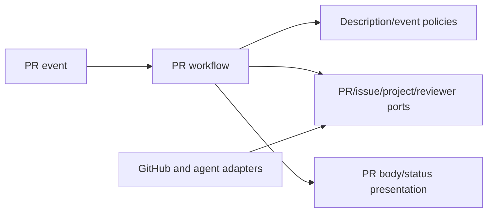

# Pull Request Lifecycle and Enrichment

- Status: As-built baseline
- Date: 2026-09-11
- Owners: Copilot maintainers
- Scope: PR-to-issue/project linkage, assignments, metadata, size/progress, description ownership, review integration, and merge closure
- Related issues/PRs: managed issue lifecycle and Bugbot SDDs
- Required review gates: product UX, architecture, testing, documentation, security/operations
- Open decisions blocking readiness: none for the baseline

## 1. Executive summary

On an opened PR, Copilot links its issue and projects, assigns people, syncs
size/progress/priority metadata, optionally owns all or a marked section of the
description, and starts review. Synchronize events refresh enabled generated
content and review; edits normalize title; a merged PR closes the linked issue.
Human-authored body content is preserved only in `append`, `preserve`, or
`disabled` mode—the recommended existing default is explicit full ownership
with `replace`.

```text
opened PR -> link issue/project -> assign -> sync labels/size -> description -> review
synchronize -> description policy -> review
edited -> title normalization
merged -> close linked issue
```

## 2. Problem, current behavior, and evidence

### 2.1 Problem

PR metadata becomes inconsistent when issue linkage, project status, reviewers,
labels, descriptions, and closure are maintained independently. AI-generated
descriptions can also overwrite human content unless ownership is explicit.

### 2.2 Current behavior

1. The route resolves PR state and branch-linked issue context.
2. On open/reopen, the sequential workflow updates title, assigns assignee and
   reviewers, links projects/issue, syncs size/progress labels, and checks priority size.
3. `replace` or `append` automatically generates a sanitized description from
   PR branches/workspace diff and optional linked issue context.
4. `replace` owns the body; `append` upserts a marker-bounded Copilot section;
   `preserve` updates only on authorized `/copilot description`; `disabled` never updates.
5. Open/reopen/synchronize run read-only review when configured/authorized.
6. Edited PRs update title only. Merged PRs close the linked issue.
7. Result publication, lifecycle labels, Job Summary, and optional Check Run expose state.

### 2.3 Evidence and contract classification

- Observed behavior: PR workflow/steps, description domain/workflow, PR
  repositories/composition, workflow, tests, and documentation.
- Intentional contract: event-specific sequencing, semantic linkage, explicit
  body ownership modes, marker idempotency, creator/member guard, and merge closure.
- Known debt and limitations: issue number inference depends on branch naming or
  GitHub links; assignment candidate quality depends on accessible membership;
  generated-description quality is probabilistic; live responsive UX evidence is absent.
- Unknown rationale: `replace` is the current default, but historic selection evidence is unavailable.
- Proposed improvements: changing the recommended default requires migration and user study.

## 3. Actors, surfaces, and terminology

| Actor | Goal | Entry point | Surface |
|---|---|---|---|
| PR author | present change | open/synchronize/edit | PR body/labels |
| Reviewer | review/merge | PR review | requests/checks/threads |
| Issue author | see delivery | linked PR merge | issue lifecycle |
| Copilot | enrich consistently | PR workflow | PR/project/comments/summary |

“Managed section” is content between stable Copilot markers. “Replace” is full
body ownership. “Enrichment” is metadata mutation that does not merge code.

## 4. Goals, non-goals, and fixed invariants

### 4.1 Goals

1. Opened PRs MUST converge to one linked/enriched state on replay.
2. Description ownership MUST be explicit and preserve content per mode.
3. Merge-driven issue closure MUST use resolved linkage, not title guessing alone.

### 4.2 Non-goals

1. This SDD does not define Bugbot finding truth or managed release PRs.
2. PR enrichment does not auto-merge normal contributor PRs.
3. It does not rewrite arbitrary project schemas.

### 4.3 Fixed product/safety invariants

1. Fork-origin pull requests MUST not receive privileged write/agent execution through unsafe workflows.
2. Agent-generated Markdown MUST be sanitized before body update.
3. Append mode MUST replace only the managed section.
4. Missing branches/context MUST skip safely rather than guess.

## 5. Current versus proposed product journey

| Stage | Manual/ambiguous risk | As-built contract | Effect |
|---|---|---|---|
| Linkage | branch/title guess by human | branch + provider linkage | traceable issue |
| Metadata | independent labels/projects | ordered synchronization | consistency |
| Body | implicit AI ownership | four explicit modes | predictable edits |
| Review | unrelated event timing | open/reopen/sync route | current evidence |
| Closure | manual issue close | merged linked PR | aligned lifecycle |

No behavior change is proposed.

## 6. Functional behavior and state model

### 6.1 Happy path

1. Same-repository PR opens from a managed branch containing issue identity.
2. Copilot enriches linkage, people, projects, labels, size, and description.
3. Review result updates current status/lifecycle.
4. Synchronize reruns only refreshable content and review.
5. Merge closes the linked issue and exposes completion.

### 6.2 Alternative paths

- No linked issue still permits a description inferred from PR metadata/diff,
  without adding a false `Closes` line.
- `preserve` accepts only explicit authorized description refresh.
- `disabled` skips both automatic and explicit body generation.
- Non-member creators are skipped for AI description when `ai-members-only=true`.
- Missing optional review composition does not prevent deterministic enrichment.

### 6.3 State model

| State | Meaning | Next | Recovery |
|---|---|---|---|
| opened | enrichment pending | enriched/partial/failed | retry event |
| enriched | deterministic metadata applied | reviewing/synchronized | none |
| reviewing | analysis current/in flight | changes-requested/ready/unknown | fresh review |
| synchronized | new head processed | reviewing/ready | none |
| partial | some enrichment succeeded | enriched | retry idempotently |
| merged | accepted change | issue closed | reopen issue only for new work |
| closed-unmerged | no delivery | terminal/reopen | contributor |

Duplicate open/synchronize events MUST upsert project/labels/managed body rather
than duplicate content. A stale review is governed by the Bugbot freshness contract.

## 7. User-facing configuration

| Input | Default | Allowed/bounds | Persistence |
|---|---|---|---|
| `ai-pull-request-description-mode` | `replace` | replace/append/preserve/disabled | per run |
| `desired-assignees-count` | `1` | 0–10 | repository/workflow |
| `desired-reviewers-count` | `1` | 0–15 | repository/workflow |
| project IDs/PR columns | empty/In Progress | accessible IDs/names | repository/workflow |
| PR locale | `en-US` | supported locale | per run |
| size/priority/progress labels and thresholds | documented defaults | bounded numeric/label inputs | repository/workflow |
| `ai-members-only` | `false` | boolean | per run |

Recommended configuration uses a PR template, one reviewer, `replace`, and
same-repository workflow guards. Teams preserving human prose use `append`.
Marker syntax, sanitization, safe branch resolution, fork boundary, and merged
issue-closure semantics are not configurable.

## 8. Clean Architecture design

| Boundary | Owns | Must not own/import |
|---|---|---|
| Domain | description modes/markers/merge policy | GitHub/agent |
| Application | event-specific PR orchestration | provider DTOs |
| Ports | PR details/body/link/project/reviewer/issue close | Octokit types |
| Adapters | GitHub REST/GraphQL operations | event policy |
| Composition | ordered concrete steps | duplicated business rules |
| Presentation | generated/sanitized body and result | provider mutations |



Architecture tests MUST keep use cases provider-neutral; workflow validators
MUST enforce same-repository/fork safety and direct event contracts.

## 9. UI/UX and content contract

```markdown
Pending: **Copilot is enriching PR #84.** Linkage and review are still running.
Action required: **No linked issue was found.** Rename/link the branch if issue tracking is required.
Blocked: **This fork cannot run the privileged PR workflow.** No repository content was changed.
Partial: **Issue and labels linked; AI description failed.** Existing PR body was retained; retry the run.
Complete: **PR metadata and review are current.** The linked issue will close when this PR merges.
```

The PR body follows configured ownership; append uses one stable section.
Result/status surfaces link issue, project where possible, current commit/review,
and next action. One primary status and action precede technical detail. English
fallback, descriptive links, logical headings, and text equivalents are required.
Untrusted body/title/template/agent output and mentions are sanitized.

## 10. Failure, recovery, and cleanup

| Failure | Impact | Retained facts | Retry | Action | Cleanup |
|---|---|---|---|---|---|
| linkage absent | issue automation unavailable | PR unchanged otherwise | yes | link/rename | none |
| metadata provider fail | partial enrichment | successful fields | yes | rerun | idempotent upsert |
| description failure | body retained per mode | metadata/review may exist | yes | fix agent/context | no blank overwrite |
| stale review/head | no stale findings | new head | automatic/retry | wait | discard stale result |
| merge closure fail | code merged, issue open | merge fact | yes | rerun/close issue | never undo merge |

## 11. Security, permissions, and privacy

Workflow event guards prevent privileged execution on foreign fork heads. Actor
and creator membership gates apply where configured. PR/issue/template content
and agent output are untrusted and bounded. The token stays in provider adapters;
agent processes do not receive it. Body markers cannot authorize commands or
escape their owned section. Project/member queries use least required access.

## 12. Observability and operational UX

Ordered results identify each enrichment step and failure. PR/issue/project
links, lifecycle/activity/waiting labels, Job Summary, and optional Check Run
provide user/operator evidence. A synchronize run correlates the current head.
Optional capability absence is a visible skip; provider failure is not hidden as
successful enrichment. Replays should not increase comment/body-section count.

## 13. Compatibility, migration, rollout, and rollback

Existing unmarked bodies are preserved in append/preserve/disabled and replaced
only in replace. Existing marked append sections are updated in place. Mode
changes are prospective: moving away from replace cannot recover overwritten
historic prose. Rollback restores body through GitHub history/manual edit; issue
closure is reversible by reopening, while merged code is not altered.

## 14. Testing strategy and numeric budget

| Area | Minimum cases | Risks |
|---|---:|---|
| Event/description/label policy | 22 | action matrix, modes, markers, bounds |
| Orchestration/idempotency | 18 | order, replay, partial, merge closure |
| Provider/agent adapters | 14 | link/project/reviewer/body/errors |
| Workflow/config contracts | 10 | events, forks, permissions, inputs |
| PR UX/localization/sanitization | 14 | body/status/links/template/output |
| Integration/security/migration | 12 | PR→issue close, mode changes, stale head |
| **Total** | **90** | no double counting |

Global thresholds remain; description/marker policy SHOULD reach 100% branch
coverage. Tests use fake provider/agent results and semantic Markdown assertions.
Manual evidence covers open/sync/merge on desktop/mobile, light/dark, screen
reader, all four body modes, and fork-visible messaging.

## 15. Documentation and discoverability

| Audience | Artifact | Required content |
|---|---|---|
| Author | PR capabilities/AI description | lifecycle and body modes |
| Setup owner | PR configuration/workflow setup | events, inputs, permissions |
| Operator | Bugbot/failure docs | stale/partial/retry |
| Contributor | this SDD/architecture | sequence and boundaries |

## 16. Acceptance scenarios

1. An opened linked PR receives each deterministic enrichment exactly once.
2. Synchronize refreshes enabled description/review without duplicating markers.
3. Replace owns the full body; append only its section; preserve needs explicit
   command; disabled performs no description update.
4. A PR without linked issue never invents a closing reference.
5. A disallowed actor/fork cannot invoke privileged writes or agent execution.
6. Partial description/provider failure retains completed facts and existing body.
7. A stale head publishes no stale review evidence.
8. Merging a linked PR closes its issue; closure failure never misstates merge.
9. Untrusted template/body/output cannot inject commands, secrets, or markers.

## 17. Requirements traceability

| Requirement | Owner | Evidence | Documentation |
|---|---|---|---|
| event sequence | PR workflow | PR use-case tests | capabilities |
| body ownership | description domain/workflow | description tests | AI description |
| enrichment ports | PR/project/reviewer adapters | repository tests | configuration |
| review integration | Bugbot contracts | Bugbot E2E | Bugbot docs |
| fork safety | workflow guards | workflow tests | workflow setup/security |

## 18. Maintenance sequence

1. Update event/body policies and exhaustive tests.
2. Update PR workflow/use cases and replay/partial tests.
3. Update adapters/composition/workflows and contract tests.
4. Update PR presentation/docs/catalog and migration guidance.
5. Run all gates and capture human PR UX evidence.

## 19. Definition of Done

- [ ] The 90-case budget, coverage, architecture, and workflow gates pass.
- [ ] Event order, replay, partial state, stale head, and merge closure are proven.
- [ ] All body modes preserve their documented ownership and migration behavior.
- [ ] UI states, accessibility, localization, sanitization, and noise pass.
- [ ] PR docs, Bugbot links, and catalog are current.
- [ ] Human four-mode and fork UX evidence is captured.

## 20. References and decisions

- Primary sources: catalogued PR code, workflow, tests, and docs.
- Related SDDs: issue lifecycle; Bugbot analysis/reconciliation; comment automation.
- Decision: body ownership is explicit and marker-bounded outside replace mode.
- Rejected: hidden fallback modes and unsafe fork execution.
- Follow-up: changing the recommended description default needs product evidence.
