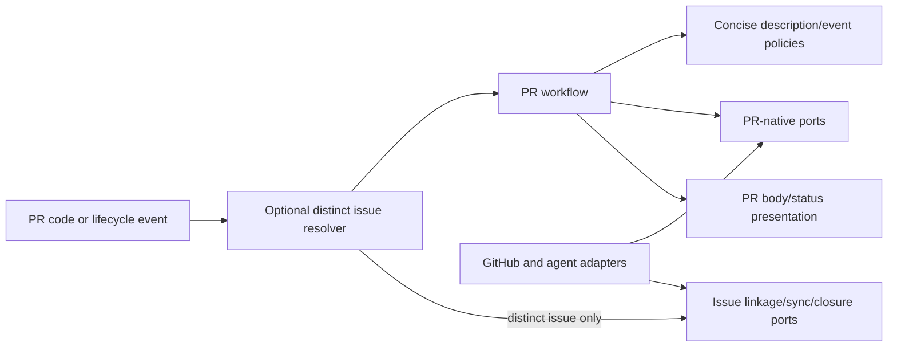

# Pull Request Lifecycle and Enrichment

- Status: Implemented
- Date: 2026-09-15
- Last verified: 2026-09-15 on `develop` plus PR UX implementation branch
- Owners: Copilot maintainers
- Scope: PR-to-issue/project linkage, assignments, metadata, size/progress, description ownership, review integration, and merge closure
- Related issues/PRs: managed issue lifecycle and Bugbot SDDs; live UX evidence from [PR #378](https://github.com/vypdev/copilot/pull/378) and [PR #379](https://github.com/vypdev/copilot/pull/379)
- Required review gates: product UX, architecture, testing, documentation, security/operations
- Open decisions blocking readiness: none

## 1. Executive summary

On an opened PR, Copilot enriches the PR even when no issue is linked. When the
branch identifies a separate issue, Copilot also links and synchronizes that
issue; it never falls back to treating the PR number as the issue number.
Generated descriptions prioritize reviewer decisions: a short outcome,
material changes, verified validation evidence, and conditional review notes.
Synchronize events refresh enabled generated content and review; metadata-only
edits are ignored so Copilot's own body update cannot retrigger the pipeline. A
merged PR closes only a distinct linked issue. Human-authored body content is
preserved only in `append`, `preserve`, or `disabled` mode—the existing default
is explicit full ownership with `replace`.

```text
opened/reopened -> resolve optional distinct issue -> enrich PR -> concise description -> review
synchronize -> concise description policy -> review
edited metadata -> no Copilot PR workflow
merged -> close distinct linked issue only
```

## 2. Problem, current behavior, and evidence

### 2.1 Problem

PR metadata becomes inconsistent when issue linkage, project status, reviewers,
labels, descriptions, and closure are maintained independently. AI-generated
descriptions can also overwrite human content unless ownership is explicit.

### 2.2 Current behavior

1. The route resolves PR state and optional branch-linked issue context. A
   missing or self-equal issue number is represented as unlinked.
2. On open/reopen, the route snapshots separate immutable step requests; the
   sequential workflow updates title, assigns assignee and reviewers, links
   projects/issue, syncs size/progress labels, and checks priority size through
   repository- and credential-bound ports.
3. `replace` or `append` automatically generates a sanitized, bounded
   description from the merge-base diff and optional distinct issue context.
4. `replace` owns the body; `append` upserts a marker-bounded Copilot section;
   `preserve` updates only on authorized `/copilot description`; `disabled` never updates.
5. Open/reopen/synchronize run read-only review when configured/authorized.
6. Metadata-only edited events do not start the supplied workflow. Merged PRs
   close only a distinct linked issue.
7. Runs expose event/action identity and review-state events use a distinct job
   name. A separate merge-group workflow avoids a skipped duplicate while its
   job intentionally shares the normal PR required-check name so branch
   protection resolves the same context in both event paths.
   Result publication, lifecycle labels, Job Summary, and optional Check Run
   expose state.

### 2.3 Evidence and contract classification

- Observed behavior: PR workflow/steps, description domain/workflow, PR
  repositories/composition, workflow, tests, documentation, and PR #378.
- Intentional contract: event-specific sequencing, semantic linkage, explicit
  body ownership modes, marker idempotency, creator/member guard, and merge closure.
- Known debt and limitations: ordinary PR issue inference depends on branch
  naming; assignment candidate quality depends on accessible membership;
  generated-description quality is probabilistic; live responsive UX evidence
  remains required for every shipped workflow change.
- Unknown rationale: `replace` is the current default, but historic selection evidence is unavailable.
- Proposed improvements: changing the recommended default requires migration and user study.
- Live iteration: PR #379's first run displayed a skipped merge-group job beside
  the active PR job under the same check name. Merge-group compatibility moved
  to a dedicated workflow so subsequent normal PR runs expose only the relevant
  analysis/review-state job while merge groups retain the required context.

## 3. Actors, surfaces, and terminology

| Actor | Goal | Entry point | Surface |
|---|---|---|---|
| PR author | present change | open/synchronize/edit | PR body/labels |
| Reviewer | review/merge | PR review | requests/checks/threads |
| Issue author | see delivery | linked PR merge | issue lifecycle |
| Copilot | enrich consistently | PR workflow | PR/project/comments/summary |

“Managed section” is content between stable Copilot markers. “Replace” is full
body ownership. “Enrichment” is metadata mutation that does not merge code.

## 4. Goals, non-goals, and fixed invariants

### 4.1 Goals

1. Opened PRs MUST converge to one linked/enriched state on replay.
2. Description ownership MUST be explicit and preserve content per mode.
3. Merge-driven issue closure MUST use resolved linkage, not title guessing alone.
4. Unlinked PRs MUST retain PR-native enrichment without provider calls against
   a synthetic issue number.
5. Generated descriptions MUST optimize for reviewer decisions, not execution
   inventories or template completeness.

### 4.2 Non-goals

1. This SDD does not define Bugbot finding truth or managed release PRs.
2. PR enrichment does not auto-merge normal contributor PRs.
3. It does not rewrite arbitrary project schemas.

### 4.3 Fixed product/safety invariants

1. Fork-origin pull requests MUST not receive privileged write/agent execution through unsafe workflows.
2. Agent-generated Markdown MUST be sanitized before body update.
3. Append mode MUST replace only the managed section.
4. Missing branches/context MUST skip safely rather than guess.
5. A PR number MUST NOT be used as that PR's linked issue number.
6. Copilot-authored body edits MUST NOT trigger another supplied PR workflow.

## 5. Current versus proposed product journey

| Stage | Manual/ambiguous risk | As-built contract | Effect |
|---|---|---|---|
| Linkage | PR number could become issue fallback | distinct branch issue or explicit unlinked state | no self-link/close |
| Metadata | independent labels/projects | ordered synchronization | consistency |
| Body | exhaustive template dump | concise evidence-based body in four ownership modes | faster review |
| Review | ambiguous run/check names and body-edit churn | event-specific run identity, distinct review-state check, merge-compatible required check | legible current evidence |
| Closure | manual issue close | merged linked PR | aligned lifecycle |

P2-E preserves the normal enrichment journey while hardening its authority and
failure behavior: event URLs can no longer select linkage targets, temporary
link mutations are compensated on every edge, and partial cleanup is explicit.

## 6. Functional behavior and state model

### 6.1 Happy path

1. Same-repository PR opens; its managed branch may contain a distinct issue identity.
2. Copilot enriches PR-native title, people, projects, description, and review;
   it adds issue linkage and issue-derived priority/size/progress synchronization
   only when a distinct issue exists.
3. Review result updates current status/lifecycle.
4. Synchronize reruns only refreshable content and review.
5. Merge closes the linked issue and exposes completion.

### 6.2 Alternative paths

- No linked issue still permits title/assignee/reviewer/project/review enrichment
  and a description inferred from PR metadata/diff, without an issue-provider
  call, issue-derived label synchronization, or false `Closes` line.
- A distinct linked issue with an empty description remains valid optional
  context; description generation continues from PR metadata and diff.
- A branch number equal to the PR number is unlinked rather than self-linked.
- `preserve` accepts only explicit authorized description refresh.
- `disabled` skips both automatic and explicit body generation.
- Non-member creators are skipped for AI description when `ai-members-only=true`.
- Missing optional review composition does not prevent deterministic enrichment.
- PR-to-issue linkage reads the current body for the exact bound PR, temporarily
  adds an owned closing reference and default base, waits through the injected
  observation boundary, then restores the exact original body and base.
- An interrupted owned marker is recovered before another link attempt. Foreign
  markers are body text, and event-provided URLs are never network targets.

### 6.3 State model

| State | Meaning | Next | Recovery |
|---|---|---|---|
| opened | enrichment pending | enriched/partial/failed | retry event |
| enriched | deterministic metadata applied | reviewing/synchronized | none |
| reviewing | analysis current/in flight | changes-requested/ready/unknown | fresh review |
| synchronized | new head processed | reviewing/ready | none |
| partial | some enrichment succeeded | enriched | retry idempotently |
| merged | accepted change | issue closed | reopen issue only for new work |
| closed-unmerged | no delivery | terminal/reopen | contributor |

Duplicate open/synchronize events MUST upsert project/labels/managed body rather
than duplicate content. A stale review is governed by the Bugbot freshness contract.

## 7. User-facing configuration

| Input | Default | Allowed/bounds | Persistence |
|---|---|---|---|
| `ai-pull-request-description-mode` | `replace` | replace/append/preserve/disabled | per run |
| `desired-assignees-count` | `1` | 0–10 | repository/workflow |
| `desired-reviewers-count` | `1` | 0–15 | repository/workflow |
| project IDs/PR columns | empty/In Progress | accessible IDs/names | repository/workflow |
| PR locale | `en-US` | supported locale | per run |
| size/priority/progress labels and thresholds | documented defaults | bounded numeric/label inputs | repository/workflow |
| `ai-members-only` | `false` | boolean | per run |

Recommended configuration uses a concise PR template, one reviewer, `replace`,
and same-repository workflow guards. Teams preserving human prose use `append`.
Marker syntax, sanitization, safe branch resolution, fork boundary, and merged
issue-closure semantics are not configurable. The 12,000-character hard body
limit, normal 4,000-character target, no-self-link rule, and omission of
metadata-only edited triggers are fixed product/safety boundaries.

## 8. Clean Architecture design

| Boundary | Owns | Must not own/import |
|---|---|---|
| Domain | description modes/markers/merge policy | GitHub/agent |
| Application | event-specific PR orchestration | provider DTOs |
| Ports | PR details/body/link/project/reviewer/issue close | Octokit types |
| Adapters | GitHub REST/GraphQL operations | event policy |
| Composition | ordered concrete steps | duplicated business rules |
| Presentation | validate structured agent fields; sanitize and render the fixed body hierarchy | provider mutations |



Architecture tests MUST keep use cases provider-neutral; workflow validators
MUST enforce same-repository/fork safety and direct event contracts.

P2-E makes this boundary executable: issue/PR leaves import no `Execution`
aggregate, application requests contain facts rather than credentials, and
composition exposes operation-only bound ports. Automatic and explicit PR
description generation share one discriminated request instead of dual methods.
The agent returns bounded semantic fields, not arbitrary body Markdown. A pure
application presentation policy validates cardinality, sentence count,
duplicates, optional notes, trusted linkage, unsafe Markdown controls, and the
hard body budget before rendering and before any provider write.

## 9. UI/UX and content contract

The default generated body is English and uses this information hierarchy:

```markdown
This change keeps unlinked pull requests usable and removes workflow noise caused
by Copilot updating its own description.

## What changed

- Continue PR-native enrichment when no distinct issue can be inferred.
- Prevent self-linking, self-closing references, and self-triggered body-edit runs.
- Make every event recognizable while preserving the normal PR required-check
  context for merge-group admission.

## Validation

- `pnpm run test:coverage`
- `pnpm run validate:workflows`

## Review notes

Metadata-only PR edits no longer normalize titles automatically; human edits are preserved.
```

The opening outcome and the first two sections are required. `Review notes` and a
distinct `Closes #…` reference appear only when supported. The normal target is
4,000 characters and the schema rejects more than 12,000. Empty template
sections, emoji, separators, generic checklists, file/use-case inventories,
repeated copy, and unverified test/no-impact claims are forbidden.

| Trigger | Visible behavior | Must not appear |
|---|---|---|
| open/reopen | enrichment plus concise body and review | self-link, generic recap comment |
| synchronize | refresh owned body and exact-head review | duplicate card or stale review |
| metadata edit | no supplied Copilot PR run | body-edit cascade or title rewrite |
| review submitted/edited/dismissed | review-state job with distinct identity | full analysis masquerading under same check name |
| merge queue | separate event-specific run plus lightweight required check | skipped duplicate on normal PRs or a renamed check that cannot satisfy branch protection |
| merged with distinct issue | close that issue | closure of the PR's own number |

The PR body follows configured ownership; append uses one stable section.
Result/status surfaces link the issue only when distinct, and expose project,
current commit/review, and next action where useful. English fallback,
descriptive links, logical headings, and text equivalents are required.
Untrusted body/title/template/agent output and mentions are sanitized.

Operational copy belongs in the Job Summary or the stable review Check/card,
not in a new conversation recap. The English default examples below show the
minimum useful state; configured repository locale changes the surrounding copy
without changing stable machine-readable event, state, finding, or error codes.

| State | When it appears | Representative message |
|---|---|---|
| pending | PR analysis has started and no decision exists yet | `Review in progress for 8f3c2d1. No action is required yet.` |
| action required | current actionable findings need an author response | `2 findings need attention. Fix or discuss them in the review threads, then push an update.` |
| blocked | required context or provider capability prevents safe progress | `PR description was not updated: the configured agent returned invalid structured content. The existing body was retained.` |
| partial | bounded coverage or cleanup retained named state | `Review covered 100 of 137 changed files. Results are incomplete; inspect the Job Summary before merging.` |
| complete | current head has a trustworthy clean result | `Review complete for 8f3c2d1. No actionable findings remain; maintainer review is next.` |

Each message states the affected object or head, the material outcome, and one
next action only when a person must act. It omits completed-step inventories,
generic `Feature Actions`/`Automatic Actions` headings, decorative media, and
success comments that merely repeat native GitHub metadata.

## 10. Failure, recovery, and cleanup

| Failure | Impact | Retained facts | Retry | Action | Cleanup |
|---|---|---|---|---|---|
| linkage absent | issue-specific automation unavailable | PR-native enrichment remains | optional | link/rename only if issue tracking is required | none |
| linkage propagation fails, compensation succeeds | link may be incomplete | exact original body/base restored | yes | rerun | none |
| linkage compensation is partial | PR may retain default base and/or temporary reference | result names each retained mutation | recovery-first rerun/manual | restore named state, rerun | never claim full restoration |
| metadata provider fail | partial enrichment | successful fields | yes | rerun | idempotent upsert |
| description failure | body retained per mode | metadata/review may exist | yes | fix agent/context | no blank overwrite |
| stale review/head | no stale findings | new head | automatic/retry | wait | discard stale result |
| merge closure fail | code merged, issue open | merge fact | yes | rerun/close issue | never undo merge |

## 11. Security, permissions, and privacy

Workflow event guards prevent privileged execution on foreign fork heads. Actor
and creator membership gates apply where configured. PR/issue/template content
and agent output are untrusted and bounded. The token and repository identity
stay bound in provider adapters;
agent processes do not receive it. Body markers cannot authorize commands or
escape their owned section. Project/member queries use least required access.

## 12. Observability and operational UX

Ordered results identify each enrichment step and failure. PR/issue/project
links, lifecycle/activity/waiting labels, Job Summary, and optional Check Run
provide user/operator evidence. A synchronize run correlates the current head.
Optional capability absence is a visible skip; provider failure is not hidden as
successful enrichment. Replays should not increase comment/body-section count.
The Actions run name includes event and action. Review-state observation has a
distinct check name, while normal PR analysis and merge-queue admission share
the exact required-check context deliberately in separate workflows; their run
names provide the human-visible distinction without a skipped duplicate.

## 13. Compatibility, migration, rollout, and rollback

Existing unmarked bodies are preserved in append/preserve/disabled and replaced
only in replace. Existing marked append sections are updated in place. Mode
changes are prospective: moving away from replace cannot recover overwritten
historic prose. Existing large templates remain valid inputs, but generated
output omits empty boilerplate. Repositories relying on title normalization from
`pull_request: edited` must move that policy to a separate workflow before
rollout; this deliberate compatibility change prevents body-edit recursion.
Rollback restores body through GitHub history/manual edit and may restore the
edited trigger; issue closure is reversible by reopening, while merged code is
not altered.

## 14. Testing strategy and numeric budget

| Area | Minimum cases | Risks |
|---|---:|---|
| Event/description/label policy | 26 | action matrix, optional/self linkage, modes, markers, bounds |
| Orchestration/idempotency | 20 | order, unlinked route, replay, partial, merge closure |
| Provider/agent adapters | 14 | link/project/reviewer/body/errors |
| Workflow/config contracts | 14 | event exclusion, identity, forks, permissions, inputs |
| PR UX/localization/sanitization | 14 | concise body/status/links/template/output |
| Integration/security/migration | 12 | PR→issue close, mode changes, stale head |
| **Total** | **100** | no double counting |

Global thresholds remain; description/marker policy SHOULD reach 100% branch
coverage. The P2-E context/orchestration path enforces 95% lines/statements and
90% branches/functions. Tests use fake provider/agent results and semantic Markdown assertions.
Manual evidence covers open/sync/merge on desktop/mobile, light/dark, screen
reader, all four body modes, fork-visible messaging, and an observed automatic
body mutation that produces no follow-up PR workflow.

## 15. Documentation and discoverability

| Audience | Artifact | Required content |
|---|---|---|
| Author | PR capabilities/AI description | lifecycle and body modes |
| Setup owner | PR configuration/workflow setup | events, inputs, permissions |
| Operator | Bugbot/failure docs | stale/partial/retry |
| Contributor | this SDD/architecture | sequence and boundaries |

## 16. Acceptance scenarios

1. An opened linked PR receives each deterministic enrichment exactly once.
2. Synchronize refreshes enabled description/review without duplicating markers.
3. Replace owns the full body; append only its section; preserve needs explicit
   command; disabled performs no description update.
4. A PR without a distinct linked issue still runs PR-native enrichment and
   never queries, links, labels, closes, or references its own PR number as an issue.
5. A disallowed actor/fork cannot invoke privileged writes or agent execution.
6. Partial description/provider failure retains completed facts and existing body.
7. A stale head publishes no stale review evidence.
8. Merging a linked PR closes its issue; closure failure never misstates merge.
9. Untrusted template/body/output cannot inject commands, secrets, or markers.
10. A forged event URL is ignored; exact bound repository identity and a
    positive safe PR number determine every linkage read/write.
11. Linkage compensation reports whether the temporary base, description
    reference, both, or neither remain, and replay never layers another marker.
12. A generated body is rendered from a strict structured response, starts with
    a one-to-three sentence outcome, has two to six
    material-change bullets and evidence-based validation, stays within 12,000
    characters, and omits empty/generic sections.
13. Copilot's own PR body update creates zero follow-up PR workflow runs.
14. Actions distinguish PR analysis, review-state observation, and merge-queue
    admission without requiring log inspection; review state uses a distinct
    check and a separate merge-queue workflow preserves the normal PR
    required-check context without adding a skipped duplicate.

## 17. Requirements traceability

| Requirement | Owner | Evidence | Documentation |
|---|---|---|---|
| event sequence | PR workflow | PR use-case tests | capabilities |
| optional distinct linkage | execution issue policy and PR workflows | unlinked/self-link setup, link, sync, and close tests | capabilities |
| body ownership | description domain/workflow | description tests | AI description |
| concise content | description prompt/schema/template | prompt/schema semantic tests and live PR body | AI description |
| enrichment ports | PR/project/reviewer adapters | repository tests | configuration |
| review integration | Bugbot contracts | Bugbot E2E | Bugbot docs |
| run/check identity and no edit churn | workflow template/validator | distributed workflow contract tests and live PR runs | features/Bugbot docs |
| fork safety | workflow guards | workflow tests | workflow setup/security |
| safe/recoverable linkage | exact-target adapter and compensation workflow | URL, identifier, marker, replay, and restoration-edge tests | capabilities/troubleshooting |
| immutable authority boundary | PR contexts and lifecycle port binding | projection, mutation-isolation, binding, and zero-leaf AST tests | architecture/dependency rules |

## 18. Maintenance sequence

1. Update event/body policies and exhaustive tests.
2. Update PR workflow/use cases and replay/partial tests.
3. Update adapters/composition/workflows and contract tests.
4. Update PR presentation/docs/catalog and migration guidance.
5. Run all gates and capture human PR UX evidence.

## 19. Definition of Done

- [ ] The 100-case budget, coverage, architecture, and workflow gates pass.
- [ ] Event order, replay, partial state, stale head, and merge closure are proven.
- [ ] All body modes preserve their documented ownership and migration behavior.
- [ ] UI states, accessibility, localization, sanitization, and noise pass.
- [ ] An unlinked PR and Copilot-authored description edit pass live UX verification without self-linkage or a follow-up PR workflow.
- [ ] PR docs, Bugbot links, and catalog are current.
- [ ] Human four-mode and fork UX evidence is captured.

## 20. References and decisions

- Primary sources: catalogued PR code, workflow, tests, and docs.
- Related SDDs: issue lifecycle; Bugbot analysis/reconciliation; comment
  automation; issue and pull-request context hardening.
- Decision: body ownership is explicit and marker-bounded outside replace mode.
- Rejected: hidden fallback modes and unsafe fork execution.
- Follow-up: changing the recommended description default needs product evidence.
