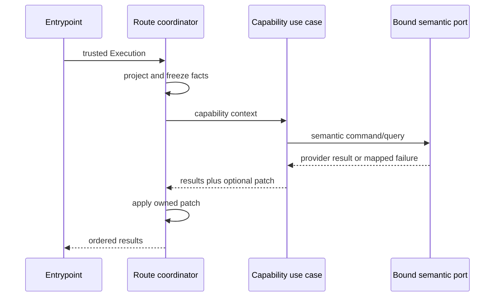
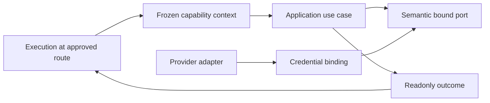

# Push and Single-Action Capability Context Hardening

- Status: Implemented
- Date: 2026-09-13
- Catalog capability ID: `execution-lifecycle`
- Last verified: 2026-09-13 on `develop` and PR #364
- Owners: Copilot maintainers
- Scope: complete the P2-F clean cut so push, single-action, comment-command,
  issue, and pull-request leaves receive only immutable capability facts and
  repository-bound authority
- Related issues/PRs: PR #364
- Required review gates: product UX, architecture, testing, documentation,
  security/operations, GitHub Actions and package build
- Open decisions blocking readiness: none

## 1. Executive summary

P2-F removes the shared mutable `Execution` aggregate from every leaf below the
approved route coordinators. Push and single-action routes project one fresh,
deeply readonly context per capability. Composition binds repository identity
and the GitHub credential into semantic ports; application inputs cannot inspect,
forward, log, or persist the token. State changes such as recommendation
fingerprints, branch preparation, and activity labels return explicit outcomes
that the owning route applies.

The cut is intentionally atomic. There is no overload, `Pick<Execution>`, union
input, compatibility factory, fallback reader, feature flag, or deprecated
export for a removed shape.

```text
trusted event -> approved route -> frozen capability facts -> bound semantic port
                                     |                         |
                                     +---- explicit outcome <--+
                                               |
                                      route-owned state apply
```

## 2. Problem, current behavior, and evidence

### 2.1 Problem

Before this cut, the checked-in AST baseline contained 47 production consumers
of `Execution`; 34 were outside the final boundary allowlist. They coupled unrelated
capabilities to mutable route state and, in several paths, make the repository
credential ordinary application data. A leaf can therefore observe unrelated
future fields, retain mutable model objects, or mutate route state without an
explicit output contract.

### 2.2 Current behavior

Before P2-F:

1. `CommitUseCase` and `SingleActionUseCase` received `Execution`, then passed it to
   push notification, size, progress, release/tag, setup, inactivity, comment,
   branch-sync, and deployment leaves.
2. Progress, recommendation, setup, release, tag, inactivity, branch-sync, and
   commit workflows call provider ports with owner/repository/token values.
3. Recommendation deduplication writes `currentConfiguration` from a result
   policy; commit notification writes `commitPrefixBuilderParams`; agent
   activity writes label collections from a lifecycle leaf.
4. `issue_workflow.ts` and `pull_request_workflow.ts` still import the aggregate,
   leaving a P2-E boundary leak that would prevent the final audit.
5. The deployment leaf already declares `DeploymentOrchestrationContext`, but
   the single-action dispatcher types it as `Execution`.

### 2.3 Evidence

- Architecture inventory: `src/architecture/execution_import_baseline.json` and
  `src/architecture/__tests__/execution_import_ratchet.test.ts`.
- Route coordinators: `commit_use_case.ts`, `single_action_use_case.ts`,
  `issue_use_case.ts`, `pull_request_use_case.ts`, and the two comment routes.
- Credential-bearing leaves: initial setup, progress, release/tag, issue-comment,
  inactivity, branch-sync, and commit-size workflows.
- Hidden mutation sites: `recommend_steps_result_policy.ts`,
  `notify_new_commit_on_issue_workflow.ts`, and
  `synchronize_agent_activity_use_case.ts`.
- Graphify query on 2026-09-13 confirmed these paths converge on the shared
  `Execution` community below the approved coordinators.

### 2.4 Retrospective classification

Not applicable. This is a prospective clean-cut specification. Historical
rationale for the broad aggregate signatures is not established by repository
evidence and is not treated as an intentional contract.

## 3. Actors, surfaces, and terminology

| Actor | Goal | Entry point | Visible surfaces |
|---|---|---|---|
| Repository contributor | receive correct push and agent results | push or issue/PR command | comments, labels, PR state, checks |
| Repository operator | run one bounded maintenance or release action | workflow dispatch or local CLI | Job Summary, terminal, release/tag, issue comments |
| Maintainer | change one capability without aggregate-wide fallout | code contribution | CI architecture and coverage reports |

A **route coordinator** is one of the catalogued allowlist files that owns the
aggregate. A **capability context** is a copied, deeply readonly record of facts.
A **bound port** owns repository identity and credentials in infrastructure and
accepts only semantic operation arguments. An **outcome** is a readonly result
plus the smallest state patch the route may apply.

## 4. Goals, non-goals, and fixed invariants

### 4.1 Goals

1. Remove all 34 non-allowlisted production `Execution` consumers in one cut.
2. Preserve dispatch order, no-op behavior, results, and user-visible content.
3. Make credentials absent from all P2-F capability contexts and requests.
4. Replace every leaf aggregate mutation with an explicit route-owned outcome.
5. Enforce the cut with an AST boundary check and changed-path coverage gate.

### 4.2 Non-goals

1. P2-F does not redesign release/deployment product policy or branch-sync
   conflict limits.
2. It does not change supported single-action names or add configuration.
3. The exact final allowlist classification and alias-bypass fixture are P2-G;
   P2-F must nevertheless reach no more than that allowlist.

### 4.3 Fixed product and safety invariants

1. Contexts contain facts only: no token, repository/client, callbacks, mutable
   aggregate subobjects, or side-effecting getter.
2. Credentials and provider mutation scope are captured once in composition and
   never returned by a port. Bounded repository identity may remain a display or
   authorization fact, but it cannot retarget a bound port.
3. Agent authorization precedes every agent-backed capability exactly as today.
4. Branch sync revalidates remote heads after agent work and before push.
5. Inactivity closure rereads authoritative state immediately before mutation.
6. A route applies a returned patch only for the outcome that owns it.
7. Removed signatures have no compatibility path because the product has no
   external users or persisted execution payloads.

## 5. Current versus proposed product journey

| Stage | Current | Proposed | User/operator effect |
|---|---|---|---|
| Dispatch | aggregate passed to selected leaf | route selects context and leaf | unchanged action selection |
| Provider call | leaf supplies token and coordinates | bound port supplies authority | same provider effect, smaller trust boundary |
| State update | leaf mutates route aggregate | leaf returns readonly patch | deterministic ownership and recovery |
| Failure | leaf may have broad diagnostic reach | semantic error from bounded operation | unchanged safe message, lower leak risk |
| Maintenance | 34 leaves coupled to aggregate | zero non-allowlisted consumers | smaller change radius |



Text equivalent: the entrypoint supplies the internal aggregate to an approved
route; that route freezes only the selected facts; a use case invokes a port
whose credential is already bound; the use case returns results and, when
needed, a state patch that only the route applies.

## 6. Functional behavior and state model

### 6.1 Capability contracts

| Capability | Immutable facts | Bound authority | Outcome |
|---|---|---|---|
| release/tag/publish | operation snapshot, requested version | tag/release publication | `Result[]` |
| setup | selected config, credentials-to-provision, labels/types, workflow files | identity, labels/types, remote resources, tag | `Result[]` |
| progress | issue, branch candidates, agent config, reasoning flag | description, branch/PR queries, labels/progress | `Result[]` |
| recommendation | issue/event facts, previous state, agent config | description and agent query | results plus recommendation patch |
| inactivity | labels and bounded threshold | issue query/closure and clock | one scan result |
| issue-comment publication | validated create/append/replace request | comment query/mutation | one result |
| branch observation | pushed branch, deletion flag, trusted bot | dependencies, compare, notifications | ordered dependency results |
| branch synchronization | conversation, agent config, verify commands, repository display name | target/workspace/author/Git execution | one terminal result |
| push notification | commit facts, theme, prefix, reopen policy | issue open/comment | results |
| push size | branch, thresholds, label/project facts | compare, labels, PR query, project size | result |
| activity marker | target, copied labels, configured marker | current labels and label replacement | next labels for route apply |
| issue/PR workflow | route decisions plus already projected P2-E steps | previously bound P2-E ports | results plus owned patches |

### 6.2 Dispatch and outcome flow

1. Invalid single actions still return no results without constructing a leaf.
2. Think and Bugbot keep their existing narrow context projections.
3. Every other action selects exactly one context/use-case pair.
4. A missing optional surface capability is a no-op, as before.
5. A thrown error becomes the existing semantic single-action failure result.
6. Recommendation deduplication may return a fingerprint-only patch with no
   comment result; the issue or single-action route applies it.
7. Activity cleanup rereads labels, returns the exact post-cleanup list, and the
   main route applies it to the appropriate in-memory label collection.

### 6.3 Edge and partial states

| State | Entry condition | Observable behavior | Recovery owner |
|---|---|---|---|
| invalid action | unknown/missing required target | no dispatch, existing warning | caller configuration |
| unauthorized agent action | members-only and actor denied | no agent or workspace mutation | repository owner |
| stale deployment continuation | operation/version/phase mismatch | semantic stale failure, no release/tag mutation | launcher workflow |
| zero progress | agent reports 0 | explicit failed progress result, no label mutation | contributor retry |
| unchanged recommendation | same description or recommendation | no duplicate comment; fingerprint patch retained | automatic |
| inactivity race | candidate changed before close | skipped after reread | automatic next scan |
| branch-sync race | remote head changed before push | abort and actionable failure; no push | contributor retry |
| partial setup | earlier resources succeeded, later one failed | ordered steps plus semantic errors | operator rerun; operations are idempotent |

Duplicate dispatches retain each underlying capability's current idempotency
rules. There is no new persisted state and no new retry loop.

## 7. User-facing configuration

No new configuration is introduced. Existing action names, inactivity threshold,
agent configuration, verification commands, setup selections, and deployment
facts are copied after normal validation. Deep-copy behavior, credential binding,
dispatch order, mutation ownership, conflict-file limit, and the import boundary
are fixed and cannot be configured. Removed or unknown shapes fail compilation;
there is no migration alias.

## 8. Clean Architecture design

### 8.1 Responsibilities and dependency direction

| Layer/boundary | Owns | Must not own/import |
|---|---|---|
| Domain/pure policy | validation, deduplication, conflict eligibility, label replacement | `Execution`, provider SDKs |
| Application contexts/use cases | frozen facts, orchestration, semantic outcomes/ports | credentials, concrete repositories, mutable aggregate |
| Data/adapters | provider calls and DTO mapping | route state mutation |
| Infrastructure/composition | repository/credential binding and concrete wiring | dispatch/product decisions |
| Approved routes | aggregate projection, authorization, dispatch, patch application | provider-specific calls |
| Presentation | existing result/comment/summary rendering | capability mutation |



Text equivalent: the route projects facts; application policy consumes the
facts and semantic ports; infrastructure binds adapters to authority; explicit
outcomes return to the route for state application.

### 8.2 Contracts and trust boundaries

- Context projectors accept structural source contracts so their modules do not
  import or alias `Execution`.
- Arrays and nested configuration are copied and frozen. Later aggregate
  mutation cannot alter an in-flight context.
- Raw setup credentials selected for provisioning are sensitive operation facts,
  but the GitHub authentication token is never a context field. Credential
  values are neither logged nor included in results.
- Agent prompts receive bounded repository display facts, never an SCM token.
- Bound ports expose no method that can change repository or credential scope.
- Deployment owns one private invocation-state copy because its phase machine
  must advance and persist revisions. That copy is isolated from the route
  aggregate; durable changes still cross only the fenced deployment state port.

### 8.3 Executable architecture constraints

1. The existing AST ratchet must decrease from exactly 47 consumers and report
   no non-allowlisted P2-F leaf.
2. A P2-F architecture test enumerates every owned path and rejects `Execution`,
   credential-shaped context fields, and aggregate-shaped generics.
3. Context projection tests mutate all source collections after projection and
   assert frozen copies remain unchanged.
4. The P2-F coverage validator requires every owned executable module to appear
   and enforces 95% lines/statements and 90% branches/functions in aggregate.
5. Cycle, dependency, specification, documentation, workflow, build, and package
   checks remain mandatory.

## 9. UI/UX and content contract

The cut intentionally preserves existing GitHub and CLI content. Comments,
labels, release/tag effects, progress summaries, branch-sync notices, semantic
errors, and completion behavior must remain byte-equivalent except where a test
already accepts variable provider identifiers.

Representative states:

```markdown
<!-- stale branch-sync notification -->
## Branch synchronization required

`feature/42-context-cut` is 3 commits behind `develop`.

Run `/copilot sync branch` to update it. No agent is used unless the merge has
eligible conflicts.
```

```markdown
## Recommended implementation steps

1. Introduce the bounded capability contract.
2. Bind provider authority in composition.
3. Verify the route outcome.
```

Pending/no-action, action-required, failure-before-mutation, partial setup, and
completed forms remain owned by the existing capability presenters. No new
comment is emitted solely for architectural telemetry. Existing locale fallback,
Markdown sanitization, logical headings, descriptive links, and one-stateful-
comment budgets remain unchanged.

## 10. Failure, recovery, and cleanup

| Failure/partial state | User impact | Retained facts | Automatic retry | Required action | Cleanup |
|---|---|---|---|---|---|
| bound provider query fails | selected capability stops | earlier durable effects | existing workflow policy only | use semantic action text | no credential in error |
| release/tag stale | no publication | durable deployment operation | no | relaunch from operation issue | none |
| setup step fails after prior success | partial provisioning named in steps | successful resources | safe rerun | correct permission/value and rerun | idempotent ensure/upsert |
| agent returns invalid/empty output | no state/comment mutation | previous state | no | fix agent config or retry | workspace guard aborts where applicable |
| branch changes during sync | no push | remote branches unchanged by this run | no | retry from current heads | abort prepared merge |
| activity cleanup fails | route result remains authoritative | server labels may retain marker temporarily | next route may reconcile | inspect label permission | best effort, logged semantically |

## 11. Security, permissions, and privacy

1. Authorization remains before agent execution; context projection is not an
   authorization decision.
2. Repository tokens are closure-private infrastructure data and absent from
   contexts, prompts, results, logs, and serialized state.
3. User comments retain existing sanitization before prompt construction.
4. Branch-sync sensitive-path and maximum-conflict limits remain fail closed.
5. Setup secret values reach only the bound provisioning command and are never
   echoed in step text or errors.
6. Provider identifiers and Markdown use existing validation/sanitization rules.

## 12. Observability and operational UX

- Existing task IDs, semantic error codes, result payloads, and step order remain
  stable so Job Summary and Codecov/CI evidence stay comparable.
- Architecture validation reports the before/after import count and exact
  offending path on regression.
- Tests use deterministic fakes; no live provider, real credential, or real wait.
- P2-F adds no product comment, check, or log solely for internal topology.
- Graphify and RepoWise audits provide maintainer evidence after the source cut.

## 13. Compatibility, migration, rollout, and rollback

There are no external users, persisted executions, or compatibility obligations.
The final signatures replace the old ones directly. Compilation failures are the
intended migration behavior for repository-internal callers. Rollback is a full
revert of P2-F; it must not add overloads, aliases, fallback readers, feature
flags, or dual state writers. Irreversible provider effects retain their existing
idempotency keys and recovery behavior.

## 14. Testing strategy and numeric budget

P2-F owns at least **20 distinct cases**, exceeding the parent floor of 8 because
the risk inventory spans credentials, state ownership, races, and nine dispatch
families. The implemented P2-F ledger contains **66 dedicated cases**: 36
context projection/policy cases, 14 authority-binding cases, and 16 direct
single-action dispatch/outcome cases, plus strengthened route/coordinator tests
and five architecture ratchet cases in the shared suite.

| Area | Minimum cases | Behaviors/risks covered |
|---|---:|---|
| Projection and pure policy | 5 | copy/freeze, no token, release continuation, recommendation patch, conflict eligibility |
| Push and single-action orchestration | 5 | dispatch parity, invalid action, authorization, ordered push, thrown failure |
| Provider binding and setup | 4 | repository scope capture, setup token validation, secret non-disclosure, publication commands |
| Races and partial state | 3 | inactivity reread, branch head fence/abort, partial setup |
| Issue/PR/comment integration | 2 | recommendation patch ownership, user-request/branch-sync contexts |
| Architecture/security | 1 | zero owned leaf aggregate imports and credential-shaped contexts |
| **Total** | **20** | No double counting |

Repository thresholds remain 90% lines/statements, 88% functions, and 82%
branches. P2-F owned executable modules require at least 95% lines/statements and
90% branches/functions in aggregate; new pure projectors and policies require
100% enumerated behavior branches where practical. Existing characterization,
workflow, action, setup, branch-sync, release, and inactivity suites are parity
evidence but do not reduce this floor. Fakes use fixed data and no live network,
credential, clock wait, or snapshot-only assertion. Manual evidence is review of
one progress result, one branch-sync notice, one partial setup summary, and the
architecture report.

## 15. Documentation and discoverability

| Audience | Artifact/page | Required content | Validation/navigation |
|---|---|---|---|
| Contributor | `docs/development/architecture.mdx` | route projection, bound authority, outcome ownership | docs build/link validation |
| Contributor | `docs/dependency-rules.md` | P2-F forbidden dependencies and examples | documentation contract |
| Operator | existing setup/branch-sync/release pages | behavior parity; no new configuration | existing doc tests |
| Maintainer | this SDD and specification catalog | decisions, tests, evidence, acceptance | specification validator |

No public user journey changes; existing pages must not document aggregate or
credential-shaped application requests.

## 16. Acceptance scenarios

1. Given a valid push, notify, size, progress, and review execute in the current
   order using separate immutable inputs.
2. Given an unauthorized actor with members-only enabled, no push or
   single-action agent is called.
3. Given each valid single action, exactly its matching narrow context is
   dispatched; invalid or unavailable actions remain no-ops.
4. Given an unchanged recommendation, no duplicate comment is produced and only
   the owning route applies the updated description fingerprint.
5. Given a candidate issue changes during inactivity scanning, the final reread
   prevents closure.
6. Given either branch head changes after merge preparation, branch sync aborts
   without pushing.
7. Given setup credentials and a repository token, the token is visible only to
   the bound infrastructure closure and no secret appears in output.
8. Given source collections mutate after context projection, the leaf continues
   with the original frozen values.
9. Given a provider or agent failure, the route returns the existing semantic
   result without leaking provider data or mutating unrelated state.
10. Given the production source tree, the AST inventory contains no P2-F leaf
    consumer and never exceeds the final allowlist.

## 17. Requirements traceability

| Requirement | Owner | Test/evidence | Documentation |
|---|---|---|---|
| immutable facts | capability context projectors | projection mutation/credential tests | architecture |
| bound authority | P2-F composition binding | binding scope tests | dependency rules |
| explicit mutations | recommendation/activity/issue outcomes | route ownership tests | architecture |
| dispatch parity | push/single-action coordinators | focused route and integration suites | existing action docs |
| race safety | inactivity and branch-sync workflows | reread/head-fence tests | existing operations docs |
| final topology readiness | AST ratchet and P2-F validator | exact inventory plus Graphify/RepoWise | SDD/catalog |

## 18. Implementation sequence

1. Add final immutable contracts, semantic bound ports, and failing projection/
   architecture tests.
2. Bind repository authority in composition and migrate release, setup, progress,
   recommendation, inactivity, comment publication, and branch observation.
3. Migrate branch sync and user-request workspace mutation to bounded inputs.
4. Migrate remaining push steps and delete the unused aggregate commit-prefix
   mutation path.
5. Make single-action/push/comment/issue/PR routes project contexts and apply
   explicit outcomes; correct deployment typing.
6. Update docs, catalog, generated bundles, coverage gate, and import baseline.
7. Run focused and complete validation, `graphify update .`, push, and observe all
   GitHub review/check surfaces.

## 19. Definition of Done

- [x] All P2-F leaves have zero direct or indirect `Execution` dependency.
- [x] No P2-F context contains repository credentials or mutable route-owned model objects.
- [x] Every former leaf mutation is an explicit outcome applied by a route.
- [x] At least 20 distinct budget cases are implemented; the dedicated ledger contains 66.
- [x] Push, single-action, comment-command, issue, and PR dispatch parity is covered.
- [x] Setup, inactivity, branch-sync, release/tag, and provider failure edges are covered.
- [x] Public docs, catalog, generated bundles, and architecture baseline agree.
- [x] Full tests, coverage, typecheck, lint, specification/documentation/workflow,
      build/package validation, and `graphify update .` pass locally; the clean-tree
      architecture metric gate runs immediately after commit.
- [x] PR checks, Codecov, Bugbot, RepoWise, and automated comments are resolved;
      CI and RepoWise passed, Codecov recorded 95.12% patch coverage against an
      80% repository target with project coverage increasing by 0.10 points,
      and Bugbot recorded zero findings before the requested recheck.
- [x] No readiness blocker, compatibility path, TODO, waiver, or unrelated local
      file is included.

## 20. References and decisions

- Parent program: `architecture-quality-and-scalability-hardening.md`.
- Governing contract: `execution-error-and-context-hardening.md`.
- Previous cut: `issue-and-pull-request-context-hardening.md`.
- Decision: one context per capability, not one broad “single-action context”.
- Decision: bind repository/credential authority in infrastructure, not in
  application payloads.
- Decision: deployment receives an isolated invocation-state copy and bound
  authority; no route token or route-owned configuration reference crosses the
  single-action boundary.
- Decision: return state patches and apply them at approved routes; reject
  callbacks or mutable references in contexts.
- Rejected: type aliases, `Pick<Execution>`, compatibility overloads, generic
  service locators, credential fields, dual writers, and feature-flag rollout.
- Follow-up: P2-G performs the exact allowlist and alias-bypass closure audit; it
  may remove additional approved entries but cannot add one.
