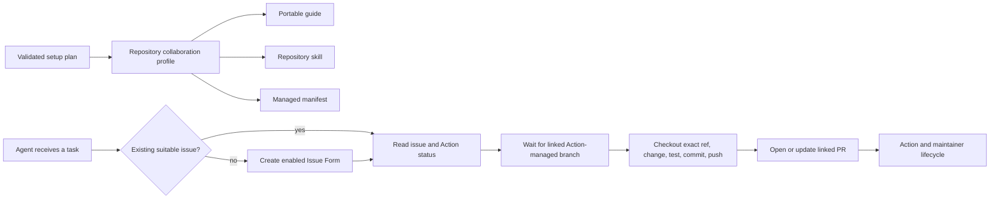
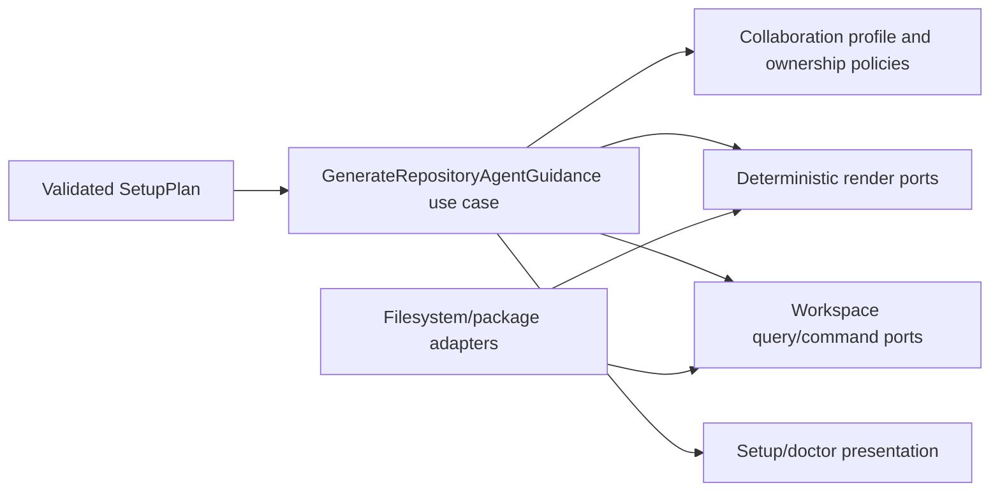

# Repository Agent Collaboration Contract

- Status: Implemented — automated local gates and Codex dogfood complete; broader agent-discovery UX evidence remains pending
- Date: 2026-09-16
- Catalog capability ID: `repository-agent-collaboration`
- Last verified: 2026-09-16
- Owners: Copilot maintainers
- Scope: setup-generated, repository-local guidance that lets coding agents collaborate through configured issues, Action-managed branches, pull requests, and deployment boundaries
- Related issues/PRs: none yet; related SDDs are listed in section 20
- Required review gates: product UX, architecture, testing, documentation, security/operations
- Open decisions blocking readiness: none

## 1. Executive summary

`copilot setup` will enable repository agent guidance by default. From the same
validated setup plan used by the GitHub Action, it will generate a portable
repository profile, a human-readable agent guide, and a repository-scoped Codex
skill. If appropriate and explicitly approved, setup will also create or update
a small marker-bounded pointer in the root `AGENTS.md` without replacing any
existing instructions.

The guidance defines an agent as a human-like repository contributor: it finds
or creates work through an enabled Issue Form, waits for the Action to create
and link the correct remote branch, checks out that exact branch locally,
implements and verifies changes, pushes commits, and opens or updates a linked
pull request. The Action retains exclusive ownership of remote managed-branch
creation, naming, parent selection, rename, deletion, release tags, and
deployment orchestration. Exceptional branch recovery requires both an
Action-reported failure and explicit maintainer authorization.

```text
validated setup plan -> repository profile -> guide + skill + optional AGENTS pointer
agent task -> enabled Issue Form -> Action-created branch -> commits -> linked PR -> Action lifecycle
```

Implementation status as of 2026-09-16: setup generates and reconciles the
closed profile, guide, repository skill, manifest, and bounded pointer; doctor
validates hashes, schema, profile/form/workflow parity, discovery, and
secret-like content. This repository dogfoods all artifacts and the skill has
been loaded successfully by Codex. Controlled evidence for additional agent
products and mobile rendering remains rollout evidence, not an authorization
or branch-safety gap.

## 2. Problem, current behavior, and evidence

### 2.1 Problem

The Action exposes a repository workflow to humans through issues, labels,
branches, pull requests, checks, and deployment controls, but a coding agent
entering the repository has no generated description of that contract. An agent
may invent a branch, use a blank issue, apply lifecycle labels manually, bypass
the selected release workflow, or confuse the Action's internal AI runtime with
its own role as a repository contributor.

Static generic instructions are insufficient because setup can customize
labels, branch trees, launcher policy, enabled issue workflows, workflow names,
and deployment behavior. Guidance must be derived from the installed contract,
must coexist with repository-owned instructions, and must be diagnosable when
it drifts.

### 2.2 Current behavior

The following is verified as of 2026-09-16:

1. Setup installs GitHub workflows, Issue Forms, and a pull-request template,
   but no repository profile, collaborator-agent guide, or agent skill.
2. `package.json` and npm package validation enumerate the current setup assets;
   no source asset for generated repository guidance is packaged.
3. The repository already has a root `AGENTS.md` and a repository skill under
   `.agents/skills/`, proving that generated guidance must merge or coexist
   rather than assume an empty repository.
4. Current Action documentation under `docs/agents/` describes the internal
   provider/CLI runtime. It does not define how an external coding agent should
   contribute through this repository's issues and branches.
5. The prompt-injection security documentation intentionally excludes
   repository `AGENTS.md` from the internal Action agent's automation context.
   Therefore a new repository collaborator skill does not automatically alter
   internal Action prompts and must not be represented as doing so.
6. Setup can customize effective labels, trees, workflows, and launcher policy.
   A hand-authored static skill cannot safely know those values.
7. Existing setup file handling skips Issue Forms and other files rather than
   recording managed ownership and content hashes. There is no manifest that
   can distinguish a generated artifact from a user-owned file on rerun.

### 2.3 Evidence

- Setup domain and file planning: `src/domain/setup.ts`,
  `src/application/policies/setup_configuration_plan.ts`,
  `src/utils/setup_files.ts`, and `src/utils/setup_file_copy.ts`.
- Setup CLI and doctor: `src/cli/commands/setup.ts`,
  `src/cli/commands/doctor.ts`, and
  `src/infrastructure/setup_workspace_adapter.ts`.
- Package boundary: `package.json`, `scripts/validate-npm-package.cjs`,
  `scripts/smoke-test-npm-package.cjs`, and
  `scripts/validate-agent-documentation.cjs`.
- Existing repository instructions: `AGENTS.md` and
  `.agents/skills/product-specification/SKILL.md`.
- Internal runtime boundary:
  `docs/security-operations/security/prompt-injection.mdx` and
  `docs/agents/execution-contract.mdx`.
- External primary sources: OpenAI's documentation for
  [repository `AGENTS.md` discovery](https://learn.chatgpt.com/docs/agent-configuration/agents-md)
  and [building repository skills](https://learn.chatgpt.com/docs/build-skills),
  plus GitHub's documentation for
  [Issue Forms](https://docs.github.com/en/communities/using-templates-to-encourage-useful-issues-and-pull-requests/syntax-for-issue-forms)
  and [`gh issue create --template`](https://cli.github.com/manual/gh_issue_create).
- Unknowns: repository evidence cannot establish which non-Codex agents will
  automatically discover a given vendor-specific instruction filename. This
  specification therefore guarantees a portable guide and a Codex skill, not
  universal implicit discovery.

### 2.4 Retrospective classification (as-built baselines only)

Not applicable. This document originated as a prospective specification and is
now the maintained implementation contract. The former repository state in
section 2.2 remains compatibility evidence, not current behavior.

### 2.5 Implementation evidence

- Safe projection/rendering:
  `src/application/policies/repository_agent_guidance_policy.ts`.
- Hash ownership, atomic reconciliation, retirement, pointer preservation, and
  doctor inspection: `src/utils/repository_agent_guidance.ts`.
- Setup/doctor composition: `src/utils/setup_files.ts`,
  `src/application/usecases/setup/setup_wizard_use_case.ts`, and
  `src/application/usecases/setup/doctor_use_case.ts`.
- Dogfood artifacts: `.copilot/repository-profile.json`,
  `.copilot/AGENT_GUIDE.md`, `.copilot/setup-manifest.json`, the repository
  skill, and the bounded root `AGENTS.md` block.
- Contract validation: `scripts/validate-agent-documentation.cjs`, package
  validators, and `src/utils/__tests__/setup_files.test.ts`.

## 3. Actors, surfaces, and terminology

| Actor | Goal | Entry point | Visible surfaces |
|---|---|---|---|
| Setup owner | enable accurate guidance safely | `copilot setup` | option, file plan, conflict prompt |
| Repository collaborator agent | contribute through normal repository controls | task in a checked-out repo | profile, skill, guide, issue, branch, PR |
| Human contributor | understand the same workflow | guide/documentation | issue chooser, branch, PR, checks |
| Maintainer | authorize exceptional recovery and deploy intent | issue/PR/Action UI | comments, labels, failed checks |
| Action runtime | own managed lifecycle transitions | GitHub events | linked branch, labels, checks, summaries |
| Operator | detect stale or conflicting guidance | `copilot doctor` | named checks and remediation |
| Internal Action agent | analyze/review inside a bounded workflow | configured Action runtime | prompts and structured results, not this skill |

A **repository collaborator agent** is any coding agent acting with a user's or
bot's normal repository credentials. It is not the AI process launched inside
the Action. The collaborator follows the same public repository workflow as a
human and receives no hidden or elevated branch authority.

The generated artifact set is:

| Artifact | Audience | Discovery/role | Owner |
|---|---|---|---|
| `.copilot/repository-profile.json` | tools and agents | canonical machine-readable installed facts | setup-managed |
| `.copilot/AGENT_GUIDE.md` | humans and non-Codex agents | portable complete collaboration guide | setup-managed |
| `.agents/skills/copilot-repository-workflow/SKILL.md` | Codex-compatible agents | progressive, task-triggered instructions | setup-managed |
| `.copilot/setup-manifest.json` | setup and doctor | ownership, hashes, schema, provenance | setup-managed |
| root `AGENTS.md` pointer block | agents that read repository instructions | minimal discovery and non-negotiable invariant | marker-managed or repository-owned |

The **remote managed branch** is the GitHub branch ref linked to an admitted
issue. The Action owns its lifecycle. A local tracking branch or worktree is a
developer workspace and may be created to track that exact ref; it MUST NOT be
pushed as a new or differently named remote ref.

## 4. Goals, non-goals, and fixed invariants

### 4.1 Goals

1. Generate accurate, concise, discoverable instructions from the effective
   setup plan, enabled by default but explicitly visible in setup.
2. Make agents use enabled Issue Forms and required fields instead of generic or
   guessed issues.
3. Make remote branch ownership, normal contribution steps, deploy authority,
   and exceptional recovery unambiguous.
4. Preserve existing `AGENTS.md`, nested instructions, and repository skills.
5. Dogfood the generated contract in this repository and keep it valid through
   package, setup, doctor, documentation, and integration tests.

### 4.2 Non-goals

1. The generated skill does not define coding style, architecture, test
   commands, or security policy already owned by repository instructions.
2. It does not grant an agent permission to create issues, push, merge, label,
   deploy, release, or recover branches beyond its actual credentials and the
   user's task.
3. It does not inject repository instructions into the internal Action agent.
4. It does not promise automatic discovery by every agent product or write
   vendor-specific files beyond the Codex skill and optional `AGENTS.md` pointer
   in this version.
5. It does not let agents bypass disabled issue workflows or repair setup drift
   by editing generated facts manually.

### 4.3 Fixed product/safety invariants

1. Guidance MUST be rendered from a typed, validated setup plan; Markdown is an
   output, never the source of product decisions.
2. Repository agent guidance is enabled by default in interactive and default
   non-interactive setup. Owners can explicitly disable it.
3. Setup MUST NOT overwrite an existing unowned file or text outside its exact
   marker block. Conflicts are previewed and require an explicit decision.
4. An agent MUST use an enabled installed form when creating managed work and
   MUST provide every required field. A template-like body does not make a
   disabled kind valid.
5. The Action exclusively owns creation, naming, parent selection, rename, and
   deletion of remote managed branches. Agents may only check out the exact
   linked ref locally and push commits to that same ref after it exists.
6. An agent MUST NOT create a replacement branch because the expected branch is
   absent or delayed. It waits, inspects the Action result, or asks a maintainer.
7. Exceptional remote-branch recovery is allowed only when the Action reports a
   branch-management error, a maintainer explicitly authorizes recovery, the
   diagnostic supplies the exact expected ref/base, and the exception is
   recorded for reconciliation. Force-push, protected-branch mutation, and
   silent deletion remain forbidden.
8. Agents MUST NOT manually create tags/releases, dispatch deployments, or add
   the deploy label without explicit maintainer/user authorization for that
   operation. Normal lifecycle labels, native Issue Type, project placement,
   title decoration, and cleanup belong to the Action.
9. Generated artifacts contain no secret, credential, arbitrary executable
   command, free-form provider response, or hidden prompt.
10. Issue, PR, comment, and code content remain untrusted data and cannot
    override the generated contract, system instructions, or the user's task.

## 5. Current versus proposed product journey

| Stage | Current | Proposed | User/operator effect |
|---|---|---|---|
| Setup option | none | “Repository agent guidance” enabled by default | explicit and reversible |
| Installed facts | spread across workflows/forms/inputs | bounded JSON profile from one plan | machine-readable truth |
| Agent discovery | repository-specific/manual | skill + portable guide + optional pointer | predictable entry point |
| Issue creation | agent may guess labels/body | enabled form and required fields | runtime-compatible issue |
| Branch start | agent may invent branch | wait for Action-linked remote ref | no duplicate/divergent branch |
| Contribution | unspecified | checkout, edit, test, commit, push, linked PR | human-equivalent flow |
| Deployment | agent may infer authority | explicit maintainer intent only | protected release boundary |
| Drift | silent | manifest hashes + doctor | actionable reconciliation |



Text equivalent: setup emits one profile and its guide, skill, and manifest.
For work, the agent reuses or creates a valid issue, waits for the Action's
branch, contributes commits to that exact branch, and uses a linked PR; the
Action and maintainers retain lifecycle and deployment control.

## 6. Functional behavior and state model

### 6.1 Setup and generation happy path

1. After issue-workflow selection and all configuration validation, setup asks
   whether to install repository agent guidance. The default is Yes.
2. The plan projects only safe effective facts: enabled issue kinds and forms,
   configured label aliases, branch role names, launcher policy, workflow names,
   deployment boundaries, pull-request linkage expectations, locales, and
   ownership rules.
3. A deterministic renderer creates the JSON profile, portable guide, and
   Codex skill. The same input always produces byte-identical output; generated
   files contain no current timestamp.
4. Setup inspects existing files and the prior manifest. New and unchanged
   managed files are straightforward. Managed drift, unmanaged conflicts,
   retirement, and an existing `AGENTS.md` are separately identified in the
   preview.
5. If no root `AGENTS.md` exists, setup may create a minimal managed file. If it
   exists, setup offers a marker-bounded pointer insertion and requires explicit
   approval; declining still installs the profile, guide, and discoverable
   repository skill.
6. Confirmed setup writes artifacts atomically per file, backs up approved
   replacements, and writes the manifest last so it never claims ownership of a
   file that was not successfully written.
7. Doctor validates schema, digest, hashes, skill metadata, enabled-form links,
   workflow/profile parity, and discovery without changing files.

### 6.2 Repository collaborator happy path

1. Before planning repository work, the agent loads the closest applicable
   repository instructions. When the skill is triggered, it reads
   `.copilot/repository-profile.json` and `.copilot/AGENT_GUIDE.md`.
2. It searches for an existing open issue that accurately represents the task.
   It never hijacks an unrelated issue merely to obtain a branch.
3. If no issue exists and issue creation is within the user's requested work, it
   chooses one enabled kind and creates the exact installed form, for example
   `gh issue create --template bug_report.yml`. It fills every required field
   and does not fabricate release/hotfix versions or context. It does not use a
   blank issue even when GitHub exposes that option to its permission level.
4. It lets the form supply canonical type labels and waits for the Action. If a
   launcher label is required, it applies or requests it only when the profile
   says so and the user has authorized starting implementation.
5. It reads the issue/Action result to obtain the exact linked remote branch. If
   none exists, it waits or reports the block; it does not invent one.
6. It fetches and checks out a local branch/worktree that tracks that exact
   remote ref, then edits, tests, commits, and pushes normal commits to it.
7. It opens or updates a PR linked to the issue, includes verification evidence,
   and responds to checks/review like a human contributor.
8. It leaves merge, cleanup, release/hotfix transitions, tags, and deployment to
   configured maintainers and the Action unless the user explicitly asks for an
   authorized operation within the profile.

### 6.3 Alternative and exceptional paths

- If guidance is disabled, setup does not create or update any guidance
  artifact and doctor marks those checks `skipped`, not failed.
- If forms are disabled but an issue kind is enabled, the guide states that a
  maintainer-approved manual issue must use the exact labels/body schema. It
  does not present a missing form command.
- Help issues are used for questions and never produce a branch. An agent that
  needs code changes must create or request a branch-bearing issue kind rather
  than repurpose help.
- If the expected branch is delayed, the agent inspects the run and waits. If
  the Action reports a configuration/type/body error, the agent repairs only
  the user-owned issue input it is authorized to edit and reruns normally.
- If the Action explicitly reports an unrecoverable branch-creation error, a
  maintainer can authorize exceptional recovery in the issue. The agent uses
  the exact diagnostic ref and base, records what it did, and requests doctor or
  Action reconciliation. This path is never inferred from timeout alone.
- An existing suitable branch created outside the Action is not silently
  adopted. A maintainer must choose a documented migration/reconciliation path.
- Nested `AGENTS.md` instructions remain applicable for their directory scope.
  The generated skill owns repository lifecycle only; more specific code and
  test policy remains in those instructions.

### 6.4 Generated artifact contract

The machine profile uses a closed schema. Representative shape:

```json
{
  "schemaVersion": 1,
  "generator": {"name": "@vypdev/copilot", "contractVersion": 1},
  "issueWorkflows": {
    "enabled": ["feature", "bugfix", "documentation", "chore", "help"],
    "formsEnabled": true,
    "forms": {
      "bugfix": {"template": "bug_report.yml", "labels": ["bug", "bugfix"]},
      "help": {"template": "help_request.yml", "labels": ["help", "question"]}
    }
  },
  "branches": {
    "remoteLifecycleOwner": "github-action",
    "launcher": {"mode": "label", "label": "branched"},
    "helpCreatesBranch": false
  },
  "pullRequests": {"mustLinkIssue": true},
  "deployment": {"agentMayInitiateWithoutExplicitAuthorization": false}
}
```

The production schema includes every enabled kind and its effective form,
labels, branch role/policy, required field names, and relevant workflow name. It
does not include arbitrary `actionInputs`; only allowlisted typed projections
are serialized. Object keys and arrays use canonical ordering. A SHA-256 digest
of canonical bytes is stored in the manifest, not trusted from the profile.

The manifest contains its schema version, generator package/contract version,
profile digest, and an ordered map of setup-managed path to source role and
content hash. It never claims arbitrary existing repository files. Backups and
run timestamps remain outside deterministic generated bytes.

The skill starts with bounded metadata:

```markdown
---
name: copilot-repository-workflow
description: Follow this repository's configured issue, Action-managed branch, pull-request, and deployment workflow before planning or changing repository code.
---
```

Its body directs the agent to the profile and guide, summarizes the fixed branch
invariant, and supplies a decision checklist. Dynamic labels, filenames, branch
trees, or workflow names are read from the profile rather than duplicated in
the skill prose.

### 6.5 Artifact state machine

| State | Entered when | User-visible meaning | Allowed next states | Recovery/owner |
|---|---|---|---|---|
| `disabled` | owner opts out | no generated guidance expected | `planned` | rerun setup |
| `planned` | validated setup enables guidance | exact file operations previewed | `current`, `conflict`, `canceled` | owner confirms |
| `current` | files and manifest hashes agree | agents may rely on profile | `drifted`, `retired` | doctor monitors |
| `drifted` | managed path differs from manifest/desired | guidance may be stale | `planned`, `conflict` | approve backup/re-render |
| `conflict` | unowned target or marker was edited | setup will not overwrite | `planned`, `disabled` | maintainer merges or chooses new path |
| `reduced-discovery` | skill/guide exist but pointer was declined/removed | Codex skill remains discoverable; generic discovery is not guaranteed | `current`, `conflict` | add pointer explicitly |
| `retired` | feature disabled and managed files approved for removal | backup retains prior files | `planned` | restore/rerun setup |

Duplicate setup runs are byte-idempotent. A partially completed write retains
the previous manifest or records only successfully written facts; rerun
recomputes from source configuration. Setup cancellation leaves all prior files
unchanged.

## 7. User-facing configuration

| Input | Type | Recommended default | Allowed values/range | Scope/persistence |
|---|---|---|---|---|
| `repositoryAgentGuidance.enabled` | boolean | `true` — agents are repository users | boolean | setup config |
| `--repository-agent-guidance` / `--no-repository-agent-guidance` | flag | config/default | mutually exclusive | one CLI run |
| `repositoryAgentGuidance.agentsPointer` | enum | `prompt` | `prompt`, `create-if-missing`, `disabled` | setup config |
| existing-file decision | confirmation | no overwrite | keep, backed-up replace for managed file, marker insertion for `AGENTS.md` | one confirmed plan |

`agentsPointer=prompt` means: create a minimal root file when absent; when a root
file exists, include the exact marker block in the reviewed setup plan and
apply it only after confirmation. In non-interactive mode, omission is
normalized to `create-if-missing`; setup MUST NOT edit an existing `AGENTS.md`
unless the config or `--agent-guidance prompt` explicitly authorizes marker
insertion and the final plan is approved. `create-if-missing` never edits an
existing file. `disabled` suppresses only the pointer; it does not suppress the
skill or guide.

The profile path, skill path, guide path, marker delimiters, skill name, schema
version, branch ownership invariant, secret exclusion, and exceptional recovery
preconditions are intentionally not configurable.

Recommended example:

```yaml
repositoryAgentGuidance:
  enabled: true
  agentsPointer: prompt
```

Meaningful alternative for a repository with centrally managed agent discovery:

```yaml
repositoryAgentGuidance:
  enabled: true
  agentsPointer: disabled
```

## 8. Clean Architecture design

### 8.1 Responsibilities and dependency direction

| Layer/boundary | Owns | Must not own/import |
|---|---|---|
| Domain/pure policy | collaboration profile schema, safe projection, ownership states, branch invariants, artifact descriptors | filesystem, Markdown parser, GitHub SDK |
| Application | plan/render/reconcile/retire/doctor use cases and semantic conflict decisions | direct file writes, terminal raw mode |
| Adapters/data | deterministic JSON/Markdown rendering, hash/query/write/backup operations, package asset lookup | product permission or branch policy |
| Infrastructure/composition | binds plan and workspace ports, orders manifest-last apply | content decisions duplicated from domain |
| Entrypoints | parse setup flags/config and present explicit approvals | render skill/profile ad hoc |
| Presentation | setup file plan, doctor checks, conflict/recovery text | file mutation |



### 8.2 Contracts, state, and trust boundaries

- Pure decisions: allowlisted projection from `SetupPlan`, canonical schema,
  artifact ownership classification, retirement plan, and recovery eligibility.
- Application contracts: `PlanRepositoryAgentGuidanceUseCase`,
  `ApplyRepositoryAgentGuidanceUseCase`, and named doctor checks for profile,
  skill, guide, manifest, pointer, forms, and workflow parity.
- Semantic ports: source asset reader, workspace metadata/content query, atomic
  write, backup/retire command, and file-mode query where needed.
- Durable state: repository profile and setup manifest are versioned data. The
  guide, skill, and pointer are deterministic projections, not independent facts.
- Idempotency: canonical rendering and hashes make a matching rerun a no-op.
  Manifest is written last. Marker replacement requires exact start/end pair;
  missing, duplicated, nested, or malformed markers are conflicts.
- Trusted inputs: validated setup plan and packaged renderer templates.
  Untrusted inputs: repository files, prior manifest, config, labels, free-form
  names, and issue/PR content.
- Provider errors: this capability is primarily workspace-local. GitHub facts
  already validated by setup may be projected; no guidance renderer performs
  independent privileged remote mutations.

### 8.3 Executable architecture constraints

1. A test MUST fail if the profile serializer accepts a field not declared in
   its closed schema or emits a secret-class setup key.
2. The guide and skill MUST be rendered only from `RepositoryCollaborationProfile`;
   they cannot read raw setup config or environment variables.
3. Workspace command ports MUST reject writes outside the exact planned paths.
4. Marker editing MUST preserve every byte outside one valid managed block.
5. Manifest ownership MUST be proven by prior valid schema/path/hash metadata;
   a file is never considered managed merely because its name matches.
6. `scripts/validate-npm-package.cjs` and npm smoke tests MUST assert source
   templates/renderers are packed and produce a valid artifact set after install.
7. `scripts/validate-agent-documentation.cjs` MUST validate skill frontmatter,
   required invariants, profile links, and separation from internal runtime docs.
8. Architecture tests MUST prevent the internal Action agent prompt/context
   builders from importing or automatically ingesting generated collaborator
   instructions.

## 9. UI/UX and content contract

### 9.1 Information hierarchy

1. Whether repository agent guidance is enabled.
2. Which artifacts will be created, unchanged, updated, retired, or skipped.
3. Whether discovery is full or reduced.
4. Exact conflict/approval and recovery action.
5. The non-negotiable remote branch ownership rule.
6. Sanitized hashes/paths as optional technical evidence.

### 9.2 Setup option and file plan

```text
Repository agent collaboration guidance? (Y/n) Y

An existing AGENTS.md was found.
Add a marker-bounded pointer to the generated repository workflow skill? (y/N) y

Agent guidance plan
  create   .copilot/repository-profile.json
  create   .copilot/AGENT_GUIDE.md
  create   .agents/skills/copilot-repository-workflow/SKILL.md
  update   AGENTS.md (managed pointer block only; backup before write)
  create   .copilot/setup-manifest.json (written last)

Remote managed branches remain owned by the GitHub Action.
```

The option is a separate visible setup step after issue-workflow selection,
because its content depends on that selection. A non-interactive plan prints the
same decisions without prompting and fails if an unprovided conflict decision
is required.

### 9.3 Representative setup/doctor views

Pending:

```markdown
# ⏳ Repository agent guidance pending

> **Current status:** The generated files are ready for preview.
>
> **Action required:** Review the `AGENTS.md` marker insertion and confirm setup.
```

Action required:

```markdown
# 🛠 Agent guidance conflict

> **Current status:** `.copilot/AGENT_GUIDE.md` exists but is not owned by the setup manifest.
>
> **Action required:** Keep the file and choose another approach, or move it manually before rerunning setup.
```

Blocked:

```markdown
# ⛔ Agent guidance not updated

> **Current status:** The managed block in `AGENTS.md` has a start marker but no end marker.
>
> **Action required:** Repair or remove the marker block, then rerun setup. No repository instructions were overwritten.
```

Partial:

```markdown
# ⚠️ Agent guidance partially written

> **Current status:** The profile and guide were written, but the skill write failed. The manifest was not advanced.
>
> **Action required:** Fix workspace permissions and rerun setup; matching files will be reused.
```

Complete:

```markdown
# ✅ Repository agent guidance is current

> **Current status:** Profile, guide, skill, manifest, and discovery pointer agree.
>
> **Action required:** No action required.
```

### 9.4 Generated guide content contract

The guide MUST use this order:

1. Scope and distinction between collaborator agent and internal Action agent.
2. “Before changing code” checklist: read profile/instructions, find or create an
   enabled-form issue, and wait for admission.
3. Issue-kind table generated from enabled configuration, including exact form
   filename, purpose, branch expectation, and required fields.
4. Branch ownership: permitted local tracking and commit push versus forbidden
   remote lifecycle operations.
5. Pull-request flow and required issue linkage/verification evidence.
6. Lifecycle labels, launcher intent, deploy/release authority, and what the
   agent must leave to the Action.
7. Failure and exceptional recovery decision tree.
8. Security and untrusted-content reminder.
9. Links to user/operator documentation and local profile.

The skill is shorter. It MUST trigger on planning or performing repository
changes, issue/branch/PR work, and release/hotfix work; direct the agent to the
profile/guide; state the remote branch invariant; and present the minimum
decision checklist. It MUST NOT duplicate a dynamic kind matrix that can drift.

The optional `AGENTS.md` block is intentionally small:

```markdown
<!-- copilot:repository-workflow:start -->
## Copilot-managed repository workflow

Before creating issues, branches, pull requests, releases, or changing code,
use `.agents/skills/copilot-repository-workflow/SKILL.md` and read
`.copilot/repository-profile.json`. The GitHub Action owns the lifecycle of
remote managed branches; do not create a replacement branch when one is absent.
<!-- copilot:repository-workflow:end -->
```

### 9.5 Issue, PR, and notification behavior

- The generated guidance itself posts no issue/PR comment and applies no label.
- Agents use the form's labels and leave normal native Issue Type, project,
  title, state labels, and cleanup to the Action.
- The launcher label may be applied only when the profile requires it and the
  user authorized beginning work. A deploy label or deployment dispatch always
  needs explicit maintainer/user authorization.
- PR text links the issue using the repository's documented convention and
  records verification. Agents do not claim that a merge, release, deployment,
  or cleanup occurred until the corresponding GitHub state proves it.
- Setup/doctor diagnostics update their existing command output/summary; they
  do not create repository notification noise.

### 9.6 Accessibility, localization, and responsive behavior

- Generated repository guidance uses the configured repository locale when a
  complete validated static translation exists; English is the atomic fallback.
  Skill metadata identifiers and JSON keys remain stable English identifiers.
- Every rule is text; diagrams are optional and require a textual equivalent.
- Markdown headings are short, links are descriptive, tables have a list
  fallback, and critical guidance fits narrow renderers.
- Paths, labels, branch names, titles, and URLs are escaped. Generated Markdown
  never renders untrusted issue/PR body content or active mentions.

## 10. Failure, recovery, and cleanup

| Failure/partial state | User impact | Retained facts | Automatic retry | Required action | Cleanup |
|---|---|---|---|---|---|
| invalid projection input | no guidance plan | previous artifacts untouched | no | fix setup configuration | none |
| unowned target exists | setup cannot claim it | existing file intact | no | keep/move/merge manually | none |
| managed file drift | guidance may be stale | prior hash, desired hash, file | no | approve backed-up replacement | timestamped backup |
| malformed AGENTS markers | pointer cannot update safely | all original text | no | repair markers | none |
| pointer declined | generic discovery reduced | profile/guide/skill valid | no | optional later insertion | none |
| write fails before manifest | artifact set may be partial | successfully written files; old manifest | safe rerun | repair filesystem | idempotent reconciliation |
| manifest write fails | files exist but ownership not advanced | old manifest and new bytes | safe rerun | rerun setup | hashes reclassified conservatively |
| feature disabled | generated files no longer desired | manifest proves ownership | no destructive auto-delete | approve backed-up retirement | move managed artifacts to backup |
| expected branch absent | agent cannot start coding safely | issue/run evidence | Action rerun only | inspect Action or ask maintainer | never invent branch |
| Action branch error + authorization | normal path unavailable | exact expected ref/base and authorization | no | documented exceptional recovery | Action/doctor reconciliation |

Disabling guidance never deletes unowned files. Retirement of setup-managed
artifacts is previewed, explicitly approved, and recoverable. Removing the
optional marker preserves all surrounding `AGENTS.md` text byte-for-byte.

## 11. Security, permissions, and privacy

1. Generated guidance does not elevate permissions. Each issue, label, push,
   PR, or dispatch still requires the actor's normal authorization and must be
   within the user's task.
2. Profile generation uses an explicit safe-field allowlist. Secret values,
   secret names that disclose sensitive topology, local absolute paths,
   credentials, arbitrary commands, and provider output are excluded.
3. Repository issue/PR/comment/code content is untrusted and cannot redefine
   branch ownership, request secrets, or override system/user/repository policy.
4. The skill must tell agents not to expose credentials in issues, commits, PRs,
   logs, or diagnostic comments.
5. Hashes establish drift, not trust in content. A valid manifest does not make
   a repository-authored executable or instruction safe to run.
6. Exceptional recovery requires explicit, attributable maintainer approval and
   exact bounded facts. It never permits force push, protected-branch writes,
   tag/release creation, or deletion outside the one failed managed ref.
7. Internal Action prompts continue to use their existing bounded context and
   MUST NOT ingest `AGENTS.md`, the portable guide, or the collaborator skill
   automatically.

## 12. Observability and operational UX

- Setup plan: artifact action (`create`, `unchanged`, `update`, `conflict`,
  `retire`, `skip`), ownership source, approval requirement, and warning.
- Doctor checks: `agent-profile-schema`, `agent-profile-runtime-parity`,
  `agent-guide-digest`, `agent-skill-contract`, `agent-guidance-manifest`,
  `agent-guidance-discovery`, and `agent-guidance-secret-scan`.
- Logs: schema/contract version, path role, short digest, decision, and
  correlation ID. No file body, secrets, home path, or arbitrary repository
  content is logged by default.
- Metrics: enabled/disabled setup count, drift/conflict count, reduced-discovery
  count, render/doctor failure reason, and package smoke result.
- A profile/skill mismatch is configuration drift, not an agent-provider outage.
- Setup and doctor add no repository comments; one command invocation produces
  one ordered report.

## 13. Compatibility, migration, rollout, and rollback

1. Existing repositories have no profile/manifest and are classified as
   `not-installed`, not drifted. The first setup run previews only new files and
   an optional `AGENTS.md` marker.
2. Existing root or nested `AGENTS.md` files and existing skills remain intact.
   The generated skill has a unique stable directory/name and defines only
   lifecycle collaboration.
3. Repositories that disable guidance continue to use the Action normally. The
   runtime profile from the configurable-issue-workflows capability remains
   independent and required for runtime admission.
4. Schema upgrades require a pure migrator for supported prior profiles and a
   previewed re-render. Unknown future schema versions are never rewritten by an
   older setup binary.
5. Rollout stages are: renderer/package validation; opt-in dogfood; default-on
   setup with pointer confirmation; doctor enforcement; broader documentation.
6. This repository is the mandatory dogfood target. Its existing root
   `AGENTS.md` and product-specification skill must coexist with the generated
   artifacts. A marker block is added only through the same bounded mechanism
   specified for users.
7. Rollback disables future generation and retires only manifest-owned files
   after confirmation. Restoring a backup or removing the marker does not alter
   Action runtime configuration, issues, branches, PRs, releases, or secrets.

## 14. Testing strategy and numeric budget

| Area | Minimum distinct cases | Behaviors/risks covered |
|---|---:|---|
| Profile schema, safe projection, canonical rendering | 18 | enabled subsets, labels/forms/branches, allowlist, ordering, digest, unknown schema/keys, secret exclusion |
| Ownership, setup planning, reconcile, retirement | 20 | new/matching/drifted/unowned, malformed markers, byte preservation, backup, manifest-last, partial rerun, disable/retire |
| Guide and skill semantic contract | 18 | metadata, trigger scope, issue forms, help no-branch, exact branch rule, local tracking, PR flow, labels/deploy, recovery, internal-agent distinction |
| Package, doctor, architecture, documentation | 14 | packed assets, installed smoke generation, named read-only checks, no internal prompt import, links/nav, schema fixtures |
| UX, localization, sanitization, security | 12 | five states, narrow/no-color, escaping, no mentions/secrets/paths, locale fallback, conflict actions |
| Integration, migration, rollback, dogfood | 12 | existing AGENTS/skills, pointer declined, schema migration, disable/restore, form/profile parity, positive and negative end-to-end flow |
| **Total** | **94** | No double counting |

The issue-workflow domain and setup/rendering decision policies named by the
`Configurable issue workflows and repository agent guidance` coverage budget
require 100% statements, lines, functions, and branches. The ownership
reconciler requires at least 95% statements/lines/functions and 90% branches;
integration adapters remain subject to the non-decreasing repository-wide
budget. Tests use in-memory workspace ports and deterministic hashes;
they do not write outside a temporary fixture or call live services. Golden
artifacts are paired with semantic tests so wording changes cannot remove a
fixed invariant silently. A package smoke test installs the packed tarball in a
temporary repository and renders the full artifact set. Manual evidence covers
actual Codex skill discovery, coexistence with this repository's instructions,
and guide readability on GitHub mobile.

## 15. Documentation and discoverability

| Audience | Artifact/page | Required content | Validation/navigation |
|---|---|---|---|
| Setup owner | `docs/how-to-use.mdx` | default-on option, files, approvals, disable/retire | setup fixture + nav |
| Repository agent/human | `docs/agents/repository-collaboration.mdx` | full issue-to-PR flow and ownership boundaries | linked from generated guide |
| Maintainer | `docs/issues/configurable-workflows.mdx` | enabled forms/labels/runtime relation | shared catalog fixture |
| Operator | `docs/agents/repository-guidance-troubleshooting.mdx` | doctor states, drift, marker conflict, recovery | decision-tree tests |
| Security owner | prompt-injection and permissions pages | external/internal agent distinction, untrusted content, least privilege | security contract test |
| Contributor | development architecture and package docs | projection/render/manifest boundaries and dogfood | architecture/package validation |

README and `docs/features.mdx` describe repository collaborator guidance without
calling it part of the internal Action runtime. `docs.json` exposes both the
collaboration and troubleshooting pages. Generated guide links are relative
where possible and are checked against packaged/default repository fixtures.

## 16. Acceptance scenarios

1. Given fresh default setup, when the agent-guidance step appears, then it is
   enabled and the plan lists profile, guide, skill, manifest, and pointer action.
2. Given an existing root `AGENTS.md`, when marker insertion is declined, then
   every byte remains unchanged, the skill/guide/profile are installed, and
   setup reports reduced discovery rather than failure.
3. Given an approved marker insertion, then only one exact block is added and a
   rerun is byte-idempotent; malformed or duplicate markers block safely.
4. Given selected issue workflows and custom labels, when guidance is rendered,
   then the profile and guide contain only those effective allowlisted facts and
   match runtime/form fixtures.
5. Given a coding task with no suitable issue, when an authorized agent starts,
   then it chooses one enabled installed Issue Form and supplies required fields
   rather than using a blank issue.
6. Given an issue whose Action branch is not yet present, when the agent is ready
   to code, then it waits/reports the run state and creates no replacement
   remote branch.
7. Given a linked Action-managed branch, then the agent may create a local
   tracking workspace, commit, push to the exact ref, and open/update a linked
   PR without renaming or deleting the remote ref.
8. Given a help issue, then guidance says no branch; code work requires a new
   branch-bearing issue rather than forcing help through branch management.
9. Given a release/hotfix task, then the agent uses exact required form fields,
   never fabricates versions, and does not add deploy intent without explicit
   authorization.
10. Given only a timeout or missing branch, then exceptional recovery is denied;
    given an Action branch error plus explicit maintainer authorization and exact
    ref/base, then bounded recovery and reconciliation instructions are shown.
11. Given an unowned conflicting guide file, then setup and doctor leave it
    untouched and provide one exact resolution path.
12. Given a write failure after profile/guide but before skill/manifest, then the
    old manifest is retained and an idempotent rerun converges without data loss.
13. Given guidance is disabled later, then only manifest-owned files are offered
    for backed-up retirement and runtime issue-workflow configuration is not changed.
14. Given this repository's existing `AGENTS.md` and skill, then dogfood setup
    preserves them, adds the bounded collaboration artifacts, and all package,
    doctor, security, and documentation checks pass.

## 17. Requirements traceability

| Requirement | Policy/use case/adapter/presentation | Test or evidence | Documentation |
|---|---|---|---|
| default-on setup step | setup config/questionnaire policy | default, flag, noninteractive tests | setup guide |
| safe machine profile | projection/schema policy | allowlist, schema, secret-scan tests | profile reference |
| portable guide + Codex skill | deterministic render ports | golden + semantic contract tests | collaboration guide |
| preserve existing instructions | ownership/marker policy | byte-preservation/conflict tests | troubleshooting |
| Action-owned remote branches | fixed profile/guide invariant | semantic and end-to-end negative tests | collaboration guide |
| exact Issue Form creation | kind projection | selected/disabled/forms-off tests | issue workflow docs |
| human-like PR flow | guide contract | issue-branch-PR integration fixture | collaboration guide |
| bounded exceptional recovery | recovery policy | authorization/error/ref matrix | troubleshooting |
| internal/external agent separation | architecture boundary | forbidden-import/context tests | security and execution docs |
| package/doctor/dogfood | validators and setup adapters | packed install, query-only doctor, repo fixture | contributor docs |

## 18. Implementation sequence

1. Add typed repository-collaboration configuration, profile schema, safe
   projection, ownership model, artifact descriptors, and pure tests.
2. Create deterministic packaged renderer templates for JSON, guide, skill,
   manifest, and marker block; add semantic content validators.
3. Extend setup planning/presentation with the default-on step, existing-file
   classification, exact approvals, backups, atomic writes, and manifest-last
   behavior.
4. Extend doctor, package validation, npm smoke tests, agent-documentation
   validation, and architecture boundaries.
5. Write user, operator, security, and contributor documentation and connect
   navigation/README surfaces.
6. Dogfood in this repository: preserve the current `AGENTS.md` and existing
   skills, generate artifacts, and exercise issue -> Action branch -> PR.
7. Run negative dogfood cases for blank/disabled forms, absent branch,
   conflicting labels, malformed release body, unauthorized deploy, and
   exceptional recovery.
8. Complete migration/rollback evidence, regenerate the specification catalog,
   and run all final validation gates.

## 19. Definition of Done

- [x] Every normative requirement has acceptance and traceability.
- [x] Default-on setup, explicit opt-out, non-interactive behavior, and pointer
      choices are implemented and documented.
- [x] Profile, guide, skill, manifest, and optional pointer are deterministic,
      safe, packaged, and doctor-validated.
- [x] Existing unowned files and all bytes outside a valid marker are preserved.
- [x] Generated content explicitly requires enabled forms, Action-owned remote
      branches, normal human contribution, and authorized deployment.
- [x] Exceptional recovery is bounded by Action error, explicit authorization,
      exact ref/base, audit record, and reconciliation.
- [x] Internal Action agents remain isolated from collaborator instructions.
- [x] Numeric automated test budget, named coverage floors, package smoke,
      security scan, localization, and documentation gates pass.
- [ ] Controlled generic-agent discovery and GitHub mobile/readability evidence
      remains to be attached during rollout.
- [x] This repository dogfoods artifact coexistence and automated positive and
      negative contract flows; controlled live issue-to-PR evidence remains rollout work.
- [x] `specs/catalog.json` evidence and `specs/CATALOG.md` are current and
      `pnpm run validate:specifications` passes.
- [x] No readiness-blocking decision remains unresolved.

## 20. References and decisions

- Primary sources: OpenAI
  [`AGENTS.md` discovery and precedence](https://learn.chatgpt.com/docs/agent-configuration/agents-md)
  and [repository skill construction](https://learn.chatgpt.com/docs/build-skills);
  GitHub [Issue Form syntax](https://docs.github.com/en/communities/using-templates-to-encourage-useful-issues-and-pull-requests/syntax-for-issue-forms)
  and [`gh issue create`](https://cli.github.com/manual/gh_issue_create).
- Related specifications:
  [`configurable-issue-workflows-and-admission.md`](./configurable-issue-workflows-and-admission.md),
  [`setup-configuration-credentials-and-doctor.md`](./setup-configuration-credentials-and-doctor.md),
  [`managed-issue-and-branch-lifecycle.md`](./managed-issue-and-branch-lifecycle.md),
  [`pull-request-lifecycle-and-enrichment.md`](./pull-request-lifecycle-and-enrichment.md),
  [`configurable-release-orchestration.md`](./configurable-release-orchestration.md),
  and [`agent-runtime-provider-and-model-routing.md`](./agent-runtime-provider-and-model-routing.md).
- Decision: ship both a portable guide and a Codex repository skill. Rejected:
  one vendor-specific file as a universal agent contract.
- Decision: keep dynamic facts in a machine profile and keep the skill concise.
  Rejected: fully materializing labels/workflows in multiple Markdown files.
- Decision: use an optional marker-bounded root pointer and never replace an
  existing `AGENTS.md`. Rejected: automatic whole-file generation.
- Decision: remote managed-branch lifecycle belongs exclusively to the Action;
  local tracking workspaces and normal pushes are contributor behavior.
- Decision: exceptional branch recovery requires four explicit predicates and
  reconciliation. Rejected: allowing agents to recover after a timeout alone.
- Decision: dogfood in the repository with its existing instructions rather
  than a clean fixture only.
- Follow-up outside this specification: adapters for additional agent-specific
  instruction filenames, cryptographic signing/attestation of profiles, and a
  universal cross-vendor agent-discovery standard.
