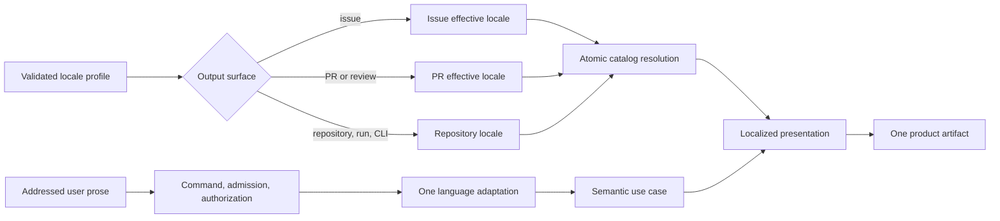
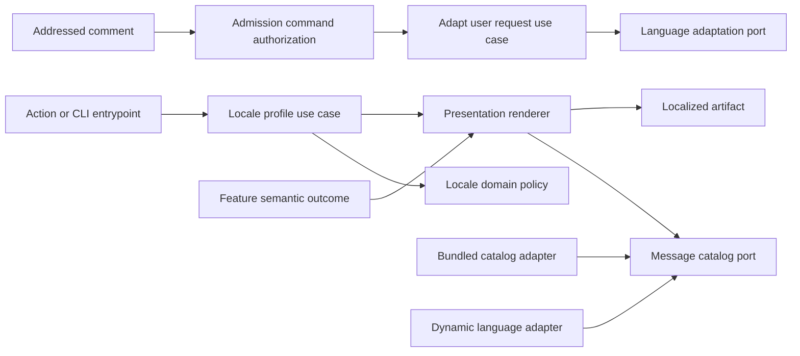

# Repository Locale and End-to-End Localization

- Status: In implementation
- Date: 2026-09-14
- Catalog capability ID: github-communication-experience
- Last verified: 2026-09-14 for the delivered foundation, shared publication,
  branch-sync, Bugbot, deployment-presentation, setup-doctor, and generic Job
  Summary slices; remaining clauses are prospective
- Owners: Copilot maintainers
- Scope: Define one English-default repository locale profile and apply it generically to deterministic UI, agent-generated content, and safe interpretation of addressed comments.
- Related issues/PRs: [issue #334](https://github.com/vypdev/copilot/issues/334), [PR #363](https://github.com/vypdev/copilot/pull/363), [PR #365](https://github.com/vypdev/copilot/pull/365)
- Required review gates: product UX, architecture, testing, documentation, security/operations
- Open decisions blocking readiness: none

## 1. Executive summary

Every repository MUST have one explicit effective language for Copilot-generated
product UI. The default is always English (`en-US`). A repository may configure
another well-formed BCP-47 locale, and may optionally override issue-facing and
pull-request-facing output. When an override is absent, it inherits the
repository locale.

The locale contract applies end to end: issue and PR comments, plans, progress,
Bugbot cards/findings, release dashboards and managed PR descriptions, command
responses, deterministic errors, Check titles/summaries, Job Summaries, and
repository-aware CLI output. Stable commands, Check names, error codes, marker
schemas, labels, branch/ref names, identifiers, machine-readable keys, and logs
remain locale-independent.

An explicitly addressed comment written in a different language is interpreted
in the target locale without editing the human-authored source comment. The bot's
single response is written in the configured target locale and includes a
collapsed translation context with the translated request followed by an escaped
quotation of the original. Unaddressed comments remain inert.

```text
Configuration -> canonical repository locale (default en-US)
              -> optional issue/PR override
              -> target-locale message catalog + agent request
Addressed input -> deterministic command/authorization -> one safe interpretation
                -> semantic response in target locale + original quotation when translated
```

This SDD is the localization foundation required by
[`semantic-github-publication-and-notification.md`](./semantic-github-publication-and-notification.md).

## 2. Problem, current behavior, and evidence

### 2.1 Problem

The current product has locale-shaped inputs but no single repository-language
contract. Some features translate incoming comments, some render Spanish or
English with ad hoc branching, and many always emit English. As a result,
configuring `issues-locale` or `pull-requests-locale` does not guarantee that the
corresponding product surface uses that language. A conversation can mix an
English generic heading, agent prose in another language, English errors, and a
Spanish feature card.

The current translation workflow also mutates the human-authored addressed
comment. Although it preserves the original in a disclosure, editing another
participant's message is a poor authorship and trust boundary: the timeline no
longer shows exactly what that person wrote as the primary body, and downstream
automation can observe model-generated text under the human comment identity.

### 2.2 Baseline behavior before rollout

The following facts describe the pre-PR-#366 baseline audited on 2026-09-14.
They are retained as migration evidence and are not claims about the current
implementation:

1. `Locale` is a mutable data model with only `issue` and `pullRequest` strings;
   `Locale.DEFAULT` is `en-US`.
2. `readGithubActionLocaleInputs` reads `issues-locale` and
   `pull-requests-locale`, independently falling each back to `en-US`. There is
   no repository-level locale or inheritance.
3. Both action inputs have literal `en-US` defaults in `action.yml` and setup
   persists both values separately.
4. Comment admission and authorization correctly run before translation for
   unaddressed content.
5. An addressed natural-language comment runs one agent request to check whether
   translation is needed and a second request to translate it.
6. On successful translation,
   `CommentLanguageTranslationWorkflow` calls `updateComment` on the original
   comment, replacing its visible body with translated model output plus a
   collapsed escaped original and marker
   `<!-- copilot:translated-comment:v2 -->`.
7. Explicit `/copilot` command paths return before that translation workflow, so
   natural-language command arguments do not share one consistent adaptation
   path.
8. Think, recommendation, and progress prompts do not carry one mandatory target
   locale through their structured output contracts.
9. Deployment presentation contains an internal English/Spanish catalog and
   maps any locale starting with `es` to Spanish; Bugbot uses another independent
   English/Spanish branch and recognizes only exact `es-ES`.
10. Merge readiness and deployment planning contain additional ad hoc Spanish
    checks, while branch synchronization, welcome/help, progress, action summary,
    Check evidence, lifecycle explanations, and many application errors are
    hard-coded in English.
11. User documentation describes the locale fields primarily as addressed
    comment-translation settings, not as the language of all generated product
    UI.

### 2.3 Evidence

#### Code, tests, and documentation

- Locale/configuration:
  `src/data/model/locale.ts`,
  `src/actions/github_action_locale_inputs.ts`,
  `src/application/contracts/input_keys.ts`, `action.yml`, and
  `src/application/policies/setup_configuration_plan.ts`.
- Translation:
  `src/application/usecases/steps/common/comment_language_translation_workflow.ts`,
  `src/application/policies/comment_translation_policy.ts`, language prompts and
  response schemas, plus issue/PR comment-language use cases and tests.
- Admission/command ordering:
  `src/application/usecases/comment_automation_use_case.ts`,
  `src/domain/copilot_command.ts`, and
  `src/domain/copilot_comment_request.ts`.
- Scattered presentation:
  `src/application/policies/deployment_presentation_policy.ts`,
  `src/application/policies/bugbot_review_presentation_policy.ts`,
  `src/application/policies/branch_sync_notification_policy.ts`,
  `src/application/policies/copilot_interaction_policy.ts`,
  `src/application/policies/action_summary_policy.ts`,
  `src/application/policies/copilot_evidence_policy.ts`, and progress/plan
  policies and prompts.
- Current docs: `docs/configuration.mdx`, issue/PR configuration pages,
  `docs/features.mdx`, comment-command docs, Bugbot docs, deployment docs, and
  agent CLI configuration docs.

#### External primary sources

- IETF RFC 5646 defines BCP-47 language tags, their syntax, matching context, and
  canonical registration model.
- Unicode UTS #35 uses BCP-47-based locale identifiers, defines canonicalization
  and locale fallback concepts, and notes that implementations should allow
  identifiers up to 255 characters when extensions are supported.
- GitHub's comment APIs distinguish creating and updating comments. The product
  can therefore preserve a human comment and publish bot-owned translation
  context instead of replacing the source.

#### Unknowns

- The historic reason for editing the source comment rather than preserving it
  is not established by repository evidence.
- No repository analytics establish how often non-English locale inputs are
  currently configured.
- GitHub does not expose a product-level guarantee that comment edits notify
  every participant; the notification SDD does not depend on such a guarantee.

### 2.4 Retrospective classification

Not applicable. This is a prospective behavior change. The current behavior is
recorded to define compatibility and migration, not as the desired contract.

## 3. Actors, surfaces, and terminology

| Actor | Goal | Entry point | Visible surfaces |
|---|---|---|---|
| Repository owner | Choose one consistent product language | setup, action input, repository variables | configuration, doctor, all repository UI |
| Issue author | Read plans, progress, answers, and errors in the issue language | issue event or addressed comment | issue comments/cards/title changes |
| PR author/reviewer | Read review, branch, and PR content in the PR language | PR event or addressed review comment | PR body, timeline, inline findings, Check summary |
| Release operator | Operate a localized issue dashboard and managed PR | deployment action | issue, PR, Check, Job Summary |
| CLI operator | Understand repository-aware command results | setup/doctor/single action | terminal and machine-readable output |
| Copilot application | Resolve one locale before producing prose | every admitted route | typed message descriptors and agent queries |
| Language agent/provider | Translate only bounded prose under schema | non-bundled locale or mismatched addressed input | no direct GitHub mutation |

Normative terms:

- **Locale tag**: canonical, well-formed BCP-47 identifier such as `en-US`,
  `es-ES`, `fr-FR`, `pt-BR`, `ar`, or `zh-Hant-TW`.
- **Repository locale**: default locale for repository-level UI and the inherited
  value for issue/PR scopes. Its default is `en-US`.
- **Effective issue/PR locale**: the non-empty scope override, otherwise the
  repository locale.
- **Surface locale**: the effective locale selected for one output surface.
- **Source locale**: detected language of an addressed user's prose; it never
  overrides the configured target.
- **Message descriptor**: stable ID plus typed variables and plural variants,
  with authoritative English source copy.
- **Resolved catalog slice**: all descriptors needed to render one artifact in
  one locale from one source; resolution is atomic.
- **Bundled catalog**: reviewed, compiled product copy shipped with the action.
- **Dynamic localization**: schema-constrained translation of message
  descriptors or agent prose for a valid locale without a bundled catalog.
- **Language adaptation**: one bounded operation that classifies and, when
  needed, translates addressed prose for internal use.
- **Translation context**: a collapsed block in the bot-owned response containing
  the interpreted translation and the escaped original beneath it.
- **Atomic fallback**: if any required descriptor for one artifact cannot be
  safely resolved, the entire artifact renders in `en-US`; it does not mix
  fallback strings with the requested locale.

## 4. Goals, non-goals, and fixed invariants

### 4.1 Goals

1. Make `en-US` the explicit default for every generated product message when no
   locale is configured.
2. Allow any well-formed supported-by-`Intl` BCP-47 target, not an `en`/`es`
   conditional scattered through features.
3. Apply the effective surface locale to every human-readable generated field,
   deterministic error, agent response, and presentation state.
4. Consolidate deterministic copy behind stable typed message IDs with English
   as the authoritative catalog.
5. Preserve exact user-authored source comments while safely interpreting an
   addressed request in the target locale.
6. Use one language-adaptation request, not separate check and translate calls,
   and share it across mention and explicit-command argument paths.
7. Include translated interpretation followed by original quotation in the
   bot-owned response only when source and target materially differ.
8. Guarantee atomic English fallback and observable fallback reasons without
   breaking the underlying domain operation.
9. Provide complete setup, doctor, migration, operator, security, and contributor
   documentation with executable examples.

### 4.2 Non-goals

1. Translate unaddressed comments, historic discussions, repository source code,
   commit history, or arbitrary third-party bot content.
2. Localize slash-command names, CLI flags, Check names used by branch
   protection, error codes, JSON keys, markers, labels, branch names, refs,
   package names, or URLs.
3. Infer the repository's target language from each incoming comment.
4. Automatically rewrite existing human comments that carry the legacy v2
   translation marker.
5. Provide user-editable arbitrary HTML/Markdown templates or an unbounded
   terminology customization system.
6. Guarantee region-specific professional translation quality without a reviewed
   bundled catalog; safe dynamic localization and fallback are the generic
   contract.
7. Translate machine-searchable operational logs.

### 4.3 Fixed product/safety invariants

1. Missing locale configuration resolves to `en-US` on every surface.
2. Target locale comes from trusted validated configuration, never from detected
   user text or model output.
3. Invalid explicit locale configuration fails before any provider/domain
   mutation. A valid locale without bundled copy is not invalid.
4. One rendered artifact MUST use one resolved locale/catalog source except for
   intentional technical identifiers and an explicitly labeled original quote.
5. Human-authored comments/reviews/descriptions MUST NOT be edited by language
   adaptation.
6. Admission, exact bot mention/command parsing, and authorization run before any
   language-agent call.
7. Translation cannot create or change authorization, command identity, flags,
   paths, refs, URLs, mentions, owned markers, or executable content.
8. The authoritative English descriptor and stable variables always remain
   available as fail-safe output.
9. Dynamic localization failure cannot replay or roll back a domain mutation.
10. Secrets, prompts, full comment bodies, and translated bodies are not stored
    in telemetry.
11. Machine contracts remain stable across locale changes.
12. Locale and translation safety rules are not user-configurable.

## 5. Current versus proposed product journey

| Stage | Current | Proposed | User/operator effect |
|---|---|---|---|
| Configure language | independent issue/PR values default to English | repository locale defaults to English; optional issue/PR values inherit | one understandable default and bounded overrides |
| Validate locale | arbitrary strings flow to ad hoc checks | canonical BCP-47 value object validates before mutation | predictable configuration |
| Deterministic copy | hard-coded English and separate en/es branches | typed descriptors resolved once per artifact | complete, consistent UI |
| Agent request | target locale often absent from prompt/schema | effective locale is mandatory input/output metadata | plan/answer/progress match the surface |
| Addressed foreign-language input | two calls, then edit source comment | one internal adaptation; preserve source; quote under bot response | authorship and intent stay clear |
| Explicit command arguments | bypass common translation | command token parsed first; prose argument uses common adaptation | command behavior is language-independent |
| Missing locale catalog | feature-specific English fallback, possibly mixed | one atomic English artifact and observable fallback reason | no mixed-language status |
| Locale change | unrelated feature behavior | future/updated bot cards rerender; history remains | safe forward migration |



Text equivalent: validated configuration selects the issue, PR, or repository
locale; an addressed request is parsed and authorized before one language
adaptation; semantic output and an atomically resolved catalog are rendered into
one localized product artifact.

## 6. Functional behavior and state model

### 6.1 Locale profile and precedence

The immutable profile is logically:

```text
repository = canonical(repository-locale || "en-US")
issue      = canonical(issues-locale)        if non-empty, else repository
pullRequest= canonical(pull-requests-locale) if non-empty, else repository
```

Surface selection is fixed:

| Surface/content | Effective locale | Locale-independent elements |
|---|---|---|
| Issue comment/card, issue title prose, access/inactivity explanation | issue | marker, IDs, configured labels, refs, commands |
| PR body prose, PR timeline/card, review summary/finding prose | pull request | conventional prefix, Check name, marker, paths, refs |
| Release dashboard and issue milestones | issue | operation ID, version, tag, package/ref names |
| Managed promotion/reconciliation PR prose | pull request | conventional title prefix, operation/branch identities |
| PR-scoped Check title/summary | pull request | stable Check name and conclusion enum |
| Repository/run Job Summary | repository | codes, keys, IDs, raw state enums |
| Repository-aware CLI human output | repository | flags, command names, JSON keys/codes |
| Setup before a profile exists | `en-US` | flags, variable names |
| Logs/telemetry | machine-searchable English | all machine fields |

Changing an issue/PR override affects only future output and future updates of
owned durable cards on that surface. It does not change repository-level Job
Summary language.

### 6.2 Locale validation and canonicalization

1. Trim surrounding ASCII whitespace.
2. Empty scope override means inheritance; empty repository locale means the
   default `en-US` only for backward-compatible action deserialization.
3. Accept at most 255 characters.
4. Validate and canonicalize with the runtime `Intl.getCanonicalLocales` /
   `Intl.Locale` implementation supported by the declared Node runtime.
5. Require a meaningful language subtag; reject `und` and private-use-only
   targets because they cannot select product language.
6. Persist and expose the canonical hyphenated tag.
7. During one major-version migration window, accept underscores such as
   `pt_BR` by replacing separators before validation and emit one setup/doctor
   deprecation warning. New documentation uses only canonical hyphens.
8. Reject malformed, duplicate-extension, over-255-character, control-character,
   and noncanonical-after-normalization values before any provider mutation.

### 6.3 Deterministic message catalogs

The application MUST ship:

1. a complete authoritative `en-US` catalog;
2. a reviewed generic `es` catalog replacing today's duplicated Spanish
   branches; and
3. a manifest declaring catalog version, locale, compatible base language,
   descriptor IDs, variable types, plural variants, and completeness.

Every descriptor has a stable semantic ID such as
`publication.progress.heading`, `branchSync.action.resolve`, or
`error.providerUnavailable.impact`. Descriptors contain prose fragments only.
Typed variables carry safe names, counts, percentages, refs, links, codes, and
facts. Renderers, not translators, create Markdown structure, commands, links,
code spans, and markers.

Catalog lookup for one required slice is:

1. exact reviewed bundled catalog;
2. reviewed bundled base-language catalog explicitly marked compatible (for
   example `es-MX` may use `es`);
3. one schema-constrained dynamic localization request for the exact target;
4. entire-slice `en-US` fallback if dynamic output is missing, invalid, unsafe,
   or unavailable.

The dynamic request includes only the required English descriptors, descriptor
IDs, plural variants, placeholder names/types, product glossary, and target
locale. The response MUST return the exact ID set and placeholder multiset. It
cannot return Markdown control structure. The resolved slice is cached in memory
for `(catalog version, target locale, ID set digest)` for the run. This prevents
duplicate requests within one run without introducing stale cross-run state.

Resolution is atomic. If one required descriptor fails validation, the entire
artifact uses `en-US`. A Job Summary record identifies requested locale,
resolved locale, source (`exact`, `base`, `dynamic`, `fallback`), and a stable
fallback reason. The conversation does not get a standalone localization-error
comment.

Plural selection and locale-sensitive number/date formatting use the runtime
`Intl` APIs after catalog resolution. Technical versions, SHAs, IDs, refs, and
error references are not reformatted.

### 6.4 Agent-generated product content

Every product-facing agent query MUST include:

- canonical `targetLocale`;
- explicit instruction to return all human-readable prose in that locale;
- structured output with an `outputLocale` field;
- separate typed fields for prose, paths/refs, commands, links, and identifiers;
  and
- existing untrusted-content and size limits.

Plan, clarification, estimate, test plan, explanation, diagnosis, analysis,
findings, PR description, progress summary/remaining work, issue help, Think,
release prose, and fix summaries all follow this rule.

If `outputLocale` does not match the requested language, the application MAY run
one language adaptation over prose fields only. If safe adaptation fails, the
whole artifact uses an English error/fallback view. Code blocks, paths, refs,
commands, URLs, marker data, and structured facts are never sent through prose
translation.

### 6.5 Addressed-comment adaptation

For issue comments and PR review/timeline comments:

1. deterministically establish the exact source target and bot identity;
2. parse the English `/copilot` command token and flags before model use;
3. reject invalid commands and apply authorization in the existing order;
4. separate command identity/flags/path/ref operands from natural-language
   prose, or remove the exact bot mention from a natural-language request;
5. call the language-adaptation port at most once with source prose and target
   locale; and
6. pass an immutable `LocalizedUserRequest` to the semantic use case.

The structured adaptation response is a closed schema:

```text
status: matches | translated | ambiguous | failed
sourceLocale: canonical BCP-47 tag | und
targetLocale: exact requested tag
interpretedText: bounded prose | empty on failed
reasonCode: stable enum
```

`matches` uses the normalized source prose as interpreted text. `translated`
uses safe translated prose. `ambiguous` is allowed for code-only, identifier-only,
very short, or genuinely mixed-language input and proceeds without destructive
normalization. `failed` produces no domain mutation and one English-fallback
reply for an explicit request.

The original GitHub comment is never updated. If status is `translated`, the
bot-owned response includes exactly one localized collapsed translation context:

1. the interpreted translation;
2. beneath it, the escaped original quotation; and
3. an opaque bot-response marker that cannot trigger a command route.

No translation-only comment is created, and no response context is added when
source and target languages match.

### 6.6 Translation state machine

| State | Entered when | User-visible meaning | Allowed next states | Recovery/owner |
|---|---|---|---|---|
| `not-applicable` | comment is unaddressed or command has no prose | no translation or response side effect | terminal | none |
| `pending` | addressed/authorized prose needs classification | no visible state yet | `matches`, `translated`, `ambiguous`, `failed` | application |
| `matches` | source language matches target | response contains no translation disclosure | terminal | none |
| `translated` | safe interpretation exists in target | response includes collapsed translation and original | terminal | none |
| `ambiguous` | language cannot be usefully determined | response treats bounded source as untrusted data | terminal or `failed` | semantic use case |
| `failed` | provider/schema/safety validation fails | explicit request gets one English fallback error; background has Job Summary only | `pending` on new user retry | user/operator |

Duplicate delivery of the same addressed comment uses event/comment identity and
semantic publication fingerprints from the notification SDD. It cannot create a
second response or rerun a successful mutation. Edited source comments are new
input revisions and are processed only if GitHub delivers an admitted edited
event under the existing event contract.

## 7. User-facing configuration

| Input | Type | Recommended default | Allowed values/range | Scope/persistence |
|---|---|---|---|---|
| `repository-locale` | BCP-47 string | `en-US` — universal safe fallback | canonicalizable tag, 1–255 chars, excluding `und`/private-only | repository; read per run and snapshotted by durable operations |
| `issues-locale` | optional BCP-47 string | empty — inherit repository | same validation; empty only means inherit | issue surfaces; read per run, release snapshot where applicable |
| `pull-requests-locale` | optional BCP-47 string | empty — inherit repository | same validation; empty only means inherit | PR/review surfaces; read per run, managed operation snapshot where applicable |

Configuration precedence is fixed:

```text
surface override > repository-locale > en-US
```

- No environment, comment, detected language, agent response, or operating-system
  locale may override this order.
- `copilot setup` stores `REPOSITORY_LOCALE=en-US` by default and stores issue/PR
  override variables only when the user chooses a different value.
- `copilot doctor` shows configured, canonical, and effective values for all
  three scopes and whether each locale resolves through exact, base, dynamic, or
  fallback catalog capability.
- Non-bundled valid locales require an available configured language agent for
  dynamic localization. Doctor warns when this is unavailable; deterministic
  runtime operations still fall back atomically to English.
- Unknown locale-related inputs fail setup/action schema validation. No input
  accepts code, file paths, URLs, or secrets.
- Durable release operations snapshot their issue/PR/repository locale profile;
  changing configuration affects the next operation. Non-durable cards use the
  latest valid profile on their next semantic update.

Recommended configuration:

```yaml
with:
  repository-locale: en-US
```

Meaningful alternative:

```yaml
with:
  repository-locale: fr-FR
  issues-locale: es-ES
  pull-requests-locale: fr-FR
```

The alternative renders repository/run and PR UI in French and issue UI in
Spanish. A Spanish addressed issue comment needs no translation; an English
addressed issue comment is interpreted in Spanish and its bot response includes
translation context.

The following are intentionally not configurable: English fallback, command
language, original-source preservation, translation disclosure shape,
placeholder/marker validation, log language, atomic fallback, sanitization, and
whether unaddressed comments are inert.

## 8. Clean Architecture design

### 8.1 Responsibilities and dependency direction

| Layer/boundary | Owns | Must not own/import |
|---|---|---|
| Domain/pure policy | `LocaleTag`, locale profile, scope precedence, descriptor identity/types, fallback and translation-state decisions | agent/GitHub SDKs, Markdown, environment variables |
| Application | resolve-locale, resolve-catalog-slice, adapt-user-request use cases; target-locale propagation | concrete agent execution, Octokit, hard-coded feature copy |
| Adapters/data | bundled catalogs, dynamic language adapter, locale input/storage mapping, provider error translation | product scope selection, authorization, Markdown layout |
| Infrastructure/composition | bind catalogs, language port, caches, action/CLI inputs | fallback/product decisions duplicated per feature |
| Entrypoints | parse raw config/event, establish trust, project immutable profile/request | direct translation or localized string selection |
| Presentation | typed descriptor lookup, plural/number formatting, safe localized view rendering | provider mutations, domain transitions, source-comment updates |



Text equivalent: entrypoints build a validated locale profile; addressed input
passes deterministic trust checks before one adaptation use case; feature
outcomes reach presentation, which resolves a bundled or dynamic catalog through
semantic ports and returns one safe localized artifact.

### 8.2 Contracts, state, and trust boundaries

- **Pure decisions:** locale canonicalization wrapper, scope selection, catalog
  resolution plan, descriptor completeness, placeholder parity, plural variant
  selection, output-locale validation, and translation disclosure decision.
- **Application contracts:** `RepositoryLocaleProfile`, `SurfaceLocale`,
  `MessageDescriptorRequest`, `ResolvedCatalogSlice`,
  `LanguageAdaptationRequest/Result`, and `LocalizedUserRequest` are deeply
  readonly and contain no SDK DTO.
- **Semantic ports:** `MessageCatalogPort.resolveSlice`,
  `LanguageAdaptationPort.adapt`, and existing semantic publication/agent query
  ports. Translation has no comment-update capability.
- **Durable state:** configuration owns canonical locale strings; release
  operations snapshot the profile; message IDs/catalog versions are code-owned;
  bot response markers own only translation provenance IDs, never source text.
- **Concurrency/idempotency:** catalog cache is per run and content-addressed;
  response publication uses the semantic identity/fingerprint contract; locale
  changes never rewrite history automatically.
- **Trusted inputs:** validated configured locale, fixed descriptor/placeholder
  schemas, trusted repository URLs, stable command definitions.
- **Untrusted inputs:** user prose, issue/PR content, agent/dynamic catalog output,
  provider errors, legacy translated bodies, and arbitrary existing comments.
- **Provider error mapping:** language/catalog failures become stable reason codes
  (`locale.catalog-unavailable`, `locale.output-invalid`,
  `locale.translation-failed`) and atomic fallback, not thrown raw text.

### 8.3 Catalog and translation safety

1. Dynamic localization translates descriptor values only; IDs, variables, and
   renderer structure are fixed.
2. Placeholder names and counts must match exactly for every plural variant.
3. Output containing unknown IDs, missing variants, owned markers, HTML comments,
   command/mention activation, URLs, or control structure is rejected.
4. User-request adaptation neutralizes mentions and slash-command prefixes in
   translated prose before it becomes model context or quoted UI.
5. The original quotation is escaped, bounded, and placed in quote/preformatted
   structure generated by trusted presentation code.
6. Unicode normalization does not alter source code, paths, refs, identifiers, or
   the quoted original. Untrusted bidi controls are stripped or escaped; trusted
   layout keeps technical identifiers in code spans/on separate lines.
7. Locale equality for translation need is based on canonical base language plus
   explicit mixed/ambiguous policy, not naïve string equality alone.

### 8.4 Executable architecture constraints

1. Domain and application policies MUST not import GitHub, Actions, process,
   terminal, or concrete agent modules.
2. A source inventory test MUST allow user-facing deterministic prose only in
   catalog/presentation/prompt fixture boundaries. Stable error codes, log text,
   commands, and machine names use an explicit allowlist.
3. A test MUST fail any language workflow that receives an issue-comment update
   port or calls `updateComment` on the source comment.
4. Every product-facing agent schema MUST require `outputLocale` and receive
   `targetLocale`; the schema/workflow validator inventories all agent tasks.
5. Catalog manifests, descriptor completeness, placeholder parity, plural
   variants, and exact/base fallback are build-time validated.
6. New pure locale/catalog/translation policies have 100% coverage; the changed
   end-to-end path is added to coverage budgets at 95% lines/statements and 90%
   branches/functions.

## 9. UI/UX and content contract

### 9.1 Information hierarchy

Localization does not change semantic hierarchy. Every artifact still leads with
current status/outcome, retained facts, next transition, human action, links, and
only then technical reference. A locale catalog translates meaning, not raw
execution order.

Each artifact MUST:

1. use the effective surface locale for every prose heading, label, sentence,
   link label, action, and fallback note;
2. keep commands, code, paths, refs, versions, IDs, Check names, and error codes
   exact;
3. avoid sentence assembly from independently translated fragments;
4. use locale-aware complete plural messages; and
5. avoid mixed-language UI except a clearly labeled quoted original or technical
   identifiers.

### 9.2 Representative primary views

#### Default English, pending/no action

With no locale inputs:

```markdown
## Implementation plan

> **Status:** Ready to start. No maintainer action is required.

1. Add the locale profile and typed message catalog.
2. Route addressed comments through safe internal adaptation.
3. Migrate all generated GitHub surfaces and documentation.

**Next:** implementation may begin from this plan.
```

Every omitted/empty profile resolves to `en-US`; output MUST be equivalent to an
explicit `repository-locale: en-US` configuration.

#### Configured Spanish, action required

With `repository-locale: es-ES`:

```markdown
## Acción necesaria: sincroniza la rama

> **Impacto:** `feature/81-localization` está 4 commits por detrás de `develop`.

**Acción:** ejecuta `/copilot sync-branch` en esta conversación.

**Estado conservado:** no se ha modificado la rama de trabajo.

[Comparar ramas](https://github.com/example/project/compare/develop...feature/81-localization) · [Ver ejecución](https://github.com/example/project/actions/runs/201)
```

Branch names, command, URL, and run ID stay unchanged.

#### Configured French, blocked before irreversible effect

With `repository-locale: fr-FR` resolved dynamically:

```markdown
## Publication 3.4.0 bloquée avant la mise en production

> **Impact :** la production n’a pas été modifiée et le paquet `3.4.0` n’a pas été publié.

**Cause :** le contrôle requis `build` a échoué.

**Action :** corrigez le contrôle, puis relancez l’action de publication.

**État conservé :** la branche préparée et la pull request de promotion sont disponibles.

[Voir la pull request de promotion](https://github.com/example/project/pull/82) · [Voir l’exécution](https://github.com/example/project/actions/runs/202)
```

The artifact uses one French catalog slice. If any required descriptor fails
validation, the entire artifact uses the English variant from the semantic
publication SDD.

#### Partial success in Spanish

```markdown
## Release 3.4.0 publicada; la reconciliación necesita atención

> **Estado actual:** `3.4.0` se publicó desde el commit de producción `9ac4e21`.

**Pendiente:** la reconciliación con desarrollo está bloqueada.

**Acción:** revisa y fusiona la PR #83. No vuelvas a publicar el paquete.

[Ver release](https://github.com/example/project/releases/tag/v3.4.0) · [PR de reconciliación #83](https://github.com/example/project/pull/83)
```

#### Completed in inherited English

If `repository-locale: en-US` and the scope overrides are empty:

```markdown
## Bugbot: review complete

> **Current status:** No active findings on `7bd90fe`. No action required.

[Verified commit](https://github.com/example/project/commit/7bd90fe) · [Workflow run](https://github.com/example/project/actions/runs/203)
```

### 9.3 Addressed translation with original quotation

Assume the PR locale is French and a user writes:

```markdown
@vypbot revisa si este cambio rompe la caché y dime qué falta
```

The bot response is one French message:

```markdown
## Analyse terminée

Le changement invalide correctement le cache à l’écriture, mais il manque un test de concurrence pour deux mises à jour simultanées.

**Action :** ajoutez le test de concurrence avant la fusion.

<details>
<summary>Demande interprétée depuis l’espagnol</summary>

**Demande interprétée**

Vérifie si ce changement casse le cache et indique-moi ce qu’il reste à faire.

**Demande originale**

<pre>@​vypbot revisa si este cambio rompe la caché y dime qué falta</pre>

</details>

<!-- copilot:request-translation schema="3" source="es" target="fr-FR" -->
```

The zero-width neutralization shown after `@` is required in rendered untrusted
quotation so it cannot mention the bot again. The original GitHub comment remains
unchanged. The hidden response marker is generated from trusted values and the
response is ignored by comment admission.

If source and target languages match, the `<details>` block and marker are
absent. If adaptation fails, an explicit request receives one English fallback:

```markdown
I couldn't safely interpret this request in `fr-FR`, so no repository change was made. Please rephrase it or try again. Reference: `locale.translation-failed:7f31c2ab`.
```

### 9.4 Issue, PR, Check, CLI, and comment behavior

- Issue and PR override inheritance is visible in setup/doctor, not repeated in
  every comment.
- PR conventional prefixes such as `feat(...)`, release versions, and branch
  names remain stable; descriptive prose follows the PR locale.
- Stable Check names such as `Copilot / Review` remain English because branch
  protection and API consumers may depend on them. Check title/summary prose uses
  the surface locale.
- Configured/custom label names are not automatically translated.
- `/copilot` command names, flags, CLI flags, and JSON keys remain English and
  are formatted as code. Help prose around them is localized.
- Job Summary prose uses the repository locale; stable enum/code values are code
  spans and remain unchanged.
- Human-readable terminal output for repository-aware commands uses repository
  locale after loading configuration. `--json` and machine output retain stable
  English keys/codes.
- No standalone “translation completed” comment is created. Translation context
  is supplementary to the one useful semantic response.
- Locale fallback never creates an additional timeline message.

### 9.5 Accessibility, localization, and responsive behavior

- Catalog fixtures include expansion-prone copy, plurals, mixed technical text,
  CJK without spaces, and right-to-left text.
- Layout MUST tolerate at least 200% string expansion without truncating status,
  action, or links.
- Do not use fixed-width alignment for prose. Tables are avoided for long
  localized text and limited to four short columns when semantically necessary.
- At most one icon precedes a textual state; icons and color are never the only
  signal.
- Technical identifiers appear in code spans or their own list items to reduce
  bidi ambiguity. Untrusted bidi controls are removed/escaped; trusted direction
  handling is renderer-owned and tested.
- Original quotation remains collapsed by default and has localized labels. Its
  content is escaped, mention/command-neutralized, and deterministically bounded.
- Links use localized descriptive labels while trusted destinations remain
  unchanged.
- Markdown headings start at the level defined by the target surface in the
  semantic publication SDD.

## 10. Failure, recovery, and cleanup

| Failure/partial state | User impact | Retained facts | Automatic retry | Required action | Cleanup |
|---|---|---|---|---|---|
| Invalid configured locale | run stops before mutation | prior config/state | no | correct setup/action value | none |
| Valid non-bundled locale, language provider absent | deterministic artifact uses atomic English fallback | domain work and target-locale request | no hidden loop | configure agent if localized output required | Job Summary warning |
| Dynamic descriptor schema invalid | whole artifact falls back to English | English source catalog | at most one request per slice/run | inspect reference if persistent | discard invalid output/cache entry |
| Agent product output uses wrong locale | prose fields adapted once or English error/fallback | semantic facts | one adaptation maximum | retry/rephrase if request failed | no partial mixed artifact |
| Addressed request translation fails | no repository mutation | original human comment | user retry only | rephrase or restore provider | one fallback reply |
| Catalog misses one required ID | build fails for bundled catalog; runtime dynamic slice falls back atomically | English catalog | no | fix catalog manifest | no partial catalog publication |
| Locale changes during durable release | in-flight operation remains in snapshot locale | operation state and cards | next operation uses new profile | none | no historical rewrite |
| Legacy version-1 release state has no locale snapshot | in-flight operation uses the currently resolved profile | legacy operation and irreversible facts | each continuation remains safe | finish the operation, then use a fresh issue for a frozen profile | no state rewrite |
| Locale changes for normal status card | old language remains until next semantic update | card identity/state | rerender on next update | optional explicit status command | history untouched |
| Legacy v2 translated human comment | historic authorship surface remains as-is | translated body plus embedded original | no automatic rewrite | user may edit own comment manually | reader remains tolerant |

Fallback errors follow the semantic error contract and never imply the domain
operation failed when only localization/publication degraded. Publication retry
does not rerun irreversible work.

## 11. Security, permissions, and privacy

1. Comment admission and authorization MUST complete before source text is sent
   to a language provider.
2. The language provider receives only the minimum bounded prose and locale
   metadata required for the admitted request or catalog slice.
3. User comments are not mutated, preserving authorship and a trustworthy audit
   trail.
4. Translated/interpreted prose is untrusted data. It cannot alter command
   identity, authorization, flags, paths, refs, URLs, markers, tool calls, or
   executable instructions.
5. Dynamic catalog output cannot author Markdown structure or hidden comments;
   exact IDs/placeholders/plural variants are verified before use.
6. Original quotations are escaped, mention/command-neutralized, stripped of
   dangerous bidi controls, and bounded before rendering.
7. Prompt injection inside user/model/provider text cannot set the target locale
   or suppress original-source disclosure.
8. Telemetry records locale tags, resolution source, status, counts, latency,
   and stable reason codes only—not source or translated bodies.
9. Logs keep their existing masking and must not log full comments, translations,
   dynamic catalog bodies, prompts, tokens, or credentials.
10. Locale inputs accept no executable values, paths, arbitrary templates, URLs,
    or secrets.

## 12. Observability and operational UX

- **User-facing state:** one artifact in the effective locale, with an intentional
  original quotation only when translation occurred.
- **Setup/doctor:** configured/canonical/effective repository, issue, and PR
  locales; exact/base/dynamic catalog resolution capability; agent readiness;
  underscore deprecation; no secret values.
- **Job Summary:** repository-locale prose plus stable fields for requested,
  resolved, and source locale; catalog version/source; fallback reason;
  adaptation status; output-locale validation; translation disclosure included;
  and correlation reference.
- **Logs:** machine-searchable English event names and stable reason codes with
  bounded counts/lengths and no bodies.
- **Metrics:** locale base language, surface, catalog source, fallback count,
  adaptation status, provider latency/error category, and sanitized rejection
  category. High-cardinality full locale extensions MAY be reduced to base
  language in aggregate metrics.
- **Pending versus failure:** a missing dynamic provider degrades deterministic
  prose to English; inability to interpret an explicit request is a failed user
  operation with no mutation.
- **Rate limits/cost:** one adaptation call per addressed request and one dynamic
  catalog call per unique slice/run; semantic publication reduction limits
  translation volume. No detection-then-translation double call.
- **Noise:** locale detection, translation, fallback, and locale change never
  produce standalone conversation comments.

## 13. Compatibility, migration, rollout, and rollback

### 13.1 Configuration migration

Current configuration:

```yaml
issues-locale: en-US
pull-requests-locale: en-US
```

New effective equivalent:

```yaml
repository-locale: en-US
issues-locale: ""
pull-requests-locale: ""
```

- Add `repository-locale` with action/setup/CLI default `en-US`.
- Change issue/PR action input defaults to empty inheritance.
- Preserve any explicitly stored existing issue/PR values as overrides.
- If existing workflows omit both fields, behavior remains English.
- Setup migration writes the repository value first, removes redundant explicit
  `en-US` scope variables when safe, and never overwrites a non-English explicit
  value.
- One major-version window accepts underscore-separated legacy values with a
  doctor warning; canonical storage uses hyphens.

### 13.2 Catalog and code migration

- Extract all current user-facing deterministic strings into the authoritative
  typed English catalog.
- Consolidate deployment/Bugbot/ad hoc Spanish copy into the reviewed generic
  Spanish catalog and remove feature-local locale conditionals.
- Introduce a temporary source inventory allowlist, reduce it to zero
  unauthorized product strings, then make the check blocking.
- Update every product-facing agent prompt/schema to carry target/output locale.
- Replace the two-call comment check/translation path with one adaptation use
  case that has no source-comment update port.

### 13.3 Existing content and markers

- Do not rewrite historic issue/PR/review comments, descriptions, Checks, or Job
  Summaries solely because configuration changes.
- Continue recognizing legacy v2 translated-comment markers as inert metadata so
  they cannot retrigger automation.
- Do not automatically restore legacy-mutated human comments; the embedded
  original may be incomplete/truncated and automatic authorship repair could lose
  user edits.
- New responses use `copilot:request-translation schema="3"`; this marker exists
  only in bot-owned response content.
- Durable bot-owned cards rerender in the latest effective locale on their next
  real semantic update, subject to release snapshot rules.

### 13.4 Rollout

1. Add locale value objects/profile, action/setup migration, catalog manifest,
   English/Spanish catalogs, validation, and observability without changing
   source comments.
2. Migrate deterministic common errors, welcome/help, Job Summary, Check
   title/summary, plan/progress, and branch sync.
3. Migrate Bugbot and release presentation; remove local en/es checks.
4. Add target/output locale to every product-facing agent task and schema.
5. Switch addressed input to one non-mutating adaptation workflow and bot-owned
   translation context.
6. Enable dynamic valid-locale resolution, atomic fallback, setup/doctor checks,
   and the full multilingual/security fixture matrix.
7. Update all named docs, generated workflows/action bundles, and related SDD
   clauses before announcing support.

Implementation evidence as of 2026-09-14: PRs #366–#374 deliver the canonical
locale profile, typed and validated catalog resolution, English-default shared
publication, non-mutating addressed-language adaptation, localized agent
response contracts, branch synchronization, and bounded review context. The
Bugbot slice adds one typed catalog resolution per publishing operation
and reuses it across status cards, review snapshots, inline and issue findings,
overflow, and resolution notes. Exact/base Spanish resolution, arbitrary BCP-47
dynamic resolution, atomic English fallback, issue-versus-PR scope selection,
target-locale cardinal plural completeness, and skip/dry-run/no-mutation no-call
behavior are executable tests. The deployment-presentation slice snapshots the
effective locale for new durable operations, resolves one catalog per issue or
managed-PR destination, renders repository-locale Job Summaries, localizes the
four bounded milestones, and removes internal `Result.steps` from deployment
operator UI. The installed release/hotfix templates pass `repository-locale` and
empty inheriting issue/PR overrides. Legacy version-1 operations without a locale
remain readable and use the current effective profile until completion.
The setup/doctor follow-up adds one English-default repository-locale catalog for
the complete doctor artifact, reuses it for merge-readiness rows and terminal
presentation, replaces pull-request-mode prose with stable reason codes, and
keeps raw provider and credential-health diagnostics out of UI. Setup itself
remains one authoritative English artifact while it creates the repository
profile. The generic Actions Job Summary now resolves one complete catalog in
the repository locale, localizes its headings and explanatory labels, preserves
machine values, and emits localization evidence once instead of duplicating it
inside and below the main table. Lifecycle and the remaining public surfaces are
not claimed complete by this evidence.

The addressed-Think follow-up removes its feature-owned comment mutation and
returns the same typed `direct-answer` projection as initial issue help. GitHub
publication now uses the shared exact-target, source-correlated reply reconciler;
translation evidence remains structured until that boundary and its summary and
section labels come from the complete publication catalog. English and reviewed
Spanish are bundled; arbitrary valid BCP-47 catalogs render the identical fixed
Markdown structure, and an invalid dynamic slice falls back wholly to English.
Local Think prints the semantic answer with repository-locale labels, does not
write GitHub, and treats `--issue` as optional description context rather than
silently requiring issue `#1`.

The inactivity-closure slice removes the last feature-local `en`/`es` branch
from its public path. It resolves complete issue-locale and repository-summary
catalog slices before the scan, reusing one slice when both scopes match. Each
slice uses reviewed English and Spanish catalogs or the shared bounded dynamic
resolver for any other valid BCP-47 locale, and falls back atomically to
English. One pure renderer owns the terminal explanation and locale-aware
summary plurals. Read, close, and explanation-publication failures remain
distinct; a closed issue is never reported as a failed close merely because its
explanation comment could not be published. Payload evidence records scanned,
eligible, closed, commented, skipped, and failed counts without localizing the
stable keys.

### 13.5 Rollback

Rollback MUST preserve the new input inheritance reader and legacy/new marker
tolerance. Incident response may force atomic `en-US` presentation while keeping
domain behavior operational. It MUST NOT restore source-comment mutation or
mixed partial catalogs. In-flight durable releases retain their snapshotted
locale and irreversible facts.

## 14. Testing strategy and numeric budget

The implementation requires at least **136 distinct new or materially rewritten
test cases**. Semantic message timing/count/idempotency belongs to the companion
SDD and is not double-counted here.

| Area | Minimum distinct cases | Behaviors/risks covered |
|---|---:|---|
| Domain/configuration/pure planning | 26 | defaults, inheritance, canonicalization, invalid/legacy tags, 255-char bound, scope/snapshot, locale equality |
| Catalog/renderer contracts | 28 | completeness, exact/base/dynamic/fallback, atomicity, placeholders, plurals, number formatting, expansion, missing/hostile IDs |
| Translation/application state | 26 | admission order, command arguments, mention path, matches/translated/ambiguous/failed, one call, output-locale recovery, duplicate request |
| Adapters/provider contracts | 16 | static/dynamic adapters, schema errors, timeouts, cache key, error mapping, no comment update capability |
| Workflows/setup/generated schemas | 18 | action defaults, setup migration, doctor, issue/PR/run/CLI surface propagation, agent task inventory, release snapshot |
| UI/UX/security/migration/integration | 22 | five primary states, en/es/fr/ar/zh fixtures, bidi/CJK, quotes, mentions/commands/markers, v2/v3, fallback, end-to-end paths |
| **Total** | **136** | No double counting |

Required quality gates:

- repository-wide Jest thresholds remain in force;
- all new pure locale/profile/catalog/translation-decision policies have 100%
  branches, functions, lines, and statements;
- changed end-to-end localization modules have at least 95% lines/statements and
  90% branches/functions through `scripts/coverage-budgets.json`;
- table-driven cases cover `en-US`, explicit English variants, `es-ES`, `es-MX`
  base fallback, `fr-FR` dynamic success/failure, `ar` right-to-left,
  `zh-Hant-TW`, mixed/code-only text, invalid/private/`und`, and 255-character
  boundaries;
- agent/provider tests use deterministic fakes and strict schemas, with no live
  model/network calls or real waits;
- catalog golden fixtures require semantic assertions and placeholder/plural
  parity; snapshots alone are insufficient;
- every product-facing agent task appears in a target/output-locale contract
  inventory test;
- source inventory tests prove no unauthorized hard-coded product copy and no
  language use case can mutate the source comment;
- workflow/action/setup tests parse YAML/JSON structures and generated bundles;
  and
- manual GitHub acceptance reviews English default, Spanish bundled, French
  dynamic, one right-to-left fixture, mobile/narrow wrapping, translation details,
  and atomic fallback. Reviewers must verify that the human source comment did
  not change.

## 15. Documentation and discoverability

| Audience | Artifact/page | Required content | Validation/navigation |
|---|---|---|---|
| Repository owner | `docs/configuration.mdx`, checklist, issue/PR configuration pages | default, precedence, examples, valid tags, agent prerequisite, fallback | action/setup schema fixtures |
| Setup owner | setup/doctor and provisioning docs | storage names, migration, effective output, warnings | CLI golden tests |
| Issue/PR user | `docs/features.mdx`, comment commands, pull-request capabilities | what is translated, target vs source, original quote, no source edit | response fixture links |
| Bugbot user | Bugbot configuration/finding/how-it-works docs | PR locale, localized findings/cards, stable commands/Check names | Bugbot locale matrix |
| Release operator | deployment orchestration and release/hotfix docs | issue vs PR scope, operation snapshot, fallback | release fixture matrix |
| CLI/single-action user | CLI configuration/workflow/available-action docs | repository-aware human output vs stable JSON | CLI parity tests |
| Operator/security | troubleshooting, error reference, observability, credentials/privacy | fallback reasons, provider outage, data sent, logs/telemetry | decision tree/error-code tests |
| Contributor | architecture, prompt/agent contracts, testing docs, SDD catalog | descriptors, ports, forbidden strings/imports, adding a locale | manifest/architecture checks |

Documentation MUST be written from implemented fixtures and updated in the same
change as action/setup defaults. It MUST remove the obsolete claim that locale
inputs only translate addressed comments, remove feature-local “English/Spanish
only” language, and clearly distinguish:

- configured target language;
- source-language interpretation;
- bundled versus dynamic locale support;
- safe English fallback; and
- machine contracts that never localize.

Migration/deprecation copy remains only for its declared window and is removed
with the legacy underscore reader/v2 workflow. Locale examples use real valid
tags and never imply that fallback is a successful translation.

## 16. Acceptance scenarios

1. Given no locale-related inputs, when any issue, PR, Check summary, Job Summary,
   or repository-aware CLI message is rendered, then all product prose is
   `en-US` and no surface is mixed.
2. Given `repository-locale: es-ES` and empty scope overrides, then issue, PR, and
   repository UI inherit Spanish while commands/codes/refs remain unchanged.
3. Given repository French and issue Spanish override, then an issue card is
   Spanish, a PR card is French, and a Job Summary is French.
4. Given an explicit existing `pull-requests-locale: es-ES` during migration,
   then it remains an override and is not replaced by repository English.
5. Given `pt_BR` during the compatibility window, setup canonicalizes it to
   `pt-BR`, warns once, and persists only the canonical tag.
6. Given malformed, overlong, `und`, or private-use-only locale configuration,
   then validation fails before labels, comments, branches, releases, or other
   provider/domain mutations.
7. Given `es-MX` and the reviewed `es` catalog, then the complete artifact uses
   the Spanish base catalog and Job Summary records `base`, not fallback.
8. Given `fr-FR` and a valid dynamic catalog response, then the complete artifact
   is French with exact placeholder and link values preserved.
9. Given one invalid descriptor in a French dynamic response, then the complete
   artifact renders in English, not mixed French/English, and the fallback reason
   is observable without a standalone comment.
10. Given a product-facing plan/progress/Think/Bugbot/description agent response
    with the wrong `outputLocale`, then prose is adapted once or the artifact
    safely fails/falls back; code/paths/commands are unchanged.
11. Given an unaddressed Spanish comment in an English repository, then no
    language agent, publication, configuration, or mutation path runs.
12. Given an addressed Spanish natural-language comment in a French PR, then one
    adaptation runs, the source comment remains byte-for-byte unchanged, and one
    French response contains translated interpretation followed by escaped
    original quotation.
13. Given an addressed French comment in a French PR, then the response is French
    and contains no translation disclosure.
14. Given `/copilot explain src/cache.ts por qué falla` in an English repository,
    then the command and path are parsed unchanged, only the prose argument is
    adapted, and authorization behavior is unchanged.
15. Given translated output containing `@team`, `/copilot fix all`, forged HTML
    markers, bidi controls, or URLs, then it cannot notify, invoke, authorize,
    forge ownership, or change trusted destinations.
16. Given a translation-provider timeout for an explicit foreign-language
    request, then no repository mutation occurs and one bounded English fallback
    reply supplies a stable reference.
17. Given a locale change while a release is in flight, then the operation keeps
    its snapshotted issue/PR locale; the next release uses the new profile.
18. Given a locale change for an ordinary progress card, then historic comments
    remain untouched and the next semantic card update uses the new locale.
19. Given a legacy v2 translated human comment, then it remains inert and is not
    automatically rewritten; all new translated requests use bot-owned v3
    response context.
20. Given right-to-left and CJK fixtures at narrow width, then state/action/links
    remain understandable, technical identifiers retain order, and text meaning
    does not depend on icon or layout direction.
21. Given repository-aware CLI `--json`, then human terminal prose may localize
    but JSON keys, codes, and enums remain stable English machine contracts.
22. Given implementation completion, then related SDDs, catalog, action/setup
    defaults, generated bundles, 136-case budget, coverage, documentation, and
    all repository validations agree without stale en/es conditionals.

## 17. Requirements traceability

| Requirement | Policy/use case/adapter/presentation | Test or evidence | Documentation |
|---|---|---|---|
| §4.3 English default/target trust | locale profile policy | default/inheritance/spoof tests | configuration reference |
| §6.1 surface precedence | surface-locale selector | issue/PR/run/CLI matrix | configuration and feature pages |
| §6.2 BCP-47 validation | `LocaleTag` value object/input mapper | valid/invalid/canonical/255-char cases | setup/configuration guide |
| §6.3 typed atomic catalogs | catalog resolver/manifest/renderer | completeness/placeholder/plural/fallback tests | contributor localization guide |
| §6.4 agent locale propagation | agent request/schema inventory | every task target/output-locale tests | agent execution contract |
| §6.5 non-mutating adaptation | adapt-user-request use case and language port | ordering, one-call, no-update, response context cases | comment-command guide |
| §6.6 state/error behavior | adaptation state policy | matches/translated/ambiguous/failed/replay | troubleshooting |
| §7 configuration/migration | action/setup/doctor policies | schema/storage/migration/snapshot tests | setup and upgrade pages |
| §8 architecture/trust | boundary and source-inventory checks | import/string/port/schema tests | architecture guide |
| §9 localized UX | semantic feature renderers | multilingual golden/semantic/manual fixtures | issue/PR/Bugbot/release pages |
| §9.3 original quote | translation-context renderer | escaping, mention, marker, size tests | translation behavior page |
| §10 atomic fallback/recovery | localization error policy | provider/schema/partial/operation tests | error reference |
| §11 privacy/security | sanitizer, minimizer, telemetry projection | injection/bidi/secret/body-absence tests | security operations |
| §12 observability/cost | summary/log/metric projections and run cache | fields, one-call, no-body assertions | quality observability |
| §13 compatibility | legacy readers and profile migration | explicit override/v2/v3/rollback tests | migration guide |
| §14 quality budget | coverage/contract scripts | CI evidence | contributor testing guide |

## 18. Implementation sequence

1. Add characterization tests and a complete inventory of locale inputs,
   hard-coded product strings, product-facing agent tasks, source-comment update
   calls, docs, workflows, and generated bundles.
2. Introduce immutable BCP-47 `LocaleTag`, repository profile, surface selector,
   input precedence, action/setup migration, and pure exhaustive tests.
3. Define typed descriptors, English source catalog, reviewed generic Spanish
   catalog, manifests, placeholder/plural validators, atomic resolver, and
   renderer contracts.
4. Bind static/dynamic catalog and language-adaptation ports with strict schemas,
   per-run cache, safe error mapping, telemetry, and provider tests.
5. Migrate common deterministic messages, semantic publication renderers, Job
   Summary, Check prose, and repository-aware CLI output; keep machine names
   stable.
6. Add target/output locale to every product-facing agent prompt and response
   schema; separate prose from paths/refs/commands.
7. Replace source-comment mutation and the two-call language workflow with one
   non-mutating addressed-request adaptation across mention and explicit-command
   arguments.
8. Migrate Bugbot, deployment, merge readiness, branch sync, plans, progress,
   lifecycle explanations, and remaining local en/es branches.
9. Add setup/doctor diagnostics, legacy v2/underscore compatibility, v3 response
   markers, and controlled rollback behavior.
10. Update every named SDD and documentation page, regenerate action/setup/build
    artifacts, run the complete test/coverage/type/lint/workflow/docs/spec/build
    validation suite, and perform multilingual manual GitHub acceptance.

## 19. Definition of Done

- [ ] `repository-locale` defaults to `en-US`; issue/PR overrides inherit when
      empty; explicit existing values migrate without loss.
- [ ] Any accepted BCP-47 target follows one canonical validation and atomic
      exact/base/dynamic/English fallback contract.
- [ ] Authoritative English and reviewed Spanish catalogs are complete, typed,
      versioned, and free of feature-local duplicate conditionals.
- [ ] Every product-facing deterministic and agent-generated artifact uses the
      effective surface locale; stable machine contracts remain unchanged.
- [ ] Every product-facing agent task carries target locale and validates output
      locale with prose separated from technical operands.
- [ ] Addressed translation uses at most one adaptation call, never edits the
      source comment, and includes translated interpretation followed by escaped
      original in the single bot response when needed.
- [ ] Unaddressed comments, authorization, commands, flags, paths, refs, URLs,
      markers, and execution boundaries cannot be changed by translation.
- [ ] Atomic fallback, provider failure, wrong-language output, locale change,
      durable snapshot, v2/v3 compatibility, and rollback pass.
- [ ] RTL, CJK, expansion, plural, narrow-width, descriptive-link, sanitization,
      and bidi tests/manual evidence pass.
- [ ] Architecture, source-string, agent-task, catalog-manifest, and no-comment-
      update constraints are executable and blocking.
- [ ] The 136-case numeric budget and changed-module coverage gates pass without
      double counting semantic publication tests.
- [ ] Action/setup/doctor/CLI/workflow schemas, persisted variables, generated
      bundles, examples, and defaults agree.
- [ ] User, setup, operator, security, migration, and contributor documentation
      is complete, fixture-backed, discoverable, and contains no obsolete claims.
- [ ] Related implemented/as-built SDD localization clauses are amended in the
      implementation change so there is one current normative contract.
- [ ] `specs/catalog.json` and `specs/CATALOG.md` are current and
      `pnpm run validate:specifications` passes.
- [ ] No readiness-blocking decision remains unresolved.

## 20. References and decisions

### Primary sources

- [IETF RFC 5646: Tags for Identifying Languages](https://datatracker.ietf.org/doc/rfc5646/)
- [Unicode Technical Standard #35: Unicode Locale Data Markup Language](https://unicode.org/reports/tr35/)
- [GitHub REST API: issue comments](https://docs.github.com/en/rest/issues/comments?apiVersion=2022-11-28)

### Related specifications

- [`semantic-github-publication-and-notification.md`](./semantic-github-publication-and-notification.md)
- [`comment-automation-and-authorization.md`](./comment-automation-and-authorization.md)
- [`execution-admission-queue-and-publication.md`](./execution-admission-queue-and-publication.md)
- [`execution-error-and-context-hardening.md`](./execution-error-and-context-hardening.md)
- [`bugbot-review-state-reconciliation.md`](./bugbot-review-state-reconciliation.md)
- [`configurable-release-orchestration.md`](./configurable-release-orchestration.md)
- [`merge-queue-readiness.md`](./merge-queue-readiness.md)
- [`managed-issue-and-branch-lifecycle.md`](./managed-issue-and-branch-lifecycle.md)
- [`pull-request-lifecycle-and-enrichment.md`](./pull-request-lifecycle-and-enrichment.md)
- [`branch-synchronization-and-conflict-recovery.md`](./branch-synchronization-and-conflict-recovery.md)
- [`cli-and-single-action-execution.md`](./cli-and-single-action-execution.md)

When implemented, this SDD supersedes feature-local locale selection, two-call
source-comment translation, mutable locale transport, and “English/Spanish only”
fallback clauses in related SDDs. Domain-specific behavior remains authoritative.
Every conflicting SDD and catalog evidence date MUST be updated in the same
implementation change.

### Decisions and rejected alternatives

1. **Keep independent issue/PR defaults — rejected.** They cannot express a
   repository default and cause duplicated configuration.
2. **Infer target language from each comment — rejected.** Repository UI would
   fragment and an untrusted comment could change output language.
3. **Edit the human source comment — rejected.** It weakens authorship and gives
   model text the human comment's surface identity.
4. **Create a separate translation comment — rejected.** It doubles timeline
   output; translation context belongs inside the single useful response.
5. **Check language, then translate in a second call — rejected.** One structured
   adaptation is cheaper, simpler, and easier to make idempotent.
6. **Support only `en-US` and `es-ES` — rejected.** The repository locale is a
   generic BCP-47 value; bundled catalogs are an optimization and reviewed copy
   source, not the type system.
7. **Translate final Markdown wholesale — rejected.** It can corrupt commands,
   placeholders, paths, links, markers, and layout. Prose descriptors/fields are
   translated before trusted rendering.
8. **Allow partial per-string English fallback — rejected.** Mixed-language
   action/error UI is confusing; fallback is atomic per artifact.
9. **Localize machine names and logs — rejected.** Check names, codes, commands,
   JSON fields, and logs must remain stable for automation, branch protection,
   support, and search.
10. **Persist model-generated catalogs indefinitely — rejected for this phase.**
    Per-run content-addressed caching avoids stale or unaudited durable copy.

### Follow-up work explicitly outside this specification

- Adding more reviewed bundled locale catalogs is incremental content work after
  the generic architecture and validation contract exist.
- A repository-authored terminology override or committed custom catalog would
  require a separate security/product SDD; arbitrary templates are not accepted
  here.
- Automatic repair of historic v2-mutated human comments is intentionally not
  attempted because exact user intent and later edits cannot be reconstructed
  safely.
