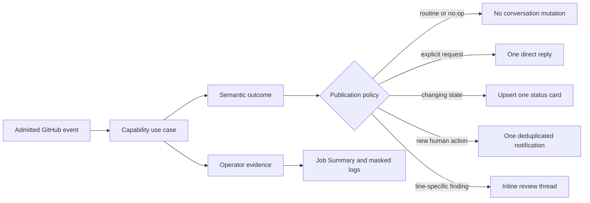
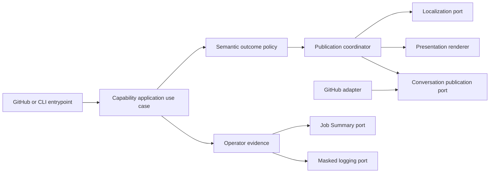

# Semantic GitHub Publication and Notification

- Status: Implemented — automated gates and controlled pull-request UX evidence complete
- Date: 2026-09-14
- Catalog capability ID: github-communication-experience
- Last verified: 2026-09-15; implementation is on `develop` through PR #389,
  with the executable concurrency and disjoint test-budget closure in this
  specification revision
- Owners: Copilot maintainers
- Scope: Replace generic step-dump comments with bounded, semantic, idempotent GitHub messages across issues, pull requests, reviews, pushes, and single actions.
- Related issues/PRs: [issue #334](https://github.com/vypdev/copilot/issues/334), [issue #344](https://github.com/vypdev/copilot/issues/344), [issue #355](https://github.com/vypdev/copilot/issues/355), [PR #366](https://github.com/vypdev/copilot/pull/366) through [PR #389](https://github.com/vypdev/copilot/pull/389)
- Required review gates: product UX, architecture, testing, documentation, security/operations
- Open decisions blocking readiness: none

## 1. Executive summary

Copilot MUST publish a GitHub conversation message only when that message helps a
person understand an outcome, make a decision, or take an action. Generic
headings such as **Automatic Actions**, **Feature Actions**, and **Release
Actions**, numbered dumps of internal execution steps, decorative GIFs, visible
branding footers, and raw debug logs MUST disappear from issue and pull-request
conversations.

The recommended default is quiet, semantic publication:

- routine metadata and lifecycle work is visible through native GitHub state and
  the workflow Job Summary, with no conversation comment;
- a direct user request receives one concise answer;
- changing product state uses one stable, bot-owned status card per semantic
  subject and updates that card in place;
- an actionable transition may create one deduplicated notification; and
- line-specific review findings remain line-specific.

All visible copy is rendered through the repository-localization contract in
[`repository-locale-and-localization.md`](./repository-locale-and-localization.md).
English (`en-US`) is therefore the default even though examples in this SDD are
written directly in English.

```text
GitHub event -> capability result -> semantic publication decision
             -> no comment | one reply | one status-card upsert | inline finding
             -> operator evidence in Job Summary and logs
```

## 2. Problem, baseline behavior, and evidence

### 2.1 Problem

Before this program, maintainers had to scan many comments to discover whether
anything material happened. The dominant comment template described the branch
category and internal steps rather than the outcome. A one-line fact such as
“waiting state cleared” could arrive inside a roughly one-kilobyte comment
containing a level-one heading, a GIF, a debug disclosure, and a footer.
Repeated workflow events produced new timeline entries instead of updating the
state already shown.

The result has four product costs:

1. important findings and action-required states compete visually with routine
   bookkeeping;
2. GitHub notifications are generated for content that often has no human next
   action;
3. long issue timelines obscure decisions and progress; and
4. internal execution details, including runner paths, can leak into a public
   collaboration surface even when they belong only in operator evidence.

### 2.2 Baseline behavior before rollout

The following sequence was verified in the pre-implementation 2026-09-14
repository snapshot. It is retained as migration evidence and is not a claim
about the implemented product:

1. Use cases append human-readable strings to `Result.steps`, regardless of
   whether those strings are product messages or operational evidence.
2. `projectPublishResultContext` chooses `publish`, `omit-feature-owned`, or
   `omit-metadata-only`; most issue, push, and single-action routes select
   `publish`.
3. `renderResultSections` converts plain steps into one global numbered list.
4. `selectResultPublicationPresentation` chooses a generic title from branch
   type, not from the outcome or required action.
5. `runPublishResume` creates a new issue-style comment. When enabled, the
   comment includes a random image, a debug disclosure, reminders, errors, and
   “Happy coding”.
6. `IssueContentRepository` appends a visible marketplace watermark to every
   created or updated issue/PR timeline comment.
7. Some newer capabilities bypass that path correctly: the release dashboard,
   Bugbot status, and branch-synchronization notice use stable markers and
   update owned comments.
8. Metadata-only PR edits and Bugbot-owned runs recently gained omission rules,
   but close/merge, push, plan, progress, and several lifecycle paths can still
   publish generic or duplicate messages.

### 2.3 Evidence

#### Baseline repository evidence

- Generic completion path:
  `src/application/usecases/steps/common/publish_resume_workflow.ts`,
  `src/application/policies/result_publication_policy.ts`,
  `src/application/policies/result_publication_presentation_policy.ts`, and
  `src/application/policies/result_publication_sections_policy.ts`.
- Operational evidence already has a suitable destination in
  `src/application/policies/action_summary_policy.ts` and
  `src/infrastructure/github/github_action_summary_adapter.ts`.
- Direct comment creation also exists in the issue help/Think, commit notice,
  inactivity, authorization, issue-close, finding, branch-sync, and deployment
  workflows. These call sites form the migration inventory; removing only the
  generic publisher is insufficient.
- Recommendation state fingerprints the issue description and generated plan,
  but publication still travels through generic results:
  `src/application/usecases/actions/recommend_steps_workflow.ts` and
  `recommend_steps_result_policy.ts`.
- Progress is recalculated on pushes and emitted as steps rather than one durable
  projection: `src/application/usecases/actions/check_progress_workflow.ts`.
- Correct stable-card patterns already exist in
  `src/data/repository/deployment/deployment_presentation_repository.ts`,
  `src/application/usecases/steps/commit/bugbot/synchronize_bugbot_review_presentation_use_case.ts`,
  and `src/application/policies/branch_sync_notification_policy.ts`.

#### Live GitHub UX audit

The audit used public REST data from `vypdev/copilot`, filtered to comments and
reviews authored by `vypbot`. It did not infer notification delivery because
that depends on each GitHub user's settings.

| Sample, observed on 2026-09-14 | Bot output | Generic template output | Repeated chrome |
|---|---:|---:|---|
| 12 most recently created PRs: #352, #353, #356–#365 | 33 timeline comments and 12 reviews | 25 comments | all 25 contained debug and a GIF; 24 mentioned clearing waiting state |
| 8 most recently created issues: #339, #340, #341, #344, #346, #350, #354, #355 | 50 comments | 36 comments | all 36 contained debug; 32 contained a GIF |
| Sole open issue #334 | 6 comments | 5 comments | 45,175 total bot-authored characters; two plan comments were 15,946 and 16,941 characters |

The 25 generic PR comments contained 34,495 characters. Removing only the
debug disclosure, image Markdown, and “Happy coding” footer left 5,999
characters. The 36 generic issue comments contained 172,533 characters; the
same mechanical removal left 59,974. These reductions are diagnostic, not a
target metric: the remaining content still includes generic headings and
step-oriented narration.

Representative failure modes:

- PR #358 received six generic comments in addition to its useful Bugbot card;
  five carried substantially the same waiting-state outcome.
- PR #363 received three feature-action comments around metadata/lifecycle
  activity even though a canonical Bugbot card already summarized useful state.
- PR #365 had a useful Bugbot state and a redundant generic close/lifecycle
  comment.
- issue #355 received six generic release comments where one operation dashboard
  would have provided a clearer lifecycle.
- issue #344 alternated repeated progress and review publications, forcing the
  reader to reconstruct the latest state from the timeline.
- issue #334 contains two very large, substantially overlapping implementation
  plans and exposed local runner-oriented details that are not useful issue UI.

#### Baseline documentation and external evidence

- At the baseline, `docs/configuration.mdx`, `docs/issues/configuration.mdx`,
  and `docs/pull-requests/capabilities.mdx` presented images as enabled by
  default.
- At the baseline, `docs/issues/notifications-and-auto-close.mdx` described
  lifecycle comments without a cross-capability notification budget.
- GitHub documents that creating issue, commit, and review comments can trigger
  notifications and secondary rate limiting. GitHub also provides update
  endpoints, so stable bot-owned comments are an available provider primitive.
- GitHub Actions Job Summaries are explicitly intended to hold Markdown results
  and diagnostics on the workflow-run surface.

### 2.4 Retrospective classification

This SDD began as a prospective behavior change. Section 2 preserves the
pre-implementation facts that established the migration boundary; sections
13–19 record the completed rollout and executable evidence. Baseline behavior
is not part of the implemented contract.

## 3. Actors, surfaces, and terminology

| Actor | Goal | Entry point | Visible surfaces |
|---|---|---|---|
| Issue author | Understand what Copilot changed or recommends | issue open/edit, mention, command | issue body/state, one plan/progress card, one reply |
| PR author/reviewer | Find actionable review or branch state quickly | PR event, review command, push | checks, inline threads, one Bugbot/branch card, PR description |
| Release operator | Know the current irreversible release fact and next action | deployment action or managed PR | one release dashboard, managed PR, Job Summary |
| Repository maintainer | Diagnose a failed or skipped run | Actions run or explicit status command | Check, Job Summary, logs, concise linked notification |
| Copilot application | Communicate without creating timeline noise | any admitted route | semantic publication ports only |
| GitHub | Render state and deliver notifications | API create/update/review calls | timeline, review, checks, Actions UI |

Terms used normatively:

- **Semantic outcome**: immutable application data describing user impact,
  completed facts, next transition, and required action. It is not rendered
  Markdown.
- **Operator evidence**: step IDs, logs, timings, retries, provider errors, and
  diagnostics used to run or debug automation.
- **Direct reply**: one new comment answering an explicitly addressed request.
- **Durable status card**: one bot-owned comment updated in place to show current
  state for a semantic subject.
- **Transition notification**: a short new comment used only when a human newly
  needs to act and an edited card would otherwise be too easy to miss.
- **Inline finding**: a review comment anchored to a relevant diff location.
- **Semantic identity**: `(repository, target kind, target number, topic,
  subject key)`; it is stable across retries and workflow runs.
- **Fingerprint**: a bounded digest of the meaning that prevents duplicate
  notifications. It MUST exclude timestamps, run IDs, and wording variation.
- **Native GitHub state**: labels, assignees, projects, branches, issue state,
  checks, reviews, merge state, releases, and commits already visible without a
  new bot comment.

## 4. Goals, non-goals, and fixed invariants

### 4.1 Goals

1. Eliminate all new comments headed **Automatic Actions**, **Feature Actions**,
   **Bugfix Actions**, **Documentation Actions**, **Chore Actions**, **Release
   Actions**, or **Hotfix Actions**.
2. Make 100% of conversation publications originate from an explicit semantic
   intent rather than the presence of `Result.steps` or debug output.
3. Create zero conversation comments for routine metadata-only, no-op,
   already-satisfied, merge-close, and background success events.
4. Maintain at most one active status card for each semantic identity and heal
   bot-owned duplicates after concurrent creation.
5. Keep every direct response and transition notification within its defined
   size and frequency budget.
6. Make current status and required action understandable before any collapsed
   technical section.
7. Preserve complete operational evidence in the Job Summary and logs.
8. Cover issue plans, progress, commit/push handling, lifecycle closure, branch
   synchronization, Bugbot, releases, errors, and single actions under one
   cross-capability policy.

### 4.2 Non-goals

1. Redesign GitHub's notification settings or guarantee that an edit sends a
   notification.
2. Delete historic generic comments during migration.
3. Replace line-level Bugbot findings with one summary-only review.
4. Change release safety, authorization, merge, branch, or agent-execution
   semantics except where their user-facing publication is explicitly covered.
5. Localize copy inside this SDD; localization ownership belongs to the companion
   repository-locale SDD.
6. Add a user-configurable “verbose conversation” mode.

### 4.3 Fixed product/safety invariants

1. `Result.steps`, logs, exception text, prompts, stack traces, runner paths, and
   provider DTOs MUST NOT be published directly to a GitHub conversation.
2. `debug=true` MAY increase logs and Job Summary evidence but MUST NOT add debug
   text to an issue, PR, review, or commit comment.
3. A no-op background event MUST create zero comments even if it produced logs,
   reminders, or successful `Result` records.
4. A human-authored comment, review, or description MUST never be overwritten by
   the publication system.
5. Only comments authored by the configured bot and containing a valid owned
   marker may be updated, compacted, or deleted.
6. Irreversible success facts MUST remain visible when a later stage fails.
7. Machine markers, codes, refs, commands, and identity keys MUST be stable and
   locale-independent.
8. Decorative media, visible branding footers, and celebratory filler MUST not
   displace status or action content.
9. Failure to publish user-facing UI MUST not repeat an irreversible domain
   operation.
10. Notification and size budgets are safety limits and are not configurable.

## 5. Baseline versus implemented product journey

| Stage | Baseline | Implemented | User/operator effect |
|---|---|---|---|
| Capability work | Use cases accumulate prose in `Result.steps` | Use cases return semantic outcome plus operator evidence | Meaning is explicit and testable |
| Publication decision | Any visible step/error usually enables a comment | Pure policy selects none, reply, status, transition, or inline finding | Routine work stays quiet |
| Presentation | Branch category chooses generic title | Outcome/action chooses a localized title and content model | First line communicates value |
| Repeated event | New comment is appended | Existing card is found by semantic identity and updated | One source of current truth |
| Debug | Collapsed logs can appear in conversation | Bounded Job Summary plus full masked logs | Timeline stays readable |
| Push | Commit notice, progress result, review result, and generic summary can overlap | Progress card and feature-owned review surfaces update; commit facts link from them | No per-push narration |
| Completion | Close/merge may add a generic success comment | Native state changes and existing cards become terminal | No redundant “closed after merge” message |
| Failure | Generic errors mix cause, steps, GIF, and debug | Actionable failures use impact, cause, action, retained state, and a run link | Recovery is obvious |



Text equivalent: an admitted event runs one capability; the capability returns
semantic outcome and operator evidence; a pure policy chooses no conversation
mutation, one reply, one status-card update, one action notification, or inline
findings, while evidence goes to the Job Summary and logs.

## 6. Functional behavior and state model

### 6.1 Publication-intent contract

Every user-facing capability MUST return zero or more typed publication intents.
The initial closed union is:

| Intent | Provider effect | Valid trigger | Required data |
|---|---|---|---|
| `none` | no conversation mutation | routine, no-op, stale, duplicate, superseded | reason code for Job Summary |
| `reply` | create one comment | explicit command/mention or terminal policy explanation | target, semantic message, request correlation |
| `status` | create or update one owned card | durable plan/progress/review/branch/release state | identity, source version, projection, digest |
| `transition` | create once per fingerprint | state newly requires human action | identity, impact, action, fingerprint, status-card link |
| `inline-finding` | create/update/resolve a review thread | line-specific actionable finding | finding identity, location, severity, evidence |

`none` is a first-class result, not an empty or failed publication. The union is
closed so unknown intent kinds fail contract validation instead of defaulting to
a generic comment.

### 6.2 Cross-capability decision matrix

| Event/capability | Conversation contract | Operator/native contract |
|---|---|---|
| Labels, assignees, project fields, issue type/title normalization | no comment | native metadata plus Job Summary |
| Metadata-only PR edit or project sync | no comment | native metadata; neutral/omitted Check per existing lifecycle policy |
| New normal issue | create one concise implementation-plan card; it also contains one-line command discovery | issue metadata and Job Summary |
| Normal issue description edit | update the same plan card only when plan meaning changes | plan fingerprint and Job Summary |
| Help/question issue | one direct answer; no separate welcome or generic result | issue state and Job Summary |
| Release/hotfix issue | release dashboard owns the issue presentation; no plan/welcome/generic comment | durable operation state |
| Push to linked work branch | update progress card when its projection changes; do not post a commit or reopened notice | commit, labels, Checks, Job Summary |
| Explicit command/mention | at most one direct reply; a capability MAY also update its existing card when the reply links to it | command result and Job Summary |
| Branch drift/sync | create one initial stale card; update it to aligned or changed stale state; on a later aligned-to-stale transition, create one fingerprinted notification linked to the card | comparison, publication evidence, and workflow run |
| Bugbot | one canonical aggregate card plus bounded inline findings; no generic result | Review Check and Job Summary |
| Release/hotfix transition | update one dashboard; default mode creates no milestones; configured milestone mode follows its existing bounded contract | managed PR, release, package, Job Summary |
| Merge/close success | no new comment; update any owned active card to a terminal state when useful | native merge/issue state |
| Unauthorized issue closure | one concise terminal explanation with eligibility/recovery guidance | native closed state and audit evidence |
| Inactivity closure | one deduplicated explanation containing the policy and reopening path | native closed state |
| Background recoverable failure | update the relevant status card and Check; create a transition notification only when human action becomes necessary | failing/neutral Check, Job Summary, logs |
| Background failure with no conversation subject | no comment | failing Job Summary/Check |
| Explicit request failure | one concise reply | failed Job Summary/Check where applicable |
| Single action that publishes caller-supplied content | exactly the requested create/update/append; no wrapping generic result | Job Summary records the mutation |

### 6.3 Happy path

1. An entrypoint validates and routes the event without selecting prose.
2. The capability use case performs domain work and returns a semantic outcome
   and separate operator evidence.
3. The publication policy classifies the outcome using trigger, current state,
   human-action transition, prior digest, and surface ownership.
4. Localization resolves one atomic catalog for the target surface.
5. Presentation maps the outcome into a bounded view model and safe Markdown.
6. The publication repository creates a reply or reconciles a durable card.
7. The Job Summary records work performed, publication decision, identity,
   previous/new digest, and any provider failure.

### 6.4 Durable card reconciliation

For a `status` intent the application MUST:

1. derive the semantic identity without model output;
2. list all comments matching the exact valid marker and configured bot identity;
3. select the lowest comment ID as canonical;
4. reject a stale source version before mutation;
5. skip the provider update when the rendered semantic digest is unchanged;
6. create one comment when no canonical card exists;
7. re-list after creation to detect a concurrent duplicate;
8. retain the lowest bot-owned exact-identity comment, update it to current
   state, and delete later exact duplicates; and
9. if duplicate deletion is forbidden, replace the duplicate body with a short,
   localized pointer to the canonical card and record cleanup debt in the Job
   Summary.

Historic generic comments and comments without an exact owned marker MUST NOT be
deleted or rewritten.

For a `transition` intent the application MUST:

1. derive the fingerprint from a closed trusted action, exact semantic identity,
   and trusted source version—never from visible or model-generated prose;
2. accept only a non-empty deterministic message no longer than 400 characters
   with at most two Markdown links and no embedded HTML marker;
3. list comments matching the exact identity, fingerprint, valid transition
   marker, and configured bot identity;
4. create only when no match exists, then re-list to detect concurrent creation;
5. keep the lowest exact bot-owned comment ID as the immutable notification;
6. delete later exact duplicates, or replace them with a localized compact
   pointer when deletion is forbidden; and
7. report topic, target, `created` or `reused`, fingerprint, and bounded cleanup
   evidence in the repository-locale Job Summary without copying message bodies.

A renderer or translation change MUST NOT rewrite or recreate an already-issued
notification for the same fingerprint. Human and third-party markers are inert.

### 6.5 Stable identity and source freshness

The shared marker format is:

```html
<!-- copilot:publication schema="1" topic="progress" target="issue:344" key="work" source="<safe token>" digest="<8-64 hex>" -->
```

Action notifications use a distinct immutable envelope:

```html
<!-- copilot:transition schema="1" topic="branch-sync" target="issue:344" key="dependency:<digest>" fingerprint="<8-64 hex>" message="<safe message key>" -->
```

- Allowed topics at launch are `plan`, `progress`, `branch-sync`, `bugbot`,
  `release`, `inactivity`, and `access-policy`.
- Marker values MUST be generated from trusted domain data, restricted to
  `[A-Za-z0-9._:-]`, and bounded to 128 characters per value.
- Feature-specific existing markers remain readable. New writes converge on the
  shared envelope without changing durable feature identity.
- Reply correlation preserves the established `comment:<issue-comment-id>`
  identity for `issue_comment` replay compatibility. Review comments use the
  distinct `comment:pull_request_review_comment:<review-comment-id>` identity;
  transports MUST NOT share a fallback correlation. Readers MUST also adopt the
  transient `comment:issue_comment:<issue-comment-id>` form emitted during
  migration and compact it with the stable identity; new writes MUST NOT use
  that transient form.
- Commit-derived progress MUST snapshot the authoritative remote branch head
  before analysis. An event-provided head that is already stale MUST stop before
  agent execution. The workflow MUST revalidate the snapshot immediately before
  native issue/PR label mutation, and the card reconciler MUST revalidate it
  immediately before every create or update. SHA-1 and SHA-256 object IDs are
  accepted only in canonical hexadecimal form after case normalization.
- A stale progress result MUST mutate neither native state nor conversation
  state. It is a successful skipped outcome with reason `stale-source`, and the
  repository-locale Job Summary MUST explain that suppression without exposing
  full object IDs.
- Revisioned operations MUST reject any revision lower than the stored revision.
- Events without an orderable revision may update only after the shared workflow
  queue confirms no newer conflicting run; otherwise they resolve to `none` with
  reason `stale-source`.

### 6.5.1 Push and pull-request review ownership

The Commit and Pull Request workflows MUST use distinct native concurrency
groups keyed by repository and branch. A paired `push` and
`pull_request:synchronize` event MUST NOT cancel one another. Each group MAY
cancel only an older replaceable run from the same workflow; PR metadata-only
`edited` events MUST continue to queue without preempting an active PR review.

The Commit route MUST retain native issue state, size, and progress work, then
invoke a read-only Bugbot preflight that resolves the pushed branch through the
provider's exact-head lookup. If that validated selection is an open PR in the
same base repository, the push route MUST stop before loading review context or
invoking the agent. The PR `synchronize` route then exclusively owns Bugbot
review for that head. The decision MUST NOT depend on a `pull_request` field in
the `push` payload. An issue-linked branch without an open PR retains push-time
Bugbot. Fork PR workflows remain outside this contract and MUST stay excluded
by the existing same-repository admission gate.

### 6.6 State machine

| State | Entered when | User-visible meaning | Allowed next states | Recovery/owner |
|---|---|---|---|---|
| `absent` | no owned message exists | nothing has needed publication | `current`, `action-required`, `terminal` | publication use case |
| `current` | a useful nonterminal projection exists | latest known state; no action unless stated | `current`, `action-required`, `partial`, `terminal` | capability event |
| `action-required` | human action changes from false to true | one primary action is shown and may notify once | `current`, `partial`, `terminal` | named human/operator |
| `partial` | irreversible success exists but later work failed/pends | retained success and remaining risk are distinct | `current`, `action-required`, `terminal` | retry or operator |
| `terminal` | completed, aligned, closed, obsolete, or superseded | no further action for this subject | `current` only for explicit reopen/new source | new operation/event |
| `publication-degraded` | domain work succeeded but provider UI mutation failed | Job Summary is authoritative; no domain replay | any state after bounded publication retry | operator/application |

Duplicate events with the same digest produce no provider mutation. Stale,
out-of-order, or canceled runs cannot overwrite a newer card. Superseded runs
write only operator evidence. A partially failed reconciliation preserves the
last valid card and exposes publication degradation in the Job Summary.

## 7. User-facing configuration

The semantic notification rules are intentionally mostly fixed. Configuration
may choose a legitimate release presentation or temporarily preserve onboarding
media, but it cannot restore generic step dumps or debug-in-comments.

| Input | Type | Recommended default | Allowed values/range | Scope/persistence |
|---|---|---|---|---|
| `orchestration-comment-mode` | enum | `update` — one dashboard | existing `update`, `milestones` | snapshotted by release operation |
| `orchestration-presentation-mode` | enum | `guided` | existing `guided`, `compact`, `quiet` | snapshotted by release operation |
| `images-on-issue` | deprecated boolean | `false` | `false`; `true` accepted during compatibility window only | repository/run |
| `images-on-pull-request` | deprecated boolean | `false` | `false`; `true` accepted during compatibility window only | repository/run |
| `images-on-commit` | deprecated boolean | `false` | `false`; `true` accepted during compatibility window only | repository/run |
| locale inputs | BCP-47 profile | see companion SDD | bounded by localization contract | repository/run or operation snapshot |

During one minor-release compatibility window, `images-on-issue=true` MAY render
one configured image only in the one-time welcome state when no feature-owned
card or answer exists. It MUST have descriptive alt text. PR, commit, status,
finding, warning, error, progress, plan, and release messages never render
decorative images. All image pool inputs are deprecated with the same window and
are removed in the next major release.

`debug` remains supported for operator logs and Job Summary evidence. It has no
conversation-publication effect.

No inputs are added for generic titles, footer text, raw-step publication,
status-card multiplicity, failure deduplication, or notification limits. Unknown
or retired image values follow the setup/doctor deprecation policy. Release
configuration precedence and snapshot semantics remain as specified by the
release orchestration SDD.

Recommended configuration:

```yaml
with:
  repository-locale: en-US
  images-on-issue: false
  images-on-pull-request: false
  images-on-commit: false
  orchestration-comment-mode: update
```

Meaningful alternative:

```yaml
with:
  repository-locale: fr-FR
  orchestration-presentation-mode: compact
  orchestration-comment-mode: milestones
```

The alternative localizes output and opts into bounded release milestones; it
does not increase generic publication or expose debug output.

## 8. Clean Architecture design

### 8.1 Responsibilities and dependency direction

| Layer/boundary | Owns | Must not own/import |
|---|---|---|
| Domain/pure policy | semantic identity, outcome/action states, fingerprinting, publication and noise decisions | Octokit, Actions context, Markdown, locale catalogs, logs |
| Application | capability outcomes, publication coordinator, stale guards, semantic ports, operator evidence | concrete GitHub SDK calls, random images, raw event DTOs |
| Adapters/data | list/create/update/delete owned comments, reviews, Checks, provider error mapping | deciding whether a comment is useful or selecting copy |
| Infrastructure/composition | bind ports and feature publishers; wire Job Summary and localization | branch/lifecycle product decisions |
| Entrypoints | validate/project input, route event, invoke completion | building comments from results |
| Presentation | localized typed view models, Markdown rendering, size/sanitization | state transitions, API mutation, authorization |



Text equivalent: entrypoints invoke capability use cases; domain policy produces
a semantic outcome; the application coordinator localizes and renders that
outcome before using a semantic GitHub publication port; operator evidence takes
a separate Job Summary/logging route.

### 8.2 Contracts, state, and trust boundaries

- **Pure decisions:** `PublicationDecision`, `PublicationIdentity`,
  `SemanticDigest`, `NotificationFingerprint`, and per-feature projections are
  readonly and deterministic.
- **Application contracts:** a capability returns `{ results/evidence,
  publications }`; `Result` remains temporarily for execution compatibility but
  is not a conversation DTO.
- **Semantic ports:** `OwnedConversationQueryPort`,
  `ConversationMutationPort`, `InlineFindingPublicationPort`,
  `ActionSummaryPort`, and the companion localization port expose no Octokit
  types.
- **Durable state/schema ownership:** each feature owns its subject state; the
  shared publisher owns only marker schema, canonical comment ID reconciliation,
  render digest, and transition-notification fingerprint.
- **Concurrency/idempotency:** workflow queue/stale-source guards prevent old
  projections; post-create reconciliation heals concurrent card creation;
  feature operation revisions remain authoritative.
- **Trusted inputs:** configured repository identity, validated event numbers,
  feature state, bot login, and generated marker values.
- **Untrusted inputs:** issue/PR text, comments, model output, provider messages,
  URLs not built from trusted repository data, and pre-existing comment bodies.
- **Provider error mapping:** create/update/delete/list failures map to semantic
  application errors and publication-degraded evidence. They never become raw
  conversation prose.

### 8.3 Required application seams

Implementation MUST introduce or converge on the following seams; exact file
names may follow repository conventions:

1. a pure shared publication-decision policy;
2. immutable publication contracts separate from `Result`;
3. a semantic outcome adapter for each existing direct `addComment` and
   `updateComment` call site;
4. one coordinator for status-card reconciliation and transition deduplication;
5. feature renderers for plan, progress, branch sync, Bugbot, release, access,
   inactivity, command replies, and failures;
6. a Job Summary projection that includes compact semantic outcomes, stable
   machine evidence, and localized recovery guidance while leaving internal
   result names and step/debug narration in masked logs; and
7. a temporary compatibility adapter that rejects attempts to publish generic
   `Result.steps` and records the attempted source in tests/logs.

The release dashboard and Bugbot reconciliation keep their feature-specific
state policies. They adopt shared localization, content hierarchy, marker
envelope, and notification-budget primitives rather than moving release or
review rules into the generic publisher.

### 8.4 Executable architecture constraints

1. An architecture test MUST forbid imports of GitHub/Actions SDKs from domain,
   application policy, and presentation modules.
2. A contract test MUST fail when an entrypoint or completion path renders
   `Result.steps` into a conversation.
3. A source-boundary test MUST inventory direct issue/review comment mutations;
   every allowed call site must be an adapter or a catalogued exceptional
   single-action publisher.
4. A string-policy test MUST reject the retired generic headings, “Happy
   coding”, visible default watermark, and “Debug log” in conversation fixtures.
5. Marker parsers and renderers MUST be schema-tested; malformed or forged
   markers are inert.
6. Coverage budgets MUST add the new pure policies at 100% branches, functions,
   lines, and statements and the changed publication path at 95% lines/statements
   and 90% branches/functions.

## 9. UI/UX and content contract

### 9.1 Information hierarchy

Every durable or actionable message presents, in order:

1. a specific outcome/action title;
2. current status in one sentence;
3. completed or retained facts;
4. the single next transition;
5. one primary human action, or a concise statement that none is required;
6. direct descriptive links; and
7. optional collapsed, sanitized technical reference.

Direct replies MAY omit sections that do not apply. Comments use `##` as their
top visible heading because they live inside an issue/PR page. Level-one headings
are reserved for standalone issue/PR descriptions and Job Summaries.

### 9.2 Representative views

#### Pending/no action: implementation plan

```markdown
<!-- copilot:publication schema="1" topic="plan" target="issue:334" key="implementation" source="issue-body:<digest>" digest="<digest>" -->

## Implementation plan

> **Current status:** Ready to start. No action is required from maintainers before implementation.

1. **Introduce semantic publication contracts**
   - Replace arbitrary plan Markdown with bounded structured fields.
2. **Migrate every user-facing publication path**
   - Cover plan, progress, lifecycle, branch sync, Bugbot, and release output.
3. **Verify idempotency, localization, and security**
   - Exercise replay, malformed output, and configured-locale behavior.
4. **Update user and contributor documentation**

**Acceptance:** Repeated equivalent events create no new comments, and operator details remain available in the workflow run.

Need something else? Mention the bot with a question or use `/copilot help`.
```

The plan MUST contain three to eight ordered steps, at most two short sub-bullets
per step, explicit acceptance, and repository-relative references only. The same
card is updated after a material issue-description change. A new issue that gets
this card does not also get a welcome comment.

#### Current progress

```markdown
<!-- copilot:publication schema="1" topic="progress" target="issue:344" key="work" source="head:abc1234" digest="<digest>" -->

## Progress: 65% — in progress

> **Current status:** Core behavior is implemented; validation and migration remain.

### Completed

- Semantic publication policy and durable identities
- Plan and branch-sync card migration

### Remaining

- Progress/release migration
- Documentation and full validation

**Next:** complete the migration tests and rerun the repository validation suite.

[Compare changes](https://github.com/example/project/compare/develop...feature/344-publication) · [Latest commit](https://github.com/example/project/commit/abc1234)
```

Every push may recalculate progress, but the card is updated only when the head
is current and the semantic projection changes. Reasoning and raw diffs remain
in operator evidence; they are not appended to the issue card.

#### Action required

```markdown
<!-- copilot:publication schema="1" topic="branch-sync" target="pr:81" key="develop:feature-81" source="head:def5678" digest="<digest>" -->

## Action required: resolve branch synchronization

> **Impact:** `feature/81-localization` cannot be updated automatically.

**Cause:** merging `develop` produced conflicts in 3 files.

**Action:** run `/copilot sync-branch` after resolving the protected-file conflict, or update the branch manually.

**Retained state:** no conflicting commit was pushed; the branch still points to `def5678`.

[Compare branches](https://github.com/example/project/compare/develop...feature/81-localization) · [Workflow run](https://github.com/example/project/actions/runs/124)

<details>
<summary>Technical reference</summary>

Reference: `branch-sync:7f31c2ab`
</details>
```

The first false-to-true action transition MAY also create this short notification:

```markdown
Branch synchronization needs attention: protected-file conflicts require a maintainer. [Open the current status](https://github.com/example/project/pull/81#issuecomment-10).
```

The same fingerprint never creates that notification twice.

#### Blocked before an irreversible effect

```markdown
## Release 3.4.0 — blocked before publication

> **Impact:** Production was not changed and package `3.4.0` was not published.

**Cause:** the required production check `build` did not pass.

**Action:** fix the check, then retry the release action.

**Retained state:** the prepared release branch and promotion PR remain available.

[Promotion PR #82](https://github.com/example/project/pull/82) · [Workflow run](https://github.com/example/project/actions/runs/125)
```

#### Partial success after an irreversible effect

```markdown
## Release 3.4.0 — published; reconciliation needs attention

> **Current status:** `3.4.0` is published from production commit `9ac4e21`.

**Remaining:** development reconciliation is blocked by a protected-branch rule.

**Action:** review and merge reconciliation PR #83. Do not republish the package.

[GitHub release](https://github.com/example/project/releases/tag/v3.4.0) · [Reconciliation PR #83](https://github.com/example/project/pull/83)
```

#### Completed

```markdown
## Release 3.4.0 — complete

> **Current status:** Published and reconciled. No action required.

- Production: `master@9ac4e21`
- Package: `example@3.4.0`
- Development: reconciled into `develop`

[GitHub release](https://github.com/example/project/releases/tag/v3.4.0) · [Workflow run](https://github.com/example/project/actions/runs/126)
```

Completion updates the existing dashboard. It does not create a celebratory
comment.

#### Bugbot and direct reply

```markdown
## Bugbot: 2 findings need attention

> **Current status:** Review of `7bd90fe` completed with full coverage.

- [SQL query interpolates untrusted input](#discussion_r100)
- [Retry loop has no upper bound](#discussion_r101)

**Action:** review the linked threads or run `/copilot fix all`.

[Verified commit](https://github.com/example/project/commit/7bd90fe) · [Workflow run](https://github.com/example/project/actions/runs/127)
```

```markdown
Done — refreshed the pull-request description from the current diff. [View the updated description](https://github.com/example/project/pull/84#top).
```

The direct reply does not repeat implementation steps or include a second
generic summary.

#### Terminal policy explanation

```markdown
## Issue closed: contributor access required

This repository accepts automated issue processing only from eligible contributors.

If you believe this is incorrect, contact a maintainer or follow the contribution policy.

[Read the contribution policy](https://github.com/example/project/blob/main/CONTRIBUTING.md)
```

### 9.3 Issue, PR, review, and comment behavior

- Titles MUST name the outcome or action, never the branch category that happened
  to trigger it.
- A visible message MUST not enumerate internal use-case names or steps such as
  project linking, label synchronization, waiting-state cleanup, or configuration
  persistence.
- Merge and close events rely on native GitHub state. They update an existing
  card only when terminal state would otherwise be misleading.
- Plans, progress, branch sync, Bugbot, releases, inactivity, and access-policy
  explanations have stable semantic identities.
- Inline findings remain near code. Aggregate counts link to those threads and
  do not duplicate their full content.
- Direct links use descriptive labels and trusted repository URLs. Raw URLs are
  not used as link text.
- Labels and Checks supplement cards; they do not justify duplicate comments.
- Explicit no-change replies use one sentence, for example: “No changes were
  needed — the pull-request description already matches the current diff.”

### 9.4 Comment and notification budget

| Situation | New comments/reviews | Updates | Notes |
|---|---:|---:|---|
| Routine metadata, no-op, duplicate, stale, superseded, merge/close success | 0 | at most one terminal card update | Job Summary only |
| New issue | at most 1 | 0 | plan, answer, release dashboard, or welcome; never multiple |
| Issue description edit | 0 | at most 1 plan card | only semantic change |
| Push | 0 generic; bounded new inline findings only | at most one card per affected topic | no commit/reopen narration |
| Explicit command/mention | at most 1 reply | at most one feature card | reply links rather than duplicates |
| Durable capability operation | at most 1 initial card | at most 1 update per semantic transition | one active card per identity |
| Newly actionable failure | at most 1 transition notification per fingerprint | 1 relevant card | no repeat on retry |
| Release `milestones` alternative | existing bounded milestone allowance | 1 dashboard | opt-in exception only |

A single event affecting several topics MAY update several existing cards, but it
MUST NOT create a generic roll-up comment. Job Summary aggregates the run.

### 9.5 Content and size budgets

- Direct reply: 800 visible characters by default, 4,000 maximum when the answer
  itself requires explanation; translated-request disclosure is counted
  separately under the localization SDD.
- Transition notification: 400 visible characters and two links maximum.
- Plan card: 8,000 visible characters, three to eight primary steps.
- Progress/branch/Bugbot card: 6,000 visible characters.
- Release dashboard: 12,000 visible characters because irreversible state and
  reconciliation may require more facts.
- Collapsed technical reference in conversation: 2,000 characters, stable IDs
  and sanitized facts only; no raw logs or stack traces.
- Job Summary: 20,000 characters per capability section before deterministic
  truncation and links to logs/artifacts.

Truncation MUST preserve current status, impact, action, retained irreversible
facts, and recovery links before optional detail.

### 9.6 Accessibility, localization, and responsive behavior

- Text, not emoji or color, carries state. At most one leading status icon is
  permitted in a title, and removing it must not change meaning.
- Comments MUST remain readable at narrow widths. Use lists before wide tables;
  tables are limited to four columns and require a prose status sentence.
- Decorative images are absent after the compatibility window. Any temporary
  welcome image has useful alt text and no text embedded solely in the image.
- Heading levels are logical. Comments start at `##`; nested sections use `###`.
- Every link is descriptive and independently understandable.
- All copy and user-supplied content follows the companion locale, atomic
  fallback, bidi, and sanitization contract.
- Untrusted Markdown, mentions, slash commands, HTML markers, URLs, and Mermaid
  content are escaped or generated from trusted fixed templates. Model output
  cannot manufacture an owned marker.

## 10. Failure, recovery, and cleanup

| Failure/partial state | User impact | Retained facts | Automatic retry | Required action | Cleanup |
|---|---|---|---|---|---|
| Semantic outcome invalid | no conversation output | domain mutation result and logs | no blind retry | inspect failed Job Summary | fix producer/schema |
| Card list fails before mutation | status may remain stale | prior card untouched | bounded provider retry | open run if failure persists | none |
| Card update fails after domain success | UI is stale; domain result remains valid | old card, domain state | publication-only retry | follow Job Summary | never replay domain work |
| Concurrent card creation | brief duplicate may appear | both exact bot-owned cards | immediate re-list/reconcile | none normally | delete later duplicate or compact pointer |
| Stale run reaches publisher | no visible regression | newer card/state | none | none | record `stale-source` |
| Notification create fails | user may miss newly actionable transition | status card and failing Check | bounded create retry | consult Actions/Check | do not repeat operation |
| Content exceeds budget | optional detail omitted | status/action/retained facts | deterministic rerender | use linked Job Summary | record truncation |
| Irreversible release succeeds, reconciliation fails | package exists; development differs | tag/package/release/production SHA | retry reconciliation only | merge/fix reconciliation | never republish |
| Duplicate cleanup forbidden | compact duplicate remains | canonical card | retry cleanup only | none | Job Summary records comment IDs |

User-facing failures MUST follow `impact -> cause -> action -> retained state ->
links`. Provider error bodies, stack traces, and retry loops belong to operator
evidence. Cleanup is restricted to bot-owned exact-identity duplicates; historic
generic output is left intact.

## 11. Security, permissions, and privacy

1. Existing authorization policies continue to govern domain mutations;
   publication cannot upgrade an actor's permissions.
2. Comment ownership requires both a valid marker and a configured-bot identity
   match. A forged human marker is inert.
3. Model/user/provider text is untrusted. It is bounded, sanitized, and never
   interpolated into marker attributes, trusted URLs, commands, or HTML control
   structure.
4. Debug logs, prompts, tokens, argv, stack traces, absolute runner paths,
   environment variables, and private repository context MUST never appear in a
   conversation message.
5. Job Summaries and logs use existing masking/redaction; publication references
   only stable error codes and random correlation IDs.
6. Automatic duplicate deletion is allowed only for later bot-owned comments
   with the same exact valid semantic identity. No human content or legacy
   generic comment is eligible.
7. Transition fingerprints exclude attacker-controlled free text after
   normalization, so wording variation cannot bypass deduplication.
8. Comments quoted in direct replies follow the translation trust boundary in
   the companion SDD and cannot create mentions or commands.

## 12. Observability and operational UX

- **User-facing state:** native metadata, feature card, inline finding, direct
  answer, or action notification—never a generic execution transcript.
- **Job Summary:** route, target, semantic outcomes, publication decisions and
  reasons, card identity/comment ID, source version, prior/new digest,
  create/update/skip/cleanup result, truncation, and semantic application errors.
- **Logs:** full masked operational sequence, retry/rate-limit data, and debug
  detail. Logs remain machine-searchable English as specified by localization.
- **Metrics:** count by intent, topic, target, create/update/skip reason,
  duplicate healed, transition notified, rendered bytes, truncation, and
  publication degradation. Never record comment bodies.
- **Correlation:** one random reference connects application error, Job Summary,
  Check, and logs. Run IDs do not participate in semantic deduplication.
- **Pending external dependency:** a card says what GitHub/human state is being
  awaited; the workflow may succeed or be neutral rather than claim failure.
- **Rate limits:** honor provider retry hints and existing bounded backoff. Skip
  unchanged updates before consuming write calls.
- **Noise SLO:** in a replay test of unchanged events, conversation create and
  update calls are both zero; for a changing card, creates remain one over the
  full lifecycle.

## 13. Compatibility, migration, rollout, and rollback

### 13.1 Existing comments and state

- Historic generic comments remain untouched.
- Existing valid release, Bugbot, and branch-sync markers are read as aliases of
  their shared semantic identity. The next real transition may rewrite the
  canonical bot-owned card with the new envelope and content hierarchy.
- Existing recommendation fingerprints are retained. The next plan publication
  creates or adopts one plan card rather than appending a recommendation.
- Legacy stored recommendations without structured plan fields remain readable
  when no agent is configured. The next configured planning run requires a
  complete structured replacement even when the visible issue description is
  unchanged; `unchanged` cannot defer that migration.
- Structured recommendation state records the canonical locale of its
  human-readable fields. An unchanged-description replay is valid only when that
  locale equals the current effective issue locale. A missing or different
  locale requires a complete agent-backed replacement and rejects `unchanged`;
  without an agent, publication fails closed and leaves the prior card untouched.
- Existing progress labels remain authoritative during progress-card adoption.
- Human-authored and third-party comments are never migrated.

### 13.2 Configuration and deprecation

- Image toggles change default from `true` to `false` in `action.yml`, setup
  templates, CLI defaults, examples, and generated bundles together.
- One minor release accepts deprecated image inputs and limits their effect to a
  one-time welcome. Setup and doctor display one deprecation warning.
- The next major removes image pool inputs and all random-image selection code.
- No compatibility flag restores generic result comments or debug disclosure.

### 13.3 Implementation sequence (completed)

1. Land contracts, characterization tests, metrics, and conversation string/call
   inventories with no behavior change.
2. Route routine lifecycle and completion to `none`; move useful semantic
   evidence to the Job Summary and keep internal step/debug narration in masked
   logs or machine results.
3. Migrate plan, progress, commit/reopen, closure, inactivity, and access-policy
   publication.
4. Adopt the shared marker/localization envelope in branch sync, Bugbot, and
   release without changing their domain behavior.
5. Change image defaults, update setup/doctor/docs, regenerate bundles, and run
   a controlled GitHub UX acceptance matrix.
6. Remove the legacy generic renderer after one release with zero observed
   fallback use.

The first implementation slices in PRs #367–#372 established semantic
reply/status publication, remove retired generic conversation chrome from the
covered paths, localize branch-sync state, and keep automated reports out of
Bugbot's human-conversation context. The Bugbot slice preserves its
feature-owned review/thread model while replacing ad hoc public strings with a
single typed catalog per publication operation, proper plural forms, stable
machine markers, and bounded English-default/localized renderers. The executable
mutation inventory, locale-branch ratchet, and pseudo-plural ratchet protect
these boundaries. Subsequent deployment and setup-doctor slices cover their
feature-owned views, and the generic Job Summary slice resolves repository-
locale copy atomically, renders aggregate result counts and expands only safe
code-specific localized error recovery, excludes internal result names, steps,
and arbitrary error messages, and renders one localization evidence section
instead of two. The later slices below completed the remaining capability rows;
the closure ledger provides the final non-overlapping numeric evidence.

The shared error-presentation slice replaces route-local Action termination with
semantic results and one final locale-aware conclusion boundary. Generic and
deployment summaries, Action completion, and repository-aware CLI output
compose the same complete code-specific descriptors; stable codes and references
remain language-independent, and raw producer messages are never published.
Closed recovery variants preserve specific partial-operation context through
validated variables without introducing feature-owned presentation prose.

The initial-issue slice now enforces the §6.2 matrix at the route boundary. A
normal issue with a publishable plan emits no welcome; a help/question issue
returns a typed, locale-validated `direct-answer` projection that the shared
reply reconciler sanitizes and creates at most once; failed or unavailable agent
output falls back to one static welcome. Release and hotfix routes emit none of
those three generic onboarding messages, including when conflicting labels are
present. The help agent no longer owns a GitHub mutation port, and the exact
application mutation inventory records that reduced surface. Replayed unchanged
recommendations re-project the persisted plan through the status reconciler so
a deleted card is recreated without a new agent call. Before an optional welcome
is emitted, a read-only comment boundary recognizes only exact-target,
bot-owned plan, direct-answer, or current/legacy welcome markers; an unavailable history read fails
closed to operator evidence and does not risk a redundant comment.

The structured-plan slice replaces free-form agent Markdown with an immutable
domain contract: three to eight steps, zero to two single-line details per step,
and one bounded verifiable acceptance criterion. The schema, runtime parser,
persisted recommendation state, context projection, replay path, semantic
fingerprint, and renderer share that contract. New output keeps renderer-owned
numbering and headings, rejects malformed or wrong-locale responses before
publication, updates the existing plan identity on material issue edits, and
migrates legacy stored text on the next agent-backed run. Persisted structured
state carries its canonical output locale; replay requires an exact locale match,
while repository/issue locale changes force a complete localized replacement and
make `unchanged` invalid. Compatibility text is retained only for old state and
does not control new card structure.

Addressed Think requests now use that same `direct-answer` contract. The Think
application service has only issue-description query and agent-query ports; it
cannot create or update a GitHub comment. Its optional translation provenance is
immutable semantic data, rendered only after the shared publisher resolves the
effective issue or pull-request catalog. Replays therefore reconcile the exact
source-comment identity, and local CLI execution can render the answer without
performing any GitHub publication.

Scheduled inactivity closure now emits exactly one terminal policy explanation
after a successful native close. Its fixed structure contains only outcome,
threshold reason, and reopen guidance; internal scan steps and provider details
remain in the Job Summary and errors. The issue-locale catalog supplies complete
plural messages for the run summary, while stable ownership markers and payload
keys remain machine-readable. Revalidation, close, and comment-publication
failures are classified separately so a partial publication failure cannot
rewrite the already-completed domain outcome. Because a later scan cannot replay
the missing comment for an already-closed issue, that state is explicitly
non-retryable and gives the operator a localized manual recovery action.

Explicit request failures now use the shared correlated reply reconciler rather
than disappearing into a run-only error or reviving the generic result renderer.
The policy selects at most one primary reply, projects only the semantic error
code, retry decision, correlation reference, and closed recovery descriptor,
and renders impact/action/retained state from the resolved catalog. Background
errors continue to create no conversation output. Translation failures use the
complete English fallback, because a safe requested-language interpretation was
not established. The local action presenter now applies the same outcome versus
evidence split and cannot render internal `Result.steps` or reminder prose.

Progress freshness is now enforced end to end. The progress workflow resolves
the selected remote branch through a credential-bound, provider-neutral query
port, snapshots its canonical SHA-1 or SHA-256 object ID before agent work, and
revalidates it before native label writes. Event SHAs provide an earlier
preflight that discards superseded push runs without invoking the agent; the CLI
supplies its canonical workspace object ID for the same comparison. The
shared status reconciler independently revalidates the same source immediately
before comment creation, canonical-card update, and each duplicate compaction
write. Stale results return typed `stale-source` evidence; the localized Job
Summary displays the suppression reason while issue and PR conversations remain
unchanged. The GitHub adapter and credential binding stay outside application
policy, and the CLI, push, and on-demand Action paths reuse the same guard.

Shared status and correlated-reply reconciliation now completes the exact-
duplicate cleanup contract. Paginated discovery first proves an exact semantic
identity and matching bot login, keeps the lowest comment ID as canonical, and
requests removal only for later matches. GitHub 404 is an idempotent success; an
explicit permission-denied 403 retains a localized compact pointer to the
canonical comment, while rate-limit 403 responses and all other failures remain
visible as provider failures. The localized Job Summary reports the total and
up to 20 affected comment IDs. Commit-derived cards revalidate source freshness
before both deletion and any fallback update. Explicit caller-selected comment
and deployment ports remain narrower and receive no deletion authority.

The shared transition-notification substrate now adds a strict immutable marker,
a fingerprint derived only from closed trusted transition facts, and a bounded
reconciler over the existing semantic issue-comment publication port. It creates
once, re-lists after creation, keeps the lowest exact bot-owned ID, removes or
compacts concurrent duplicates, and never rewrites an issued notification when
copy changes. The generic Job Summary projects only topic, target, effect, and
fingerprint in the configured repository locale. No feature is considered
migrated merely because this shared substrate exists; branch-sync adoption is a
separate rollout slice.

Branch-sync now completes that first feature adoption. Its existing bot-owned
stale/aligned card remains the source of truth: initial stale discovery creates
only the card, identical stale renders mutate nothing, changed comparisons update
the card, and alignment resolves it. A later aligned-to-stale transition with a
canonical push head updates the card and invokes the shared coordinator once.
The localized notification contains one trusted link to current status; dynamic
catalog copy is neutralized before publication, while the link URL and label
structure are policy-owned. Exact concurrent duplicates are deleted or compacted
through the generic semantic publication port, and content-free transition and
cleanup evidence feeds the repository-locale Job Summary. A publication-only
failure preserves the updated stale card and cannot replay branch work.

Native Check and branch-sync command feedback close two additional surface
gaps. Check names remain stable machine contracts, while their title and summary
resolve atomically in the effective issue, pull-request, or repository locale.
An explicitly addressed `sync-branch` request produces one source-correlated
semantic reply for aligned, dry-run, and successful merge outcomes; replay
reuses the reply and never exposes the command's internal `Result.steps`.

The 2026-09-15 closure audit runs two first-publication calls simultaneously for
status cards, correlated replies, and immutable transition notifications. All
three paths converge on the lowest bot-owned comment ID and idempotently remove
the later exact duplicate. The checked-in budget ledger conservatively allocates
160 semantic cases and 141 localization cases to disjoint test files; matrix rows
count once, and `validate:specifications` fails if a file crosses budgets, an
allocation exceeds retained test declarations, or either SDD falls below its
numeric minimum. PRs #366–#389 provide controlled English-default GitHub
evidence for quiet updates, stable Checks, one edited Bugbot card, partial
coverage disclosure, and inline-finding resolution; multilingual, bidi, CJK,
expansion, and narrow-layout states are retained as deterministic renderer and
terminal fixtures so validation does not mutate repository-wide locale settings.

No remote product flag is required. Each phase must be independently releasable
and its compatibility adapter must fail closed to Job Summary, not fall back to
generic comments.

### 13.4 Rollback

Code rollback may restore an earlier publisher, but it MUST keep new marker
readers tolerant and MUST NOT delete or downgrade current cards. Domain actions
are not rolled back because of presentation failure. If the new publisher is
disabled during incident response, all nonessential conversation output becomes
Job-Summary-only; debug-in-comment and generic step dumps remain disabled.

## 14. Testing strategy and numeric budget

The implementation requires at least **128 distinct new or materially rewritten
test cases**. This budget covers semantic publication only; locale resolution,
translation correctness, and multilingual matrices are counted in the companion
SDD and MUST NOT be double-counted here.

`src/architecture/github_communication_test_budget.json` records 160 qualifying
semantic cases from the implementation diff against the specification baseline.
Its files are disjoint from the localization allocation and are enforced by
`pnpm run validate:specifications`.

| Area | Minimum distinct cases | Behaviors/risks covered |
|---|---:|---|
| Domain/configuration/pure planning | 26 | intent decision matrix, identity, digest, transition fingerprint, size/noise rules, image deprecation |
| State/application/idempotency/races | 30 | create/update/unchanged, stale source, out-of-order revision, duplicate create healing, partial publication, per-feature coordination |
| Adapters/provider contracts | 18 | ownership filtering, pagination, create/update/delete, review threads, rate-limit/error mapping, trusted URLs |
| Workflows/setup/schema | 16 | issue/PR/push/single-action routes, completion omission, setup defaults, doctor warnings, marker/workflow contracts |
| UI/UX/accessibility/sanitization | 26 | all primary states and topics, narrow Markdown, headings, links, truncation, hostile text, no retired chrome |
| Integration/security/migration | 12 | end-to-end lifecycles, permissions, forged markers, legacy adoption, rollback, live fixture matrix |
| **Total** | **128** | No double counting |

Required quality gates:

- repository-wide Jest thresholds remain in force;
- all new pure decision/identity/fingerprint policies have 100% branches,
  functions, lines, and statements;
- changed publication-path modules have at least 95% lines/statements and 90%
  branches/functions, enforced in `scripts/coverage-budgets.json`;
- table-driven rows count separately only for distinct semantic behavior;
- replay/race tests use deterministic IDs, source versions, clocks, and fake
  provider pages—no live waits or network services;
- golden Markdown fixtures have semantic assertions for status, action, retained
  facts, links, headings, absence of debug/GIF/footer, and size; snapshots alone
  do not pass;
- a source inventory test detects unauthorized direct comment mutations;
- workflow contract tests parse YAML/action input structure rather than grep
  prose; and
- manual GitHub acceptance captures issue/PR narrow and desktop views for plan,
  progress, Bugbot, branch-sync, release pending/action/partial/complete, direct
  answer, and duplicate reconciliation. No production release is required for
  the acceptance fixture.

## 15. Documentation and discoverability

| Audience | Artifact/page | Required content | Validation/navigation |
|---|---|---|---|
| User | `docs/features.mdx`, `docs/issues/notifications-and-auto-close.mdx` | quiet default, which messages appear, examples, no-op behavior | docs nav/link validation and UI fixture links |
| Issue author | `docs/issues/comment-commands.mdx`, `docs/issues/branch-management.mdx` | direct replies, plan/progress cards, branch-sync action | command contract fixture |
| PR author | `docs/pull-requests/capabilities.mdx`, Bugbot publication docs | status card vs inline finding vs Check; close/merge behavior | review fixture matrix |
| Release operator | `docs/issues/deployment-orchestration.mdx` | one dashboard, opt-in milestones, partial-success wording | operation-state fixture links |
| Setup owner | `docs/configuration.mdx`, issue/PR configuration pages, checklist | image default/deprecation and immutable noise limits | action/setup schema test |
| Operator | troubleshooting, error reference, quality observability | Job Summary ownership, publication degradation, cleanup | decision tree and error-code test |
| CLI/single-action user | single-action available/configuration/workflow pages | requested comment is not wrapped; plan/progress identity | CLI/action parity test |
| Contributor | `docs/development/architecture.mdx`, specification catalog | outcome/evidence split, ports, markers, forbidden call sites | architecture/source inventory tests |

Every before/after example in user documentation MUST be sourced from or checked
against the same semantic fixtures as the renderer tests. Documentation MUST not
state that images, debug comments, generic action headings, or per-push commit
comments are the default after rollout. Migration notes identify the exact
minor/major removal window and are deleted when the deprecated inputs are
removed.

## 16. Acceptance scenarios

1. Given a metadata-only PR edit, when the workflow completes successfully,
   then it creates and updates zero conversation comments and records native
   changes in the Job Summary.
2. Given a newly opened normal issue, when Copilot creates an implementation
   plan, then exactly one plan card appears, no separate welcome/generic comment
   appears, and the card contains three to eight steps plus acceptance.
3. Given an unchanged issue description and equivalent plan, when the event is
   replayed, then no comment create/update call occurs.
4. Given a materially edited issue description, when a new plan is ready, then
   the existing plan card is updated and no second plan comment exists.
5. Given pushes to a linked branch, when progress changes across five runs, then
   one progress card reflects the latest valid head and no commit/reopen/generic
   comments are created.
6. Given an older progress run that finishes after a newer head, when it reaches
   publication, then it cannot overwrite progress labels or the newer card, and
   the Job Summary records `stale-source` suppression.
7. Given two concurrent first publications for the same identity, when both
   provider creates succeed, then the lowest bot-owned comment becomes canonical
   and the later exact duplicate is deleted or compacted when deletion is not
   permitted.
8. Given a normal Bugbot run, when findings are published, then one Bugbot card,
   bounded inline threads, and one Check exist with no generic result comment.
9. Given a release published successfully but reconciliation blocked, then the
   existing dashboard says the package is published, instructs reconciliation,
   and never advises republishing.
10. Given a merge closes a linked issue, when terminal state is synchronized,
    then GitHub's native state and any existing terminal card change, but no new
    close-success comment is created.
11. Given an unauthorized issue that policy closes, then one localized policy
    explanation appears with a recovery path and no second generic comment.
12. Given an explicitly addressed no-op command, then one sentence explains that
    no change was needed; a background equivalent emits no comment.
13. Given a branch-sync card that changes from aligned to stale at a canonical
    source head, then one transition notification links to the updated status;
    retries with the same fingerprint create none. Initial stale-card creation
    creates no second comment.
14. Given `debug=true`, then detailed diagnostics appear in masked logs/Job
    Summary and no conversation body contains a debug heading, stack trace,
    prompt, token, or runner path.
15. Given hostile model/provider/user Markdown containing mentions, commands, or
    forged markers, then the visible message is safe and ownership/state cannot
    be forged.
16. Given image inputs are omitted after rollout, then all configured defaults
    are false and no generated conversation contains decorative image Markdown.
17. Given an action explicitly publishes caller-supplied issue content, then
    exactly that bounded create/update/append occurs without a generic wrapper;
    existing authorization and sanitization contracts remain in force.
18. Given the implementation change, then catalog, action/setup schemas,
    generated bundles, documentation, architecture checks, 128-case budget, and
    repository validations agree.
19. Given one push creates both `push` and `pull_request:synchronize` runs, then
    neither workflow cancels the other, Commit retains progress without running
    Bugbot, and the PR event publishes exactly one review projection for the
    head.
20. Given an addressed Think request, when the agent returns a valid answer,
    then Think performs no comment mutation and the shared reply boundary creates
    or reconciles exactly one `direct-answer` for the source-comment identity;
    local CLI execution prints the same semantic answer without GitHub writes.
21. Given two application calls that both observe no existing status, reply, or
    transition comment before either create returns, then both provider creates
    succeed, both calls select the lowest ID after re-listing, and the durable
    conversation retains exactly one active bot-owned publication.

## 17. Requirements traceability

| Requirement | Policy/use case/adapter/presentation | Test or evidence | Documentation |
|---|---|---|---|
| §4.3 outcome/evidence split | publication contracts and compatibility adapter | architecture and result-publication rejection tests | architecture guide |
| §6.1 closed intent union | pure publication decision policy | 26-case domain matrix | feature/notification guide |
| §6.2 capability behavior | capability outcome adapters/coordinator | route and end-to-end cases | issue/PR/release/Bugbot pages |
| §6.4 one canonical card | owned query/mutation ports and reconciler | duplicate/race/pagination tests | operator recovery guide |
| §6.5 freshness | source guard and feature revisions | stale/out-of-order/replay tests | observability guide |
| §6.5.1 event ownership | distinct push/PR groups + exact-head preflight and ownership policy | workflow contract, push-shaped preflight integration test, policy matrix, PR #367 paired-event evidence | workflow setup and Bugbot guides |
| §7 quiet/image defaults | action/setup configuration policies | action schema, setup, doctor, migration tests | configuration and upgrade pages |
| §8 clean boundaries | architecture and source-inventory checks | executable boundary tests | contributor architecture |
| §9 message hierarchy/examples | localized feature renderers | semantic golden fixtures and manual UX matrix | user journeys |
| §9.4 notification budget | notification budget policy | per-event/per-lifecycle count assertions | notifications page |
| §9.5 size limits | bounded renderer | boundary/truncation/security tests | operator details |
| §10 partial/recovery | error presentation and publication-only retry | failure/partial/irreversible cases | error/troubleshooting pages |
| §11 trust/ownership | marker parser, sanitizer, authorization | forged marker/mention/secret tests | security operations |
| §12 evidence/metrics | Job Summary and telemetry ports | summary/metric assertions | quality observability |
| §13 migration | legacy marker readers and deprecated inputs | adoption/rollback/deprecation tests | migration guide |
| §14 quality budget | coverage scripts and disjoint communication test ledger | 160 allocated semantic cases plus CI coverage evidence | contributor testing guide |

## 18. Implementation sequence

1. Add the companion repository-locale value objects, message descriptors, and
   localization ports first; semantic renderers depend on them.
2. Freeze current output in characterization fixtures and add inventories for
   all direct comment/review mutation call sites and retired strings.
3. Introduce immutable semantic publication contracts, identity/digest/budget
   policies, Job Summary evidence, and 100%-covered pure tests.
4. Implement owned-card query/mutation adapters, reconciliation, stale guards,
   transition deduplication, and provider/race tests.
5. Migrate routine lifecycle and common completion; make generic `Result.steps`
   publication impossible and project only stable, useful operator evidence in
   the Job Summary.
6. Migrate issue onboarding/help, plans, progress, push/reopen, issue close,
   inactivity, access-policy, and single actions with end-to-end tests.
7. Adopt shared contracts in branch sync, Bugbot, and release while retaining
   their feature state and safety policies.
8. Change image defaults, add setup/doctor migration, regenerate action/setup
   bundles, and remove visible watermarks/footers from generated messages.
9. Update every named user/operator/contributor page and bind examples to
   renderer fixtures.
10. Run typecheck, lint, unit/integration/coverage, workflow, documentation,
    specification, build, package, and controlled GitHub UX validation before
    declaring implementation complete.

## 19. Definition of Done

- [x] Every conversation publication is created from a typed semantic intent;
      generic `Result.steps` publication is impossible.
- [x] All capability rows in §6.2 satisfy their create/update budgets.
- [x] One-card identity, unchanged replay, stale rejection, concurrent creation,
      and exact duplicate cleanup pass.
- [x] Plans, progress, branch sync, Bugbot, releases, lifecycle, failures,
      explicit replies, and single actions implement the representative contract.
- [x] No new conversation contains retired generic headings, debug logs,
      decorative media by default, “Happy coding”, or the visible default
      marketplace watermark.
- [x] Job Summary and logs retain bounded, masked operator evidence and link from
      actionable UI.
- [x] Architecture boundaries and direct-mutation inventory are automatically
      enforced.
- [x] The 128-case numeric budget and changed-module coverage gates pass without
      double counting localization tests.
- [x] Configuration defaults, deprecated image window, setup, doctor, action
      schema, and generated bundles agree.
- [x] English-default and configured-locale output passes the companion SDD.
- [x] User, setup, operator, security, migration, and contributor documentation
      is complete, discoverable, fixture-backed, and contains no stale behavior.
- [x] Failure, partial success, retry, idempotency, security, and cleanup tests
      pass without replaying domain mutations.
- [x] `specs/catalog.json` and `specs/CATALOG.md` are current and
      `pnpm run validate:specifications` passes.
- [x] No readiness-blocking decision remains unresolved.

## 20. References and decisions

### Primary sources

- [GitHub REST API: issue comments](https://docs.github.com/en/rest/issues/comments?apiVersion=2022-11-28)
- [GitHub REST API: pull-request review comments](https://docs.github.com/en/rest/pulls/comments)
- [GitHub Actions: adding a Job Summary](https://docs.github.com/en/actions/writing-workflows/choosing-what-your-workflow-does/workflow-commands-for-github-actions#adding-a-job-summary)

### Related specifications

- [`repository-locale-and-localization.md`](./repository-locale-and-localization.md)
- [`execution-admission-queue-and-publication.md`](./execution-admission-queue-and-publication.md)
- [`comment-automation-and-authorization.md`](./comment-automation-and-authorization.md)
- [`bugbot-review-state-reconciliation.md`](./bugbot-review-state-reconciliation.md)
- [`configurable-release-orchestration.md`](./configurable-release-orchestration.md)
- [`branch-synchronization-and-conflict-recovery.md`](./branch-synchronization-and-conflict-recovery.md)
- [`managed-issue-and-branch-lifecycle.md`](./managed-issue-and-branch-lifecycle.md)
- [`pull-request-lifecycle-and-enrichment.md`](./pull-request-lifecycle-and-enrichment.md)
- [`cli-and-single-action-execution.md`](./cli-and-single-action-execution.md)

When this SDD is implemented, its cross-capability publication and noise rules
supersede generic-comment, title, debug, image, footer, and notification-budget
clauses in the related as-built/implemented SDDs. Their domain-specific state and
safety contracts remain authoritative. Those SDDs MUST be amended in the same
implementation change so current and proposed documentation cannot be confused.

### Decisions and rejected alternatives

1. **Publish every successful step — rejected.** Internal work is not equivalent
   to user value, and GitHub already exposes much of it natively.
2. **Rename generic titles but keep the body — rejected.** The primary defect is
   missing semantic intent and duplicate state, not only wording.
3. **Collapse debug and GIFs — rejected.** Collapsed content still lengthens the
   timeline, exposes the wrong detail, and accompanies notification-producing
   writes.
4. **One new summary per workflow run — rejected.** Runs are operator units, not
   user-conversation units; Job Summary owns run aggregation.
5. **Only edit cards and never create an actionable notification — rejected.** A
   newly required human action may need one visible notification, but it is
   fingerprinted and bounded.
6. **Delete all historic bot comments — rejected.** Historic discussion is
   retained; cleanup is limited to concurrent exact-identity duplicates created
   under the new contract.
7. **Configurable verbosity/debug comments — rejected.** Noise and privacy limits
   are product safety invariants.
8. **Move release/Bugbot state into a generic publisher — rejected.** Shared
   presentation primitives do not replace feature-specific domain ownership.

### Follow-up work explicitly outside this specification

- Measuring reader comprehension or notification-open rates requires product
  analytics and user consent not currently available.
- Removing deprecated image inputs occurs in the next major after the specified
  compatibility window; it is not silently accelerated.
