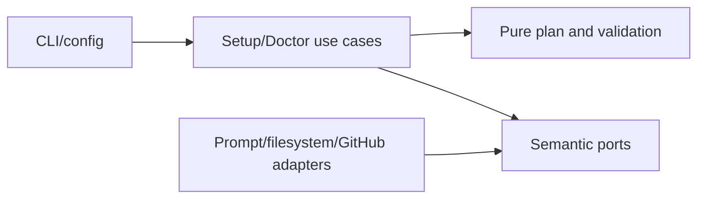

# Setup, Configuration, Credentials, and Doctor

- Status: As-built baseline
- Date: 2026-09-11
- Owners: Copilot maintainers
- Scope: interactive/non-interactive installation planning, file and resource provisioning, credential validation, and read-only diagnosis
- Related issues/PRs: merge-queue readiness SDD
- Required review gates: product UX, architecture, testing, documentation, security/operations
- Open decisions blocking readiness: none for the baseline

## 1. Executive summary

`copilot setup` builds and previews a validated installation plan before writing
workflows, templates, Variables, Secrets, labels, issue types, projects, or the
initial tag. `copilot doctor` inspects the expected contract without changing
repository configuration. The setup PAT is separate from the workflow PAT and
provider credentials; secret values never enter config files or plan objects.

```text
repository + config -> inspect remote -> choose bounded options/storage
                    -> validate credentials/readiness -> preview -> confirm -> provision
repository + same config -> doctor -> pass/warn/fail report only
```

## 2. Problem, current behavior, and evidence

### 2.1 Problem

Installing Copilot spans local files and remote GitHub resources with different
permissions and scopes. Partial or implicit setup can leave workflows present
but unusable, overwrite hand-maintained files, or expose credentials.

### 2.2 Current behavior

1. The CLI verifies it runs at a Git repository root and resolves owner/repo.
2. Defaults and optional YAML/JSON overrides form one typed configuration.
3. The wizard collects choices, inspects remote repository/organization state,
   chooses Secret and Variable storage, validates cross-field rules, and shows a plan.
4. Credential collection validates the setup PAT, checks effective existing
   credentials remotely where possible, and asks to keep/replace/skip.
5. Only confirmed plans provision selected files and GitHub resources; changed
   managed files require approval and backups.
6. Doctor compares the repository to the same expected configuration and emits
   `pass`, `warn`, or `fail` without mutation.

### 2.3 Evidence and contract classification

- Observed behavior: `src/domain/setup.ts`, setup use cases/policies, CLI setup
  and doctor commands, setup adapters, and `setup/` assets.
- Intentional contract: preview/confirmation, separate credentials, bounded
  configuration, preserve-existing storage, backups, and read-only doctor.
- Known debt and limitations: GitHub cannot reveal Secret values; health may be
  `unverifiable`; remote organization access depends on PAT permissions; live
  setup UX has no checked-in capture.
- Unknown rationale: historic defaults predating the typed wizard are not
  assumed intentional unless represented by current policy and docs.
- Proposed improvements: transactional rollback across local and GitHub writes
  would require a separate design.

## 3. Actors, surfaces, and terminology

| Actor | Goal | Entry point | Visible surfaces |
|---|---|---|---|
| Setup owner | install safely | `copilot setup` | prompts, plan, backups |
| Operator | diagnose drift | `copilot doctor` | pass/warn/fail report |
| Organization admin | share credentials/config | storage prompt | org resources/access |
| Workflow runner | use provisioned contract | generated workflows | Actions runs |

The setup PAT authorizes installation only. The workflow PAT is stored as a
Secret for runtime. Provider API keys and runner authentication satisfy agent
credential groups. “Effective” means the repository value or an accessible
organization value that GitHub Actions will expose.

## 4. Goals, non-goals, and fixed invariants

### 4.1 Goals

1. Setup MUST show a complete plan before mutations.
2. Setup and doctor MUST validate the same configuration contract.
3. Secret values MUST never be serialized to configuration, logs, or plans.

### 4.2 Non-goals

1. Setup does not create arbitrary workflow code or execute user scripts.
2. Doctor does not repair drift.
3. Credential health does not promise verification where providers expose no safe check.

### 4.3 Fixed product/safety invariants

1. Invalid setup PAT or invalid required credential blocks provisioning.
2. Changed managed files require explicit approval and backup.
3. `.env` is not a supported credential source.
4. Organization storage MUST be permission-checked and safely scoped.
5. Merge-queue mode fails closed unless workflow support is proven or attested.

## 5. Current versus proposed product journey

| Stage | Earlier/manual risk | As-built contract | Effect |
|---|---|---|---|
| Selection | copy all assets | feature-driven file catalog | smaller installation |
| Credentials | one ambiguous token | setup/workflow/provider separation | least privilege |
| Remote state | overwrite assumptions | inspect + preserve/replace decision | controlled drift |
| Readiness | discovered during release | setup and doctor checks | earlier action |
| Diagnosis | mutation required | read-only doctor | safe audit |

No behavior change is proposed by this baseline.

## 6. Functional behavior and state model

### 6.1 Happy path

1. Load defaults plus bounded overrides.
2. Inspect remote state and choose repository/organization storage.
3. Validate config, merge queue, setup PAT, workflow PAT, and required agent credentials.
4. Show selected files/resources/warnings, confirm, provision, and verify.

### 6.2 Alternative paths

- `--non-interactive` uses explicit config/token and MUST fail on missing decisions.
- `--skip-repository-variables` and `--skip-repository-secrets` leave remote resources untouched.
- Existing valid credentials may be kept; invalid required credentials must be replaced.
- Runner login may satisfy explicitly declared alternative credential groups.

### 6.3 State model

| State | Meaning | Next | Recovery |
|---|---|---|---|
| collecting | local choices incomplete | inspecting/canceled | answer prompt |
| inspecting | remote effective state loading | validating/failed | repair PAT/access |
| validating | cross-field and credential checks | planned/failed | correct config |
| planned | complete preview, no writes | confirmed/canceled | review |
| provisioning | bounded writes underway | complete/partial | use backup/report |
| diagnosing | read-only comparison | healthy/unhealthy | run setup separately |
| complete | selected contract installed | verify workflows | none |

Cancellation before confirmation writes nothing. Partial remote provisioning
retains successful facts and reports remaining work; retries MUST preserve valid
existing resources and avoid duplicate shadowing.

## 7. User-facing configuration

| Group | Recommended default | Bounded alternatives | Persistence/precedence |
|---|---|---|---|
| features | all except inactivity closure | named `SetupFeature` booleans | config file → prompts |
| branches | `master`, `develop`, standard prefixes | non-empty, no whitespace | repository Variables |
| assignment | 1 assignee, 1 reviewer | 0–10 / 0–15 | Variables |
| locales | `en-US` | supported locale strings | Variables |
| agent roles | `codex` / `openai/gpt-5.6-luna` | `codex`, `opencode`, `cursor` + allowed model | Variables |
| Bugbot | low, smart in setup, non-blocking | bounded enums/1–100 comments | Variables |
| storage | repository, preserve existing | repository/org per resource | remote GitHub |
| provisioning | `auto` | `always`, `disabled` | Variable |

Repository values take precedence at runtime over organization values. Storage
scope, visibility (`selected` recommended), and per-resource overrides are
validated. Branch names, counts, enum values, model identifiers, rule length,
deployment combinations, and storage combinations reject invalid input. Safety
rules, secret serialization, backups, and confirmation are not configurable.

## 8. Clean Architecture design

| Boundary | Owns | Must not own/import |
|---|---|---|
| Domain | setup plan/check/value types | prompts/Octokit/fs |
| Policies | defaults, merge, validation, storage, resource plan | terminal UI |
| Use cases | collect, credential decisions, provision, doctor | provider DTOs |
| Ports | prompt, workspace, remote config, secrets, health | secret storage implementation |
| Adapters | terminal, filesystem, Octokit, health workflow | product defaults |
| CLI composition | command flags and concrete wiring | duplicated validation |



Config objects contain names and policies, never secret values. The workspace
adapter owns backups and writes; GitHub adapters own remote error mapping.
Architecture tests and workflow/catalog validators enforce dependencies and
asset parity.

## 9. UI/UX and content contract

```markdown
Pending: **Inspecting existing Copilot resources.** No changes have been made.
Action required: **The workflow `PAT` Secret is missing.** Add or enter it to enable release workflows.
Blocked: **Setup PAT cannot manage repository Variables.** Grant access or choose local-only setup.
Partial: **8 files installed; 1 workflow kept from backup after a remote failure.** Review the listed path.
Complete: **Copilot setup is healthy.** 12 workflows, 8 templates, Variables, and credentials verified.
```

The plan MUST group files, Variables, Secrets by name only, credentials by
status/source scope, warnings, and merge-queue readiness. One confirmation is
the primary action. Secret input is masked. Text and status words accompany
icons; output remains readable at narrow terminal widths. English is the CLI
fallback. Provider messages are summarized and technical causes disclosed later.

## 10. Failure, recovery, and cleanup

| Failure | Impact | Retained facts | Retry | Action | Cleanup |
|---|---|---|---|---|---|
| invalid config | no writes | config file | yes | fix named field | none |
| unverifiable credential | feature may be unsafe | name/scope only | yes | run health/manual check | none |
| denied changed file | file unchanged | backup status | yes | approve/adapt | remove unused backup manually |
| partial GitHub writes | subset installed | resource names/status | yes | rerun preserve-existing | no destructive rollback |
| doctor fail | no mutation | diagnostic report | yes | run setup/fix access | none |

## 11. Security, permissions, and privacy

The setup PAT is read from `--token` or `PERSONAL_ACCESS_TOKEN`, validated, and
not stored. Workflow/provider credentials are requested separately, masked,
validated before write, and represented thereafter only by name/status. Secret
and Variable scopes are independent. The product MUST not expose values through
plan objects, errors, command history suggestions, backups, or doctor output.

## 12. Observability and operational UX

Setup reports the plan, credential checks, merge-queue checks, file decisions,
and provisioning results. Doctor returns a non-zero exit when unhealthy and
distinguishes `pass`, `warn`, and `fail`. Every check names its area and next
action. Logs correlate owner/repository but redact values. No telemetry service
is required.

## 13. Compatibility, migration, rollout, and rollback

Existing unmanaged files remain untouched. Changed managed files require
approval and backup. Absent config uses current defaults; unknown keys or values
fail validation rather than being guessed. Removing a feature does not
destructively delete remote resources. Rollback uses backups and the previous
workflow revision; successful remote writes are reported for manual reversal.

## 14. Testing strategy and numeric budget

| Area | Minimum cases | Risks |
|---|---:|---|
| Defaults/config/storage policy | 24 | bounds, precedence, cross-fields |
| Wizard/state/idempotency | 18 | cancel, preserve, replace, partial retry |
| Credentials/provider adapters | 18 | valid/invalid/missing/unverifiable/groups |
| Workflows/assets/schema | 14 | selection, parity, readiness, permissions |
| Prompt/CLI UX/sanitization | 12 | masking, status order, non-interactive |
| Integration/security/migration | 12 | backup, org scope, doctor, no `.env` |
| **Total** | **98** | no double counting |

Global coverage thresholds remain; new pure policies SHOULD reach 95% branch
coverage. Tests use temporary directories, fake prompts and GitHub adapters, no
live services. Workflow checks parse YAML. Manual evidence covers terminal
widths, canceled prompts, secret masking, and GitHub permission variants.

## 15. Documentation and discoverability

| Audience | Artifact | Required content |
|---|---|---|
| User | `docs/how-to-use.mdx` | normal setup path and plan |
| Setup owner | configuration checklist/provisioning | permissions and storage |
| Operator | CLI workflow/doctor + troubleshooting | diagnosis/recovery |
| Contributor | this SDD and architecture | policy/port/adapter ownership |

## 16. Acceptance scenarios

1. Given defaults, setup previews selected workflows/templates/resources before writing.
2. Given non-interactive missing required input, setup fails without prompting or writes.
3. Given valid organization Secret and preserve-existing, no repository shadow is created.
4. Given invalid required existing credential, setup requires replacement.
5. Given canceled confirmation, local and GitHub state are unchanged.
6. Given a changed managed file, setup backs up before approved replacement.
7. Given doctor, no mutation port is called and unhealthy state returns non-zero.
8. Given merge-queue without proven support, setup/doctor reports fail closed.
9. Given output inspection, no secret value appears.

## 17. Requirements traceability

| Requirement | Owner | Evidence | Documentation |
|---|---|---|---|
| bounded plan | setup policies/wizard | setup wizard tests | how-to-use |
| credential separation | credential use case/ports | credential tests | credentials |
| safe files | workspace adapter | workspace tests | provisioning |
| read-only doctor | doctor use case/composition | doctor tests | workflow-and-cli |
| readiness | readiness use case | readiness tests | checklist |

## 18. Maintenance sequence

1. Update typed configuration/defaults/validation and tests.
2. Update plan, credential, and doctor use cases.
3. Update adapters/assets with backup and contract tests.
4. Update prompts, examples, docs, and catalog.
5. Run unit, integration, workflow, documentation, and specification gates.

## 19. Definition of Done

- [ ] Every new option has default, bounds, precedence, persistence, migration, and security rules.
- [ ] The 98-case budget and coverage thresholds pass.
- [ ] Setup cancel/retry/partial state and doctor read-only behavior pass.
- [ ] Secrets are absent from plans, config, logs, errors, and backups.
- [ ] Workflow/assets, documentation, and catalog checks pass.
- [ ] Human terminal and permission-path UX evidence is captured.

## 20. References and decisions

- Primary sources: catalogued setup code, tests, assets, and docs.
- Related SDD: `merge-queue-readiness.md`.
- Decision: one configuration policy serves setup, doctor, and workflow inputs.
- Rejected: storing credentials in YAML/JSON or silently overwriting managed files.
- Follow-up: cross-provider transactional rollback is outside this baseline.
