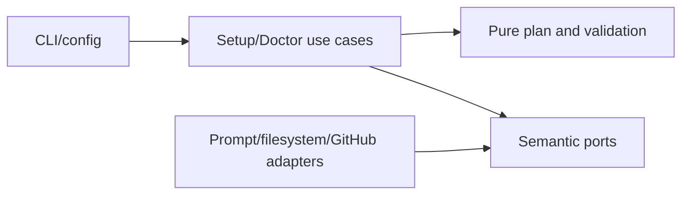

# Setup, Configuration, Credentials, and Doctor

- Status: Implemented — automated architecture, UX, documentation, and coverage gates complete; controlled live GitHub permission-path evidence remains external
- Date: 2026-09-11
- Last updated: 2026-09-21
- Catalog capability ID: `setup-and-doctor`
- Last verified: 2026-09-21
- Owners: Copilot maintainers
- Scope: interactive/non-interactive installation planning, file and resource provisioning, credential validation, and read-only diagnosis
- Related issues/PRs: merge-queue readiness SDD; architecture quality and
  scalability hardening SDD
- Required review gates: product UX, architecture, testing, documentation, security/operations
- Open decisions blocking readiness: none for the baseline

## 1. Executive summary

`copilot setup` builds and previews a validated installation plan before writing
workflows, templates, Variables, Secrets, labels, issue types, projects, or the
initial tag. `copilot doctor` inspects the expected contract without changing
repository configuration. The setup PAT is separate from the workflow PAT and
provider credentials; secret values never enter config files or plan objects.

```text
repository + config -> inspect remote -> choose bounded options/storage
                    -> validate credentials/readiness -> preview -> confirm -> provision
repository + same config -> doctor -> pass/warn/fail/skipped report only
```

## 2. Problem, current behavior, and evidence

### 2.1 Problem

Installing Copilot spans local files and remote GitHub resources with different
permissions and scopes. Partial or implicit setup can leave workflows present
but unusable, overwrite hand-maintained files, or expose credentials.

### 2.2 Current behavior

1. The CLI verifies it runs at a Git repository root and resolves owner/repo.
2. Defaults and optional YAML/JSON overrides form one typed configuration.
3. An immutable questionnaire collects choices, inspects remote
   repository/organization state, chooses Secret and Variable storage, validates
   cross-field rules, and shows a plan without giving terminal code product policy.
4. Credential collection validates the setup PAT, checks effective existing
   credentials remotely where possible, and asks to keep/replace/skip.
5. Only confirmed plans provision selected files and GitHub resources; changed
   managed files require approval and backups.
6. Doctor compares the repository to the same expected configuration and emits
   stable, ordered `pass`, `warn`, `fail`, or dependency-blocked `skipped`
   checks without mutation. Local checks continue after setup-PAT failure. One
   resolved repository-locale catalog supplies every human heading, summary,
   state, and action in the report; the default and atomic fallback are English.

### 2.3 Evidence and contract classification

- Observed behavior: `src/domain/setup.ts`, setup use cases/policies, CLI setup
  and doctor commands, setup adapters, and `setup/` assets.
- Intentional contract: preview/confirmation, separate credentials, bounded
  configuration, preserve-existing storage, backups, and read-only doctor.
- Known limitations: GitHub cannot reveal Secret values or a complete inventory
  of fine-grained PAT grants; health and write permission evidence may be
  `unverifiable`; controlled live GitHub permission-path evidence remains an
  external rollout check.
- Unknown rationale: historic defaults predating the typed wizard are not
  assumed intentional unless represented by current policy and docs.
- Implemented hardening: questionnaire/terminal separation, named doctor checks,
  pure report policy, and narrow remote query/command adapters are specified in
  [`setup-doctor-architecture-hardening.md`](./setup-doctor-architecture-hardening.md),
  under the shared gates in
  [`architecture-quality-and-scalability-hardening.md`](./architecture-quality-and-scalability-hardening.md).
  Role-specific PAT guidance and safe permission evidence are specified in
  [`setup-pat-permission-guidance-and-verification.md`](./setup-pat-permission-guidance-and-verification.md).
  Transactional rollback across local and GitHub writes requires a separate design.

## 3. Actors, surfaces, and terminology

| Actor | Goal | Entry point | Visible surfaces |
|---|---|---|---|
| Setup owner | install safely | `copilot setup` | prompts, plan, backups |
| Operator | diagnose drift | `copilot doctor` | pass/warn/fail/skipped report |
| Organization admin | share credentials/config | storage prompt | org resources/access |
| Workflow runner | use provisioned contract | generated workflows | Actions runs |

The setup PAT authorizes installation only. The workflow PAT is stored as a
Secret for runtime. Provider API keys and runner authentication satisfy agent
credential groups. “Effective” means the repository value or an accessible
organization value that GitHub Actions will expose.

## 4. Goals, non-goals, and fixed invariants

### 4.1 Goals

1. Setup MUST show a complete plan before mutations.
2. Setup and doctor MUST validate the same configuration contract.
3. Secret values MUST never be serialized to configuration, logs, or plans.

### 4.2 Non-goals

1. Setup does not create arbitrary workflow code or execute user scripts.
2. Doctor does not repair drift.
3. Credential health does not promise verification where providers expose no safe check.

### 4.3 Fixed product/safety invariants

1. Invalid setup PAT or invalid required credential blocks provisioning.
2. Changed managed files require explicit approval and backup.
3. `.env` is not a supported credential source.
4. Organization storage MUST be permission-checked and safely scoped.
5. Merge-queue mode fails closed unless workflow support is proven or attested.
6. Setup remains authoritative English while it creates the repository profile;
   subsequent doctor output uses the configured repository locale. Issue and
   pull-request overrides never select setup or doctor language.
7. Raw PAT, credential-health, rule, and workflow-provider messages never enter
   a setup plan or doctor report.

## 5. Current versus proposed product journey

| Stage | Earlier/manual risk | As-built contract | Effect |
|---|---|---|---|
| Selection | copy all assets | feature-driven file catalog | smaller installation |
| Credentials | one ambiguous token | setup/workflow/provider separation | least privilege |
| Remote state | overwrite assumptions | inspect + preserve/replace decision | controlled drift |
| Readiness | discovered during release | setup and doctor checks | earlier action |
| Diagnosis | mutation required | read-only doctor | safe audit |

The architecture hardening preserves the product contract while making
cancellation, skipped diagnosis, ordering, and read-only authority explicit.

## 6. Functional behavior and state model

### 6.1 Happy path

1. Load defaults plus bounded overrides.
2. Inspect remote state and choose repository/organization storage.
3. Validate config, merge queue, setup PAT, workflow PAT, and required agent credentials.
4. Show selected files/resources/warnings, confirm, provision, and verify.

### 6.2 Alternative paths

- `--non-interactive` creates no terminal; it uses defaults, explicit config,
  flags, and credentials, and MUST fail on missing external inputs.
- `--yes` approves only the final plan and never supplies a missing decision.
- `--skip-variables` and `--skip-secrets` leave those remote resource classes untouched.
- Existing valid credentials may be kept only when the effective storage policy
  preserves their current scope. Disabling `preserveExisting`, or selecting an
  explicit per-resource override that moves the Secret to another scope,
  converts `keep` into a replacement flow; setup MUST collect and validate the
  value before provisioning the selected target. An explicit override that
  names the already-effective scope does not require a redundant rewrite.
- Invalid required credentials must be replaced.
- Runner login may satisfy explicitly declared alternative credential groups.

### 6.3 State model

Questionnaire state order is exact and forward-only:

```text
capabilities -> agent-runtime -> agent-model-defaults -> agent-role-overrides
-> repository -> deployment -> bugbot -> projects -> provisioning -> storage
-> review -> confirmation -> completed
```

Any active state can transition to `cancelled`. Conditional states are skipped
by policy when irrelevant; there is no legacy state alias or back-navigation
mode. After questionnaire completion, credential validation and provisioning
remain separate application flows.

Cancellation before confirmation writes nothing. Partial remote provisioning
retains successful facts and reports remaining work; retries MUST preserve valid
existing resources and avoid duplicate shadowing.

## 7. User-facing configuration

| Group | Recommended default | Bounded alternatives | Persistence/precedence |
|---|---|---|---|
| features | all except inactivity closure | named `SetupFeature` booleans | config file → prompts |
| branches | `master`, `develop`, standard prefixes | non-empty, no whitespace | repository Variables |
| assignment | 1 assignee, 1 reviewer | 0–10 / 0–15 | Variables |
| locales | repository `en-US`; issue/PR inherit | any valid canonical BCP-47 tag; reviewed `en`/`es`, dynamic otherwise | Variables; repository → issue/PR inheritance |
| agent roles | `codex` / `openai/gpt-5.6-luna` | `codex`, `opencode`, `cursor` + allowed model | Variables |
| Bugbot | low, smart in setup, non-blocking | bounded enums/1–100 comments | Variables |
| storage | repository, preserve existing | repository/org per resource | remote GitHub |
| provisioning | `auto` | `always`, `disabled` | Variable |

Repository values take precedence at runtime over organization values. Storage
scope, visibility (`selected` recommended), and per-resource overrides are
validated. Branch names, counts, enum values, model identifiers, rule length,
deployment combinations, and storage combinations reject invalid input. Safety
rules, secret serialization, backups, and confirmation are not configurable.

## 8. Clean Architecture design

| Boundary | Owns | Must not own/import |
|---|---|---|
| Domain | setup plan/check/value types | prompts/Octokit/fs |
| Policies | defaults, immutable clone/questionnaire, validation, storage, plans, typed message catalogs, doctor report | terminal I/O or language/provider selection |
| Use cases | drive questionnaire, credential decisions, provision, doctor probes, resolve one complete doctor catalog | provider DTOs or feature-local language branches |
| Ports | raw terminal, render/present/confirm, workspace, narrow remote queries/commands, health | provider implementation |
| Adapters | terminal mechanics, presenters, filesystem, narrow Octokit reads/writes, health query/bootstrap | product defaults/question order |
| CLI composition | command flags and concrete wiring | duplicated validation |



Config objects contain names and policies, never secret values. The workspace
adapter owns backups and writes; GitHub adapters own remote error mapping.
Architecture tests and workflow/catalog validators enforce dependencies and
asset parity.

## 9. UI/UX and content contract

```markdown
Pending: **Inspecting existing Copilot resources.** No changes have been made.
Action required: **The workflow `PAT` Secret is missing.** Add or enter it to enable release workflows.
Blocked: **Setup PAT cannot manage repository Variables.** Grant access or choose local-only setup.
Partial: **8 files installed; 1 workflow kept from backup after a remote failure.** Review the listed path.
Complete: **Copilot setup is healthy.** 12 workflows, 8 templates, Variables, and credentials verified.
```

The plan MUST group files, Variables, Secrets by name only, credentials by
status/source scope, warnings, and merge-queue readiness. One confirmation is
the primary action. Secret input is masked. Text and status words accompany
icons; output remains readable at narrow terminal widths. Setup is English while
creating the profile. Doctor uses the repository locale: English and Spanish are
bundled, other valid locales use one bounded complete-catalog request, and any
unavailable or invalid dynamic response falls back atomically to English.
Provider messages are replaced by stable semantic reasons and one concrete
recovery action rather than echoed or partially translated.

Plan warnings derive only from the validated current setup configuration and
current readiness facts. Callers cannot inject migration, compatibility, or
arbitrary warning text into the pure plan builder.

## 10. Failure, recovery, and cleanup

| Failure | Impact | Retained facts | Retry | Action | Cleanup |
|---|---|---|---|---|---|
| invalid config | no writes | config file | yes | fix named field | none |
| unverifiable credential | feature may be unsafe | name/scope only | yes | run health/manual check | none |
| denied changed file | file unchanged | backup status | yes | approve/adapt | remove unused backup manually |
| partial GitHub writes | subset installed | resource names/status | yes | rerun preserve-existing | no destructive rollback |
| doctor fail | no mutation | diagnostic report | yes | run setup/fix access | none |

## 11. Security, permissions, and privacy

The setup PAT is read from `--token` or `PERSONAL_ACCESS_TOKEN`, validated, and
not stored. Workflow/provider credentials are requested separately, masked,
validated before write, and represented thereafter only by name/status. Secret
and Variable scopes are independent. The product MUST not expose values through
plan objects, errors, command history suggestions, backups, or doctor output.

## 12. Observability and operational UX

Setup reports the plan, credential checks, merge-queue checks, file decisions,
and provisioning results. Doctor returns a non-zero exit exactly when at least
one check is `fail`; `warn` and `skipped` preserve a successful exit when no
failure exists. Every check has a stable ID, status, summary, safe evidence,
blocker IDs, and an action where useful. Reports render in declared order even
when independent read-only probes complete out of order. Logs correlate
owner/repository but redact values. Catalog resolution records requested locale,
resolved locale, exact/base/dynamic/fallback source, descriptor count, and a
stable fallback reason without storing prose. No telemetry service is required.

## 13. Compatibility, migration, rollout, and rollback

There are no installed users, external API consumers, or production setup state
to migrate. The implementation is a greenfield cutover: no compatibility
adapter, deprecated result shape, dual reader/writer, state alias, or legacy test
suite remains. Existing unmanaged repository files are still product data and
remain untouched; changed managed files require approval and backup. Unknown
keys or values fail validation rather than being guessed. Rollback uses backups
and the previous workflow revision; successful remote writes are reported for
manual reversal.

## 14. Testing strategy and numeric budget

| Area | Minimum cases | Risks |
|---|---:|---|
| Defaults/config/storage policy | 26 | bounds, precedence, cross-fields, keep-versus-replace decisions for disabled preservation and scope-moving overrides |
| Questionnaire/wizard/idempotency | 18 | transitions, immutability, cancel, preserve, replace |
| Credentials/provider adapters | 18 | valid/invalid/missing/unverifiable/groups |
| Workflows/assets/schema | 14 | selection, parity, readiness, permissions |
| Prompt/CLI UX/sanitization/localization | 18 | masking, status order, non-interactive, English default, Spanish exact/base, arbitrary locale, atomic fallback, hostile diagnostic suppression |
| Integration/security/cutover | 12 | backup, org scope, doctor, no `.env` |
| **Total** | **106** | no double counting |

Global coverage thresholds remain; questionnaire, doctor catalog/report, shared
merge-readiness message, and doctor presenter policies MUST reach 100%
statements/branches/functions/lines, and changed setup
application modules MUST reach at least 90% branch coverage. Tests use temporary directories, fake prompts and GitHub adapters, no
live services. Workflow checks parse YAML. Manual evidence covers terminal
widths, canceled prompts, secret masking, and GitHub permission variants.

## 15. Documentation and discoverability

| Audience | Artifact | Required content |
|---|---|---|
| User | `docs/how-to-use.mdx` | normal setup path and plan |
| Setup owner | configuration checklist/provisioning | permissions and storage |
| Operator | CLI workflow/doctor + troubleshooting | diagnosis/recovery |
| Contributor | this SDD and architecture | policy/port/adapter ownership |

## 16. Acceptance scenarios

1. Given defaults, setup previews selected workflows/templates/resources before writing.
2. Given non-interactive missing required input, setup fails without prompting or writes.
3. Given valid organization Secret and preserve-existing, no repository shadow is created.
4. Given invalid required existing credential, setup requires replacement.
5. Given canceled confirmation, local and GitHub state are unchanged.
6. Given a changed managed file, setup backs up before approved replacement.
7. Given doctor, no mutation port is called and unhealthy state returns non-zero.
8. Given merge-queue without proven support, setup/doctor reports fail closed.
9. Given output inspection, no secret value appears.
10. Given no explicit locale, doctor renders one complete English report.
11. Given `es-MX`, doctor resolves the reviewed Spanish base catalog while
    keeping check IDs, enums, branch names, and credential names unchanged.
12. Given a valid non-bundled locale, doctor requests one complete catalog and
    reuses it for report checks, merge readiness, and terminal presentation.
13. Given an invalid dynamic catalog response, every human string in the doctor
    artifact falls back to English rather than mixing languages.
14. Given hostile PAT, credential-health, or rule-provider prose, doctor omits
    the raw value and renders only the catalogued reason and recovery action.
15. Given an existing valid Secret and `preserveExisting: false`, choosing
    `keep` cannot satisfy the requirement; setup requests and validates a value
    and provisions the configured target, or fails before mutation when no
    value is available.
16. Given an existing valid organization Secret and an explicit repository
    override, choosing `keep` follows the same replacement path; an explicit
    organization override may keep it because the effective scope does not move.

## 17. Requirements traceability

| Requirement | Owner | Evidence | Documentation |
|---|---|---|---|
| bounded plan | setup policies/wizard | setup wizard tests | how-to-use |
| credential separation | credential use case/ports | credential tests | credentials |
| policy-safe existing credentials | storage policy + credential use case | disabled-preservation and scope-move tests | credentials/provisioning |
| safe files | workspace adapter | workspace tests | provisioning |
| read-only doctor | doctor use case/composition | doctor tests | workflow-and-cli |
| readiness | readiness use case | readiness tests | checklist |

## 18. Maintenance sequence

1. Update typed configuration/defaults/validation and tests.
2. Update plan, credential, and doctor use cases.
3. Update adapters/assets with backup and contract tests.
4. Update prompts, examples, docs, and catalog.
5. Run unit, integration, workflow, documentation, and specification gates.

## 19. Definition of Done

- [x] Every new option has default, bounds, precedence, persistence, retirement/rejection, and security rules.
- [x] The 106-case budget and coverage thresholds pass.
- [x] Setup cancel/retry/partial state and doctor read-only behavior pass.
- [x] Secrets are absent from plans, config, logs, errors, and backups.
- [x] Workflow/assets, documentation, and catalog checks pass.
- [ ] Human terminal and permission-path UX evidence is captured.

## 20. References and decisions

- Primary sources: catalogued setup code, tests, assets, and docs.
- Related SDD: `merge-queue-readiness.md`.
- Implemented hardening: `setup-doctor-architecture-hardening.md` owns setup questionnaire,
  doctor, and remote configuration adapter decomposition; the architecture
  hardening SDD owns shared sequencing and verification gates.
- Permission companion: `setup-pat-permission-guidance-and-verification.md`
  owns the pre-prompt matrices, post-entry evidence states, and read-only probe
  boundary for setup and workflow PATs.
- Decision: one configuration policy serves setup, doctor, and workflow inputs.
- Rejected: storing credentials in YAML/JSON or silently overwriting managed files.
- Follow-up: cross-provider transactional rollback is outside this baseline.
