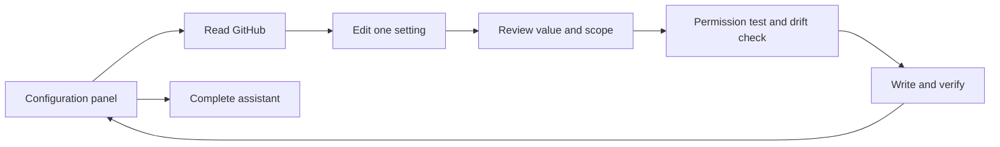
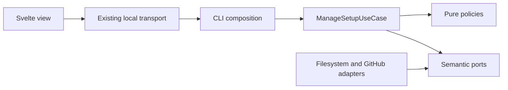

# Copilot configuration panel and focused adjustments

- Status: Implementation in progress
- Date: 2026-10-08
- Catalog capability ID: `local-web-setup-assistant`
- Last verified: 2026-10-08
- Owners: Copilot maintainers; product, architecture, security and accessibility reviewers
- Scope: inspect the configuration of the current checkout and safely edit independent runtime settings through `copilot setup --web`
- Related issues/PRs: [PR #411](https://github.com/vypdev/copilot/pull/411)
- Required review gates: human UX, Clean Architecture, provider contracts, coverage, documentation, packaging, reconfiguration evidence
- Open decisions blocking readiness: none; evidence gates below remain explicit until verified

## 1. Executive summary

Opening web setup MUST begin with a configuration panel after repository confirmation and browser pairing. A new repository explains that Copilot is not configured and offers **Start setup**. An existing repository offers **Read configuration from GitHub**, **Quick adjustments**, and **Run the complete assistant**. Reading the panel MUST NOT mutate anything or request a bot PAT.

```text
Confirm repository -> Configuration panel -> Read GitHub (optional setup PAT)
  -> Choose one adjustment -> Review current/new value and affected scope
  -> Test only Variables Write -> Recheck -> Write one Variable -> Read back
  -> Configuration panel again, or Close local session
Configuration panel -> Complete assistant -> existing approved setup pipeline
```

Text equivalent: inspection, small edits, and full installation have distinct entry actions. Only the reviewed adjustment can cross the write boundary. The complete assistant retains its existing permissions, credential and workflow-override gates.

## 2. Problem, current behavior, and evidence

### 2.1 Problem

A maintainer should not repeat account onboarding, credential collection and every installation question to change a review limit. Repeated installations also need truthful evidence about existing repository overrides and shared organization configuration.

### 2.2 Current behavior

The pre-change `setup_execution.ts` always opens the questionnaire. Setup manifests describe generated collaborator guidance, not a complete effective runtime configuration. GitHub Variable values are readable; Secret values are not. Workflow inputs can use Variables, literals, fallbacks, complex expressions or environments. A local checkout alone cannot certify what currently runs on the default branch.

### 2.3 Evidence

Sources: `setup_execution.ts`, `setup_configuration_plan.ts`, `setup_management_workspace_adapter.ts`, `github_actions_resource_inspector.ts`, `setup_token_permissions_use_case.ts`, and existing setup/doctor SDDs. The 2026-10-08 authorized dogfooding applied organization resources successfully; its doctor separately reported readiness limitations. These are distinct outcomes.

### 2.4 Retrospective classification

Not applicable: this is a new management journey. Existing CLI and full-wizard behavior remain compatibility baselines.

## 3. Actors, surfaces, and terminology

| Actor | Goal | Surface |
|---|---|---|
| Repository maintainer | Understand and adjust Copilot | Paired local browser panel |
| Organization maintainer | Understand shared impact before writing | Explicit scope warning and approval |
| Operator | Repair partial writes or limited access | Refreshed panel, GitHub settings, terminal and doctor |

**Detected** describes actual Copilot Action references in local workflows. **Unconfigured** means no such reference and no unreadable installation evidence. **Incomplete** means inspection failed or guidance exists without a detected Action. **Current value** is a readable repository/organization value interpreted through an understood local workflow binding. **Not verified** MUST remain distinct from absent, disabled, valid, or installed. Secret presence MUST NOT be called credential validity.

## 4. Goals, non-goals, and fixed invariants

### 4.1 Goals

1. Explain the installation without requiring knowledge of Variable names.
2. Expose all inspected non-secret workflow inputs, referenced GitHub Variables, source scopes and Secret names through progressive disclosure.
3. Apply one independent adjustment, verify it, and permit another adjustment in the same session.
4. Preserve unrelated configuration and route structural changes through the complete assistant.

### 4.2 Non-goals

Hosted configuration management, arbitrary Variable editors, automatic Secret reading/rotation, default-branch deployment, branch-rule mutation, environment inspection, automatic remote rollback, or certification of runner authentication. Reconfiguration does not silently move existing resources between scopes. The complete assistant intentionally remains an explicit fresh questionnaire; its defaults MUST NOT be represented as a reconstruction of existing custom configuration.

### 4.3 Fixed product/safety invariants

No GET/open/connect mutation; no bot PAT for quick edits; no arbitrary setting IDs or scopes; no secret-bearing view; no write before current explicit approval; no structural change through a quick edit; no failure masked as success; no skipped unknown inventory interpreted as absence.

## 5. Current versus proposed product journey

| Entry | Before | Now |
|---|---|---|
| New checkout | Questionnaire begins | Explain missing configuration and offer Start setup |
| Configured checkout | Repeat full setup | Inspect first, edit one setting or choose complete assistant |
| Limited access | Often terminates setup | Preserve panel; reconnect with a corrected setup PAT |
| Adjusted setting | Full installer may affect unrelated resources | One reviewed Variable; panel refresh and read-back |



Text equivalent: a quick adjustment returns to inspection after successful verification. Full setup is a separate explicit action with its existing safeguards.

## 6. Functional behavior and state model

### 6.1 Happy path

1. Inspect bounded regular local workflow files without executing them. Detect `vypdev/copilot@ref` references, or `./` with bounded metadata identifying this repository’s own Copilot Action and non-secret Action inputs. Guidance-only or unreadable evidence produces incomplete, never unconfigured.
2. Show local evidence immediately. Remote inventories start not connected. Request a masked optional setup PAT only when the operator chooses to read GitHub.
3. Resolve repository precedence over organization and each understood workflow fallback. Complex expressions, literals inconsistent across workflows, environment-scoped jobs, input environment overrides, unknown owner types, unreadable files, secret-shaped values and inaccessible inventories disable the affected quick edit.
4. Choose one supported adjustment and validate it in the application. Unsupported or unchanged values MUST NOT write or run permission probes.
5. Review old/new value, scope and shared impact. Cancel returns to the panel, retaining all applied configuration.
6. After approval, test Metadata Read, Variables Read for scope precedence, and Variables Write only in the selected scope using the existing cleanup-verified permission transaction. No Actions, Issue, PR, Project or Secret write is requested.
7. Read the selected Variable at both scopes and the checkout again. Any changed fingerprint invalidates approval and refreshes the panel.
8. Write exactly one named Variable through the existing command port. Preserve existing organization visibility/access. Read it back and require matching value and scope before claiming success.
9. Return to the panel with success feedback; additional edits require independent approvals. An explicit Finish reports successful completion of inspection or adjustment. It never requires an installation mutation or certifies a full installation.

### 6.2 Alternatives

A blank PAT, cancelled edit or declined preview returns to inspection. Permission denial permits a corrected token and new review. Unconfirmed cleanup or write/read-back failure stops as partial and requires inspection. Starting the complete assistant creates a fresh installation journey. Earlier verified quick changes remain recorded; cancelling that later journey cannot be reported as no changes. Earlier changes do not prevent revisiting the new local answers before PAT entry. The complete assistant uses the existing full workflow, including bot verification, storage conflicts, optional API keys, workflow overrides and automatic tag policy.

### 6.3 State machine

| State | Visible meaning | Next action |
|---|---|---|
| Local inspection | Local configuration detected; GitHub not connected | Read GitHub or complete assistant |
| Unconfigured | No Copilot Action installation detected | Start setup |
| Incomplete | Some files or scopes could not be read | Repair access or run assistant deliberately |
| Edit | One value selected; no write | Review or Back |
| Review | Current/new value and affected scope | Approve or Back |
| Checking | Temporary Variable permission transaction and drift recheck | Wait for cleanup |
| Updated | One write read back successfully | Another edit or Close |
| Partial | A write or cleanup cannot be confirmed | Inspect GitHub; no automatic rollback |

Duplicate/stale browser submissions retain the existing revision/capability rejection. A management use case MUST run at most once. Cancellation/takeover/expiry MUST NOT authorize a new write; liveness is checked after each asynchronous preparation boundary.

## 7. User-facing configuration

Quick-edit inputs are an allowlist from `setup_quick_settings_policy.ts`:

| Setting | Values | Scope |
|---|---|---|
| Issue assignees / PR reviewers | Integers 0–10 / 0–15 | Existing effective scope; repository if no Variable exists |
| Waiting-issue inactivity | Integer hours 1–8760 | Same; only with a matching installed workflow binding |
| Reopen after push, members-only AI, include reasoning | true/false | Same |
| PR description updates | replace/append/preserve/disabled | Same |
| Minimum finding severity | info/low/medium/high | Same |
| Review comment limit | Integer 1–100 | Same |
| Review depth | smart/low/default/high | Same |
| Preview without publication, drafts, suggestions, metrics | true/false | Same |

Existing values are the default. No scope movement, resource deletion or runtime safety override is configurable here. Example: change the organization review comment limit from 20 to 15 after reviewing shared impact. Alternative: change the existing repository limit from 20 to 25, affecting only that repository. Unknown/future workflow expressions remain inspectable but require the full assistant. Workflows with literals are not rewritten through this path.

## 8. Clean Architecture design

### 8.1 Responsibilities and dependency direction

| Boundary | Owns | Forbidden responsibility |
|---|---|---|
| Domain | Installation/input facts and immutable change | Filesystem, HTTP, SDK or browser |
| Pure policy | Value validation, precedence, edit eligibility, fingerprint, narrow permissions | Provider writes or presentation transport |
| Application use case | Inspect/edit/review/audit/recheck/write/read-back ordering | Concrete adapters, browser state or CLI |
| Ports | Semantic inspection, approval, audit and one-variable write | SDK request DTOs |
| Workspace/GitHub adapters | Bounded YAML/file inspection; existing provider inventory/mutations | Selection or approval policy |
| CLI composition | Wire ports, capture checkout identity, revision-bound prompts | Duplicate edit transaction |
| Svelte presentation | Localized labels, hierarchy, controls, escaping | Mutation selection or provider calls |



Text equivalent: the browser sends bounded choices; the application decides what is permissible and owns the transaction; adapters translate approved operations.

### 8.2 Contracts, state, and trust boundaries

All management state is ephemeral. Tokens remain process memory only and MUST NOT enter JSON views, fingerprints exposed to browsers, logs, URLs, config or saved drafts. Local files and browser values are untrusted. The approval fingerprint covers checkout revision, parsed workflow and local Action metadata digests, owner/repository identity, both Variable inventories' access and the selected Variable at both scopes. Fingerprints remain application-side. No new persistent configuration schema or migration is introduced.

### 8.3 Executable architecture constraints

Extend the transitive web/setup architecture suite to cover the management use case and policies. Browser imports remain type-only through `web_setup_view.ts`. Each new implementation module MUST be at most 220 lines; Svelte components at most 90. Presentation/transport/provider policy remain separate. Dependency, coverage, package and workflow gates continue to run.

## 9. UI/UX and content contract

### 9.1 Information hierarchy

Status, repository target, next action, common adjustments, credential metadata, then expanded technical settings. Disabled edits explain that GitHub must be connected or the workflow needs the complete assistant. Lists grow naturally with page content; no fixed-height inner scrolling. Return and apply controls use left/right navigation. Use semantic headings, associated labels, clear focus, native buttons/selects and keyboard form submission. English, Spanish, French and Portuguese remain supported; light/dark and narrow widths use existing tokens.

### 9.2 Representative primary views

```text
Your Copilot configuration
Configuration detected in this checkout
[Read configuration from GitHub] [Run the complete assistant]
Quick adjustments
  Maximum review comments   20 · Organization   [Change]
Credentials
  PAT · Organization — presence only; value and permissions unavailable
[All GitHub settings used by workflows ▸] [All workflow settings ▸]
[Close local session]
```

Pending: “Reading GitHub configuration. No changes have started.”
Unconfigured: “Copilot is not configured in this checkout. Start setup.”
Review: “Maximum review comments: 20 → 15. Organization. This affects every repository with access. [Back] [Apply this adjustment]”
Blocked: “Access could not be confirmed. Reconnect with a corrected setup PAT; your configuration is preserved.”
Stale: “The configuration changed during review. Review the refreshed value; nothing was written.”
Partial: “The write could not be confirmed. Inspect GitHub before retrying; the previous value was not restored automatically.”
Complete: “Adjustment applied and read back from GitHub. Make another adjustment or close.”
Inspection finished: “Configuration inspection finished. No installed setting was changed.”
An explicit Finish closes successfully even without edits; cancelling the session retains the cancellation result.

### 9.3 Issue, PR, and comment behavior

Not applicable to operation: management creates no issue/PR/comment and changes no lifecycle label. The implementation PR documents verification evidence; no automated discussion spam is added.

### 9.4 Accessibility, localization, responsive behavior

No color-only status; long values wrap; details have textual summaries; unknown values have explicit labels. Secrets and dangerous raw provider diagnostics are omitted/redacted before rendering. Dynamic file/Variable names are escaped as text. Native focus and keyboard behavior plus narrow/light/dark screenshots supplement automated semantic rendering. Human screen-reader certification remains an evidence gate rather than an inferred pass.

## 10. Failure, recovery, and cleanup

| Condition | Impact | Recovery |
|---|---|---|
| Read denied/rate-limited | No write; current values unknown | Reconnect or retry inspection |
| Malformed, linked, oversized or excessive local files | Incomplete installation; edits disabled | Inspect files; full assistant deliberately |
| Invalid/no-op/cancelled adjustment | No probe or write | Return to panel |
| Permission denied with confirmed cleanup | Existing configuration retained | Correct PAT; review again |
| Unconfirmed cleanup | Temporary Variable may remain | Stop partial; journal/GitHub inspection |
| Drift between review and final read | No Variable write | Refreshed value; approve again |
| Write rejected or read-back differs/unavailable | Could be partially applied | Inspect GitHub; no automatic rollback |

GitHub provides no conditional compare-and-swap for Variable update. The final recheck reduces stale writes but cannot prevent an independent writer racing between recheck and write. Post-write mismatch is partial, never success. Organization edits explicitly disclose shared impact. No automatic retries after write uncertainty.

## 11. Security, permissions, and privacy

Existing pairing, origin, CSRF, controller lease, size, session lock and no-storage rules apply. Inspection is read-only and requests metadata/Variables/Secret-name reads. Quick edits request only Metadata Read plus Variables Write for the selected scope. Bot PATs and API keys are never requested by quick edits. Secret ownership/permissions cannot be inferred from names. Raw Variable values unrelated to inspected Copilot inputs are not exposed. No telemetry or external assets are introduced.

## 12. Observability and operational UX

The browser displays semantic inspection, unchanged, stale, blocked, updated and partial states. Existing permission progress exposes temporary transaction cleanup. Successful writes produce a value-free Variable receipt; partial results remain distinct from installation success. No issue/comment notification is generated. Diagnostic references retain existing redaction rules.

## 13. Compatibility, migration, rollout, and rollback

Terminal and non-interactive setup stay unchanged. Existing installations require no new snapshot: workflows and current readable Variables are inspected. Future/complex custom bindings remain unknown instead of being guessed. Full-wizard runs remain explicit and retain override/preserve policies. No automatic remote rollback; declining a preview changes nothing. Every dogfooding iteration archives and inspects generated workflows, forms and guidance, then discards those changes. This repository's checked-in configuration is the product baseline and MUST remain unchanged in implementation commits.

## 14. Testing strategy and numeric budget

Minimum **96 distinct new cases**, separate from the existing 350-case web-assistant ledger:

| Area | Minimum | Risks |
|---|---:|---|
| Pure policies and bounded configuration | 26 | Precedence, literal/fallback/expression/environment, validation, unknown scopes, redaction |
| Application state/order/replay | 24 | Cancel, no-op, approval, denial, cleanup, drift, liveness, read-back, multiple edits |
| Workspace/provider adapter contracts | 14 | YAML, symlinks, file/count limits, malformed data, both mutation scopes |
| Presentation/localization | 20 | Four languages, labels, warnings, escaping, disabled controls, native forms, page scrolling |
| CLI/transport/architecture integration | 12 | Revision rejection, wizard handoff, single-use execution, receipts, package boundaries |
| **Total** | **96** | No duplicated counts |

All new executable TypeScript modules MUST have 100% line/statement/function coverage; all new runtime modules also require 100% branch coverage through the executable coverage budget. Repository thresholds remain in force. Tests use deterministic fake ports and local file fixtures, not real waits or tokens. Live authorized dogfooding is supplementary: inspect, edit two values and restore them, no-op, cancel, reconnect, repeated complete setup with both preserve and override; verify generated assets, remote effective values, no pending journals, no unintended tags or Secret changes. Runtime/provider warnings must be explained, not hidden. Codecov evidence MUST be the processed report for the exact PR head; upload success alone is insufficient.

### 14.1 Verification recorded on 2026-10-08

The full macOS Node 24 suite passed: **557 suites, 6,823 tests passed, 26 explicitly skipped**, with every coverage budget passing. Each of the seven new runtime modules reaches **100% statements, branches, functions and lines**. Presentation/handoff regressions also verify successful read-only Finish, preserved prior adjustments when entering a fresh wizard, conservative cancellation/exception results, and a later installation failure superseding a successful quick-write receipt. TypeScript, Svelte (zero errors/warnings), lint, workflow/documentation/specification contracts, package contents and isolated packaged CLI/API/web smoke passed. Local Node/V8 crashed during earlier large single-process attempts; the completed run used two workers with bounded recycling and allowed localhost test sockets.

Live organization quick edits were read back and restored: comment limit **20 → 15 → 20**, reviewers **1 → 2 → 1**. Unchanged submission and cancelled preview performed no write. The final panel was inspected in English/Spanish, light/dark and at 320 pixels without horizontal overflow. Four-locale semantic rendering is automated; other platform, linguistic and screen-reader review remains explicitly unclaimed.

A subsequent preserving-Variable full repetition completed successfully with organization Secrets/Variables, SDDs, inactive closure, both selected CI producers, Project #2 and an omitted Codex API key. Read-only doctor again reported 100 pass / 5 warn / 5 fail, independently of successful installation. Its generated configuration was archived and discarded.

A repeated full assistant override was stopped before Apply because five existing repository `AGENT_*` Variables shadow the selected organization scope. This is an intentional conflict result; no installation change was made. Those existing values are retained pending explicit resolution. The earlier successful complete setup and its distinct doctor readiness limitations are recorded in the implementation PR. Every generated local configuration artifact was archived and discarded; `.github/` and `.copilot/` are unchanged in this implementation.

## 15. Documentation and discoverability

Update `docs/how-to-use.mdx` with panel/quick/full flows, `docs/configuration.mdx` with scope and precedence, troubleshooting with partial writes and narrow PATs, and architecture with the transaction boundaries. Both related SDDs link this contract. Catalog paths and generated `CATALOG.md` stay synchronized. Validate docs, links, specifications and package contents.

## 16. Acceptance scenarios

1. No local installation -> clear unconfigured explanation and Start setup, no PAT.
2. Existing installation -> local evidence first; remote values remain not verified until read.
3. Repository and organization share a Variable -> repository wins; organization row is labelled overridden.
4. Independent organization edit -> shared-impact approval, scoped Variable test, one write preserving access, read-back and return to panel.
5. Edit a second value or restore the first -> a new approval and verification, unchanged unrelated resources.
6. Unsupported/literal/environment/custom/unknown binding -> inspectable, no quick write.
7. Blank PAT/back/decline/no-op/invalid value -> no write, no lost configuration.
8. Stale checkout/Variable or cancelled session -> no new write; review again.
9. Unconfirmed probe cleanup/write/read-back -> partial, retained evidence, no false success or automatic rollback.
10. Full assistant -> existing configured installer; scope, overrides, Projects, bot identity and optional runner auth retain their gates.
11. All locales/theme/narrow layouts -> understandable labels, wrapping lists, keyboard controls and explicit scopes.
12. PR findings, changed-code coverage, architecture, RepoWise/Graphify and specification/doc gates are reviewed on the final revision.

## 17. Requirements traceability

| Requirement | Owner | Evidence | Docs |
|---|---|---|---|
| §6 detection and provenance | Workspace adapter, management policy | Workspace/policy fixtures, UI rendering | How to use |
| §6–7 one bounded edit | Quick-settings policy, ManageSetupUseCase | Policy/transaction tests | Configuration |
| §6 permission/drift/read-back | Existing audit port, management use case | Fake-port races and live read-back | Troubleshooting |
| §8 architecture | Domain/ports/composition | Transitive imports and size limits | Architecture |
| §9 human UX | Focused Svelte presenters and locale catalog | Four-locale semantic render and screenshots | How to use |
| §11 privacy | Adapter/policy/redacted views | Token-shaped fixture and transport tests | Authentication |
| §13 compatibility | Session coordinator/CLI hook | Full-wizard and terminal regression tests | How to use |

## 18. Implementation sequence

Contracts and specification -> policies -> transaction use case -> bounded workspace/provider composition -> localized panel and edit views -> architecture and coverage tests -> documentation/catalog -> package/global install -> authorized repeated dogfooding -> final PR findings and processed coverage review. Evidence is recorded as observed; no inferred platform/human passes.

## 19. Definition of Done

- [ ] Every acceptance scenario maps to automated or explicit live/human evidence.
- [x] New modules remain bounded and dependency constraints pass.
- [x] 96-case minimum and changed-line/branch coverage are verified; existing budgets remain intact.
- [ ] Four locales, light/dark/narrow layouts, clear scope warnings and recovery are inspected.
- [ ] Repeated setup and quick-edit/restore evidence proves effective values and retained unrelated resources.
- [x] Typecheck, Svelte, lint, full coverage, build/package, workflows, docs and specification/catalog gates pass.
- [ ] Active PR findings are addressed on the final head; actual RepoWise/Codecov results are reviewed.
- [ ] Graphify is updated and architectural metrics inspected; no metric is substituted for behavioral evidence.
- [ ] External/default-branch/runner readiness remains accurately labelled; no absolute claim of error-free operation is made.

## 20. References and decisions

Related: [web assistant](./local-web-setup-assistant.md), [setup baseline](./setup-configuration-credentials-and-doctor.md), [permissions](./setup-pat-permission-guidance-and-verification.md).
Primary provider sources: [GitHub Variable precedence](https://docs.github.com/en/actions/reference/workflows-and-actions/variables), [Variable REST endpoints and permissions](https://docs.github.com/en/rest/actions/variables), [Secrets use and scope](https://docs.github.com/en/actions/how-tos/write-workflows/choose-what-workflows-do/use-secrets).
Decision: inspect real workflows and readable provider facts rather than trusting an intended setup snapshot as effective configuration. Keep structural changes in the full assistant. Reject arbitrary Variable editors, silent scope migration, guessed expressions, Secret read-back claims and automatic remote rollback.
