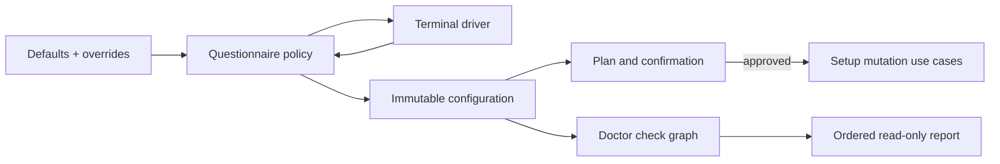

# Setup and Doctor Architecture Hardening

- Status: Proposed — ready for implementation
- Date: 2026-09-11
- Last updated: 2026-09-12
- Catalog capability ID: `setup-and-doctor`
- Last verified: 2026-09-11 at `2fec5c24a80135dd0611d3bc37e7dc3a8ab1b41a`
- Owners: Copilot maintainers and setup operators
- Scope: separate setup decisions from terminal mechanics, execute doctor as a
  deterministic read-only check graph, and split remote resource responsibilities
- Related issues/PRs: none recorded
- Required review gates: product UX, architecture, testing, documentation,
  security/operations, CLI accessibility
- Open decisions blocking readiness: none

## 1. Executive summary

`copilot setup` becomes a pure questionnaire state machine driven by a small
terminal interface. It never mutates the defaults object, and cancellation or
incomplete non-interactive input produces no plan application. Credential
collection remains a separate secret-aware flow after configuration is approved.

`copilot doctor` becomes a fixed typed check graph. Local checks continue even
when the setup PAT is invalid; remote dependants are marked `skipped`. Independent
read-only probes run with a fixed maximum concurrency of four, but the report is
always rendered in declared plan order. Doctor composition exposes no mutation
port.

```text
defaults + overrides -> questionnaire -> immutable config -> plan -> confirm -> apply
expected config -> local checks + PAT gate -> bounded remote checks -> ordered report
```

## 2. Problem, current behavior, and evidence

### 2.1 Problem

The terminal adapter owns product question order, validation loops, mutable
configuration updates, secret input, storage decisions, workflow prompts, doctor
rendering, and raw TTY mechanics. Doctor has one high-complexity conditional
method that stops after PAT failure and mixes remote probes with report policy.
These shapes make cancellation, partial diagnosis, ordering, and read-only
authority difficult to verify independently.

### 2.2 Current behavior

1. `SetupPromptAdapter.collect` mutates the supplied nested defaults in place.
2. Interactive question dependencies and order are encoded as imperative console
   calls; the terminal adapter implements five semantic ports.
3. Non-interactive collection returns defaults directly and confirmation returns
   true when no TTY or `assumeYes` is set.
4. Doctor validates the PAT first and returns immediately on failure, hiding
   independent local workflow drift.
5. Doctor statuses are only `pass|warn|fail`; stable machine check IDs and
   dependency/skip evidence do not exist.
6. Remote scope, Variables, Secret names, merge queue, and credential health
   concerns are composed into one branching use case.

### 2.3 Evidence

- Code: `src/cli/setup_prompt_adapter.ts`, setup rendering, setup wizard/doctor
  use cases, setup ports, composition roots, and `src/domain/setup.ts`.
- Tests: catalogued setup wizard, credentials, doctor, and workspace adapter tests.
- Product surfaces: `copilot setup`, `copilot doctor`, setup plans, credential
  reports, workflow comparisons, and documentation.
- Unknown rationale: the evidence does not show that in-place mutation or PAT
  early return was an intentional contract.

### 2.4 Retrospective classification

Not applicable. This is prospective; the catalogued setup/doctor SDD is the
as-built baseline.

## 3. Actors, surfaces, and terminology

| Actor | Goal | Entry point | Visible surfaces |
|---|---|---|---|
| Setup owner | choose and preview a complete installation safely | `copilot setup` | questionnaire, plan, confirmation |
| Non-interactive operator | apply an explicit reproducible configuration | setup flags/config | terminal/exit code |
| Repository operator | diagnose all available drift without writes | `copilot doctor` | ordered report |
| Maintainer | add a question/check without changing terminal/provider code | domain/application | focused tests and docs |

A `questionnaire state` is a stable group of related decisions. A `question ID`
is the configuration path or explicit decision key. A `doctor check ID` is a
stable machine identifier; its localized area/summary are presentation. `Skipped`
means a declared dependency prevented a check from running and is never reported
as pass.

## 4. Goals, non-goals, and fixed invariants

### 4.1 Goals

1. Make setup collection deterministic, immutable, cancellable, and testable
   without terminal I/O.
2. Keep interactive and non-interactive configuration semantics identical.
3. Return the maximum safe doctor diagnosis even after a failed dependency.
4. Guarantee stable report order under parallel completion.
5. Make read-only doctor authority structurally impossible to weaken.

### 4.2 Non-goals

1. This work does not redesign existing setup options or recommended defaults.
2. It does not add back/undo navigation in the first state-machine version;
   operators cancel and rerun or edit a config file.
3. It does not make check concurrency, status policy, or safety checks configurable.
4. It does not combine setup PAT and workflow credential collection.
5. It does not add a runtime plugin/registry for questions or doctor checks.

### 4.3 Fixed product and safety invariants

1. Defaults, overrides, prior answers, and returned configuration never share
   mutable nested references.
2. Ctrl-C, EOF, cancellation, invalid non-interactive input, or failed final
   confirmation performs no file or remote mutation.
3. `--yes`/`assumeYes` skips only final confirmation; it never supplies missing
   config, token, storage, or credential decisions.
4. Doctor has no command/upsert/write port in its interface or composition graph.
5. Secrets are masked on entry, memory-only, excluded from questionnaire state,
   plan, errors, backups, report, and logs.
6. Fixed check order and maximum concurrency four are not user-configurable.

## 5. Current versus proposed product journey

| Stage | Current | Proposed | User/operator effect |
|---|---|---|---|
| Questions | terminal code owns decisions | pure state machine emits question | consistent validation |
| Draft | defaults mutated in place | fresh immutable snapshots | no hidden cross-run state |
| Cancellation | errors/adapter behavior vary | explicit canceled terminal state | guaranteed no write |
| Doctor PAT failure | report ends | local results plus skipped remote checks | fuller diagnosis |
| Doctor probes | conditional sequence | fixed dependency graph, max four | predictable latency/order |
| Report | area/message only | stable ID/status/action/evidence | automatable recovery |



Text equivalent: configuration facts enter a pure questionnaire driven by
terminal primitives; only an approved immutable configuration reaches mutation;
the same configuration feeds a separate read-only doctor graph and report.

## 6. Functional behavior and state model

### 6.1 Questionnaire contract

The pure policy receives a deeply cloned, validated initial `SetupConfiguration`
and returns `{stateId, question?, draft, validation, terminal}`. It accepts only
typed `answer`, `cancel`, or `end-of-input` events. Every accepted answer produces
a fresh draft; invalid input keeps the same state/question and provides one safe
validation message.

The ordered state IDs are exact:

```text
capabilities
agent-runtime
agent-model-defaults
agent-role-overrides
repository
deployment
bugbot
projects
provisioning
storage
review
confirmation
completed | cancelled
```

Question IDs use the public configuration path, for example
`features.release`, `agents.reviewer.provider`,
`repository.reconciliationPullRequestMode`, and `ai.bugbotSeverity`. The only
non-field question ID is `agents.configureIndependently`. Conditional states
that have no applicable questions advance deterministically without I/O.

There is no `back` event. Ctrl-C and EOF both produce `cancelled`, close the
driver exactly once, render “Setup cancelled. No changes were applied,” and use
local exit code 130. A negative final confirmation also produces `cancelled`
but exit code 0 because it is a completed user choice.

### 6.2 Terminal and rendering interfaces

`TerminalDriver` owns only `isInteractive`, `readText`, `readSecret`, and
`close`. It returns raw input/cancel/EOF facts; it does not know setup defaults,
question order, provider names, or validation. `SetupQuestionRenderer` owns
headings, choices, default labels, validation text, width, and color. The
application controller asks the state machine for the next question, renders it,
reads one event, and feeds it back.

Credential prompts use a separate `CredentialTerminalPort`; secret values never
enter questionnaire events or history. Plan, doctor, and credential reports have
separate presenters rather than one adapter implementing all semantic ports.

### 6.3 Non-interactive behavior

Non-interactive setup does not instantiate a terminal driver or questionnaire.
It merges canonical defaults, config file, and CLI flags using existing
precedence, then runs the same complete validation policy. A canonical default
is an explicit product decision and may fill its documented field. Required
external inputs with no safe default remain mandatory:

- repository coordinates from the current Git repository;
- setup PAT for any non-dry-run remote inspection/mutation;
- every selected required credential when secret management requests replacement
  or no allowed existing/runner credential satisfies the group;
- explicit organization visibility/target prerequisites when organization
  storage is selected.

`--features` is optional because the documented default feature set is complete.
`--yes` affects only confirmation. `--dry-run` may omit the setup PAT; remote
scope/readiness facts then render `unverifiable` and no remote mutation is
planned or implied.

### 6.4 Doctor check record

```text
DoctorCheck {
  id: stable lowercase dotted identifier
  status: pass | warn | fail | skipped
  summary: safe localized user message
  action?: one concrete recovery action
  evidence: readonly safe key/value facts
  blockedBy: readonly check IDs
}
```

Evidence permits bounded names/counts/scopes/statuses and repository-relative
workflow paths. It cannot contain token, secret value, raw provider response,
stack, full command, or private absolute path. Overall doctor result is unhealthy
iff at least one check is `fail`; `warn` and `skipped` remain visible. A skipped
check caused by a failed dependency does not add a second failure.

### 6.5 Fixed doctor dependency graph

| Plan order | Check group/ID | Dependency | Execution |
|---:|---|---|---|
| 1 | `configuration.valid` | none | pure/local |
| 2 | `workspace.repository-root` | none | local |
| 3 | `workflow.<normalized-relative-path>` sorted by path | configuration | local, sequential projection |
| 4 | `credentials.setup-pat` | repository coordinates | remote gate |
| 5 | `github.resource-scopes` | valid PAT | remote group, max four |
| 6 | `github.merge-queue` | valid PAT + valid config | remote group, max four |
| 7 | `github.variables` | valid PAT + scopes | remote group, max four |
| 8 | `github.secret-names` | valid PAT + scopes | remote group, max four |
| 9 | `credential.<requirement-or-group>` in requirement order | secret names + valid PAT | health group, max four |

Stage 0 runs configuration, root, and workflow comparisons even when PAT
validation fails. Stage 1 validates PAT. Stage 2 starts applicable resource,
queue, Variables, and Secret-name queries with a shared four-slot limiter. Stage
3 queries credential health only for present required credentials after Secret
metadata. Stage 4 orders records by the table/declared requirement order and
renders once.

If PAT fails, stages 2/3 records are `skipped` with
`blockedBy: [credentials.setup-pat]`. If configuration fails, checks whose
expected values cannot be computed are skipped, while repository/workflow facts
that remain meaningful still run. Required organization access unavailable is
fail; optional credential health unavailable with credential present is warn.

### 6.6 Remote responsibilities

Doctor composes auth-bound read-only ports for repository metadata/resource
scopes, Actions Variables, Actions Secret metadata, merge policy/queue readiness,
workflow comparison, and credential-health workflow results. Setup mutation
composes separate command ports for Variables/Secrets/files. A shared GitHub
transport/pagination/auth helper may exist below adapters; no application-facing
universal setup repository is introduced.

### 6.7 State machines

| Setup state | Entered when | User-visible meaning | Next | Recovery |
|---|---|---|---|---|
| collecting | initial config valid | answering current group | next group/cancelled | correct answer |
| review | all decisions valid | inspect immutable plan | confirmation/cancelled | rerun/edit config |
| confirmation | mutation plan shown | explicit approval required | completed/cancelled | choose yes/no |
| completed | approved | setup may apply | terminal | inspect result |
| cancelled | cancel/EOF/no | no changes applied | terminal | rerun |

Doctor records independently become pending, pass, warn, fail, or skipped; the
report is emitted once all runnable checks settle. A thrown provider value maps
to one semantic check result rather than aborting unrelated checks.

## 7. User-facing configuration

All existing setup options/defaults/precedence remain defined by the baseline
SDD. This refactor adds no public option. The questionnaire order, question/check
IDs, cancellation semantics, doctor statuses, DAG, concurrency four, report
order, and mutation-port prohibition are fixed.

Recommended interactive use is `copilot setup`; reproducible automation uses
`copilot setup --non-interactive --config <path> --yes` plus required credentials.
Meaningful no-write alternatives are `--dry-run` and `copilot doctor`. Unknown
config keys/values remain errors, never ignored forward compatibility.

## 8. Clean Architecture design

### 8.1 Responsibilities and dependency direction

| Layer/boundary | Owns | Must not own/import |
|---|---|---|
| Domain/pure policies | questionnaire transitions, config validation, check plan/report ordering | TTY, Octokit, fs mutation |
| Application | controllers, setup plan, doctor scheduler, semantic read/command ports | console, provider DTOs |
| Adapters | terminal events, local workflow comparison, narrow GitHub reads/writes | question/check policy |
| Infrastructure | fixed composition, auth binding, four-slot limiter | product defaults/status decisions |
| Entrypoints | flags/config/repo target and exit mapping | questions/check algorithms |
| Presentation | question/plan/credential/doctor rendering | mutation, raw failures/secrets |

### 8.2 Executable architecture constraints

1. Pure questionnaire/report modules import no `node:*`, CLI, infrastructure,
   provider, or `Execution` module.
2. Doctor composition types expose query ports only; compile fixtures fail if an
   upsert/mutation port is provided or called.
3. The terminal adapter cannot import setup defaults/descriptions/provider lists.
4. Mutation tests deep-freeze input/defaults and assert no reference sharing.
5. A concurrency instrumentation test proves maximum four and stable plan order.
6. Each remote adapter implements one catalogued semantic port; broad method bags
   and service locators fail architecture review/checks.

## 9. UI/UX and content contract

Setup headings use the state labels in the declared order. Every prompt shows
question, bounded choices/type, and recommended current default. Validation
stays adjacent to the question. Secrets render no characters and no default.

```text
Copilot Doctor — partial diagnosis

FAIL    Setup PAT                 Credential was rejected by GitHub.
PASS    Workflow copilot_issue   Matches the installed template.
FAIL    Workflow release         Local workflow differs from the template.
SKIP    Repository Variables     Requires a valid setup PAT.
SKIP    Workflow credentials     Requires repository Secret metadata.

Action: replace the setup PAT, repair the release workflow, then run `copilot doctor` again.
No repository configuration was changed.
```

Pending setup shows current section and position; action-required shows one
validation/confirmation; blocked shows impact/cause/action/no-write; partial
doctor distinguishes warn/skipped/fail; complete says how many checks passed and
that no configuration was changed. Status always has text in addition to icon or
color. Width 40/80/120 fixtures must remain readable; `NO_COLOR` and English
fallback remain supported.

## 10. Failure, recovery, and cleanup

| Failure/partial state | User impact | Retained facts | Automatic retry | Required action | Cleanup |
|---|---|---|---|---|---|
| invalid answer | same question remains | prior immutable draft | yes, interactive | enter valid value | none |
| cancel/EOF | setup ends, no write | no secret/config mutation | no | rerun | close TTY once |
| invalid non-interactive config | no prompt/write | source path and safe errors | no | fix config | none |
| PAT invalid | local doctor continues | local check results | no | replace PAT | remote dependants skipped |
| optional health unavailable | warning/partial report | presence metadata | bounded workflow read retry | inspect health workflow | none |
| required remote access unavailable | unhealthy report | successful checks | bounded read retry | grant access/change scope | none |
| report rendering failure | doctor exits failure | computed checks in memory | no | fix terminal/output | no mutation |

## 11. Security, permissions, and privacy

1. Setup PAT and workflow/API credentials use separate types, ports, prompts, and
   lifetimes.
2. Secret entry disables echo where supported; fallback prompts still never echo
   values through Copilot rendering/logging.
3. Doctor adapters are read-only and receive the least token scopes required for
   each probe.
4. Untrusted provider text maps to semantic summaries; evidence values are
   allowlisted and bounded.
5. Config paths and repository coordinates are validated before file/provider use.

## 12. Observability and operational UX

Setup emits state/question ID, validation category, cancellation/approval, and
bounded plan counts without answers containing secret/user text. Doctor emits
check ID/status/duration/dependencies and total pass/warn/fail/skipped counts in
plan order. It records maximum probe concurrency, not raw requests. One terminal
report per command avoids interleaved parallel output.

## 13. Compatibility, migration, rollout, and rollback

1. Compatibility and configuration migration are not applicable because there
   are no installed users or stored setup/doctor results to preserve.
2. Replace the prompt adapter, questionnaire state, doctor result, renderers,
   CLI schema, docs, tests, and API exports atomically. No old/new controller,
   status alias, result adapter, dual renderer, or feature flag is implemented.
3. `skipped` belongs to the sole initial doctor result contract. Removed status
   and prompt shapes are invalid rather than translated.
4. The final command uses exit 1 iff any check fails; warnings/skips without a
   failure exit 0. Only this final behavior is tested or documented.
5. Before first real use, rollback is a complete revert. Afterwards, fix forward;
   never restore in-place defaults mutation, secret leakage, broad adapters, or
   mutation ports in doctor composition.

## 14. Testing strategy and numeric budget

This SDD owns at least **24 distinct cases**.

| Area | Minimum cases | Required risks |
|---|---:|---|
| Questionnaire/report pure policy | 4 | order, conditional skip, validation, status aggregate |
| State/cancel/parallel order | 4 | immutability, Ctrl-C, EOF/no, out-of-order completion |
| Application controllers/scheduler | 4 | interactive, non-interactive, dry-run, partial doctor |
| Adapters/provider mapping | 3 | TTY secret, remote scope/error, health mapping |
| Workflow/schema/setup contract | 2 | active/template comparison and sole config schema |
| UX/accessibility/sanitization | 4 | pending, blocked, partial, complete at widths/no-color |
| Integration/security | 3 | no-write composition, max four, no secret/reference sharing |
| **Total** | **24** | no double counting |

Questionnaire transition, validation, check-plan, and report policies require
100% enumerated branch coverage. Terminal adapters require 90% lines and 85%
branches; changed application modules require 95/90; repository thresholds remain
90/90/88/82. Tests use fake terminal events, frozen fixtures, deferred read ports,
and sanitized provider failures, never live GitHub or real secrets.

Manual evidence: interactive success, invalid retry, Ctrl-C, EOF, secret masking,
40/80/120 widths, non-interactive missing external input, PAT-failed partial
doctor, and complete doctor on macOS/Linux-supported terminal behavior.

## 15. Documentation and discoverability

Update `docs/configuration.mdx`, `docs/configuration-checklist.mdx`, issue/PR
workflow setup pages, setup/doctor CLI reference, troubleshooting, credentials,
and development architecture. Document exact state/check IDs, non-interactive
required inputs, exit codes, skipped semantics, read-only guarantee, and recovery.

## 16. Acceptance scenarios

1. Frozen defaults enter setup and remain byte/reference unchanged after every path.
2. Interactive valid answers reach the exact state order and return a fresh config.
3. Invalid input repeats one question without mutating prior state.
4. Ctrl-C/EOF exits 130; negative confirmation exits 0; both perform no writes.
5. Non-interactive mode creates no readline and fails missing external inputs
   without prompting; `--yes` fills none.
6. Doctor with invalid PAT still reports configuration/workflow drift and marks
   every remote dependant skipped with its blocker.
7. Independent remote checks never exceed concurrency four, and presentation
   order is unchanged by completion order.
8. Required organization-access failure is fail; optional credential health
   absence is warn, never pass.
9. Doctor composition cannot receive or invoke a mutation port.
10. Secret values are absent from every state, plan, error, backup, log, fixture,
    and report.
11. All primary views are text-readable at narrow width and without color.

## 17. Requirements traceability

| Requirement | Owner | Evidence | Documentation |
|---|---|---|---|
| immutable questionnaire | state policy/controller | transition/freeze/cancel tests | setup CLI |
| non-interactive parity | merge/validation/entrypoint | no-prompt/missing-input tests | automation setup |
| doctor DAG/order | check plan/scheduler/report policy | dependency/concurrency/order tests | doctor reference |
| read-only authority | query ports/composition | compile/import tests | security/architecture |
| secret safety | credential terminal/presenter | masking/redaction tests | credentials |
| narrow adapters | remote read/write ports | contract/error tests | contributor architecture |

## 18. Implementation sequence

1. Add immutable clone, question/check IDs, status, and pure state/report policies.
2. Add terminal driver/renderers and replace imperative collection behind current CLI.
3. Enforce non-interactive/confirmation/cancellation contracts and manual fixtures.
4. Build doctor check DAG/scheduler, then split auth-bound remote read adapters.
5. Remove broad prompt/doctor responsibilities and mutation ports; update docs,
   tests, SDD/catalog evidence, and generated artifacts.

## 19. Definition of Done

- [ ] Setup defaults/drafts/results are immutable and reference-isolated.
- [ ] Every state/question/check ID and transition is documented and tested.
- [ ] All cancel/non-interactive paths prove no write and correct exit code.
- [ ] Doctor runs the fixed DAG, max concurrency four, stable order, and skipped semantics.
- [ ] Doctor composition exposes only read ports; secret safety tests pass.
- [ ] At least 24 distinct cases and all coverage/architecture gates pass.
- [ ] CLI UX, docs, config schema, active/setup assets, SDD, and catalog agree.
- [ ] No open decision, legacy state/result, compatibility adapter, in-place
      mutation, broad adapter, or service registry remains.

## 20. References and decisions

- Parent: `architecture-quality-and-scalability-hardening.md`.
- Baseline: `setup-configuration-credentials-and-doctor.md`.
- Decision: no back navigation; cancel/rerun or config-file editing keeps the
  state machine and persistence model explicit.
- Decision: doctor continues independent local checks after PAT failure and uses
  `skipped` for remote dependants.
- Decision: canonical defaults are valid non-interactive decisions; credentials,
  targets, and organization prerequisites without safe defaults remain required.
