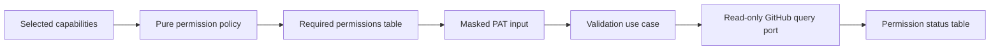

# Setup PAT Permission Guidance and Verification

- Status: Implemented — permission UX, deterministic provider mapping, scope-sensitive gating, coverage, and documentation gates complete
- Date: 2026-09-20
- Catalog capability ID: `setup-and-doctor`
- Last verified: 2026-09-21
- Owners: Copilot maintainers and setup operators
- Scope: show least-privilege permission requirements before collecting setup and workflow PATs, then report evidence-based permission checks without exposing or mutating credentials
- Related issues/PRs: none recorded
- Required review gates: product UX, architecture, testing, documentation,
  security/operations, CLI accessibility
- Open decisions blocking readiness: none

## 1. Executive summary

`copilot setup` MUST explain the permissions required by each GitHub PAT before
the secret prompt and MUST show an evidence-based permission report immediately
after a newly supplied token is validated. The setup PAT and workflow PAT remain
separate credentials with separate least-privilege matrices.

GitHub does not expose a complete self-inspection API for fine-grained PAT
permissions. The product therefore MUST distinguish permissions that were
verified through a safe read-only probe, permissions that were rejected, and
write levels that cannot be proven without a mutation. It MUST never perform a
write merely to turn an unknown result into a pass or fail.

```text
selected setup capability -> required permission table -> masked PAT prompt
-> identity/repository validation -> read-only permission probes -> status table
-> continue, block, or explain unverifiable write levels
```

## 2. Problem, current behavior, and evidence

### 2.1 Problem

Operators currently see prose explaining that the setup and workflow PATs are
different, but the terminal does not show the exact repository/organization
permission matrix at the point of entry. After entry it reports only overall
credential validity. Operators can therefore discover a missing permission late,
after setup has started a remote operation or a workflow fails at runtime.

### 2.2 Current behavior

1. `SetupCredentialPromptAdapter.requestSetupPat` explains memory-only handling
   and asks for a masked setup PAT.
2. `SetupCredentialValidationAdapter.validateSetupPat` verifies `/user` and
   repository metadata access only.
3. `SetupCredentialsUseCase` later explains credential separation, prompts for
   the workflow PAT, and reuses setup-PAT validation for that token.
4. `docs/authentication.mdx` documents detailed conditional permissions, but the
   same information is not projected into the terminal journey.

### 2.3 Evidence

- Code: `src/cli/setup_credential_prompt_adapter.ts`,
  `src/application/usecases/setup/setup_credentials_use_case.ts`,
  `src/infrastructure/setup_credential_validation_adapter.ts`, and
  `src/cli/commands/setup.ts`.
- Tests: setup credential use-case, prompt-rendering, and credential-validation
  adapter suites catalogued under `setup-and-doctor`.
- Documentation: `docs/authentication.mdx` and GitHub's REST documentation for
  fine-grained PAT permissions and `X-Accepted-GitHub-Permissions`.
- Provider limitation: `X-Accepted-GitHub-Permissions` describes an endpoint's
  requirements, not the complete grants of the presented fine-grained PAT.

### 2.4 Retrospective classification

- Observed behavior: the current CLI separates PAT roles and validates identity
  plus repository access.
- Intentional contract: masked input, in-memory-only setup PAT, remotely stored
  workflow PAT, and no secret values in plans/logs/output.
- Known debt and limitations: permission requirements are prose-only and the
  workflow PAT receives no capability-level audit.
- Unknown rationale: no evidence establishes that the coarse validation result
  was intended as the final permission UX.
- Proposed improvement: the permission planning, probing, and presentation
  contract in this SDD.

## 3. Actors, surfaces, and terminology

| Actor | Goal | Entry point | Visible surfaces |
|---|---|---|---|
| Setup owner | create the least-privileged setup PAT | `copilot setup` setup-PAT prompt | required-permissions table and result table |
| Bot owner | create the least-privileged workflow PAT | workflow-PAT prompt | selected-feature permission table and result table |
| Operator | diagnose an inconclusive permission | setup output and authentication docs | status reason and recovery action |

A **permission requirement** is a token role, GitHub scope, permission name,
access level, applicability, and reason derived without inspecting a secret. A
**permission check** is one safe observation for that requirement. `Verified`
means a read-only provider operation proved the required capability; `Missing`
means GitHub rejected a deterministic probe after token identity and repository
access were established; `Unverifiable` means GitHub does not provide a safe
non-mutating proof for the required access level or returned an ambiguous or
transient response.

## 4. Goals, non-goals, and fixed invariants

### 4.1 Goals

1. Both PAT prompts MUST show a complete, role-specific permission table before
   reading the secret.
2. A newly supplied or re-entered PAT MUST produce a permission status table
   in the same terminal flow before setup relies on it.
3. Workflow-PAT requirements MUST be narrowed by the final selected features;
   optional permissions MUST state their enabling condition.
4. Missing safely verifiable required access MUST block the dependent setup
   phase before mutation.

### 4.2 Non-goals

1. Setup does not enumerate, create, edit, rotate, or revoke GitHub PATs.
2. Setup does not prove write access by creating temporary labels, branches,
   files, Variables, Secrets, comments, projects, or workflow runs.
3. Existing remote Secret values remain unavailable. Credential-health evidence
   MAY establish bounded runtime reachability, but MUST NOT be treated as a
   permission audit; an existing workflow PAT is not accepted until its value is
   re-entered and the configured permission audit completes.
4. This change does not merge the setup and workflow PAT roles.

### 4.3 Fixed product/safety invariants

1. Token values MUST remain masked, memory-only where already specified, and
   absent from requirements, checks, errors, fixtures, logs, and documentation.
2. Provider text MUST be mapped to bounded semantic reasons; raw bodies and
   authentication headers MUST never be rendered.
3. A read probe MAY prove equal or weaker access. A read probe MUST NOT claim
   that a write requirement is verified.
4. `Unverifiable` MUST NOT be rendered as `Verified` or `Missing`.
5. No permission-check configuration may enable mutating probes.

## 5. Current versus proposed product journey

| Stage | Current | Proposed | User/operator effect |
|---|---|---|---|
| Setup PAT guidance | explanatory paragraph | bootstrap permission matrix before prompt | operator can configure the PAT before pasting it |
| Setup PAT result | identity/repository validity | identity plus permission evidence table | missing read access is visible early |
| Workflow PAT guidance | credential-separation paragraph | exact matrix derived from selected features | bot PAT avoids unnecessary grants |
| Workflow PAT result | generic valid/invalid check | one row per permission with evidence state | workflow readiness is understandable before Secret write |
| Inconclusive write access | discovered during mutation/runtime | explicit `Unverifiable` with reason | no false assurance and no test mutation |



Text equivalent: selected capabilities produce a pure permission plan; the CLI
presents that plan before secret input; a validation use case then invokes only
read-only GitHub queries and presents ordered permission outcomes.

## 6. Functional behavior and state model

### 6.1 Setup PAT

1. After repository coordinates are resolved and before `readSecret`, setup
   renders the bootstrap requirements needed to inspect the repository and
   build the plan. Conditional rows explicitly identify later feature/storage
   choices that can require broader access.
2. After entry, setup validates identity and repository selection, executes the
   safe bootstrap probes, and renders results in the same order as requirements.
3. A missing required bootstrap permission blocks the wizard before remote
   inspection. Missing conditional Secret/Variable inventory access remains
   visible but does not block before the operator has selected storage features.
4. Pre-plan remote inventory MUST map unavailable repository and organization
   Secret/Variable reads to bounded access facts instead of throwing. The wizard
   may continue with unknown inventory, but MUST NOT describe unavailable data
   as an empty resource list. A rejected or absent remote inspection port when
   a remote target was supplied MUST yield an explicitly unavailable snapshot
   with unknown owner/visibility and no fabricated resource facts; the final
   audit and scope-sensitive validation still run before confirmation.
5. After the final configuration is approved, the setup PAT permission plan is
   recomputed for mutation-time capabilities. Newly relevant missing access
   blocks mutation. A required `Unverifiable` row is never reported as ready:
   unverifiable read access without positive public operational evidence blocks,
   while an unverifiable write level may
   proceed only after a separate, explicit operator acknowledgement that the
   PAT was configured with the displayed access. Interactive acknowledgement
   defaults to No; non-interactive execution requires
   `--confirm-unverifiable-write-permissions`. `--yes` alone is not evidence.
   Generic interactive or unattended setup examples MUST omit that exception
   flag. Documentation may show it only in a separately labelled recovery flow
   whose immediately adjacent prerequisite requires the operator to inspect the
   displayed PAT settings first. A recovery rerun MUST preserve the original
   setup plan: repeat interactive selections, or append the flag to the exact
   non-interactive invocation with the same configuration file, feature/agent
   flags, and credential inputs. A bare example that silently selects defaults
   is forbidden. The documentation validator MUST examine the nearest prose
   paragraph before an exceptional shell block and match its explicit
   inspected-PAT prerequisite; unrelated earlier prose cannot authorize it.
   The wizard MUST invoke a configured final-permission-audit port after
   normalization and before final remote storage validation. Expected missing
   or unconfirmed permissions return a bounded rejection outcome from this
   port, not an exception. The wizard returns a structured `blocked` result
   with the final normalized configuration, bounded permission errors, and
   available remote facts; it MUST NOT continue to storage validation or
   mutation. Unexpected provider/transport failures may still throw. On an
   accepted audit, the wizard MUST apply both organization-storage validation
   and scope-sensitive managed-resource inventory validation, using the exact
   Secret and Variable names derived from the normalized configuration. It
   MUST return the final configuration and bounded storage blocking facts
   rather than throw. The CLI MUST recognize either structured blocked reason
   immediately, report the corresponding bounded permission or storage error
   with the result's exit code, and MUST NOT duplicate either
   inventory validator or start another permission audit, credential collection,
   workflow comparison, target resolution, or mutation.
6. If repository or organization Secret or Variable inventory is still
   unavailable or unknown, the setup wizard MUST stop after rendering the final
   permission table and before
   credential decisions, resource targeting, or mutation only when at least one
   selected resource may resolve to that scope, or when
   `preserveExisting` requires discovering whether an unoverridden resource
   already exists in either scope. An empty collection is authoritative only
   when its access state is `available`; transient or ambiguous failures MUST
   NOT imply absence. Repository resources take precedence: once every
   unoverridden selected name is verified as already present in repository
   inventory, organization inventory is not required merely for preservation.
7. A selected resource with an explicit organization override does not depend
   on repository inventory. When every selected resource is forced to
   organization scope, including a policy with `preserveExisting: false`, setup
   MUST continue from the available organization inventory and MUST NOT request
   or block on unrelated repository Secret or Variable access.
8. Remote setup inspection records whether `copilot_credential_health.yml` is
   installed, confirmed missing, unavailable, or unknown without mutating the
   repository. When existing Secrets require health validation, Actions write
   is always required for dispatch. Contents write and Workflows write are
   required only when the workflow is independently confirmed missing;
   installed, unavailable, or unknown states MUST NOT trigger those
   bootstrap-only grants because ambiguous absence never authorizes mutation.
   Workflow-file inspection requires Contents read, not a separate Workflows
   read permission; the Workflows grant is write-only and bootstrap-specific.
   The remote-configuration summary renders the bounded workflow state.
9. An Actions `getWorkflow` `404` does not by itself prove absence. Setup MUST
   classify the workflow as `missing` only when an independent Contents read
   first probes the repository root (`path: ''`) to prove Contents visibility
   and a subsequent exact read of
   `.github/workflows/copilot_credential_health.yml` returns `404`. A readable
   file, absent Contents endpoint, failed visibility proof, or
   ambiguous/transient exact-file result is `unavailable`, never `missing`.
   Initial remote inspection may use GitHub's default branch before the
   questionnaire fixes the selected main branch; that status is provisional.
   After normalization and before the final permission audit, the wizard MUST
   use a narrow read-only port to inspect repository-root visibility and the
   exact workflow file on `configuration.repository.mainBranch`, replacing only
   the workflow state in its remote snapshot. A missing/rejected probe becomes
   `unavailable`, never an inherited default-branch `installed` or `missing`.
   The separate setup-only credential-health bootstrap adapter MUST apply the
   same two-read confirmation on the selected ref before dispatch or creating
   a temporary workflow, even if Actions finds a workflow on the default
   branch. A confirmed selected-ref absence may require bootstrap despite
   default-branch presence; an installed file still needs Actions workflow
   access before dispatch. Ambiguous reads return unavailable health evidence
   and MUST NOT create, dispatch, or delete a workflow; doctor remains query-only.
   This remote-configuration absence inspection is distinct from the PAT
   permission audit's read-only commit-list probe below. Operator guidance
   MUST identify the correct endpoint for each purpose instead of conflating
   the two Contents reads.

### 6.2 Workflow PAT

1. The final `SetupConfiguration` determines workflow permissions.
2. Repository Metadata read is the only unconditional workflow-PAT row. The
   four repository write permissions are derived independently from enabled
   runtime consumers, not inherited as a fixed baseline:

   Any enabled runtime route additionally requires Actions read for the
   fail-closed previous-run queue check, even when it does not dispatch a
   workflow. Actions write replaces that read row only for release/hotfix
   dispatch. Repository templates and setup-only credential-health selection
   are not runtime routes and do not retain this grant by themselves.

   | Permission | Selected runtime capability that requires it |
   |---|---|
   | Actions write | Release/hotfix workflow dispatch, including an enabled release/hotfix issue workflow |
   | Contents write | Managed issue branches, file-modifying issue/PR comment routes, or release/hotfix branch, tag, and merge operations |
   | Issues write | Issue automation, issue comments, issue-progress commit processing, inactive-issue closure, or release/hotfix issue lifecycle |
   | Pull requests write | PR automation, PR review comments, commit-triggered Bugbot review, issue-comment autofix on a PR, guarded approval, or release/hotfix promotion |

   An issue-workflow kind is a runtime consumer only when the issue route is
   enabled. A disabled route MUST NOT retain a write grant merely because its
   template or issue-workflow selection remains in the configuration. With
   all mutating routes disabled, guarded approval off, and `ai.membersOnly`
   off, the workflow table contains only Metadata read. Independently available
   members-only single actions can still require organization Members read.
   Existing defaults still select the normal write grants, and disabling one
   consumer MUST NOT remove a grant needed by
   another. GitHub documents Contents write for merging a PR and Actions write
   for workflow dispatch; neither is required just to render a disabled route.
3. Administration read is included for release/hotfix orchestration or guarded
   PR approval. Checks read and Variables read are included for guarded
   approval. Organization Members read is included only when an enabled runtime
   can inspect membership: automatic issue/PR assignees, automatic PR reviewers,
   release/hotfix issue authorization, or `ai.membersOnly` for an enabled issue,
   PR, commit, or comment route or an independently available agent-backed
   single action. Members-only single actions retain this organization grant
   even when all event-driven routes are disabled. An ordinary comment route
   alone, disabled event routes by themselves, and zero assignment/reviewer
   counts MUST NOT retain a Members grant. Ordinary
   comment mutations use the separate repository-write collaborator check and
   MUST NOT be projected as organization-membership consumers.
   Issue Types write, Projects write, and organization Variables read are
   included only when their selected capability and effective target require
   them. Effective targets include an existing
   organization `PR_APPROVAL_POLICY` Variable preserved from remote inventory,
   even when the configured default remains repository scope.
4. Identity/repository validation and safe read probes run before the value is
   accepted for Secret provisioning.
5. Repository Contents read is probed through the read-only commit-list endpoint,
   not the root Contents endpoint. Repository metadata MUST first establish
   whether a successful target read is authentication-bound. A successful read,
   including GitHub's documented `409 Conflict` for an empty Git repository,
   verifies permission only when the repository is private. On a public
   repository the same target can be anonymously readable and therefore remains
   `Unverifiable`; `404` also remains ambiguous and never becomes verified.
6. Repository Checks read MUST resolve the repository's exact `default_branch`
   through a read-only metadata request and use that percent-encoded branch as
   the commit reference for the check-runs request. A literal local alias such
   as `HEAD` MUST NOT be sent to GitHub as a repository commit reference. Both
   reads share one bounded probe slot and timeout. Missing, malformed, empty, or
   oversized branch metadata, or a failed metadata request, returns bounded
   `Unverifiable` evidence and MUST NOT start the check-runs request.
7. When the `PAT` Secret already exists, remote credential health is presented
   as bounded evidence only. Setup MUST require the operator to re-enter the
   workflow PAT, run the same ordered permission audit used for a new value, and
   provision it only after that audit is accepted. Interactive setup MUST NOT
   offer an unaudited keep path. Non-interactive setup MUST fail before mutation
   unless `PAT` is supplied again; GitHub's write-only Secret API is never
   described as permission evidence.
8. A successful provider read MUST become `Verified` only when the endpoint is
   permission-bound (for example Secret or Variable inventory), or when
   repository metadata in the same bounded probe proves that the target
   repository is private. Publicly readable repository probes, organization
   member/issue-type reads, and successful reads whose visibility cannot be
   established remain `Unverifiable`. Visibility resolution and the target
   read share one concurrency slot and timeout, preserve result order, and
   never use unauthenticated success as token evidence.
9. For any existing non-workflow credential, a `keep` choice is authoritative
   only when the effective Secret storage policy permits preserving that exact
   scope. Disabled preservation or an override that moves the Secret MUST
   request and validate a replacement value; non-interactive execution without
   that value fails before resource mutation.
10. After approval, the resource-provisioning workflow MUST require an
    authoritative remote configuration snapshot before grouping any selected
    Secret or Variable write. A failed or missing inspection cannot fall back
    to empty inventory, even when the configured target defaults to repository
    scope; the relevant provider upsert MUST remain untouched.
11. Once a selected managed Secret/Variable inventory is absent or required
    access is unavailable, initial setup MUST return a structured failure before
    any remote Secret, Variable, label, issue-type, or tag mutation. An unrelated
    unavailable scope remains non-blocking under the shared storage policy.
12. A successful publicly readable repository GET after valid token identity
    may prove that the selected read operation is usable, while remaining
    `Unverifiable` as PAT permission evidence. This structured usable-read fact
    may satisfy a repository-scoped required read for execution readiness; it
    never upgrades the row to `Verified`, never satisfies organization reads or
    any write, and never applies to a denied, ambiguous, malformed, timed-out,
    or visibility-unknown probe. The terminal MUST explain that access is
    operationally available without claiming the PAT has the named grant.

### 6.3 Permission states

| State | Entered when | User-visible meaning | Setup behavior | Recovery |
|---|---|---|---|---|
| required | before input | grant this access level | wait for masked input | configure PAT |
| verified | safe evidence proves the level | capability is available | continue | none |
| missing | deterministic provider denial | capability is unavailable | block if required | grant permission/repository access |
| unverifiable | write level or ambiguous response cannot be safely proven | no PAT-permission pass/fail claim; successful public repository reads may be usable | block required reads without positive operational evidence; require explicit acknowledgement for required writes | inspect PAT settings, acknowledge only after checking them, or retry |

Duplicate requirements are normalized to the strongest access level and one
row. Provider probes MAY complete concurrently with a fixed maximum of four
in-flight requests, while returned checks and presentation remain in original
requirement order. Retry creates no durable permission state.

## 7. User-facing configuration

This change adds one bounded CLI acknowledgement flag:
`--confirm-unverifiable-write-permissions`. It applies only when every required
read is verified or positively operationally usable, no required permission is
missing, and one or more required
write levels remain unverifiable because validation is intentionally read-only.
It does not convert a row to `Verified`, bypass invalid identity/repository
selection, or accept unavailable required read evidence. Requirements remain
derived from the existing immutable configuration, repository owner type,
storage targets, and selected features. The permission catalog, status
semantics, maximum probe concurrency, and prohibition on write probes are not
configurable.

Recommended interactive use remains `copilot setup`. Non-interactive setup
prints permission results for supplied PATs but never prompts. `--dry-run`
prints requirements and any available checks without implying mutation access.

## 8. Clean Architecture design

### 8.1 Responsibilities and dependency direction

| Layer/boundary | Owns | Must not own/import |
|---|---|---|
| Domain/pure policy | permission vocabulary, strongest-level normalization, capability-to-requirement decisions | terminal, fetch, Octokit, tokens |
| Application | validate-token-permissions use case, ordered result contract, final scope-sensitive inventory blocking | provider endpoints/headers, console |
| Semantic ports | read-only identity/repository/permission inspection | mutation methods or provider DTOs |
| Infrastructure adapter | bounded GitHub GET/GraphQL probes, status/error mapping, non-throwing optional resource inventory | feature selection or rendering |
| CLI presentation | narrow tables, icons plus status text, wrapping/no-color behavior | capability policy or remote calls |
| Entrypoint/composition | target/config projection and concrete wiring | duplicated requirement lists |

The dependency direction is CLI/infrastructure -> application -> domain. The
application-facing permission query port exposes no POST, PUT, PATCH, DELETE,
upsert, dispatch, or temporary-resource operation.

### 8.2 Contracts, state, and trust boundaries

- Pure decisions: token role, permission list, strongest access, applicability,
  stable order, and whether selected resource names plus storage policy require
  repository inventory.
- Application contracts: immutable requirement/check arrays and a summary with
  strict `ready`, `confirmationRequired`, counts, and credential identity check.
- Semantic port: one `inspect(owner, repository, token, requirements)` read-only
  operation returning semantic evidence states.
- Durable state: none; results exist only for the command.
- Concurrency/idempotency: at most four read probes in flight, stable returned
  order, and safe repetition; the fixed limit is not user-configurable.
- Remote inventory state: repository and organization Secret/Variable access is
  represented separately from the discovered resource names; unavailable or
  unknown access is never projected as a confirmed empty inventory.
- Fail-closed consumers: final audit, credential collection, and resource
  provisioning reject unavailable/unknown repository or organization inventory
  only when the shared storage policy says a selected resource can resolve
  there or requires discovery in that scope for preservation. Explicitly
  organization-only targets do not gain an unrelated repository dependency,
  and explicitly repository-only targets do not gain an unrelated organization
  dependency.
- Public-read usability is a separate, positive semantic fact on one successful
  repository read. Neither generic `Unverifiable` nor a public URL alone
  authorizes a read; invalid token identity, denied/ambiguous probes, protected
  reads, organization permissions, and writes still block or require their
  existing explicit acknowledgement.
- Untrusted inputs: provider status/body/headers, repository metadata, token.
- Provider error mapping: 401 after base validation and an explicit permission-
  denial 403 are missing; 404, rate limit, 5xx, network, and unsupported proof
  are unverifiable.
  A permission-probe `403` is deterministic only when bounded normalized
  provider metadata explicitly identifies a missing permission and no
  `Retry-After`, exhausted rate-limit, or SSO header is present. Bare responses,
  the generic provider message `Forbidden`, rate-limited responses, SSO
  responses, and otherwise ambiguous `403` responses remain `Unverifiable`;
  raw provider prose is never rendered.
  This strict probe classification is context-specific: it MUST NOT weaken
  established operational fallbacks in other GitHub adapters, such as treating
  a generic forbidden duplicate-comment deletion as requiring compaction.
  Malformed provider JSON and unavailable header access are also bounded as
  ambiguous evidence and MUST resolve to `Unverifiable` without leaking or
  propagating the provider failure.
- Empty-repository mapping: only the repository Contents probe may interpret
  `409 Conflict` from the commit-list endpoint as verified read evidence. No
  other probe/status pair gains this exception, and a write requirement remains
  `Unverifiable` because the read-only endpoint cannot prove mutation access.
- Checks-reference mapping: the repository Checks probe first reads bounded
  repository metadata, accepts only a non-empty `default_branch` of at most 255
  characters without ASCII control characters, percent-encodes that exact value,
  and then requests check runs. It never substitutes `HEAD`, an invented branch,
  or untrusted metadata directly into the URL. The two serial GETs consume one
  concurrency slot and one timeout budget.

### 8.3 Executable architecture constraints

1. Pure permission policy imports no CLI, `node:*`, infrastructure, Octokit, or
   fetch types.
2. Architecture tests reject mutation verbs on the permission query port and
   reject permission catalogs duplicated in CLI/infrastructure.
3. Adapter tests assert every request is GET or GraphQL query and that rendered
   values never contain the token or raw response body.

## 9. UI/UX and content contract

### 9.1 Information hierarchy

1. PAT role and why it is needed.
2. Required permission matrix.
3. Masked input prompt.
4. Identity/repository result.
5. Permission status matrix.
6. One next action for missing or unverifiable access.

### 9.2 Representative views

```text
Setup PAT permissions (example: selected Secret and Variable provisioning,
plus validation of an existing credential)

Permission              Access       Applies when
Metadata                Read         Always: repository discovery
Contents                Read         Always: inspect repository files
Secrets                 Write        If selected Secrets are provisioned
Variables               Write        If selected Variables are provisioned
Actions                 Write        If existing credentials need health dispatch

Enter Setup PAT: ********

Setup PAT permission check

Status            Permission              Access
✅ Verified        Metadata                Read
✅ Verified        Contents                Read
? Unverifiable    Secrets                 Write
? Unverifiable    Variables                Write
? Unverifiable    Actions                  Write

Action required: inspect the displayed write levels in your PAT settings and
explicitly confirm them before setup proceeds. Unverifiable is not a pass:
GitHub offers no safe read-only proof of those write levels.
```

The real table is derived from the selected features and remote state; disabled
Secret/Variable provisioning or absent credential-health validation omits the
corresponding rows. A confirmed missing health workflow may additionally need
Contents and Workflows write for temporary bootstrap, never by default.

The workflow-PAT view uses the same structure and the title `Workflow PAT`.
Tables MUST use status text as well as symbols, fit terminal widths 40/80/120,
wrap purpose/action text, and remain understandable with `NO_COLOR`. Token,
authorization headers, raw provider prose, account email, and private response
payloads never appear.

### 9.3 Primary states

- Pending: required table followed by masked prompt.
- Action required: at least one required permission is missing or a required
  read is unverifiable without positive operational evidence; no dependent
  mutation has started.
- Confirmation required: identity and required reads are verified or positively
  usable on the selected public repository, no required
  permission is missing, and at least one required write cannot be proven by a
  safe read-only probe. The table remains non-ready until the operator confirms.
- Partial: verified and unverifiable rows coexist with an explicit limitation.
- Blocked/failed: token invalid, wrong repository selection, or required safe
  probe rejected.
- Complete: all safely verifiable requirements pass and any required
  unverifiable writes were explicitly acknowledged without changing their
  displayed status. Publicly readable required repository reads may remain
  visibly `Unverifiable` but operationally usable, with a distinct explanation.

GitHub issues, PRs, or comments are not changed by this local terminal feature.
No durable marker or notification is created.

## 10. Failure, recovery, and cleanup

| Failure/partial state | User impact | Retained facts | Automatic retry | Required action | Cleanup |
|---|---|---|---|---|---|
| invalid token | setup stops before remote planning | no token/result persisted | no | replace PAT | none |
| wrong repository selection | setup stops | identity only in memory | no | grant repository access | none |
| missing safe-probe permission | dependent phase stops | table remains in terminal | no | grant named permission | none |
| final configuration or preservation has unavailable organization storage | final setup-PAT requirements and results remain visible, then setup stops before credential decisions, target resolution, or mutation | approved configuration, bounded storage facts, permission table | no | grant the named organization permission and retry | none |
| optional repository inventory denied before selection | wizard continues with unavailable/unknown inventory; the final audit blocks if the capability becomes required | access state and completed permission rows | no | select features, then grant any required permission named by the final table | none |
| required repository inventory remains unavailable after final audit | setup stops before credential prompts, target resolution, or mutation; no empty inventory is inferred | final permission table and bounded access state | no | retry after provider recovery or correct the named PAT permission | none |
| unrelated repository inventory unavailable for organization-only resources | setup continues using available organization inventory; no repository absence is inferred or needed | final permission table and bounded access states | no | none | none |
| required write level unverifiable | setup pauses before dependent work; the row remains non-verified | verified identity/read facts | no | inspect PAT settings, then confirm interactively or pass the dedicated non-interactive acknowledgement flag | none |
| existing workflow PAT cannot be read | setup requests the PAT again before accepting or reprovisioning it; non-interactive setup without `PAT` stops | bounded remote-health result only | no | re-enter or supply `PAT`, then complete its permission audit | none |
| rate limit/network/5xx | no false missing result | other completed rows | bounded provider retry only | retry later | none |
| narrow terminal | table wraps | semantic row order | not applicable | none | none |

## 11. Security, permissions, and privacy

1. The feature promotes least privilege and never recommends Administration
   write, Secrets access, Variables write, Webhooks, or Workflows access for the
   runtime PAT unless a future reviewed capability requires it.
2. Permission probes are read-only and target only the resolved repository or
   selected organization resources.
3. Tokens never enter requirement/check objects, renderer fixtures, thrown
   messages, logs, snapshots, analytics, or durable files.
4. A provider denial is not retried with broader endpoints and an ambiguous
   denial is not converted to `Missing` without base identity/repository proof.

## 12. Observability and operational UX

The CLI reports role, stable permission ID, target scope, requested level,
semantic status, and bounded reason. It MAY log total verified/missing/
unverifiable counts in debug mode, never the token or raw headers. There is no
telemetry service. Status ordering is the requirement-plan order, independent
of probe completion order.

## 13. Compatibility, migration, rollout, and rollback

No config or persistent-state migration is required. Existing CLI flags and PAT
sources remain valid. The output is additive. Automation consuming human CLI
text is unsupported; exit behavior changes only when a newly detected,
deterministically missing required permission fails earlier than the eventual
remote operation would have failed. Rollback removes the permission use case,
port, adapter, and presenter together; it must not leave duplicated static
permission prose in the CLI.

## 14. Testing strategy and numeric budget

This SDD adds at least **106 distinct cases**.

| Area | Minimum distinct cases | Behaviors/risks covered |
|---|---:|---|
| Domain permission policy | 24 | setup/workflow plans, independent selected-feature write grants and all-disabled minimum, conditional permissions, strongest-level dedupe, stable order, repository/organization preservation dependencies, effective preserved workflow-variable scope, installed-versus-bootstrap health workflow grants, positive and negative organization-membership capability projection including comment-only and independently available single-action routes |
| Application state/blocking | 18 | verified, missing, required-read unverifiable, public-read operational readiness, required-write confirmation, invalid base token, organization-only credential collection, bounded pre-plan inspection failure, accepted/rejected final audit with structured block, selected-ref workflow state refresh, immediate remote-storage blocked handling, zero-count assignment and inactive membership checks |
| Adapter/provider contracts | 33 | GET-only probes, fixed four-request concurrency with stable result order, private-versus-public/unknown visibility evidence, protected-endpoint evidence, commit-list Contents target, private empty-repository 409 versus public operational usability, default-branch Checks resolution plus encoded check-runs target, invalid/missing branch fail-closed behavior, ambiguous 404, 401, explicit permission denial, bare/generic/rate-limited/SSO 403, malformed JSON/header access, 5xx, redaction, bounded unavailable repository inventory, Contents-visibility proof plus independently confirmed missing versus permission-hidden health workflow on the selected ref in inspection and bootstrap, unavailable endpoint state, duplicate-comment deletion fallback regression |
| Setup/credential integration | 21 | pre-prompt setup table, conditional denial through planning, wizard-owned repository-inventory block plus organization-only continuation, final setup check before remote-storage failure, scope-sensitive credential/resource consumers, absent/failed remote snapshot blocks every subsequent mutation, preserve-disabled and scope-moving keep rejection, workflow PAT check and explicit acknowledgement, existing PAT re-entry/audit, non-interactive missing-value rejection, missing audit composition failure |
| UI/accessibility | 5 | required/result tables, public-read limitation copy, confirmation-required copy, 40-column wrapping, no-color text |
| Architecture/security/docs | 5 | query-only boundary, no duplicated catalog, safe generic/recovery automation examples, and three nearest-paragraph permission-prerequisite cases |
| **Total** | **106** | No double counting |

The pure policy requires 100% statements/branches/functions/lines. Changed
application modules require at least 95% statements and 90% branches; terminal
presentation and provider adapters require at least 90% lines and 85% branches;
no live GitHub calls, no real secrets, no mutating requests, and semantic
assertions rather than snapshots alone. Manual evidence covers both PAT prompts
at widths 40/80/120 and `NO_COLOR`.

## 15. Documentation and discoverability

| Audience | Artifact/page | Required content | Validation/navigation |
|---|---|---|---|
| Setup owner | `docs/authentication.mdx` | both matrices, status meanings, provider limitation | docs validation and setup links |
| Operator | `docs/configuration-checklist.mdx` | preflight and recovery for each status | checklist link validation |
| Troubleshooter | `docs/security-operations/operations/troubleshooting.mdx` | missing versus unverifiable decision | docs validation |
| Automation operator | `docs/how-to-use.mdx`, `docs/single-actions/workflow-and-cli.mdx`, `docs/pull-requests/guarded-approval.mdx`, and `docs/issues/configurable-workflows.mdx` | every generic command omits acknowledgement; any inspected-PAT recovery is separately labelled | docs validation |
| Contributor | `docs/development/architecture.mdx` | policy/use case/query adapter/presenter boundary | architecture test reference |

## 16. Acceptance scenarios

1. Given interactive setup, before secret input the terminal shows the setup PAT
   role, every bootstrap permission, access level, and purpose.
2. Given a valid setup PAT with safe probe access, after input the terminal shows
   textual `Verified` rows and setup continues.
3. Given a valid token missing a safely probed required permission, the terminal
   shows `Missing`, one recovery action, and no dependent mutation occurs.
4. Given a permission probe returns a rate-limited, SSO-constrained, bare,
   generic `Forbidden`, or otherwise ambiguous `403`, the affected row is
   `Unverifiable`, not `Missing`; an explicit bounded permission-denial response
   remains `Missing`, and raw provider prose is absent from both results.
5. Given a valid token missing only a conditional repository Secret or Variable
   read before feature selection, remote inventory records that access as
   unavailable without throwing; if the final plan requires it, the configured
   permission table shows `Missing` and setup stops before mutation.
6. Given a selected managed Secret or Variable that may resolve to repository
   or organization scope, or whose unoverridden scope must be discovered in
   either location to preserve an existing resource, when the required inventory
   remains unavailable or unknown, the final table remains visible and the
   wizard returns its structured blocked result before plan presentation,
   confirmation, credential prompts, scope resolution, or mutation without
   treating the inventory as empty. This holds for every wizard caller, not only
   the CLI entrypoint.
7. Given every selected Secret or Variable is explicitly organization-scoped,
   or its organization default has `preserveExisting: false`, unavailable
   repository inventory does not block credential collection, target resolution,
   or organization provisioning when the corresponding organization inventory
   is available.
8. Given a mixed storage policy with any selected repository-scoped or
   preservation-dependent resource, unavailable repository inventory still
   blocks all dependent work before mutation.
9. Given final organization storage validation will be blocked, the wizard first
   invokes its final-permission-audit port and then returns the structured result;
   the CLI recognizes it immediately and reports the bounded storage error with
   exit code 1. It does not start another audit, generic inventory revalidation,
   plan confirmation, credential prompts, workflow comparison, target resolution,
   or mutation.
10. Given a write permission that GitHub cannot prove without mutation, the row
   shows `Unverifiable`; `ready` remains false, no write probe occurs, and no
   dependent work starts until the operator explicitly acknowledges the exact
   displayed write requirements. `--yes` alone does not acknowledge them.
11. Given the final selected features, the workflow PAT table contains exactly
   their required repository/organization permissions and no unrelated grant.
12. Given a workflow PAT with invalid identity or repository selection, it is not
   accepted for Secret provisioning.
13. Given any permission plan, no more than four provider probes are in flight;
    completion order cannot change returned or presented requirement order.
    Given provider 429/5xx/network failure, the affected row is unverifiable, raw
    provider text is absent, and other rows remain ordered and visible.
14. Given width 40 or `NO_COLOR`, symbols are accompanied by status text and the
   table remains readable.
15. Given non-interactive supplied credentials, no prompt is created but the
   requirement and result reports are still emitted.
16. Given architecture validation, the permission port exposes only read
    semantics and the renderer contains no permission decision catalog.
17. Given duplicate-comment deletion receives a generic non-rate-limited
    `Forbidden` response, the existing compaction fallback remains available;
    setup permission probes still classify that same generic prose as
    `Unverifiable`.
18. Given a permission probe cannot parse provider JSON, receives a non-object
    body, or cannot read provider headers, the row remains `Unverifiable`, the
    audit continues, and no provider payload or exception is rendered.
19. Given guarded approval preserves an existing organization-scoped
    `PR_APPROVAL_POLICY` Variable, the workflow PAT requires organization
    Variables read even though the configured default scope is repository.
20. Given a metadata-proven private empty repository, the Contents read probe
    uses the commit-list endpoint and treats its documented `409 Conflict` as
    verified read evidence; on a public repository the same `409` remains
    `Unverifiable` with operational read usability, while a write requirement
    remains unconfirmed and a `404` remains blocked as ambiguous.
21. Given existing Secrets require credential-health validation, when the remote
    health workflow is installed, the configured setup PAT requires Actions
    write but omits bootstrap-only Contents and Workflows write; only confirmed
    missing requires those bootstrap grants. Unavailable/unknown health remains
    non-mutating and cannot silently claim a credential passed.
22. Given an existing workflow PAT passes remote credential health, interactive
    setup still requires its value to be re-entered, audits every configured
    workflow permission, and provisions the value only after acceptance; no
    unaudited keep decision is available.
23. Given an existing workflow PAT in non-interactive setup, when no `PAT` value
    is supplied, setup fails before resource mutation with bounded guidance to
    supply it again rather than treating remote health as a permission audit.
24. Given a workflow permission plan but no permission-audit port, credential
    collection fails closed as an unsupported installation before accepting or
    provisioning the PAT.
25. Given an organization-owned repository with automatic assignees/reviewers,
    release/hotfix authorization, and members-only AI disabled, the workflow PAT
    plan omits Members read even when ordinary comment routes are enabled;
    enabling any configured route that actually performs a membership lookup
    adds the grant, and zero-count or inactive runtime paths do not query it.
26. Given Actions returns `404` for the credential-health workflow, setup reports
    `missing` only when an independent Contents request first proves repository
    visibility and a subsequent read of the exact workflow file confirms `404`;
    a readable file, absent fallback endpoint, failed visibility proof, or other
    exact-file failure reports `unavailable` and cannot trigger a false
    confirmed-absence path.
27. Given Checks read is required, the adapter first resolves a bounded
    `default_branch` from repository metadata and requests check runs for that
    exact percent-encoded branch, never `HEAD`; missing or invalid branch
    metadata produces `Unverifiable` without a second request, and the two-read
    sequence remains inside one probe concurrency slot and timeout.
28. Given an operator copies any generic interactive, non-interactive,
    credential-provisioning, guarded-approval, or issue-workflow setup command
    from public docs, it does not silently acknowledge unverifiable write
    access. In any shell block across the documentation set, the acknowledgement
    flag appears only in a separate recovery example immediately after an
    instruction to inspect every displayed PAT requirement; the recovery
    example preserves the original interactive selections or every original
    unattended configuration/credential input.
29. Given a successful read against public repository metadata, commits,
    rulesets, labels, workflows, checks, pulls, or workflow contents, the row is
    `Unverifiable`; the equivalent read is `Verified` only when the metadata
    response proves the repository private. Protected Secret/Variable inventory
    may verify directly, while organization member/issue-type success remains
    `Unverifiable`.
30. Given an existing valid API credential, choosing `keep` with preservation
    disabled or with an override that moves its scope requests and validates a
    replacement value; setup cannot report the requirement satisfied without a
    value for the selected target.
31. Given selected repository or organization Secrets/Variables and absent or
    failed remote inspection, grouping returns a bounded failure and invokes
    no provider upsert, regardless of whether a policy could select a default
    target without inventory.
32. Given valid identity, public visibility, and a successful repository read,
    the row stays `Unverifiable` but carries positive operational evidence;
    setup may continue when all other required reads are verified/usable and
    writes are verified or explicitly acknowledged. A denied, unknown-visibility,
    organization, or write probe never gains this exception.
33. Given a rejected or absent pre-plan remote inspection, the wizard supplies
    a bounded unavailable snapshot to planning and final audit; when selected
    storage requires inventory, it blocks before confirmation without leaking
    the provider error, inferring empty inventory, or misclassifying unknown
    ownership as a personal repository.
34. Given initial setup cannot obtain the selected inventory or a required
    access state, it stops before Secrets, Variables, labels, issue types, and
    tags, while unrelated scope unavailability does not stop valid targets.
35. Given Actions workflow lookup returns `404`, setup-only credential health
    bootstraps only after successful Contents visibility and exact-path `404`
    on the selected ref; unreadable, present, and unsupported cases never
    create or delete a workflow.
36. Given all runtime routes are disabled, guarded approval is off, and
    `ai.membersOnly` is off, the
    workflow PAT matrix contains only Metadata read. Enabling a route adds
    Actions read for queue safety; enabling release/hotfix dispatch upgrades it
    to write and adds Contents/Issues/Pull requests write. Enabling managed
    issue branches, either file-edit comment route, issue-progress commits, PR
    review, or guarded approval adds only the write rows actually consumed by
    each route. Disabling a route while another consumer remains active preserves
    the shared grant; an inactive issue-workflow selection alone adds nothing.
37. Given an organization repository with all event-driven routes disabled,
    `ai.membersOnly` still adds Members read for independently available
    agent-backed single actions; turning members-only off omits that grant when
    no other membership consumer remains.
38. Given an exceptional setup shell example, the validator accepts only an
    immediately preceding prose paragraph that explicitly instructs PAT-setting
    inspection and confirmation of every required row. Unrelated preceding
    paragraphs or generic `inspect`/`only after` words cannot authorize it.
39. Given missing or unconfirmed final setup PAT permissions, the audit returns
    bounded rejection; the wizard returns the normalized configuration and a
    permission-specific `blocked` reason without plan confirmation, credential
    collection, storage validation, or mutation. Unexpected provider failures
    remain distinct from expected denial.
40. Given a selected main branch differing from GitHub's default branch, the
    post-questionnaire workflow read uses the selected ref for both root and
    exact-file Contents requests. Its `installed`/`missing`/`unavailable` state
    replaces the provisional status before permission planning; absent or
    rejected selected-ref reads never inherit a default-branch status.

## 17. Requirements traceability

| Requirement | Policy/use case/adapter/presentation | Test or evidence | Documentation |
|---|---|---|---|
| role-specific least privilege | permission policy | policy matrix tests | authentication |
| feature-derived workflow write grants | permission policy and final wizard audit | all-disabled and independent feature/overlap matrix tests | authentication checklist |
| pre-prompt table | credential orchestration/presenter | CLI prompt tests | authentication |
| safe evidence states | validation use case/query adapter | state/error mapping and private/public/protected endpoint tests | troubleshooting |
| deterministic 403 mapping | provider adapter plus bounded GitHub error policy | rate-limit, SSO, bare, and explicit-denial fixtures | authentication/troubleshooting |
| context-specific generic 403 handling | setup query adapter plus operational GitHub error policy | setup-probe and duplicate-comment deletion regression fixtures | authentication/troubleshooting |
| final report before remote-storage block | wizard result contract/CLI orchestration | blocked-result and CLI ordering tests | authentication/troubleshooting |
| scope-sensitive inventory gating | storage policy plus setup wizard boundary | wizard-blocked, organization-only, preserve-existing, and mixed-scope tests | authentication/troubleshooting |
| absent-snapshot fail-closed provisioning | resource grouping and initial setup workflow | missing port, failed inspection, no-upsert tests | troubleshooting/provisioning |
| all-provisioning fail-closed boundary | initial setup workflow + storage policy | no label/type/tag/Secret/Variable calls after failed inspection | troubleshooting |
| public-read operational evidence | permission query adapter + readiness use case + presenter | public success/empty repo and ambiguous/denied/organization/write fixtures | authentication/troubleshooting |
| safe bootstrap 404 | credential health bootstrap adapter | exact path/visibility proof and no-mutation ambiguous fixtures | authentication |
| no write probes | semantic query port/architecture rule | method/transport tests | architecture |
| secret safety | all contracts/presenter | redaction fixtures | credentials |
| feature/effective-target workflow PAT | configuration projection policy | conditional matrix and preserved organization-variable tests | checklist |
| membership-sensitive workflow PAT | permission policy plus membership-consuming workflows | positive/negative capability matrix and no-query inactive-path tests | authentication/checklist |
| evidence-based health-workflow absence | remote configuration query adapter | Actions-404 plus Contents-visibility and exact-file readable/missing/unavailable fixtures | authentication/troubleshooting |
| empty-repository-safe Contents probe | read-only query adapter | private/public commit-list 409, write, and 404 tests | authentication/troubleshooting |
| policy-safe existing credential reuse | storage policy + credential use case | preserve-disabled and scope-moving override fixtures | authentication/provisioning |
| valid Checks commit reference | read-only query adapter | default-branch resolution, encoding, and invalid-metadata tests | authentication/troubleshooting |
| least-privilege credential-health bootstrap | remote configuration query plus permission policy | installed/missing/unavailable inspection and permission-matrix tests | authentication/troubleshooting |
| no unaudited existing workflow PAT | credential collection use case plus prompt adapter | existing re-entry/audit and non-interactive rejection tests | authentication/troubleshooting |
| explicit unverifiable-write acknowledgement | CLI option plus global documentation contract | all public shell examples omit by default; inspected-recovery exception preserving original setup plan | setup, workflow and CLI pages |

## 18. Implementation sequence

1. Add immutable permission vocabulary and pure setup/workflow requirement policy.
2. Add the read-only permission inspection port, use case, and unit tests.
3. Add the GitHub read-only adapter and semantic error mapping tests.
4. Add requirement/result presenters and integrate setup PAT before the wizard.
5. Integrate the final setup-PAT and workflow-PAT checks into credential setup.
6. Add architecture enforcement, docs, catalog evidence, and generated artifacts.
7. Run targeted suites, coverage, specifications, docs, typecheck, and lint.

## 19. Definition of Done

- [x] Both PATs show role-specific requirements before masked input.
- [x] Both PATs show ordered verified/missing/unverifiable outcomes after input.
- [x] Required deterministic denials block before dependent mutation.
- [x] No validation request mutates GitHub and no result overclaims write access.
- [x] Token values and raw provider text are absent from all output/state/errors.
- [x] Clean Architecture boundaries and their executable test pass.
- [x] At least 106 distinct cases and stated coverage thresholds pass.
- [x] Authentication, checklist, troubleshooting, and architecture docs agree.
- [x] Catalog evidence and generated `specs/CATALOG.md` are current.
- [x] Specification, documentation, typecheck, lint, and test gates pass.

## 20. References and decisions

- Baseline SDD: [`setup-configuration-credentials-and-doctor.md`](./setup-configuration-credentials-and-doctor.md).
- Architecture SDD: [`setup-doctor-architecture-hardening.md`](./setup-doctor-architecture-hardening.md).
- GitHub primary source: [Permissions required for fine-grained personal access tokens](https://docs.github.com/en/rest/authentication/permissions-required-for-fine-grained-personal-access-tokens).
- GitHub primary source: [Troubleshooting the REST API](https://docs.github.com/en/rest/using-the-rest-api/troubleshooting-the-rest-api).
- Decision: retain an explicit `Unverifiable` state instead of performing test
  mutations or presenting false binary certainty.
- Rejected: parsing only `X-Accepted-GitHub-Permissions` as the token's grants;
  the header describes endpoint requirements, not a complete token inventory.
