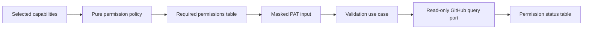

# Setup PAT Permission Guidance and Verification

- Status: Implemented — permission UX, read-only probes, architecture, coverage, and documentation gates complete
- Date: 2026-09-20
- Catalog capability ID: `setup-and-doctor`
- Last verified: 2026-09-20
- Owners: Copilot maintainers and setup operators
- Scope: show least-privilege permission requirements before collecting setup and workflow PATs, then report evidence-based permission checks without exposing or mutating credentials
- Related issues/PRs: none recorded
- Required review gates: product UX, architecture, testing, documentation,
  security/operations, CLI accessibility
- Open decisions blocking readiness: none

## 1. Executive summary

`copilot setup` MUST explain the permissions required by each GitHub PAT before
the secret prompt and MUST show an evidence-based permission report immediately
after a newly supplied token is validated. The setup PAT and workflow PAT remain
separate credentials with separate least-privilege matrices.

GitHub does not expose a complete self-inspection API for fine-grained PAT
permissions. The product therefore MUST distinguish permissions that were
verified through a safe read-only probe, permissions that were rejected, and
write levels that cannot be proven without a mutation. It MUST never perform a
write merely to turn an unknown result into a pass or fail.

```text
selected setup capability -> required permission table -> masked PAT prompt
-> identity/repository validation -> read-only permission probes -> status table
-> continue, block, or explain unverifiable write levels
```

## 2. Problem, current behavior, and evidence

### 2.1 Problem

Operators currently see prose explaining that the setup and workflow PATs are
different, but the terminal does not show the exact repository/organization
permission matrix at the point of entry. After entry it reports only overall
credential validity. Operators can therefore discover a missing permission late,
after setup has started a remote operation or a workflow fails at runtime.

### 2.2 Current behavior

1. `SetupCredentialPromptAdapter.requestSetupPat` explains memory-only handling
   and asks for a masked setup PAT.
2. `SetupCredentialValidationAdapter.validateSetupPat` verifies `/user` and
   repository metadata access only.
3. `SetupCredentialsUseCase` later explains credential separation, prompts for
   the workflow PAT, and reuses setup-PAT validation for that token.
4. `docs/authentication.mdx` documents detailed conditional permissions, but the
   same information is not projected into the terminal journey.

### 2.3 Evidence

- Code: `src/cli/setup_credential_prompt_adapter.ts`,
  `src/application/usecases/setup/setup_credentials_use_case.ts`,
  `src/infrastructure/setup_credential_validation_adapter.ts`, and
  `src/cli/commands/setup.ts`.
- Tests: setup credential use-case, prompt-rendering, and credential-validation
  adapter suites catalogued under `setup-and-doctor`.
- Documentation: `docs/authentication.mdx` and GitHub's REST documentation for
  fine-grained PAT permissions and `X-Accepted-GitHub-Permissions`.
- Provider limitation: `X-Accepted-GitHub-Permissions` describes an endpoint's
  requirements, not the complete grants of the presented fine-grained PAT.

### 2.4 Retrospective classification

- Observed behavior: the current CLI separates PAT roles and validates identity
  plus repository access.
- Intentional contract: masked input, in-memory-only setup PAT, remotely stored
  workflow PAT, and no secret values in plans/logs/output.
- Known debt and limitations: permission requirements are prose-only and the
  workflow PAT receives no capability-level audit.
- Unknown rationale: no evidence establishes that the coarse validation result
  was intended as the final permission UX.
- Proposed improvement: the permission planning, probing, and presentation
  contract in this SDD.

## 3. Actors, surfaces, and terminology

| Actor | Goal | Entry point | Visible surfaces |
|---|---|---|---|
| Setup owner | create the least-privileged setup PAT | `copilot setup` setup-PAT prompt | required-permissions table and result table |
| Bot owner | create the least-privileged workflow PAT | workflow-PAT prompt | selected-feature permission table and result table |
| Operator | diagnose an inconclusive permission | setup output and authentication docs | status reason and recovery action |

A **permission requirement** is a token role, GitHub scope, permission name,
access level, applicability, and reason derived without inspecting a secret. A
**permission check** is one safe observation for that requirement. `Verified`
means a read-only provider operation proved the required capability; `Missing`
means GitHub rejected a deterministic probe after token identity and repository
access were established; `Unverifiable` means GitHub does not provide a safe
non-mutating proof for the required access level or returned an ambiguous or
transient response.

## 4. Goals, non-goals, and fixed invariants

### 4.1 Goals

1. Both PAT prompts MUST show a complete, role-specific permission table before
   reading the secret.
2. A newly supplied PAT MUST produce a permission status table in the same
   terminal flow before setup relies on it.
3. Workflow-PAT requirements MUST be narrowed by the final selected features;
   optional permissions MUST state their enabling condition.
4. Missing safely verifiable required access MUST block the dependent setup
   phase before mutation.

### 4.2 Non-goals

1. Setup does not enumerate, create, edit, rotate, or revoke GitHub PATs.
2. Setup does not prove write access by creating temporary labels, branches,
   files, Variables, Secrets, comments, projects, or workflow runs.
3. Existing remote Secret values remain unavailable and are not reclassified as
   fully permission-verified without credential-health evidence.
4. This change does not merge the setup and workflow PAT roles.

### 4.3 Fixed product/safety invariants

1. Token values MUST remain masked, memory-only where already specified, and
   absent from requirements, checks, errors, fixtures, logs, and documentation.
2. Provider text MUST be mapped to bounded semantic reasons; raw bodies and
   authentication headers MUST never be rendered.
3. A read probe MAY prove equal or weaker access. A read probe MUST NOT claim
   that a write requirement is verified.
4. `Unverifiable` MUST NOT be rendered as `Verified` or `Missing`.
5. No permission-check configuration may enable mutating probes.

## 5. Current versus proposed product journey

| Stage | Current | Proposed | User/operator effect |
|---|---|---|---|
| Setup PAT guidance | explanatory paragraph | bootstrap permission matrix before prompt | operator can configure the PAT before pasting it |
| Setup PAT result | identity/repository validity | identity plus permission evidence table | missing read access is visible early |
| Workflow PAT guidance | credential-separation paragraph | exact matrix derived from selected features | bot PAT avoids unnecessary grants |
| Workflow PAT result | generic valid/invalid check | one row per permission with evidence state | workflow readiness is understandable before Secret write |
| Inconclusive write access | discovered during mutation/runtime | explicit `Unverifiable` with reason | no false assurance and no test mutation |



Text equivalent: selected capabilities produce a pure permission plan; the CLI
presents that plan before secret input; a validation use case then invokes only
read-only GitHub queries and presents ordered permission outcomes.

## 6. Functional behavior and state model

### 6.1 Setup PAT

1. After repository coordinates are resolved and before `readSecret`, setup
   renders the bootstrap requirements needed to inspect the repository and
   build the plan. Conditional rows explicitly identify later feature/storage
   choices that can require broader access.
2. After entry, setup validates identity and repository selection, executes the
   safe bootstrap probes, and renders results in the same order as requirements.
3. A missing required bootstrap permission blocks the wizard before remote
   inspection. Missing conditional Secret/Variable inventory access remains
   visible but does not block before the operator has selected storage features.
4. Pre-plan remote inventory MUST map unavailable repository and organization
   Secret/Variable reads to bounded access facts instead of throwing. The wizard
   may continue with unknown inventory, but MUST NOT describe unavailable data
   as an empty resource list.
5. After the final configuration is approved, the setup PAT permission plan is
   recomputed for mutation-time capabilities. Newly relevant missing access
   blocks mutation; unverifiable write levels remain visible and are allowed to
   proceed under the existing partial-failure/retry contract.
6. If repository Secret or Variable inventory is still unavailable or unknown
   for a selected managed resource, setup MUST stop after rendering the final
   permission table and before credential decisions, resource targeting, or
   mutation. An empty collection is authoritative only when its access state is
   `available`; transient or ambiguous failures MUST NOT imply absence.

### 6.2 Workflow PAT

1. The final `SetupConfiguration` determines workflow permissions.
2. The table always includes repository Metadata read, Actions write, Contents
   write, Issues write, and Pull requests write.
3. Administration read is included for release/hotfix orchestration or guarded
   PR approval. Checks read and Variables read are included for guarded
   approval. Organization Members read, Issue Types write, Projects write, and
   organization Variables read are included only when their selected capability
   and target require them.
4. Identity/repository validation and safe read probes run before the value is
   accepted for Secret provisioning.

### 6.3 Permission states

| State | Entered when | User-visible meaning | Setup behavior | Recovery |
|---|---|---|---|---|
| required | before input | grant this access level | wait for masked input | configure PAT |
| verified | safe evidence proves the level | capability is available | continue | none |
| missing | deterministic provider denial | capability is unavailable | block if required | grant permission/repository access |
| unverifiable | write level or ambiguous response cannot be safely proven | no pass/fail claim | continue with warning unless base token invalid | inspect PAT settings or run doctor/workflow |

Duplicate requirements are normalized to the strongest access level and one
row. Provider probes MAY complete concurrently, but presentation order remains
deterministic. Retry creates no durable permission state.

## 7. User-facing configuration

This change adds no public flag, environment variable, config field, or workflow
input. Requirements are derived from the existing immutable configuration,
repository owner type, storage targets, and selected features. The permission
catalog, status semantics, maximum probe concurrency, and prohibition on write
probes are intentionally not configurable.

Recommended interactive use remains `copilot setup`. Non-interactive setup
prints permission results for supplied PATs but never prompts. `--dry-run`
prints requirements and any available checks without implying mutation access.

## 8. Clean Architecture design

### 8.1 Responsibilities and dependency direction

| Layer/boundary | Owns | Must not own/import |
|---|---|---|
| Domain/pure policy | permission vocabulary, strongest-level normalization, capability-to-requirement decisions | terminal, fetch, Octokit, tokens |
| Application | validate-token-permissions use case, ordered result contract, blocking policy | provider endpoints/headers, console |
| Semantic ports | read-only identity/repository/permission inspection | mutation methods or provider DTOs |
| Infrastructure adapter | bounded GitHub GET/GraphQL probes, status/error mapping, non-throwing optional resource inventory | feature selection or rendering |
| CLI presentation | narrow tables, icons plus status text, wrapping/no-color behavior | capability policy or remote calls |
| Entrypoint/composition | target/config projection and concrete wiring | duplicated requirement lists |

The dependency direction is CLI/infrastructure -> application -> domain. The
application-facing permission query port exposes no POST, PUT, PATCH, DELETE,
upsert, dispatch, or temporary-resource operation.

### 8.2 Contracts, state, and trust boundaries

- Pure decisions: token role, permission list, strongest access, applicability,
  blocking requirements, and stable order.
- Application contracts: immutable requirement/check arrays and a summary with
  `ready`, counts, and credential identity check.
- Semantic port: one `inspect(owner, repository, token, requirements)` read-only
  operation returning semantic evidence states.
- Durable state: none; results exist only for the command.
- Concurrency/idempotency: bounded read probes, stable order, safe repetition.
- Remote inventory state: repository and organization Secret/Variable access is
  represented separately from the discovered resource names; unavailable or
  unknown access is never projected as a confirmed empty inventory.
- Fail-closed consumers: credential collection and resource provisioning reject
  unavailable/unknown selected repository inventory even when a permission
  probe can report only `Unverifiable` rather than deterministic `Missing`.
- Untrusted inputs: provider status/body/headers, repository metadata, token.
- Provider error mapping: 401 invalid token; deterministic 403/404 after base
  access is missing; rate limit/5xx/network/unsupported proof is unverifiable.

### 8.3 Executable architecture constraints

1. Pure permission policy imports no CLI, `node:*`, infrastructure, Octokit, or
   fetch types.
2. Architecture tests reject mutation verbs on the permission query port and
   reject permission catalogs duplicated in CLI/infrastructure.
3. Adapter tests assert every request is GET or GraphQL query and that rendered
   values never contain the token or raw response body.

## 9. UI/UX and content contract

### 9.1 Information hierarchy

1. PAT role and why it is needed.
2. Required permission matrix.
3. Masked input prompt.
4. Identity/repository result.
5. Permission status matrix.
6. One next action for missing or unverifiable access.

### 9.2 Representative views

```text
Setup PAT permissions required

Permission              Access       Applies to
Metadata                Read         Repository discovery
Secrets                  Write        Provision selected Actions Secrets
Variables                Write        Provision selected Actions Variables
Actions                  Write        Credential-health workflow

Enter Setup PAT: ********

Setup PAT permission check

Status            Permission              Access
✅ Verified        Metadata                Read
❌ Missing         Secrets                  Write
? Unverifiable    Variables                Write

Action required: grant Secrets write access to this repository and retry.
Unverifiable means GitHub offers no safe read-only proof of that write level.
```

The workflow-PAT view uses the same structure and the title `Workflow PAT`.
Tables MUST use status text as well as symbols, fit terminal widths 40/80/120,
wrap purpose/action text, and remain understandable with `NO_COLOR`. Token,
authorization headers, raw provider prose, account email, and private response
payloads never appear.

### 9.3 Primary states

- Pending: required table followed by masked prompt.
- Action required: at least one required permission is missing; no dependent
  mutation has started.
- Partial: verified and unverifiable rows coexist with an explicit limitation.
- Blocked/failed: token invalid, wrong repository selection, or required safe
  probe rejected.
- Complete: all safely verifiable requirements pass; write-only rows may remain
  explicitly unverifiable.

GitHub issues, PRs, or comments are not changed by this local terminal feature.
No durable marker or notification is created.

## 10. Failure, recovery, and cleanup

| Failure/partial state | User impact | Retained facts | Automatic retry | Required action | Cleanup |
|---|---|---|---|---|---|
| invalid token | setup stops before remote planning | no token/result persisted | no | replace PAT | none |
| wrong repository selection | setup stops | identity only in memory | no | grant repository access | none |
| missing safe-probe permission | dependent phase stops | table remains in terminal | no | grant named permission | none |
| optional repository inventory denied before selection | wizard continues with unavailable/unknown inventory; the final audit blocks if the capability becomes required | access state and completed permission rows | no | select features, then grant any required permission named by the final table | none |
| selected repository inventory remains unavailable after final audit | setup stops before credential prompts, target resolution, or mutation; no empty inventory is inferred | final permission table and bounded access state | no | retry after provider recovery or correct the named PAT permission | none |
| write level unverifiable | setup may later fail at first real write | verified read facts | no | inspect PAT settings; rerun | none |
| rate limit/network/5xx | no false missing result | other completed rows | bounded provider retry only | retry later | none |
| narrow terminal | table wraps | semantic row order | not applicable | none | none |

## 11. Security, permissions, and privacy

1. The feature promotes least privilege and never recommends Administration
   write, Secrets access, Variables write, Webhooks, or Workflows access for the
   runtime PAT unless a future reviewed capability requires it.
2. Permission probes are read-only and target only the resolved repository or
   selected organization resources.
3. Tokens never enter requirement/check objects, renderer fixtures, thrown
   messages, logs, snapshots, analytics, or durable files.
4. A provider denial is not retried with broader endpoints and an ambiguous
   denial is not converted to `Missing` without base identity/repository proof.

## 12. Observability and operational UX

The CLI reports role, stable permission ID, target scope, requested level,
semantic status, and bounded reason. It MAY log total verified/missing/
unverifiable counts in debug mode, never the token or raw headers. There is no
telemetry service. Status ordering is the requirement-plan order, independent
of probe completion order.

## 13. Compatibility, migration, rollout, and rollback

No config or persistent-state migration is required. Existing CLI flags and PAT
sources remain valid. The output is additive. Automation consuming human CLI
text is unsupported; exit behavior changes only when a newly detected,
deterministically missing required permission fails earlier than the eventual
remote operation would have failed. Rollback removes the permission use case,
port, adapter, and presenter together; it must not leave duplicated static
permission prose in the CLI.

## 14. Testing strategy and numeric budget

This SDD adds at least **26 distinct cases**.

| Area | Minimum distinct cases | Behaviors/risks covered |
|---|---:|---|
| Domain permission policy | 6 | setup/workflow plans, conditional permissions, strongest-level dedupe, stable order |
| Application state/blocking | 4 | verified, missing, unverifiable, invalid base token |
| Adapter/provider contracts | 7 | GET-only probes, 401, deterministic denial, rate limit/5xx, redaction, bounded unavailable repository inventory, unavailable endpoint state |
| Setup/credential integration | 5 | pre-prompt setup table, conditional denial through planning, final setup check, fail-closed credential/resource consumers, workflow PAT check |
| UI/accessibility | 3 | required/result tables, 40-column wrapping, no-color text |
| Architecture/security/docs | 1 | query-only boundary and no duplicated catalog |
| **Total** | **26** | No double counting |

The pure policy requires 100% statements/branches/functions/lines. Changed
application modules require at least 95% statements and 90% branches; terminal
presentation and provider adapters require at least 90% lines and 85% branches;
repository thresholds remain in force. Tests use deterministic fake responses,
no live GitHub calls, no real secrets, no mutating requests, and semantic
assertions rather than snapshots alone. Manual evidence covers both PAT prompts
at widths 40/80/120 and `NO_COLOR`.

## 15. Documentation and discoverability

| Audience | Artifact/page | Required content | Validation/navigation |
|---|---|---|---|
| Setup owner | `docs/authentication.mdx` | both matrices, status meanings, provider limitation | docs validation and setup links |
| Operator | `docs/configuration-checklist.mdx` | preflight and recovery for each status | checklist link validation |
| Troubleshooter | `docs/security-operations/operations/troubleshooting.mdx` | missing versus unverifiable decision | docs validation |
| Contributor | `docs/development/architecture.mdx` | policy/use case/query adapter/presenter boundary | architecture test reference |

## 16. Acceptance scenarios

1. Given interactive setup, before secret input the terminal shows the setup PAT
   role, every bootstrap permission, access level, and purpose.
2. Given a valid setup PAT with safe probe access, after input the terminal shows
   textual `Verified` rows and setup continues.
3. Given a valid token missing a safely probed required permission, the terminal
   shows `Missing`, one recovery action, and no dependent mutation occurs.
4. Given a valid token missing only a conditional repository Secret or Variable
   read before feature selection, remote inventory records that access as
   unavailable without throwing; if the final plan requires it, the configured
   permission table shows `Missing` and setup stops before mutation.
5. Given a selected managed Secret or Variable inventory whose read remains
   unavailable or unknown while its permission probe is merely unverifiable,
   the final table remains visible and setup stops before credential prompts,
   scope resolution, or mutation without treating the inventory as empty.
6. Given a write permission that GitHub cannot prove without mutation, the row
   shows `Unverifiable`; no write probe occurs and no verified claim is made.
7. Given the final selected features, the workflow PAT table contains exactly
   their required repository/organization permissions and no unrelated grant.
8. Given a workflow PAT with invalid identity or repository selection, it is not
   accepted for Secret provisioning.
9. Given provider 429/5xx/network failure, the affected row is unverifiable, raw
   provider text is absent, and other rows remain ordered and visible.
10. Given width 40 or `NO_COLOR`, symbols are accompanied by status text and the
   table remains readable.
11. Given non-interactive supplied credentials, no prompt is created but the
   requirement and result reports are still emitted.
12. Given architecture validation, the permission port exposes only read
    semantics and the renderer contains no permission decision catalog.

## 17. Requirements traceability

| Requirement | Policy/use case/adapter/presentation | Test or evidence | Documentation |
|---|---|---|---|
| role-specific least privilege | permission policy | policy matrix tests | authentication |
| pre-prompt table | credential orchestration/presenter | CLI prompt tests | authentication |
| safe evidence states | validation use case/query adapter | state/error mapping tests | troubleshooting |
| no write probes | semantic query port/architecture rule | method/transport tests | architecture |
| secret safety | all contracts/presenter | redaction fixtures | credentials |
| feature-derived workflow PAT | configuration projection policy | conditional matrix tests | checklist |

## 18. Implementation sequence

1. Add immutable permission vocabulary and pure setup/workflow requirement policy.
2. Add the read-only permission inspection port, use case, and unit tests.
3. Add the GitHub read-only adapter and semantic error mapping tests.
4. Add requirement/result presenters and integrate setup PAT before the wizard.
5. Integrate the final setup-PAT and workflow-PAT checks into credential setup.
6. Add architecture enforcement, docs, catalog evidence, and generated artifacts.
7. Run targeted suites, coverage, specifications, docs, typecheck, and lint.

## 19. Definition of Done

- [x] Both PATs show role-specific requirements before masked input.
- [x] Both PATs show ordered verified/missing/unverifiable outcomes after input.
- [x] Required deterministic denials block before dependent mutation.
- [x] No validation request mutates GitHub and no result overclaims write access.
- [x] Token values and raw provider text are absent from all output/state/errors.
- [x] Clean Architecture boundaries and their executable test pass.
- [x] At least 26 distinct cases and stated coverage thresholds pass.
- [x] Authentication, checklist, troubleshooting, and architecture docs agree.
- [x] Catalog evidence and generated `specs/CATALOG.md` are current.
- [x] Specification, documentation, typecheck, lint, and test gates pass.

## 20. References and decisions

- Baseline SDD: [`setup-configuration-credentials-and-doctor.md`](./setup-configuration-credentials-and-doctor.md).
- Architecture SDD: [`setup-doctor-architecture-hardening.md`](./setup-doctor-architecture-hardening.md).
- GitHub primary source: [Permissions required for fine-grained personal access tokens](https://docs.github.com/en/rest/authentication/permissions-required-for-fine-grained-personal-access-tokens).
- GitHub primary source: [Troubleshooting the REST API](https://docs.github.com/en/rest/using-the-rest-api/troubleshooting-the-rest-api).
- Decision: retain an explicit `Unverifiable` state instead of performing test
  mutations or presenting false binary certainty.
- Rejected: parsing only `X-Accepted-GitHub-Permissions` as the token's grants;
  the header describes endpoint requirements, not a complete token inventory.
