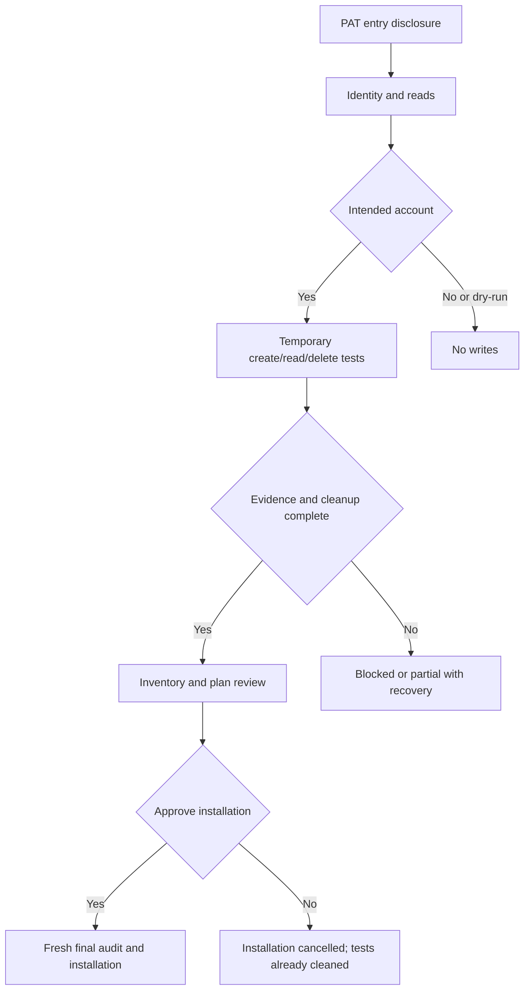
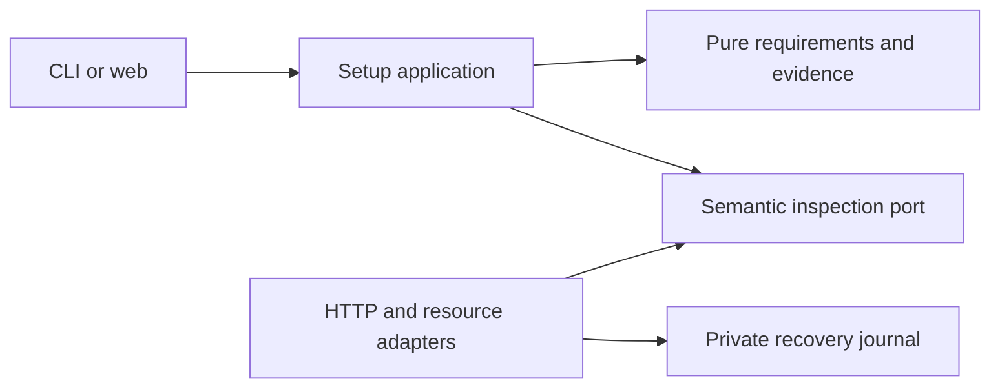

# Setup PAT Permission Guidance and Verification

- Status: Implemented fixture baseline; live provider, accessibility, and Windows ACL gates remain open
- Date: 2026-09-20
- Catalog capability ID: `setup-and-doctor`
- Last verified: 2026-10-07 (automated fixtures and isolated live provider transactions)
- Owners: Copilot maintainers and setup operators
- Scope: show least-privilege permission requirements before collecting setup and workflow PATs, then prove each selected read or write capability with bounded, visible operations
- Related issues/PRs: none recorded
- Required review gates: product UX, architecture, testing, documentation,
  security/operations, CLI accessibility
- Open decisions blocking readiness: none for the fixture baseline. Release evidence still requires the explicitly open human/provider gates; strict disposable probes have prerequisites beyond some runtime grants.

## 0. Capability contract and provider limits

This is the canonical active-probe contract. The superseded acknowledgement
implementation is available in Git history and is not a supported continuation
path. This audit starts from the develop merge of
[PR #403](https://github.com/vypdev/copilot/pull/403). It uses deterministic
fixtures and repository checks, supplemented by explicitly authorized isolated
live PAT transactions. No setup plan was applied or dogfooding performed.
See [bounded provider evidence](../docs/development/setup-pat-provider-audit-2026-10-06.md).

### Capability evidence and result rules

1. A required READ row runs a read of the exact resource family and scope. A
   successful response with an empty collection is a successful read; an
   error response is never interpreted as an empty collection. If the same
   resource is anonymously public, the UI says *read succeeded; PAT grant not
   independently established* rather than claiming the PAT has the grant.
   Selected private Projects are checked at their exact identifiers after
   selection; a public or empty organization list alone does not prove access
   to a private selected Project.
2. A required WRITE row must run a capability-specific create, read, and delete
   cycle against a uniquely named disposable resource in the selected scope.
   Successful READ alone never proves WRITE. One resource family cannot stand
   in for another. A successful create with failed read or cleanup is **not**
   Verified. The row names the failed phase and a bounded HTTP category,
   without raw provider body, headers, token, or secret value.
3. PAT entry and environment-PAT selection MUST disclose isolated temporary
   create/read/delete checks before planning, notifications/audit history, and
   cleanup requirements. Manual and supplied-token paths include displayed
   conditional writes; guided intent defers its possible health prerequisites
   until authenticated inspection and plan approval establish a requirement. Bootstrap
   first validates identity and required reads, confirms the intended guided
   operator account, and then executes the displayed write transactions.
   Guided conditional health grants MUST be prefilled when Secret management is
   selected, but MUST NOT authorize an early write test or establish evidence.
   Manual conditional rows retain their initial permission tests. Organization writes require
   metadata proving the exact selected repository's organization owner.
   Final review still approves persistent setup application and provisioning;
   its fresh configured audit runs before those operations. A revision or
   decline cannot undo already cleaned permission tests or their audit history.
   The workflow PAT
   receives the same evidence standard. Where a capability has no isolated
   disposable operation, setup blocks with a concrete explanation until an
   equivalent operation is implemented; neither a generic confirmation prompt
   nor `--confirm-unverifiable-write-permissions` constitutes evidence.
   Preview-only and `--dry-run` paths stop after the reviewed plan and never
   execute any disposable WRITE audit or journal recovery writes, even if a
   PAT was supplied. Read-only inspection never performs cleanup mutations.
4. The web and CLI show ordered, live events for identity validation and each
   permission: pending, checking READ or creating/reading/deleting a temporary
   resource, verified, failed, or interrupted. Concurrency is at most four
   independent checks. The web publishes incremental revisions with an
   accessible live region; every row contains text and an actionable,
   sanitized result. The `secret-collision` diagnostic survives the web bridge
   allowlist and selects the existing localized audit-trail guidance. Locale
   coverage is en/es/fr/pt; CLI remains English. Bootstrap READ and conditional
   WRITE rows for the same permission MUST have distinct stable row IDs, so a
   progress update cannot change the other row's state or collide in a keyed
   browser list. The configured final audit may still collapse them to the
   strongest required grant.
5. A probe uses a random, namespaced resource name and create-only semantics
   where GitHub provides them. It reads back the exact resource and deletes
   only the exact object it created. Upsert-only Secret endpoints require a
   404 preflight, a 201 create response, and an exact-name readback before
   cleanup. Secret names use 256 bits of fresh entropy. GitHub does not offer
   an atomic create-only Secret operation or conditional unsafe request: a
   concurrent actor who learns and creates the same name between preflight and
   PUT can still be overwritten. A 204 update response is a collision incident,
   never a verified grant or ownership proof; do not delete that Secret. The
   plan and failure must disclose this residual provider limitation rather than
   claim that preflight makes upsert atomic. All other probes use create-only
   operations and never change an existing resource. If the process times out, is
   cancelled, crashes, or loses the cleanup response, record only the bounded
   cleanup target and attempt id in a local, permission-restricted recovery
   journal; resume cleanup before a new probe. An unresolved cleanup blocks
   setup and is shown to the operator. When a disposable Issues probe changes
   from labels to Issues, recovery must still recognize journaled label names
   from the earlier format.
   Never persist the PAT or a test secret.
6. Provider 401 and explicit permission-denial 403 are failures; rate limits,
   SSO, ambiguous 403/404, network errors, malformed success bodies, and 5xx
   remain indeterminate and block required work. A retry starts a new audit;
   a stale asynchronous result cannot overwrite a newer run or a closed local
   session. Secret-bearing values and raw provider messages never reach the
   browser or terminal.
7. A workflow dispatch requests `return_run_details: true` in the **request
   body** and requires an exact run ID before it can claim Actions WRITE. A
   candidate workflow is parsed as YAML and must declare `workflow_dispatch`
   under its top-level `on`, whether that value is a scalar, an event array,
   or an event mapping. Comments or nested strings do not establish a
   dispatch trigger. The probe resolves the default branch to one immutable
   commit SHA **before** reading candidate workflow bytes. It reads those bytes
   with `ref=<that SHA>` and creates the temporary branch from the same SHA;
   a default-branch advance between those operations cannot substitute a
   different workflow for the trusted packaged-file hash. The probe never
   dispatches an arbitrary uninspected workflow; its existing no-job override
   and trusted packaged-file checks still apply. A fixture MUST advance the
   mutable default branch between requests and prove that the inspection and
   branch creation remain pinned to the same commit. See [GitHub workflow syntax](https://docs.github.com/en/actions/reference/workflows-and-actions/workflow-syntax).
   A `204` dispatch response is accepted only after the probe finds exactly one run for
   its private branch, `workflow_dispatch` event, and selected workflow ID,
   then reads that exact run before cleanup. If the run is not uniquely
   identifiable, the recovery journal retains the target until the run or its
   absence and branch cleanup are confirmed. Fixture tests assert the request
   body, 200 and 204 success paths, and rejection of ambiguous responses. This follows
   [GitHub's workflow dispatch API](https://docs.github.com/en/rest/actions/workflows).
   Workflow discovery reads up to five bounded Actions-index pages of 100 and
   checks up to 64 active candidate files, preferring the exact packaged
   credential-health path. It must inspect candidates beyond the eighth and
   on a later index page. If either limit is reached without a safe dispatch
   candidate, the result is explicitly `Unverifiable` due to an incomplete
   search, never a claim that no eligible workflow exists. Fixtures include
   a ninth candidate and a second-page candidate.
8. Initial and final audits report whether any disposable write has **unconfirmed
   cleanup**. A cleanly deleted probe does not count as a remaining setup
   mutation. If cancellation or expiration races with an audit that reports
   pending cleanup, the session reports `partial`, retains the bounded
   permission failure and local recovery journal, and blocks another run until
   recovery succeeds. If cleanup was confirmed, cancellation remains
   `cancelled` and expiration remains `blocked`. The web and CLI show the
   affected permission and recovery action without raw provider data.
9. If a process stops after creating an organization Project but before
   journaling its ID, recovery queries `organization.projectsV2` with the
   exact random Project title as GitHub's documented `query` filter. It still
   checks every returned title and ID, rejects duplicate exact matches, and
   keeps a bounded pagination limit. Recovery must find the temporary Project
   even when the organization has more than 500 unrelated Projects; a full
   unfiltered organization scan is not acceptable.
10. The per-request timeout covers response headers **and complete body
    consumption**. A provider that sends headers and then stalls its JSON body
    must yield a bounded, sanitized failure; no permission becomes Verified.
    Fixture tests hold the body open beyond the deadline and prove that the
    probe exits without hanging or leaking provider content.
11. Repository Issues WRITE cannot be established by creating a label or
    milestone: GitHub also accepts Pull requests WRITE for those endpoints.
    The probe creates an exact, randomly named Issue through the Issues-only
    create endpoint, reads it by number, and attempts the GraphQL `deleteIssue`
    mutation only after confirming its title, repository and node ID. It
    verifies absence after deletion. The local journal records only the title,
    bounded number and node ID, and searches for the exact title if the process
    dies after creation but before it can record the number. An ambiguous or
    duplicate search blocks automatic deletion. If GitHub denies deletion,
    the probe closes the exact Issue, verifies its closed state, reports its
    number and the residual audit trail, and blocks setup with pending cleanup.
    It never treats closing as deletion or a verified grant. The reviewed plan
    warns that Issue creation can notify watchers and that permanent deletion
    requires repository administration and, for organizations, owner enablement.
    This follows GitHub's [Issues REST permissions](https://docs.github.com/en/rest/issues/issues),
    [GraphQL `deleteIssue`](https://docs.github.com/en/graphql/reference/issues),
    and [deletion policy](https://docs.github.com/en/issues/tracking-your-work-with-issues/administering-issues/deleting-an-issue).

### Actions prerequisite diagnostics — 2026-10-06

An Actions WRITE check that stops before dispatch MUST remain `Unverifiable`;
it MUST NOT claim an absent Actions grant from a failed supporting operation.
The report and live progress carry only one of three bounded prerequisites:
`contents-write` (temporary branch denied), `contents-workflows-write` (disabled
workflow override denied), or `dispatch-workflow` (no eligible default-branch
workflow found). The application accepts these codes only on repository Actions
WRITE rows with `Unverifiable` status. Unknown codes and contradictory success
are rejected. The CLI keeps a sanitized explanatory message; web progress,
context and blocked result use the same localized explanation, never provider
prose. Cleanup errors retain priority and their existing recovery contract.

A 403 from the override preserves HTTP 403 and explains that Contents and
Workflows WRITE, repository selection and organization authorization need review.
A non-403 override failure preserves its actual HTTP/network classification; it
MUST NOT invent a permission-denial cause. Workflows is tested independently;
a permission-bound denial on that row remains `Missing`. GitHub's accepted
permissions header cannot prove the token's grants. Before approval the plan
explains the Actions prerequisites, including the difference between using the
exact packaged workflow and preparing a disabled-job override. The override's
`run` value is a YAML string, even though its job is disabled.

```text
No setup changes started
Actions · repository · Write · Unverifiable
  Actions was not tested because its temporary workflow could not be written.
  Check Contents and Workflows Write, repository selection and organization authorization.
Workflows · repository · Write · Missing
  Review the PAT in GitHub, then start a fresh setup run.
```

Text equivalent: the Actions capability has not been exercised; its workflow
preparation was denied. Correct the prerequisite rather than assuming Actions
is absent. No setup plan is applied by these isolated checks.

Incremental budget: **17 automated cases**: eight adapter/classification/progress
cases, six application evidence/security cases and three bridge allowlist cases.
The existing transaction/recovery and coverage gates remain required. The
credential-free browser fixture and four-locale result tests in the web SDD
establish presentation evidence. Authorized isolated provider transactions can
establish denial and cleanup for the supplied PAT; fixture success never proves
an unobserved live success. No new token scope is silently requested, no stored
configuration or journal schema changes, and rollback drops optional diagnostic
codes without weakening readiness. Authentication documentation describes the
operator correction and keeps setup/workflow PAT roles separate.

### Guided-link recovery after final inspection — 2026-10-07

Following the provisional guided link does not prove that later requirements
are already granted. An existing managed Secret plus a confirmed missing
credential-health workflow can add repository Workflows WRITE only after GitHub
inspection. The final audit MUST build its corrected link from final required
grants and report the delta from the provisional requirements. A denied
Workflows write remains Missing; Actions preparation failure remains
Unverifiable with its bounded prerequisite. The updated link must remain visible
on the blocked web result, independently of transient warning/cleanup messages.
See the recovery flow, representative UI and suppression conditions in section
9.1.2 of `specs/local-web-setup-assistant.md`. The user creates or corrects the PAT
on GitHub, selects the repository, closes the old local session and starts a
fresh setup run. No automatic retry or setup application is authorized here.

The shared incremental regression budget is **20 automated cases**, counted
once in the web SDD: seven bridge, twelve rendering and one final-requirements
case. The existing credential adapter test is extended through finish. No
additional grants are silently added by this recovery section. The reviewed
initial intent separately prefills disclosed health prerequisites when managing
Secrets, as specified in the operator-PAT SDD. Authentication
documentation explains the later link and independent Actions prerequisite;
isolated live denial/cleanup evidence remains distinct from fixture success.

### Implemented permission-specific operations

| Requirement | Disposable capability operation | Required cleanup |
|---|---|---|
| Repository / organization Variables WRITE | create a unique variable, GET exact name, DELETE exact name | verify absence; no overwrite |
| Repository / organization Secrets WRITE | fetch public key, preflight absence, upsert a 256-bit random-name encrypted secret, require 201, GET exact metadata, DELETE exact name | verify absence; a 204 update is a collision incident with no automatic deletion; provider has no atomic create-only endpoint |
| Repository Issues WRITE | create a unique Issue, GET its exact number, GraphQL-delete its exact node ID | verify absence; if deletion is denied, close and verify the Issue, show the residue, retain cleanup journal, block setup; recognize earlier label journals for recovery |
| Organization Issue Types WRITE | create unique disabled issue type, GET/list exact id, DELETE id | verify absence; org admin prerequisite reported separately |
| Repository Contents WRITE | create unique disposable ref, GET exact ref, DELETE ref; use a file on that ref when needed to prove file writes | verify ref absence; no default-branch commit |
| Repository Workflows WRITE | on the disposable ref, create a no-job workflow file, GET it, delete ref | verify ref absence; requires Contents WRITE too |
| Repository Actions WRITE | during PAT verification, create a disposable ref, dispatch a registered workflow on that ref, GET the exact returned run ID, cancel if needed, DELETE the run, then delete the ref. The packaged credential-health workflow may run unchanged only when its remote bytes match the trusted packaged template and all job inputs default false; otherwise write a verified no-job override on the disposable ref before dispatch | report unavoidable run/audit trail; Contents WRITE is always required to create the disposable ref, and the fallback also requires Workflows WRITE; a Contents denial must be named as that prerequisite rather than evidence against Actions WRITE |
| Repository Pull requests WRITE | open a draft PR from a disposable changed ref, GET exact PR, close PR and delete ref | report unavoidable PR audit trail and notifications |
| Organization Projects WRITE | create a disposable Project, GET exact Project, delete it | verify absence; never edit an existing item |

When a capability-specific operation needs another grant (for example,
Workflows and Contents), the UI displays that dependency and tests each named
permission separately. The audit cannot infer the missing grant from another
probe's success or from `X-Accepted-GitHub-Permissions`, which documents
endpoint requirements rather than the current token's grants.

### New acceptance budget and executable gates

The original 135 cases remain a historical baseline. The active-probe increment requires **63 distinct
cases**: 18 read outcomes (successful empty/nonempty, public/private,
selected Project, denial/ambiguity), 27 write transactions (create/read/delete
for each supported scope, rollback failure, and Issue-specific deletion/recovery), 10 progress and session cases
(ordered concurrency, keyboard/screen reader, cancel, timeout, stale result),
and 8 security/recovery cases (collision, ambiguous create, crash journal,
redaction). Total target: **198** cases, traceable in the acceptance matrix.
All provider tests use local fixtures or doubles. A live PAT is never placed
in source, test fixtures, logs, command arguments, CI, or screenshots. The
human review gate remains open until provider behavior, localized web views,
and cleanup are observed with disposable resources on an explicitly chosen
test repository. Successful fixture tests alone do not pass that gate.

### 60-case permission acceptance matrix

`Fixture` means the named automated suite has an assertion for the case; it
does not claim live GitHub behavior. `Open` requires a new automated test.
`Human` requires an observed review and remains open. Test suites: `R` =
`src/infrastructure/__tests__/setup_token_permission_query_adapter.test.ts`,
`W` = `src/infrastructure/__tests__/setup_permission_resource_probes.test.ts`,
`B` = `src/cli/__tests__/web_setup_bridge.test.ts`, and `Z` =
`src/application/usecases/setup/__tests__/setup_wizard_use_case.test.ts`.
The 350-case web-assistant ledger remains a separate baseline in
`specs/local-web-setup-assistant-acceptance.json`; these cases extend the PAT
capability contract without relabelling its 42 open gates.

| ID | Acceptance assertion | State / evidence |
|---|---|---|
| R01 | Private repository metadata GET verifies READ | Fixture R |
| R02 | Public repository GET is usable but does not claim PAT grant | Fixture R |
| R03 | Private empty commit list verifies Contents READ | Fixture R |
| R04 | Public empty commit list remains public-only evidence | Fixture R |
| R05 | Empty organization Projects list is a successful, public-only read | Fixture R |
| R06 | Non-public organization Project result verifies Projects READ | Fixture R |
| R07 | Non-public Project on a second bounded page is found | Fixture R |
| R08 | Two public Project pages remain available without grant proof | Fixture R |
| R09 | 401 blocks as missing | Fixture R |
| R10 | Explicit permission-denial 403 blocks as missing | Fixture R |
| R11 | Rate-limit/SSO/ambiguous 403 never passes | Fixture R |
| R12 | 404 is not an empty successful read | Fixture R |
| R13 | Unrelated 409 does not pass | Fixture R |
| R14 | Malformed provider success does not pass | Fixture R |
| R15 | Stalled read times out | Fixture R |
| R16 | Cross-origin Projects pagination never receives the PAT | Fixture R |
| R17 | Members READ requires active self-membership | Fixture R |
| R18 | A selected private Project is read by exact number after selection | Fixture R |
| W01 | Repository Variable create/read/delete | Fixture W |
| W02 | Organization Variable create/read/delete | Fixture W |
| W03 | Repository Secret encrypted create/metadata/delete | Fixture W |
| W04 | Organization Secret encrypted create/metadata/delete | Fixture W |
| W05 | Secret upsert collision never deletes the unknown value | Fixture W |
| W06 | Temporary Issue is deleted after readback mismatch | Fixture W |
| W07 | Issues-only create, exact read, node-ID deletion, and absence verification succeed | Fixture W |
| W08 | Disabled organization Issue Type is deleted by exact ID | Fixture W |
| W09 | Contents WRITE disposable ref is removed | Fixture W |
| W10 | Workflows WRITE disposable workflow ref is removed | Fixture W |
| W11 | Actions fallback recognizes scalar, array, and mapping `workflow_dispatch` triggers, dispatches the verified no-job branch workflow, and deletes run/ref | Fixture W |
| W12 | Trusted packaged health workflow dispatch needs no workflow-file rewrite; workflow bytes and temporary branch use the same immutable commit even if default advances | Fixture W |
| W13 | Rejected Actions dispatch cleans its branch without a false run claim | Fixture W |
| W14 | Active Actions run is cancelled and deleted before branch cleanup | Fixture W |
| W15 | Crash after accepted Actions dispatch recovers exact run/ref | Fixture W |
| W16 | Draft PR is read, closed and its branch deleted | Fixture W |
| W17 | Rejected PR creation deletes only its temporary branch | Fixture W |
| W18 | Crash after PR creation finds and closes the exact draft | Fixture W |
| W19 | Organization Project create/read/delete never edits an existing item | Fixture W |
| W20 | Project crash before ID journal update recovers by filtered unique title even when more than 500 unrelated Projects exist | Fixture W |
| W21 | Failed cleanup retains journal and blocks new setup | Fixture W |
| W22 | Ambiguous create response recovers without deleting an unrelated resource | Fixture W |
| W23 | An existing Secret at the generated name is never deleted | Fixture W |
| W24 | Workflow PAT write set uses the same post-plan transaction rule | Fixture `src/application/usecases/setup/__tests__/setup_token_permissions_use_case.test.ts` |
| W25 | Denied Issue deletion closes the exact Issue, reports its number, keeps a cleanup journal, and blocks setup | Fixture W |
| W26 | Lost Issue create response recovers by one exact search result; missing or duplicate search results never delete a different Issue | Fixture W |
| W27 | An old temporary-label journal still cleans the exact label; label success alone is not Issues WRITE proof | Fixture W |
| P01 | At most four probes run concurrently | Fixture R |
| P02 | Results retain requirement order under concurrency | Fixture R |
| P03 | Browser bridge publishes each bounded phase for one permission | Fixture B |
| P04 | Unknown role/row, late phase and provider prose are dropped | Fixture B |
| P05 | Cancellation during the audit stops before setup application | Fixture Z |
| P06 | Expiration during the audit stops before setup application | Fixture Z |
| P07 | Progress wording and error categories are verified in en/es/fr/pt | Fixture `src/cli/__tests__/web_setup_catalog.test.ts` |
| P08 | Keyboard and screen-reader progress is observed in all result states | Human |
| P09 | 200% zoom and responsive progress are observed in light/dark | Human |
| P10 | Pending cleanup is visible on the result screen | Fixture `src/cli/__tests__/web_setup_components.test.ts` |
| S01 | Journal persists no token or test Secret | Fixture W |
| S02 | Secret probe encrypts value and checks metadata only | Fixture W |
| S03 | Secret preflight, 256-bit private name, and 201 response bound collision risk; a 204 response fails without deleting the unknown Secret, and the UI discloses that GitHub upsert cannot guarantee atomic create-only behavior | Fixture W; provider limitation open |
| S04 | Interrupted Variable cleanup resumes from journal | Fixture W |
| S05 | Interrupted Project cleanup resumes without a saved ID | Fixture W |
| S06 | Pagination rejects cross-origin URL with the PAT | Fixture R |
| S07 | Journal rejects forged scope/name combinations | Fixture W |
| S08 | Windows journal ACL and service-account recovery are observed | Human |

The matrix records 60 fixture assertions and three explicitly open human
observations. Fixture coverage does not establish live GitHub behavior or close
the separate 42 open web-assistant cases.

## 1. Executive summary

Setup distinguishes the temporary operator PAT from the persistent workflow
PAT, derives permissions from the reviewed configuration, and checks actual
capabilities before provisioning. A read is usable only with valid scoped
evidence. A write needs its own approved temporary transaction and confirmed
cleanup. No confirmation or response header can substitute for that evidence.

```text
Intent → setup PAT identity and reads → account confirmation → setup PAT transactions
→ remote inventory → reviewed plan → approval → final audit → workflow PAT transactions
→ credential provisioning → installation receipt → user revokes setup PAT
```

## 2. Problem, current behavior, and evidence

### 2.1 Problem

A superficially successful probe can accept a malformed identity, consume a
native fetch body twice, mistake public metadata for an Administration grant,
or delete a temporary branch after another actor advanced it. Runtime grants
can also omit Contents read for routes that inspect commits and branches.

### 2.2 Current behavior

1. `/user` must return a positive numeric ID and safe login. Repository access
   must resolve the exact owner/repository and positive ID. Guided bot lookup
   additionally matches the requested login case-insensitively and binds the
   entered PAT to that immutable account ID before Secret installation.
2. Bootstrap confirms identity/account and tests displayed writes before the
   plan. Scope-sensitive inventory failures prevent subsequent installation;
   initial temporary tests can already have completed and been cleaned.
3. Approval authorizes only the displayed persistent installation plan. A fresh
   configured audit runs the family-specific probes in section 0. Preview and
   dry-run never write. Revising or declining a plan does not repeat its final
   audit. Existing PAT Secrets must be re-entered for auditing;
   credential-health success cannot reveal their grants.
4. Both transports share the application use cases and canonical evidence
   reconciliation. Malformed, duplicate, forged or contradictory evidence
   cannot alter requirements; matching pending cleanup remains blocking.

### 2.3 Evidence and classification

- Implementations and fixtures are registered under `setup-and-doctor` in
  `catalog.json`; the targeted audit suite is `setup_pat_audit.test.ts`.
- Observed facts: endpoint selection, status mapping, exact identities, bounded
  headers/body deadlines, cleanup and runtime authentication are fixture-tested.
- Intentional contract: fail closed on indeterminate required work; preserve
  public-read provenance; require transaction evidence for writes.
- Known limitations: section 0 provider constraints, residual ref deletion race,
  runtime-grant versus probe-prerequisite mismatch, and open human gates.
- Unknowns: actual current PAT form behavior, organization policy and Windows
  journal ACL behavior without live evidence. Fixtures do not establish these.
- Historic motivation beyond these contracts is not inferred from the audit.

## 3. Actors, surfaces, and terminology

| Actor | Credential | Surface and responsibility |
|---|---|---|
| Setup operator | Temporary setup PAT | CLI or local web, configuration and permitted setup changes |
| Workflow bot | Persistent `PAT` Secret | GitHub Action API/Git operations and selected Project roles |
| Reviewer | No credential | PR diff, tests, SDD/catalog and validation evidence |

`Verified` proves the capability, `Read available` proves exact public usability,
`Missing` means deterministic denial, and `Unverifiable` means insufficient
proof. Cleanup pending and Secret collision are blocking facts, including on a
conditional row. Operational availability never proves a write grant.

## 4. Goals, non-goals, and fixed invariants

### 4.1 Goals

- Functional permission matrices for selected CLI/web and runtime routes.
- No false positive from public endpoints, malformed data or another permission.
- Small adapters with shared deadlines and precise ownership-aware cleanup.
- Automated evidence and user/SDD documentation that describe the same contract.

### 4.2 Non-goals

Automatic token creation/revocation, GitHub account switching, live dogfooding,
deployment, replacing the Action PAT with job-local `GITHUB_TOKEN`, or weakening
write evidence to avoid a blocked provider prerequisite are outside this audit.

### 4.3 Invariants

- The setup PAT is never installed as the bot PAT implicitly or persisted locally.
- Initial write tests follow identity/account checks and PAT-entry disclosure;
  no persistent setup application before plan approval or on failed audit.
- Secret encryption uses libsodium `crypto_box_seal` after `sodium.ready` in a
  small shared infrastructure module. A truncated BLAKE2b-512 digest is not a
  valid sealed-box nonce and MUST NOT be substituted for libsodium encryption.
- Scope, role, row ID, level and provenance are immutable application facts.
- Default branch commits, existing Project items and unknown Secrets are never
  edited by probes. Upsert collisions disclose the unavoidable provider race.
- No raw provider body, PAT, authorization header or test Secret in presentation.

## 5. Product journey

| Stage | Before audit | Audited behavior |
|---|---|---|
| Identity | Object-shaped success could be accepted | Exact safe account and repository identity required |
| Administration | Ruleset listing could prove the wrong permission | Protected Actions-permissions read required |
| Network | Some deadlines covered headers only | Headers and body bounded; late reads cannot emit success |
| Runtime matrix | Read-only routes omitted Contents | Contents read appears for enabled runtime inspection |
| Cleanup | Branch name alone could authorize deletion | Exact ref and recorded commit must still match |
| Selected Projects | Disposable creation only | Every selected Project also confirms `viewerCanUpdate` |


```mermaid
flowchart TD
  A[PAT entry disclosure] --> B[Identity and reads]
  B --> C{Intended account}
  C -->|Yes| D[Temporary create/read/delete tests]
  C -->|No or dry-run| E[No writes]
  D --> F{Evidence and cleanup complete}
  F -->|Yes| G[Inventory and plan review]
  F -->|No| H[Blocked or partial with recovery]
  G --> I{Approve installation}
  I -->|Yes| J[Fresh final audit and installation]
  I -->|No| K[Installation cancelled; tests already cleaned]
```

Text equivalent: identity/reads → account confirmation → temporary checks → review
→ approval → final checks → installation,
or a blocked/partial result with the named failed phase and recovery action.

## 6. Functional behavior and state model

### 6.1 Read evidence

| Permission | Probe | Positive evidence |
|---|---|---|
| Metadata | Exact repository metadata | Private visibility proves authentication; public is available |
| Contents | Commit list | Valid list, or documented empty-repository 409 with known visibility |
| Administration | `/repos/{owner}/{repo}/actions/permissions` | Object with boolean `enabled`; endpoint requires Administration read |
| Actions / Checks | Workflow list / default-branch check runs | Valid collection and established visibility |
| Issues / Pull requests | Labels / open PR list | Valid collection and visibility; read success never proves write |
| Secrets / Variables | Exact-scope inventory | Valid protected collection |
| Members | Authenticated user's membership | Active membership for the exact organization |
| Issue Types | Organization collection | Public success cannot prove the token grant |
| Projects | Bounded list or selected exact number | Private read proves scoped read; public is available |

Repository/public collection responses must contain the expected array or
structured collection, including valid empty arrays. `{}`, malformed members,
wrong organizations, scalar payloads and unknown visibility do not pass.
Administration is never eligible for public-read provenance: ruleset listing
requires Metadata only and cannot establish Administration.

### 6.2 Runtime grants

Metadata read is unconditional. An enabled runtime route adds Actions read for
queue inspection and Contents read for branch/commit/file access. Managed issue
branches, file-editing comments or release/hotfix use Contents write instead;
release/hotfix also upgrades Actions to write. Issues and PR write are selected
by their actual routes. Guarded approval adds Administration, Checks and
Variables read, including organization Variables when the effective approval
policy is inherited there. Organization Members follows assignment/reviewer
counts, protected authorization and members-only agent actions. Disabled issue
routes do not gain authority from a retained workflow profile. Selected
organization Projects and Issue Types receive their own write requirements.

A grant and a disposable probe prerequisite are distinct. Opening a temporary
PR needs a changed branch (Contents write); Actions probing needs a branch and
sometimes a no-job workflow override (Workflows write); Issue deletion needs
administration/organization policy; organization Project creation may require
a stronger role than item updates. These constraints can block otherwise valid
runtime tokens. The audit does not silently add broad grants or claim that a
failure of a prerequisite proves absence of the target grant. This remains
explicit product debt until an equally strong isolated proof is available.

### 6.3 State transitions

| State | Meaning | Next action |
|---|---|---|
| pending/checking | No final evidence yet | Await bounded operation |
| creating/reading/deleting | Approved disposable operation | Await cleanup; never install early |
| verified/available | Capability or exact read usability established | Continue when every required row is usable |
| missing/unverifiable | Required evidence unavailable | Correct named access or retry; no generic override |
| cleanup pending | Residue cannot be safely removed | Recover exact journal target before new audit |
| partial | Session ended with unresolved effect | Inspect receipt, GitHub and journal |

Same-process inspections for one case-insensitive repository target are mutually
exclusive. Independent rows retain four-slot concurrency and stable ordering.
Another process with a live journal owner blocks recovery. Late results cannot
promote a timed-out read or supersede a cancelled/expired web session.

## 7. User-facing configuration

| Input | Default / boundary | Scope |
|---|---|---|
| Setup PAT | Hidden prompt; `--token` or `PERSONAL_ACCESS_TOKEN` alternative | Command memory only |
| Workflow PAT | Hidden bot prompt; explicit `--workflow-pat`/Secret input alternative | Approved Actions Secret scope |
| Feature/storage choices | Shared setup configuration and effective remote inventory | Reviewed plan |
| Projects | Canonical unique numbers, maximum 10, integers 1–2147483647 | Approved organization selection |
| `--yes` | Approves displayed plan | Does not prove grants |
| `--dry-run` | Preview only | No disposable write probes |
| Retired confirmation option | Rejected | No compatibility bypass |

No new public knob is added. Concurrency four, request deadline 10 seconds,
Projects discovery two pages of 100, Actions discovery five pages of 100 and 64
file checks are bounded implementation limits. Runtime JSON overrides follow
normal input precedence; a required empty PAT does not fall back to another
identity. The setup bootstrap/final matrices keep stable distinct read/write
IDs, then normalize the strongest required grant for final consumers.

## 8. Clean Architecture design

| Boundary | Owns | Excludes |
|---|---|---|
| Domain | Permission requirements, checks, provenance/proof types | HTTP/filesystem/frameworks |
| Pure policies | Feature-derived matrices and canonical evidence reconciliation | Provider/process imports |
| Application | Identity-before-probes, readiness, approved plan orchestration | Concrete fetch, Git and SDK DTOs |
| Semantic ports | `SetupTokenPermissionInspectionPort` and audit/presentation contracts | SDK/resource DTOs |
| Infrastructure | Read targets/shapes, HTTP deadlines, family transactions and journal cleanup | Product readiness decisions |
| CLI/web adapters | Masked entry and sanitized ordered presentation | Duplicated permission policy |
| Action/Git boundary | Runtime input masking and child-only GitHub credentials | Persistent credentials |


```mermaid
flowchart LR
  UI[CLI or web] --> UC[Setup application]
  UC --> Policy[Pure requirements and evidence]
  UC --> Port[Semantic inspection port]
  Adapter[HTTP and resource adapters] --> Port
  Adapter --> Journal[Private recovery journal]
```

The historical `SetupTokenPermissionQueryAdapter` class name is retained for
fixture compatibility, but its semantic interface is an inspection capability:
required approved writes are real transactions. Read mapping, Projects access,
workflow/Project cleanup and HTTP mechanics have separate modules. Architecture
fixtures enforce provider-independent policies and a 300-line ceiling for the
PAT orchestration/resource modules covered by this change.

## 9. UI/UX and content contract

Example primary rows, identically ordered across CLI/web:

```text
Setup PAT: @operator — identity verified
Metadata / Read      Read available — public repository; grant not independently proven
Administration / Read Verified — protected operation succeeded
Variables / Write    Creating → Reading → Deleting → Verified
Secrets / Write      Unverifiable — cleanup pending; inspect the audit trail
Action required: resolve the named cleanup before retrying. No installation started.
```

The reviewed plan lists disposable probes and unavoidable notifications/audit
history. A pending row names its phase without claiming readiness. A blocked
row names the permission, scope, level, bounded category and recovery. A partial
result preserves completed facts; cancellation never promises PAT revocation.

CLI is English; web uses en/es/fr/pt with accessible text and live regions.
Color/icons supplement textual state. Existing responsive, light/dark, keyboard,
zoom and screen-reader gates are retained; the human gates are not closed by
this audit. Test resources use a random namespaced title and exact IDs. PRs are
drafts, closed rather than merged; Issues may create notifications; no per-phase
GitHub comment is published. GitHub's own history remains after cleanup.

## 10. Failure, recovery, and cleanup

| Failure | Result and retained facts | Recovery |
|---|---|---|
| Invalid identity or exact repository mismatch | Block before capability probes | Correct account, selection or PAT |
| 401 / explicit permission 403 | Missing, unless cleanup still pending | Correct selected access |
| Rate limit, SSO, ambiguous 403/404, 5xx, malformed body or timeout | Unverifiable; raw data dropped | Resolve policy/network and retry |
| Secret PUT reports update | Blocking collision; unknown Secret not deleted | Inspect audit trail; no automatic ownership assumption |
| Ref SHA changed or legacy journal lacks SHA | Cleanup pending; branch retained | Inspect exact ref/commit manually |
| Issue deletion denied | Exact Issue closed and number retained; setup blocked | Authorized deletion and confirmed absence |
| Project role denied | Named selected Project blocks before disposable creation | Grant bot account access to that Project |
| Concurrent inspection | Second audit unavailable; no recovery of active resources | Retry after first completes |
| Session cancellation/expiry | Clean probes keep cancellation; pending effects become partial | Use result and journal to reconcile |

New journal records use version 2 so older releases reject them instead of
ignoring ownership and incident fields during rollback. Version 1 remains
readable for conservative recovery, including old label probes. New branch
entries record `referenceSha` before creation and after any successful file
commit. Actions entries also record the selected workflow ID before dispatch;
run cleanup requires that ID as well as run ID, event and branch. A present
legacy dispatched record without its workflow identity is rejected before
network recovery, whether or not it contains a run ID. The CLI reports a safe
manual path: inspect the matching journal, verify/cancel/delete the exact
`workflow_dispatch` run, verify the recorded branch commit before deleting its
ref, confirm remote absence, then remove only that journal file and retry.
No workflow identity is inferred from an untrusted run-list match. A legacy
record with neither attempted dispatch nor run ID can still recover its branch
under the existing commit/absence rules. Secret collisions keep a
version-two incident record that blocks another audit without deleting the
unknown Secret; only manual reconciliation can remove that marker. A present legacy ref without a SHA is retained, never deleted blindly;
an already-absent one can be resolved. POSIX root/files are private; Windows
ACL validation remains an explicit human gate. No token/test value is journaled.
The pre-delete SHA comparison narrows the race but GitHub provides no atomic
compare-and-delete; a concurrent advance after that check remains a documented
provider limitation.

## 11. Security, permissions, and privacy

1. Requests target GitHub API only and reject redirects; Projects pagination
   rejects cross-origin targets. All identity/read/write bodies are consumed
   under the request deadline; ignored AbortSignals cannot hang the result.
2. Metadata is buffered once. Provider headers describe endpoint requirements,
   never the full PAT grant inventory. Public and protected facts stay distinct.
3. Guided account login and immutable ID checks reject mismatched accounts.
   Manual entry has the ordinary identity/grant audit, not the guided binding.
4. Action registers the resolved PAT with `core.setSecret`, including JSON
   input, before returning it to runtime. Git Authorization uses the URL-scoped
   `http.https://github.com/.extraheader` in a copied child environment; no PAT
   in process arguments, remote URL or persistent Git config.
5. Reconciliation rejects forged/duplicate status and permission provenance;
   cleanup remains blocking even if another row claims success. Conditional
   cleanup and Secret incidents cannot be ignored by readiness.

## 12. Observability and operational UX

Progress is observational: a closed view or broken callback cannot interrupt
cleanup or change authoritative evidence. Ordered progress and receipts identify
role, stable requirement ID, phase and
bounded failure category. No raw provider text or secret is rendered or retained
in diagnostic summaries. A failed audit is a concrete blocked/partial result,
not a misleading generic authentication pass. Existing runtime Job Summary and
Check Run contracts are unchanged; job-local evidence `GITHUB_TOKEN` remains
separate from the product PAT. No recurring status noise is added.

## 13. Compatibility, migration, rollout, and rollback

CLI and web share the strengthened contract on Ubuntu, macOS and Windows. No
configuration schema or dependency change is introduced. Existing PAT Secrets
are never inferred valid from presence; values must be supplied for auditing.
Stricter malformed-response and Administration checks can correctly block a
previous false positive. Legacy journal behavior follows section 10. Rollback
can restore code/bundles, but cannot erase GitHub notifications/audit history.
This PR targets develop; no deployment or dogfooding is part of acceptance.

## 14. Testing strategy and numeric budget

The retained 198-case baseline in section 0 is extended by a minimum **192**
distinct regression cases (total minimum **390**, with three baseline human
observations still open). Cases are counted once by their primary risk.

| Audit area | Additional minimum | Evidence/risk |
|---|---:|---|
| Provider identity/read/HTTP contracts | 21 | Exact/malformed identity/repo, native bodies, protected endpoint, shape/denial/deadline |
| Project selection and authorization | 16 | Bounds, owner/number/role, every selection, propagation and pre-mutation block |
| Runtime credential boundary | 6 | Masked environment/JSON source, empty override, safe fallback, non-secret input |
| Application evidence/readiness | 5 | Pending conditional, duplicate/contradictory cleanup, forged public evidence |
| Recovery/concurrency/architecture | 48 | Changed/legacy ref, workflow identity, collision persistence, malformed cleanup, bounded recovery, concurrent audit, observational progress and small pure modules |
| Write rejection and response failure phases | 64 | Invalid/foreign bases, files, PR/run/Project identities; deferred dispatch discovery; rejected or ambiguous creation; cleanup failure; malformed selected reads and bounded credential diagnostics |
| Initial PAT ordering, organization scope and sealed-box interoperability | 32 | Account/preview/conditional sequencing, real adapter transactions, pending cleanup, exact organization ownership, recipient decryption and wrong-key rejection |
| **Total additional** | **192** | Automated fixtures need no live services or tokens; live provider evidence is separately recorded |

Repository coverage keeps Jest's committed thresholds; changed pure matrices
and evidence policy target 100% branch/line/function/statement coverage. HTTP and
transaction paths use fixtures for failure phases and ownership/races. Every
credential, shared HTTP, read, selected-role, write-family and cleanup module
in the PAT budget must pass 95% line/statement and 90% branch/function coverage
individually. Existing
family write, session replay, four-locale UI and cross-platform workflow-contract
suites remain required. No fake-timer test relies on real waits. Human provider,
Windows ACL, responsive and accessibility observations remain separately open.

### 14.1 SDK, recovery and patch-coverage regression slice (2026-10-06)

Add at least **31 distinct automated cases** to the retained budget: one real
installed-SDK transport scenario, 14 inventory/provisioning boundary cases,
10 read-evidence and legacy-recovery cases, four CLI/application propagation
cases, and two in-process signal-handler cases. This raises the minimum audit
extension to **223** and the combined baseline minimum to **421**; human gates
remain open. Mock-only success cannot establish SDK interoperability. The
patch must have no uncovered executable changed lines or partial changed
branches in the local merged coverage, followed by a fresh Codecov report.

Provider references: [repository organization Secrets](https://docs.github.com/en/rest/actions/secrets#list-repository-organization-secrets)
and [repository organization Variables](https://docs.github.com/en/rest/actions/variables#list-repository-organization-variables).

### 14.2 Bot Actions preparation and Project absence correction (2026-10-07)

The Actions probe accepts separately validated setup authority solely for
fixture preparation, exact no-job workflow readback and cleanup. Dispatch and
its first exact run read MUST use the bot candidate; a rejection cannot be
retried with the operator token or promoted to verified. All other probes keep
candidate authority. Recovery selects operator authority only for Actions
entries. The final setup permission matrix discloses Contents, Actions and
Workflows Write for bot release/hotfix validation when Secret management is
selected, even with no existing credentials. The runtime matrix is unchanged.

Project cleanup MUST accept a node-scoped `NOT_FOUND` with `data.node: null`
only after a complete, error-free, authorized organization title lookup finds
no exact private random title. Mixed errors, malformed data, forbidden/scoped
responses, incomplete pagination or an exact title keep the journal pending.
The existing five-page limit and ownership checks remain fixed. This permits
recovery of earlier already-deleted Project entries without another mutation;
the journal schema and live-process lock do not change.

```text
Setup PAT: prepare disabled-job fixture -> Bot PAT: dispatch + exact run read
-> Setup PAT: verified cleanup -> bot permission verified
```

The web result MUST attribute a failed workflow-role audit to the bot PAT in
all four locales, preserve bounded prerequisite and cleanup evidence, and
avoid exposing provider prose. Example: “The bot PAT did not complete every
required permission check. Check the failed grant and any preparation or
cleanup prerequisite below.” Pending cleanup retains the existing blocking
action; partial and successful states keep their existing semantics. No new
public configuration or automatic setup Apply is introduced.

This slice adds a **27-case minimum**: 12 Project absence/error/corroboration
cases, six adapter/recovery cases proving credential separation and cleanup,
three application authority/identity cases, two setup-versus-runtime policy
cases, and four localized result cases. Its executable evidence is
`setup_permission_cleanup_contract`, `setup_permission_operator_actions`,
`setup_token_permissions_use_case`, `setup_token_permission_policy`, and
`web_setup_components`; `docs/authentication.mdx` documents both corrections.
Existing module coverage and human provider/UX gates remain in force.

### 14.3 Asynchronous Actions completion correction (2026-10-07)

An operator's isolated no-job run completed as `skipped` 11 seconds after
creation, after the previous four-second cleanup wait. The matching run,
workflow, branch and recorded commit remained intact. This read-only provider
observation identifies completion latency; it does not establish the
cancellation response or claim that the full permission audit passed.

Actions cleanup MUST allow 15 exact-run observations with exponential delays
of 0.5, 1, 2, 4 and then at most 5 seconds (57.5 seconds of maximum polling
delay), in addition to the existing per-request HTTP deadline. A cancellation
`202` is asynchronous acceptance: wait for `completed` before deletion, and
do not repeat accepted cancellation. A queued cancellation `409` MAY be retried
only after the next exact ownership check. Other errors stop cleanup. The
existing eight-read, short-delay absence check remains valid for recovery.
Ownership changes, an exhausted completion budget, denied cleanup or ambiguous
deletion retain the journal, block Verified evidence and prevent a new audit
until recovery succeeds. No force-cancel, user setting, token-role change or
unbounded wait is introduced. CLI/web retain their deleting phase while pending.

```text
Queued -> cancellation accepted/conflict -> bounded owned-run observations
-> Completed -> delete exact run -> confirm absence -> delete recorded branch
-> confirm absence -> remove journal -> Verified
```

This slice requires **11 new automated cases**: nine timing, conflict, late
absence, denial, changed ownership and deadline cases in
`setup_permission_actions_cleanup_timing`; two adapter/journal scenarios in
`setup_permission_operator_actions` prove delayed success and timeout followed
by recovery before a new dispatch. Fake clocks avoid real polling waits.
Existing cleanup, role separation, per-module coverage and human gates apply.
`docs/authentication.mdx` explains waiting and fresh-session recovery; bounded
provider evidence remains separate from fixture success. See
[GitHub cancellation and deletion responses](https://docs.github.com/en/rest/actions/workflow-runs).

## 15. Documentation and discoverability

| Audience | Artifact | Content and verification |
|---|---|---|
| Setup owner | `docs/authentication.mdx` | Two roles, statuses, matrix, approval, prerequisites and cleanup |
| Operator | `docs/security-operations/operations/troubleshooting.mdx` | Failure category, exact ownership and retry decision |
| CLI user | `docs/single-actions/workflow-and-cli.mdx` | Valid flags and rejected legacy bypass |
| Contributor | `docs/development/architecture.mdx` | Semantic inspection and split adapters |
| Maintainer | This SDD, related setup/guided/web SDDs and catalog | Executable evidence and honest open gates |

Documentation/specification validators and regenerated `CATALOG.md` are required.
The web 350-case acceptance ledger updates Administration evidence without
promoting any of its 42 open cases.

## 16. Acceptance scenarios

1. Valid account plus wrong/malformed repository never passes identity access.
2. Native `Response` metadata is inspected once and yields correct provenance.
3. Administration read hits the protected permissions endpoint; an `enabled:
   false` response still proves read capability. Public rulesets cannot stand in.
4. Malformed success, stalled body, rate limit and SSO remain indeterminate;
   late completion never emits verified progress or starts a dependent request.
5. Every enabled runtime route requests Contents read or its stronger write.
6. Initial displayed writes need create, exact readback and confirmed cleanup
   after identity/account checks. Guided conditional health Writes wait for the
   approved plan; manual/supplied-token conditional Writes remain initial checks. Preview/dry-run
   cannot start them or mutate recovery resources. Decline/revision does not
   start a final audit or persistent installation.
7. Changed/legacy ref is retained; exact name and recorded SHA may be deleted.
8. Selected workflow Projects all match organization/number and allow update;
   a denial blocks before temporary Project creation.
9. Conditional pending cleanup, collision and duplicate/contradictory evidence
   keep readiness false; forged Administration public provenance is rejected.
10. Concurrent same-target audit does not recover the first audit's resources;
    after completion a retry can proceed.
11. Runtime JSON/environment PAT is trimmed and masked; empty required JSON
    value fails without silently changing the token identity.
12. CLI/web docs agree with actual statuses and rejected confirmation option;
    architecture modules are bounded and policies are provider-independent.

## 17. Requirements traceability

| Requirement | Owner | Executable evidence | Documentation |
|---|---|---|---|
| Identity and bounded bodies | Validation/identity adapters, `http_deadline` | `setup_pat_audit`, identity-adapter suites | Authentication |
| Correct protected read | Read target/evidence/shape adapters | Native Response and Administration regression | Authentication, ledger A025 |
| Runtime matrix | `setup_token_permission_policy` | Feature-derived policy suite | Authentication |
| Write transactions/recovery | Family probes and journal/cleanup adapters | `setup_permission_resource_probes`, journal/cleanup contracts and audit transaction regressions | Troubleshooting |
| Selected Project roles | `setup_permission_projects_access`, credentials request | Projects-access and credentials/adapter suites | Authentication |
| Evidence and readiness | Evidence policy and permission use case | Permission use-case suite | Authentication |
| Runtime PAT/Git isolation | Action input and Git environment | Action-input, audit and Git suites | Authentication, architecture |
| Layering and module size | Semantic port and split infrastructure | `setup_doctor_boundaries` | Architecture |
| Approval/session/UX | Wizard, web apply and presenters | Existing wizard/web/localized fixtures | Related web SDD |

## 18. Maintenance sequence

Changes follow contracts/pure decisions → application readiness → adapters and
ownership cleanup → fixtures and presentation → user/SDD/catalog documentation
→ full coverage, package/build and workflow validation. This document describes
the audited implementation and proposes no hidden live rollout. A future proof
that removes extra audit prerequisites must revise this SDD and evidence before
changing readiness.

## 19. Definition of Done

The develop PR requires passing typecheck, lint, web checks, full test coverage,
setup acceptance, documentation/workflow/specification validation, generated
bundle validation and current graph/catalog evidence. No unrelated files or
credentials enter the commit. All automated requirements above are reviewable
in the PR. Human/provider gates remain open and must be identified as such;
fixture success never counts as live validation.

## 20. References and decisions

- [GitHub Actions permissions](https://docs.github.com/en/rest/actions/permissions#get-github-actions-permissions-for-a-repository): protected Administration read.
- [Repository rulesets](https://docs.github.com/en/rest/repos/rules#get-repository-rulesets): Metadata alone cannot prove Administration.
- [ProjectV2 GraphQL contract](https://docs.github.com/en/graphql/reference/projects): selected viewer update authorization.
- Related SDDs: setup configuration/doctor, architecture hardening, temporary
  operator authorization, guided bot onboarding, local web assistant and guarded
  PR approval; all catalogued in `catalog.json`.
- Decisions: retain strict write transactions, no generic acknowledgement,
  protected/public evidence distinction and separate PAT roles. Preserve old
  journal compatibility conservatively. Additional audit prerequisites and live
  provider/human gates remain explicit debt, rather than granting broad access
  or fabricating permission proof.
