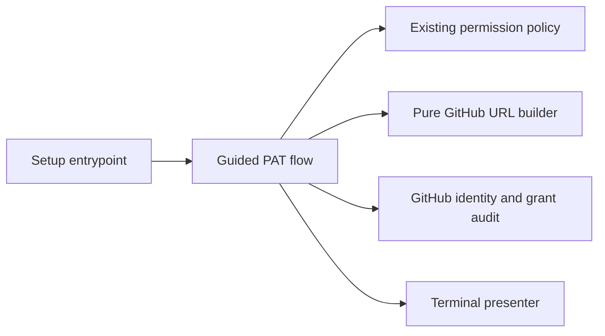

# Assisted Setup PAT Creation

- Status: Draft — the guided flow is feasible; pre-auth planning and cleanup UX need review
- Date: 2026-09-24
- Catalog capability ID: `temporary-setup-operator-authorization`
- Last verified: Not applicable; prospective change
- Owners: Copilot maintainers and setup operators
- Scope: guide creation, verification, use, and user-owned deletion of the operator PAT for one `copilot setup` run
- Related issues/PRs: none; no Action dogfooding for this design
- Required review gates: product UX, architecture, testing, documentation, security, GitHub form compatibility
- Open decisions blocking readiness: exact local-only preflight questions; whether the initial link is provisional for remote-dependent grants; handling a plan that needs additional grants

## 1. Executive summary

Interactive `copilot setup` will offer **Create with GitHub guidance** (the
recommended choice) or **I already have a PAT** immediately before requesting
the operator credential. Guidance prints an official, prefilled GitHub
fine-grained PAT URL for the selected repository owner and currently known
permissions. The user chooses the browser account, selects the individual
repository, reviews the form, generates the PAT, and pastes it into the existing
masked prompt. Copilot verifies access, runs setup, discards its local value,
and tells the user to delete the PAT in GitHub. A one-day expiry is a safety
backstop, **not** proof of deletion or revocation.

The companion [bot PAT SDD](./guided-bot-pat-onboarding.md) covers the second,
persistent token installed as Actions Secret `PAT` after the setup plan is
known. Both roles share one URL-building contract, but not a credential or
lifecycle.

```text
resolve repository -> local preflight -> choose guided/manual operator PAT
  -> GitHub form -> masked input -> verify -> plan and final grant audit
  -> guide/verify bot PAT -> install Secret -> apply setup -> cleanup reminder
```

Text equivalent: the terminal guides two separate PATs during one setup run;
GitHub owns authentication and issuance; Copilot verifies and uses each token
only for its role; the operator deletes the temporary PAT in GitHub.

## 2. Problem, current behavior, evidence, and feasibility

### 2.1 Problem

The first-time operator sees a large permission table but must navigate to the
correct GitHub form and transcribe every grant. The same browser may contain a
personal and a bot account. Merely disposing of the PAT in local memory does
not remove it from GitHub.

### 2.2 Observed repository behavior

1. `src/cli/commands/setup.ts` resolves the repository, prints the bootstrap
   setup-PAT table, and requests the setup PAT **before** the questionnaire.
2. `buildSetupPatPermissionRequirements()` has conditional rows because the
   final features and remote state are not yet known. The approved plan is
   re-audited with `buildConfiguredSetupPatPermissionRequirements()`.
3. `SetupCredentialPromptAdapter` uses a masked terminal input. The setup PAT
   is not installed as runtime Secret `PAT`.
4. `SetupCredentialsUseCase` gathers the distinct workflow PAT later, after
   the plan, and GitHub cannot reveal existing Secret values.

### 2.3 External primary evidence

| Question | Official source | Decision |
|---|---|---|
| Can the form be prepared? | [GitHub PAT URL parameters](https://docs.github.com/en/authentication/keeping-your-account-and-data-secure/managing-your-personal-access-tokens#pre-filling-fine-grained-personal-access-token-details-using-url-parameters) | Use documented `name`, `description`, `target_name`, `expires_in`, and permission levels. Validate names and levels. |
| Can the URL select one repository? | [GitHub PAT creation steps](https://docs.github.com/en/authentication/keeping-your-account-and-data-secure/managing-your-personal-access-tokens#creating-a-fine-grained-personal-access-token) | No documented individual-repository URL parameter; the user must select it in GitHub. |
| Who handles the account and 2FA? | [GitHub browser account switcher](https://docs.github.com/en/authentication/keeping-your-account-and-data-secure/switching-between-accounts) | GitHub owns the browser session and account choice; local Git/`gh` identity is not evidence. |
| Can this link create or delete the PAT? | [GitHub PAT management](https://docs.github.com/en/authentication/keeping-your-account-and-data-secure/managing-your-personal-access-tokens) | No. The user generates and deletes it in GitHub Settings. No documented owner PAT mint/revoke API was found. |

### 2.4 Viability decision

**Guided creation is feasible; automatic PAT issuance and destruction are not
claimed.** Do not replay private website requests, read cookies, capture 2FA,
or call the link an authorization grant. A future GitHub App design would use a
different credential and requires its own endpoint and revocation proof; it is
outside this SDD and is not displayed as an available terminal choice.

### 2.5 Retrospective classification

Not applicable: this is a proposed extension to the observed setup flow.

## 3. Actors, surfaces, and terminology

| Actor | Goal | Entry point | Visible surfaces |
|---|---|---|---|
| Setup operator | configure one repository | `copilot setup` | permission table, choice, URL, masked prompt, result |
| GitHub | authenticate and issue PAT | official form | account switcher, 2FA, repository selector, Generate |
| Bot owner | issue the separate runtime PAT | later setup step | [bot PAT journey](./guided-bot-pat-onboarding.md) |

**Operator PAT** means the human's one-run setup credential. **Guided** means
the CLI prepares a form URL; the user still creates the PAT. **Discarded** means
the CLI no longer retains the value. **Deleted/revoked** means GitHub has
invalidated it; this flow cannot infer that from local disposal. **Provisional
link** means later remote inspection may require a new grant.

## 4. Goals, non-goals, and fixed invariants

### 4.1 Goals

1. Interactive setup MUST offer guided creation or existing manual PAT input
   without introducing a second setup command.
2. The link MUST include only known, needed grants from the same permission
   policy as the terminal table; unknown remote-dependent grants MUST be
   disclosed as provisional, not silently added.
3. The actual operator PAT MUST pass existing identity, repository-access, and
   final-plan permission checks before dependent mutation. Guided setup MUST
   show its authenticated account and ask the operator to confirm that this is
   the account intended to configure the repository.
4. The final terminal result MUST distinguish local disposal from GitHub
   deletion and provide a concrete deletion action.

### 4.2 Non-goals

1. Automatic browser login, 2FA, PAT generation, or PAT deletion.
2. A local multi-account manager or storing browser credentials.
3. Replacing the bot PAT or changing Action runtime authentication; the
   companion SDD covers assisted creation of that separate PAT.
4. Automatically opening the browser, managing the clipboard, shortening URLs,
   or adding account-profile persistence in the first release.
5. Dogfooding this repository's issue/Action workflow for this design.

### 4.3 Fixed invariants

1. The URL host/path are fixed to
   `https://github.com/settings/personal-access-tokens/new`; it contains no
   PAT, cookie, 2FA code, callback secret, or arbitrary URL input.
2. `target_name` selects only resource owner. The CLI MUST tell the user to
   select the individual repository and check the active browser account.
3. The CLI MUST NOT say a PAT was created, deleted, or revoked by Copilot.
4. The operator PAT MUST NOT become Actions Secret `PAT`; the bot PAT MUST NOT
   become operator setup authority.
5. `--yes`, non-interactive mode, and dry-run MUST NOT trigger browser actions,
   generate a PAT, or silently accept new permissions.

## 5. Current versus proposed product journey

| Stage | Current | Proposed | User effect |
|---|---|---|---|
| Before setup PAT | bootstrap permission table | brief local preflight, table, guided/manual choice | purpose and account are clear |
| GitHub | user navigates form and transcribes grants | documented prefilled URL; user selects repo and generates | less repetitive form work |
| After paste | identity/access and grant audit | same audit; display actual account | wrong token found before setup |
| After plan | final grant audit | same audit; if link was provisional, explain correction | no silent overgrant |
| Completion | local PAT not stored | explicit GitHub deletion reminder and link | honest cleanup |

```mermaid
sequenceDiagram
    participant U as Operator
    participant C as Copilot CLI
    participant G as GitHub
    C->>U: Show permission summary and guided/manual choice
    C->>U: Print official PAT URL and repository instruction
    U->>G: Choose account, complete 2FA if required, select repo, Generate
    U->>C: Paste PAT into masked prompt
    C->>G: Verify account, repository, and grants
    C->>U: Show actual account and request confirmation
    C->>U: Confirm plan; explain any newly required grant
    C->>G: Apply approved setup
    C->>U: Report local disposal and user-owned GitHub deletion
```

Text equivalent: the user creates a PAT on GitHub, the CLI verifies and uses it
for setup, then explicitly asks the user to delete it on GitHub.

## 6. Functional behavior and state model

### 6.1 Normal path

1. Resolve repository. Collect only local configuration choices that affect
   permissions before asking for the setup PAT. This preflight MUST reuse the
   existing questionnaire policy, not fork a second configuration model.
2. Render the existing permission summary and `Create with GitHub guidance`
   (recommended) / `I already have a PAT`. If a supplied `--token` or
   `PERSONAL_ACCESS_TOKEN` exists, retain existing precedence and skip the
   interactive choice.
3. In guided mode, build the official URL from known selected grants. If a
   remote-dependent grant cannot be determined before authorization, label
   the link **provisional** and identify the possible later correction. A
   permission whose URL name/level is unknown blocks link generation and
   offers manual configuration with the existing table.
4. Print the full URL on its own terminal line, outside `renderBox`; give
   account/repository instructions. Do not auto-open the browser. Accept the
   PAT only through the existing masked prompt.
5. Inspect the supplied PAT. Show the actual GitHub account and grant report.
   In guided mode, ask the operator to confirm that account before mutation;
   reject a decline or invalid target access. After plan confirmation, run the final policy
   audit; if a previously unknown grant is required, block dependent mutation
   and explain how to correct or replace the PAT.
6. Continue to the separate bot PAT journey. On success, failure, or
   cancellation after PAT creation, remind the user to delete the setup PAT
   in GitHub. Never claim deletion was verified.

### 6.2 Alternatives

- Manual uses the existing masked prompt and permission audit without a link.
- Existing supplied-token and unattended paths remain unchanged; no new prompt
  or browser action occurs. A cleanup reminder MAY be shown, but the CLI
  cannot know who created or owns a supplied token.
- Dry-run shows a plan and can explain the future PAT requirement, but never
  creates a credential or opens GitHub.
- If the user cancels before pasting, no local PAT value exists; a PAT they may
  already have generated in GitHub remains their deletion responsibility.
- If GitHub organization approval is required, setup waits for verified target
  access; call it `pending approval` only with explicit provider evidence.

### 6.3 State machine

| State | Entered when | Visible meaning | Next | Owner |
|---|---|---|---|---|
| `choice` | no supplied PAT | guided/manual decision | `form-ready`, `manual-input`, `cancelled` | operator |
| `form-ready` | URL validated | GitHub action required | `pat-entered`, `cancelled` | operator |
| `pat-entered` | masked value received | verification in progress | `verified`, `blocked` | CLI |
| `verified` | current grants accepted and account confirmed | plan and final audit | `setup-running`, `blocked` | CLI/operator |
| `setup-running` | plan approved | apply setup | `complete`, `partial` | CLI |
| `complete` | setup finished | delete operator PAT in GitHub | terminal | operator |
| `partial` | some changes applied | inspect report, then delete PAT | retry/terminal | operator |

Re-entering the same PAT does not create another one. A changed plan invalidates
the old link. A crash cannot guarantee GitHub deletion; restart and recovery
instructions must not imply otherwise.

## 7. User-facing configuration

| Input | Type | Recommended default | Allowed values | Scope/persistence |
|---|---|---|---|---|
| PAT help choice | interactive enum | guided | `guided`, `manual` | one run; not saved |
| Generated expiry | integer days | `1` | documented 1–366; first release fixes link at 1 | URL only; GitHub policy may override |
| Repository | existing Git remote identity | current repo | verified owner/repo | one run |
| Supplied operator token | existing secret input | none | current CLI/env precedence | memory only |

No new account or PAT configuration is persisted. Wrong owner, invalid grant,
URL length outside a reviewed terminal bound, and contradictory preflight
choices block link generation. Existing `--token` and environment precedence
remain; `--yes` does not choose an identity or waive checks. Expiry, host,
secret-free URL, and role separation are not configurable in this first
release. The recommended example is interactive guided setup; the meaningful
alternative is manual PAT creation and masked input.

## 8. Clean Architecture design

### 8.1 Responsibilities and direction

| Boundary | Owns | Must not own/import |
|---|---|---|
| Pure policy | permission-plan-to-URL mapping, role, validation | browser, HTTP, terminal, token values |
| Application | guided choice, final audit, cleanup message state | process/browser APIs, GitHub DTOs |
| Ports | secret input, identity/grant inspection, presentation | private website sessions |
| Adapters | GitHub query mapping and terminal rendering | permission decisions |
| Composition | connect existing setup stages | duplicate policy tables |



Text equivalent: setup orchestrates a guided choice, derives the URL from the
existing policy, verifies the pasted PAT through existing GitHub ports, and
renders status in the terminal.

### 8.2 Contracts, state, and trust boundaries

- The URL builder receives `{role, owner, name, description, expiresIn,
  permissions}` and emits only documented query parameters. It rejects
  duplicate/conflicting grants and unsupported scope/level pairs. The bot SDD
  reuses this contract with different role and expiry.
- GitHub web authentication, 2FA, account switching, repository selection,
  PAT generation, and deletion stay entirely in GitHub.
- No durable local token or browser session state is introduced. The remote
  setup mutations remain governed by the existing approved plan.
- Token identity and permission responses are untrusted provider evidence;
  presentation escapes account names and never prints raw responses.

### 8.3 Executable constraints

Architecture tests forbid the pure builder from importing terminal, HTTP,
filesystem, or browser modules. Contract tests parse every emitted query key
and level against GitHub's documented set. Security tests reject token/cookie
material in URLs and logs and prove no setup mutation precedes final grant
acceptance.

## 9. Terminal UI and content contract

The current CLI is English; this example is illustrative and follows its
existing text-first styling. Preserve one primary action per state.

```text
Setup PAT · 1 of 2                         Repository: vypdev/copilot
Choose how to provide the setup PAT:
  1) Create with GitHub guidance (recommended)
  2) I already have a PAT
Select [1]:

Action required: Create the PAT in GitHub as the account that will configure
vypdev/copilot. The link fills known permissions, but does not select a repo.
In GitHub, select only vypdev/copilot, review the grants, then Generate.
PAT creation URL:
https://github.com/settings/personal-access-tokens/new?name=...&target_name=vypdev&expires_in=1&...
Setup PAT (hidden):
```

If remote-dependent permissions remain unknown, insert `Provisional link:
setup will check the final plan and may require you to adjust this PAT` before
the URL. The URL is printed as an unwrapped plain line outside a bordered box;
terminal auto-linking is optional, never required. Do not copy it to clipboard
or open a browser automatically.

| State | First visible text | Next action |
|---|---|---|
| Pending | `Waiting for a setup PAT. No setup changes have started.` | create/paste PAT |
| Action required | `Check the GitHub account and select only vypdev/copilot before Generate.` | complete GitHub form |
| Blocked | `Setup has not changed the repository: this PAT lacks Contents write required by the final plan. Update or replace it, then retry.` | correct PAT |
| Partial | `Some setup changes were applied. The operator PAT may still be active in GitHub. Inspect the setup report, then delete the PAT.` | inspect/delete |
| Complete | `Setup complete. The operator PAT was discarded locally, not deleted from GitHub. Delete it in GitHub Settings.` | delete PAT |

Errors follow impact, cause, action, retained state. Status uses words, not
color/emoji alone. Narrow terminals keep choices and instructions readable;
the URL stays copyable. English message catalog is the initial source; later
locales follow existing fallback policy. Escape untrusted repository/account
names. No issue, PR, comment, label, or check is created by this UI.

## 10. Failure, recovery, and cleanup

| Condition | Impact | Retained fact | Retry/action | Cleanup |
|---|---|---|---|---|
| Wrong browser account | PAT belongs to an unintended user | no mutation before guided account confirmation | decline, switch in GitHub, recreate if needed | user deletes wrong PAT |
| Wrong repo/owner | PAT lacks target access | no dependent mutation | select correct repo in GitHub | user deletes unused PAT |
| Final plan adds grant | setup cannot proceed safely | plan and audit result | update PAT or create a new one | user deletes obsolete PAT |
| Unknown form parameter | no safe guided URL | manual path remains | use table/manual form | no generated PAT |
| User cancels after GitHub generation | PAT may remain active | no local value | delete in GitHub | user-owned |
| Setup partially applies | repo may be changed | report of completed steps | inspect before retry | delete operator PAT only after no retry needs it |
| GitHub deletion not confirmed | PAT may remain valid until expiry | local disposal only | open PAT Settings and delete | do not claim revoked |

The cleanup URL points to GitHub PAT Settings, not to a destructive endpoint.
The CLI cannot identify or delete the exact PAT from the supplied value. A
one-day expiry still permits use until expiry and may be shortened by policy.

## 11. Security, permissions, and privacy

1. Least-privilege grants come from the same setup policy used by the final
   permission audit. The link never adds every conditional grant by default.
2. No password, cookie, browser profile, 2FA code, or PAT appears in a URL,
   config file, telemetry, logs, or GitHub issue. Masked input is retained.
3. Existing command-line PAT flags remain for compatibility; guided mode does
   not put token values in process arguments and docs should warn about those
   legacy flags exposing values in shell history/process inspection.
4. Private GitHub website requests are not a supported authentication
   contract; no browser scraping is added.

## 12. Observability and operational UX

Show role, target repository, actual authenticated login, access result,
whether the link was provisional, and setup/cleanup status. Do not record token
values or raw API payloads. A failed check includes one next action and known
retained state. Limit output to one choice, one guidance block, existing audit
report, and one final cleanup reminder; no polling or notifications.

## 13. Compatibility, migration, rollout, and rollback

The manual prompt, `--token`, `PERSONAL_ACCESS_TOKEN`, `--non-interactive`,
`--yes`, and dry-run continue to work with existing precedence. The first
release adds only interactive guidance and local preflight needed for its URL.
No repository schema, Secret, or account-store migration occurs. Rollback
hides guidance and returns to the current prompt; PATs already generated by
users remain their responsibility. User docs must not imply the guided path
exists until implemented.

## 14. Testing strategy and numeric budget

The minimum is **30 distinct cases**, derived from two UI choices, bootstrap
versus final grants, provider identity/scope, cancellation, and cleanup truth.

| Area | Cases | Risk covered |
|---|---:|---|
| Pure URL/configuration policy | 7 | key/level mapping, expiry, owner, encoding, rejected grants |
| State/application/idempotency | 6 | choice, preflight, final-plan change, retry, cancel |
| Provider/permission contracts | 4 | identity, repo access, missing grant, unknown response |
| Setup/compatibility | 4 | manual, supplied token, unattended, dry-run |
| Terminal/accessibility/localization | 5 | pending, action, blocked, partial, complete; narrow URL |
| Integration/security | 4 | no URL secret, no early mutation, cleanup truth, wrong account |
| **Total** | **30** | Distinct tests, no double counting |

Existing repository-wide gates remain. New pure URL policy targets 100%
branch coverage; changed setup code targets at least 95% lines/statements and
90% branches/functions. Use deterministic GitHub fakes, no real PATs in CI;
assert parsed query parameters and semantic UI text, not snapshots alone.
Human UX evidence includes a narrow terminal, browser account switcher, 2FA
handled by GitHub, repo selector, and guided/manual fallback. No live token
value enters test evidence.

## 15. Documentation and discoverability

| Audience | Artifact | Required content | Validation |
|---|---|---|---|
| New user | `README.md`, `docs/how-to-use.mdx` | two roles and guided/manual normal path | navigation/link check |
| Setup owner | `docs/authentication.mdx`, `docs/configuration.mdx` | URL limits, preflight, exact permissions, account/repo choice | policy fixture |
| Operator | `docs/security-operations/operations/troubleshooting.mdx` | wrong account, changed grants, cancellation, deletion | recovery fixture |
| Contributor | `docs/development/architecture.mdx`, this SDD | shared URL builder and trust boundary | architecture test |

Docs are updated with implementation, not ahead of it. Examples must match
CLI fixtures and clearly distinguish setup-PAT deletion from persistent bot
Secret renewal.

## 16. Acceptance scenarios

1. Given interactive setup without a supplied token, the CLI offers guided
   creation and manual input; guided is the default.
2. Given guided choice, the CLI prints a documented GitHub URL, repository
   instruction, and hidden PAT prompt; it does not open a browser.
3. Given local feature choices, URL permissions match known selected grants;
   unknown remote-dependent grants are labeled provisional, not overgranted.
4. Given an unintended browser account, the CLI displays the actual login and
   the operator declines it; given a wrong repo, access verification fails.
   Either way, setup blocks before dependent mutation.
5. Given a final plan requiring an additional grant, the CLI explains the
   correction and blocks mutation until the PAT passes re-audit.
6. Given manual, supplied-token, unattended, or dry-run paths, their existing
   behavior is preserved without surprise browser action.
7. Given cancellation after the user generated a PAT, the CLI warns that it
   may remain active and links to GitHub Settings.
8. Given partial setup, the CLI reports completed changes separately from
   token cleanup and does not claim rollback.
9. Given complete setup, the CLI says local value discarded, GitHub deletion
   still required; it never says revoked without evidence.
10. Given an unsupported URL permission, no misleading link is shown and the
    manual permission table remains available.
11. All primary states remain readable without color at narrow width and the
    full URL is copyable.

## 17. Requirements traceability

| Requirement | Owner | Test/evidence | Documentation |
|---|---|---|---|
| Guided/manual choice (§4.1) | setup CLI + presenter | scenarios 1–2, 6 | how-to-use |
| Exact/provisional grants (§4.1–4.3) | permission policy + URL builder | scenarios 3, 5, 10 | authentication/configuration |
| Actual token audit (§4.1) | existing permission use case | scenarios 4–5 | troubleshooting |
| Cleanup truth (§4.1–4.3) | setup result presenter | scenarios 7–9 | authentication/troubleshooting |
| Accessible UI (§9) | terminal renderer | scenario 11 | how-to-use |

## 18. Implementation sequence

1. Settle the pre-auth local questions and provisional-link rule using the
   current permission policy; record provider parameter mapping.
2. Build one pure URL policy shared with the bot SDD and its contract tests.
3. Integrate the guided/manual choice and raw URL output before the masked
   operator PAT prompt, preserving supplied-token paths.
4. Add final-audit correction and honest cleanup states, plus failure tests.
5. Update user/architecture/recovery docs, coverage, UX evidence, and catalog
   validation before enabling guidance.

## 19. Definition of Done

- [ ] Readiness-blocking preflight and provisional-link decisions are settled.
- [ ] Every MUST maps to acceptance and verification.
- [ ] Only documented GitHub URL parameters are emitted; URL contains no secret.
- [ ] Account/repo/permissions are checked through the supplied PAT.
- [ ] Manual, supplied-token, unattended, dry-run, and `--yes` behavior remain safe.
- [ ] Cancellation, partial setup, and deletion wording are accurate.
- [ ] Architecture, 30-case floor, coverage, security, and narrow-terminal UX pass.
- [ ] User, setup, operator, contributor docs and navigation are updated.
- [ ] Catalog evidence and generated `specs/CATALOG.md` are current;
      `pnpm run validate:specifications` passes.

## 20. References and decisions

- Related: [guided bot PAT onboarding](./guided-bot-pat-onboarding.md),
  [setup baseline](./setup-configuration-credentials-and-doctor.md), and
  [PAT permission guidance](./setup-pat-permission-guidance-and-verification.md).
- Primary sources: [GitHub PAT form and URL parameters](https://docs.github.com/en/authentication/keeping-your-account-and-data-secure/managing-your-personal-access-tokens),
  [GitHub browser account switcher](https://docs.github.com/en/authentication/keeping-your-account-and-data-secure/switching-between-accounts).
- Decision: ship guided PAT creation for both roles; do not present automatic
  PAT issuance, website request replay, or a local account manager as part of
  this product. A future App token is a separate credential and proposal.
