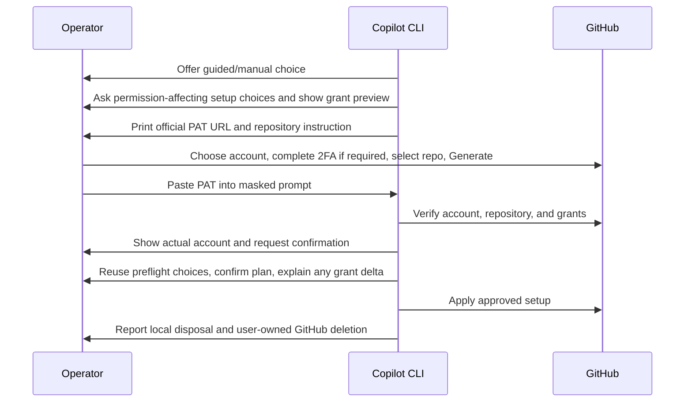
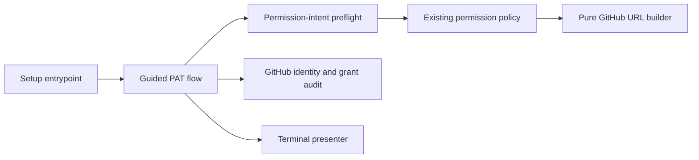

# Assisted Setup PAT Creation

- Status: Draft — permission-intent preflight implemented locally; controlled GitHub UX and full test budget remain unverified
- Date: 2026-09-25
- Catalog capability ID: `temporary-setup-operator-authorization`
- Last verified: Not applicable; prospective change
- Owners: Copilot maintainers and setup operators
- Scope: collect setup permission intent before the operator PAT link, then guide creation, verification, use, and user-owned deletion for one `copilot setup` run
- Related issues/PRs: [PR #402](https://github.com/vypdev/copilot/pull/402); no Action dogfooding for this design
- Required review gates: product UX, architecture, testing, documentation, security, GitHub form compatibility
- Open decisions blocking readiness: controlled browser UX and full test-budget evidence; remote-only facts cannot be known before authenticated inspection, so the link discloses residual uncertainty

## 1. Executive summary

Interactive `copilot setup` will offer **Create with GitHub guidance** (the
recommended choice) or **I already have a PAT** before requesting the operator
credential. Guided mode first asks only the setup choices that determine PAT
permissions, reusing answers from the existing questionnaire and local
configuration. It shows a reviewable permission preview, then prints an
official GitHub fine-grained PAT URL with every *locally determined* required
grant preselected; it does not add all conditional grants for convenience.
The user chooses the browser account, selects the individual repository,
reviews the form, generates the PAT, and pastes it into the existing masked
prompt. Copilot verifies access, completes the plan and final audit, runs
setup, discards its local value, and tells the user to delete the PAT in
GitHub. A one-day expiry is a safety backstop, **not** proof of deletion or
revocation.

Authenticated repository/organization inventory and credential-health
workflow status are unavailable before the first PAT. The preview MUST name
those unresolved grants, and a later verified need MUST block dependent
mutation and produce a corrected link. This is a bounded exception to the
one-link goal, not permission to request every possible grant up front.

The companion [bot PAT SDD](./guided-bot-pat-onboarding.md) covers the second,
persistent token installed as Actions Secret `PAT` after the setup plan is
known. Both roles share one URL-building contract, but not a credential or
lifecycle.

```text
resolve repository -> choose guided/manual -> collect permission-affecting intent
  -> review exact known grants and remote unknowns -> prefilled GitHub form
  -> masked PAT input -> verify -> complete plan and final grant audit
  -> correct link if remote facts add grants -> guide/verify bot PAT
  -> install Secret -> apply setup -> cleanup reminder
```

Text equivalent: the terminal guides two separate PATs during one setup run;
GitHub owns authentication and issuance; Copilot verifies and uses each token
only for its role; the operator deletes the temporary PAT in GitHub.

## 2. Problem, current behavior, evidence, and feasibility

### 2.1 Problem

The first-time operator sees a large permission table but the current guided
URL contains only `metadata=read` and `contents=read`: it is built before the
questionnaire and filters out every conditional row. The operator must still
enter the other needed permissions manually or replace the PAT after the
final audit. The same browser may contain a personal and a bot account.
Merely disposing of the PAT in local memory does not remove it from GitHub.

### 2.2 Observed repository behavior

1. `src/cli/commands/setup.ts` resolves the repository, prints the bootstrap
   setup-PAT table, and requests the setup PAT **before** the questionnaire.
2. `buildSetupPatPermissionRequirements()` has conditional rows because the
   final features and remote state are not yet known. The approved plan is
   re-audited with `buildConfiguredSetupPatPermissionRequirements()`.
3. `SetupCredentialPromptAdapter` uses a masked terminal input. The setup PAT
   is not installed as runtime Secret `PAT`.
4. `SetupCredentialsUseCase` gathers the distinct workflow PAT later, after
   the plan, and GitHub cannot reveal existing Secret values.
5. `buildSetupPatCreationUrl()` serializes only `required` rows. The initial
   setup call supplies the bootstrap table, where only Metadata and Contents
   are required; the other ten rows are conditional. `loadSetupOverrides()`
   and the interactive questionnaire currently run after setup-PAT entry.

### 2.3 External primary evidence

| Question | Official source | Decision |
|---|---|---|
| Can the form be prepared? | [GitHub PAT URL parameters](https://docs.github.com/en/authentication/keeping-your-account-and-data-secure/managing-your-personal-access-tokens#pre-filling-fine-grained-personal-access-token-details-using-url-parameters) | Use documented `name`, `description`, `target_name`, `expires_in`, and permission levels. Validate names and levels. |
| Can the URL select one repository? | [GitHub PAT creation steps](https://docs.github.com/en/authentication/keeping-your-account-and-data-secure/managing-your-personal-access-tokens#creating-a-fine-grained-personal-access-token) | No documented individual-repository URL parameter; the user must select it in GitHub. |
| Who handles the account and 2FA? | [GitHub browser account switcher](https://docs.github.com/en/authentication/keeping-your-account-and-data-secure/switching-between-accounts) | GitHub owns the browser session and account choice; local Git/`gh` identity is not evidence. |
| Can this link create or delete the PAT? | [GitHub PAT management](https://docs.github.com/en/authentication/keeping-your-account-and-data-secure/managing-your-personal-access-tokens) | No. The user generates and deletes it in GitHub Settings. No documented owner PAT mint/revoke API was found. |

Controlled browser prefill check on 2026-09-25: a test URL with all twelve
documented setup-table grants displayed eight repository and four organization
permissions at the requested levels for `vypdev`. GitHub initially selected
**All repositories**; changing to **Only select repositories** and selecting
`vypdev/copilot` retained all twelve grants. No PAT was generated. This proves
form prefill and repository-selector behavior for that account/session, not
token issuance, permission sufficiency, or universal organization policy.

### 2.4 Viability decision

**Guided creation and preselected permissions are feasible; exact one-pass
least privilege cannot be guaranteed from unauthenticated local intent alone.**
Do not replay private website requests, read cookies, capture 2FA, or call the
link an authorization grant. A future GitHub App design would use a different
credential and requires its own endpoint and revocation proof; it is outside
this SDD and is not displayed as an available terminal choice.

### 2.5 Retrospective classification

Not applicable: this is a proposed extension to the observed setup flow.

## 3. Actors, surfaces, and terminology

| Actor | Goal | Entry point | Visible surfaces |
|---|---|---|---|
| Setup operator | configure one repository | `copilot setup` | permission table, choice, URL, masked prompt, result |
| GitHub | authenticate and issue PAT | official form | account switcher, 2FA, repository selector, Generate |
| Bot owner | issue the separate runtime PAT | later setup step | [bot PAT journey](./guided-bot-pat-onboarding.md) |

**Operator PAT** means the human's one-run setup credential. **Guided** means
the CLI prepares a form URL; the user still creates the PAT. **Discarded** means
the CLI no longer retains the value. **Deleted/revoked** means GitHub has
invalidated it; this flow cannot infer that from local disposal.
**Permission-intent preflight** means the short, pre-PAT portion of the setup
questionnaire that determines locally knowable grants. **Provisional link**
means authenticated remote facts may require a corrected grant after entry.

## 4. Goals, non-goals, and fixed invariants

### 4.1 Goals

1. Interactive setup MUST offer guided creation or existing manual PAT input
   without introducing a second setup command.
2. Guided mode MUST collect, review, and reuse all locally knowable
   permission-affecting choices **before** generating the setup PAT URL. The
   URL MUST include the resulting required grants from the same policy as
   the terminal table and final audit. No selected choice may be silently
   reverted or asked a second time in the main questionnaire.
3. Unknown remote-dependent grants MUST be listed beside the preview and
   omitted by default, not silently overgranted. A changed plan or verified
   remote need MUST invalidate the old link and block dependent mutation until
   the supplied PAT passes the recalculated audit.
4. The actual operator PAT MUST pass existing identity, repository-access, and
   final-plan permission checks before dependent mutation. Guided setup MUST
   show its authenticated account and ask the operator to confirm that this is
   the account intended to configure the repository.
5. The final terminal result MUST distinguish local disposal from GitHub
   deletion and provide a concrete deletion action.

### 4.2 Non-goals

1. Automatic browser login, 2FA, PAT generation, or PAT deletion.
2. A local multi-account manager or storing browser credentials.
3. Replacing the bot PAT or changing Action runtime authentication; the
   companion SDD covers assisted creation of that separate PAT.
4. Automatically opening the browser, managing the clipboard, shortening URLs,
   or adding account-profile persistence in the first release.
5. Dogfooding this repository's issue/Action workflow for this design.

### 4.3 Fixed invariants

1. The URL host/path are fixed to
   `https://github.com/settings/personal-access-tokens/new`; it contains no
   PAT, cookie, 2FA code, callback secret, or arbitrary URL input.
2. `target_name` selects only resource owner. The CLI MUST tell the user to
   select the individual repository and check the active browser account.
3. The CLI MUST NOT say a PAT was created, deleted, or revoked by Copilot.
4. The operator PAT MUST NOT become Actions Secret `PAT`; the bot PAT MUST NOT
   become operator setup authority.
5. `--yes`, non-interactive mode, and dry-run MUST NOT trigger browser actions,
   generate a PAT, or silently accept new permissions.
6. Preflight answers are operator intent, not GitHub facts or authorization.
   Unknown owner type, remote inventory, approval, and workflow status MUST
   never be fabricated from defaults or treated as proven by a user answer.

## 5. Current versus proposed product journey

| Stage | Current | Proposed | User effect |
|---|---|---|---|
| Before setup PAT | bootstrap permission table and two-grant provisional link | guided/manual choice, short permission-intent preflight, reviewed grants and unresolved remote needs | needed local grants are preselected |
| GitHub | user navigates form and transcribes grants | documented prefilled URL; user selects repo and generates | less repetitive form work |
| After paste | identity/access and grant audit | same audit; display actual account | wrong token found before setup |
| After plan | final grant audit | same audit; show exact delta and corrected URL only if a choice changed or remote evidence adds a grant | no silent overgrant or mutation |
| Completion | local PAT not stored | explicit GitHub deletion reminder and link | honest cleanup |



Text equivalent: the CLI first collects and reviews permission-driving local
choices, the user creates the prepared PAT on GitHub, the CLI verifies remote
facts and any grant change before using it for setup, then explicitly asks the
user to delete it on GitHub.

## 6. Functional behavior and state model

### 6.1 Normal path

1. Resolve repository and the existing local setup inputs (`--config`, CLI
   flags, and defaults) without network mutation. If `--token` or
   `PERSONAL_ACCESS_TOKEN` is supplied, retain existing precedence and skip
   guided preflight. Otherwise offer `Create with GitHub guidance`
   (recommended) or `I already have a PAT`.
2. Guided mode asks only the permission-driving setup choices not already
   fixed by local inputs, using the same questionnaire definitions and
   validation, in their normal order. It creates a one-run intent draft that
   the later full questionnaire MUST consume without repeating those answers.
   The question set is the dependency closure of the existing permission
   policy: agent/model or other choices join preflight only when they change
   whether a managed resource or scope exists, not merely its value or name.
   The operator can explicitly revise the draft before PAT creation; after
   creation, a revision requires a new permission comparison before mutation.
3. Render the intended choices, an exact required-grant preview, and a
   separate **May need after GitHub inspection** list. Require explicit review
   of this preview; `--yes` does not waive it. Compute grants using the same
   permission policy as the final audit, projected over locally known facts.
   Include Metadata read and Contents read even when no optional capability
   is selected. Never turn every conditional row into a required row.
4. Build the official URL from that reviewed required-grant set. Each
   permission MUST use its documented query name and level; a missing mapping
   blocks guided link generation and leaves manual setup available. If a
   remote-only grant is unresolved, label the link **provisional** and name
   the exact potential grant and trigger beside it. Print the complete URL
   outside `renderBox` with account/repository instructions; do not open the
   browser automatically. Accept the PAT only through the masked prompt.
5. Inspect the supplied PAT, show the actual GitHub account and grant report,
   and confirm the intended account. Authenticated remote inspection then
   verifies owner type, managed-resource inventory, and health-workflow state.
   Complete the remaining setup questions without re-asking preflight choices.
   Recompute the final grants from the actual configuration and remote facts
   before any dependent mutation. A missing grant or changed intent invalidates
   the previous link; show the permission delta and a corrected URL, require
   an audited replacement/corrected PAT, and remind the user to delete any
   obsolete PAT. A plan that merely removes grants MUST NOT claim the existing
   token was least-privileged; explain that the user may replace it before
   continuing.
6. Continue to the separate bot PAT journey only after final setup-PAT access
   is accepted. On success, failure, or cancellation after PAT creation,
   remind the user to delete the setup PAT in GitHub. Never claim deletion
   was verified.

The preflight question-to-grant contract is based on the current final setup
permission policy. It MUST be derived from configuration fields, not a second
hard-coded permission table in the terminal adapter:

| Pre-PAT intent question or local input | Grant projected into the URL when selected | Still unknown until GitHub inspection |
|---|---|---|
| Repository owner kind (`organization` or `personal`), asked only if an organization grant is a candidate | Enables valid organization grants for an asserted organization owner; never by itself adds a grant | Actual owner kind and organization PAT policy |
| Create initial tag? | Repository Contents write instead of read | Whether tag creation is ultimately needed |
| Manage Actions Secrets and their requested default scope, preservation, and known explicit overrides? | Repository Secrets write for selected managed names/inventory; organization Secrets write when an organization target or inventory is definitely selected | Existing effective scopes, inherited names, and conditional organization inventory |
| Manage Actions Variables and their requested default scope, preservation, and known explicit overrides? | Repository Variables write for selected managed names/inventory; organization Variables write when an organization target or inventory is definitely selected | Existing effective scopes, inherited names, and conditional organization inventory |
| Enable issue workflow types? | Repository Issues write; organization Issue Types write if owner is an organization | Verified owner kind |
| Enable release/hotfix or guarded PR approval? | Repository Administration read | Final branch-rule readiness |
| Configure organization Project IDs? | Organization Projects write when owner is an organization and IDs are selected | Project access and ownership |
| Remote condition shown, not asked: existing managed Secrets need credential-health validation; workflow is confirmed missing on the selected branch | No grant from an unverified assertion; explain potential Actions write and, only for confirmed missing workflow, Contents write plus Workflows write | Authenticated inventory and independent selected-ref workflow proof |

The last row is **not** a second questionnaire about facts the operator may
not know. It is a preview of remote-only conditions; the CLI MUST NOT ask the
operator to attest to workflow presence or Secret inventory as if that proved
it. Individual resource overrides that depend on inherited remote names stay
in the post-auth questionnaire and may require a corrected link. If the
operator cannot identify whether the owner is an organization when an
organization grant is a candidate, the CLI explains how to check it and
offers the manual path rather than guessing a URL. An explicit organization
storage/project choice with a declared personal owner is rejected before URL
generation. The target owner and selected repository are verified after the
PAT is entered.

### 6.2 Alternatives

- Manual uses the existing masked prompt and permission audit without a link.
- A guided user may cancel or revise the preflight before GitHub. No remote
  resource changes occur and no PAT exists unless the user generated one.
- Existing supplied-token and unattended paths remain unchanged; no new prompt
  or browser action occurs. A cleanup reminder MAY be shown, but the CLI
  cannot know who created or owns a supplied token.
- Dry-run shows a plan and can explain the future PAT requirement, but never
  creates a credential or opens GitHub.
- If the user cancels before pasting, no local PAT value exists; a PAT they may
  already have generated in GitHub remains their deletion responsibility.
- If GitHub organization approval is required, setup waits for verified target
  access; call it `pending approval` only with explicit provider evidence.
- If the preflight predicts a need that the final plan does not have, the CLI
  displays the excess grant and offers replacement guidance; it never silently
  describes the earlier URL as the exact final least-privilege plan.

### 6.3 State machine

| State | Entered when | Visible meaning | Next | Owner |
|---|---|---|---|---|
| `choice` | no supplied PAT | guided/manual decision | `intent-collecting`, `manual-input`, `cancelled` | operator |
| `intent-collecting` | guided selected | only grant-driving setup choices are being asked | `intent-review`, `cancelled` | operator |
| `intent-review` | local choices projected | review exact grants and remote unknowns | `form-ready`, `intent-collecting`, `cancelled` | operator |
| `form-ready` | reviewed URL validated | GitHub action required | `pat-entered`, `cancelled` | operator |
| `pat-entered` | masked value received | verification in progress | `verified`, `blocked` | CLI |
| `verified` | current grants accepted and account confirmed | reuse intent, finish plan and final audit | `setup-running`, `grant-correction`, `blocked` | CLI/operator |
| `grant-correction` | final evidence/choice changed grants | no dependent mutation; correct or replace PAT | `pat-entered`, `cancelled` | operator |
| `setup-running` | plan approved | apply setup | `complete`, `partial` | CLI |
| `complete` | setup finished | delete operator PAT in GitHub | terminal | operator |
| `partial` | some changes applied | inspect report, then delete PAT | retry/terminal | operator |

Re-entering the same PAT does not create another one. Re-running preflight with
the same inputs yields the same grant set and URL; stale or out-of-order
answers cannot modify a reviewed draft. A changed plan invalidates the old
link. A crash cannot guarantee GitHub deletion; restart and recovery
instructions must not imply otherwise.

## 7. User-facing configuration

| Input | Type | Recommended default | Allowed values | Scope/persistence |
|---|---|---|---|---|
| PAT help choice | interactive enum | guided | `guided`, `manual` | one run; not saved |
| Permission-intent answers | existing bounded setup fields | existing CLI/config/default values; ask only unset or revisable fields | existing feature, workflow, tag, storage, and Project validators | one run; frozen for later questionnaire, not saved |
| Owner-kind assertion | interactive enum when an organization grant is possible | no assumed value; ask operator | `organization`, `personal` (or choose manual if unknown) | one run; verified after PAT, not saved |
| Generated expiry | integer days | `1` | documented 1–366; first release fixes link at 1 | URL only; GitHub policy may override |
| Repository | existing Git remote identity | current repo | verified owner/repo | one run |
| Supplied operator token | existing secret input | none | current CLI/env precedence | memory only |

Precedence remains existing CLI flags over `--config` over setup defaults;
interactive intent changes override only the corresponding defaulted draft
field for this run. `--skip-secrets` and `--skip-variables` override both
the draft and URL projection. A reviewed choice is snapshotted into the main
questionnaire rather than reread from a changed file. Invalid cross-field
combinations (personal owner with organization storage or organization
Projects, disabled issues with enabled issue workflow types, unsupported URL
permission/level) block link generation with a specific recovery action.
No new account or PAT configuration is persisted. Wrong owner, invalid grant,
URL length outside a reviewed terminal bound, and contradictory permission
grants block link generation. Existing `--token` and environment precedence
remain; `--yes` does not choose an identity or waive checks. Expiry, host,
secret-free URL, role separation, and omission of unverified remote-only grants
are not configurable in this release. The recommended example is interactive
guided setup; the meaningful alternative is manual PAT creation and masked
input. Existing configuration files need no migration; a supplied PAT follows
the current path without a hidden preflight.

## 8. Clean Architecture design

### 8.1 Responsibilities and direction

| Boundary | Owns | Must not own/import |
|---|---|---|
| Pure policy | project local intent to required/remote-unknown grants; permission-plan-to-URL mapping, role, validation | browser, HTTP, terminal, token values |
| Application | guided choice, intent snapshot/reuse, grant-delta comparison, final audit, cleanup message state | process/browser APIs, GitHub DTOs |
| Ports | secret input, identity/grant inspection, presentation | private website sessions |
| Adapters | GitHub query mapping and terminal rendering | permission decisions |
| Composition | connect existing setup stages | duplicate policy tables |



Text equivalent: setup collects only permission-affecting local intent before
deriving a link from the existing policy, then verifies the pasted PAT and
remote facts, reuses the intent in the full wizard, and renders any grant delta.

### 8.2 Contracts, state, and trust boundaries

- The URL builder receives `{role, owner, name, description, expiresIn,
  permissions}` and emits only documented query parameters. It rejects
  duplicate/conflicting grants and unsupported scope/level pairs. The bot SDD
  reuses this contract with different role and expiry.
- A preflight projection accepts normalized local setup overrides and bounded
  questionnaire answers, returns `{draft, requiredGrants, unresolvedTriggers}`,
  and has no provider token or GitHub DTO. The same draft is consumed by the
  full wizard; no second hard-coded permission matrix or duplicate prompts.
- The final audit compares normalized grants by role, scope, permission, and
  strongest level. A grant added or upgraded is a blocking delta until a new
  audited PAT is supplied; a removed grant is disclosed as possible excess.
- GitHub web authentication, 2FA, account switching, repository selection,
  PAT generation, and deletion stay entirely in GitHub.
- No durable local token or browser session state is introduced. The remote
  setup mutations remain governed by the existing approved plan.
- Token identity and permission responses are untrusted provider evidence;
  presentation escapes account names and never prints raw responses.

### 8.3 Executable constraints

Architecture tests forbid the pure projection and URL builder from importing
terminal, HTTP, filesystem, or browser modules. Contract tests parse every
emitted query key and level against GitHub's documented set. Setup contract
tests prove preflight fields are the same normalized fields consumed by the
wizard, with no duplicated question or privilege table. Security tests reject
token/cookie material in URLs and logs and prove no setup mutation precedes
final grant acceptance.

## 9. Terminal UI and content contract

The current CLI is English; this example is illustrative and follows its
existing text-first styling. Preserve one primary action per state.

```text
Setup PAT · 1 of 2                         Repository: vypdev/copilot
Choose how to provide the setup PAT:
  1) Create with GitHub guidance (recommended)
  2) I already have a PAT
Select [1]:

Before creating the PAT, choose what setup will configure. Existing --config
and CLI selections are shown as defaults and will be reused later.
Enable issue workflows? [Yes]: Yes
Create/update Actions Secrets? [Yes]: Yes
Secrets storage? [Repository]: Repository
Create/update Actions Variables? [Yes]: Yes
Variables storage? [Repository]: Repository
Enable guarded approval or release/hotfix? [No from --config]: No
Create an initial tag? [Yes]: No
Organization-owned repository? [No answer yet]: Yes
Configure organization Projects? [No]: No

Review before opening GitHub:
  Required now: Metadata read, Contents read, repository Secrets write,
    repository Variables write, Issues write, organization Issue Types write.
  May be needed after GitHub inspection: Actions write for existing managed
    Secrets; Contents write + Workflows write only if the health workflow is
    independently confirmed missing; organization Secret/Variable access
    if preservation resolves to that scope.
Confirm these choices and permission preview? [No]: Yes

Action required: Open GitHub as the account configuring vypdev/copilot.
GitHub initially selects All repositories: change to Only select repositories
and select vypdev/copilot. Review the prefilled grants, then Generate.
PAT creation URL:
https://github.com/settings/personal-access-tokens/new?name=...&target_name=vypdev&expires_in=1&...
Setup PAT (hidden):
```

This example is illustrative: only fields that actually affect the selected
grant set are asked, and their defaults reflect existing setup inputs. The
remote-only list makes the link **provisional**, not broken. The URL is printed
as an unwrapped plain line outside a bordered box; terminal auto-linking is
optional, never required. Do not copy it to clipboard or open a browser
automatically.

| State | First visible text | Next action |
|---|---|---|
| Pending | `Collecting setup choices that determine the PAT permissions. No GitHub changes have started.` | answer/review intent |
| Action required | `GitHub prefilled six grants. Change All repositories to Only select repositories → vypdev/copilot before Generate.` | complete GitHub form |
| Blocked | `Setup has not changed the repository: authenticated inspection found an existing managed Secret, so Actions write is required. Create a replacement PAT with the corrected link and retry; delete the obsolete PAT in GitHub.` | correct PAT |
| Partial | `Some setup changes were applied. The operator PAT may still be active in GitHub. Inspect the setup report, then delete the PAT.` | inspect/delete |
| Complete | `Setup complete. The operator PAT was discarded locally, not deleted from GitHub. Delete it in GitHub Settings.` | delete PAT |

If a later choice removes a grant, say `The PAT may have more access than this
plan needs; review or replace it before continuing` rather than claiming exact
least privilege. If preflight is cancelled, say no repository changes started
and remind the user that any PAT already generated in GitHub remains theirs
to delete. If GitHub rejects an owner/permission combination, return to intent
review or the manual path; never suggest a hidden URL parameter as a fix.

Errors follow impact, cause, action, retained state. Status uses words, not
color/emoji alone. Narrow terminals keep choices and instructions readable;
the URL stays copyable. English message catalog is the initial source; later
locales follow existing fallback policy. Escape untrusted repository/account
names. No issue, PR, comment, label, or check is created by this UI.

## 10. Failure, recovery, and cleanup

| Condition | Impact | Retained fact | Retry/action | Cleanup |
|---|---|---|---|---|
| Wrong browser account | PAT belongs to an unintended user | no mutation before guided account confirmation | decline, switch in GitHub, recreate if needed | user deletes wrong PAT |
| Preflight cancelled or invalid | no link or remote mutation | local inputs only | revise choices or use manual path | delete any already generated PAT in GitHub |
| Owner assertion differs from verified owner | organization grants may be invalid or omitted | authenticated owner type; no dependent mutation | revise intent and create corrected PAT | delete obsolete PAT |
| Wrong repo/owner | PAT lacks target access | no dependent mutation | select correct repo in GitHub | user deletes unused PAT |
| Remote inspection or changed plan adds grant | setup cannot proceed safely | intent draft, actual remote facts, grant delta | create a replacement PAT with corrected URL and re-audit | user deletes obsolete PAT |
| Final plan removes grant | token may exceed least privilege | final grant comparison | replace PAT or explicitly continue under existing audit policy | user owns excess-token cleanup |
| Unknown form parameter | no safe guided URL | manual path remains | use table/manual form | no generated PAT |
| User cancels after GitHub generation | PAT may remain active | no local value | delete in GitHub | user-owned |
| Setup partially applies | repo may be changed | report of completed steps | inspect before retry | delete operator PAT only after no retry needs it |
| GitHub deletion not confirmed | PAT may remain valid until expiry | local disposal only | open PAT Settings and delete | do not claim revoked |

The cleanup URL points to GitHub PAT Settings, not to a destructive endpoint.
The CLI cannot identify or delete the exact PAT from the supplied value. A
one-day expiry still permits use until expiry and may be shortened by policy.

## 11. Security, permissions, and privacy

1. Least-privilege grants come from the same setup policy used by the final
   permission audit. The link never adds every conditional grant by default.
   The CLI must identify GitHub's initial **All repositories** selection as a
   separate, manual scope decision; `target_name` is not repository scoping.
2. No password, cookie, browser profile, 2FA code, or PAT appears in a URL,
   config file, telemetry, logs, or GitHub issue. Masked input is retained.
3. Existing command-line PAT flags remain for compatibility; guided mode does
   not put token values in process arguments and docs should warn about those
   legacy flags exposing values in shell history/process inspection.
4. Private GitHub website requests are not a supported authentication
   contract; no browser scraping is added.
5. Preflight is local-only and uses the same bounded validators as setup.
   Operator-declared owner kind cannot authorize organization operations;
   authenticated inspection and the final audit remain mandatory.

## 12. Observability and operational UX

Show role, target repository, reviewed intent, exact prefilled grants, remote
unknowns, actual authenticated login, any grant delta, access result, and
setup/cleanup status. Do not record token values or raw API payloads. A failed
check includes one next action and known retained state. Limit output to one
choice, one intent review, one guidance block, existing audit report, and one
final cleanup reminder; no polling, comments, or notifications.

## 13. Compatibility, migration, rollout, and rollback

The manual prompt, `--token`, `PERSONAL_ACCESS_TOKEN`, `--non-interactive`,
`--yes`, and dry-run continue to work with existing precedence. The current
guided implementation prints a provisional bootstrap-only URL; the proposed
revision adds an interactive local preflight and grants selected by intent.
No repository schema, Secret, or account-store migration occurs. Rollback
hides the new preflight and returns to the existing guided/manual prompt;
PATs already generated by users remain their responsibility. Documentation
must distinguish shipped bootstrap-only behavior from this proposed behavior
until implementation is released.

## 14. Testing strategy and numeric budget

The minimum is **48 distinct cases**, derived from permission-intent branching,
local/remote evidence separation, exact URL grants, changed-plan correction,
identity/scope, cancellation, and cleanup truth.

| Area | Cases | Risk covered |
|---|---:|---|
| Pure intent/URL/configuration policy | 12 | every local grant trigger and scope/level, dedupe, invalid owner/permission, encoding |
| State/application/idempotency | 10 | preflight review/revision, draft reuse, stale answers, added/removed grant, retry/cancel |
| Provider/permission contracts | 5 | owner/identity, repository access, remote inventory and health evidence, unknown response |
| Setup/compatibility | 6 | manual, supplied token, unattended, dry-run, CLI/config/default precedence, skip flags |
| Terminal/accessibility/localization | 7 | pending, review, action, blocked, partial, complete, narrow full URL and scope warning |
| Integration/security | 8 | no URL secret, no early mutation, no automatic all-conditionals, wrong account, remote unknown, cleanup truth |
| **Total** | **48** | Distinct tests, no double counting |

Existing repository-wide gates remain. New pure preflight/projection and URL
policies target 100% branch coverage; changed setup code targets at least 95%
lines/statements and 90% branches/functions. Use deterministic GitHub fakes,
fixed clock and no real PATs in CI. Contract tests compare the URL's parsed
permission set with the reviewed preview and final policy fixtures; semantic
UI assertions accompany, rather than rely only on, snapshots. Required
coverage includes the exact six-grant example above, the twelve-grant
GitHub-form compatibility case, no optional grants selected, organization
versus personal owner, preflight choice reuse, remote-only grant correction,
and a plan that removes access. Human UX evidence includes a narrow terminal,
browser account switcher, 2FA handled by GitHub, explicit All-to-selected
repository change, and guided/manual fallback. The 2026-09-25 browser test
is prefill evidence only; final acceptance does not require dogfooding or a
live token value in test evidence.

## 15. Documentation and discoverability

| Audience | Artifact | Required content | Validation |
|---|---|---|---|
| New user | `README.md`, `docs/how-to-use.mdx` | two roles, pre-PAT choices, guided/manual normal path | navigation/link check |
| Setup owner | `docs/authentication.mdx`, `docs/configuration.mdx` | question-to-permission mapping, URL limits, remote unknowns, exact grants, All-to-selected repository step | policy fixture |
| Operator | `docs/security-operations/operations/troubleshooting.mdx` | wrong account, changed/removed grants, correction, cancellation, deletion | recovery fixture |
| Contributor | `docs/development/architecture.mdx`, this SDD | local intent snapshot, shared policy/URL builder, trust boundary | architecture test |

Docs are updated with implementation, not ahead of it. Examples must match
CLI fixtures and clearly distinguish setup-PAT deletion from persistent bot
Secret renewal.

## 16. Acceptance scenarios

1. Given interactive setup without a supplied token, the CLI offers guided
   creation and manual input; guided is the default.
2. Given guided choice, the CLI prints a documented GitHub URL, repository
   instruction, and hidden PAT prompt; it does not open a browser.
3. Given guided mode and local defaults/flags/config, the CLI asks only
   permission-affecting choices that are not fixed by those inputs, shows an
   exact grant preview before the URL, and reuses answers in the full wizard.
4. Given selected Secret/Variable provisioning, issue workflows, initial tag,
   release/hotfix/guarded approval, and organization Projects, the URL
   contains exactly the corresponding strongest-level grants; disabling
   those capabilities omits their grants.
5. Given remote-only Secret inventory or health-workflow uncertainty, the
   preview labels the corresponding possible grants provisional and does not
   add them merely because they are conditional in the bootstrap table.
6. Given an unintended browser account, the CLI displays the actual login and
   the operator declines it; given a wrong repo, access verification fails.
   Either way, setup blocks before dependent mutation.
7. Given a final plan requiring an additional or upgraded grant, the CLI
   explains the exact delta, provides a corrected link, and blocks mutation
   until a replacement/corrected PAT passes re-audit. A removed grant is
   disclosed as possible excess access.
8. Given manual, supplied-token, unattended, or dry-run paths, their existing
   behavior is preserved without surprise browser action.
9. Given cancellation during preflight or after GitHub generated a PAT, the
   CLI reports no mutation and, when relevant, warns that the PAT may remain
   active and links to GitHub Settings.
10. Given partial setup, the CLI reports completed changes separately from
   token cleanup and does not claim rollback.
11. Given complete setup, the CLI says local value discarded, GitHub deletion
   still required; it never says revoked without evidence.
12. Given an unsupported URL permission or contradictory owner/scope choice,
    no misleading link is shown and the manual permission table remains
    available.
13. Given GitHub initially selects All repositories, the CLI explicitly
    instructs the operator to select only the target repository; neither
    `target_name` nor a locally selected repository is presented as proof of
    that GitHub form choice.
14. All primary states remain readable without color at narrow width and the
    full URL is copyable.

## 17. Requirements traceability

| Requirement | Owner | Test/evidence | Documentation |
|---|---|---|---|
| Guided/manual choice (§4.1) | setup CLI + presenter | scenarios 1–2, 8 | how-to-use |
| Intent collection/reuse (§4.1, §6.1) | questionnaire + pure projection | scenarios 3–4, 9 | how-to-use/configuration |
| Exact/provisional grants (§4.1–4.3) | permission policy + URL builder | scenarios 4–5, 7, 12–13 | authentication/configuration |
| Actual token audit (§4.1) | existing permission use case | scenarios 6–7 | troubleshooting |
| Cleanup truth (§4.1–4.3) | setup result presenter | scenarios 9–11 | authentication/troubleshooting |
| Accessible UI (§9) | terminal renderer | scenario 14 | how-to-use |

## 18. Implementation sequence

1. Define one permission-intent projection over the existing setup fields,
   normalized override precedence, and required-versus-remote-unknown grants.
2. Split/reuse the existing questionnaire so permission-driving local answers
   occur before the setup PAT and are not repeated after authenticated remote
   inspection. Keep manual and supplied-token paths unchanged.
3. Feed the reviewed projection to the existing pure URL builder, compare
   parsed link grants to preview fixtures, and make All-to-selected repository
   instructions unavoidable.
4. Reconcile owner kind, remote inventory, and health-workflow evidence with
   the final plan; show grant deltas and block mutation until re-audit.
5. Update user/architecture/recovery docs, coverage, UX evidence, and catalog
   validation before enabling the new flow; do not dogfood this repository's
   Issue/Action workflow.

## 19. Definition of Done

- [x] Pre-PAT local intent and remote-only provisional-grant boundary are specified; final audit still requires correction when grants change.
- [ ] Every MUST maps to acceptance and verification.
- [ ] Only documented GitHub URL parameters are emitted; URL contains no secret.
- [ ] Account/repo/permissions are checked through the supplied PAT.
- [ ] Manual, supplied-token, unattended, dry-run, and `--yes` behavior remain safe.
- [ ] Cancellation, partial setup, and deletion wording are accurate.
- [ ] Architecture, 48-case floor, coverage, security, and narrow-terminal UX pass.
- [ ] User, setup, operator, contributor docs and navigation are updated.
- [ ] Catalog evidence and generated `specs/CATALOG.md` are current;
      `pnpm run validate:specifications` passes.

## 20. References and decisions

- Related: [guided bot PAT onboarding](./guided-bot-pat-onboarding.md),
  [setup baseline](./setup-configuration-credentials-and-doctor.md), and
  [PAT permission guidance](./setup-pat-permission-guidance-and-verification.md).
- Primary sources: [GitHub PAT form and URL parameters](https://docs.github.com/en/authentication/keeping-your-account-and-data-secure/managing-your-personal-access-tokens),
  [GitHub browser account switcher](https://docs.github.com/en/authentication/keeping-your-account-and-data-secure/switching-between-accounts).
- Decision: ship guided PAT creation for both roles; do not present automatic
  PAT issuance, website request replay, or a local account manager as part of
  this product. A future App token is a separate credential and proposal.
- Implementation snapshot (2026-09-25): the guided pre-PAT phase reuses the
  normal questionnaire definitions and validation, skips fields fixed by
  flags/config, and passes its in-memory draft and answered IDs to the main
  wizard. The reviewed local choices project through the same setup permission
  policy used by the final audit. Owner kind is explicitly asked when an
  organization grant or inherited-resource access is possible; remote-only
  health and inventory conditions are disclosed rather than granted by guess.
  The terminal prints the exact URL only after review, and instructs the user
  to switch GitHub's All repositories selection to Only select repositories.
  Final audits still block missing grants and print a corrected link with
  added-grant delta; removed grants are flagged as possible excess access.
  The bot URL remains after the final plan. No PAT is generated or revoked by
  Copilot; the URL never selects a repository. Browser prefill of twelve
  grants was checked without minting a PAT. Controlled browser acceptance,
  full numeric test budget, and security review remain open gates.
